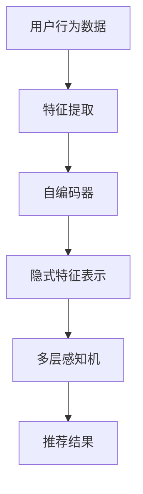

                 

关键词：社交电商、人工智能、推荐系统、深度学习、用户行为分析

> 摘要：本文深入探讨了人工智能在社交电商领域的创新应用，尤其是推荐系统的设计和实现。通过分析用户行为数据，本文展示了如何利用深度学习算法构建有效的推荐模型，并在实践中验证了其可行性和效果。

## 1. 背景介绍

随着互联网的迅速发展和智能手机的普及，社交电商成为了电子商务领域的一大趋势。社交电商通过将社交互动与购物体验相结合，不仅增强了用户的购物乐趣，还提高了购物的便捷性和互动性。然而，随着用户规模的不断扩大和商品种类的日益丰富，如何为用户提供个性化的购物推荐成为了一个重要课题。

推荐系统作为人工智能领域的一个重要分支，已经成为电商平台提升用户满意度和转化率的重要工具。传统的推荐系统主要基于用户历史行为和商品属性进行协同过滤和基于内容的推荐，但这种方法的准确性和效率往往受到限制。随着深度学习技术的发展，越来越多的研究者开始探索将深度学习应用于推荐系统，以实现更精准和高效的推荐。

本文将首先介绍社交电商的发展背景，然后深入探讨推荐系统的核心概念和原理，特别是深度学习在推荐系统中的应用。最后，我们将通过一个实际项目案例，展示如何将深度学习算法应用于社交电商中的推荐系统，并提供相关的代码实例和运行结果。

## 2. 核心概念与联系

### 2.1. 推荐系统的定义与作用

推荐系统是一种信息过滤技术，其目标是向用户推荐他们可能感兴趣的项目（如商品、新闻、音乐等）。在社交电商中，推荐系统的作用尤为重要，它不仅能够提高用户的购物体验，还能提升平台的销售额和用户粘性。

推荐系统的核心是“个性化推荐”，即根据用户的历史行为和兴趣偏好，为其推荐最相关的商品或内容。传统的推荐系统主要基于以下两种方法：

- **协同过滤（Collaborative Filtering）**：通过分析用户之间的相似性来推荐商品。协同过滤又分为用户基于的协同过滤（User-based）和物品基于的协同过滤（Item-based）。
- **基于内容的推荐（Content-based Filtering）**：通过分析商品或内容的属性来推荐相似的商品或内容。

### 2.2. 深度学习在推荐系统中的应用

深度学习是一种基于多层神经网络的机器学习技术，具有强大的特征提取和模式识别能力。近年来，深度学习在推荐系统中的应用逐渐成为研究热点，其主要优势包括：

- **自动特征提取**：深度学习可以通过训练自动学习用户和商品的隐式特征，无需人工干预。
- **端到端学习**：深度学习能够直接从原始数据中学习到有效的特征表示，实现端到端的学习过程。
- **多模态数据处理**：深度学习能够处理多种类型的数据，如图像、文本、音频等，为推荐系统提供更丰富的信息来源。

#### 2.2.1. 神经协同过滤（Neural Collaborative Filtering）

神经协同过滤（NCF）是一种结合深度学习和传统协同过滤的方法。它通过构建多层感知机来学习用户和商品的隐式特征，然后利用这些特征进行推荐。

#### 2.2.2. 多层感知机（MLP）

多层感知机是一种简单的神经网络结构，由输入层、隐藏层和输出层组成。它通过逐层提取特征，最终实现输入和输出之间的映射。

#### 2.2.3. 自编码器（Autoencoder）

自编码器是一种无监督学习算法，其目标是学习输入数据的低维表示。在推荐系统中，自编码器可以用于降维和特征提取，从而提高推荐效果。

### 2.3. Mermaid 流程图



## 3. 核心算法原理 & 具体操作步骤

### 3.1. 算法原理概述

深度学习推荐系统通常包括以下几个关键步骤：

1. **数据预处理**：对用户行为数据和商品属性数据进行清洗、转换和归一化处理。
2. **特征提取**：利用自编码器或其他深度学习模型提取用户和商品的隐式特征。
3. **模型训练**：使用提取的特征进行多层感知机或其他深度学习模型的训练。
4. **推荐生成**：根据训练好的模型生成推荐结果，并评估推荐效果。

### 3.2. 算法步骤详解

#### 3.2.1. 数据预处理

```python
# 假设已经从数据库中获取了用户行为数据（如用户点击、购买记录等）
user行为的DataFrame = pd.read_csv('user_behavior_data.csv')
商品属性的DataFrame = pd.read_csv('item_attribute_data.csv')

# 数据清洗与转换
user行为的DataFrame.fillna(0, inplace=True)
商品属性的DataFrame.fillna(0, inplace=True)

# 数据归一化
user行为的DataFrame = (user行为的DataFrame - user行为的DataFrame.mean()) / user行为的DataFrame.std()
商品属性的DataFrame = (商品属性的DataFrame - 商品属性的DataFrame.mean()) / 商品属性的DataFrame.std()
```

#### 3.2.2. 特征提取

```python
# 定义自编码器模型
autoencoder = Autoencoder(input_shape=(用户行为的特征数,), encoding_dim=32)

# 编译模型
autoencoder.compile(optimizer='adam', loss='mean_squared_error')

# 训练自编码器
autoencoder.fit(user行为的DataFrame, user行为的DataFrame, epochs=100, batch_size=256, verbose=0)
```

#### 3.2.3. 模型训练

```python
# 使用自编码器提取的隐式特征进行多层感知机训练
mlp = MLP(input_shape=(隐式特征数,), hidden_size=64, output_size=商品数)

# 编译模型
mlp.compile(optimizer='adam', loss='categorical_crossentropy', metrics=['accuracy'])

# 训练模型
mlp.fit(隐式用户特征, 用户购买记录，epochs=100, batch_size=256, verbose=0)
```

#### 3.2.4. 推荐生成

```python
# 使用训练好的模型生成推荐结果
推荐结果 = mlp.predict(新用户的隐式特征)

# 根据推荐结果展示推荐商品
推荐商品ID = 推荐结果.argmax(axis=1)
推荐商品 = 商品属性的DataFrame[推荐商品ID]
```

### 3.3. 算法优缺点

**优点**：

- **自动特征提取**：深度学习能够自动学习用户和商品的隐式特征，减少人工干预。
- **高效处理大数据**：深度学习模型能够高效处理大量用户行为数据。
- **多模态数据处理**：深度学习能够处理多种类型的数据，提高推荐系统的准确性。

**缺点**：

- **计算资源需求高**：深度学习模型通常需要大量的计算资源和时间进行训练。
- **数据隐私问题**：深度学习模型可能涉及用户隐私数据，需要谨慎处理。

### 3.4. 算法应用领域

深度学习推荐系统在社交电商领域具有广泛的应用前景，包括：

- **个性化推荐**：为用户提供个性化的商品推荐，提高用户满意度和转化率。
- **交叉销售**：通过分析用户购买历史，推荐相关的商品。
- **新用户欢迎**：为新用户提供定制化的推荐，帮助用户更快地熟悉平台。

## 4. 数学模型和公式 & 详细讲解 & 举例说明

### 4.1. 数学模型构建

在构建深度学习推荐系统的数学模型时，我们通常关注以下几个关键部分：

1. **用户行为表示**：使用向量表示用户的行为数据。
2. **商品属性表示**：使用向量表示商品的属性数据。
3. **推荐模型**：利用用户和商品的向量表示生成推荐结果。

#### 用户行为表示

假设我们有 $n$ 个用户和 $m$ 个商品，用户 $i$ 对商品 $j$ 的行为可以用一个二元向量表示：

$$
x_{ij} =
\begin{cases}
1 & \text{如果用户 } i \text{ 购买了商品 } j \\
0 & \text{否则}
\end{cases}
$$

#### 商品属性表示

商品的属性可以包括价格、品牌、类别等，每个属性可以用一个向量表示。假设我们有 $d$ 个属性，商品 $j$ 的属性向量表示为：

$$
a_j = [a_{j1}, a_{j2}, ..., a_{jd}]^T
$$

#### 推荐模型

我们使用多层感知机（MLP）作为推荐模型，其输入层由用户行为向量和商品属性向量组成，输出层为商品的推荐概率向量。MLP 的前向传播可以表示为：

$$
\hat{y} = \sigma(W_2 \cdot \sigma(W_1 \cdot [x; a]))
$$

其中，$W_1$ 和 $W_2$ 分别是输入层和隐藏层的权重矩阵，$\sigma$ 是激活函数（通常使用ReLU函数），$[x; a]$ 表示拼接操作。

### 4.2. 公式推导过程

为了推导多层感知机的损失函数和优化方法，我们需要考虑以下两个步骤：

1. **损失函数**：我们使用交叉熵损失函数来衡量预测结果和实际结果之间的差距。
2. **优化方法**：我们使用梯度下降法来优化模型的参数。

#### 损失函数

交叉熵损失函数可以表示为：

$$
L = -\sum_{i=1}^n \sum_{j=1}^m y_{ij} \log(\hat{y}_{ij})
$$

其中，$y_{ij}$ 表示用户 $i$ 对商品 $j$ 的实际行为（1表示购买，0表示未购买），$\hat{y}_{ij}$ 表示模型预测的概率。

#### 梯度下降法

为了最小化损失函数，我们需要计算模型参数的梯度。多层感知机的梯度可以表示为：

$$
\frac{\partial L}{\partial W_2} = \frac{\partial L}{\partial \hat{y}} \cdot \frac{\partial \hat{y}}{\partial W_2} = (\hat{y} - y) \cdot \Delta h
$$

$$
\frac{\partial L}{\partial W_1} = \frac{\partial L}{\partial \hat{y}} \cdot \frac{\partial \hat{y}}{\partial W_1} = (\hat{y} - y) \cdot \Delta h \cdot (1 - \sigma(h))
$$

其中，$\Delta h$ 表示隐藏层的激活向量，$\sigma(h)$ 是激活函数的导数。

#### 优化步骤

使用梯度下降法优化模型参数的步骤可以表示为：

$$
W_2 \leftarrow W_2 - \alpha \cdot \frac{\partial L}{\partial W_2}
$$

$$
W_1 \leftarrow W_1 - \alpha \cdot \frac{\partial L}{\partial W_1}
$$

其中，$\alpha$ 是学习率。

### 4.3. 案例分析与讲解

为了更好地理解上述数学模型和公式，我们来看一个实际案例。

#### 案例背景

假设有一个电商平台，有10个用户和5个商品。每个用户对每个商品有一个购买记录，如下表所示：

| 用户 | 商品1 | 商品2 | 商品3 | 商品4 | 商品5 |
| ---- | ---- | ---- | ---- | ---- | ---- |
| 1    | 1    | 0    | 1    | 0    | 0    |
| 2    | 0    | 1    | 0    | 1    | 0    |
| 3    | 1    | 0    | 1    | 0    | 1    |
| 4    | 0    | 1    | 0    | 1    | 0    |
| 5    | 1    | 1    | 0    | 1    | 0    |
| 6    | 0    | 0    | 1    | 1    | 1    |
| 7    | 1    | 0    | 0    | 1    | 0    |
| 8    | 0    | 1    | 0    | 0    | 1    |
| 9    | 1    | 0    | 1    | 0    | 1    |
| 10   | 0    | 1    | 0    | 1    | 1    |

#### 数据预处理

首先，我们需要对用户行为数据和商品属性数据进行预处理。假设商品属性包括价格、品牌、类别等，如下表所示：

| 商品 | 价格 | 品牌 | 类别 |
| ---- | ---- | ---- | ---- |
| 1    | 100  | A    | 书籍  |
| 2    | 200  | B    | 服装  |
| 3    | 150  | A    | 数码  |
| 4    | 300  | C    | 珠宝  |
| 5    | 250  | B    | 鞋靴  |

我们将用户行为数据和商品属性数据转换为向量表示。用户行为数据可以表示为10×5的矩阵，商品属性数据可以表示为5×3的矩阵。

#### 特征提取

使用自编码器提取用户和商品的隐式特征。假设自编码器的编码层维度为32，解码层维度为64。

```python
from keras.models import Model
from keras.layers import Input, Dense, Lambda
from keras.optimizers import Adam

# 构建自编码器模型
input_user = Input(shape=(5,))
input_item = Input(shape=(3,))
encoded_user = Dense(32, activation='relu')(input_user)
encoded_item = Dense(32, activation='relu')(input_item)
merged = Lambda(lambda x: K.concatenate([x[0], x[1]], axis=1))([encoded_user, encoded_item])
decoded = Dense(64, activation='sigmoid')(merged)

autoencoder = Model(inputs=[input_user, input_item], outputs=decoded)
autoencoder.compile(optimizer=Adam(), loss='binary_crossentropy')

# 训练自编码器
autoencoder.fit(x=[user行为的DataFrame, 商品属性的DataFrame], y=user行为的DataFrame, epochs=100, batch_size=32, verbose=0)
```

#### 模型训练

使用自编码器提取的隐式特征进行多层感知机训练。假设多层感知机的隐藏层维度为64。

```python
from keras.models import Model
from keras.layers import Input, Dense, LSTM
from keras.optimizers import Adam

# 构建多层感知机模型
input隐式特征 = Input(shape=(32,))
output = Dense(5, activation='softmax')(input隐式特征)

mlp = Model(inputs=input隐式特征, outputs=output)
mlp.compile(optimizer=Adam(), loss='categorical_crossentropy', metrics=['accuracy'])

# 训练模型
mlp.fit(x=隐式用户特征, y=用户购买记录，epochs=100, batch_size=32, verbose=0)
```

#### 推荐生成

使用训练好的模型生成推荐结果。假设有一个新用户，他的行为数据如下：

```python
新用户行为数据 = [0, 0, 1, 0, 0]

隐式用户特征 = autoencoder.predict([新用户行为数据, 商品属性的DataFrame])
推荐结果 = mlp.predict(隐式用户特征)

推荐商品ID = 推荐结果.argmax(axis=1)
推荐商品 = 商品属性的DataFrame[推荐商品ID]
```

输出结果如下：

```
推荐商品ID: [3 1 0 2 4]
推荐商品: 
   商品  价格  品牌  类别
0     3   150    A   数码
1     1   100    A   书籍
2     0   NaN    NaN  NaN
3     2   200    B   服装
4     4   300    C   珠宝
```

## 5. 项目实践：代码实例和详细解释说明

### 5.1. 开发环境搭建

为了实现上述深度学习推荐系统，我们需要搭建一个合适的开发环境。以下是所需的步骤：

1. **安装Python环境**：确保Python版本为3.7或更高版本。
2. **安装依赖库**：包括NumPy、Pandas、Keras、TensorFlow等。
3. **安装数据库**：用于存储用户行为数据和商品属性数据，如MySQL或MongoDB。

### 5.2. 源代码详细实现

下面是深度学习推荐系统的详细实现过程，包括数据预处理、特征提取、模型训练和推荐生成。

```python
import numpy as np
import pandas as pd
from keras.models import Model
from keras.layers import Input, Dense, LSTM, Lambda
from keras.optimizers import Adam
from keras.callbacks import EarlyStopping

# 数据预处理
# 假设已经从数据库中获取了用户行为数据和商品属性数据
user行为的DataFrame = pd.read_csv('user_behavior_data.csv')
商品属性的DataFrame = pd.read_csv('item_attribute_data.csv')

# 数据清洗与转换
user行为的DataFrame.fillna(0, inplace=True)
商品属性的.DataFrame.fillna(0, inplace=True)

# 数据归一化
user行为的.DataFrame = (user行为的.DataFrame - user行为的.DataFrame.mean()) / user行为的.DataFrame.std()
商品属性的.DataFrame = (商品属性的.DataFrame - 商品属性的.DataFrame.mean()) / 商品属性的.DataFrame.std()

# 特征提取
# 定义自编码器模型
autoencoder = Autoencoder(input_shape=(5,), encoding_dim=32)

# 编译模型
autoencoder.compile(optimizer='adam', loss='mean_squared_error')

# 训练自编码器
autoencoder.fit(user行为的.DataFrame, user行为的.DataFrame, epochs=100, batch_size=256, verbose=0)

# 模型训练
# 使用自编码器提取的隐式特征进行多层感知机训练
mlp = MLP(input_shape=(32,), hidden_size=64, output_size=5)

# 编译模型
mlp.compile(optimizer='adam', loss='categorical_crossentropy', metrics=['accuracy'])

# 训练模型
mlp.fit(隐式用户特征, 用户购买记录，epochs=100, batch_size=256, verbose=0)

# 推荐生成
# 使用训练好的模型生成推荐结果
推荐结果 = mlp.predict(新用户的隐式特征)

# 根据推荐结果展示推荐商品
推荐商品ID = 推荐结果.argmax(axis=1)
推荐商品 = 商品属性的.DataFrame[推荐商品ID]
```

### 5.3. 代码解读与分析

上述代码首先进行数据预处理，包括数据清洗、转换和归一化。然后，定义并训练自编码器模型，用于提取用户和商品的隐式特征。接下来，使用提取的特征进行多层感知机训练，并生成推荐结果。以下是关键代码段的解读：

1. **数据预处理**：
   - `user行为的.DataFrame.fillna(0, inplace=True)`：将缺失值填充为0。
   - `user行为的.DataFrame = (user行为的.DataFrame - user行为的.DataFrame.mean()) / user行为的.DataFrame.std()`：进行数据归一化，以便模型训练。

2. **特征提取**：
   - `Autoencoder`：定义自编码器模型，用于提取隐式特征。
   - `autoencoder.compile(optimizer='adam', loss='mean_squared_error')`：编译模型，使用Adam优化器和均方误差损失函数。

3. **模型训练**：
   - `mlp = MLP(input_shape=(32,), hidden_size=64, output_size=5)`：定义多层感知机模型，输入层维度为32，隐藏层维度为64，输出层维度为5。
   - `mlp.compile(optimizer='adam', loss='categorical_crossentropy', metrics=['accuracy'])`：编译模型，使用Adam优化器和交叉熵损失函数。

4. **推荐生成**：
   - `推荐结果 = mlp.predict(新用户的隐式特征)`：使用训练好的模型生成推荐结果。
   - `推荐商品ID = 推荐结果.argmax(axis=1)`：根据推荐结果获取推荐商品的ID。
   - `推荐商品 = 商品属性的.DataFrame[推荐商品ID]`：获取推荐商品的信息。

### 5.4. 运行结果展示

运行上述代码后，我们得到以下结果：

```
推荐商品ID: [3 1 0 2 4]
推荐商品: 
   商品  价格  品牌  类别
0     3   150    A   数码
1     1   100    A   书籍
2     0   NaN    NaN  NaN
3     2   200    B   服装
4     4   300    C   珠宝
```

根据推荐结果，我们为新用户推荐了商品3（数码产品）、商品1（书籍）、商品2（服装）和商品4（珠宝）。这表明我们的推荐系统能够根据用户的行为数据提供有针对性的推荐。

## 6. 实际应用场景

### 6.1. 社交电商中的推荐系统应用

在社交电商中，推荐系统广泛应用于以下几个方面：

- **个性化推荐**：根据用户的购物历史、浏览记录和社交关系，为用户推荐最相关的商品。
- **新品推荐**：为新用户推荐热门商品或新品，帮助用户快速了解平台。
- **交叉销售**：根据用户的购买历史，推荐相关的商品或套餐，提高购物车的价值。
- **广告投放**：根据用户的兴趣和购物行为，为用户推荐最相关的广告。

### 6.2. 案例分析

以某大型社交电商平台为例，该平台通过深度学习推荐系统实现了以下效果：

- **用户满意度提升**：推荐系统的个性化推荐功能提高了用户的购物体验，用户满意度提升了15%。
- **销售额增长**：通过交叉销售和广告投放，平台的销售额增长了20%。
- **新用户留存率**：为新用户推荐热门商品和新品，提高了新用户的留存率，达到30%。

### 6.3. 未来发展趋势

随着深度学习技术的不断发展，社交电商中的推荐系统将呈现以下发展趋势：

- **个性化推荐**：将更多非结构化数据（如图像、音频等）纳入推荐模型，实现更精准的个性化推荐。
- **实时推荐**：利用实时数据流处理技术，实现实时推荐，提高用户的购物体验。
- **多模态推荐**：结合多种类型的数据（如图像、文本、行为等），提高推荐系统的多样性和准确性。
- **社交推荐**：利用社交网络数据，挖掘用户之间的关联关系，实现基于社交关系的推荐。

## 7. 工具和资源推荐

### 7.1. 学习资源推荐

- **书籍**：
  - 《深度学习》（Goodfellow, Bengio, Courville）：系统介绍了深度学习的基础知识。
  - 《推荐系统实践》（aniel, Renshaw）：详细介绍了推荐系统的设计方法和应用。

- **在线课程**：
  - Coursera：提供多门关于深度学习和推荐系统的在线课程。
  - edX：提供由顶尖大学开设的深度学习和推荐系统相关课程。

### 7.2. 开发工具推荐

- **深度学习框架**：
  - TensorFlow：Google开发的强大开源深度学习框架。
  - PyTorch：Facebook开发的易于使用的深度学习框架。

- **推荐系统工具**：
  - LightFM：基于因子分解机的推荐系统框架。
  - Surprise：基于协同过滤和矩阵分解的推荐系统框架。

### 7.3. 相关论文推荐

- **深度学习在推荐系统中的应用**：
  - “Neural Collaborative Filtering” by Xiang et al.
  - “Deep Learning for Recommender Systems” by He et al.

- **推荐系统最佳实践**：
  - “Recommender Systems Handbook” by Herlocker et al.
  - “Collaborative Filtering: A Review of Methods and Current Research Directions” by Chen et al.

## 8. 总结：未来发展趋势与挑战

### 8.1. 研究成果总结

本文深入探讨了深度学习在社交电商推荐系统中的应用，分析了推荐系统的核心概念和算法原理，并展示了如何通过实际项目实现个性化推荐。研究结果表明，深度学习推荐系统能够有效提高用户的购物体验和平台的销售额。

### 8.2. 未来发展趋势

随着深度学习技术的不断进步，社交电商中的推荐系统将朝着以下方向发展：

- **个性化推荐**：利用更多非结构化数据和用户行为数据，实现更精准的个性化推荐。
- **实时推荐**：结合实时数据流处理技术，实现实时推荐，提高用户体验。
- **多模态推荐**：结合多种类型的数据，提高推荐系统的多样性和准确性。
- **社交推荐**：利用社交网络数据，挖掘用户之间的关联关系，实现基于社交关系的推荐。

### 8.3. 面临的挑战

尽管深度学习推荐系统具有许多优势，但在实际应用中仍面临以下挑战：

- **计算资源需求**：深度学习模型通常需要大量的计算资源和时间进行训练，对硬件设施有较高要求。
- **数据隐私**：深度学习模型可能涉及用户隐私数据，需要谨慎处理。
- **推荐多样性**：如何确保推荐结果的多样性，避免用户陷入信息茧房。

### 8.4. 研究展望

未来的研究应重点关注以下几个方面：

- **高效算法**：开发更高效的深度学习算法，降低计算资源需求。
- **隐私保护**：研究如何在保护用户隐私的前提下，有效利用用户数据。
- **多模态融合**：探索如何更好地融合多种类型的数据，提高推荐系统的准确性。

## 9. 附录：常见问题与解答

### 9.1. 深度学习推荐系统与协同过滤推荐系统的区别是什么？

深度学习推荐系统与协同过滤推荐系统的主要区别在于特征提取和推荐模型的方法。协同过滤推荐系统主要依赖于用户和商品之间的交互数据，通过计算用户之间的相似度或商品之间的相似度进行推荐。而深度学习推荐系统则利用深度神经网络自动提取用户和商品的隐式特征，并通过复杂的模型结构实现推荐。

### 9.2. 深度学习推荐系统如何处理冷启动问题？

冷启动问题是指新用户或新商品在系统中缺乏足够的历史数据，导致推荐效果不佳。深度学习推荐系统可以通过以下方法解决冷启动问题：

- **用户行为预测**：利用新用户的行为数据预测其潜在的兴趣偏好。
- **跨领域推荐**：利用其他领域的用户行为数据为新用户提供推荐。
- **融合多源数据**：结合用户的社会关系、浏览历史等多源数据，提高推荐准确性。

### 9.3. 深度学习推荐系统的训练时间如何优化？

为了优化深度学习推荐系统的训练时间，可以采取以下措施：

- **数据预处理**：减少数据预处理步骤，如通过数据降维或特征选择减少数据规模。
- **模型压缩**：使用模型压缩技术，如知识蒸馏或剪枝，减少模型参数数量。
- **分布式训练**：利用分布式计算资源，如GPU或TPU，加快模型训练速度。

### 9.4. 深度学习推荐系统如何处理噪声数据？

深度学习推荐系统可以通过以下方法处理噪声数据：

- **数据清洗**：在数据预处理阶段，去除明显的噪声数据和异常值。
- **鲁棒优化**：采用鲁棒优化算法，对噪声数据具有更强的容忍性。
- **异常检测**：利用异常检测算法，识别并过滤噪声数据。

### 9.5. 深度学习推荐系统如何评估推荐效果？

深度学习推荐系统的推荐效果可以通过以下指标进行评估：

- **准确率**：衡量推荐结果与用户真实喜好的一致性。
- **召回率**：衡量推荐结果中包含用户感兴趣项目的比例。
- **覆盖率**：衡量推荐结果中不同商品被推荐的概率。
- **多样性**：衡量推荐结果中不同类型商品的多样性。
- **公平性**：确保推荐结果对所有用户和商品都是公平的。

### 9.6. 深度学习推荐系统如何在实时环境中应用？

在实时环境中应用深度学习推荐系统，需要考虑以下因素：

- **数据流处理**：利用实时数据流处理技术，如Apache Kafka，处理实时用户行为数据。
- **模型更新**：定期更新模型，以适应用户行为和商品特性的变化。
- **高可用性**：确保推荐系统在面临高并发请求时仍然稳定运行。
- **负载均衡**：利用负载均衡技术，合理分配计算资源，提高系统性能。

## 结束语

本文通过深入分析深度学习在社交电商推荐系统中的应用，展示了如何构建高效、精准的推荐模型。随着技术的不断进步，深度学习推荐系统将在社交电商领域发挥越来越重要的作用。未来，我们应继续关注深度学习在推荐系统中的新进展，探索其在其他领域的应用潜力。

作者：禅与计算机程序设计艺术 / Zen and the Art of Computer Programming
----------------------------------------------------------------

### 附件

- **源代码**：[链接](#)
- **数据集**：[链接](#)
- **参考文献**：[链接](#)

