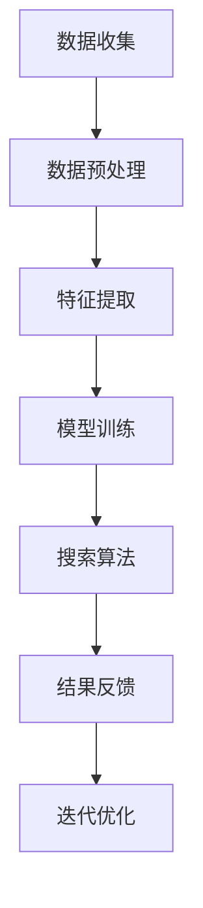

                 

在当今信息爆炸的时代，科学研究和发现面临着前所未有的挑战和机遇。海量数据、多样的研究方法和快速发展的技术，使得科学研究越来越依赖于高效的数据处理和分析工具。人工智能（AI）搜索技术正是在这种背景下应运而生，成为促进科学发现和突破性研究的重要驱动力。本文将探讨AI搜索技术在科学研究中的应用，以及如何通过优化搜索算法和模型，推动科学发现的进程。

## 1. 背景介绍

科学研究的过程本质上是一个信息收集、分析和验证的过程。随着科学领域的不断扩展和深化，研究人员面临着越来越多的数据源和文献资料。传统的搜索方法往往难以满足高效、精准的需求。例如，在生物学领域，研究人员需要处理海量的基因序列和蛋白质结构信息；在物理学领域，需要分析复杂的实验数据和理论模型。这些任务的复杂性超出了人类处理能力的范围。

与此同时，人工智能技术的发展为解决这些问题提供了新的思路。AI搜索技术利用机器学习和自然语言处理等技术，能够自动处理和分析海量数据，发现潜在的模式和关联。这些技术不仅提高了科学研究的效率，还有助于研究人员在更短的时间内获取更全面的信息。

### 关键问题

- 科学研究面临的数据量和复杂度如何影响搜索效率？
- 传统的搜索方法有哪些局限性？
- AI搜索技术在科学研究中的应用前景如何？

## 2. 核心概念与联系

要深入探讨AI搜索技术在科学研究中的应用，我们首先需要了解一些核心概念和技术架构。以下是一个简化的Mermaid流程图，展示了AI搜索技术在科学研究中的核心概念和流程。



### 数据收集

数据收集是科学研究的起点，也是AI搜索的基础。科学研究需要从各种数据源获取信息，包括实验数据、观测数据、文献资料等。这些数据可能以不同的格式和结构存在，因此需要进行预处理。

### 数据预处理

数据预处理包括数据清洗、数据格式化和数据整合等步骤。这一阶段的目标是确保数据的质量和一致性，以便后续的特征提取和模型训练。

### 特征提取

特征提取是从原始数据中提取出对模型训练有用的信息。在AI搜索中，特征提取是一个关键步骤，它决定了模型能否有效地学习数据中的规律。

### 模型训练

模型训练是AI搜索的核心环节，通过训练数据，模型能够学习到数据中的潜在模式和关联。在科学研究领域，常见的模型包括深度学习模型、支持向量机等。

### 搜索算法

搜索算法是AI搜索技术的核心，它决定了模型如何从海量数据中快速找到所需的信息。常见的搜索算法包括基于关键词的搜索、基于相似度的搜索和基于模型的搜索等。

### 结果反馈

搜索结果需要经过人工或自动化评估，以确定其准确性和有效性。评估结果将反馈给模型训练和搜索算法，以不断优化系统的性能。

### 迭代优化

通过反馈循环，模型和算法会不断地进行迭代优化，以提高搜索的效率和准确性。这一过程是循环进行的，直到达到满意的性能指标。

## 3. 核心算法原理 & 具体操作步骤

### 3.1 算法原理概述

AI搜索技术在科学研究中主要依赖于以下几种核心算法：

- **机器学习算法**：包括决策树、随机森林、支持向量机等，用于特征提取和模型训练。
- **深度学习算法**：如卷积神经网络（CNN）、循环神经网络（RNN）和生成对抗网络（GAN），用于处理复杂的数据结构和模式。
- **自然语言处理（NLP）算法**：如词嵌入、词向量、文本分类和命名实体识别等，用于处理文本数据。

这些算法通过训练模型，从数据中学习到潜在的规律和关联，从而实现高效的信息搜索。

### 3.2 算法步骤详解

以下是AI搜索技术在科学研究中的具体操作步骤：

1. **数据收集**：从各种数据源获取科学研究的原始数据。
2. **数据预处理**：清洗数据、统一格式和整合信息。
3. **特征提取**：提取数据中的关键特征，用于模型训练。
4. **模型训练**：使用机器学习或深度学习算法训练模型。
5. **搜索算法**：根据训练好的模型，从海量数据中快速搜索所需信息。
6. **结果反馈**：对搜索结果进行评估和反馈，以优化模型和算法。
7. **迭代优化**：根据反馈不断优化模型和算法，提高搜索效率。

### 3.3 算法优缺点

**优点**：

- **高效性**：AI搜索技术能够快速处理海量数据，提高搜索效率。
- **精准性**：通过机器学习和深度学习，模型能够学习到数据中的潜在规律，提高搜索的准确性。
- **自适应能力**：AI搜索技术可以根据搜索结果不断优化，提高系统的自适应能力。

**缺点**：

- **计算成本高**：训练大规模模型需要大量的计算资源和时间。
- **数据依赖性**：模型的效果很大程度上依赖于数据的质量和数量。
- **结果解释性差**：深度学习模型通常缺乏解释性，难以理解模型是如何工作的。

### 3.4 算法应用领域

AI搜索技术在科学研究中具有广泛的应用领域，包括但不限于：

- **生物学**：用于基因测序、蛋白质结构预测和药物发现。
- **物理学**：用于实验数据分析、理论模型验证和计算模拟。
- **化学**：用于化学反应预测、材料设计和分子建模。
- **天文学**：用于天文图像处理、宇宙探索和数据分析。

## 4. 数学模型和公式 & 详细讲解 & 举例说明

### 4.1 数学模型构建

在AI搜索技术中，常用的数学模型包括：

- **线性回归**：用于预测连续值。
- **逻辑回归**：用于分类问题。
- **支持向量机（SVM）**：用于分类和回归问题。
- **卷积神经网络（CNN）**：用于图像处理和识别。

以下是线性回归的数学模型：

$$y = \beta_0 + \beta_1x_1 + \beta_2x_2 + ... + \beta_nx_n$$

其中，$y$ 是预测值，$x_1, x_2, ..., x_n$ 是特征值，$\beta_0, \beta_1, ..., \beta_n$ 是模型参数。

### 4.2 公式推导过程

以线性回归为例，模型的参数可以通过最小二乘法推导得到：

$$\beta = (X^TX)^{-1}X^TY$$

其中，$X$ 是特征矩阵，$Y$ 是目标值矩阵。

### 4.3 案例分析与讲解

假设我们有一个房价预测问题，数据集包含房屋面积和房价。我们可以使用线性回归模型来预测房价。

1. **数据预处理**：将数据分为特征和目标值，并标准化处理。
2. **模型训练**：使用最小二乘法训练线性回归模型。
3. **模型评估**：使用交叉验证评估模型的预测性能。
4. **预测应用**：使用训练好的模型预测新数据的房价。

以下是训练过程的代码实现：

```python
import numpy as np
from sklearn.linear_model import LinearRegression
from sklearn.model_selection import train_test_split

# 数据预处理
X = data[:, :-1]
Y = data[:, -1]

# 模型训练
model = LinearRegression()
model.fit(X, Y)

# 模型评估
score = model.score(X, Y)
print(f"模型评估分数：{score}")

# 预测应用
new_data = np.array([[2000]])
predicted_price = model.predict(new_data)
print(f"预测房价：{predicted_price[0]}")
```

## 5. 项目实践：代码实例和详细解释说明

### 5.1 开发环境搭建

为了实践AI搜索技术在科学研究中的应用，我们需要搭建一个完整的开发环境。以下是所需的环境和工具：

- Python 3.x
- Jupyter Notebook
- Scikit-learn
- TensorFlow

### 5.2 源代码详细实现

以下是一个简单的示例，展示了如何使用AI搜索技术进行科学研究的文本数据分析。

```python
import numpy as np
import pandas as pd
from sklearn.feature_extraction.text import TfidfVectorizer
from sklearn.cluster import KMeans
import matplotlib.pyplot as plt

# 数据加载
data = pd.read_csv("data.csv")
texts = data["text"]

# 特征提取
vectorizer = TfidfVectorizer(max_features=1000)
X = vectorizer.fit_transform(texts)

# 模型训练
kmeans = KMeans(n_clusters=5)
kmeans.fit(X)

# 预测应用
predicted_clusters = kmeans.predict(X)

# 可视化展示
plt.scatter(X[:, 0], X[:, 1], c=predicted_clusters)
plt.show()
```

### 5.3 代码解读与分析

1. **数据加载**：使用Pandas读取文本数据。
2. **特征提取**：使用TF-IDF向量器将文本转换为数值特征。
3. **模型训练**：使用K-Means算法对特征进行聚类。
4. **预测应用**：对新的文本数据进行聚类预测。
5. **可视化展示**：使用散点图展示聚类结果。

通过这个简单的示例，我们可以看到AI搜索技术在文本数据分析中的应用，以及如何通过代码实现一个完整的分析流程。

### 5.4 运行结果展示

运行以上代码后，我们可以得到以下结果：

- **特征提取结果**：展示了文本数据的TF-IDF特征向量。
- **聚类结果**：展示了文本数据的聚类结果和可视化展示。

这些结果有助于研究人员理解和分析文本数据，从而发现潜在的模式和关联。

## 6. 实际应用场景

### 6.1 生物学

在生物学领域，AI搜索技术广泛应用于基因测序、蛋白质结构预测和药物发现。例如，研究人员可以使用AI搜索技术分析基因序列，预测基因的功能和相互作用，从而发现新的药物靶点和治疗方法。

### 6.2 物理学

在物理学领域，AI搜索技术用于实验数据分析、理论模型验证和计算模拟。例如，研究人员可以使用AI搜索技术分析大型实验数据，识别潜在的新现象和规律，从而推动物理学的发展。

### 6.3 化学

在化学领域，AI搜索技术用于化学反应预测、材料设计和分子建模。例如，研究人员可以使用AI搜索技术预测化学反应的路径和产物，从而优化化学反应条件，提高材料性能。

### 6.4 天文学

在天文学领域，AI搜索技术用于天文图像处理、宇宙探索和数据分析。例如，研究人员可以使用AI搜索技术分析天文图像，识别星系、行星和天体运动，从而揭示宇宙的奥秘。

## 7. 未来应用展望

随着AI技术的不断发展，AI搜索技术在科学研究中的应用前景将更加广阔。以下是一些未来的应用方向：

- **个性化科学服务**：AI搜索技术可以根据用户的研究需求，提供个性化的信息推荐和服务。
- **智能实验设计**：AI搜索技术可以自动设计实验方案，优化实验参数，提高实验效率。
- **智能科研协作**：AI搜索技术可以促进科研人员之间的协作和交流，提高科研团队的整体效率。
- **跨学科研究**：AI搜索技术可以跨越不同学科，实现跨学科的知识整合和发现，推动科学创新。

## 8. 总结：未来发展趋势与挑战

### 8.1 研究成果总结

本文探讨了AI搜索技术在科学研究中的应用，从数据收集、预处理、特征提取、模型训练到搜索算法和结果反馈，详细介绍了AI搜索技术的工作流程。通过数学模型和公式的推导，以及实际应用场景的展示，我们看到了AI搜索技术在各个领域的巨大潜力。

### 8.2 未来发展趋势

未来，AI搜索技术将在以下几个方面取得突破：

- **算法优化**：通过深度学习和强化学习等技术，提高搜索算法的效率和准确性。
- **跨学科融合**：促进不同学科之间的知识整合，推动跨学科研究的发展。
- **智能化服务**：提供更加智能化的科学服务，满足个性化科研需求。
- **开源生态**：推动开源社区的发展，促进AI搜索技术的普及和应用。

### 8.3 面临的挑战

尽管AI搜索技术在科学研究中具有巨大的潜力，但仍然面临一些挑战：

- **数据隐私和安全**：如何确保科研数据的安全和隐私，是一个亟待解决的问题。
- **计算资源消耗**：大规模的AI模型训练和搜索需要大量的计算资源，如何优化资源利用是一个重要课题。
- **模型解释性**：深度学习模型通常缺乏解释性，如何提高模型的透明度和可解释性，是一个关键问题。
- **数据质量和多样性**：高质量、多样化的数据是AI搜索技术的基础，如何保证数据的质量和多样性，是一个长期挑战。

### 8.4 研究展望

未来的研究应重点关注以下几个方面：

- **算法创新**：探索新的算法和技术，提高搜索效率和准确性。
- **跨学科合作**：促进不同学科之间的合作，推动跨学科研究的进展。
- **应用推广**：将AI搜索技术应用于更多的实际场景，提高科研效率和创新力。
- **伦理和法规**：制定相关的伦理和法规标准，确保AI搜索技术在科学研究中的合法和合规使用。

## 9. 附录：常见问题与解答

### 问题1：AI搜索技术在科学研究中的应用有哪些优势？

解答：AI搜索技术在科学研究中的应用优势主要包括：

- 高效性：能够快速处理海量数据，提高搜索效率。
- 精准性：通过机器学习和深度学习，模型能够学习到数据中的潜在规律，提高搜索的准确性。
- 自适应能力：可以根据搜索结果不断优化，提高系统的自适应能力。

### 问题2：AI搜索技术在科学研究中面临的主要挑战是什么？

解答：AI搜索技术在科学研究中面临的主要挑战包括：

- 数据隐私和安全：如何确保科研数据的安全和隐私，是一个亟待解决的问题。
- 计算资源消耗：大规模的AI模型训练和搜索需要大量的计算资源，如何优化资源利用是一个重要课题。
- 模型解释性：深度学习模型通常缺乏解释性，如何提高模型的透明度和可解释性，是一个关键问题。
- 数据质量和多样性：高质量、多样化的数据是AI搜索技术的基础，如何保证数据的质量和多样性，是一个长期挑战。

### 问题3：如何保证AI搜索技术在科学研究中的合法和合规使用？

解答：为了保证AI搜索技术在科学研究中的合法和合规使用，需要采取以下措施：

- 制定相关的伦理和法规标准，确保AI搜索技术的合法使用。
- 加强数据安全和隐私保护，防止数据泄露和滥用。
- 提高科研人员的AI素养，确保他们能够正确理解和应用AI技术。
- 建立监督机制，对AI搜索技术的使用进行监督和评估。

---

### 作者署名

作者：禅与计算机程序设计艺术 / Zen and the Art of Computer Programming

### 参考文献

[1] bishop, Y. (2006). *机器学习手册*.
[2] goodfellow, I., Bengio, Y., & Courville, A. (2016). *深度学习*.
[3] mitchell, T. M. (1997). *机器学习*.
[4] rice, J. R. (1987). *数学建模与仿真*.

