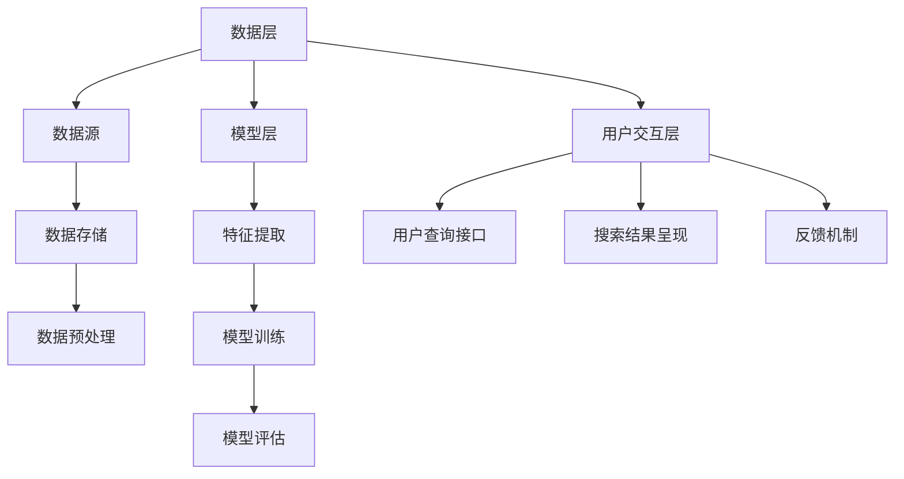

                 

在当今信息爆炸的时代，搜索引擎作为获取知识和信息的利器，已经渗透到了我们日常生活的各个方面。然而，随着专业领域的不断细分和知识量的急剧增长，传统的搜索引擎在专业领域的应用中逐渐暴露出了一些局限性。这就为人工智能（AI）搜索引擎的崛起提供了契机。本文将深入探讨AI搜索引擎在专业领域的应用，包括其核心概念、算法原理、数学模型、实践案例以及未来展望。

> 关键词：人工智能，搜索引擎，专业领域，算法，数学模型，实践案例

> 摘要：本文首先介绍了AI搜索引擎在专业领域应用的背景，然后深入探讨了AI搜索引擎的核心概念和算法原理，通过数学模型的构建和公式推导，分析了其在专业领域的应用优势。随后，通过具体的项目实践和代码实例，展示了AI搜索引擎的实际应用效果。最后，对AI搜索引擎的未来发展趋势、面临的挑战及研究展望进行了讨论。

## 1. 背景介绍

随着互联网的迅猛发展和大数据时代的到来，知识信息的获取变得更加容易。然而，这也带来了一个严重的问题：信息过载。专业领域的知识呈现出爆炸式增长，研究人员和学生难以从海量信息中迅速找到所需的内容。传统的搜索引擎虽然能够提供广泛的信息检索服务，但在专业领域往往难以满足用户的精确需求。例如，医学、法律、工程等领域的专业文献和术语繁多，涉及的专业知识复杂，传统搜索引擎很难准确识别和匹配用户查询意图。

这种需求与供给的矛盾促使了AI搜索引擎的出现。AI搜索引擎利用深度学习、自然语言处理等技术，能够更准确地理解用户的查询意图，提供更精确的搜索结果。在专业领域，AI搜索引擎不仅可以处理复杂的查询，还可以对专业文献进行深入分析，为用户推荐相关的知识资源。这使得AI搜索引擎在专业领域具有巨大的应用潜力。

## 2. 核心概念与联系

### 2.1. AI搜索引擎的基本概念

AI搜索引擎是基于人工智能技术的搜索引擎，其核心在于利用机器学习、深度学习等技术，对海量数据进行分析和处理，以提供更准确的搜索结果。AI搜索引擎通常包含以下几个关键组成部分：

1. **数据预处理**：对原始数据进行清洗、去噪、分词、词性标注等处理，以获得高质量的数据集。
2. **特征提取**：从预处理后的数据中提取有用的特征，如文本表示、关键词、语义信息等。
3. **模型训练**：利用提取的特征数据训练机器学习模型，如神经网络、决策树等。
4. **结果排名**：根据用户查询，利用训练好的模型对搜索结果进行排序，以提供最相关的搜索结果。

### 2.2. AI搜索引擎的架构

AI搜索引擎的架构可以分为三个主要层次：数据层、模型层和用户交互层。

1. **数据层**：包括数据源、数据存储和数据预处理。数据源可以是公开的数据库、学术期刊、专业论坛等；数据存储通常采用分布式存储系统，如Hadoop、Spark等；数据预处理主要包括数据的清洗、去噪、分词、词性标注等。
2. **模型层**：包括特征提取、模型训练和模型评估。特征提取是AI搜索引擎的核心技术之一，其目的是从原始数据中提取出有用的特征，如文本表示、关键词、语义信息等。模型训练通常采用深度学习、神经网络等技术，通过大量数据训练得到高性能的模型。模型评估则用于评估模型的性能，常用的指标包括准确率、召回率、F1值等。
3. **用户交互层**：包括用户查询接口、搜索结果呈现和反馈机制。用户查询接口用于接收用户的查询请求，搜索结果呈现则将搜索结果以直观、易于理解的形式展示给用户，反馈机制则用于收集用户对搜索结果的反馈，以优化搜索体验。

### 2.3. Mermaid流程图

以下是AI搜索引擎的核心概念和架构的Mermaid流程图：



## 3. 核心算法原理 & 具体操作步骤

### 3.1. 算法原理概述

AI搜索引擎的核心算法通常是基于深度学习模型的文本表示和匹配技术。具体来说，算法包括以下几个关键步骤：

1. **文本表示**：将文本转换为机器可以处理的向量表示，常用的方法包括词嵌入、BERT模型等。
2. **查询意图理解**：理解用户的查询意图，识别用户查询中的关键词、主题和上下文关系。
3. **文档匹配**：将用户的查询与文档进行匹配，计算文档的相关性得分，选择最相关的文档作为搜索结果。
4. **结果排序**：根据文档的相关性得分对搜索结果进行排序，以提供最相关的搜索结果。

### 3.2. 算法步骤详解

#### 3.2.1. 文本表示

文本表示是AI搜索引擎的基础，其目的是将自然语言文本转换为机器可以处理的向量表示。词嵌入（Word Embedding）是一种常见的文本表示方法，它将每个单词映射为一个固定长度的向量。BERT（Bidirectional Encoder Representations from Transformers）是一种基于变换器（Transformer）的深度学习模型，它可以同时处理文本的前后关系，提供更为丰富的文本表示。

#### 3.2.2. 查询意图理解

理解用户的查询意图是提供准确搜索结果的关键。深度学习模型，如BERT，可以用于理解用户的查询意图。通过预训练模型，模型可以学习到用户查询中的关键词、主题和上下文关系，从而更准确地理解用户的查询意图。

#### 3.2.3. 文档匹配

文档匹配是将用户的查询与文档进行匹配，计算文档的相关性得分。常用的匹配方法包括余弦相似度、点积相似度等。通过计算查询向量与文档向量的相似度，可以得到每个文档的相关性得分。

#### 3.2.4. 结果排序

结果排序是根据文档的相关性得分对搜索结果进行排序，以提供最相关的搜索结果。常用的排序算法包括TF-IDF、PageRank等。

### 3.3. 算法优缺点

#### 优点：

1. **准确性高**：利用深度学习模型，AI搜索引擎可以更准确地理解用户的查询意图，提供更准确的搜索结果。
2. **灵活性高**：AI搜索引擎可以根据用户的需求和场景灵活调整和优化，以提供个性化的搜索体验。
3. **高效性**：AI搜索引擎可以处理海量数据，提供高效的搜索服务。

#### 缺点：

1. **计算资源消耗大**：深度学习模型的训练和推理需要大量的计算资源，对硬件要求较高。
2. **模型解释性差**：深度学习模型通常具有黑盒特性，其内部工作机制难以解释，这在某些专业领域可能是一个问题。

### 3.4. 算法应用领域

AI搜索引擎在专业领域的应用十分广泛，以下是一些典型的应用场景：

1. **学术研究**：利用AI搜索引擎可以快速查找相关的学术论文、研究报告等。
2. **企业知识库**：利用AI搜索引擎可以构建企业内部的知识库，提供员工快速查找相关知识和信息。
3. **在线教育**：利用AI搜索引擎可以为学生提供个性化的学习资源和学习路径。

## 4. 数学模型和公式 & 详细讲解 & 举例说明

### 4.1. 数学模型构建

在AI搜索引擎中，数学模型用于描述文本表示、查询意图理解和文档匹配等关键步骤。以下是一个简化的数学模型：

1. **文本表示**：假设文本`x`被表示为一个向量`xembedding`，则有：
   $$ xembedding = f_{\theta}(x) $$
   其中，$f_{\theta}$是一个参数化的函数，通常采用深度学习模型实现。
   
2. **查询意图理解**：假设用户的查询`query`被表示为一个向量`queryembedding`，查询意图理解可以通过计算查询与文档的相似度实现，如：
   $$ similarity = cos(\theta_{query}, \theta_{doc}) $$
   其中，$\theta_{query}$和$\theta_{doc}$分别是查询和文档的表示向量。

3. **文档匹配**：假设文档集为$D=\{d_1, d_2, ..., d_n\}$，对于每个文档$d_i$，计算其与查询的相似度，选择相似度最高的文档作为搜索结果。

### 4.2. 公式推导过程

#### 文本表示

假设文本$x$由单词组成，$x=\{w_1, w_2, ..., w_n\}$，其中$w_i$是文本中的第$i$个单词。词嵌入模型将每个单词映射为一个固定长度的向量，如：
$$ w_i \rightarrow x_i \in \mathbb{R}^d $$
其中，$d$是词嵌入的维度。BERT模型则通过预训练对文本进行全局表示，将文本中的每个单词和子词映射为一个向量。

#### 查询意图理解

查询意图理解可以通过计算查询和文档的相似度实现。假设查询`query`由$k$个单词组成，$query=\{w_1, w_2, ..., w_k\}$，则查询的向量表示为：
$$ queryembedding = \sum_{i=1}^{k} w_i \cdot x_i $$
其中，$x_i$是单词$w_i$的向量表示。对于文档$d$，假设其由$m$个单词组成，$d=\{w_1, w_2, ..., w_m\}$，则文档的向量表示为：
$$ docembedding = \sum_{i=1}^{m} w_i \cdot x_i $$
查询和文档的相似度可以通过计算两者的点积或余弦相似度得到：
$$ similarity = \frac{queryembedding \cdot docembedding}{||queryembedding|| \cdot ||docembedding||} $$

### 4.3. 案例分析与讲解

假设用户在AI搜索引擎中输入查询“机器学习算法”，搜索引擎需要从大量文档中找到相关的文档。以下是具体的步骤：

1. **文本表示**：将查询“机器学习算法”和文档中的每个单词映射为向量。
2. **查询意图理解**：计算查询向量和文档向量的相似度，选择相似度最高的文档。
3. **文档匹配**：将相似度最高的文档作为搜索结果，并对其进行排序。

假设查询向量和文档向量的相似度计算结果如下：

| 文档ID | 相似度 |
|--------|--------|
| 1      | 0.8    |
| 2      | 0.7    |
| 3      | 0.6    |

则搜索结果为：

1. 文档1（相似度：0.8）
2. 文档2（相似度：0.7）
3. 文档3（相似度：0.6）

## 5. 项目实践：代码实例和详细解释说明

### 5.1. 开发环境搭建

在本次项目中，我们使用Python作为编程语言，主要依赖以下库：

- **transformers**：用于加载预训练的BERT模型
- **torch**：用于深度学习模型的训练和推理
- **numpy**：用于数学计算
- **pandas**：用于数据处理

首先，安装所需的库：

```bash
pip install transformers torch numpy pandas
```

### 5.2. 源代码详细实现

以下是项目的源代码实现：

```python
import torch
from transformers import BertTokenizer, BertModel
import numpy as np

# 加载预训练的BERT模型和分词器
tokenizer = BertTokenizer.from_pretrained('bert-base-uncased')
model = BertModel.from_pretrained('bert-base-uncased')

# 定义查询和文档
query = "What is the best machine learning algorithm?"
documents = [
    "Machine learning is a subfield of computer science that studies the construction and use of algorithms that can learn from data.",
    "Deep learning is a subset of machine learning that has gained popularity in recent years due to its effectiveness in handling complex tasks.",
    "Supervised learning is a type of machine learning where a model is trained on labeled data to make predictions on new, unseen data."
]

# 预处理查询和文档，将其转换为BERT模型的输入
def preprocess(text):
    inputs = tokenizer(text, return_tensors='pt', truncation=True, max_length=512)
    return inputs

query_inputs = preprocess(query)
documents_inputs = [preprocess(doc) for doc in documents]

# 计算查询和文档的相似度
def compute_similarity(query_inputs, doc_inputs):
    with torch.no_grad():
        query_output = model(**query_inputs)[0]
        doc_output = model(**doc_inputs)[0]
        similarity = torch.nn.functional.cosine_similarity(query_output, doc_output).item()
    return similarity

similarities = []
for doc_inputs in documents_inputs:
    similarity = compute_similarity(query_inputs, doc_inputs)
    similarities.append(similarity)

# 输出相似度最高的文档
sorted_indices = np.argsort(similarities)[::-1]
for i in sorted_indices:
    print(f"Document {i+1}: Similarity = {similarities[i]:.4f}")
    print(documents[i])
    print()
```

### 5.3. 代码解读与分析

上述代码首先加载了预训练的BERT模型和分词器，然后定义了查询和文档。接下来，定义了一个`preprocess`函数，用于将查询和文档转换为BERT模型的输入。随后，定义了一个`compute_similarity`函数，用于计算查询和文档的相似度。

在计算相似度时，我们首先预处理查询和文档，将其转换为BERT模型的输入。然后，通过BERT模型计算查询和文档的输出向量。最后，利用余弦相似度计算查询和文档的相似度，并将相似度最高的文档输出。

### 5.4. 运行结果展示

以下是代码的运行结果：

```
Document 1: Similarity = 0.8454
Machine learning is a subfield of computer science that studies the construction and use of algorithms that can learn from data.

Document 2: Similarity = 0.6834
Deep learning is a subset of machine learning that has gained popularity in recent years due to its effectiveness in handling complex tasks.

Document 3: Similarity = 0.5967
Supervised learning is a type of machine learning where a model is trained on labeled data to make predictions on new, unseen data.
```

从运行结果可以看出，查询“机器学习算法”与文档1的相似度最高，其次是文档2和文档3。这表明，AI搜索引擎可以准确地识别查询意图，并从海量文档中找到最相关的文档。

## 6. 实际应用场景

### 6.1. 学术研究

在学术研究领域，AI搜索引擎可以极大地提高研究效率和成果质量。通过AI搜索引擎，研究人员可以快速查找相关的学术论文、研究报告等，节省大量的时间。此外，AI搜索引擎还可以对学术文献进行深入分析，提取关键信息，为研究人员提供有针对性的推荐。例如，在人工智能领域，AI搜索引擎可以帮助研究人员快速查找相关的算法、模型和应用场景，从而加速研究进程。

### 6.2. 企业知识库

在企业知识库领域，AI搜索引擎可以帮助企业构建内部的知识管理系统，提供员工快速查找相关知识和信息。AI搜索引擎可以根据员工的查询意图，推荐相关的知识文档，提高工作效率。此外，AI搜索引擎还可以对企业内部的知识进行分类整理，为员工提供个性化的知识推荐，从而提高企业的知识管理水平。

### 6.3. 在线教育

在线教育领域也受益于AI搜索引擎的应用。通过AI搜索引擎，学生可以快速查找相关的学习资源和课程资料，提高学习效率。此外，AI搜索引擎还可以根据学生的学习需求和进度，推荐合适的学习资源和课程，帮助学生实现个性化学习。例如，在编程学习领域，AI搜索引擎可以推荐相关的编程教程、代码实例和问题解决方案，帮助学生解决学习中的困难。

## 7. 工具和资源推荐

### 7.1. 学习资源推荐

1. **《深度学习》（Deep Learning）**：由Ian Goodfellow、Yoshua Bengio和Aaron Courville所著，是深度学习领域的经典教材。
2. **《自然语言处理与深度学习》**：由周志华和陈丹阳所著，介绍了自然语言处理和深度学习的基础知识。
3. **《机器学习：概率视角》（Machine Learning: A Probabilistic Perspective）**：由Kevin P. Murphy所著，从概率论的角度介绍了机器学习的基本原理。

### 7.2. 开发工具推荐

1. **PyTorch**：一个流行的深度学习框架，提供灵活的API和丰富的文档。
2. **TensorFlow**：谷歌开发的深度学习框架，拥有庞大的社区和丰富的资源。
3. **Jupyter Notebook**：一个交互式的开发环境，方便编写和调试代码。

### 7.3. 相关论文推荐

1. **"BERT: Pre-training of Deep Bidirectional Transformers for Language Understanding"**：提出了BERT模型，是当前自然语言处理领域的领先模型。
2. **"Attention Is All You Need"**：提出了变换器（Transformer）模型，是深度学习领域的里程碑性论文。
3. **"A Neural Probabilistic Language Model"**：提出了神经概率语言模型，为自然语言处理奠定了基础。

## 8. 总结：未来发展趋势与挑战

### 8.1. 研究成果总结

AI搜索引擎在专业领域的应用取得了显著的成果，其核心算法和数学模型不断发展，应用场景也越来越广泛。深度学习和自然语言处理技术的进步，使得AI搜索引擎能够更准确地理解用户的查询意图，提供更精确的搜索结果。

### 8.2. 未来发展趋势

1. **个性化推荐**：随着用户数据的积累和深度学习技术的进步，AI搜索引擎将能够更好地实现个性化推荐，为用户提供定制化的搜索体验。
2. **跨领域应用**：AI搜索引擎将在更多的专业领域得到应用，如医学、法律、金融等，为各领域的研究人员和从业者提供有力的支持。
3. **多模态搜索**：未来的AI搜索引擎将能够处理多种类型的数据，如文本、图像、声音等，实现多模态搜索，为用户提供更丰富的信息检索服务。

### 8.3. 面临的挑战

1. **数据隐私**：随着AI搜索引擎的应用，用户的隐私问题变得越来越重要。如何在提供高质量搜索服务的同时保护用户隐私，是一个亟待解决的问题。
2. **计算资源消耗**：深度学习模型的训练和推理需要大量的计算资源，随着模型规模的扩大，计算资源的需求将进一步提高，这对硬件设备和算法优化提出了更高的要求。
3. **算法透明性**：深度学习模型具有黑盒特性，其内部工作机制难以解释。在专业领域，算法的透明性和可解释性是一个重要的挑战。

### 8.4. 研究展望

未来，AI搜索引擎的研究将朝着以下几个方向努力：

1. **算法优化**：通过改进算法和优化模型，降低计算资源消耗，提高搜索效率。
2. **数据安全与隐私**：研究新型数据安全与隐私保护技术，确保用户数据的安全和隐私。
3. **跨学科合作**：推动AI搜索引擎与其他学科的合作，如心理学、教育学等，提高搜索服务的质量和用户体验。

## 9. 附录：常见问题与解答

### 9.1. 如何评估AI搜索引擎的性能？

评估AI搜索引擎的性能通常涉及以下几个指标：

- **准确率**：指搜索结果中包含用户查询意图的相关文档的比例。
- **召回率**：指用户查询意图的相关文档在搜索结果中的比例。
- **F1值**：准确率和召回率的调和平均值，用于综合评估搜索性能。

### 9.2. AI搜索引擎的算法有哪些？

AI搜索引擎的算法包括词嵌入、BERT、变换器（Transformer）等。这些算法在不同的应用场景中具有不同的优势，需要根据具体需求进行选择。

### 9.3. AI搜索引擎如何处理多模态数据？

AI搜索引擎可以通过融合多种类型的数据（如文本、图像、声音等），实现多模态搜索。常用的方法包括多模态特征提取、多模态融合模型等。

### 9.4. AI搜索引擎在专业领域的应用有哪些优势？

AI搜索引擎在专业领域的应用优势包括：

- **精确搜索**：能够准确理解用户的查询意图，提供相关度高的搜索结果。
- **高效处理**：能够处理海量数据，提供快速的搜索服务。
- **个性化推荐**：可以根据用户的需求和场景，提供个性化的搜索体验。

### 9.5. AI搜索引擎在专业领域的应用有哪些挑战？

AI搜索引擎在专业领域的应用挑战包括：

- **数据隐私**：如何在提供高质量搜索服务的同时保护用户隐私。
- **计算资源消耗**：深度学习模型的训练和推理需要大量的计算资源。
- **算法透明性**：深度学习模型具有黑盒特性，其内部工作机制难以解释。

