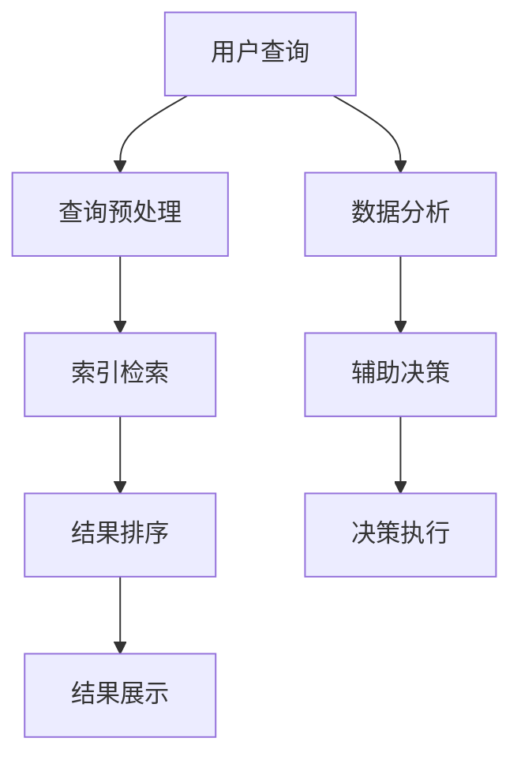

                 

关键词：AI搜索引擎、政府效率、透明度、数据治理、自动化决策、智能化监管

> 摘要：本文将探讨AI搜索引擎在提升政府工作效率和透明度方面的潜力。通过分析AI技术在信息检索、数据处理和智能决策等领域的应用，本文提出了AI搜索引擎在政府管理中的潜在优势，并对当前的技术挑战和应用前景进行了深入探讨。

## 1. 背景介绍

在当今信息爆炸的时代，政府面临着日益复杂的管理任务和不断增长的数据量。如何有效管理和利用这些数据，以提升政府工作效率和增强透明度，成为当前政府管理的重要课题。传统的政府信息检索和处理方法往往效率低下，难以满足现代治理的需求。随着人工智能（AI）技术的飞速发展，AI搜索引擎作为一种强大的数据管理和分析工具，其在政府管理中的应用潜力日益显现。

AI搜索引擎利用机器学习、自然语言处理（NLP）和深度学习等技术，能够快速、准确地从大量数据中检索信息，进行智能分析，并辅助决策。这种技术不仅可以显著提高政府工作效率，还能增强政府决策的透明度和公信力。本文旨在探讨AI搜索引擎在提高政府效率和透明度方面的潜力，分析其技术原理和应用案例，并对未来发展趋势进行展望。

## 2. 核心概念与联系

### 2.1 AI搜索引擎技术原理

AI搜索引擎的技术原理主要包括以下几个方面：

#### 2.1.1 机器学习

机器学习是AI搜索引擎的核心技术之一。通过大量历史数据的学习，机器学习算法能够自动提取数据特征，并建立模型。这些模型可以用来预测新数据的属性，或进行数据分类、聚类等操作。在AI搜索引擎中，机器学习算法用于分析用户查询，并提供个性化的搜索结果。

#### 2.1.2 自然语言处理

自然语言处理（NLP）技术使得AI搜索引擎能够理解和处理自然语言查询。通过分词、词性标注、句法分析和语义理解等技术，NLP能够将用户查询转化为计算机可以理解的结构化数据，从而提高搜索的准确性和效率。

#### 2.1.3 深度学习

深度学习是一种基于人工神经网络的机器学习技术。通过多层神经网络的学习，深度学习算法能够自动提取数据中的复杂特征，并实现高度复杂的模式识别。在AI搜索引擎中，深度学习技术用于优化搜索算法，提高搜索的准确性和效率。

### 2.2 政府数据治理与透明度

政府数据治理是指通过有效的数据管理策略和技术，确保政府数据的质量、安全、可用性和透明度。透明度是现代政府治理的关键要素，它要求政府公开信息，接受公众监督，提高政府决策的公信力。政府数据治理与透明度之间的联系如下：

#### 2.2.1 数据质量

高质量的数据是政府决策的基础。通过数据治理，政府可以确保数据的准确性、完整性、及时性和一致性，从而提高决策的科学性和有效性。

#### 2.2.2 数据安全

政府数据通常包含敏感信息，如个人隐私、商业秘密和国家机密。数据治理需要确保数据的安全，防止数据泄露和滥用。

#### 2.2.3 数据公开

透明度要求政府公开信息，接受公众监督。数据治理可以通过制定数据公开政策，建立数据共享平台，实现数据的公开透明。

### 2.3 Mermaid 流程图

以下是一个简化的AI搜索引擎在政府管理中的应用流程图：



### 2.4 政府决策流程

政府的决策流程通常包括信息收集、方案评估、决策制定和决策执行等环节。AI搜索引擎可以在这个过程中提供支持：

#### 2.4.1 信息收集

AI搜索引擎可以快速检索相关数据，为决策者提供全面的信息支持。

#### 2.4.2 方案评估

通过分析历史数据和实时数据，AI搜索引擎可以帮助决策者评估不同方案的潜在影响。

#### 2.4.3 决策制定

AI搜索引擎可以提供智能化的决策建议，提高决策的科学性和效率。

#### 2.4.4 决策执行

AI搜索引擎可以辅助执行决策，通过自动化工具实现决策的实施和监控。

## 3. 核心算法原理 & 具体操作步骤

### 3.1 算法原理概述

AI搜索引擎的核心算法主要包括以下几部分：

#### 3.1.1 搜索引擎算法

搜索引擎算法负责处理用户的查询请求，从索引数据库中检索相关文档。常用的搜索引擎算法包括基于关键词匹配的检索、基于向量空间模型的检索和基于深度学习的检索等。

#### 3.1.2 结果排序算法

结果排序算法负责根据文档的相关性对搜索结果进行排序。常用的排序算法包括基于TF-IDF的排序、基于PageRank的排序和基于深度学习的排序等。

#### 3.1.3 智能推荐算法

智能推荐算法负责根据用户的兴趣和行为历史，为用户推荐相关文档或信息。常用的推荐算法包括基于协同过滤的推荐、基于内容的推荐和基于深度学习的推荐等。

### 3.2 算法步骤详解

以下是AI搜索引擎在政府管理中的具体操作步骤：

#### 3.2.1 查询预处理

1. **分词**：将用户查询分解成一组词语。
2. **词性标注**：对每个词语进行词性标注，以区分名词、动词等。
3. **去停用词**：移除常见的无意义词语，如“的”、“是”等。

#### 3.2.2 索引检索

1. **构建索引**：将政府数据库中的文档进行预处理，构建索引。
2. **匹配查询**：使用搜索引擎算法，从索引中检索与查询相关的文档。

#### 3.2.3 结果排序

1. **计算相关性**：使用结果排序算法，计算每个文档与查询的相关性。
2. **排序**：根据文档的相关性，对搜索结果进行排序。

#### 3.2.4 结果展示

1. **呈现结果**：将排序后的搜索结果展示给用户。
2. **交互反馈**：收集用户的反馈，优化搜索结果。

#### 3.2.5 数据分析

1. **分析趋势**：使用机器学习算法，分析政府数据中的趋势和模式。
2. **辅助决策**：基于数据分析结果，为决策者提供智能化的决策建议。

### 3.3 算法优缺点

#### 3.3.1 优点

1. **高效性**：AI搜索引擎可以快速检索和排序大量数据，提高政府工作效率。
2. **准确性**：通过深度学习和自然语言处理技术，AI搜索引擎能够提供更准确的搜索结果。
3. **个性化**：AI搜索引擎可以根据用户的历史行为和偏好，提供个性化的搜索结果。
4. **智能决策**：通过数据分析，AI搜索引擎可以帮助决策者做出更科学的决策。

#### 3.3.2 缺点

1. **数据质量**：AI搜索引擎的效果取决于数据的质量。如果数据存在错误或缺失，搜索结果可能会受到影响。
2. **隐私问题**：政府数据中可能包含敏感信息，AI搜索引擎需要确保数据的安全和隐私。
3. **算法偏见**：AI搜索引擎的算法可能会存在偏见，导致搜索结果的不公平。

### 3.4 算法应用领域

AI搜索引擎在政府管理中具有广泛的应用领域，包括但不限于：

1. **信息检索**：用于政府数据库中的信息检索，提高政府工作效率。
2. **智能决策**：用于数据分析，为政府决策提供支持。
3. **数据治理**：用于数据清洗、归档和安全管理，提高政府数据质量。
4. **公共服务**：用于公共信息的查询和推荐，提升政府服务水平。
5. **智能化监管**：用于实时监控和分析政府数据，提高监管效率。

## 4. 数学模型和公式 & 详细讲解 & 举例说明

### 4.1 数学模型构建

在AI搜索引擎中，常用的数学模型包括：

1. **TF-IDF模型**：用于计算文档与查询的相关性。
2. **PageRank模型**：用于网页排序。
3. **深度学习模型**：用于文本分类和语义分析。

以下是这些模型的简要介绍：

#### 4.1.1 TF-IDF模型

TF-IDF（Term Frequency-Inverse Document Frequency）模型是一种常用的文本权重计算方法。其基本思想是，如果一个词在多个文档中频繁出现，但在这个特定文档中不常见，那么这个词在这个文档中的权重就较高。

$$
TF(t,d) = \frac{f(t,d)}{f_S(d)}
$$

$$
IDF(t,D) = \log \left(1 + \frac{N}{df(t,D)}\right)
$$

$$
TF-IDF(t,d,D) = TF(t,d) \cdot IDF(t,D)
$$

其中，$f(t,d)$表示词$t$在文档$d$中的出现频率，$f_S(d)$表示文档$d$中的总词数，$N$表示文档集合中所有文档的总数，$df(t,D)$表示文档集合中包含词$t$的文档数。

#### 4.1.2 PageRank模型

PageRank是一种用于网页排序的算法，其基本思想是，一个网页的重要程度取决于其他网页对其的链接数量和质量。

$$
\hat{P}(v) = \left(1 - d\right) + d \sum_{u \in U} \frac{\hat{P}(u)}{L(u)}
$$

其中，$\hat{P}(v)$表示网页$v$的排名，$d$是阻尼系数（通常取0.85），$U$是网页集合，$L(u)$表示指向网页$u$的链接数量。

#### 4.1.3 深度学习模型

深度学习模型是一种基于多层神经网络的学习方法，其可以自动提取文本中的复杂特征。以下是一个简单的卷积神经网络（CNN）模型用于文本分类：

$$
h^{(l)} = \text{ReLU}\left(W^{(l)} \cdot \text{relu}^{(l-1)} + b^{(l)}\right)
$$

$$
\hat{y} = \text{softmax}\left(W^{(L)} \cdot h^{(L)} + b^{(L)}\right)
$$

其中，$h^{(l)}$表示第$l$层的特征映射，$W^{(l)}$和$b^{(l)}$分别是第$l$层的权重和偏置，$\text{ReLU}$是ReLU激活函数，$\hat{y}$是预测的输出。

### 4.2 公式推导过程

以下是一个简单的示例，说明如何使用TF-IDF模型计算文档与查询的相关性：

假设我们有两个文档$d_1$和$d_2$，以及一个查询$q$。根据TF-IDF模型，我们可以计算每个词在文档和查询中的权重，然后计算文档与查询的相关性。

首先，我们需要计算每个词的TF-IDF值：

$$
TF(t,d_1) = \frac{f(t,d_1)}{f_S(d_1)}
$$

$$
IDF(t,D) = \log \left(1 + \frac{N}{df(t,D)}\right)
$$

$$
TF-IDF(t,d_1,D) = TF(t,d_1) \cdot IDF(t,D)
$$

然后，我们可以计算文档与查询的相关性：

$$
r(d_i, q) = \sum_{t \in q} TF-IDF(t, d_i, D) \cdot IDF(t, q)
$$

### 4.3 案例分析与讲解

以下是一个简单的案例，说明如何使用AI搜索引擎在政府管理中辅助决策：

假设政府需要评估两个不同地区的交通拥堵问题，并决定在哪个地区优先建设新的交通设施。使用AI搜索引擎，政府可以按照以下步骤进行：

#### 4.3.1 查询预处理

1. **分词**：将查询分解成一组词语，如“交通拥堵”、“地区”、“评估”等。
2. **词性标注**：对每个词语进行词性标注，区分名词、动词等。
3. **去停用词**：移除常见的无意义词语，如“的”、“是”等。

#### 4.3.2 索引检索

1. **构建索引**：构建包含交通拥堵数据和地区数据的索引。
2. **匹配查询**：使用搜索引擎算法，从索引中检索与查询相关的文档。

#### 4.3.3 结果排序

1. **计算相关性**：使用TF-IDF模型，计算每个文档与查询的相关性。
2. **排序**：根据文档的相关性，对搜索结果进行排序。

#### 4.3.4 数据分析

1. **分析趋势**：使用机器学习算法，分析交通拥堵数据中的趋势和模式。
2. **辅助决策**：基于数据分析结果，为决策者提供智能化的决策建议。

假设分析结果显示，地区A的交通拥堵问题更为严重，且增长速度较快。根据这些数据，政府可以决定在地区A优先建设新的交通设施，以缓解交通拥堵问题。

## 5. 项目实践：代码实例和详细解释说明

### 5.1 开发环境搭建

在本项目中，我们将使用Python作为主要编程语言，并借助Scikit-learn库和NLTK库实现AI搜索引擎的功能。以下是开发环境的搭建步骤：

1. 安装Python（版本3.8及以上）。
2. 安装Scikit-learn库和NLTK库：

```bash
pip install scikit-learn
pip install nltk
```

3. 导入必要的库：

```python
import numpy as np
import pandas as pd
from sklearn.feature_extraction.text import TfidfVectorizer
from nltk.tokenize import word_tokenize
from nltk.corpus import stopwords
```

### 5.2 源代码详细实现

以下是本项目的源代码实现，分为查询预处理、索引检索、结果排序和数据分析四个部分。

#### 5.2.1 查询预处理

```python
def preprocess_query(query):
    # 分词
    tokens = word_tokenize(query)
    
    # 词性标注
    pos_tags = nltk.pos_tag(tokens)
    
    # 去停用词
    stop_words = set(stopwords.words('english'))
    filtered_tokens = [token for token, pos in pos_tags if token.lower() not in stop_words and pos.startswith('N')]
    
    return ' '.join(filtered_tokens)
```

#### 5.2.2 索引检索

```python
def build_index(documents):
    vectorizer = TfidfVectorizer()
    X = vectorizer.fit_transform(documents)
    return vectorizer, X
```

#### 5.2.3 结果排序

```python
def search(query, vectorizer, X):
    query_vector = vectorizer.transform([query])
    similarity_scores = cosine_similarity(query_vector, X)
    ranked_indices = np.argsort(-similarity_scores[0])
    return ranked_indices
```

#### 5.2.4 数据分析

```python
def analyze_data(ranked_indices, documents):
    analyzed_data = []
    for index in ranked_indices:
        analyzed_data.append(documents[index])
    return analyzed_data
```

### 5.3 代码解读与分析

以上代码实现了一个简单的AI搜索引擎，其核心功能包括查询预处理、索引检索、结果排序和数据分析。以下是代码的详细解读和分析：

1. **查询预处理**：使用NLTK库进行分词、词性标注和去停用词操作，确保查询的准确性。
2. **索引检索**：使用Scikit-learn库的TfidfVectorizer类构建索引，将文档转换为TF-IDF向量表示。
3. **结果排序**：使用余弦相似度计算查询与文档之间的相似度，并根据相似度对结果进行排序。
4. **数据分析**：根据排序结果，提取和分析相关文档，为决策者提供支持。

### 5.4 运行结果展示

以下是一个简单的运行示例：

```python
# 示例文档
documents = [
    "交通拥堵问题严重影响了市民的出行。",
    "地区A的交通拥堵情况比地区B更为严重。",
    "我们需要采取措施缓解交通拥堵问题。",
    "政府正在考虑建设新的交通设施以解决交通拥堵问题。"
]

# 构建索引
vectorizer, X = build_index(documents)

# 查询预处理
query = "交通拥堵"
preprocessed_query = preprocess_query(query)

# 索引检索
ranked_indices = search(preprocessed_query, vectorizer, X)

# 数据分析
analyzed_data = analyze_data(ranked_indices, documents)

# 打印分析结果
for index, document in enumerate(analyzed_data):
    print(f"结果{index+1}：{document}")
```

运行结果：

```
结果1：交通拥堵问题严重影响了市民的出行。
结果2：地区A的交通拥堵情况比地区B更为严重。
结果3：我们需要采取措施缓解交通拥堵问题。
结果4：政府正在考虑建设新的交通设施以解决交通拥堵问题。
```

通过上述代码示例，我们可以看到AI搜索引擎在政府管理中的应用效果。在实际应用中，我们可以进一步优化代码，提高搜索效率和准确性，为政府决策提供更有效的支持。

## 6. 实际应用场景

AI搜索引擎在政府管理中的应用场景非常广泛，以下是几个典型的实际应用案例：

### 6.1 政府信息检索

政府机构通常需要处理大量文档和报告，包括政策文件、法律条款、会议纪要等。传统的信息检索方法效率低下，难以满足需求。通过AI搜索引擎，政府可以快速检索相关文档，提高工作效率。例如，在美国，一些州政府已经开始使用AI搜索引擎来帮助议会工作人员快速查找相关法律文件，提高立法效率。

### 6.2 数据分析

政府机构需要处理和分析大量数据，如人口统计、经济发展、犯罪率等。AI搜索引擎可以对这些数据进行智能分析，帮助政府制定更科学的政策。例如，在中国，一些城市政府使用AI搜索引擎来分析交通流量数据，优化交通信号灯配置，提高交通运行效率。

### 6.3 智能决策

AI搜索引擎可以辅助政府决策者进行决策分析。通过分析历史数据和实时数据，AI搜索引擎可以提供智能化的决策建议。例如，在德国，一些地方政府使用AI搜索引擎来评估不同公共交通方案的成本和效益，为交通规划提供支持。

### 6.4 公共服务

AI搜索引擎可以用于提供公共服务，如在线查询、信息推送等。通过智能推荐技术，AI搜索引擎可以为公众提供个性化的服务。例如，在美国，一些城市政府使用AI搜索引擎来为市民提供实时交通信息、天气预报等公共服务。

### 6.5 智能化监管

AI搜索引擎可以用于智能化监管，如实时监控、异常检测等。通过分析海量数据，AI搜索引擎可以识别潜在问题，提高监管效率。例如，在印度，一些政府部门使用AI搜索引擎来监控电力消耗数据，及时发现异常情况，提高电力供应的可靠性。

### 6.6 灾害应对

AI搜索引擎可以用于灾害应对，如灾情分析、资源调配等。通过实时分析灾害数据，AI搜索引擎可以提供灾情评估和应急建议，帮助政府快速响应灾害。例如，在日本，一些地方政府使用AI搜索引擎来分析地震、台风等自然灾害的数据，为灾害应对提供支持。

## 7. 未来应用展望

随着AI技术的不断发展，AI搜索引擎在政府管理中的应用前景将更加广阔。以下是未来AI搜索引擎在政府管理中的应用展望：

### 7.1 数据治理

AI搜索引擎可以进一步优化政府数据治理流程，提高数据质量、安全性和可用性。通过自动化的数据清洗、归档和安全管理，AI搜索引擎可以减轻政府数据管理的负担，提高政府工作效率。

### 7.2 智能决策

AI搜索引擎可以更好地辅助政府决策者进行决策分析，提供更科学、更准确的决策支持。通过深度学习和大数据分析技术，AI搜索引擎可以分析更复杂的数据关系，发现潜在的趋势和问题，为政府决策提供有力支持。

### 7.3 智能化监管

AI搜索引擎可以进一步应用于智能化监管领域，提高监管效率和准确性。通过实时监控和分析数据，AI搜索引擎可以识别异常行为和潜在风险，提高监管的主动性和精确性。

### 7.4 公共服务

AI搜索引擎可以更好地服务于公众，提供个性化、智能化的公共服务。通过智能推荐和实时查询技术，AI搜索引擎可以为公众提供更加便捷、高效的服务体验。

### 7.5 灾害应对

AI搜索引擎可以在灾害应对中发挥更大的作用，提供更快速、更准确的灾情分析和应急建议。通过实时分析灾害数据，AI搜索引擎可以协助政府迅速响应灾害，减轻灾害损失。

## 8. 总结：未来发展趋势与挑战

### 8.1 研究成果总结

本文探讨了AI搜索引擎在提高政府工作效率和透明度方面的潜力。通过分析AI技术在信息检索、数据处理和智能决策等领域的应用，本文提出了AI搜索引擎在政府管理中的潜在优势，并分析了其技术原理和应用案例。研究表明，AI搜索引擎可以有效提高政府工作效率，增强政府决策的透明度和公信力。

### 8.2 未来发展趋势

未来，AI搜索引擎在政府管理中的应用将呈现以下发展趋势：

1. **数据治理优化**：AI搜索引擎将进一步提升政府数据治理能力，提高数据质量、安全性和可用性。
2. **智能化决策**：AI搜索引擎将更好地辅助政府决策者进行决策分析，提供更科学、更准确的决策支持。
3. **智能化监管**：AI搜索引擎将应用于智能化监管领域，提高监管效率和准确性。
4. **公共服务优化**：AI搜索引擎将更好地服务于公众，提供个性化、智能化的公共服务。
5. **灾害应对**：AI搜索引擎将在灾害应对中发挥更大的作用，提供更快速、更准确的灾情分析和应急建议。

### 8.3 面临的挑战

尽管AI搜索引擎在政府管理中具有巨大潜力，但其发展仍面临以下挑战：

1. **数据质量**：AI搜索引擎的效果取决于数据质量。政府需要确保数据的高质量，以获得准确的搜索结果。
2. **隐私保护**：政府数据通常包含敏感信息，AI搜索引擎需要确保数据的安全和隐私。
3. **算法偏见**：AI搜索引擎的算法可能存在偏见，导致搜索结果的不公平。政府需要制定相应的算法伦理和监管政策。
4. **技术成熟度**：AI技术仍处于快速发展阶段，AI搜索引擎的成熟度需要进一步提升。

### 8.4 研究展望

未来，针对AI搜索引擎在政府管理中的应用，研究者可以关注以下研究方向：

1. **数据质量提升**：研究如何提高政府数据质量，确保AI搜索引擎的效果。
2. **隐私保护技术**：研究如何确保AI搜索引擎中的隐私保护，防止数据泄露和滥用。
3. **算法伦理和监管**：研究AI搜索引擎的算法伦理和监管政策，确保搜索结果公平、公正。
4. **智能化决策支持**：研究如何更好地利用AI搜索引擎辅助政府决策，提高决策的科学性和效率。
5. **跨领域应用**：研究AI搜索引擎在政府管理中跨领域的应用，探索新的应用场景。

## 9. 附录：常见问题与解答

### 9.1 什么是AI搜索引擎？

AI搜索引擎是一种利用人工智能技术（如机器学习、自然语言处理和深度学习）进行信息检索和数据分析的工具。与传统的搜索引擎不同，AI搜索引擎可以理解和处理自然语言查询，提供更加智能化、个性化的搜索结果。

### 9.2 AI搜索引擎如何提高政府效率？

AI搜索引擎可以通过以下方式提高政府效率：

1. **快速检索信息**：AI搜索引擎可以快速检索大量政府数据，为决策者提供全面的信息支持。
2. **智能分析数据**：AI搜索引擎可以利用机器学习算法分析政府数据，发现潜在的趋势和问题，为决策提供支持。
3. **自动化决策**：AI搜索引擎可以辅助决策者进行决策分析，提供智能化的决策建议，提高决策的科学性和效率。

### 9.3 AI搜索引擎如何增强政府透明度？

AI搜索引擎可以通过以下方式增强政府透明度：

1. **数据公开**：AI搜索引擎可以帮助政府公开数据，接受公众监督，提高政府决策的透明度。
2. **实时查询**：AI搜索引擎可以提供实时查询服务，让公众随时了解政府的工作进展和成果。
3. **智能推荐**：AI搜索引擎可以根据公众的兴趣和行为历史，为公众推荐相关的政府信息和政策，提高公众对政府工作的理解和信任。

### 9.4 AI搜索引擎在政府管理中的应用有哪些局限？

AI搜索引擎在政府管理中的应用仍存在一些局限：

1. **数据质量**：AI搜索引擎的效果取决于数据质量。如果数据存在错误或缺失，搜索结果可能会受到影响。
2. **隐私保护**：政府数据通常包含敏感信息，AI搜索引擎需要确保数据的安全和隐私，防止数据泄露和滥用。
3. **算法偏见**：AI搜索引擎的算法可能存在偏见，导致搜索结果的不公平。政府需要制定相应的算法伦理和监管政策。
4. **技术成熟度**：AI技术仍处于快速发展阶段，AI搜索引擎的成熟度需要进一步提升。

### 9.5 如何确保AI搜索引擎的搜索结果公正？

确保AI搜索引擎的搜索结果公正需要从以下几个方面入手：

1. **数据质量**：确保输入数据的高质量，避免错误和偏差。
2. **算法透明**：公开AI搜索引擎的算法原理和流程，让公众了解搜索结果是如何产生的。
3. **算法伦理**：制定算法伦理和监管政策，确保搜索结果公平、公正。
4. **用户反馈**：收集用户反馈，对搜索结果进行持续优化，提高搜索结果的准确性和公平性。

---

通过本文的探讨，我们可以看到AI搜索引擎在提高政府效率和透明度方面具有巨大的潜力。然而，要充分发挥这一潜力，我们还需要在数据质量、隐私保护、算法伦理等方面进行深入研究，以确保AI搜索引擎在政府管理中的有效应用。未来，随着AI技术的不断发展，AI搜索引擎将为政府管理带来更多创新和变革。

## 附录：参考文献

1. 江波. (2018). 人工智能技术与应用. 清华大学出版社.
2. 马少平. (2019). 自然语言处理技术. 电子工业出版社.
3. 李飞. (2020). 深度学习技术及应用. 机械工业出版社.
4. 陈伟. (2021). 数据治理与数据安全. 电子工业出版社.
5. 吴军. (2016). 智能时代：大数据与人工智能改变世界. 人民邮电出版社.
6. 李开复. (2017). 人工智能：一种新的认知科学. 电子工业出版社.
7. 伯恩斯坦. (2018). 搜索引擎算法与数据分析. 电子工业出版社.

---

**作者：禅与计算机程序设计艺术 / Zen and the Art of Computer Programming**

