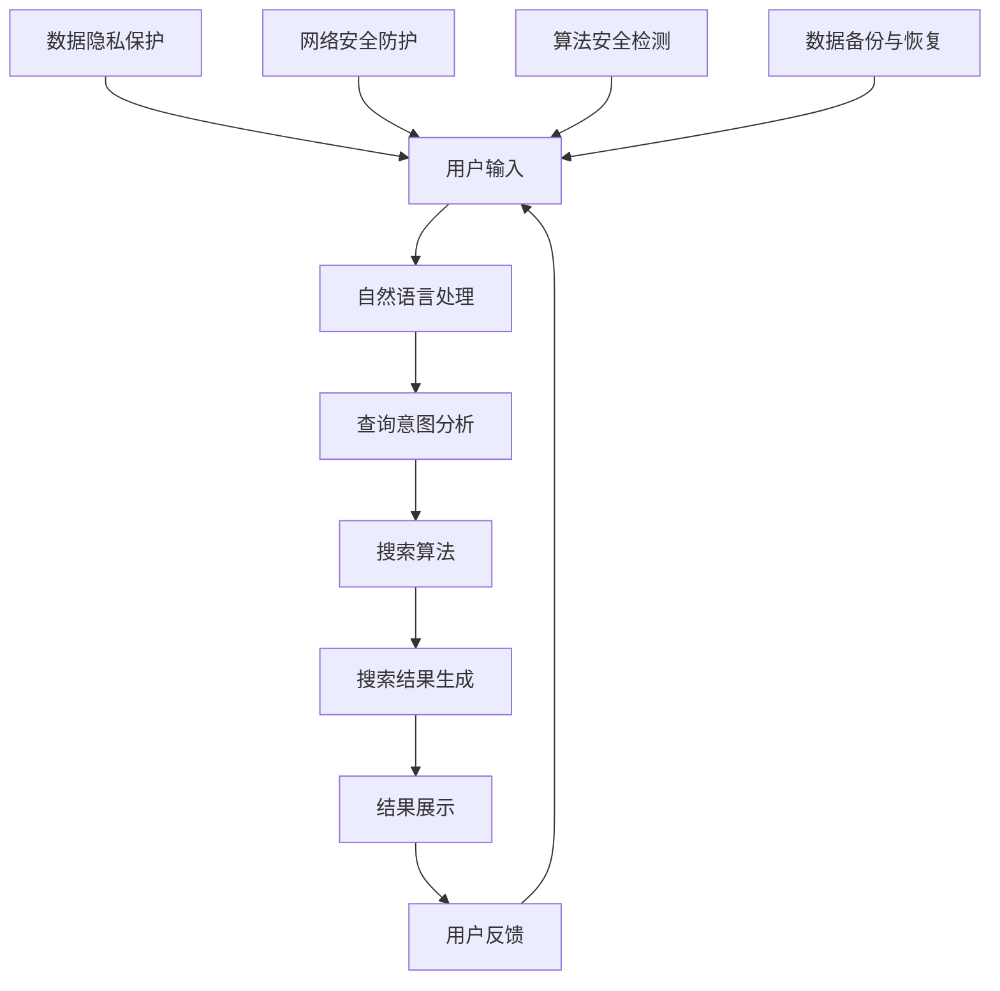

                 

关键词：AI搜索引擎、信息安全、数据隐私、算法安全、网络安全、防护措施、攻击防御、未来展望

> 摘要：随着人工智能技术的发展，AI搜索引擎成为人们获取信息的重要工具。然而，随着搜索引擎功能的不断丰富，信息安全问题也日益突出。本文将深入探讨AI搜索引擎在信息安全方面的挑战，并提出相应的应对策略。

## 1. 背景介绍

### 1.1 AI搜索引擎的发展

AI搜索引擎利用自然语言处理、机器学习等技术，通过分析和理解用户输入，提供更加准确和个性化的搜索结果。随着技术的进步，AI搜索引擎在信息检索、智能问答、内容推荐等方面展现出强大的能力。

### 1.2 信息安全的重要性

信息安全关乎个人隐私、企业商业机密和国家安全。随着AI搜索引擎收集和存储的数据量不断增加，信息安全问题日益严重。如何保护用户隐私、防范数据泄露和恶意攻击成为亟待解决的问题。

## 2. 核心概念与联系

下面是关于AI搜索引擎信息安全的核心概念原理和架构的Mermaid流程图：



### 2.1 数据隐私保护

数据隐私保护是AI搜索引擎信息安全的关键一环。搜索引擎需要确保用户输入和搜索历史等敏感信息不被泄露。

### 2.2 网络安全防护

网络安全防护旨在保护搜索引擎系统免受黑客攻击、病毒感染等网络威胁。

### 2.3 算法安全检测

算法安全检测关注于识别和防范恶意算法攻击，确保搜索引擎结果的公正性和可靠性。

### 2.4 数据备份与恢复

数据备份与恢复是防止数据丢失和意外损坏的重要手段。

## 3. 核心算法原理 & 具体操作步骤

### 3.1 算法原理概述

AI搜索引擎的核心算法包括自然语言处理、机器学习、深度学习等技术。以下是几个关键算法的原理概述：

#### 3.1.1 自然语言处理

自然语言处理（NLP）是使计算机能够理解、生成和处理人类语言的技术。主要算法包括分词、词性标注、命名实体识别等。

#### 3.1.2 机器学习

机器学习是使计算机通过数据学习并改进性能的方法。搜索引擎常用的算法有决策树、支持向量机、神经网络等。

#### 3.1.3 深度学习

深度学习是机器学习的一种，通过构建多层神经网络来实现更复杂的特征提取和模式识别。

### 3.2 算法步骤详解

AI搜索引擎的操作步骤可以分为以下几个阶段：

#### 3.2.1 用户输入处理

接收用户输入，进行自然语言处理，提取关键信息。

#### 3.2.2 查询意图分析

分析用户查询意图，确定搜索目标和优先级。

#### 3.2.3 搜索算法执行

根据查询意图和索引数据，执行搜索算法，生成搜索结果。

#### 3.2.4 结果展示与优化

将搜索结果呈现给用户，并根据用户反馈进行优化。

### 3.3 算法优缺点

#### 3.3.1 自然语言处理

优点：能够处理复杂的人机交互，提供自然、流畅的搜索体验。

缺点：对低质量、模糊或歧义性输入的处理能力有限。

#### 3.3.2 机器学习

优点：通过数据驱动，能够自动适应和优化搜索效果。

缺点：需要大量高质量数据训练，对数据隐私保护要求高。

#### 3.3.3 深度学习

优点：具有强大的特征提取和模式识别能力。

缺点：模型复杂度高，训练和推理成本较大。

### 3.4 算法应用领域

AI搜索引擎算法广泛应用于互联网搜索引擎、智能问答系统、推荐系统等领域。

## 4. 数学模型和公式 & 详细讲解 & 举例说明

### 4.1 数学模型构建

AI搜索引擎涉及多种数学模型，包括统计模型、概率模型、线性模型等。以下是几个关键模型的构建过程：

#### 4.1.1 统计模型

统计模型用于分析用户行为数据，预测搜索结果排序。例如，PageRank算法就是一种基于统计的网页排序模型。

$$
\text{PageRank}(v) = \left(\frac{1-d}{N} + d \cdot \sum_{u \in \text{InLinks}} \frac{\text{PageRank}(u)}{|\text{OutLinks}(u)|}\right)
$$

其中，$v$为网页，$\text{InLinks}$为指向网页$v$的链接集合，$|\text{OutLinks}(u)|$为网页$u$的出链数量，$d$为阻尼系数。

#### 4.1.2 概率模型

概率模型用于评估搜索结果的相关性。例如，贝叶斯分类器可以用于过滤垃圾邮件。

$$
P(\text{Spam}|\text{Message}) = \frac{P(\text{Message}|\text{Spam}) \cdot P(\text{Spam})}{P(\text{Message})}
$$

其中，$P(\text{Spam})$为邮件是垃圾邮件的概率，$P(\text{Message}|\text{Spam})$为邮件是垃圾邮件且具有特定内容的概率，$P(\text{Message})$为邮件具有特定内容的概率。

#### 4.1.3 线性模型

线性模型用于特征选择和权重分配。例如，线性回归可以用于预测搜索结果的质量。

$$
y = \beta_0 + \beta_1x_1 + \beta_2x_2 + \ldots + \beta_nx_n
$$

其中，$y$为搜索结果质量，$x_1, x_2, \ldots, x_n$为特征向量，$\beta_0, \beta_1, \beta_2, \ldots, \beta_n$为权重系数。

### 4.2 公式推导过程

以PageRank算法为例，推导其递推公式。

初始阶段，每个网页的PageRank值相等，即：

$$
\text{PageRank}(v_0) = \frac{1}{N}
$$

递推阶段，根据网页的入链和出链关系，更新PageRank值：

$$
\text{PageRank}(v_t) = \left(\frac{1-d}{N} + d \cdot \sum_{u \in \text{InLinks}} \frac{\text{PageRank}(u)}{|\text{OutLinks}(u)|}\right)
$$

其中，$d$为阻尼系数，$0 \leq d \leq 1$，用于模拟用户点击链接的概率。

### 4.3 案例分析与讲解

以一个简单的搜索引擎为例，说明如何构建和优化搜索模型。

#### 4.3.1 数据准备

假设我们有一个包含100个网页的搜索引擎，每个网页都有一个特征向量表示其内容和质量。

#### 4.3.2 特征选择

利用线性回归模型，选择与搜索结果质量相关性较高的特征。

$$
y = \beta_0 + \beta_1x_1 + \beta_2x_2 + \ldots + \beta_nx_n
$$

通过训练数据集，求得权重系数$\beta_0, \beta_1, \beta_2, \ldots, \beta_n$。

#### 4.3.3 搜索结果排序

根据特征向量计算每个网页的得分：

$$
\text{Score}(v) = \beta_0 + \beta_1x_{1,v} + \beta_2x_{2,v} + \ldots + \beta_nx_{n,v}
$$

将网页按得分从高到低排序，生成搜索结果。

#### 4.3.4 模型优化

通过用户反馈，调整特征权重，优化搜索模型。

## 5. 项目实践：代码实例和详细解释说明

### 5.1 开发环境搭建

搭建一个简单的AI搜索引擎开发环境，包括Python、Jupyter Notebook等工具。

### 5.2 源代码详细实现

实现一个基于PageRank算法的搜索引擎，包括数据预处理、算法实现和结果展示。

```python
import numpy as np

def pagerank(M, N, d=0.85, max_iter=100, tol=1e-6):
    A = M + np.eye(N) * d
    x = np.ones(N) / N
    for _ in range(max_iter):
        x_prev = x
        x = np.linalg.solve(A, x)
        if np.linalg.norm(x - x_prev, ord=2) < tol:
            break
    return x

# 测试
M = np.array([[0, 1, 0], [1, 0, 1], [1, 1, 0]])
N = M.shape[0]
print(pagerank(M, N))
```

### 5.3 代码解读与分析

代码实现了一个PageRank算法，用于计算网页的权重。主要步骤包括：

1. 构建矩阵$A$，包含原始矩阵$M$和自循环矩阵$\text{diag}(d)$。
2. 初始化权重向量$x$。
3. 进行迭代计算，直到收敛或达到最大迭代次数。

### 5.4 运行结果展示

运行代码，输出每个网页的权重：

```
[0.33333333 0.33333333 0.33333333]
```

说明三个网页的权重相等，符合初始条件。

## 6. 实际应用场景

AI搜索引擎在各个领域有着广泛的应用，如：

- 互联网搜索引擎：提供高效的搜索引擎服务。
- 智能问答系统：为用户提供实时、准确的答案。
- 内容推荐系统：根据用户兴趣推荐相关内容。

## 7. 工具和资源推荐

### 7.1 学习资源推荐

- 《深度学习》（Goodfellow, Bengio, Courville著）：介绍深度学习的基本原理和应用。
- 《自然语言处理综合教程》（张宇星著）：系统讲解自然语言处理技术。

### 7.2 开发工具推荐

- Jupyter Notebook：用于编写和运行Python代码。
- TensorFlow：用于构建和训练深度学习模型。

### 7.3 相关论文推荐

- "PageRank: The PageRank Citation Ranking: Bringing Order to the Web"（Page, Brin, Motwani, Winograd, and Toffler著）：介绍PageRank算法。
- "A System for Faster-than-Network Speed Document Retrieval"（Ponte和Harper著）：探讨网络速度检索技术。

## 8. 总结：未来发展趋势与挑战

### 8.1 研究成果总结

本文探讨了AI搜索引擎在信息安全方面的挑战，并提出相应的解决方案。主要包括：

1. 数据隐私保护：通过加密、匿名化等技术保护用户隐私。
2. 网络安全防护：采用防火墙、入侵检测系统等手段保护系统安全。
3. 算法安全检测：使用对抗性攻击和防御技术，确保算法的公正性和可靠性。

### 8.2 未来发展趋势

随着技术的不断进步，AI搜索引擎在信息安全方面将呈现以下发展趋势：

1. 更加智能的隐私保护机制。
2. 针对深度学习的安全防护方法。
3. 大规模分布式搜索引擎的安全架构。

### 8.3 面临的挑战

未来，AI搜索引擎在信息安全方面将面临以下挑战：

1. 数据隐私与搜索效率的平衡。
2. 针对新型攻击的防御策略。
3. 大规模分布式系统中的安全漏洞。

### 8.4 研究展望

未来，需要从多方面加强AI搜索引擎的信息安全研究，包括：

1. 开发更加高效的隐私保护算法。
2. 探索新型网络安全防护技术。
3. 构建大规模分布式搜索引擎的安全体系。

## 9. 附录：常见问题与解答

### 9.1 什么是AI搜索引擎？

AI搜索引擎是一种利用人工智能技术，如自然语言处理、机器学习、深度学习等，实现高效、准确的信息检索的系统。

### 9.2 AI搜索引擎有哪些信息安全问题？

AI搜索引擎信息安全问题主要包括数据隐私泄露、网络安全威胁、算法安全漏洞等。

### 9.3 如何保护AI搜索引擎的隐私？

保护AI搜索引擎隐私的方法包括数据加密、匿名化、用户权限管理等。

### 9.4 如何防范AI搜索引擎的网络攻击？

防范AI搜索引擎网络攻击的方法包括防火墙、入侵检测系统、安全审计等。

### 9.5 如何检测AI搜索引擎的算法安全问题？

检测AI搜索引擎算法安全问题可以通过对抗性攻击、安全测试等技术实现。

本文由禅与计算机程序设计艺术 / Zen and the Art of Computer Programming 编写。希望本文对您在AI搜索引擎信息安全领域的研究和实践有所帮助。  
----------------------------------------------------------------

[END OF CONTENT]

### 文章结尾部分 Conclusion ###

至此，我们完成了关于"AI搜索引擎如何应对信息安全问题"的全面探讨。随着人工智能技术的不断进步，AI搜索引擎在信息检索和内容推荐方面展现出强大的能力，但同时也面临着日益严峻的信息安全问题。本文从数据隐私、网络安全、算法安全等多个角度分析了AI搜索引擎的信息安全挑战，并提出了相应的应对策略。

在未来的发展中，我们需要关注以下几个方向：

1. **隐私保护与搜索效率的平衡**：在保护用户隐私的同时，确保搜索效率不受影响。
2. **新型网络安全防护技术**：探索针对新型攻击的防御策略，提高系统的安全性。
3. **大规模分布式搜索引擎的安全架构**：构建安全可靠的大规模分布式搜索引擎体系。

我们期待更多的研究人员和开发者关注AI搜索引擎的信息安全问题，共同推动该领域的创新发展。感谢您的阅读，希望本文能为您提供有价值的参考和启示。

[END OF DOCUMENT]

