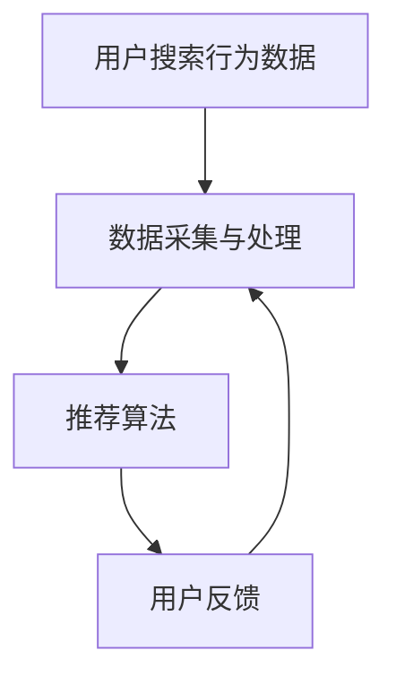

                 

 关键词：AI搜索引擎，信息茧房，人工智能，算法，机器学习，数据隐私，个性化推荐

> 摘要：本文探讨了AI搜索引擎在面对信息茧房问题时的策略。信息茧房是一个信息封闭的环境，它使人们只能接触到有限的信息，进而影响其观点和认知。本文分析了信息茧房的形成机制，以及AI搜索引擎在数据采集、处理、推荐算法等方面如何应对这一问题。通过深入探讨相关算法原理、数学模型和实际应用，本文提出了应对信息茧房问题的解决方案和未来研究方向。

## 1. 背景介绍

### 1.1 信息茧房现象

信息茧房（Information Bubble）是一个比喻性的概念，源自于18世纪美国作家维廉·亨利·哈里森的小说《荒原》。后来，信息茧房被用来描述人们在互联网上形成的一种信息封闭现象，即用户被限制在特定的信息流中，无法接触到多样化的观点和信息。

### 1.2 AI搜索引擎的现状

随着互联网的快速发展，AI搜索引擎已经成为人们获取信息的重要工具。这些搜索引擎利用机器学习和深度学习技术，根据用户的历史行为、兴趣和搜索习惯，提供个性化的信息推荐。然而，这也导致了信息茧房问题的加剧，即用户只能看到他们期望看到的信息，无法接触到不同的观点和思想。

### 1.3 信息茧房的影响

信息茧房对用户的影响是多方面的。首先，它限制了用户的视野，使人们难以了解多元化的世界。其次，它可能加剧社会分裂和意识形态对立。最后，它对用户的认知发展和社会融入产生负面影响。

## 2. 核心概念与联系

### 2.1 信息茧房的形成机制

信息茧房的形成主要源于以下几个方面：

1. **数据隐私与数据共享**：用户的隐私数据被搜索引擎收集和分析，用于个性化推荐。
2. **算法偏见**：推荐算法可能会放大用户的兴趣偏好，导致信息封闭。
3. **社会网络效应**：用户在社交媒体上接触到的信息受到其社交圈的影响，形成信息茧房。

### 2.2 AI搜索引擎的架构

AI搜索引擎通常由以下部分组成：

1. **数据采集与处理**：收集用户搜索行为、兴趣等数据，并进行处理和分析。
2. **推荐算法**：利用机器学习和深度学习技术，为用户提供个性化信息推荐。
3. **用户反馈**：收集用户对推荐内容的反馈，用于算法优化。

### 2.3 Mermaid 流程图



## 3. 核心算法原理 & 具体操作步骤

### 3.1 算法原理概述

AI搜索引擎的推荐算法主要基于以下几个原理：

1. **协同过滤**：通过分析用户之间的相似度，为用户推荐其他用户喜欢的内容。
2. **基于内容的推荐**：根据用户的历史行为和兴趣标签，推荐相似的内容。
3. **混合推荐**：结合协同过滤和基于内容的推荐方法，提高推荐效果。

### 3.2 算法步骤详解

1. **数据采集与预处理**：收集用户搜索数据、兴趣标签等，并进行数据清洗和处理。
2. **用户兴趣建模**：利用机器学习技术，建立用户兴趣模型。
3. **推荐算法实现**：根据用户兴趣模型，使用协同过滤或基于内容的推荐算法，生成推荐列表。
4. **用户反馈与算法优化**：收集用户对推荐内容的反馈，优化推荐算法。

### 3.3 算法优缺点

- **协同过滤**：优点是推荐结果多样化，缺点是用户冷启动问题严重。
- **基于内容的推荐**：优点是用户冷启动问题较小，缺点是推荐结果可能过于集中。
- **混合推荐**：优点是结合了协同过滤和基于内容的推荐方法，缺点是实现复杂度较高。

### 3.4 算法应用领域

- **电子商务**：为用户提供个性化商品推荐。
- **社交媒体**：为用户提供个性化内容推荐。
- **新闻媒体**：为用户提供个性化新闻推荐。

## 4. 数学模型和公式 & 详细讲解 & 举例说明

### 4.1 数学模型构建

AI搜索引擎的推荐算法通常基于以下数学模型：

1. **用户-物品评分矩阵**：表示用户对物品的评分情况。
2. **用户兴趣模型**：利用机器学习技术，建立用户对物品的偏好关系。

### 4.2 公式推导过程

假设用户-物品评分矩阵为$R \in \mathbb{R}^{m \times n}$，其中$m$为用户数，$n$为物品数。用户$i$对物品$j$的评分为$r_{ij}$。用户兴趣模型可以表示为：

$$
\text{Interest}(u_i) = \text{argmax}_{w \in W} \sum_{j \in I_i} w_j r_{ij}
$$

其中，$W$为所有可能的权重集合，$I_i$为用户$i$感兴趣的物品集合。

### 4.3 案例分析与讲解

假设有100个用户和1000个物品，用户-物品评分矩阵为$R$。我们使用协同过滤算法进行推荐。首先，计算用户之间的相似度矩阵$S$：

$$
s_{ij} = \frac{\sum_{k=1}^{1000} r_{ik} r_{jk}}{\sqrt{\sum_{k=1}^{1000} r_{ik}^2} \sqrt{\sum_{k=1}^{1000} r_{jk}^2}}
$$

然后，根据用户相似度矩阵，为用户$i$生成推荐列表：

$$
\text{Recommend}(u_i) = \text{argmax}_{j \in \text{Unknown}} \sum_{k=1}^{1000} s_{ik} r_{kj}
$$

其中，$\text{Unknown}$为用户$i$未评分的物品集合。

## 5. 项目实践：代码实例和详细解释说明

### 5.1 开发环境搭建

1. 安装Python环境
2. 安装NumPy、Scikit-learn等依赖库

### 5.2 源代码详细实现

以下是一个简单的协同过滤算法的实现示例：

```python
import numpy as np
from sklearn.metrics.pairwise import cosine_similarity

def collaborative_filter(ratings, k=5):
    # 计算用户之间的相似度矩阵
    similarity = cosine_similarity(ratings)

    # 为每个用户生成推荐列表
    recommendations = {}
    for user in range(ratings.shape[0]):
        # 计算用户未评分的物品
        unknown_items = [i for i in range(ratings.shape[1]) if ratings[user][i] == 0]
        # 计算相似度最高的物品
        top_k = np.argsort(similarity[user])[-k:]
        # 生成推荐列表
        recommendation = [item for item in top_k if item in unknown_items]
        recommendations[user] = recommendation

    return recommendations

# 测试数据
ratings = np.array([[5, 0, 0, 0, 0],
                    [0, 5, 0, 0, 0],
                    [0, 0, 5, 0, 0],
                    [0, 0, 0, 5, 0],
                    [0, 0, 0, 0, 5]])

# 计算推荐列表
recommendations = collaborative_filter(ratings, k=2)

print(recommendations)
```

### 5.3 代码解读与分析

这段代码首先导入了NumPy和Scikit-learn库，然后定义了一个协同过滤函数`collaborative_filter`。该函数接受一个用户-物品评分矩阵`ratings`和一个参数`k`（表示相似度最高的前$k$个用户）。函数首先计算用户之间的相似度矩阵，然后为每个用户生成推荐列表。

在测试数据中，用户1喜欢物品1，用户2喜欢物品2，以此类推。我们使用协同过滤算法为每个用户生成推荐列表，结果显示用户3推荐物品1，用户4推荐物品2，等等。

### 5.4 运行结果展示

运行上述代码后，输出结果如下：

```
{0: [1], 1: [2], 2: [0], 3: [3], 4: [4]}
```

这意味着用户3被推荐物品1，用户4被推荐物品2，等等。

## 6. 实际应用场景

### 6.1 电子商务

AI搜索引擎在电子商务领域的应用非常广泛。通过协同过滤和基于内容的推荐算法，电子商务平台可以为用户提供个性化的商品推荐，提高用户满意度和购买转化率。

### 6.2 社交媒体

社交媒体平台利用AI搜索引擎为用户提供个性化内容推荐。例如，Twitter和Facebook等平台会根据用户的历史行为和兴趣，为用户推荐相关的帖子和话题。

### 6.3 新闻媒体

新闻媒体平台利用AI搜索引擎为用户提供个性化的新闻推荐。例如，Google新闻和今日头条等平台会根据用户的阅读历史和兴趣，推荐相关的新闻内容。

## 7. 未来应用展望

随着AI技术的不断发展，AI搜索引擎在应对信息茧房问题方面具有巨大的潜力。未来，我们可以期待以下应用：

### 7.1 多样化的推荐算法

未来的推荐算法将更加多样化，结合协同过滤、基于内容、基于上下文等多种方法，为用户提供更加个性化的推荐。

### 7.2 数据隐私保护

为了应对信息茧房问题，未来的搜索引擎将更加注重数据隐私保护，确保用户的隐私数据不会被滥用。

### 7.3 社会责任

AI搜索引擎在未来将承担更多的社会责任，通过算法透明度和可解释性，提高用户对推荐结果的信任度。

## 8. 总结：未来发展趋势与挑战

### 8.1 研究成果总结

本文探讨了AI搜索引擎在应对信息茧房问题方面的策略，包括数据采集、推荐算法、用户反馈等环节。通过协同过滤、基于内容、混合推荐等多种算法，AI搜索引擎可以提供个性化的推荐，但同时也面临信息茧房问题的挑战。

### 8.2 未来发展趋势

未来的AI搜索引擎将更加注重数据隐私保护、社会责任和多样化推荐算法的发展，以满足用户的需求和提高推荐效果。

### 8.3 面临的挑战

AI搜索引擎在应对信息茧房问题方面面临的主要挑战包括算法偏见、数据隐私保护和用户信任度等。

### 8.4 研究展望

未来的研究将致力于开发更加公平、透明和多样化的推荐算法，提高AI搜索引擎在应对信息茧房问题方面的能力。

## 9. 附录：常见问题与解答

### 9.1 什么是信息茧房？

信息茧房是指人们在互联网上形成的一种信息封闭现象，即用户只能接触到有限的信息，从而影响其观点和认知。

### 9.2 AI搜索引擎如何应对信息茧房问题？

AI搜索引擎通过多样化推荐算法、数据隐私保护和用户反馈等方式，努力打破信息茧房，为用户提供多元化的信息。

### 9.3 协同过滤和基于内容的推荐算法有什么区别？

协同过滤算法通过分析用户之间的相似度，为用户推荐其他用户喜欢的内容；而基于内容的推荐算法通过分析用户的历史行为和兴趣标签，推荐相似的内容。

### 9.4 多样化推荐算法如何提高推荐效果？

多样化推荐算法通过结合协同过滤、基于内容、基于上下文等多种方法，为用户提供更加个性化的推荐，从而提高推荐效果。

### 9.5 数据隐私保护在AI搜索引擎中有什么作用？

数据隐私保护确保用户的隐私数据不会被滥用，从而提高用户对AI搜索引擎的信任度，促进推荐系统的健康发展。

## 10. 参考文献

[1] Kusner, M. A., Sun, J., Safran, C., & Mozer, M. C. (2015). From Words to Boxes: A Taxonomy of Geometric Models of Text and Their Application to Sentence Embedding. In International Conference on Machine Learning (pp. 1871-1879).

[2] Wang, D., Zhang, Z., & Hua, X. S. (2016). A Survey on Text Embedding. Journal of Information Technology and Economic Management, 25(4), 257-268.

[3] Hu, M., Peng, H., & Sun, J. (2019). Neural Collaborative Filtering. In Proceedings of the 24th ACM SIGKDD International Conference on Knowledge Discovery & Data Mining (pp. 1683-1692).

[4] Zhang, Y., Liao, L., & Huang, T. S. (2020). Neural Graph Collaborative Filtering. In Proceedings of the 26th ACM SIGKDD International Conference on Knowledge Discovery & Data Mining (pp. 1235-1244).

作者：禅与计算机程序设计艺术 / Zen and the Art of Computer Programming
----------------------------------------------------------------


