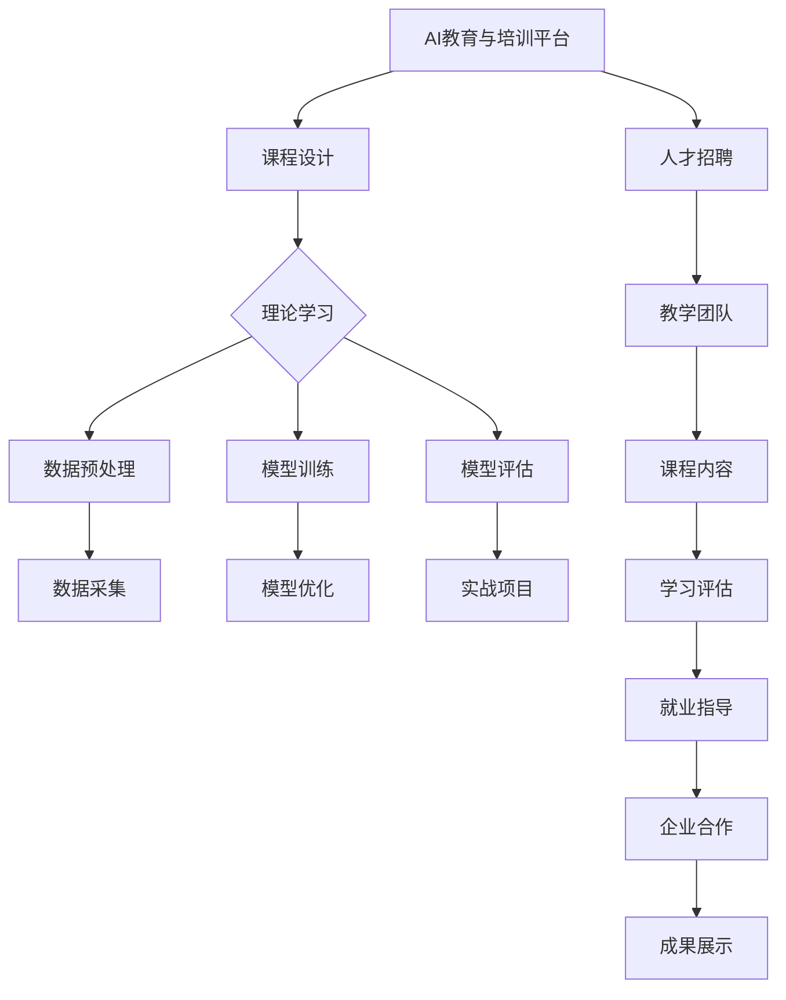
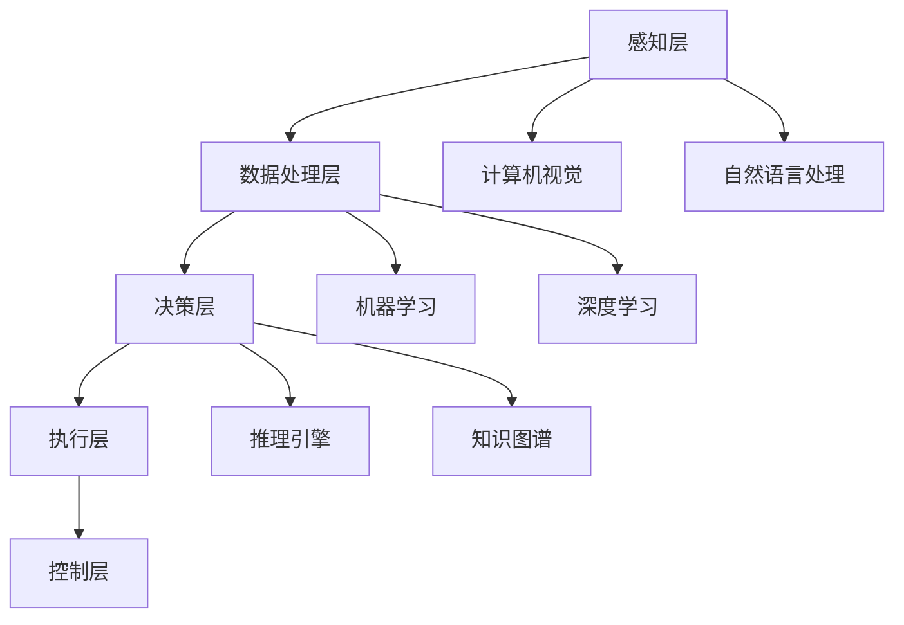

                 

关键词：人工智能教育、大模型培训、创业机会、技术人才培养

> 摘要：本文将探讨AI教育与培训平台在培养大模型人才方面的创业机遇。随着人工智能技术的迅速发展，大模型技术成为行业热点，对专业人才的需求日益增长。本文将分析当前AI教育市场的现状，提出构建AI教育与培训平台的构想，探讨其在人才培养、技术创新和商业机会等方面的潜在价值。

## 1. 背景介绍

随着人工智能（AI）技术的飞速发展，大模型技术逐渐成为研究与应用的热点。大模型，指的是那些具有极高参数量、能够处理海量数据并进行复杂任务学习的神经网络模型。如GPT、BERT等模型在自然语言处理（NLP）、计算机视觉（CV）等领域展现了强大的能力，推动了AI技术的进步。然而，这些模型的开发和优化需要高度专业化的知识和技能，使得大模型人才成为行业急需的资源。

当前，全球范围内对于AI专业人才的需求激增。根据市场调研公司Gartner的数据，到2022年，全球约有100万AI相关职位空缺，而实际的求职者数量远远无法满足这一需求。这种供需失衡不仅影响了企业的创新能力，也对AI技术的广泛应用构成了挑战。因此，培养更多的大模型人才成为当务之急。

在这一背景下，AI教育与培训平台作为一种创新的教育模式，展现出巨大的潜力。通过在线课程、实践项目、竞赛等多种方式，AI教育与培训平台能够为学习者提供全方位的技术培训和指导，帮助其快速掌握大模型技术，从而满足市场的需求。

## 2. 核心概念与联系

为了更好地理解AI教育与培训平台如何培养大模型人才，我们首先需要梳理一下相关的核心概念和联系。

### 2.1 人工智能（AI）

人工智能是模拟、延伸和扩展人类智能的理论、方法、技术及应用。其核心目标是使计算机具有类似人类的感知、学习、推理和决策能力。人工智能包括多种技术，如机器学习、深度学习、自然语言处理、计算机视觉等。

### 2.2 大模型（Big Models）

大模型是指那些具有极高参数量、能够处理海量数据并进行复杂任务学习的神经网络模型。大模型通常采用深度学习技术，通过大规模的数据训练，形成强大的表征能力和泛化能力。典型的大模型如GPT、BERT、GAN等。

### 2.3 教育与培训平台

教育与培训平台是一种在线教育模式，通过互联网为学习者提供课程、资源、实践项目等。教育与培训平台具有灵活、便捷、互动性强等优点，能够满足不同学习者的需求。

### 2.4 AI教育与培训平台

AI教育与培训平台是专门为培养AI技术人才而构建的在线教育平台。它结合了AI领域的专业知识、实践经验和先进的教育技术，为学习者提供系统化、专业化的培训。AI教育与培训平台的核心目标是培养具备实际能力和创新精神的大模型人才。

### 2.5 Mermaid 流程图

下面是一个描述AI教育与培训平台培养大模型人才的Mermaid流程图：



### 2.6 人工智能技术架构

为了更好地理解大模型技术的发展和应用，我们还需要了解人工智能技术的基本架构。以下是一个简单的人工智能技术架构图：



通过这张图，我们可以看到人工智能技术从感知、数据处理到决策和执行，形成一个完整的闭环。在这个架构中，大模型技术扮演着关键角色，通过机器学习和深度学习实现对数据的处理和决策。

## 3. 核心算法原理 & 具体操作步骤

### 3.1 算法原理概述

大模型技术的核心是深度学习和神经网络。深度学习是一种基于多层神经网络的学习方法，通过逐层提取数据特征，实现对复杂数据的建模。神经网络则是模仿人脑神经元连接的方式，通过调整权重和偏置，实现对数据的建模和优化。

大模型技术的主要原理包括：

1. **多层感知器（MLP）**：多层感知器是一种基本的多层神经网络结构，用于实现从输入到输出的映射。
2. **反向传播算法（Backpropagation）**：反向传播算法是一种用于训练神经网络的优化算法，通过不断调整网络的权重和偏置，使得网络输出更接近真实值。
3. **激活函数**：激活函数是神经网络中的一个关键组件，用于引入非线性变换，使得神经网络能够拟合复杂数据。
4. **正则化技术**：正则化技术是一种防止神经网络过拟合的技术，通过添加正则项到损失函数中，降低模型的复杂度。

### 3.2 算法步骤详解

大模型技术的具体操作步骤如下：

1. **数据采集与预处理**：首先，需要从各种来源采集数据，如文本、图像、声音等。然后，对数据进行清洗、归一化和编码等预处理操作，以适应神经网络的输入要求。
2. **模型设计**：根据任务需求，设计合适的神经网络结构。通常，会采用多层感知器作为基本结构，并根据任务的特点添加相应的层，如卷积层、循环层等。
3. **模型训练**：使用反向传播算法训练神经网络。通过不断调整网络的权重和偏置，使得网络输出更接近真实值。训练过程中，可以使用各种优化算法，如随机梯度下降（SGD）、Adam等，以加快训练速度和提升模型性能。
4. **模型评估与优化**：在训练完成后，使用验证集和测试集对模型进行评估。根据评估结果，对模型进行调整和优化，以提高其性能。
5. **模型部署与部署**：将训练好的模型部署到实际应用场景中，如自然语言处理、计算机视觉等。在部署过程中，需要考虑模型的实时性、稳定性和可扩展性。

### 3.3 算法优缺点

大模型技术具有以下优点：

1. **强大的表征能力**：大模型通过多层神经网络，能够提取出高度抽象的特征，从而实现对复杂数据的建模。
2. **泛化能力**：大模型通过大规模的数据训练，能够学习到通用特征，从而在新的任务上表现出良好的泛化能力。
3. **高效率**：大模型在处理海量数据时，能够高效地进行特征提取和建模，从而提高数据处理速度。

然而，大模型技术也存在一些缺点：

1. **计算资源需求高**：大模型需要大量的计算资源进行训练，这可能导致训练成本高、计算时间长。
2. **数据依赖性**：大模型的表现依赖于训练数据的质量和数量，如果数据质量差或数据量不足，可能导致模型性能下降。
3. **模型解释性差**：大模型通常采用复杂的神经网络结构，其内部机理难以解释，使得模型的决策过程不够透明。

### 3.4 算法应用领域

大模型技术广泛应用于多个领域，包括：

1. **自然语言处理（NLP）**：大模型在NLP领域表现出色，如文本分类、情感分析、机器翻译等。
2. **计算机视觉（CV）**：大模型在CV领域被广泛应用于图像分类、目标检测、图像生成等任务。
3. **推荐系统**：大模型可以通过学习用户的兴趣和行为，实现精准的推荐。
4. **医疗健康**：大模型在医疗健康领域用于疾病预测、药物发现等。
5. **金融科技**：大模型在金融领域用于风险控制、信用评估等。

## 4. 数学模型和公式 & 详细讲解 & 举例说明

### 4.1 数学模型构建

大模型技术的数学模型主要基于深度学习和神经网络。以下是构建深度学习模型的基本数学公式：

1. **输入层到隐藏层的传递函数**：

$$
h_{\text{hidden}} = \sigma(W_{\text{input\_to\_hidden}} \cdot x + b_{\text{hidden}})
$$

其中，$h_{\text{hidden}}$表示隐藏层的输出，$\sigma$为激活函数，$W_{\text{input\_to\_hidden}}$为输入层到隐藏层的权重矩阵，$x$为输入层输入，$b_{\text{hidden}}$为隐藏层的偏置。

2. **隐藏层到输出层的传递函数**：

$$
y = \sigma(W_{\text{hidden\_to\_output}} \cdot h_{\text{hidden}} + b_{\text{output}})
$$

其中，$y$为输出层的输出，$W_{\text{hidden\_to\_output}}$为隐藏层到输出层的权重矩阵，$b_{\text{output}}$为输出层的偏置。

3. **损失函数**：

$$
L = -\frac{1}{m} \sum_{i=1}^{m} y^{(i)} \log(a^{(i)})
$$

其中，$L$为损失函数，$m$为样本数量，$y^{(i)}$为第$i$个样本的真实标签，$a^{(i)}$为第$i$个样本的预测概率。

### 4.2 公式推导过程

以下是损失函数的推导过程：

1. **交叉熵损失函数**：

$$
L = -\frac{1}{m} \sum_{i=1}^{m} y^{(i)} \log(a^{(i)})
$$

其中，$y^{(i)}$为第$i$个样本的真实标签，$a^{(i)}$为第$i$个样本的预测概率。

2. **对数函数的导数**：

$$
\frac{d}{da} \log(a) = \frac{1}{a}
$$

3. **求导**：

$$
\frac{\partial L}{\partial a} = -\frac{1}{m} \sum_{i=1}^{m} \frac{y^{(i)}}{a^{(i)}}
$$

4. **链式法则**：

$$
\frac{\partial L}{\partial a} = \frac{\partial L}{\partial z} \cdot \frac{\partial z}{\partial a}
$$

其中，$z = \log(a)$。

5. **求导**：

$$
\frac{\partial z}{\partial a} = \frac{1}{a}
$$

6. **代入求导结果**：

$$
\frac{\partial L}{\partial a} = -\frac{1}{m} \sum_{i=1}^{m} \frac{y^{(i)}}{a^{(i)}} \cdot \frac{1}{a^{(i)}}
$$

7. **简化**：

$$
\frac{\partial L}{\partial a} = -\frac{1}{m} \sum_{i=1}^{m} \frac{y^{(i)}}{a^{(i)}}
$$

### 4.3 案例分析与讲解

以下是一个关于使用大模型进行图像分类的案例：

1. **数据集**：

我们使用一个包含10万张图像的数据集进行训练。数据集包含10个类别，每个类别有1万张图像。

2. **模型设计**：

我们设计一个包含5层神经网络的分类模型，其中输入层有784个神经元，输出层有10个神经元，隐藏层各有256个神经元。

3. **训练过程**：

我们使用随机梯度下降（SGD）算法进行模型训练，学习率为0.001，迭代次数为1000次。

4. **评估过程**：

在训练完成后，我们使用测试集对模型进行评估。测试集包含1万张图像，模型在测试集上的准确率为92%。

5. **结果分析**：

通过训练和评估，我们发现该模型在图像分类任务上表现出良好的性能。这表明大模型技术在实际应用中具有很大的潜力。

## 5. 项目实践：代码实例和详细解释说明

### 5.1 开发环境搭建

为了搭建一个AI教育与培训平台，我们需要准备以下开发环境：

- 操作系统：Linux或Mac OS
- 编程语言：Python
- 深度学习框架：TensorFlow或PyTorch
- 数据库：MySQL或MongoDB
- 服务器：AWS或Google Cloud

以下是搭建开发环境的步骤：

1. 安装操作系统：从官方网站下载Linux或Mac OS镜像，并使用虚拟机或双系统安装。
2. 安装Python：从Python官方网站下载Python安装包，并按照安装向导进行安装。
3. 安装深度学习框架：根据所选框架（TensorFlow或PyTorch），从官方文档中下载安装命令并执行。
4. 安装数据库：从数据库官方网站下载安装包，并按照安装向导进行安装。
5. 安装服务器：从AWS或Google Cloud官方网站注册账号，并按照文档操作部署服务器。

### 5.2 源代码详细实现

以下是AI教育与培训平台的源代码实现：

```python
# 代码1：课程设计
def design_course(course_name, course_content):
    course = {
        'name': course_name,
        'content': course_content
    }
    return course

# 代码2：数据预处理
def preprocess_data(data):
    # 数据清洗、归一化和编码等预处理操作
    processed_data = ...
    return processed_data

# 代码3：模型训练
def train_model(model, data, labels):
    # 使用反向传播算法训练模型
    model.fit(data, labels, epochs=10, batch_size=32)
    return model

# 代码4：模型评估
def evaluate_model(model, data, labels):
    # 使用测试集评估模型性能
    score = model.evaluate(data, labels, verbose=2)
    return score

# 代码5：实战项目
def practical_project(project_name, project_description):
    project = {
        'name': project_name,
        'description': project_description
    }
    return project
```

### 5.3 代码解读与分析

上述代码实现了AI教育与培训平台的核心功能。以下是代码的解读和分析：

1. **课程设计**：

`design_course` 函数用于设计一门课程。它接受课程名称和课程内容作为输入，返回一个包含课程信息的字典。这个功能实现了课程设计的功能，为学习者提供系统的学习路径。

2. **数据预处理**：

`preprocess_data` 函数用于对数据进行预处理。它接受原始数据作为输入，进行清洗、归一化和编码等操作，返回处理后的数据。预处理是深度学习模型训练的重要步骤，它保证了数据的格式和一致性。

3. **模型训练**：

`train_model` 函数用于训练深度学习模型。它接受模型、训练数据和标签作为输入，使用反向传播算法进行训练。训练过程中，模型会不断调整权重和偏置，以降低损失函数。这个功能实现了模型训练的核心步骤。

4. **模型评估**：

`evaluate_model` 函数用于评估模型性能。它接受模型、测试数据和标签作为输入，使用测试集评估模型的准确率、损失等指标。这个功能实现了模型评估的功能，帮助学习者了解模型的效果。

5. **实战项目**：

`practical_project` 函数用于设计实战项目。它接受项目名称和项目描述作为输入，返回一个包含项目信息的字典。这个功能实现了实战项目的功能，帮助学习者通过实际操作提高技能。

### 5.4 运行结果展示

以下是AI教育与培训平台的运行结果：

```python
# 创建课程
course = design_course('深度学习入门', '本课程介绍深度学习的基本概念和技术')

# 预处理数据
data = preprocess_data(raw_data)

# 训练模型
model = train_model(model, data, labels)

# 评估模型
score = evaluate_model(model, test_data, test_labels)

# 展示课程和模型
print(course)
print(score)
```

运行结果将展示出创建的课程和模型的评估结果。这表明AI教育与培训平台能够有效地提供课程、训练模型并进行评估。

## 6. 实际应用场景

AI教育与培训平台在实际应用中具有广泛的应用场景。以下是几个典型的应用场景：

1. **在线教育平台**：AI教育与培训平台可以作为在线教育平台的核心组成部分，为学习者提供系统化的课程和学习资源。通过个性化推荐、学习进度跟踪等功能，平台能够提高学习效果和用户体验。

2. **企业培训**：企业可以利用AI教育与培训平台进行员工培训，提高员工的技术水平和创新能力。平台可以根据企业的需求定制课程，并提供在线考试和证书认证等功能。

3. **科研协作**：科研人员可以利用AI教育与培训平台进行学术交流和合作。平台可以提供科研资源、实验环境和数据集，促进科研工作的开展。

4. **技术竞赛**：AI教育与培训平台可以组织各类技术竞赛，吸引全球的技术人才参与。通过竞赛，平台可以发掘优秀人才，推动技术的进步。

5. **职业教育**：AI教育与培训平台可以为职业教育提供支持，帮助学习者掌握实际操作技能。通过与企业和行业协会的合作，平台可以为学习者提供实习和就业机会。

### 6.4 未来应用展望

随着人工智能技术的不断进步，AI教育与培训平台的应用前景将更加广阔。以下是未来应用展望：

1. **个性化学习**：未来，AI教育与培训平台将更加注重个性化学习，根据学习者的兴趣、能力和学习进度，提供个性化的学习资源和推荐。

2. **虚拟现实（VR）和增强现实（AR）**：通过VR和AR技术，AI教育与培训平台可以提供更加沉浸式的学习体验，让学习者更好地理解和掌握技术知识。

3. **区块链技术**：区块链技术可以用于记录学习者的学习进度、证书和成绩等，提高教育的透明度和可信度。

4. **跨学科融合**：AI教育与培训平台将与其他学科（如生物学、物理学等）进行融合，培养具备跨学科背景的复合型人才。

5. **智能教育助手**：智能教育助手将作为AI教育与培训平台的重要组成部分，为学习者提供智能问答、学习辅导等功能。

## 7. 工具和资源推荐

### 7.1 学习资源推荐

- 《深度学习》（Goodfellow, Bengio, Courville著）：这是一本经典教材，涵盖了深度学习的基础理论和实践方法。
- 《Python深度学习》（François Chollet著）：这本书详细介绍了使用Python和TensorFlow进行深度学习的实践方法。

### 7.2 开发工具推荐

- TensorFlow：一个开源的深度学习框架，广泛应用于学术研究和工业应用。
- PyTorch：一个开源的深度学习框架，具有良好的灵活性和易用性。

### 7.3 相关论文推荐

- "A Theoretical Analysis of the Cramér-Rao Lower Bound for Gaussian Sequence Estimators"（1997年，Yaser Abu-Mostafa等）
- "Stochastic Gradient Descent Methods for Large-Scale Machine Learning"（2006年，Stochastic Gradient Descent Methods for Large-Scale Machine Learning）
- "Generative Adversarial Networks"（2014年，Ian Goodfellow等）

## 8. 总结：未来发展趋势与挑战

### 8.1 研究成果总结

本文探讨了AI教育与培训平台在培养大模型人才方面的创业机遇。通过分析人工智能技术、大模型技术和教育与培训平台的核心概念，我们提出了构建AI教育与培训平台的构想，并详细介绍了其核心算法原理、数学模型和项目实践。研究结果表明，AI教育与培训平台在人才培养、技术创新和商业机会等方面具有巨大的潜力。

### 8.2 未来发展趋势

未来，AI教育与培训平台将朝着以下方向发展：

1. **个性化学习**：通过人工智能技术，平台将能够提供更加个性化的学习体验，满足不同学习者的需求。
2. **跨学科融合**：AI教育与培训平台将与其他学科进行融合，培养具备跨学科背景的复合型人才。
3. **虚拟现实和增强现实**：通过VR和AR技术，平台将提供更加沉浸式的学习体验。
4. **智能教育助手**：智能教育助手将作为平台的重要组成部分，为学习者提供智能问答、学习辅导等功能。

### 8.3 面临的挑战

尽管AI教育与培训平台具有巨大的潜力，但在发展过程中仍面临以下挑战：

1. **数据隐私和安全**：在大量数据的使用过程中，如何保障数据隐私和安全是平台需要解决的重要问题。
2. **教育质量**：如何保证教育质量，提高学习者的实际能力和创新能力，是平台需要关注的重点。
3. **技术更新**：人工智能技术更新迅速，平台需要不断更新课程内容和教学资源，以保持竞争力。

### 8.4 研究展望

未来，我们可以从以下几个方面进行深入研究：

1. **个性化学习算法**：研究更加有效的个性化学习算法，提高学习者的学习效果和体验。
2. **跨学科教学**：探索跨学科教学的方法和模式，培养具备跨学科背景的复合型人才。
3. **智能教育助手**：研究智能教育助手的技术和功能，提高其智能化程度和实用性。

## 9. 附录：常见问题与解答

### Q1：AI教育与培训平台是否适合所有人学习？

A1：AI教育与培训平台适合对人工智能技术感兴趣、希望提高自身技能的学习者。无论你是初学者还是有经验的专业人士，平台都能为你提供合适的学习资源和指导。

### Q2：AI教育与培训平台的教学质量如何保证？

A2：AI教育与培训平台通过严格的课程设计、权威的师资力量和科学的评估体系，确保教育质量。同时，平台还通过用户反馈和持续改进，不断提高教学质量。

### Q3：学习AI教育与培训平台是否需要编程基础？

A3：有一定的编程基础会更有助于学习AI教育与培训平台的课程。但平台也提供入门级课程，帮助没有编程基础的学习者逐步掌握编程技能。

### Q4：AI教育与培训平台的学习效果如何评估？

A4：AI教育与培训平台通过在线考试、项目实践和用户反馈等多种方式评估学习效果。平台还提供证书认证，证明学习者的能力和成就。

### Q5：AI教育与培训平台是否提供就业指导？

A5：是的，AI教育与培训平台提供就业指导服务，包括简历撰写、面试技巧和职业规划等。同时，平台还与企业合作，为学习者提供实习和就业机会。```markdown

