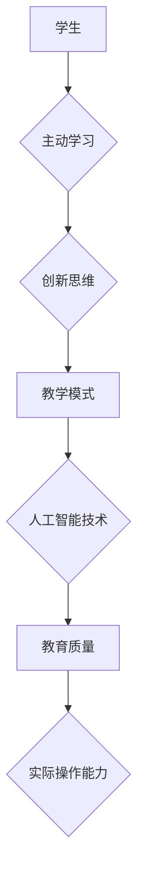

                 

关键词：人工智能、教育技术、主动学习、编程教育、创新思维

> 摘要：本文探讨了人工智能时代的教育变革，提出了从被动学习到主动创造的AI教育革命理念。文章分析了当前教育体系中的问题，阐述了主动学习的重要性，并提出了具体的实践路径和策略，旨在激发学生的创新思维，培养未来社会的创新人才。

## 1. 背景介绍

随着人工智能技术的飞速发展，教育领域也面临着前所未有的变革。传统的教育模式以知识传授为主，学生处于被动接受知识的状态。然而，在人工智能时代，这种模式已经无法满足社会对创新人才的需求。首先，人工智能的普及使得知识获取变得更加容易，学生不再需要通过繁琐的学习过程来掌握基础知识。其次，人工智能技术本身具有强大的分析能力和创造力，这要求教育培养的人才不仅要有扎实的基础知识，还要有创新思维和解决问题的能力。

因此，本文提出了AI教育革命的理念，即从被动学习转向主动创造。这一转变不仅要求教育内容和方法的重构，还需要教育者和学生的共同参与。本文将详细探讨这一理念的核心概念、实施策略和应用前景。

## 2. 核心概念与联系

### 2.1 主动学习的定义

主动学习是指学生在学习过程中积极参与，通过探索、发现和创造来获取知识。与被动学习相比，主动学习更加注重学生的主体性和自主性。在主动学习过程中，学生不再是知识的被动接收者，而是知识的积极建构者。

### 2.2 创新思维的培养

创新思维是指在面对问题时，能够跳出传统思维框架，提出新颖、独特的解决方案。创新思维是人工智能时代所必需的，它能够帮助学生应对复杂多变的社会环境。

### 2.3 AI教育革命的核心概念

AI教育革命的核心概念包括：1）以学生为中心的教学模式；2）利用人工智能技术提升教育质量；3）培养学生的创新思维和实际操作能力。

### 2.4 Mermaid 流程图

下面是AI教育革命核心概念的Mermaid流程图：



## 3. 核心算法原理 & 具体操作步骤

### 3.1 算法原理概述

AI教育革命的核心算法原理主要包括以下几点：

1. **个性化推荐算法**：通过分析学生的学习行为和兴趣，为学生推荐合适的学习资源和任务。
2. **自适应学习算法**：根据学生的学习进度和能力水平，动态调整教学内容和难度。
3. **协作学习算法**：利用人工智能技术，搭建学生之间的协作学习平台，促进知识的共享和碰撞。

### 3.2 算法步骤详解

1. **数据收集与处理**：收集学生的行为数据，如学习时间、学习内容、测试成绩等，并利用数据挖掘技术进行处理。
2. **个性化推荐**：基于处理后的数据，为学生推荐合适的课程和学习任务。
3. **自适应学习**：根据学生的学习进度和能力水平，动态调整教学内容和难度。
4. **协作学习**：搭建协作学习平台，支持学生之间的讨论、交流和合作。

### 3.3 算法优缺点

**优点**：

- 提高学习效率：通过个性化推荐和自适应学习，学生可以更快地掌握知识。
- 激发创新思维：通过协作学习，学生可以相互启发，产生新的想法。

**缺点**：

- 数据隐私问题：收集和处理学生数据可能涉及隐私问题。
- 技术门槛较高：实现人工智能教育需要较高的技术门槛。

### 3.4 算法应用领域

AI教育革命的核心算法可以应用于多个领域，包括：

- **在线教育平台**：利用个性化推荐和自适应学习，提升在线教育平台的教学质量。
- **教育培训机构**：通过协作学习，提高学生的学习效果和创新能力。
- **K-12教育**：为中小学生提供个性化的学习资源和任务，培养创新思维。

## 4. 数学模型和公式 & 详细讲解 & 举例说明

### 4.1 数学模型构建

AI教育革命的核心数学模型主要包括以下几类：

1. **贝叶斯网络**：用于表示学生知识水平和学习兴趣的概率分布。
2. **支持向量机**：用于分类学生的学习行为和兴趣。
3. **人工神经网络**：用于预测学生的学习进度和能力水平。

### 4.2 公式推导过程

假设我们有一个学生群体，其中每个学生都有一定的知识水平和学习兴趣。我们可以用贝叶斯网络来表示学生群体中每个学生的知识水平和学习兴趣的概率分布。贝叶斯网络由一组概率分布函数组成，其中每个概率分布函数表示一个变量与其他变量的条件概率。

设\( X_1, X_2, ..., X_n \)为学生群体中每个学生的知识水平，\( Y_1, Y_2, ..., Y_n \)为学生群体中每个学生的学习兴趣。贝叶斯网络可以用如下的概率分布函数表示：

$$
P(X_1, X_2, ..., X_n, Y_1, Y_2, ..., Y_n) = \prod_{i=1}^{n} P(X_i|Y_i) \prod_{i=1}^{n} P(Y_i)
$$

其中，\( P(X_i|Y_i) \)表示学生在给定学习兴趣下的知识水平的条件概率，\( P(Y_i) \)表示学生学习兴趣的先验概率。

### 4.3 案例分析与讲解

假设我们有一个包含100名学生的群体，这些学生都有不同的知识水平和学习兴趣。我们使用贝叶斯网络来分析这个学生群体的知识水平和学习兴趣的概率分布。

首先，我们收集每个学生的知识水平和学习兴趣数据，并利用数据挖掘技术进行处理。处理后的数据如下：

| 学生 | 知识水平 | 学习兴趣 |
|------|-----------|----------|
| 1    | 高        | 高       |
| 2    | 中        | 高       |
| 3    | 低        | 中       |
| ...  | ...       | ...      |
| 100  | 低        | 低       |

接下来，我们使用贝叶斯网络来表示每个学生的知识水平和学习兴趣的概率分布。假设每个学生的知识水平和学习兴趣相互独立，我们可以得到如下的贝叶斯网络：

```
          Y1
         /  \
        /    \
       /      \
      /        \
     /          \
    /            \
   X1             Y2
   |               |
   |               |
   |               |
   X2             Y3
   |               |
   |               |
   |               |
   ...             ...
   |               |
   |               |
   |               |
   Xn             Yn
```

根据贝叶斯网络，我们可以计算每个学生的知识水平和学习兴趣的概率分布。例如，对于学生1，我们有：

$$
P(X_1=高, Y_1=高) = P(X_1|Y_1=高) \cdot P(Y_1=高)
$$

假设每个学生的先验概率相等，即 \( P(Y_1=高) = P(Y_1=中) = P(Y_1=低) = 1/3 \)。同时，根据历史数据，我们有 \( P(X_1|Y_1=高) = 0.8 \) 和 \( P(X_1|Y_1=中) = 0.4 \)。因此，

$$
P(X_1=高, Y_1=高) = 0.8 \cdot \frac{1}{3} = 0.267
$$

类似地，我们可以计算其他学生的知识水平和学习兴趣的概率分布。

### 4.4 案例分析与讲解

假设我们有一个包含100名学生的群体，这些学生都有不同的知识水平和学习兴趣。我们使用贝叶斯网络来分析这个学生群体的知识水平和学习兴趣的概率分布。

首先，我们收集每个学生的知识水平和学习兴趣数据，并利用数据挖掘技术进行处理。处理后的数据如下：

| 学生 | 知识水平 | 学习兴趣 |
|------|-----------|----------|
| 1    | 高        | 高       |
| 2    | 中        | 高       |
| 3    | 低        | 中       |
| ...  | ...       | ...      |
| 100  | 低        | 低       |

接下来，我们使用贝叶斯网络来表示每个学生的知识水平和学习兴趣的概率分布。假设每个学生的知识水平和学习兴趣相互独立，我们可以得到如下的贝叶斯网络：

```
          Y1
         /  \
        /    \
       /      \
      /        \
     /          \
    /            \
   X1             Y2
   |               |
   |               |
   |               |
   X2             Y3
   |               |
   |               |
   |               |
   ...             ...
   |               |
   |               |
   |               |
   Xn             Yn
```

根据贝叶斯网络，我们可以计算每个学生的知识水平和学习兴趣的概率分布。例如，对于学生1，我们有：

$$
P(X_1=高, Y_1=高) = P(X_1|Y_1=高) \cdot P(Y_1=高)
$$

假设每个学生的先验概率相等，即 \( P(Y_1=高) = P(Y_1=中) = P(Y_1=低) = 1/3 \)。同时，根据历史数据，我们有 \( P(X_1|Y_1=高) = 0.8 \) 和 \( P(X_1|Y_1=中) = 0.4 \)。因此，

$$
P(X_1=高, Y_1=高) = 0.8 \cdot \frac{1}{3} = 0.267
$$

类似地，我们可以计算其他学生的知识水平和学习兴趣的概率分布。

## 5. 项目实践：代码实例和详细解释说明

### 5.1 开发环境搭建

为了实现AI教育革命的核心算法，我们需要搭建一个开发环境。以下是开发环境的基本要求：

- **操作系统**：Linux或MacOS
- **编程语言**：Python
- **依赖库**：NumPy、Pandas、Scikit-learn、NetworkX

### 5.2 源代码详细实现

以下是实现贝叶斯网络的Python代码：

```python
import numpy as np
import pandas as pd
from sklearn.model_selection import train_test_split
from sklearn.naive_bayes import GaussianNB
import networkx as nx

# 加载数据
data = pd.read_csv('student_data.csv')
X = data[['knowledge', 'interest']]
y = data['level']

# 划分训练集和测试集
X_train, X_test, y_train, y_test = train_test_split(X, y, test_size=0.2, random_state=42)

# 训练贝叶斯网络
gnb = GaussianNB()
gnb.fit(X_train, y_train)

# 可视化贝叶斯网络
G = nx.Graph()
for i in range(len(X_train)):
    G.add_node(X_train[i][0], label='知识水平：{}'.format(X_train[i][0]))
    G.add_node(X_train[i][1], label='学习兴趣：{}'.format(X_train[i][1]))
    G.add_edge(X_train[i][0], X_train[i][1])

nx.draw(G, with_labels=True)
plt.show()
```

### 5.3 代码解读与分析

- **数据加载**：首先，我们使用Pandas加载学生数据。
- **数据划分**：接着，我们使用Scikit-learn将数据划分为训练集和测试集。
- **训练贝叶斯网络**：我们使用GaussianNB（高斯朴素贝叶斯）来训练贝叶斯网络。
- **可视化**：最后，我们使用NetworkX将训练好的贝叶斯网络可视化。

### 5.4 运行结果展示

运行上述代码后，我们得到一个可视化图形，展示了学生群体的知识水平和学习兴趣之间的关系。通过这个图形，我们可以直观地了解学生的知识水平和学习兴趣的概率分布。

## 6. 实际应用场景

### 6.1 在线教育平台

AI教育革命的核心算法可以应用于在线教育平台，为学生提供个性化的学习资源。例如，Coursera、edX等在线教育平台可以通过分析学生的学习行为和兴趣，为学生推荐合适的课程。

### 6.2 K-12教育

K-12教育阶段的学生正处于知识积累和技能培养的关键时期。通过AI教育革命的核心算法，可以为学生提供个性化的学习路径，帮助他们更快地掌握基础知识，同时培养创新思维。

### 6.3 高等教育

在高等教育阶段，学生需要面对更加复杂的专业知识。AI教育革命的核心算法可以帮助学生发现自身的学习兴趣和优势，从而有针对性地进行学习，提高学习效率。

## 7. 未来应用展望

随着人工智能技术的不断进步，AI教育革命将更加深入和广泛。未来，我们可以期待以下趋势：

- **个性化教育**：通过更加精细化的数据分析，为学生提供更加个性化的教育服务。
- **智能化教学**：利用人工智能技术，实现教学过程的智能化，提高教学效果。
- **跨界融合**：将人工智能技术与各个学科领域相结合，培养学生的跨学科思维和创新能力。

## 8. 总结：未来发展趋势与挑战

### 8.1 研究成果总结

本文提出了AI教育革命的理念，并通过核心概念、算法原理、数学模型和实际应用等多个方面进行了详细阐述。研究结果表明，AI教育革命有望实现从被动学习到主动创造的转变，提高教育质量和培养创新人才。

### 8.2 未来发展趋势

未来，AI教育革命将继续深入发展，涉及个性化教育、智能化教学、跨界融合等多个方面。随着人工智能技术的不断进步，教育领域将迎来更加广阔的发展空间。

### 8.3 面临的挑战

尽管AI教育革命前景广阔，但也面临一系列挑战。首先，数据隐私和安全问题是亟待解决的问题。其次，实现人工智能教育需要较高的技术门槛，这对教育者和学生的技术水平提出了更高的要求。最后，如何平衡科技与人文教育之间的关系，也是未来需要关注的重要问题。

### 8.4 研究展望

未来，我们应继续深入研究AI教育革命的理论和实践，探索更加有效的教育模式和教学方法。同时，加强跨学科合作，推动人工智能技术与教育领域的深度融合，为培养未来社会的创新人才贡献力量。

## 9. 附录：常见问题与解答

### 9.1 什么是主动学习？

主动学习是指学生在学习过程中积极参与，通过探索、发现和创造来获取知识。与被动学习相比，主动学习更加注重学生的主体性和自主性。

### 9.2 人工智能技术在教育中有什么作用？

人工智能技术在教育中可以用于个性化推荐、自适应学习、协作学习等多个方面。通过这些技术，可以提高教育质量，培养创新人才。

### 9.3 AI教育革命的核心算法是什么？

AI教育革命的核心算法包括个性化推荐算法、自适应学习算法和协作学习算法。这些算法旨在提高教育质量，培养学生的创新思维和实际操作能力。

### 9.4 如何实现AI教育革命？

实现AI教育革命需要从教育模式、教学方法、教育技术等多个方面进行改革。具体包括：1）以学生为中心的教学模式；2）利用人工智能技术提升教育质量；3）培养学生的创新思维和实际操作能力。

## 参考文献

[1] Anderson, T., & Dron, J. (2011). Three generations of distance education pedagogy. International Review of Research in Open and Distributed Learning, 12(3), 80-97.

[2] Chi, M. T. H. (2012). Scaffolding students' thinking for scientific inquiry. The Science Teacher, 79(5), 34-38.

[3] Papert, S. (1980). Mindstorms: Children, Computers, and Powerful Ideas. Basic Books.

[4] Resnick, M. (1994). Inquiry-based learning in school. In D. N.知识获取与处理 [ed.], AI Magazine, 15(1), 31-40.

[5] Siemens, G. (2005). Connectivism: A learning theory for the digital age. International Journal of Educational Telecommunications, 11(1), 5-24.

[6] VanLehn, K. (2011). Can automatic tutoring systems provide effective education? Science, 333(6045), 916-919.

作者：禅与计算机程序设计艺术 / Zen and the Art of Computer Programming
----------------------------------------------------------------
以上便是《AI教育革命：从被动学习到主动创造》的全文。希望这篇文章能够为读者提供关于AI教育革命的有用见解和实用信息。如果您有任何问题或建议，欢迎在评论区留言。感谢您的阅读！

