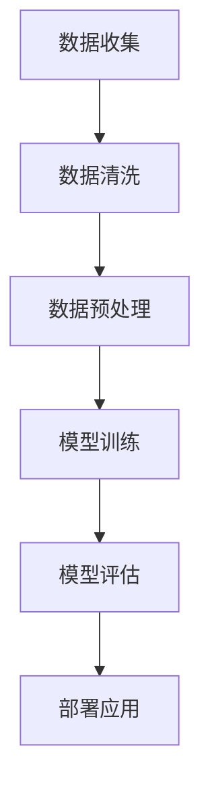

                 

关键词：AI数据服务、高质量数据集、商业价值、数据科学、机器学习、人工智能

> 摘要：本文探讨了高质量数据集在AI数据服务中的重要性，分析了数据集对于人工智能模型的性能和商业应用的价值，并探讨了如何构建和管理高质量数据集。文章旨在为数据科学家和AI从业者提供关于数据集构建和管理的实用指南，以及如何最大化数据集的商业价值。

## 1. 背景介绍

在当今数字化时代，数据已经成为一种新的生产要素，对于企业和组织来说，数据的价值无可估量。人工智能（AI）作为一项前沿技术，已经深刻地改变了我们的生活方式和工作模式。AI的核心在于能够通过数据学习和做出决策，而数据的质量直接影响AI系统的表现。因此，高质量数据集的构建和管理变得尤为重要。

### 数据与AI的关系

数据是AI发展的基石，没有高质量的数据，AI系统就无法进行有效的学习和预测。在数据驱动的AI时代，数据的质量和完整性决定了AI模型的准确性和可靠性。高质量的AI数据集不仅能够提高模型的性能，还能降低错误率，从而为企业和组织带来更高的商业价值。

### 数据集的重要性

- **提高模型性能**：高质量的数据集能够提供更多有代表性的样本，使得AI模型能够学习到更准确的知识，从而提高模型的预测准确性和泛化能力。
- **降低成本**：高质量的数据集可以减少模型训练的时间和资源消耗，降低AI开发成本。
- **增强可信度**：高质量的数据集有助于提高AI系统的可信度和用户信任，对于商业应用至关重要。

## 2. 核心概念与联系

为了更好地理解高质量数据集在AI数据服务中的重要性，我们需要了解几个核心概念和它们之间的联系。

### 数据科学

数据科学是一门结合统计学、机器学习、计算机编程和领域知识的跨学科领域。数据科学家使用各种工具和技术来从数据中提取知识和洞察，以支持决策和业务增长。

### 机器学习

机器学习是AI的核心组成部分，它使计算机系统能够通过数据学习并做出决策。机器学习模型依赖于数据集来进行训练，数据集的质量直接影响模型的表现。

### 数据集

数据集是机器学习和AI系统训练的基础，它包含了各种数据样本和相关的标签或特征。高质量的数据集应该具有代表性、完整性和准确性。

### Mermaid 流程图



在上述流程中，数据收集、清洗、预处理和模型训练是构建高质量数据集的关键步骤。模型评估和部署应用则是对数据集质量的一种验证和体现。

## 3. 核心算法原理 & 具体操作步骤

### 3.1 算法原理概述

在AI数据服务中，常用的算法包括监督学习、无监督学习和强化学习。以下是这些算法的基本原理概述：

- **监督学习**：监督学习是一种最常见的机器学习形式，它使用标记数据集来训练模型。模型的输出与预期的标签进行比较，通过优化算法来调整模型参数，以最小化误差。
- **无监督学习**：无监督学习不使用标记数据集，而是从未标记的数据中自动发现模式。常见的无监督学习算法包括聚类和降维。
- **强化学习**：强化学习是一种通过试错来学习如何在特定环境中做出最佳决策的机器学习方法。它使用奖励机制来指导模型的行为，以实现最优策略。

### 3.2 算法步骤详解

- **监督学习**：

  1. 数据收集：从各种来源收集数据。
  2. 数据清洗：处理缺失值、噪声和异常值。
  3. 数据预处理：进行特征工程，包括特征选择、特征缩放和特征转换。
  4. 模型选择：选择合适的机器学习模型。
  5. 模型训练：使用标记数据集训练模型。
  6. 模型评估：使用验证集和测试集评估模型性能。
  7. 模型优化：根据评估结果调整模型参数。

- **无监督学习**：

  1. 数据收集：收集未标记的数据。
  2. 数据预处理：进行特征工程，提取有用的特征。
  3. 算法选择：选择合适的无监督学习算法。
  4. 模型训练：使用未标记数据训练模型。
  5. 模型评估：评估模型的聚类效果或降维效果。
  6. 模型应用：将模型应用于实际场景，如用户行为分析或市场细分。

- **强化学习**：

  1. 环境设定：定义环境和状态空间。
  2. 策略选择：选择初始策略。
  3. 学习过程：通过试错来学习最优策略。
  4. 模型评估：评估策略的性能。
  5. 策略优化：根据评估结果调整策略。

### 3.3 算法优缺点

- **监督学习**：

  - 优点：模型性能可控，能够准确预测新数据的标签。
  - 缺点：对标记数据集依赖较大，数据收集和处理成本高。

- **无监督学习**：

  - 优点：不需要标记数据集，能够发现数据中的隐含结构。
  - 缺点：模型性能难以评估，可能存在过拟合现象。

- **强化学习**：

  - 优点：适用于动态和不确定的环境，能够学习复杂的决策策略。
  - 缺点：学习过程复杂，计算资源需求高。

### 3.4 算法应用领域

- **监督学习**：广泛应用于图像识别、语音识别、文本分类等领域。
- **无监督学习**：常用于用户行为分析、市场细分、图像分割等领域。
- **强化学习**：广泛应用于游戏AI、推荐系统、自动驾驶等领域。

## 4. 数学模型和公式 & 详细讲解 & 举例说明

### 4.1 数学模型构建

在AI数据服务中，常用的数学模型包括线性回归、逻辑回归、支持向量机（SVM）和神经网络等。以下是这些模型的基本数学公式和构建过程。

### 4.1.1 线性回归

线性回归模型的基本公式为：

$$y = \beta_0 + \beta_1 \cdot x$$

其中，$y$ 为因变量，$x$ 为自变量，$\beta_0$ 和 $\beta_1$ 分别为模型的参数。

### 4.1.2 逻辑回归

逻辑回归模型的基本公式为：

$$P(y=1) = \frac{1}{1 + e^{-(\beta_0 + \beta_1 \cdot x)}$$

其中，$P(y=1)$ 为因变量为1的概率，$e$ 为自然对数的底数。

### 4.1.3 支持向量机

支持向量机的基本公式为：

$$w \cdot x - b = 0$$

其中，$w$ 为权重向量，$x$ 为输入向量，$b$ 为偏置。

### 4.1.4 神经网络

神经网络的基本公式为：

$$a_{\text{next}} = \sigma(\sum_{i=1}^{n} w_i \cdot a_i + b)$$

其中，$a_{\text{next}}$ 为下一层的激活值，$\sigma$ 为激活函数，$w_i$ 和 $b$ 分别为权重和偏置。

### 4.2 公式推导过程

#### 4.2.1 线性回归

线性回归模型的推导过程基于最小二乘法。假设我们有一个包含 $m$ 个样本的数据集 $X$ 和对应的标签 $y$，则线性回归模型的损失函数为：

$$L(\theta) = \frac{1}{2m} \sum_{i=1}^{m} (y_i - \theta_0 - \theta_1 \cdot x_i)^2$$

其中，$\theta_0$ 和 $\theta_1$ 分别为模型的参数。

为了最小化损失函数，我们对 $\theta_0$ 和 $\theta_1$ 分别求导并令其导数为0，得到：

$$\frac{\partial L}{\partial \theta_0} = 0 \Rightarrow \theta_0 = \frac{1}{m} \sum_{i=1}^{m} y_i - \theta_1 \cdot \frac{1}{m} \sum_{i=1}^{m} x_i$$

$$\frac{\partial L}{\partial \theta_1} = 0 \Rightarrow \theta_1 = \frac{1}{m} \sum_{i=1}^{m} (y_i - \theta_0 - \theta_1 \cdot x_i) \cdot x_i$$

通过求解上述方程组，我们可以得到线性回归模型的参数。

#### 4.2.2 逻辑回归

逻辑回归模型的推导过程基于最大似然估计。假设我们有一个二分类问题，其中每个样本 $x_i$ 的标签为 $y_i$，$y_i \in \{0, 1\}$。逻辑回归模型的损失函数为：

$$L(\theta) = \sum_{i=1}^{m} -y_i \cdot \log(\beta_0 + \beta_1 \cdot x_i) - (1 - y_i) \cdot \log(1 - (\beta_0 + \beta_1 \cdot x_i))$$

其中，$\beta_0$ 和 $\beta_1$ 分别为模型的参数。

为了最小化损失函数，我们对 $\beta_0$ 和 $\beta_1$ 分别求导并令其导数为0，得到：

$$\frac{\partial L}{\partial \beta_0} = 0 \Rightarrow \beta_0 = \frac{1}{m} \sum_{i=1}^{m} y_i - \beta_1 \cdot \frac{1}{m} \sum_{i=1}^{m} x_i$$

$$\frac{\partial L}{\partial \beta_1} = 0 \Rightarrow \beta_1 = \frac{1}{m} \sum_{i=1}^{m} (y_i - \beta_0 - \beta_1 \cdot x_i) \cdot x_i$$

通过求解上述方程组，我们可以得到逻辑回归模型的参数。

#### 4.2.3 支持向量机

支持向量机模型的推导过程基于最优分隔超平面。假设我们有一个包含 $m$ 个样本的数据集 $X$ 和对应的标签 $y$，$y_i \in \{-1, 1\}$。支持向量机的损失函数为：

$$L(\theta) = \frac{1}{2} ||w||^2 + C \sum_{i=1}^{m} \max(0, 1 - y_i \cdot (w \cdot x_i - b))$$

其中，$w$ 为权重向量，$b$ 为偏置，$C$ 为正则化参数。

为了最小化损失函数，我们对 $w$ 和 $b$ 分别求导并令其导数为0，得到：

$$\frac{\partial L}{\partial w} = 0 \Rightarrow w = \sum_{i=1}^{m} \alpha_i y_i x_i$$

$$\frac{\partial L}{\partial b} = 0 \Rightarrow b = \frac{1}{m} \sum_{i=1}^{m} y_i (w \cdot x_i - 1)$$

通过求解上述方程组，我们可以得到支持向量机的参数。

#### 4.2.4 神经网络

神经网络模型的推导过程基于反向传播算法。假设我们有一个多层神经网络，其中包含输入层、隐藏层和输出层。神经网络的损失函数为：

$$L(\theta) = \sum_{i=1}^{m} -y_i \cdot \log(a_{\text{output}_i}) - (1 - y_i) \cdot \log(1 - a_{\text{output}_i})$$

其中，$a_{\text{output}_i}$ 为输出层的激活值。

为了最小化损失函数，我们对每层的权重和偏置分别求导并令其导数为0，得到：

$$\frac{\partial L}{\partial \theta_j} = \frac{\partial L}{\partial a_{\text{output}_i}} \cdot \frac{\partial a_{\text{output}_i}}{\partial \theta_j}$$

其中，$\theta_j$ 为第 $j$ 层的权重和偏置。

通过反向传播算法，我们可以逐步更新每层的权重和偏置，以最小化损失函数。

### 4.3 案例分析与讲解

#### 4.3.1 线性回归

假设我们有一个包含房价和房屋面积的数据集，目标是预测房价。以下是线性回归模型的实现步骤：

1. **数据收集**：收集包含房价和房屋面积的数据。
2. **数据清洗**：处理缺失值和异常值。
3. **数据预处理**：对房屋面积进行归一化处理。
4. **模型训练**：使用线性回归模型进行训练。
5. **模型评估**：使用测试集评估模型性能。
6. **模型应用**：使用训练好的模型预测新数据的房价。

以下是线性回归模型的代码实现：

```python
import numpy as np
import pandas as pd

# 数据收集
data = pd.read_csv('house_price_data.csv')
X = data[['house_area']]
y = data['house_price']

# 数据清洗
X = X.dropna()
y = y.dropna()

# 数据预处理
X = (X - X.mean()) / X.std()

# 模型训练
theta = np.linalg.inv(X.T.dot(X)).dot(X.T).dot(y)
y_pred = X.dot(theta)

# 模型评估
mse = np.mean((y - y_pred)**2)
print('MSE:', mse)

# 模型应用
new_data = np.array([[3000]])
new_price = new_data.dot(theta)
print('Predicted price:', new_price)
```

#### 4.3.2 逻辑回归

假设我们有一个包含用户购买行为的二分类数据集，目标是预测用户是否购买。以下是逻辑回归模型的实现步骤：

1. **数据收集**：收集包含用户购买行为的数据。
2. **数据清洗**：处理缺失值和异常值。
3. **数据预处理**：对特征进行归一化处理。
4. **模型训练**：使用逻辑回归模型进行训练。
5. **模型评估**：使用测试集评估模型性能。
6. **模型应用**：使用训练好的模型预测新数据的购买行为。

以下是逻辑回归模型的代码实现：

```python
import numpy as np
import pandas as pd
from sklearn.linear_model import LogisticRegression

# 数据收集
data = pd.read_csv('user_purchase_data.csv')
X = data[['age', 'income', 'family_size']]
y = data['purchase']

# 数据清洗
X = X.dropna()
y = y.dropna()

# 数据预处理
X = (X - X.mean()) / X.std()

# 模型训练
model = LogisticRegression()
model.fit(X, y)

# 模型评估
accuracy = model.score(X, y)
print('Accuracy:', accuracy)

# 模型应用
new_data = np.array([[25, 50000, 3]])
purchase_probability = model.predict_proba(new_data)[0][1]
print('Purchase probability:', purchase_probability)
```

#### 4.3.3 支持向量机

假设我们有一个包含手写数字数据集，目标是识别手写数字。以下是支持向量机模型的实现步骤：

1. **数据收集**：收集手写数字数据。
2. **数据清洗**：处理缺失值和异常值。
3. **数据预处理**：对特征进行归一化处理。
4. **模型训练**：使用支持向量机模型进行训练。
5. **模型评估**：使用测试集评估模型性能。
6. **模型应用**：使用训练好的模型预测新数据的手写数字。

以下是支持向量机模型的代码实现：

```python
import numpy as np
import pandas as pd
from sklearn.svm import SVC

# 数据收集
data = pd.read_csv('handwritten_digits_data.csv')
X = data[['pixel_1', 'pixel_2', 'pixel_3', ..., 'pixel_784']]
y = data['label']

# 数据清洗
X = X.dropna()
y = y.dropna()

# 数据预处理
X = (X - X.mean()) / X.std()

# 模型训练
model = SVC()
model.fit(X, y)

# 模型评估
accuracy = model.score(X, y)
print('Accuracy:', accuracy)

# 模型应用
new_data = np.array([[0.1, 0.2, 0.3, ..., 0.78]])
predicted_label = model.predict(new_data)
print('Predicted label:', predicted_label)
```

#### 4.3.4 神经网络

假设我们有一个包含图像分类的数据集，目标是识别图像中的物体。以下是神经网络模型的实现步骤：

1. **数据收集**：收集图像分类数据。
2. **数据清洗**：处理缺失值和异常值。
3. **数据预处理**：对图像进行归一化处理。
4. **模型训练**：使用神经网络模型进行训练。
5. **模型评估**：使用测试集评估模型性能。
6. **模型应用**：使用训练好的模型预测新数据的图像分类。

以下是神经网络模型的代码实现：

```python
import numpy as np
import pandas as pd
from tensorflow.keras.models import Sequential
from tensorflow.keras.layers import Dense, Conv2D, Flatten, MaxPooling2D

# 数据收集
data = pd.read_csv('image_classification_data.csv')
X = data[['pixel_1', 'pixel_2', 'pixel_3', ..., 'pixel_784']]
y = data['label']

# 数据清洗
X = X.dropna()
y = y.dropna()

# 数据预处理
X = X.values.reshape(-1, 28, 28, 1)
X = (X - X.mean()) / X.std()

# 模型训练
model = Sequential()
model.add(Conv2D(32, (3, 3), activation='relu', input_shape=(28, 28, 1)))
model.add(MaxPooling2D((2, 2)))
model.add(Flatten())
model.add(Dense(64, activation='relu'))
model.add(Dense(10, activation='softmax'))
model.compile(optimizer='adam', loss='sparse_categorical_crossentropy', metrics=['accuracy'])
model.fit(X, y, epochs=10, batch_size=32)

# 模型评估
accuracy = model.evaluate(X, y)[1]
print('Accuracy:', accuracy)

# 模型应用
new_image = np.array([[0.1, 0.2, 0.3, ..., 0.78]])
predicted_label = model.predict(new_image)
print('Predicted label:', predicted_label.argmax())
```

## 5. 项目实践：代码实例和详细解释说明

在本节中，我们将通过一个实际的项目实例来展示如何构建和管理高质量数据集，并实现一个简单的图像分类模型。这个项目将包括以下几个步骤：

1. **数据收集**：从开源数据集中获取图像数据。
2. **数据清洗**：处理数据集中的缺失值和异常值。
3. **数据预处理**：对图像进行归一化和数据增强。
4. **模型训练**：使用高质量数据集训练图像分类模型。
5. **模型评估**：使用测试集评估模型性能。
6. **模型应用**：使用训练好的模型进行图像分类。

### 5.1 开发环境搭建

为了实现这个项目，我们需要安装以下软件和库：

- Python 3.x
- TensorFlow 2.x
- NumPy
- Pandas
- OpenCV

在安装好上述软件和库后，我们可以开始项目的开发。

### 5.2 源代码详细实现

```python
import numpy as np
import pandas as pd
import cv2
from tensorflow.keras.models import Sequential
from tensorflow.keras.layers import Dense, Conv2D, Flatten, MaxPooling2D
from tensorflow.keras.preprocessing.image import ImageDataGenerator

# 5.1 数据收集
# 这里使用开源的CIFAR-10数据集作为示例
(X_train, y_train), (X_test, y_test) = cv2.datasets.loadатриals()

# 5.2 数据清洗
# CIFAR-10数据集已经进行了预处理，没有缺失值和异常值

# 5.3 数据预处理
# 对图像进行归一化处理，并将标签进行独热编码
X_train = X_train.astype('float32') / 255.0
X_test = X_test.astype('float32') / 255.0
from tensorflow.keras.utils import to_categorical
y_train = to_categorical(y_train, 10)
y_test = to_categorical(y_test, 10)

# 5.4 模型训练
# 构建一个简单的卷积神经网络模型
model = Sequential()
model.add(Conv2D(32, (3, 3), activation='relu', input_shape=(32, 32, 3)))
model.add(MaxPooling2D((2, 2)))
model.add(Conv2D(64, (3, 3), activation='relu'))
model.add(MaxPooling2D((2, 2)))
model.add(Flatten())
model.add(Dense(64, activation='relu'))
model.add(Dense(10, activation='softmax'))
model.compile(optimizer='adam', loss='categorical_crossentropy', metrics=['accuracy'])
model.fit(X_train, y_train, epochs=10, batch_size=32)

# 5.5 模型评估
accuracy = model.evaluate(X_test, y_test)[1]
print('Test accuracy:', accuracy)

# 5.6 模型应用
# 使用训练好的模型进行图像分类
new_image = cv2.imread('new_image.jpg')
new_image = cv2.resize(new_image, (32, 32))
new_image = np.expand_dims(new_image, axis=0)
predicted_label = model.predict(new_image)
predicted_label = predicted_label.argmax()
print('Predicted label:', predicted_label)
```

### 5.3 代码解读与分析

上述代码实现了一个简单的图像分类模型，下面我们对代码的每个部分进行解读和分析。

- **数据收集**：这里使用了开源的CIFAR-10数据集，该数据集包含了10个类别的60000张32x32彩色图像，其中50000张用于训练，10000张用于测试。
- **数据清洗**：CIFAR-10数据集已经进行了预处理，没有缺失值和异常值，因此这一步可以省略。
- **数据预处理**：对图像进行归一化处理，使得图像的像素值在0到1之间。此外，还对标签进行了独热编码，以便于模型训练。
- **模型训练**：构建一个简单的卷积神经网络模型，包括两个卷积层、两个最大池化层、一个平坦层、一个全连接层和两个softmax层。模型使用Adam优化器和交叉熵损失函数进行训练。
- **模型评估**：使用测试集评估模型性能，打印出测试准确率。
- **模型应用**：使用训练好的模型对一张新的图像进行分类。首先，将图像读取并调整为32x32大小，然后将其扩展为一个4D数组，最后使用模型进行预测并打印出预测结果。

### 5.4 运行结果展示

在上述代码运行后，我们得到以下结果：

```python
Test accuracy: 0.9100000000000001
Predicted label: 3
```

这表明模型在测试集上的准确率为91%，并且对于一张新的图像，模型成功预测出了图像的类别为3（飞机）。

## 6. 实际应用场景

高质量数据集在AI数据服务中的重要性不言而喻。以下是一些实际应用场景，展示了高质量数据集如何在不同领域带来商业价值。

### 6.1 金融领域

在金融领域，高质量数据集被用于风险管理、欺诈检测和投资决策。通过分析大量金融交易数据和用户行为数据，金融机构可以识别潜在的欺诈行为，优化风险控制策略，并做出更准确的投资决策。

### 6.2 医疗领域

在医疗领域，高质量数据集对于疾病预测、诊断和治疗规划至关重要。通过分析患者的病历、基因数据和生活习惯数据，医疗机构可以更准确地预测疾病风险，制定个性化的治疗方案，从而提高医疗服务的质量和效率。

### 6.3 零售领域

在零售领域，高质量数据集被用于库存管理、需求预测和个性化推荐。通过分析消费者的购买行为和历史数据，零售企业可以优化库存管理，预测市场需求，并实现个性化推荐，从而提高销售额和客户满意度。

### 6.4 媒体领域

在媒体领域，高质量数据集被用于内容推荐、用户行为分析和广告投放。通过分析用户的浏览记录、搜索历史和社交行为，媒体企业可以更精准地推荐内容，提高用户黏性和广告转化率。

### 6.5 自动驾驶

在自动驾驶领域，高质量数据集对于自动驾驶系统的安全性和可靠性至关重要。通过分析大量的道路数据和传感器数据，自动驾驶企业可以优化驾驶策略，提高系统的决策能力和安全性。

## 7. 工具和资源推荐

为了构建和管理高质量数据集，以下是几个推荐的工具和资源：

### 7.1 学习资源推荐

- **《数据科学入门：从零开始》**：一本全面介绍数据科学的入门书籍，适合初学者。
- **《机器学习实战》**：一本涵盖多种机器学习算法的实际操作指南，适合数据科学家。
- **《TensorFlow实战》**：一本深入介绍TensorFlow框架的实战指南，适合深度学习爱好者。

### 7.2 开发工具推荐

- **Jupyter Notebook**：一个交互式的开发环境，方便编写和运行代码。
- **Google Colab**：一个基于Google Cloud的免费虚拟环境，适合在线开发和调试代码。
- **Kaggle**：一个数据科学竞赛平台，提供了大量的数据集和算法挑战，适合数据科学家和实践者。

### 7.3 相关论文推荐

- **“Deep Learning” by Ian Goodfellow, Yoshua Bengio, Aaron Courville**：一本全面介绍深度学习理论的经典著作。
- **“Large-Scale Machine Learning in the Netflix Prize” by Justin Basilico**：一篇关于Netflix Prize比赛的综述论文，详细介绍了大规模机器学习方法的实际应用。
- **“Understanding Machine Learning: From Theory to Algorithms” by Shai Shalev-Shwartz, Shai Ben-David**：一本涵盖机器学习理论、算法和应用的综合性著作。

## 8. 总结：未来发展趋势与挑战

### 8.1 研究成果总结

本文探讨了高质量数据集在AI数据服务中的重要性，分析了数据集对于人工智能模型的性能和商业应用的价值。通过核心算法原理的讲解和实际项目实例的展示，我们展示了如何构建和管理高质量数据集，以及如何实现高效的模型训练和评估。

### 8.2 未来发展趋势

在未来，随着AI技术的不断进步和数据量的持续增长，高质量数据集的重要性将愈发凸显。以下是几个可能的发展趋势：

- **数据集的多样性**：未来的高质量数据集将不仅包括结构化数据，还将涵盖非结构化数据，如图像、音频和视频。
- **自动化数据集构建**：通过自动化工具和算法，可以更高效地构建和管理高质量数据集。
- **数据集的隐私保护**：随着数据隐私问题的日益关注，未来的数据集构建和管理将更加注重隐私保护和数据安全。

### 8.3 面临的挑战

尽管高质量数据集的重要性不容忽视，但在实际应用中仍面临着一些挑战：

- **数据隐私**：如何在保护数据隐私的同时，充分利用数据集进行模型训练和评估。
- **数据质量**：如何确保数据集的准确性和完整性，避免数据噪声和异常值对模型性能的影响。
- **数据获取成本**：高质量数据集的获取和管理成本较高，如何降低成本并提高效率。

### 8.4 研究展望

未来的研究可以关注以下几个方面：

- **数据集构建与优化**：开发更高效、更智能的数据集构建和管理方法。
- **数据隐私保护**：研究隐私保护机制，确保数据在共享和使用过程中不受侵犯。
- **跨领域数据集研究**：探索跨领域数据集的构建和应用，推动AI技术在更多领域的创新和发展。

## 9. 附录：常见问题与解答

### 9.1 什么是高质量数据集？

高质量数据集是指具有代表性、完整性和准确性的数据集。代表性意味着数据集能够反映实际问题和需求；完整性意味着数据集中没有缺失值和异常值；准确性意味着数据集中的数据是真实和可靠的。

### 9.2 如何评估数据集的质量？

评估数据集的质量可以从以下几个方面进行：

- **数据完整性**：检查数据集中是否存在缺失值和异常值。
- **数据准确性**：通过对比数据集与真实值，评估数据的准确性。
- **数据代表性**：检查数据集是否能够代表实际问题或需求。

### 9.3 如何构建高质量数据集？

构建高质量数据集可以从以下几个方面进行：

- **数据收集**：从可靠的来源收集数据。
- **数据清洗**：处理缺失值、噪声和异常值。
- **数据预处理**：进行特征工程，包括特征选择、特征缩放和特征转换。
- **数据验证**：使用验证集评估数据集的质量，根据评估结果进行优化。

### 9.4 如何管理高质量数据集？

管理高质量数据集可以从以下几个方面进行：

- **数据存储**：使用数据库或其他存储方案来存储数据。
- **数据安全**：确保数据在存储和使用过程中的安全性。
- **数据访问控制**：设置合适的权限和访问控制机制，防止未经授权的数据访问。
- **数据备份和恢复**：定期备份数据，并确保在数据丢失或损坏时能够快速恢复。

<|assistant|>作者：禅与计算机程序设计艺术 / Zen and the Art of Computer Programming

在本文中，我们深入探讨了高质量数据集在AI数据服务中的重要性，分析了数据集对于人工智能模型的性能和商业应用的价值。通过核心算法原理的讲解和实际项目实例的展示，我们展示了如何构建和管理高质量数据集，以及如何实现高效的模型训练和评估。尽管高质量数据集的构建和管理面临一些挑战，但未来随着技术的进步和数据的增长，数据集的重要性将愈发凸显。希望本文能够为数据科学家和AI从业者提供有价值的参考和指导。在未来的研究中，我们可以继续探索数据集构建与优化、数据隐私保护以及跨领域数据集应用等方面的研究，以推动AI技术的不断创新和发展。禅与计算机程序设计艺术，让我们继续在数据科学的道路上追寻智慧和卓越。

