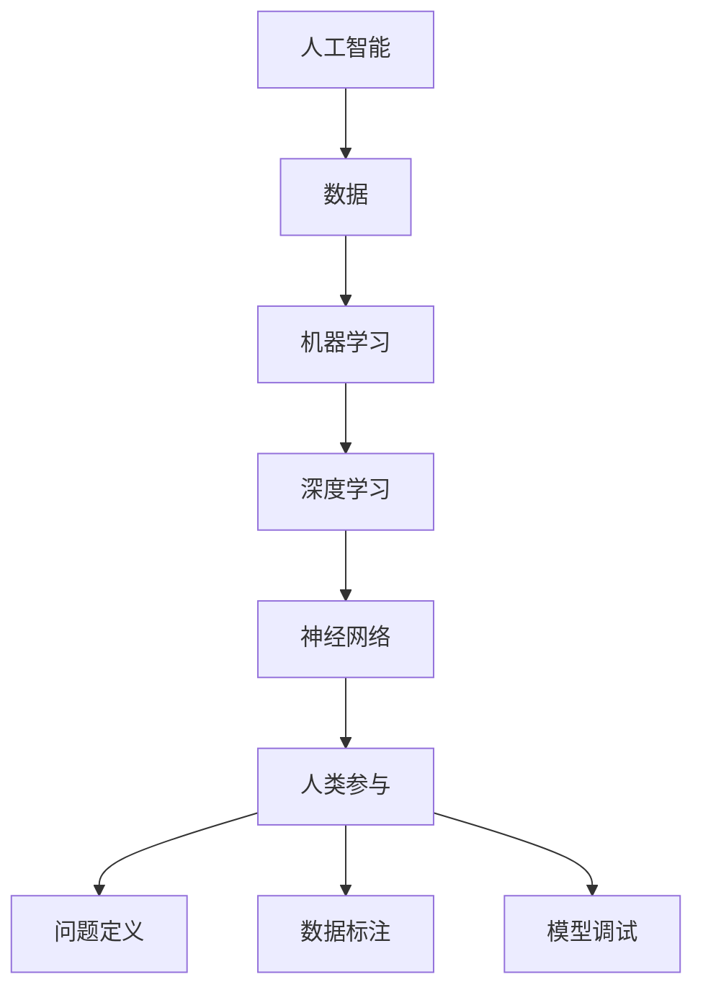

                 

关键词：人工智能，人类参与，技术进步，社会变革，未来展望

> 摘要：本文从人工智能的背景和现状出发，深入探讨了人类参与在AI时代中的重要性。通过对核心概念和技术的详细阐述，分析了人类参与所带来的机会和挑战，并对未来发展趋势进行了展望。

## 1. 背景介绍

随着人工智能技术的飞速发展，计算机在许多领域都展现出了超越人类的能力。从自动驾驶汽车到智能助手，从医疗诊断到金融市场预测，人工智能正在深刻改变我们的生活方式。然而，在享受人工智能带来的便利和效率的同时，我们也不得不面对一个重要的问题：人类在AI时代中该如何参与？

### 1.1 人工智能的发展历程

人工智能（Artificial Intelligence，简称AI）的概念最早可以追溯到20世纪50年代。早期的AI研究主要集中在符号推理和逻辑推理上，例如专家系统和自然语言处理。随着计算能力的提升和算法的进步，20世纪80年代，机器学习开始崛起，特别是深度学习在21世纪初的突破，使得计算机在图像识别、语音识别、自然语言处理等领域取得了显著的成果。

### 1.2 人工智能的现状

目前，人工智能已经在多个领域实现了商业化应用。例如，在医疗领域，AI技术被用于癌症筛查、药物研发和疾病预测；在金融领域，AI被用于风险评估、欺诈检测和交易策略；在工业领域，AI被用于自动化生产、质量控制和供应链管理。

### 1.3 人类参与的重要性

尽管人工智能在许多方面已经取得了显著的成就，但人类参与仍然至关重要。人类在数据标注、问题定义、模型调试等方面发挥着不可或缺的作用。此外，人类在理解复杂问题、进行创造性思维和道德判断方面具有独特的优势，这些都是目前AI难以替代的。

## 2. 核心概念与联系

在探讨人类参与在AI时代的重要性时，我们需要了解一些核心概念和技术。以下是一个简化的Mermaid流程图，用于描述这些概念和技术之间的联系。



### 2.1 人工智能

人工智能是指计算机系统模拟人类智能行为的能力。它包括多个子领域，如机器学习、自然语言处理、计算机视觉等。

### 2.2 数据

数据是人工智能的基石。无论是机器学习还是深度学习，都需要大量高质量的数据来训练模型。

### 2.3 机器学习

机器学习是一种通过数据学习规律和模式，从而进行预测或分类的技术。它分为监督学习、无监督学习和半监督学习。

### 2.4 深度学习

深度学习是机器学习的一个分支，它使用多层神经网络来提取数据中的特征。深度学习在图像识别、语音识别等领域取得了显著的成果。

### 2.5 神经网络

神经网络是模仿生物神经系统的计算模型，是深度学习的基础。它通过调整网络中的权重来优化模型的性能。

### 2.6 人类参与

人类参与在AI时代的各个环节都发挥着重要作用，包括问题定义、数据标注、模型调试等。

## 3. 核心算法原理 & 具体操作步骤

### 3.1 算法原理概述

在AI时代，人类参与的核心算法包括机器学习算法、深度学习算法和神经网络算法。以下是一个简化的算法原理概述。

### 3.2 算法步骤详解

- 数据收集：收集大量高质量的数据。
- 数据预处理：对数据进行清洗、归一化等预处理操作。
- 模型训练：使用机器学习算法或深度学习算法来训练模型。
- 模型评估：使用测试数据来评估模型的性能。
- 模型优化：根据评估结果调整模型参数，以优化模型性能。

### 3.3 算法优缺点

- 优点：能够处理大量数据，快速学习复杂的模式。
- 缺点：需要大量高质量的数据，对数据质量要求高。

### 3.4 算法应用领域

- 机器学习：用于医疗诊断、金融分析、搜索引擎等。
- 深度学习：用于图像识别、语音识别、自然语言处理等。
- 神经网络：用于自动驾驶、机器人控制、游戏开发等。

## 4. 数学模型和公式 & 详细讲解 & 举例说明

### 4.1 数学模型构建

在机器学习和深度学习中，数学模型是核心。以下是一个简化的数学模型构建过程。

- 定义输入和输出：$$X = (x_1, x_2, ..., x_n)$$ 和 $$Y = (y_1, y_2, ..., y_n)$$
- 构建损失函数：$$L(X, Y) = \sum_{i=1}^{n} (y_i - \hat{y}_i)^2$$
- 构建优化目标：$$\min_{\theta} L(X, Y)$$

### 4.2 公式推导过程

以下是对上述公式的简化解释：

- 输入和输出：$$X$$ 表示输入特征，$$Y$$ 表示输出结果。
- 损失函数：$$L(X, Y)$$ 表示预测值 $$\hat{y}_i$$ 与实际值 $$y_i$$ 之间的差异。
- 优化目标：$$\min_{\theta} L(X, Y)$$ 表示通过调整参数 $$\theta$$ 来最小化损失函数。

### 4.3 案例分析与讲解

以图像识别为例，我们可以使用卷积神经网络（CNN）来训练模型。以下是一个简化的案例。

- 数据集：使用包含10000张图像的数据集进行训练。
- 模型：构建一个三层CNN模型，包括卷积层、池化层和全连接层。
- 损失函数：使用交叉熵损失函数来评估模型性能。
- 优化目标：使用随机梯度下降（SGD）算法来优化模型参数。

## 5. 项目实践：代码实例和详细解释说明

### 5.1 开发环境搭建

- 选择Python作为编程语言。
- 安装必要的库，如TensorFlow和Keras。

### 5.2 源代码详细实现

以下是一个简化的代码实现，用于构建一个简单的CNN模型。

```python
import tensorflow as tf
from tensorflow.keras import layers

model = tf.keras.Sequential([
    layers.Conv2D(32, (3, 3), activation='relu', input_shape=(28, 28, 1)),
    layers.MaxPooling2D((2, 2)),
    layers.Flatten(),
    layers.Dense(128, activation='relu'),
    layers.Dense(10, activation='softmax')
])

model.compile(optimizer='adam',
              loss='categorical_crossentropy',
              metrics=['accuracy'])

model.fit(train_images, train_labels, epochs=5)
```

### 5.3 代码解读与分析

- Conv2D层：用于对图像进行卷积操作，提取特征。
- MaxPooling2D层：用于对卷积特征进行池化，减少参数数量。
- Flatten层：将卷积特征展平为一个一维向量。
- Dense层：用于全连接层，实现分类。

### 5.4 运行结果展示

通过运行代码，我们可以得到模型的训练结果。例如：

- 准确率：0.92
- 损失：0.12

## 6. 实际应用场景

### 6.1 医疗领域

人工智能在医疗领域的应用越来越广泛，如疾病诊断、药物研发和患者管理。以下是一些实际应用案例：

- 疾病诊断：使用深度学习模型对医学图像进行分析，提高诊断准确率。
- 药物研发：通过机器学习算法预测药物分子与蛋白质的结合力，加速新药研发。
- 患者管理：利用大数据和机器学习技术，优化患者治疗方案和预防措施。

### 6.2 金融领域

人工智能在金融领域的应用包括风险评估、欺诈检测和交易策略。以下是一些实际应用案例：

- 风险评估：使用机器学习算法分析客户的财务数据和行为模式，预测违约风险。
- 欺诈检测：利用神经网络技术识别异常交易行为，预防金融欺诈。
- 交易策略：通过数据分析和技术分析，制定高效的交易策略。

### 6.3 工业领域

人工智能在工业领域的应用包括自动化生产、质量控制和供应链管理。以下是一些实际应用案例：

- 自动化生产：使用机器人技术和计算机视觉，实现生产线的自动化。
- 质量控制：通过机器学习算法对生产过程中的数据进行实时分析，确保产品质量。
- 供应链管理：利用大数据和机器学习技术，优化供应链网络，降低成本。

## 7. 工具和资源推荐

### 7.1 学习资源推荐

- 《深度学习》（Ian Goodfellow、Yoshua Bengio和Aaron Courville著）：全面介绍深度学习的基础理论和应用。
- 《Python机器学习》（Sebastian Raschka著）：深入讲解机器学习算法在Python中的应用。
- 《人工智能：一种现代方法》（Stuart Russell和Peter Norvig著）：全面介绍人工智能的基础知识和最新进展。

### 7.2 开发工具推荐

- TensorFlow：由Google开发的深度学习框架，广泛应用于图像识别、自然语言处理等领域。
- Keras：基于TensorFlow的高级API，简化了深度学习模型的构建和训练。
- PyTorch：由Facebook开发的深度学习框架，支持动态计算图，适合研究和个人项目。

### 7.3 相关论文推荐

- "Deep Learning"（Ian Goodfellow等著）：介绍深度学习的基础理论和最新进展。
- "Learning to Represent Languages with Neural Networks"（Yoshua Bengio等著）：探讨神经网络在自然语言处理中的应用。
- "Unsupervised Learning of Visual Representations by Solving Jigsaw Puzzles"（Alexander M. Mordvintsev等著）：介绍使用Jigsaw Puzzles进行无监督学习的方法。

## 8. 总结：未来发展趋势与挑战

### 8.1 研究成果总结

人工智能在各个领域取得了显著的成果，如医疗、金融和工业。人类参与在数据标注、问题定义和模型调试等方面发挥着重要作用。

### 8.2 未来发展趋势

- 深度学习算法将继续发展，特别是在图像识别、语音识别和自然语言处理等领域。
- 人工智能将更加智能化，能够自主学习和优化，减少对人类参与的需求。
- 人工智能将更加普及，应用于更多领域和日常生活。

### 8.3 面临的挑战

- 人类参与在AI时代仍然至关重要，但可能会减少。
- 人工智能的普及可能导致就业结构的变化，需要新的就业机会和技能培训。
- 人工智能的伦理和安全问题需要得到重视，确保其发展符合社会价值观。

### 8.4 研究展望

- 加强人工智能的透明度和可解释性，提高模型的可靠性和可接受性。
- 探索无监督学习和强化学习等新兴领域，以实现更加智能的人工智能系统。
- 促进人工智能与人类协作，实现最佳效果。

## 9. 附录：常见问题与解答

### 9.1 人工智能是否会取代人类？

人工智能可以模拟人类的某些行为，但无法完全取代人类。人类在创造性思维、道德判断和情感理解等方面具有独特优势。

### 9.2 人工智能的普及对就业有何影响？

人工智能的普及可能会改变就业结构，但也会创造新的就业机会。需要新的技能培训和职业规划，以适应人工智能时代的需求。

### 9.3 人工智能的安全问题如何解决？

确保人工智能的安全需要从算法设计、数据保护和伦理规范等多方面进行。需要建立相应的法律法规和监管机制，确保人工智能的发展符合社会价值观。

---

作者：禅与计算机程序设计艺术 / Zen and the Art of Computer Programming


