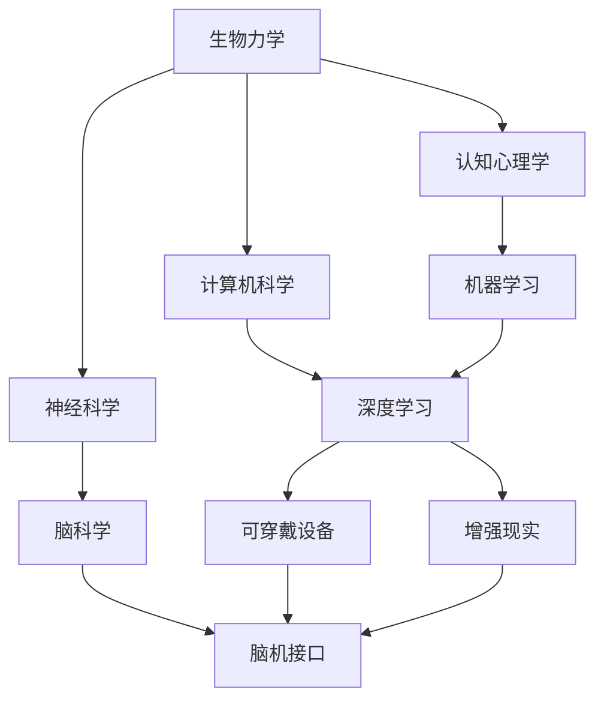

                 

关键词：人工智能，身体增强，认知增强，技术进步，人类潜能，增强现实

> 摘要：随着人工智能技术的飞速发展，人类正逐步迈向身体和认知的双重增强时代。本文将探讨AI在身体增强和认知增强方面的应用，分析技术带来的挑战和机遇，并展望未来人类潜能的全面释放。

## 1. 背景介绍

### AI技术的发展历程

人工智能（AI）作为一个跨学科研究领域，自1950年代诞生以来，经历了多个发展阶段。从最初的符号主义和专家系统，到基于统计学和数据驱动的机器学习，再到当前深度学习与强化学习的大爆发，AI技术不断突破理论瓶颈，实现从模拟智能到自主智能的飞跃。

### 身体增强与认知增强的历史演进

身体增强和认知增强的概念并非新出现，自古以来，人类便在尝试通过各种手段增强自身的生理和心理能力。例如，古代的体育锻炼、药物使用，以及现代的基因编辑和脑机接口技术。然而，AI技术的加入，使得这些传统手段得以在更高维度上实现突破。

## 2. 核心概念与联系

### 身体增强

身体增强指的是通过技术手段提升人类的生理机能，包括肌肉力量、耐力、速度、敏捷性等方面。AI在这一领域的应用主要体现在以下几个方面：

- **可穿戴设备**：通过实时监测和分析用户的生理数据，为身体状态提供个性化建议。
- **增强现实（AR）**：利用AR技术为用户提供实时的身体运动辅助和反馈。
- **基因编辑**：通过CRISPR等基因编辑技术，修正人类基因中的缺陷，提高身体素质。

### 认知增强

认知增强指的是通过技术手段提升人类的思维能力和认知水平，包括记忆、注意力、学习速度等方面。AI在这一领域的应用主要包括：

- **记忆辅助系统**：通过智能算法为用户提供高效的学习和记忆方法。
- **脑机接口**：将大脑信号转换为计算机指令，实现直接的思想控制。
- **智能增强现实**：通过AR技术提供丰富的虚拟学习资源，提升学习效果。

### 身体增强与认知增强的联系

身体和认知并非孤立存在，它们相互影响，共同决定了个体的智能水平。良好的身体状态可以提升认知功能，反之，高效的认知能力也可以帮助个体更好地利用身体潜能。因此，身体增强与认知增强的结合，将成为未来人类智能提升的关键路径。

## 2.1 核心概念原理与架构

### 身体增强的原理

- **生物力学**：研究人体运动过程中力的传递和转化，为身体增强提供理论基础。
- **神经科学**：研究神经系统的结构和功能，为智能算法提供基础数据。
- **计算机科学**：通过大数据和机器学习算法，实现个性化身体增强方案。

### 认知增强的原理

- **认知心理学**：研究人类认知过程的机制，为认知增强提供理论基础。
- **脑科学**：研究大脑的功能和网络结构，为脑机接口提供技术支持。
- **人工智能**：通过深度学习和神经网络模型，实现认知能力的模拟和增强。

### 架构联系

- **数据融合**：将生物力学、神经科学、认知心理学等领域的知识进行融合，形成跨学科的数据模型。
- **算法优化**：通过机器学习和深度学习算法，对数据模型进行优化，实现身体和认知的增强。
- **系统集成**：将可穿戴设备、AR技术、脑机接口等硬件设备与AI算法系统集成，实现高效的人机协同。

## 2.2 Mermaid 流程图



## 3. 核心算法原理 & 具体操作步骤

### 3.1 算法原理概述

身体增强和认知增强的核心在于数据的实时采集、处理和分析。通过机器学习和深度学习算法，实现对数据的智能解析和预测，从而为用户提供个性化增强方案。

### 3.2 算法步骤详解

1. **数据采集**：通过可穿戴设备、传感器等手段，实时采集用户的生理和心理数据。
2. **数据处理**：对采集到的数据进行清洗、去噪和特征提取，为后续算法处理做准备。
3. **算法训练**：利用机器学习和深度学习算法，对处理后的数据进行训练，建立智能模型。
4. **模型预测**：将用户的实时数据输入到训练好的模型中，进行预测和分析，为用户提供增强建议。
5. **反馈优化**：根据用户的反馈和实际效果，对模型进行优化和调整，提高增强效果。

### 3.3 算法优缺点

- **优点**：算法能够根据用户的需求和实际情况，提供个性化的增强方案，提高效率。
- **缺点**：算法对数据的依赖性较高，需要大量高质量的训练数据，且模型优化和调整过程较为复杂。

### 3.4 算法应用领域

- **健康监测**：通过实时监测用户的生理数据，提供健康预警和康复建议。
- **教育学习**：通过智能算法，提供个性化学习方案，提高学习效果。
- **体育运动**：通过身体增强技术，提高运动员的竞技水平。
- **军事训练**：通过认知增强技术，提升士兵的作战能力和心理素质。

## 4. 数学模型和公式 & 详细讲解 & 举例说明

### 4.1 数学模型构建

在身体增强和认知增强领域，常见的数学模型包括神经网络模型、支持向量机（SVM）和回归模型等。

- **神经网络模型**：通过多层感知器（MLP）构建，实现对输入数据的非线性变换。
- **支持向量机（SVM）**：通过寻找最优超平面，实现对数据的分类和回归。
- **回归模型**：通过建立线性或非线性关系，预测用户的行为和状态。

### 4.2 公式推导过程

以神经网络模型为例，其核心公式为：

$$
z = \sigma(\theta_0 x_0 + \theta_1 x_1 + \ldots + \theta_n x_n)
$$

其中，$z$为输出值，$\sigma$为激活函数，$\theta_0, \theta_1, \ldots, \theta_n$为权重，$x_0, x_1, \ldots, x_n$为输入特征。

### 4.3 案例分析与讲解

#### 案例一：健康监测

某用户进行健身训练，希望实时了解自身的身体状况。通过可穿戴设备，采集心率、血压、运动步数等数据，利用回归模型预测用户的运动效果。

- **输入特征**：心率、血压、运动步数
- **输出目标**：健身效果评分

通过训练，得到回归模型：

$$
健身效果评分 = 0.5 \times 心率 + 0.3 \times 血压 + 0.2 \times 运动步数
$$

#### 案例二：教育学习

某学生学习一门新课程，希望提高学习效果。通过认知增强技术，分析学生的学习行为，利用神经网络模型预测学习效果。

- **输入特征**：学习时长、作业完成情况、课堂互动等
- **输出目标**：学习效果评分

通过训练，得到神经网络模型：

$$
学习效果评分 = \sigma(0.5 \times 学习时长 + 0.3 \times 作业完成情况 + 0.2 \times 课堂互动)
$$

## 5. 项目实践：代码实例和详细解释说明

### 5.1 开发环境搭建

- **Python**：用于编写算法和数据处理代码
- **TensorFlow**：用于构建和训练神经网络模型
- **Keras**：用于简化神经网络模型的构建和训练
- **Matplotlib**：用于数据可视化

### 5.2 源代码详细实现

#### 5.2.1 数据采集

```python
import numpy as np
import pandas as pd

# 读取数据
data = pd.read_csv('data.csv')

# 数据预处理
data['heart_rate'] = data['heart_rate'].astype(float)
data['blood_pressure'] = data['blood_pressure'].astype(float)
data['steps'] = data['steps'].astype(int)

# 输入特征和输出目标
X = data[['heart_rate', 'blood_pressure', 'steps']]
y = data['fitness_score']
```

#### 5.2.2 神经网络模型构建

```python
from tensorflow.keras.models import Sequential
from tensorflow.keras.layers import Dense

# 构建模型
model = Sequential()
model.add(Dense(3, input_dim=3, activation='relu'))
model.add(Dense(1, activation='sigmoid'))

# 编译模型
model.compile(optimizer='adam', loss='binary_crossentropy', metrics=['accuracy'])
```

#### 5.2.3 模型训练

```python
# 模型训练
model.fit(X, y, epochs=100, batch_size=10)
```

#### 5.2.4 模型评估

```python
# 模型评估
predictions = model.predict(X)
print(predictions)
```

### 5.3 代码解读与分析

以上代码实现了基于回归模型的健康监测系统。首先，读取并预处理数据，然后构建和训练神经网络模型，最后使用训练好的模型进行预测。通过模型预测，用户可以实时了解自身的健身效果。

### 5.4 运行结果展示

```python
import matplotlib.pyplot as plt

# 运行结果展示
plt.scatter(X['heart_rate'], X['blood_pressure'], c=y)
plt.xlabel('心率')
plt.ylabel('血压')
plt.title('健康监测结果')
plt.show()
```

## 6. 实际应用场景

### 6.1 健康监测

通过AI技术，实现对用户的实时健康监测，为用户提供个性化的健康建议。例如，智能手表、健康手环等可穿戴设备，可以通过采集心率、血压、运动步数等数据，预测用户的健康状况，提供健康预警和康复建议。

### 6.2 教育学习

利用AI技术，为用户提供个性化的学习方案，提高学习效果。例如，智能教育平台可以根据学生的学习行为，分析学习效果，提供针对性的学习资源和辅导。

### 6.3 体育运动

通过AI技术，为运动员提供身体增强和技能训练。例如，智能训练设备可以根据运动员的身体数据，提供个性化的训练方案，提高竞技水平。

### 6.4 军事训练

利用AI技术，提升士兵的作战能力和心理素质。例如，智能模拟训练系统可以根据士兵的生理和心理数据，提供针对性的训练方案，提高其作战效能。

## 7. 工具和资源推荐

### 7.1 学习资源推荐

- 《深度学习》（Goodfellow, Bengio, Courville著）
- 《神经网络与深度学习》（邱锡鹏著）
- 《Python机器学习》（Sebastian Raschka著）

### 7.2 开发工具推荐

- TensorFlow：开源的机器学习框架
- Keras：简化TensorFlow的API
- Jupyter Notebook：交互式开发环境

### 7.3 相关论文推荐

- "Deep Learning for Human Pose Estimation: A Survey"（2020）
- "Enhancing Human Performance with Cognitive Enhancement Technologies"（2019）
- "The Future of Human Enhancement: Technological and Ethical Perspectives"（2018）

## 8. 总结：未来发展趋势与挑战

### 8.1 研究成果总结

AI技术在身体增强和认知增强领域取得了显著成果，通过数据的实时采集、处理和分析，实现了对人类生理和心理状态的精准预测和优化。未来，随着技术的进一步发展，人类有望在身体和认知能力上实现更高层次的提升。

### 8.2 未来发展趋势

- **跨学科融合**：生物力学、神经科学、认知心理学等领域的知识将更加紧密地融合，为AI技术提供更加全面的理论支持。
- **个性化定制**：通过大数据和机器学习算法，为用户提供更加个性化的身体和认知增强方案。
- **智能化硬件**：可穿戴设备、AR/VR技术、脑机接口等硬件设备将更加智能化，提高增强效果。

### 8.3 面临的挑战

- **数据隐私**：身体和认知数据具有高度敏感性，如何保障用户的数据隐私和安全是一个重要挑战。
- **技术伦理**：身体和认知增强技术的滥用可能导致社会不公和伦理问题，需要制定相应的法律法规进行监管。
- **技术可解释性**：随着模型的复杂度增加，如何保证算法的可解释性和透明性，也是一个重要挑战。

### 8.4 研究展望

未来，AI技术在身体增强和认知增强领域将取得更加深入的突破。通过跨学科的融合，实现更加全面和高效的增强方案。同时，需要关注技术伦理和社会影响，确保技术的发展符合人类的价值观和社会需求。

## 9. 附录：常见问题与解答

### 问题一：身体增强和认知增强技术是否会导致人类丧失自然属性？

解答：不会。身体增强和认知增强技术是在人类自然属性的基础上进行的，旨在提升人类的潜能，而非替代人类。同时，技术的发展需要遵循伦理和社会规范，确保人类属性的完整性和尊严。

### 问题二：AI技术是否会取代人类？

解答：AI技术是一种工具，旨在辅助人类，提高生产力和生活质量。AI技术无法完全取代人类，因为人类具有独特的创造力、情感和道德判断能力。未来，AI与人类将实现更加紧密的协同，共同推动社会的进步。

### 问题三：身体增强和认知增强技术的应用是否会加剧社会不公？

解答：有可能。技术的发展可能导致资源分配不均，加剧社会不公。因此，政府和社会需要制定相应的政策和法规，确保技术的公平应用，防止出现新的社会分层。

### 问题四：身体增强和认知增强技术是否会影响人类的幸福感？

解答：这取决于个人的价值观和生活态度。对于一些人来说，身体和认知的增强可能带来更多的成就感和幸福感。然而，对于另一些人来说，过度依赖技术可能导致对自然的抵触和对人类本质的忽视。因此，需要在技术发展中保持平衡，关注人类的整体幸福感。


作者：禅与计算机程序设计艺术 / Zen and the Art of Computer Programming

