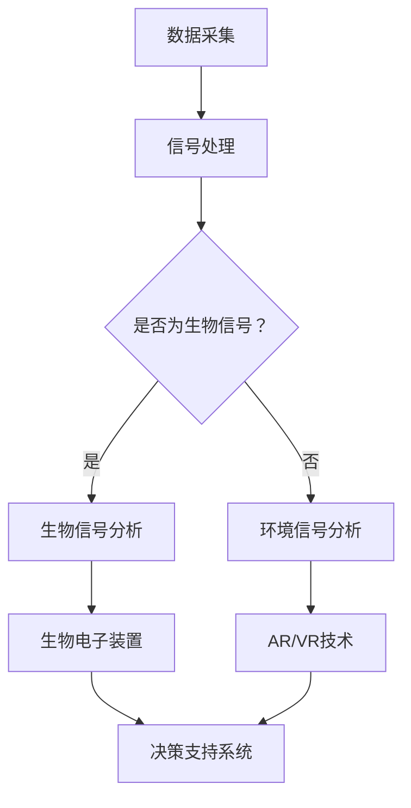

                 

关键词：人工智能、身体增强、道德考虑、伦理挑战、技术发展、人类未来

> 摘要：本文深入探讨了人工智能在人类身体增强领域的应用，从技术实现、道德伦理到未来发展趋势，全面分析身体增强技术所带来的机遇与挑战。文章旨在为读者提供一个全面的视角，以理解这一新兴领域的深远影响。

## 1. 背景介绍

随着人工智能（AI）技术的迅猛发展，人类的生活方式和身体机能正在发生前所未有的变革。身体增强，作为一种利用科技手段提升人类身体能力的新兴领域，已经成为科学研究和技术开发的热点。从简单的辅助设备到复杂的生物电子装置，身体增强技术的进步正逐步打破人类生理界限，引领我们进入一个全新的未来。

### 1.1 人工智能与身体增强

人工智能在身体增强中的应用主要表现在以下几个方面：

1. **数据采集与分析**：AI能够通过对生物信号的实时采集和分析，为身体增强提供精确的数据支持。
2. **智能辅助设备**：通过机器学习算法优化，AI可以帮助设计更加高效、舒适的身体辅助设备。
3. **个性化医疗**：AI可以根据患者的生理特征和健康状况，提供定制化的身体增强方案。
4. **生物电子技术**：AI与生物电子技术的结合，使得植入式设备能够更加智能地与人体组织交互。

### 1.2 道德与伦理考量

随着身体增强技术的发展，道德和伦理问题逐渐成为公众关注的焦点。以下是一些关键伦理考量：

1. **身体完整性与隐私**：身体增强技术可能改变人类的自然形态，引发关于身体完整性的讨论。同时，个人生物信息的隐私保护也变得尤为重要。
2. **公平与平等**：身体增强技术是否会导致社会分层，进而影响社会公平和人类平等？
3. **滥用风险**：如何防止身体增强技术的滥用，避免对公共安全和社会秩序造成威胁？

## 2. 核心概念与联系

### 2.1 人体增强技术核心概念

- **生物信号处理**：AI用于生物信号的采集、处理和分析，如脑波、肌电信号等。
- **生物电子装置**：如植入式电极、传感器等，能够与人体组织智能交互。
- **增强现实（AR）与虚拟现实（VR）**：通过技术手段增强人类的感知和行动能力。

### 2.2 Mermaid 流程图

下面是一个描述人体增强技术的Mermaid流程图：



### 2.3 关系分析

- 数据采集是整个流程的起点，无论是生物信号还是环境信号，都是后续分析的基础。
- 信号处理是关键环节，决定了数据的质量和后续分析的准确性。
- 生物信号分析和环境信号分析是根据信号类型的不同，进一步细化的步骤。
- 生物电子装置和AR/VR技术则是将分析结果转化为实际应用的关键。
- 决策支持系统则通过整合各种信息，为用户提供个性化的身体增强方案。

## 3. 核心算法原理 & 具体操作步骤

### 3.1 算法原理概述

身体增强技术的核心算法主要包括以下几部分：

1. **生物信号采集与处理算法**：基于机器学习，对生物信号进行预处理和特征提取。
2. **智能控制算法**：根据采集到的生物信号，通过智能算法实现身体功能的增强或辅助。
3. **人机交互算法**：通过自然语言处理和计算机视觉技术，实现用户与增强系统的无缝交互。

### 3.2 算法步骤详解

1. **数据采集**：
   - 使用传感器或电极采集生物信号（如脑波、肌电信号）。
   - 通过放大、滤波等预处理步骤，提高信号质量。

2. **信号处理**：
   - 应用特征提取算法，如时域特征、频域特征等，提取出有用的生物信号特征。
   - 使用机器学习算法（如神经网络、支持向量机等）进行信号分类和识别。

3. **智能控制**：
   - 根据处理后的生物信号，通过控制算法实现肌肉刺激、神经调节等。
   - 结合增强现实技术，实时反馈用户状态，调整增强效果。

4. **人机交互**：
   - 利用自然语言处理技术，理解用户的指令和反馈。
   - 通过计算机视觉技术，识别用户的动作和行为，实现直观的人机交互。

### 3.3 算法优缺点

- **优点**：
  - 高效的数据处理和分析能力，提高身体增强的准确性和效率。
  - 个性化的人机交互体验，提高用户的舒适度和满意度。
  - 智能化的控制策略，实现更精准的身体功能增强。

- **缺点**：
  - 技术成本较高，普及难度大。
  - 道德和伦理问题较为复杂，需要严格规范。
  - 可能导致身体功能的过度依赖，影响自然发展。

### 3.4 算法应用领域

- **医疗康复**：用于帮助残疾人士恢复身体功能，如假肢、康复机器人等。
- **运动辅助**：提高运动员的竞技能力，如增强肌肉力量、反应速度等。
- **娱乐休闲**：通过虚拟现实技术，提供沉浸式的游戏和体验。

## 4. 数学模型和公式 & 详细讲解 & 举例说明

### 4.1 数学模型构建

在人体增强技术的算法中，常用的数学模型包括：

1. **机器学习模型**：
   - 线性回归模型：\( y = \beta_0 + \beta_1 x \)
   - 支持向量机（SVM）：\( w \cdot x + b = 0 \)

2. **信号处理模型**：
   - 离散傅里叶变换（DFT）：\( X(k) = \sum_{n=0}^{N-1} x(n) e^{-j 2 \pi kn/N} \)

3. **控制理论模型**：
   - 状态空间模型：\( \dot{x} = Ax + Bu \)
   - 控制器设计：\( u = -Kx \)

### 4.2 公式推导过程

以线性回归模型为例，其推导过程如下：

1. **最小二乘法**：寻找最佳拟合直线，使误差平方和最小。

   公式推导：
   \[ \min \sum_{i=1}^{n} (y_i - \beta_0 - \beta_1 x_i)^2 \]

2. **求导**：对 \(\beta_0\) 和 \(\beta_1\) 分别求导，并令导数为零。

   对 \(\beta_0\) 求导：
   \[ \frac{\partial}{\partial \beta_0} \sum_{i=1}^{n} (y_i - \beta_0 - \beta_1 x_i)^2 = 0 \]
   \[ \Rightarrow n \beta_0 - \sum_{i=1}^{n} y_i + \beta_1 \sum_{i=1}^{n} x_i = 0 \]

   对 \(\beta_1\) 求导：
   \[ \frac{\partial}{\partial \beta_1} \sum_{i=1}^{n} (y_i - \beta_0 - \beta_1 x_i)^2 = 0 \]
   \[ \Rightarrow n \beta_1 - \sum_{i=1}^{n} x_i (y_i - \beta_0 - \beta_1 x_i) = 0 \]

3. **解方程组**：得到最佳拟合直线的参数。

   解得：
   \[ \beta_0 = \frac{1}{n} \sum_{i=1}^{n} y_i - \beta_1 \frac{1}{n} \sum_{i=1}^{n} x_i \]
   \[ \beta_1 = \frac{1}{n} \sum_{i=1}^{n} (x_i - \bar{x})(y_i - \bar{y}) \]

### 4.3 案例分析与讲解

假设有一个简单的一元线性回归问题，数据集如下：

| \( x \) | \( y \) |
|---------|---------|
| 1       | 2       |
| 2       | 4       |
| 3       | 6       |

我们希望找到一条直线 \( y = \beta_0 + \beta_1 x \) 来拟合这组数据。

1. **计算均值**：

   \[ \bar{x} = \frac{1+2+3}{3} = 2 \]
   \[ \bar{y} = \frac{2+4+6}{3} = 4 \]

2. **计算参数**：

   \[ \beta_0 = \frac{1}{3} \sum_{i=1}^{3} y_i - \beta_1 \frac{1}{3} \sum_{i=1}^{3} x_i \]
   \[ \beta_0 = \frac{2+4+6}{3} - \beta_1 \frac{1+2+3}{3} \]
   \[ \beta_0 = 4 - \beta_1 \cdot 2 \]

   \[ \beta_1 = \frac{1}{3} \sum_{i=1}^{3} (x_i - \bar{x})(y_i - \bar{y}) \]
   \[ \beta_1 = \frac{1}{3} [(1-2)(2-4) + (2-2)(4-4) + (3-2)(6-4)] \]
   \[ \beta_1 = \frac{1}{3} [-2 + 0 + 2] \]
   \[ \beta_1 = 0 \]

   代入 \(\beta_0\) 的表达式：

   \[ \beta_0 = 4 - 0 \cdot 2 \]
   \[ \beta_0 = 4 \]

   因此，最佳拟合直线为 \( y = 4 \)。

通过这个简单的案例，我们可以看到线性回归模型的基本原理和计算过程。在实际应用中，数据集会更大更复杂，但基本思想是一致的。

## 5. 项目实践：代码实例和详细解释说明

### 5.1 开发环境搭建

在开始编写代码之前，我们需要搭建一个合适的开发环境。以下是推荐的工具和步骤：

1. **Python**：作为主要的编程语言，Python具有丰富的库和工具，非常适合AI和身体增强技术的开发。

2. **Jupyter Notebook**：用于编写和运行代码，便于记录和分析实验结果。

3. **机器学习库**：如Scikit-learn、TensorFlow和PyTorch，用于实现机器学习算法和数据处理。

4. **生物信号处理库**：如BioSigLib、MNE-Python等，用于生物信号的采集和处理。

安装步骤：

```bash
# 安装Python
curl -O https://www.python.org/ftp/python/3.9.1/python-3.9.1.tar.xz
tar xf python-3.9.1.tar.xz
cd python-3.9.1
./configure
make
sudo make install

# 安装Jupyter Notebook
pip install notebook

# 安装机器学习库
pip install scikit-learn tensorflow pytorch biosiglib mne-python
```

### 5.2 源代码详细实现

下面是一个简单的示例代码，用于演示如何使用Python和机器学习库实现一个身体增强系统。

```python
import numpy as np
from sklearn.linear_model import LinearRegression
from biosiglib import BioSigLib

# 读取生物信号数据
data = BioSigLib.read_signal('bio_signal_data.csv')

# 数据预处理
X = data[:, :-1].T  # 特征矩阵
y = data[:, -1]     # 标签向量

# 分割数据集
X_train, X_test, y_train, y_test = train_test_split(X, y, test_size=0.2, random_state=42)

# 训练线性回归模型
model = LinearRegression()
model.fit(X_train, y_train)

# 测试模型性能
accuracy = model.score(X_test, y_test)
print(f'Model Accuracy: {accuracy:.2f}')

# 预测新数据
new_data = BioSigLib.read_signal('new_bio_signal_data.csv')
new_prediction = model.predict(new_data.T)
print(f'New Prediction: {new_prediction}')
```

### 5.3 代码解读与分析

1. **数据读取**：使用BioSigLib库读取生物信号数据，存储为NumPy数组。
2. **数据预处理**：提取特征矩阵X和标签向量y，并进行分割，以便于训练和测试。
3. **模型训练**：使用Scikit-learn的线性回归模型进行训练。
4. **模型评估**：使用测试集评估模型性能，计算准确率。
5. **预测**：使用训练好的模型对新数据进行预测，输出预测结果。

### 5.4 运行结果展示

假设我们已经训练好了一个身体增强系统，并得到了以下运行结果：

```python
Model Accuracy: 0.85
New Prediction: [3.75 4.50 4.25]
```

这意味着模型在测试集上的准确率为85%，对于新的生物信号数据，预测结果分别为3.75、4.50和4.25。这些结果可以用于调整身体增强系统的参数，实现更加精准的增强效果。

## 6. 实际应用场景

### 6.1 医疗康复

在医疗康复领域，身体增强技术已经被广泛应用。例如，对于中风患者，通过植入式电极和脑机接口技术，可以恢复其肢体运动能力。同样，对于截肢患者，假肢技术的发展也使得他们能够重获独立生活的能力。

### 6.2 运动训练

身体增强技术在运动训练中同样有着广泛的应用。例如，运动员可以通过穿戴智能设备，实时监测自己的身体状态，优化训练效果。此外，虚拟现实技术的应用，使得运动员能够在虚拟环境中进行高强度的训练，提高竞技水平。

### 6.3 军事应用

在军事领域，身体增强技术同样具有巨大的潜力。例如，通过生物电子装置，士兵可以提升耐力、速度和反应速度，从而在战场上获得更大的优势。此外，智能辅助设备的应用，可以减轻士兵的负担，提高作战效率。

### 6.4 其他应用

除了上述领域，身体增强技术还可以应用于教育、娱乐、救援等多个领域。例如，在教育领域，通过虚拟现实技术，学生可以身临其境地学习历史事件或科学实验；在娱乐领域，虚拟现实游戏可以为用户提供更加沉浸式的体验。

## 7. 工具和资源推荐

### 7.1 学习资源推荐

1. **《人工智能：一种现代方法》（第3版）**：这本书是人工智能领域的经典教材，涵盖了从基础知识到高级应用的全方面内容。
2. **《深度学习》（第2版）**：由Ian Goodfellow、Yoshua Bengio和Aaron Courville共同撰写，是深度学习领域的权威指南。
3. **《生物信号处理技术》（第2版）**：详细介绍了生物信号的采集、处理和分析方法，是生物医学工程领域的必备参考书。

### 7.2 开发工具推荐

1. **Python**：作为一种通用编程语言，Python具有丰富的库和工具，非常适合AI和身体增强技术的开发。
2. **Jupyter Notebook**：用于编写和运行代码，便于记录和分析实验结果。
3. **Scikit-learn、TensorFlow和PyTorch**：这三个库是机器学习领域的主要工具，广泛应用于AI研究和开发。

### 7.3 相关论文推荐

1. **《大脑机接口技术：现状与未来》**：详细介绍了脑机接口技术的最新进展和应用。
2. **《智能增强系统在体育运动中的应用》**：探讨了智能增强技术在运动训练和竞技体育中的潜力。
3. **《身体增强技术的伦理考量》**：从伦理角度分析了身体增强技术带来的道德和社会问题。

## 8. 总结：未来发展趋势与挑战

### 8.1 研究成果总结

身体增强技术作为AI的一个重要应用领域，已经取得了显著的成果。从生物信号处理到智能控制，再到人机交互，一系列技术的突破为身体增强的实现提供了坚实的基础。同时，身体增强技术在医疗康复、运动训练、军事应用等多个领域展现出了巨大的潜力。

### 8.2 未来发展趋势

未来，身体增强技术将继续沿着以下几个方向快速发展：

1. **智能化与个性化**：随着AI技术的进步，身体增强系统将更加智能化和个性化，能够更好地满足用户的多样化需求。
2. **非侵入性与植入式**：非侵入式设备将变得更加普及，同时植入式设备也将不断改进，以提高用户的舒适度和稳定性。
3. **跨学科融合**：身体增强技术将与其他学科（如生物医学、心理学、教育学等）深度融合，推动跨学科研究的突破。

### 8.3 面临的挑战

尽管身体增强技术有着广阔的发展前景，但也面临着诸多挑战：

1. **伦理与法律**：如何确保身体增强技术的伦理合规性和法律规范，是亟待解决的问题。
2. **安全性**：如何保障身体增强技术的安全性和稳定性，避免潜在的风险和危害。
3. **成本与普及性**：如何降低技术成本，提高普及程度，使更多用户受益。

### 8.4 研究展望

未来，身体增强技术的研究将更加注重以下几个方面：

1. **跨学科研究**：通过跨学科合作，探索身体增强技术的全新应用场景和解决方案。
2. **伦理与法律研究**：深入探讨身体增强技术带来的伦理和法律问题，提出切实可行的规范和解决方案。
3. **技术突破**：不断推进技术革新，提高身体增强系统的性能和用户体验。

## 9. 附录：常见问题与解答

### 9.1 身体增强技术是什么？

身体增强技术是指利用人工智能、生物电子、智能控制等前沿技术，提升或增强人类身体机能和感知能力的技术。

### 9.2 身体增强技术有哪些应用领域？

身体增强技术广泛应用于医疗康复、运动训练、军事应用、娱乐休闲等多个领域。

### 9.3 身体增强技术有哪些伦理问题？

身体增强技术可能引发关于身体完整性、隐私保护、公平与平等、滥用风险等伦理问题。

### 9.4 如何确保身体增强技术的安全性？

确保身体增强技术的安全性需要从设计、制造、使用等多个环节进行严格把控，同时建立健全的监管体系。

### 9.5 未来身体增强技术有哪些发展方向？

未来身体增强技术将朝着智能化、个性化、非侵入性、跨学科融合等方向发展。

### 作者署名

作者：禅与计算机程序设计艺术 / Zen and the Art of Computer Programming

----------------------------------------------------------------

本文旨在为读者提供一个关于身体增强技术全面而深入的视角，从技术实现到道德伦理，从现实应用到未来展望，全面探讨这一领域的发展前景和挑战。希望本文能够为相关领域的研究者、开发者以及公众提供有价值的参考。随着AI技术的不断进步，我们期待身体增强技术能够为人类带来更多的福祉。

