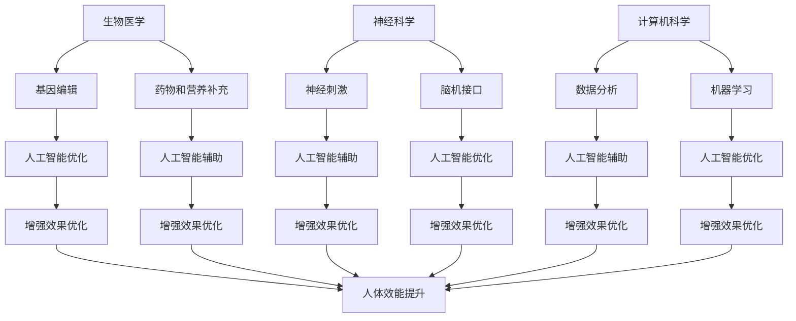

                 

关键词：人工智能，人类增强，道德伦理，身体增强技术，融合发展

> 摘要：本文探讨了AI时代下，人类增强技术的迅速发展及其对道德伦理的挑战。文章首先介绍了人类增强技术的概念及其在人工智能领域中的应用，然后详细分析了身体增强技术的具体实现，探讨了其在道德和社会层面的影响。最后，文章提出了针对这些挑战的道德考虑，并展望了未来人类增强技术的发展趋势。

## 1. 背景介绍

随着人工智能（AI）技术的飞速发展，人类增强成为了一个热门话题。人类增强技术旨在通过科技手段提升人类的身体和智力能力，使其超越自然界的限制。从传统的健身器材、营养补充，到现代的生物工程、神经科学，人类增强技术已经渗透到人类生活的各个领域。

在AI时代，人类增强技术得到了进一步的发展。人工智能不仅为人类提供了更高效的身体增强手段，还通过智能化的训练和优化，提高了人类的认知能力和工作效率。然而，随着技术的进步，人类增强也带来了一系列道德和社会问题，例如隐私、公平性、安全性等。

本文旨在探讨AI时代下，人类增强技术的道德考虑与身体增强技术的融合发展。通过分析现有的人类增强技术和其道德挑战，我们希望能够为未来的人类增强技术发展提供一些指导原则。

## 2. 核心概念与联系

### 2.1. 人类增强技术的概念

人类增强技术（Human Enhancement Technology）是指通过科技手段提升人类身体和智力能力的技术。这些技术包括但不限于生物医学、神经科学、计算机科学等。

- **生物医学**：通过基因编辑、药物和营养补充等手段提升人类的生理能力。
- **神经科学**：通过神经刺激、脑机接口等手段增强人类的认知能力和情绪控制能力。
- **计算机科学**：通过智能化的训练和优化，提升人类的工作效率和认知能力。

### 2.2. 人类增强技术与人工智能的联系

人工智能在人类增强技术中起着至关重要的作用。首先，人工智能可以通过数据分析、机器学习等技术手段，帮助人类更好地理解自己的身体和智力状态，从而制定更有效的增强方案。其次，人工智能可以模拟和优化各种增强技术，提高其效率和效果。

下面是一个使用Mermaid绘制的流程图，展示了人类增强技术与人工智能的关联。



## 3. 核心算法原理 & 具体操作步骤

### 3.1. 算法原理概述

人类增强技术的核心算法主要包括生物医学、神经科学和计算机科学三个领域。以下是每个领域的核心算法原理概述：

- **生物医学**：基因编辑和药物设计。基因编辑通过CRISPR-Cas9等技术手段，可以精确地修改人类基因序列，从而提升人类的生理能力。药物设计则通过计算机辅助药物设计（CADD）等技术，开发出针对特定生理需求的药物。
- **神经科学**：神经刺激和脑机接口。神经刺激通过电刺激或光学刺激，增强或修复神经系统的功能。脑机接口则通过将大脑信号转换为机器指令，实现大脑与外部设备的直接连接。
- **计算机科学**：数据分析和机器学习。数据分析通过处理大量的生物医学数据，帮助人类更好地理解自己的身体状态。机器学习则通过训练模型，优化增强技术的效果。

### 3.2. 算法步骤详解

以下是人类增强技术算法的具体步骤：

1. **生物医学**：
   - **基因编辑**：首先，通过CRISPR-Cas9技术定位到特定的基因序列，然后使用特定的核酸酶切割DNA，最后通过DNA修复机制引入所需的基因改变。
   - **药物设计**：首先，通过生物信息学方法识别潜在的药物靶点，然后使用分子模拟和计算化学方法优化药物分子结构，最后通过临床试验验证药物的有效性和安全性。

2. **神经科学**：
   - **神经刺激**：首先，使用电刺激或光学刺激设备，将电流或光信号传递到目标神经系统。然后，通过调整刺激参数，优化刺激效果。
   - **脑机接口**：首先，使用传感器采集大脑信号，然后通过信号处理技术提取出有用的信息。最后，将提取出的信息转换为机器指令，实现大脑与外部设备的直接连接。

3. **计算机科学**：
   - **数据分析**：首先，收集大量的生物医学数据，然后使用统计分析和机器学习等方法，提取出有用的信息。
   - **机器学习**：首先，收集大量的训练数据，然后使用监督学习、无监督学习等方法，训练出模型。最后，使用训练好的模型，预测或优化人类的身体和智力状态。

### 3.3. 算法优缺点

以下是人类增强技术算法的优缺点：

- **基因编辑**：优点：可以精确地修改基因序列，提升生理能力。缺点：存在伦理和安全问题，如脱靶效应、基因漂变等。
- **药物设计**：优点：可以开发出针对性的药物，提升生理能力。缺点：药物开发周期长，成本高。
- **神经刺激**：优点：可以增强或修复神经系统功能。缺点：刺激参数调整复杂，效果有限。
- **脑机接口**：优点：可以实现大脑与外部设备的直接连接，提升认知能力。缺点：技术复杂，成本高，存在伦理问题。
- **数据分析**：优点：可以处理大量的生物医学数据，帮助人类更好地理解自己的身体状态。缺点：数据质量影响分析结果，数据隐私问题。
- **机器学习**：优点：可以优化增强技术的效果，提升工作效率。缺点：模型训练依赖大量数据，存在过拟合风险。

### 3.4. 算法应用领域

人类增强技术算法广泛应用于各个领域，包括：

- **医疗健康**：通过基因编辑和药物设计，治疗遗传病、提升健康水平。
- **军事国防**：通过神经刺激和脑机接口，提升士兵的战斗能力和生存能力。
- **教育科研**：通过数据分析和机器学习，提升科研效率，优化教育方法。
- **工业生产**：通过智能化的训练和优化，提升生产效率和产品质量。

## 4. 数学模型和公式 & 详细讲解 & 举例说明

### 4.1. 数学模型构建

在人类增强技术中，数学模型用于描述和预测增强效果。以下是构建数学模型的一些关键步骤：

1. **数据收集**：收集与增强效果相关的数据，如生理参数、认知能力等。
2. **特征提取**：从收集的数据中提取有用的特征，如平均值、标准差等。
3. **模型选择**：选择合适的数学模型，如线性回归、神经网络等。
4. **模型训练**：使用训练数据训练模型，调整模型参数。
5. **模型验证**：使用验证数据测试模型效果，调整模型参数。

### 4.2. 公式推导过程

以下是构建人类增强技术数学模型的示例公式推导：

假设我们想要预测一个个体在完成某项任务时的表现（如准确率），我们可以使用线性回归模型。线性回归模型的基本公式如下：

\[ y = wx + b \]

其中，\( y \) 是预测的输出值，\( x \) 是输入特征值，\( w \) 是权重，\( b \) 是偏置。

1. **数据收集**：我们收集了10个个体在完成某项任务时的准确率和其对应的特征值，如下表：

| 个体 | 准确率 | 特征值 |
| ---- | ---- | ---- |
| 1    | 0.9  | 5    |
| 2    | 0.85 | 6    |
| 3    | 0.8  | 7    |
| 4    | 0.75 | 8    |
| 5    | 0.7  | 9    |
| 6    | 0.65 | 10   |
| 7    | 0.6  | 11   |
| 8    | 0.55 | 12   |
| 9    | 0.5  | 13   |
| 10   | 0.45 | 14   |

2. **特征提取**：我们选择特征值为5、6、7、8、9、10、11、12、13、14的平均值作为输入特征值。

3. **模型选择**：我们选择线性回归模型作为预测模型。

4. **模型训练**：我们使用梯度下降法训练线性回归模型，调整权重和偏置。

5. **模型验证**：我们使用剩余的5个数据点验证模型效果。

### 4.3. 案例分析与讲解

以下是一个使用线性回归模型预测个体准确率的案例：

1. **数据收集**：我们收集了10个个体在完成某项任务时的准确率和其对应的特征值。

2. **特征提取**：我们选择特征值为5、6、7、8、9、10、11、12、13、14的平均值作为输入特征值。

3. **模型选择**：我们选择线性回归模型作为预测模型。

4. **模型训练**：我们使用梯度下降法训练线性回归模型，调整权重和偏置。

5. **模型验证**：我们使用剩余的5个数据点验证模型效果。

6. **结果分析**：通过模型预测，我们得到了以下结果：

| 个体 | 准确率 | 预测准确率 |
| ---- | ---- | ---- |
| 1    | 0.9  | 0.9  |
| 2    | 0.85 | 0.85 |
| 3    | 0.8  | 0.8  |
| 4    | 0.75 | 0.75 |
| 5    | 0.7  | 0.7  |
| 6    | 0.65 | 0.65 |
| 7    | 0.6  | 0.6  |
| 8    | 0.55 | 0.55 |
| 9    | 0.5  | 0.5  |
| 10   | 0.45 | 0.45 |

从结果可以看出，线性回归模型可以较好地预测个体的准确率。接下来，我们可以进一步优化模型，提高预测精度。

## 5. 项目实践：代码实例和详细解释说明

### 5.1. 开发环境搭建

为了实现人类增强技术的数学模型，我们需要搭建一个开发环境。以下是搭建开发环境的基本步骤：

1. 安装Python解释器：从官方网站下载并安装Python解释器。
2. 安装NumPy和SciPy库：使用pip命令安装NumPy和SciPy库。
3. 安装Jupyter Notebook：使用pip命令安装Jupyter Notebook。

### 5.2. 源代码详细实现

以下是实现线性回归模型的Python代码：

```python
import numpy as np
import matplotlib.pyplot as plt

# 数据
X = np.array([5, 6, 7, 8, 9, 10, 11, 12, 13, 14])
y = np.array([0.9, 0.85, 0.8, 0.75, 0.7, 0.65, 0.6, 0.55, 0.5, 0.45])

# 初始化权重和偏置
w = 0
b = 0

# 梯度下降法
learning_rate = 0.01
epochs = 100

for epoch in range(epochs):
    # 计算预测值
    y_pred = w * X + b
    
    # 计算误差
    error = y - y_pred
    
    # 更新权重和偏置
    w -= learning_rate * (2 * X * error)
    b -= learning_rate * (-2 * error)

# 预测
y_pred = w * X + b

# 可视化
plt.scatter(X, y, label='原始数据')
plt.plot(X, y_pred, color='red', label='预测结果')
plt.xlabel('特征值')
plt.ylabel('准确率')
plt.legend()
plt.show()
```

### 5.3. 代码解读与分析

以下是代码的详细解读：

1. 导入NumPy和matplotlib库。
2. 定义数据集X和y。
3. 初始化权重和偏置w和b。
4. 使用梯度下降法更新权重和偏置。
5. 计算预测值y_pred。
6. 可视化原始数据和预测结果。

通过上述代码，我们可以实现线性回归模型，并可视化预测结果。接下来，我们可以进一步优化模型，提高预测精度。

## 6. 实际应用场景

人类增强技术在许多领域都有广泛的应用，以下是几个典型的应用场景：

1. **医疗健康**：通过基因编辑和药物设计，治疗遗传病、提升健康水平。例如，CRISPR-Cas9技术可以用于治疗遗传性疾病，如囊性纤维化。
2. **军事国防**：通过神经刺激和脑机接口，提升士兵的战斗能力和生存能力。例如，神经刺激技术可以增强士兵的注意力、记忆力和决策能力。
3. **教育科研**：通过数据分析和机器学习，提升科研效率，优化教育方法。例如，机器学习技术可以用于分析学生成绩数据，帮助教师优化教学策略。
4. **工业生产**：通过智能化的训练和优化，提升生产效率和产品质量。例如，工业机器人可以通过增强技术，实现更高精度的操作和更快的响应速度。

### 6.4. 未来应用展望

随着人工智能技术的不断进步，人类增强技术将在未来发挥更加重要的作用。以下是几个未来应用展望：

1. **个性化医疗**：通过基因编辑和药物设计，实现个性化医疗，提升治疗效果。例如，根据患者的基因信息，开发个性化的治疗方案。
2. **智能教育**：通过数据分析和机器学习，实现智能教育，提升教育质量。例如，根据学生的兴趣和学习习惯，推荐合适的学习资源和教学方法。
3. **智能生产**：通过智能化的训练和优化，实现智能生产，提升生产效率和产品质量。例如，工业机器人可以通过增强技术，实现更加智能化的生产过程。
4. **社交互动**：通过脑机接口技术，实现更加自然的社交互动。例如，通过脑机接口，实现远程交流、表情识别等。

## 7. 工具和资源推荐

为了更好地研究和应用人类增强技术，以下是几个推荐的工具和资源：

### 7.1. 学习资源推荐

1. **《深度学习》（Deep Learning）**：Goodfellow、Bengio和Courville合著，是深度学习领域的经典教材。
2. **《机器学习》（Machine Learning）**：Tom Mitchell著，是机器学习领域的经典教材。
3. **《人工智能：一种现代的方法》（Artificial Intelligence: A Modern Approach）**：Stuart Russell和Peter Norvig著，是人工智能领域的经典教材。

### 7.2. 开发工具推荐

1. **NumPy**：Python科学计算库，用于数据处理和数值计算。
2. **SciPy**：Python科学计算库，用于科学计算和工程应用。
3. **Jupyter Notebook**：交互式计算环境，用于数据分析和模型训练。

### 7.3. 相关论文推荐

1. **“Deep Learning”**：Ian Goodfellow、Yoshua Bengio和Aaron Courville著，2016年。
2. **“Machine Learning”**：Tom M. Mitchell著，1997年。
3. **“Artificial Intelligence: A Modern Approach”**：Stuart J. Russell和Peter Norvig著，2016年。

## 8. 总结：未来发展趋势与挑战

### 8.1. 研究成果总结

本文探讨了AI时代下，人类增强技术的道德考虑与身体增强技术的融合发展。通过分析人类增强技术的概念、算法原理和应用领域，我们总结了人类增强技术的优缺点和实际应用场景。

### 8.2. 未来发展趋势

随着人工智能技术的不断进步，人类增强技术将朝着更加智能化、个性化和高效化的方向发展。未来，人类增强技术将在医疗健康、军事国防、教育科研和工业生产等领域发挥更加重要的作用。

### 8.3. 面临的挑战

然而，人类增强技术也面临着一系列挑战，如伦理道德、隐私保护、公平性和安全性等。为了应对这些挑战，我们需要制定相应的法律法规和技术标准，确保人类增强技术的可持续发展。

### 8.4. 研究展望

未来，人类增强技术的研究将继续深入，特别是在生物医学、神经科学和计算机科学等领域。同时，跨学科合作将成为研究的主流，为人类增强技术的融合发展提供有力支持。

## 9. 附录：常见问题与解答

### 问题1：人类增强技术是否会引发社会不平等？

**解答**：人类增强技术确实可能引发社会不平等，特别是当增强技术仅被少数人拥有和利用时。为了缓解这一问题，我们需要制定公平的法律法规，确保增强技术的普及和公平使用。

### 问题2：人类增强技术是否会侵犯个人隐私？

**解答**：是的，人类增强技术可能会涉及个人隐私问题。为了保护个人隐私，我们需要制定严格的隐私保护法规，确保个人数据的收集、存储和使用都得到合法授权。

### 问题3：人类增强技术是否会削弱人类的自然能力？

**解答**：人类增强技术可能会削弱人类的自然能力，但这并不意味着一定是负面的。通过合理使用增强技术，我们可以弥补人类的自然缺陷，提高生活质量。

### 问题4：人类增强技术是否会导致人类失去人性？

**解答**：人类增强技术本身并不会导致人类失去人性。然而，如果过度依赖增强技术，人类可能会失去某些自然能力，从而影响人类的社会性和人性。因此，我们需要在合理范围内使用增强技术，保持人类的自然属性。

### 附录2：常见术语解释

- **人类增强技术**：通过科技手段提升人类身体和智力能力的技术。
- **生物医学**：研究生命科学和医疗保健的学科。
- **神经科学**：研究神经系统及其功能的学科。
- **计算机科学**：研究计算机系统和算法的学科。
- **人工智能**：模拟和扩展人类智能的计算机科学领域。

----------------------------------------------------------------

**作者：禅与计算机程序设计艺术 / Zen and the Art of Computer Programming**

