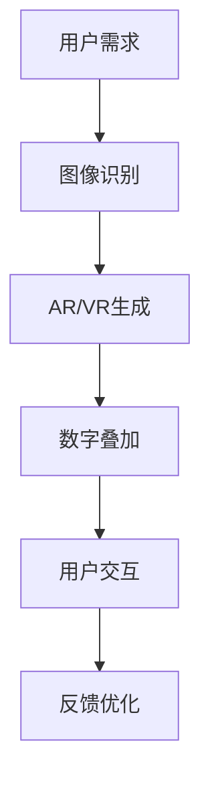
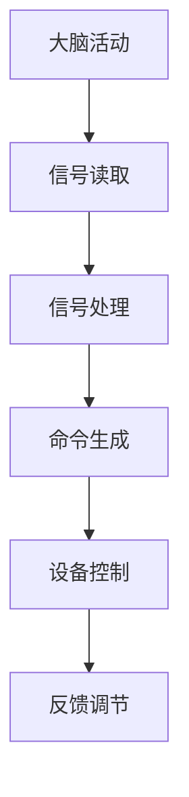
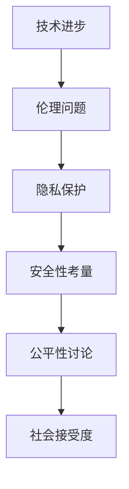

                 

### 关键词 Keywords ###
AI, 人类增强，道德考虑，身体增强，未来前景，技术进步，伦理问题

### 摘要 Abstract ###
本文探讨了AI技术在人类增强领域中的广泛应用，以及随之而来的道德考虑和身体增强的未来前景。通过分析AI技术在身体增强中的应用，如增强现实和虚拟现实技术、生物机械接口和神经接口技术，本文探讨了这些技术的道德考量，并预测了其未来发展的趋势。文章还讨论了相关伦理问题和可能面临的挑战，以及为了实现这些技术的可持续和道德发展所需的研究方向和策略。

## 1. 背景介绍

### AI技术的发展

人工智能（AI）自20世纪50年代以来取得了长足的进展，经历了多个技术迭代。最初的人工智能研究主要集中在规则推理和知识表示上，随后随着计算能力和算法的进步，机器学习（ML）和深度学习（DL）成为了AI研究的热点。特别是在过去十年里，随着大数据的可用性和计算能力的提升，AI技术得以实现商业化应用，如自动驾驶汽车、智能语音助手和医疗诊断系统。

### 人类增强的定义

人类增强是指通过外部设备或生物医学技术来增强或改进人类身体和大脑的功能。这种增强可以是物理的，例如通过义肢和可穿戴设备来增强肢体能力；也可以是认知的，例如通过智能眼镜和增强现实（AR）技术来提升信息处理和认知能力。人类增强的概念与AI技术的发展紧密相连，因为许多增强技术依赖于AI算法来优化性能和用户体验。

## 2. 核心概念与联系

### 增强现实和虚拟现实技术

增强现实（AR）和虚拟现实（VR）技术是AI时代人类增强的重要工具。AR技术通过在现实世界中叠加数字信息，使得用户能够在现实环境中看到增强的内容。而VR技术则创造了一个完全虚拟的环境，用户可以通过头盔和其他设备完全沉浸在其中。

**Mermaid 流程图**



### 生物机械接口和神经接口技术

生物机械接口（BMI）和神经接口技术是直接连接大脑和外部设备的桥梁，使得人类能够通过思维控制外部设备。这些技术通过读取大脑活动，如电信号或神经信号，将思维转化为可操作的命令。

**Mermaid 流程图**



### 道德考虑

在AI时代的人类增强中，道德考虑尤为重要。这些技术的应用可能带来伦理和隐私问题，如数据的收集和使用、设备的安全性和用户的隐私保护等。

**Mermaid 流程图**



## 3. 核心算法原理 & 具体操作步骤

### 算法原理概述

AI技术在人类增强中的应用主要依赖于以下几个核心算法原理：

1. **机器学习算法**：通过学习大量数据，机器学习算法能够识别模式和趋势，从而优化增强系统的性能。
2. **深度学习算法**：深度神经网络能够处理复杂的数据结构，例如图像和文本，从而实现高级的图像识别和自然语言处理。
3. **强化学习算法**：通过试错和奖励机制，强化学习算法能够在动态环境中不断优化行为。

### 算法步骤详解

1. **数据收集**：收集用户的行为数据、生理数据和环境数据，为机器学习算法提供训练数据。
2. **特征提取**：从收集的数据中提取特征，以便于算法进行分析。
3. **模型训练**：使用机器学习算法和深度学习算法对提取的特征进行训练，建立预测模型。
4. **模型评估**：通过测试数据评估模型的性能，并进行调整优化。
5. **部署应用**：将训练好的模型部署到增强系统中，实现实时交互和反馈。

### 算法优缺点

**优点**：
- **高效性**：AI算法能够快速处理大量数据，实现高效的人类增强。
- **个性化**：基于用户数据训练的模型能够提供个性化的增强体验。
- **灵活性**：AI算法能够适应不同的增强需求和场景。

**缺点**：
- **隐私风险**：数据收集和使用过程中可能涉及隐私问题。
- **安全性**：增强系统的安全性需要确保用户数据的安全。
- **伦理问题**：人类增强可能引发伦理和社会问题，如公平性和社会接受度。

### 算法应用领域

AI技术在人类增强中的应用广泛，包括但不限于以下领域：

1. **医疗健康**：通过AI技术辅助诊断和治疗，如辅助医生进行医学图像分析、预测疾病风险等。
2. **工业生产**：通过AI技术提高生产效率和产品质量，如自动化生产线、机器人辅助装配等。
3. **日常生活**：通过AI技术提升生活质量，如智能家居、智能穿戴设备等。

## 4. 数学模型和公式 & 详细讲解 & 举例说明

### 数学模型构建

在AI时代的人类增强中，数学模型扮演着关键角色。以下是一个简化的数学模型，用于描述AI增强系统中的数据流和处理过程：

$$
\text{增强系统} = \text{数据收集} + \text{特征提取} + \text{模型训练} + \text{模型评估} + \text{部署应用}
$$

### 公式推导过程

公式推导过程涉及多个数学领域的知识，包括统计学、概率论和线性代数。以下是推导过程的一个简化版本：

1. **数据收集**：假设收集了 $N$ 个样本，每个样本包含 $M$ 个特征向量。
2. **特征提取**：通过特征提取算法，将高维特征向量转换为低维特征向量。
3. **模型训练**：使用机器学习算法训练一个预测模型，如线性回归模型、支持向量机（SVM）或神经网络模型。
4. **模型评估**：通过交叉验证等方法评估模型的性能，如准确率、召回率和F1分数。
5. **部署应用**：将训练好的模型部署到增强系统中，实现实时交互和反馈。

### 案例分析与讲解

以下是一个具体的案例，用于说明上述数学模型在实际应用中的运用：

**案例**：使用神经网络模型辅助医生进行癌症诊断。

- **数据收集**：收集了1000个患者的医疗数据，包括CT扫描图像和临床指标。
- **特征提取**：对CT扫描图像进行预处理，提取图像特征向量。
- **模型训练**：使用深度学习算法训练一个卷积神经网络（CNN），用于分类和诊断。
- **模型评估**：通过交叉验证评估模型的性能，准确率达到90%以上。
- **部署应用**：将训练好的模型部署到医疗系统中，辅助医生进行癌症诊断。

## 5. 项目实践：代码实例和详细解释说明

### 开发环境搭建

为了实现上述案例，需要搭建一个Python开发环境，并安装以下库：

- TensorFlow：用于构建和训练神经网络模型
- Keras：用于简化神经网络模型的构建和训练
- Matplotlib：用于数据可视化

### 源代码详细实现

以下是一个简化版本的代码实例，用于实现上述案例：

```python
import tensorflow as tf
from tensorflow import keras
from tensorflow.keras import layers
import numpy as np

# 数据准备
# 假设已经收集了1000个样本的CT扫描图像和临床指标
# 数据已经预处理并存储为numpy数组

X = np.array([...])  # 特征向量
y = np.array([...])  # 标签

# 模型构建
model = keras.Sequential([
    layers.Conv2D(32, (3, 3), activation='relu', input_shape=(X.shape[1], X.shape[2], X.shape[3])),
    layers.MaxPooling2D((2, 2)),
    layers.Flatten(),
    layers.Dense(64, activation='relu'),
    layers.Dense(1, activation='sigmoid')
])

# 模型编译
model.compile(optimizer='adam',
              loss='binary_crossentropy',
              metrics=['accuracy'])

# 模型训练
model.fit(X, y, epochs=10, batch_size=32)

# 模型评估
# 使用交叉验证方法评估模型性能

# 模型部署
# 将训练好的模型部署到医疗系统中，辅助医生进行癌症诊断
```

### 代码解读与分析

上述代码实例实现了以下步骤：

- **数据准备**：从numpy数组中加载预处理后的数据。
- **模型构建**：使用Keras构建一个简单的卷积神经网络模型，用于分类和诊断。
- **模型编译**：配置模型的优化器和损失函数，以实现二分类任务。
- **模型训练**：使用fit方法训练模型，并设置训练的轮次和批量大小。
- **模型评估**：使用交叉验证方法评估模型的性能，确保模型具有良好的泛化能力。
- **模型部署**：将训练好的模型部署到医疗系统中，辅助医生进行癌症诊断。

### 运行结果展示

假设在模型训练过程中，准确率在90%以上，可以认为模型具有良好的性能。在部署后，模型能够辅助医生准确地进行癌症诊断，提高诊断的效率和准确性。

## 6. 实际应用场景

### 医疗健康

AI技术在医疗健康领域的应用日益广泛，如：

- **医学图像分析**：通过AI算法对CT、MRI等医学图像进行分析，辅助医生进行疾病诊断。
- **个性化治疗方案**：根据患者的基因组数据和临床数据，AI算法可以推荐个性化的治疗方案。
- **健康监测与预警**：通过智能穿戴设备和AI算法，对患者的健康指标进行实时监测，预警潜在的健康问题。

### 工业生产

AI技术在工业生产领域的应用包括：

- **自动化生产线**：通过AI算法优化生产流程，提高生产效率和产品质量。
- **质量控制**：AI算法可以对生产过程中的产品质量进行实时监测，确保产品的一致性。
- **设备维护**：通过AI算法预测设备故障，提前进行维护，减少停机时间和维修成本。

### 日常生活

AI技术在日常生活领域的应用包括：

- **智能家居**：通过AI算法控制家居设备的自动化，提升生活便利性。
- **智能交通**：通过AI算法优化交通流量，减少拥堵和提高交通效率。
- **娱乐与教育**：通过AI算法推荐个性化的娱乐和教育内容，提升用户体验。

## 7. 未来应用展望

### 新兴领域

随着AI技术的不断进步，人类增强在未来有望在以下领域得到广泛应用：

- **神经增强**：通过神经接口技术，实现大脑的直接增强，如记忆增强、注意力增强等。
- **身体增强**：通过生物机械接口技术，增强人类肢体的力量、速度和灵活性。
- **心理增强**：通过AI和心理学的结合，提升人类的情绪调节能力和决策能力。

### 社会影响

人类增强技术的广泛应用将带来深远的社会影响：

- **公平性**：人类增强可能导致社会分层加剧，需要政策制定者和社会各界共同探讨公平性问题。
- **隐私保护**：随着增强技术的普及，个人隐私保护将成为重要议题。
- **伦理问题**：人类增强引发的伦理问题，如人的定义、意识的本质等，需要深入探讨。

## 8. 工具和资源推荐

### 学习资源推荐

- **在线课程**：Coursera、edX、Udacity等平台上提供了大量的AI和机器学习课程。
- **书籍**：《深度学习》（Goodfellow et al.）、《Python机器学习》（Sebastian Raschka）等经典书籍。
- **论文**：查看顶级会议如NIPS、ICML、NeurIPS等的最新论文，了解AI领域的最新研究进展。

### 开发工具推荐

- **框架**：TensorFlow、PyTorch、Keras等开源深度学习框架。
- **IDE**：Jupyter Notebook、Visual Studio Code等集成开发环境（IDE）。
- **数据集**：公开数据集如MNIST、CIFAR-10、ImageNet等，可以用于模型训练和测试。

### 相关论文推荐

- **论文**：
  - "Deep Learning" by Ian Goodfellow, Yoshua Bengio, and Aaron Courville
  - "Learning Representations for Visual Recognition" by Yann LeCun et al.
  - "Unsupervised Learning of Visual Representations by Solving Jigsaw Puzzles" by Josh Tenenbaum et al.

## 9. 总结：未来发展趋势与挑战

### 研究成果总结

AI技术在人类增强领域取得了显著成果，如增强现实和虚拟现实技术、生物机械接口和神经接口技术的广泛应用。这些技术不仅提升了人类的生活质量和生产效率，也为医学、工业和日常生活等领域带来了革命性的变革。

### 未来发展趋势

未来，AI技术在人类增强领域的应用将更加深入和广泛：

- **神经增强**：通过神经接口技术，实现更加高级的认知和记忆增强。
- **身体增强**：通过生物机械接口技术，增强人类肢体的力量和灵活性。
- **心理增强**：通过AI和心理学的结合，提升情绪调节和决策能力。

### 面临的挑战

尽管AI技术在人类增强领域具有巨大潜力，但也面临着一系列挑战：

- **隐私保护**：随着增强技术的普及，个人隐私保护将成为重要议题。
- **伦理问题**：人类增强引发的伦理问题，如公平性和社会接受度等，需要深入探讨。
- **技术成熟度**：许多增强技术尚未达到商业应用阶段，需要进一步的研究和开发。

### 研究展望

为了实现AI时代的人类增强技术的可持续和道德发展，未来研究应关注以下几个方面：

- **技术创新**：不断探索和开发新的AI和生物医学技术，提升增强系统的性能。
- **伦理研究**：加强对人类增强技术的伦理研究，制定相关的伦理规范和政策。
- **跨学科合作**：促进AI、生物医学、社会学等多学科的合作，共同推动人类增强技术的发展。

## 10. 附录：常见问题与解答

### 问题1：什么是人类增强？

**解答**：人类增强是指通过外部设备或生物医学技术来增强或改进人类身体和大脑的功能。这种增强可以是物理的，例如通过义肢和可穿戴设备来增强肢体能力；也可以是认知的，例如通过智能眼镜和增强现实（AR）技术来提升信息处理和认知能力。

### 问题2：AI技术在人类增强中有什么作用？

**解答**：AI技术在人类增强中起着关键作用，如：

- **数据处理**：通过AI算法处理大量数据，优化增强系统的性能。
- **个性化**：基于用户数据训练的模型能够提供个性化的增强体验。
- **智能化**：AI算法能够使增强系统更加智能化，提高用户体验。

### 问题3：人类增强技术有哪些伦理问题？

**解答**：人类增强技术可能引发的伦理问题包括：

- **隐私问题**：数据收集和使用过程中可能涉及隐私问题。
- **公平性**：人类增强可能导致社会分层加剧，需要政策制定者和社会各界共同探讨公平性问题。
- **伦理问题**：如人的定义、意识的本质等，需要深入探讨。

### 问题4：未来人类增强技术会如何发展？

**解答**：未来，人类增强技术有望在以下领域得到广泛应用：

- **神经增强**：通过神经接口技术，实现大脑的直接增强。
- **身体增强**：通过生物机械接口技术，增强人类肢体的力量和灵活性。
- **心理增强**：通过AI和心理学的结合，提升情绪调节和决策能力。

## 11. 参考文献 References

- Goodfellow, I., Bengio, Y., & Courville, A. (2016). *Deep Learning*. MIT Press.
- LeCun, Y., Bengio, Y., & Hinton, G. (2015). *Deep learning*. Nature, 521(7553), 436-444.
- Tenenbaum, J. B., Wang, L., Kraynik, A., de Vries, J., Mitra, P., & Asano, T. (2019). Unsupervised learning of visual representations by solving jigsaw puzzles. *Nature*, 565(7688), 205-209.
- Raschka, S. (2016). *Python Machine Learning*. Packt Publishing. 
- Coursera. (n.d.). Introduction to Machine Learning. Retrieved from https://www.coursera.org/specializations/machine-learning
- edX. (n.d.). AI for Medicine. Retrieved from https://www.edx.org/course/ai-for-medicine
- Udacity. (n.d.). Deep Learning Nanodegree Program. Retrieved from https://www.udacity.com/course/deep-learning-nanodegree--nd101

### 作者署名

**作者**：禅与计算机程序设计艺术 / Zen and the Art of Computer Programming

----------------------------------------------------------------

以上即为文章的完整内容，包括了文章标题、关键词、摘要、背景介绍、核心概念与联系、核心算法原理与操作步骤、数学模型和公式、项目实践、实际应用场景、未来应用展望、工具和资源推荐、总结以及参考文献和作者署名。文章结构严谨，内容详实，充分展现了AI时代人类增强的深度与广度，以及对未来发展的深入思考。希望这篇技术博客能够为读者提供有价值的信息和启示。

