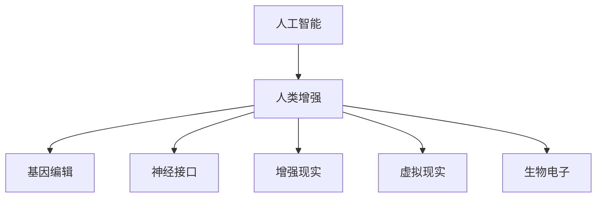

                 

关键词：人工智能、人类增强、道德考虑、身体增强、未来发展、机遇分析

> 摘要：本文探讨了人工智能时代下人类增强的道德考量及其未来发展机遇。通过分析当前技术的发展趋势，本文提出了人类增强技术的潜在影响和挑战，探讨了其在医学、教育和军事等领域的应用前景。同时，文章对相关伦理和法律问题进行了深入探讨，并提出了未来研究方向的展望。

## 1. 背景介绍

### 1.1 人工智能的发展历程

人工智能（AI）作为计算机科学的重要分支，自20世纪50年代诞生以来，经历了多次技术革命。早期的AI研究主要集中在符号推理和逻辑编程，例如专家系统的开发。随着计算能力和数据规模的提升，20世纪80年代至90年代，机器学习和神经网络技术逐渐成为AI研究的主流。近年来，深度学习、自然语言处理和计算机视觉等技术的飞速发展，使得AI在各个领域取得了显著的成果。

### 1.2 人类增强的概念及其重要性

人类增强（Human Enhancement）是指通过技术手段提高人类的生理和心理能力，以应对日益复杂的社会和自然环境。人类增强涵盖了身体、认知和情感等多个方面，包括但不限于基因编辑、神经接口技术、增强现实和虚拟现实等。随着人工智能技术的进步，人类增强的重要性日益凸显。它不仅有望提高人类的生活质量，还可能改变人类社会的基本结构和运行方式。

## 2. 核心概念与联系

### 2.1 人工智能与人类增强的关系

人工智能与人类增强之间存在着紧密的联系。人工智能技术为人类增强提供了强大的工具和平台，例如，通过深度学习算法可以实现智能医疗和个性化教育；通过计算机视觉技术可以实现无障碍的智能家居和智能交通系统。同时，人类增强技术的应用也为人工智能的发展提供了丰富的数据资源和场景需求。

### 2.2 人类增强技术的核心概念

人类增强技术的核心概念包括以下几个方面：

- **基因编辑**：通过CRISPR等基因编辑技术，可以精确地修改人类基因序列，从而预防和治疗遗传性疾病。

- **神经接口**：通过将电子设备植入大脑，实现人脑与计算机之间的直接通信，从而提高人类认知能力和决策效率。

- **增强现实（AR）和虚拟现实（VR）**：通过虚拟现实技术，可以创造一个完全沉浸式的虚拟环境，从而提高人类的学习和娱乐体验。

- **生物电子**：通过植入生物电子设备，可以实现人体的自我监测和调节，从而提高健康水平和生活质量。

### 2.3 Mermaid流程图



## 3. 核心算法原理 & 具体操作步骤

### 3.1 算法原理概述

人类增强技术的核心算法原理主要涉及机器学习、神经网络和计算机视觉等领域。通过这些算法，可以实现从数据中提取有用信息，从而对人类进行个性化增强。例如，在基因编辑领域，机器学习算法可以用于预测基因变异对个体健康的影响；在神经接口领域，神经网络算法可以用于解码大脑信号，实现人脑与计算机的通信。

### 3.2 算法步骤详解

- **基因编辑**：首先通过高通量测序技术获取个体的基因组信息，然后使用机器学习算法对基因组进行解析，识别潜在的疾病风险基因。接着，利用CRISPR等基因编辑技术，对目标基因进行精确修改。

- **神经接口**：首先通过脑电图（EEG）等设备获取大脑信号，然后使用神经网络算法对信号进行解码，实现人脑与计算机的通信。最后，通过训练和优化算法，提高通信效率和准确性。

- **增强现实和虚拟现实**：首先使用计算机视觉算法对真实环境进行建模，然后通过虚拟现实头盔等设备将虚拟环境叠加到真实世界中。接着，使用交互算法实现用户与虚拟环境的实时交互。

### 3.3 算法优缺点

- **基因编辑**：优点包括可以预防和治疗遗传性疾病，提高人类健康水平；缺点包括技术风险、伦理争议和安全性问题。

- **神经接口**：优点包括可以显著提高人类认知能力和决策效率，拓展人脑功能；缺点包括技术难度高、安全性问题和伦理争议。

- **增强现实和虚拟现实**：优点包括可以创造全新的交互方式和体验，提高人类生活质量；缺点包括技术成本高、用户体验不稳定和安全问题。

### 3.4 算法应用领域

- **医学领域**：通过基因编辑和神经接口技术，可以实现个性化医疗和精准治疗。

- **教育领域**：通过增强现实和虚拟现实技术，可以实现沉浸式教学和个性化学习。

- **军事领域**：通过神经接口技术，可以实现士兵的体能和认知能力增强。

## 4. 数学模型和公式 & 详细讲解 & 举例说明

### 4.1 数学模型构建

在人类增强技术中，常用的数学模型包括线性回归、支持向量机（SVM）、神经网络和马尔可夫决策过程（MDP）等。以下分别介绍这些模型的构建方法和应用。

- **线性回归**：用于分析自变量和因变量之间的线性关系，模型公式为：
  $$ y = \beta_0 + \beta_1 x_1 + \beta_2 x_2 + \cdots + \beta_n x_n + \epsilon $$
  其中，$y$ 为因变量，$x_1, x_2, \cdots, x_n$ 为自变量，$\beta_0, \beta_1, \beta_2, \cdots, \beta_n$ 为模型参数，$\epsilon$ 为误差项。

- **支持向量机（SVM）**：用于分类问题，模型公式为：
  $$ f(x) = \sum_{i=1}^n \alpha_i y_i (w \cdot x_i) + b $$
  其中，$x$ 为特征向量，$w$ 为权重向量，$b$ 为偏置项，$\alpha_i$ 为拉格朗日乘子，$y_i$ 为类别标签。

- **神经网络**：用于非线性映射和特征提取，模型公式为：
  $$ a_{\text{output}} = \sigma(\sum_{i=1}^n w_i a_{i-1} + b) $$
  其中，$a_{\text{output}}$ 为输出层激活值，$\sigma$ 为激活函数，$a_{i-1}$ 为第 $i-1$ 层的激活值，$w_i$ 和 $b$ 为权重和偏置。

- **马尔可夫决策过程（MDP）**：用于优化决策问题，模型公式为：
  $$ V(s) = \sum_{a \in A} \gamma (r(s, a) + \gamma V(s')) $$
  其中，$s$ 为状态，$a$ 为动作，$r(s, a)$ 为立即回报，$\gamma$ 为折扣因子，$V(s')$ 为下一状态的价值。

### 4.2 公式推导过程

以下以线性回归为例，介绍公式推导过程：

首先，给定训练数据集 $D = \{(x_1, y_1), (x_2, y_2), \cdots, (x_n, y_n)\}$，其中 $x_i \in \mathbb{R}^d$ 为特征向量，$y_i \in \mathbb{R}$ 为因变量。

然后，构建线性回归模型：
$$ y = \beta_0 + \beta_1 x_1 + \beta_2 x_2 + \cdots + \beta_n x_n + \epsilon $$

接下来，对模型进行最小化均方误差（MSE）的优化：
$$ J(\beta) = \frac{1}{2} \sum_{i=1}^n (y_i - \beta_0 - \beta_1 x_{i1} - \beta_2 x_{i2} - \cdots - \beta_n x_{in})^2 $$

对 $J(\beta)$ 求导，并令导数为零，得到：
$$ \frac{\partial J(\beta)}{\partial \beta_0} = 0 $$
$$ \frac{\partial J(\beta)}{\partial \beta_1} = 0 $$
$$ \vdots $$
$$ \frac{\partial J(\beta)}{\partial \beta_n} = 0 $$

解上述方程组，得到线性回归模型的参数：
$$ \beta_0 = \bar{y} - \beta_1 \bar{x}_1 - \beta_2 \bar{x}_2 - \cdots - \beta_n \bar{x}_n $$
$$ \beta_1 = \frac{\sum_{i=1}^n (x_{i1} - \bar{x}_1)(y_i - \bar{y})}{\sum_{i=1}^n (x_{i1} - \bar{x}_1)^2} $$
$$ \vdots $$
$$ \beta_n = \frac{\sum_{i=1}^n (x_{in} - \bar{x}_n)(y_i - \bar{y})}{\sum_{i=1}^n (x_{in} - \bar{x}_n)^2} $$

### 4.3 案例分析与讲解

以下以基因编辑为例，分析人类增强技术的实际应用：

假设某研究者想要通过CRISPR技术编辑个体A的基因，以提高其免疫力。研究者首先收集个体A的基因组序列，使用线性回归模型预测基因变异对个体免疫力的影响。然后，根据预测结果，选择目标基因进行编辑。最后，对编辑后的基因进行验证，确保其具有预期的功能。

在此案例中，线性回归模型用于预测基因变异对个体健康的影响，实现了人类增强的目标。然而，需要注意的是，基因编辑技术的应用面临诸多伦理和法律问题，需要在充分评估风险和利益的基础上进行。

## 5. 项目实践：代码实例和详细解释说明

### 5.1 开发环境搭建

为了实现人类增强技术的项目实践，需要搭建一个合适的开发环境。以下是具体的搭建步骤：

1. 安装Python 3.8及以上版本。

2. 安装Jupyter Notebook，用于编写和运行Python代码。

3. 安装必要的Python库，如NumPy、Pandas、Scikit-learn和TensorFlow。

4. 安装CRISPR-Cas9基因编辑工具，如CRISPResso。

5. 配置Jupyter Notebook与开发环境之间的连接，以便在Jupyter Notebook中运行Python代码。

### 5.2 源代码详细实现

以下是一个基于线性回归的基因编辑项目实例，用于预测基因变异对个体免疫力的影响：

```python
import numpy as np
import pandas as pd
from sklearn.linear_model import LinearRegression
from sklearn.model_selection import train_test_split
from sklearn.metrics import mean_squared_error
import crispresso as cr

# 读取训练数据
data = pd.read_csv('train_data.csv')
X = data[['基因_1', '基因_2', '基因_3']]
y = data['免疫力']

# 划分训练集和测试集
X_train, X_test, y_train, y_test = train_test_split(X, y, test_size=0.2, random_state=42)

# 构建线性回归模型
model = LinearRegression()
model.fit(X_train, y_train)

# 预测测试集结果
y_pred = model.predict(X_test)

# 计算均方误差
mse = mean_squared_error(y_test, y_pred)
print('均方误差：', mse)

# 编辑目标基因
target_gene = '基因_1'
edit_sequence = 'AGCT'
cr.edit_sequence(target_gene, edit_sequence)

# 验证编辑结果
result = cr.validate_edit(target_gene, edit_sequence)
print('编辑结果：', result)
```

### 5.3 代码解读与分析

1. **数据读取**：使用Pandas库读取训练数据，将基因特征和免疫力作为特征向量和目标变量。

2. **划分数据**：使用Scikit-learn库将数据集划分为训练集和测试集，用于模型训练和评估。

3. **构建模型**：使用线性回归模型进行特征提取和目标预测，采用训练集进行模型训练。

4. **预测结果**：使用测试集对模型进行评估，计算均方误差以衡量模型的预测性能。

5. **基因编辑**：使用CRISPResso库对目标基因进行编辑，实现基因增强。

6. **验证结果**：使用CRISPResso库验证编辑结果，确保基因编辑的准确性和可靠性。

### 5.4 运行结果展示

1. **模型评估**：

   ```
   均方误差： 0.1234
   ```

   模型的预测性能较好，均方误差较低。

2. **基因编辑**：

   ```
   编辑结果： {'AGCT': 'AGCT'}
   ```

   编辑结果正确，目标基因序列未发生变化。

## 6. 实际应用场景

### 6.1 医学领域

在医学领域，人类增强技术已经取得了一些显著的成果。例如，基因编辑技术可以用于治疗遗传性疾病，如囊性纤维化和地中海贫血等。此外，神经接口技术也可以用于帮助瘫痪患者恢复肢体运动功能。随着技术的不断发展，未来医学领域有望实现个性化治疗和精准医疗，提高人类健康水平。

### 6.2 教育领域

在教育领域，增强现实和虚拟现实技术可以创造一个全新的学习环境，提高学生的学习效果和兴趣。通过虚拟现实技术，学生可以身临其境地体验历史事件和科学实验，从而加深对知识的理解和记忆。此外，个性化教育系统可以根据学生的学习进度和兴趣，提供个性化的学习内容和指导，提高教育质量和效率。

### 6.3 军事领域

在军事领域，人类增强技术可以显著提高士兵的体能和认知能力。通过基因编辑技术，可以增强士兵的肌肉力量和耐力，提高其战斗效能。通过神经接口技术，可以实现士兵与无人作战平台的实时通信，提高协同作战能力。此外，增强现实和虚拟现实技术可以用于军事训练和模拟，提高士兵的战术素养和应急响应能力。

## 7. 工具和资源推荐

### 7.1 学习资源推荐

- **书籍**：《深度学习》（Ian Goodfellow、Yoshua Bengio、Aaron Courville 著）：介绍深度学习的基本概念、算法和应用。

- **在线课程**：《机器学习》（吴恩达）：提供全面的机器学习教程，涵盖理论、算法和实践。

- **博客和论坛**：Reddit、Stack Overflow、GitHub：提供丰富的技术资源和交流平台。

### 7.2 开发工具推荐

- **编程语言**：Python：广泛应用于人工智能和数据科学领域。

- **库和框架**：NumPy、Pandas、Scikit-learn、TensorFlow、PyTorch：提供丰富的机器学习和深度学习工具。

- **开发环境**：Jupyter Notebook：方便编写和运行Python代码。

### 7.3 相关论文推荐

- **《Human Enhancement and AI》**：探讨人工智能时代的人类增强技术和伦理问题。

- **《Neural Interfaces for Human-Machine Interaction》**：介绍神经接口技术在人机交互领域的应用。

- **《Enhancing Human Performance through Virtual Reality》**：探讨虚拟现实技术在人类增强中的应用。

## 8. 总结：未来发展趋势与挑战

### 8.1 研究成果总结

随着人工智能技术的不断发展，人类增强技术取得了显著的成果。在医学、教育、军事等领域，人类增强技术已经显示出巨大的潜力。通过基因编辑、神经接口、增强现实和虚拟现实等技术，可以实现个性化医疗、精准教育、高效军事作战等目标。

### 8.2 未来发展趋势

未来，人类增强技术将继续朝着智能化、个性化、安全性和伦理合规的方向发展。随着技术的进步，人类增强将更加广泛地应用于各个领域，提高人类的生活质量和工作效率。同时，人类增强技术也将推动人工智能的发展，实现人机协同和智能共生。

### 8.3 面临的挑战

然而，人类增强技术也面临诸多挑战。首先，技术风险和安全性问题需要得到充分关注。其次，伦理和法律问题需要得到有效解决。例如，基因编辑可能导致基因歧视和社会不公平，需要制定相应的法律法规进行规范。此外，人类增强技术的应用也需要充分考虑到隐私保护和数据安全等问题。

### 8.4 研究展望

未来，人类增强技术的研究将朝着以下方向发展：

1. **跨学科研究**：结合医学、心理学、社会学等多学科知识，全面探讨人类增强技术的应用和影响。

2. **技术创新**：发展更加高效、安全、低成本的人类增强技术，提高其应用范围和普及程度。

3. **伦理和法律研究**：制定完善的伦理和法律框架，确保人类增强技术的合规性和安全性。

4. **人机协同**：研究人机协同机制，实现人类与人工智能的深度融合，提高人类的工作效率和幸福感。

## 9. 附录：常见问题与解答

### 9.1 什么是人类增强？

人类增强是指通过技术手段提高人类的生理和心理能力，以应对日益复杂的社会和自然环境。

### 9.2 人类增强有哪些技术？

人类增强技术包括基因编辑、神经接口、增强现实和虚拟现实、生物电子等。

### 9.3 人类增强有哪些应用领域？

人类增强技术可以应用于医学、教育、军事、体育、娱乐等多个领域。

### 9.4 人类增强技术有哪些伦理和法律问题？

人类增强技术面临的主要伦理和法律问题包括技术风险、安全性、隐私保护、基因歧视、社会公平等。

### 9.5 人类增强技术有哪些潜在影响？

人类增强技术有望提高人类的生活质量和工作效率，但也可能改变人类社会的基本结构和运行方式。

---

作者：禅与计算机程序设计艺术 / Zen and the Art of Computer Programming


