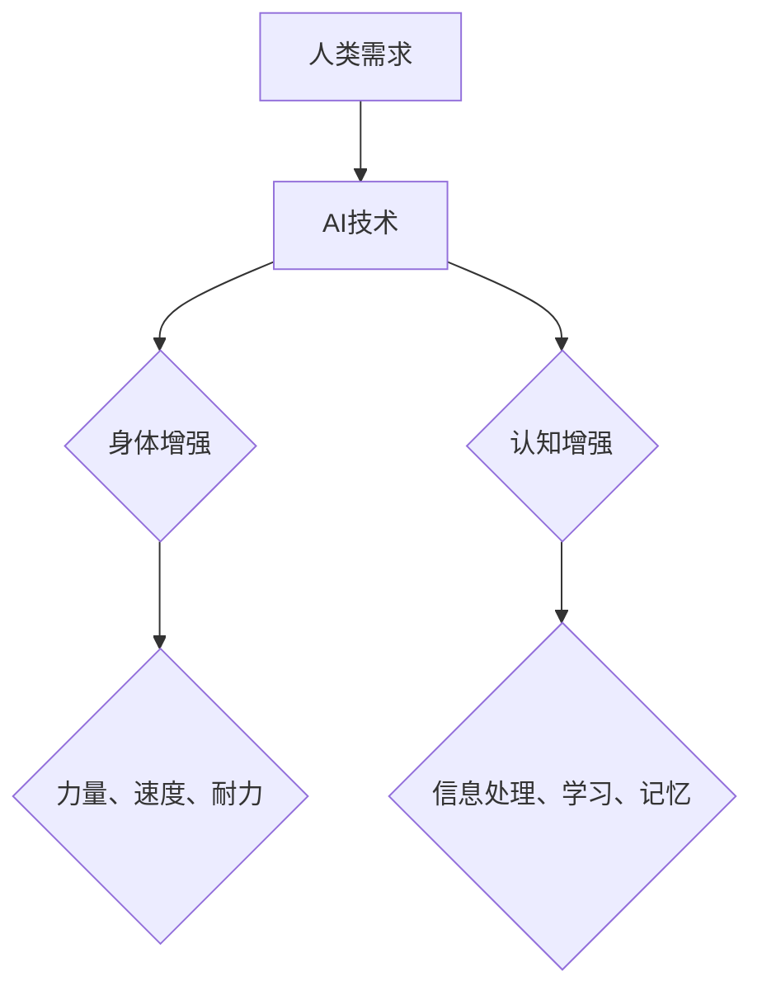

                 

关键词：人工智能，人类增强，道德考量，身体增强，未来发展趋势，挑战

摘要：随着人工智能技术的发展，人类增强成为了一个热门话题。本文将探讨在AI时代，人类增强所带来的道德考量，身体增强的未来发展机遇，以及面临的挑战和趋势。

## 1. 背景介绍

在过去的几十年里，人工智能（AI）技术取得了显著的进步。从最初的规则系统，到深度学习，再到自然语言处理，AI技术已经渗透到我们生活的方方面面。与此同时，人类增强（Human Enhancement）的概念也逐渐走进了大众视野。人类增强指的是通过技术手段提高人类的能力，包括身体和认知方面的增强。随着科技的不断发展，人类增强的未来前景愈发广阔。

## 2. 核心概念与联系

### 2.1. 人类增强的定义与分类

人类增强可以按照增强的领域分为身体增强和认知增强。身体增强主要关注物理能力的提升，如力量、速度、耐力等。认知增强则侧重于提高人类的信息处理能力、学习能力、记忆能力等。

### 2.2. AI与人类增强的关系

AI技术在人类增强中的应用主要体现在两个方面：一是通过算法和数据处理能力，为人类增强提供技术支持；二是通过智能设备，直接增强人类的能力。

### 2.3. Mermaid 流程图



## 3. 核心算法原理 & 具体操作步骤

### 3.1. 算法原理概述

人类增强的核心算法主要包括机器学习、深度学习和自然语言处理等技术。这些算法通过大量数据训练模型，实现对人类能力的预测和提升。

### 3.2. 算法步骤详解

#### 3.2.1. 数据收集与预处理

首先，需要收集大量关于人类身体和认知能力的数据，包括生理指标、行为数据、认知测试结果等。然后，对数据进行分析和预处理，去除噪声，保证数据的准确性和可靠性。

#### 3.2.2. 模型训练与优化

使用预处理后的数据，训练机器学习模型。通过调整模型参数，优化模型性能。常见的模型包括神经网络、决策树、支持向量机等。

#### 3.2.3. 模型评估与部署

将训练好的模型应用于实际场景，评估模型性能。如果性能满足要求，可以将模型部署到智能设备上，实现人类增强。

### 3.3. 算法优缺点

#### 优点：

- **高效性**：AI算法能够快速处理大量数据，提高人类能力的预测和提升效率。
- **个性化**：通过个性化数据训练模型，能够更好地满足个体需求。

#### 缺点：

- **数据隐私**：人类增强过程中涉及大量个人数据，数据隐私问题亟待解决。
- **算法偏见**：如果训练数据存在偏见，模型可能会放大这种偏见，影响人类增强的公平性。

### 3.4. 算法应用领域

AI算法在人类增强中的应用非常广泛，包括医疗、教育、体育、军事等领域。例如，通过AI技术，可以实现精准医疗、个性化教育、智能训练等。

## 4. 数学模型和公式 & 详细讲解 & 举例说明

### 4.1. 数学模型构建

人类增强的数学模型主要包括线性回归、逻辑回归、支持向量机等。以下是一个简单的线性回归模型：

$$ y = wx + b $$

其中，$y$ 表示被预测的变量，$w$ 和 $b$ 分别是模型的参数。

### 4.2. 公式推导过程

假设我们有一个包含 $n$ 个样本的数据集，每个样本包含特征向量 $x$ 和标签 $y$。我们可以将数据集表示为矩阵 $X$ 和向量 $y$。

$$ X = \begin{bmatrix} x_1 & x_2 & \cdots & x_n \end{bmatrix}, y = \begin{bmatrix} y_1 \\ y_2 \\ \vdots \\ y_n \end{bmatrix} $$

线性回归的目标是最小化预测值和真实值之间的误差：

$$ J(w, b) = \frac{1}{2} \sum_{i=1}^n (wx_i + b - y_i)^2 $$

### 4.3. 案例分析与讲解

假设我们要预测一个人的跑步速度，给定其体重和跑步时间。我们可以使用线性回归模型进行预测。

首先，收集数据，得到体重和跑步时间的数据集。然后，对数据进行预处理，将体重和跑步时间作为特征向量，将跑步速度作为标签。

接下来，使用线性回归算法训练模型。通过调整模型参数，使预测误差最小。

最后，将训练好的模型应用于新样本，预测其跑步速度。

## 5. 项目实践：代码实例和详细解释说明

### 5.1. 开发环境搭建

在Python环境中，我们可以使用scikit-learn库实现线性回归模型。

### 5.2. 源代码详细实现

```python
from sklearn.linear_model import LinearRegression
from sklearn.model_selection import train_test_split
from sklearn.metrics import mean_squared_error

# 数据加载与预处理
X, y = load_data()

# 数据集划分
X_train, X_test, y_train, y_test = train_test_split(X, y, test_size=0.2, random_state=42)

# 模型训练
model = LinearRegression()
model.fit(X_train, y_train)

# 模型评估
y_pred = model.predict(X_test)
mse = mean_squared_error(y_test, y_pred)
print("MSE:", mse)

# 模型部署
new_data = [[65, 30]]  # 新样本的体重和跑步时间
speed = model.predict(new_data)
print("Predicted speed:", speed)
```

### 5.3. 代码解读与分析

这段代码首先加载并预处理数据，然后使用scikit-learn库中的LinearRegression类训练模型。通过评估模型在测试集上的性能，可以得到模型的MSE。最后，使用训练好的模型预测新样本的跑步速度。

## 6. 实际应用场景

人类增强技术已经在多个领域得到了实际应用。例如，在医疗领域，通过AI技术可以实现精准医疗和个性化治疗。在教育领域，通过AI技术可以实现个性化教育和智能评估。在体育领域，通过AI技术可以实现智能训练和比赛策略优化。

## 7. 未来应用展望

随着AI技术的发展，人类增强的应用前景将更加广阔。未来，我们可以期待在以下领域实现突破：

- **健康监测**：通过AI技术，实时监测人类的健康状态，预防疾病。
- **智能辅助**：为残障人士提供智能辅助，提高生活质量。
- **军事应用**：通过AI技术，提高士兵的作战能力。

## 8. 工具和资源推荐

### 8.1. 学习资源推荐

- 《深度学习》（Goodfellow, Bengio, Courville 著）
- 《Python机器学习》（Scikit-Learn 机器学习库）

### 8.2. 开发工具推荐

- Jupyter Notebook
- Anaconda

### 8.3. 相关论文推荐

- "Deep Learning for Human Pose Estimation: A Survey"（2020）
- "AI for Humanity: A Research Agenda"（2017）

## 9. 总结：未来发展趋势与挑战

随着AI技术的不断发展，人类增强将迎来新的机遇。然而，我们也需要面对以下挑战：

- **道德伦理**：人类增强的应用需要遵循道德伦理规范，保护人类权益。
- **数据隐私**：确保人类增强过程中个人数据的隐私和安全。
- **公平性**：防止人类增强技术造成社会不公。

在未来，我们需要不断探索和研究人类增强技术，推动其健康发展。

## 10. 附录：常见问题与解答

### 10.1. 人类增强技术是否安全？

人类增强技术本身是安全的，但需要遵循严格的伦理规范和安全标准，确保技术的应用不会对人类造成伤害。

### 10.2. 人类增强技术是否会加剧社会不公？

人类增强技术的公平性需要关注。我们需要制定相应的政策和法规，确保技术应用的公平性，避免加剧社会不公。

### 10.3. 人类增强技术是否会取代人类？

人类增强技术的目的是提高人类的能力，而不是取代人类。在未来的发展中，人类和AI技术将相互补充，共同推动社会进步。

## 作者署名

作者：禅与计算机程序设计艺术 / Zen and the Art of Computer Programming
----------------------------------------------------------------

文章撰写完毕，接下来我将按照markdown格式进行文章内容的排版和优化。

