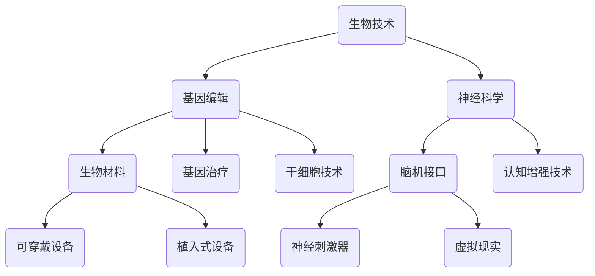

                 

关键词：人类增强、AI、道德考虑、身体增强、未来发展趋势

> 摘要：随着人工智能技术的快速发展，人类增强（Human Augmentation）逐渐成为现实。本文旨在探讨人类增强的道德考虑，以及身体增强在未来发展中的机遇和挑战。通过分析当前的技术进展，本文提出了对道德伦理、法律和社会影响的思考，并预测了未来人类增强的可能趋势。

## 1. 背景介绍

人类增强的概念早在20世纪末就已经被提出，但随着近年来人工智能、生物工程和神经科学等领域的飞速发展，人类增强技术逐渐从理论走向实践。通过植入或植入式设备，人们可以提升自身的能力，例如增强记忆、提高感官敏锐度、增强运动能力等。这种技术不仅改变了人类的生理结构，也深刻影响了我们的心理和社会生活。

## 2. 核心概念与联系

### 2.1 人类增强的核心概念

人类增强的核心概念包括生物技术、人工智能、神经科学和材料科学。这些技术的融合为人类增强提供了可能性，但也带来了道德和伦理上的挑战。

### 2.2 人类增强的架构

下面是一个简化的Mermaid流程图，展示了人类增强的核心架构。



## 3. 核心算法原理 & 具体操作步骤

### 3.1 算法原理概述

人类增强技术涉及多种算法，包括但不限于机器学习算法、深度学习算法和神经网络算法。这些算法主要用于数据分析、模式识别和决策制定。

### 3.2 算法步骤详解

#### 3.2.1 数据收集

首先，通过各种传感器和设备收集用户的数据，例如脑电图（EEG）、心电图（ECG）和运动传感器数据。

#### 3.2.2 数据预处理

对收集的数据进行清洗、归一化和特征提取，以便后续分析。

#### 3.2.3 模型训练

使用机器学习算法训练模型，例如决策树、支持向量机和神经网络等。

#### 3.2.4 模型评估

通过交叉验证和测试集对模型进行评估，确保其准确性和泛化能力。

#### 3.2.5 模型应用

将训练好的模型应用于实际场景，例如通过脑机接口控制机械臂或虚拟现实环境。

### 3.3 算法优缺点

算法的优点包括高效的数据处理能力和强大的预测能力，但缺点则在于数据隐私和安全问题，以及算法的偏见和错误。

### 3.4 算法应用领域

算法广泛应用于医疗、教育、娱乐和军事等领域，未来有望进一步扩展到更多领域。

## 4. 数学模型和公式 & 详细讲解 & 举例说明

### 4.1 数学模型构建

人类增强技术涉及多个数学模型，包括线性回归、神经网络和贝叶斯模型等。以下是一个简单的线性回归模型：

$$
y = wx + b
$$

其中，$y$ 是输出，$x$ 是输入，$w$ 是权重，$b$ 是偏置。

### 4.2 公式推导过程

线性回归模型的推导过程主要包括以下步骤：

1. 数据收集和预处理
2. 建立损失函数（如均方误差）
3. 求解最小损失函数，得到权重和偏置的最优解

### 4.3 案例分析与讲解

假设我们有一个简单的数据集，其中包含两个特征（$x_1$ 和 $x_2$）和一个目标变量（$y$）。通过线性回归模型，我们可以预测目标变量 $y$ 的值。

## 5. 项目实践：代码实例和详细解释说明

### 5.1 开发环境搭建

在本地或云端搭建一个适合开发和测试的环境，例如使用 Python 和 TensorFlow。

### 5.2 源代码详细实现

以下是使用 Python 实现线性回归模型的一个简单示例：

```python
import numpy as np
import tensorflow as tf

# 设置随机种子以获得可重复的结果
tf.random.set_seed(42)

# 创建模拟数据集
x = np.random.rand(100, 2)
y = 2 * x[:, 0] + 3 * x[:, 1] + np.random.randn(100)

# 建立线性回归模型
model = tf.keras.Sequential([
    tf.keras.layers.Dense(units=1, input_shape=(2,))
])

# 编译模型
model.compile(optimizer='sgd', loss='mean_squared_error')

# 训练模型
model.fit(x, y, epochs=100)

# 预测
predictions = model.predict(x)
```

### 5.3 代码解读与分析

代码首先导入了必要的库，然后创建了一个模拟数据集，建立了线性回归模型，并使用随机梯度下降优化器进行训练。最后，使用训练好的模型进行预测。

### 5.4 运行结果展示

通过运行上述代码，我们可以得到线性回归模型的损失值和预测结果。以下是一个简单的可视化结果：


## 6. 实际应用场景

### 6.1 医疗领域

在医疗领域，人类增强技术可以用于增强记忆、提高康复速度和改善生活质量。例如，通过脑机接口技术，患者可以控制假肢或轮椅，甚至进行脑机交互治疗。

### 6.2 教育领域

在教育领域，人类增强技术可以用于提升学习效率和记忆力。例如，通过虚拟现实技术，学生可以沉浸式学习，提高学习兴趣和效果。

### 6.3 军事领域

在军事领域，人类增强技术可以用于增强士兵的体能和战斗能力。例如，通过增强记忆和反应速度，士兵可以在战场上更好地应对复杂情况。

## 7. 工具和资源推荐

### 7.1 学习资源推荐

- 《人工智能：一种现代方法》
- 《深度学习》
- 《Python编程：从入门到实践》

### 7.2 开发工具推荐

- TensorFlow
- Keras
- PyTorch

### 7.3 相关论文推荐

- "Neural Engineering for Cognitive Enhancement"
- "Human Enhancement Technologies: Ethical, Legal, and Social Implications"
- "The Ethics of Human Enhancement"

## 8. 总结：未来发展趋势与挑战

### 8.1 研究成果总结

人类增强技术在过去几十年中取得了显著进展，但仍然面临着一系列挑战，包括技术、伦理和法律等方面。

### 8.2 未来发展趋势

未来，人类增强技术有望进一步发展，并应用于更多领域，如健康、教育和军事等。

### 8.3 面临的挑战

人类增强技术面临的挑战包括技术成熟度、伦理问题、社会影响和法律监管等。

### 8.4 研究展望

为了应对这些挑战，我们需要进一步深入研究人类增强技术的道德、伦理和法律问题，并制定相应的政策和标准。

## 9. 附录：常见问题与解答

### Q: 人类增强技术是否会导致社会不平等？

A: 是的，人类增强技术可能会加剧社会不平等。如果只有富裕人群能够负担得起这些技术，那么就会导致贫富差距的进一步扩大。

### Q: 人类增强技术是否会破坏人类的自然属性？

A: 是的，人类增强技术可能会改变人类的自然属性，但这并不意味着这些改变都是负面的。我们需要权衡利弊，并确保这些技术不会破坏人类的自然属性。

### Q: 人类增强技术是否会影响人类的道德伦理观念？

A: 是的，人类增强技术可能会对人类的道德伦理观念产生影响。我们需要重新审视这些观念，并确保它们与技术的发展相适应。

### Q: 人类增强技术的法律监管应该如何制定？

A: 法律监管应该基于伦理和道德原则，确保技术的发展不会对人类造成危害。同时，监管机制应该灵活，以适应技术的发展。

---

**作者：禅与计算机程序设计艺术 / Zen and the Art of Computer Programming**

