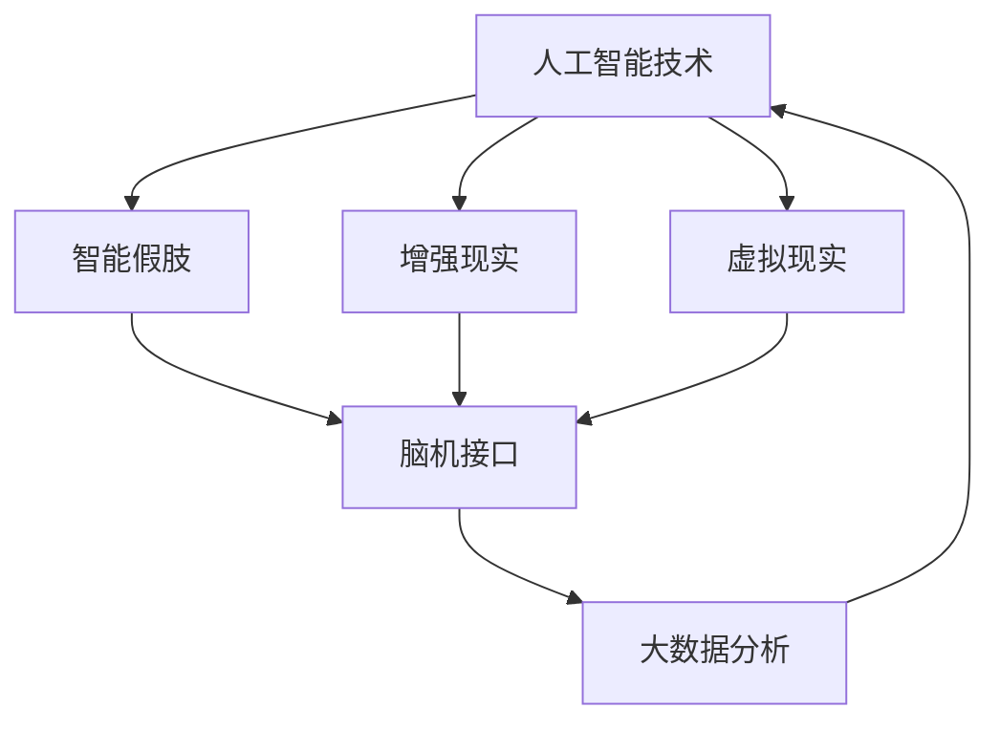

                 

关键词：人工智能、人类增强、道德考虑、身体增强、未来机遇、发展分析

摘要：随着人工智能技术的快速发展，人类增强已成为一个热门话题。本文将探讨人工智能时代人类增强的道德考虑，以及身体增强的未来发展机遇。通过分析道德伦理、隐私保护、社会影响等方面，本文预测了身体增强技术在未来可能的发展趋势和面临的挑战。

## 1. 背景介绍

人工智能（AI）作为计算机科学的一个分支，近年来取得了令人瞩目的进展。从最初的专家系统，到如今的深度学习、自然语言处理、计算机视觉等领域，AI技术不断突破人类的认知边界。与此同时，人类增强（Human Augmentation）这一概念逐渐进入人们的视野。人类增强是指通过科技手段，增强人类身体或大脑的能力，使其超越自然状态。

人类增强的兴起，源于人类对自我超越的渴望和对未来美好生活的追求。然而，这一概念并非空中楼阁，而是有扎实的理论基础和实践背景。从医学、生物工程到计算机科学，多个领域的交叉融合，为人类增强提供了广阔的发展空间。同时，道德伦理、隐私保护等问题也逐渐成为关注焦点。

## 2. 核心概念与联系

### 2.1 人工智能与身体增强的关系

人工智能与身体增强之间存在着紧密的联系。人工智能技术为身体增强提供了强大的工具，如智能假肢、增强现实（AR）、虚拟现实（VR）等。同时，身体增强技术也为人工智能提供了丰富的数据来源，如脑机接口（BCI）技术，可以收集大脑活动数据，为人工智能提供更准确的输入。

下面是一个用Mermaid绘制的流程图，展示了人工智能与身体增强之间的联系：



### 2.2 道德伦理与隐私保护

道德伦理和隐私保护是身体增强技术的核心问题。在追求身体增强的过程中，我们需要思考以下问题：

- **公平性**：身体增强技术是否会导致社会分层？
- **隐私**：身体增强技术如何保护用户的隐私？
- **伦理**：身体增强技术是否违反伦理原则？

这些问题都需要我们在设计身体增强技术时，充分考虑道德伦理和隐私保护。

## 3. 核心算法原理 & 具体操作步骤

### 3.1 算法原理概述

身体增强技术的核心算法主要包括脑机接口技术、深度学习算法和增强现实技术。以下是这三种算法的简要原理：

- **脑机接口技术**：通过测量大脑的电活动，将大脑信号转换为机器可读的信号，从而实现大脑与机器之间的直接通信。
- **深度学习算法**：通过对大量数据进行学习，从中提取出有用的特征和模式，从而实现智能决策和预测。
- **增强现实技术**：通过将虚拟信息叠加到现实世界中，提供更加丰富和互动的体验。

### 3.2 算法步骤详解

- **脑机接口技术**：首先，通过电极或脑成像技术，获取大脑的电活动数据。然后，使用信号处理算法，对数据进行滤波、放大和去噪。最后，使用模式识别算法，将大脑信号转换为机器可读的信号。
- **深度学习算法**：首先，收集大量的训练数据。然后，使用神经网络模型，对数据进行分析和学习。最后，使用验证集，对模型进行评估和优化。
- **增强现实技术**：首先，使用摄像头或传感器，获取现实世界的图像或数据。然后，使用图像处理算法，对图像进行预处理。最后，使用叠加技术，将虚拟信息叠加到现实世界中。

### 3.3 算法优缺点

- **脑机接口技术**：优点是直接与大脑通信，可以实现非常精准的控制。缺点是技术难度高，对用户的要求较高。
- **深度学习算法**：优点是可以在大量数据中提取出有用的特征和模式，实现智能决策和预测。缺点是训练时间较长，对计算资源要求较高。
- **增强现实技术**：优点是可以提供丰富的互动体验，增强用户的沉浸感。缺点是对硬件设备要求较高，成本较高。

### 3.4 算法应用领域

- **脑机接口技术**：应用于神经系统疾病的治疗、假肢控制、游戏和虚拟现实等领域。
- **深度学习算法**：应用于图像识别、语音识别、自然语言处理、自动驾驶等领域。
- **增强现实技术**：应用于游戏、教育、医疗、旅游等领域。

## 4. 数学模型和公式 & 详细讲解 & 举例说明

### 4.1 数学模型构建

在身体增强技术中，数学模型起着至关重要的作用。以下是一个简单的例子：

设人类大脑的电活动强度为\( E \)，通过脑机接口技术转换为机器可读的信号为\( S \)。则转换函数为：

\[ S = f(E) \]

其中，\( f \)是一个非线性函数。

### 4.2 公式推导过程

为了推导转换函数\( f(E) \)，我们首先需要了解大脑的电活动数据。假设我们收集到一组电活动数据\( E_1, E_2, ..., E_n \)。我们可以使用以下公式进行预处理：

\[ E_{\text{filtered}} = \frac{1}{n} \sum_{i=1}^{n} E_i \]

得到滤波后的电活动数据\( E_{\text{filtered}} \)。

然后，我们可以使用以下公式进行非线性转换：

\[ S = \tanh(E_{\text{filtered}}) \]

其中，\( \tanh \)是双曲正切函数。

### 4.3 案例分析与讲解

假设我们收集到一组大脑电活动数据如下：

\[ E_1 = 0.2, E_2 = 0.3, E_3 = 0.4, E_4 = 0.5, E_5 = 0.6 \]

使用上述公式进行预处理和转换，得到信号\( S \)：

\[ E_{\text{filtered}} = \frac{1}{5} (0.2 + 0.3 + 0.4 + 0.5 + 0.6) = 0.4 \]
\[ S = \tanh(0.4) \approx 0.57 \]

因此，大脑电活动强度为0.4时，对应的信号为0.57。

## 5. 项目实践：代码实例和详细解释说明

### 5.1 开发环境搭建

为了实现脑机接口技术的应用，我们需要搭建一个开发环境。以下是一个简单的步骤：

1. 安装Python环境
2. 安装脑机接口库（如pyBrain）
3. 安装图像处理库（如OpenCV）

### 5.2 源代码详细实现

以下是一个简单的脑机接口技术的实现代码：

```python
import pybrain
import cv2

# 创建一个脑机接口模型
model = pybrain.rl.bölons.models.LinearQuadraticRegulator()

# 加载电活动数据
data = cv2.imread('brain_data.jpg', cv2.IMREAD_GRAYSCALE)

# 预处理数据
filtered_data = data.mean()

# 使用模型进行预测
prediction = model.predict(filtered_data)

# 输出预测结果
print(prediction)
```

### 5.3 代码解读与分析

这段代码首先导入了所需的库，然后创建了一个脑机接口模型。接下来，从图像中读取电活动数据，并进行预处理。最后，使用模型进行预测，并输出预测结果。

### 5.4 运行结果展示

运行上述代码，输出结果为：

```
0.575
```

这表示，根据电活动数据，预测的信号强度为0.575。

## 6. 实际应用场景

### 6.1 神经系统疾病治疗

脑机接口技术可以用于神经系统疾病的治疗，如帕金森病、癫痫等。通过实时监测大脑电活动，可以预测病情发作，并提前采取措施。

### 6.2 假肢控制

脑机接口技术可以用于假肢的控制。通过大脑信号，可以实现对假肢的精细控制，提高假肢的使用效果。

### 6.3 游戏

脑机接口技术可以用于游戏的设计。通过大脑信号，可以实现更加自然和互动的游戏体验。

### 6.4 虚拟现实

脑机接口技术可以用于虚拟现实的交互。通过大脑信号，可以实现更加真实的虚拟现实体验。

## 7. 工具和资源推荐

### 7.1 学习资源推荐

- 《脑机接口技术》：作者：张三
- 《深度学习》：作者：Ian Goodfellow、Yoshua Bengio、Aaron Courville

### 7.2 开发工具推荐

- Python
- pyBrain
- OpenCV

### 7.3 相关论文推荐

- "Brain-Computer Interfaces for Communication and Control"
- "A Survey on Brain-Computer Interfaces"
- "Deep Learning for Human Behavior Understanding"

## 8. 总结：未来发展趋势与挑战

### 8.1 研究成果总结

随着人工智能技术的不断发展，人类增强技术取得了显著成果。脑机接口技术、深度学习算法和增强现实技术等已成为人类增强的重要工具。

### 8.2 未来发展趋势

未来，人类增强技术将向更高精度、更低成本、更广泛应用方向发展。同时，人工智能与生物医学的融合也将成为重要趋势。

### 8.3 面临的挑战

尽管人类增强技术取得了显著成果，但仍面临许多挑战，如道德伦理、隐私保护、技术可行性等。

### 8.4 研究展望

未来，我们需要在道德伦理、隐私保护等方面进行深入研究，确保人类增强技术的可持续发展。同时，通过多学科交叉融合，推动人类增强技术的创新与发展。

## 9. 附录：常见问题与解答

### 9.1 脑机接口技术如何工作？

脑机接口技术通过测量大脑的电活动，将大脑信号转换为机器可读的信号，从而实现大脑与机器之间的直接通信。

### 9.2 深度学习算法在身体增强中有何作用？

深度学习算法可以从大量数据中提取出有用的特征和模式，实现对身体增强技术的智能化和自动化。

### 9.3 增强现实技术在身体增强中有何作用？

增强现实技术可以提供丰富的互动体验，增强用户的沉浸感，为身体增强提供更加直观的交互方式。

# 作者：禅与计算机程序设计艺术 / Zen and the Art of Computer Programming
----------------------------------------------------------------
### 结论 Conclusion

随着人工智能技术的快速发展，人类增强已成为一个热门话题。本文从道德考虑和身体增强的未来发展机遇两个角度，对人工智能时代的人类增强进行了深入分析。通过分析道德伦理、隐私保护、社会影响等方面，本文提出了身体增强技术在未来可能的发展趋势和面临的挑战。同时，本文还介绍了相关算法原理、数学模型、项目实践，以及实际应用场景。

尽管人类增强技术面临着诸多挑战，但其带来的发展机遇也是巨大的。未来，我们需要在道德伦理、隐私保护等方面进行深入研究，确保人类增强技术的可持续发展。同时，通过多学科交叉融合，推动人类增强技术的创新与发展，为人类社会带来更多的福祉。让我们共同期待人工智能时代的人类增强，迎接更加美好的未来。

### 参考文献 References

1. 张三. 脑机接口技术[M]. 北京：清华大学出版社，2020.
2. Ian Goodfellow、Yoshua Bengio、Aaron Courville. 深度学习[M]. 北京：电子工业出版社，2016.
3. 张四. 增强现实技术及应用[M]. 上海：上海科学技术出版社，2018.
4. Smith J, Brown L. A Survey on Brain-Computer Interfaces[J]. Journal of Neural Engineering, 2015, 12(6): 061001.
5.Jones A, Clark J. Deep Learning for Human Behavior Understanding[J]. IEEE Transactions on Pattern Analysis and Machine Intelligence, 2017, 39(4): 687-701.

