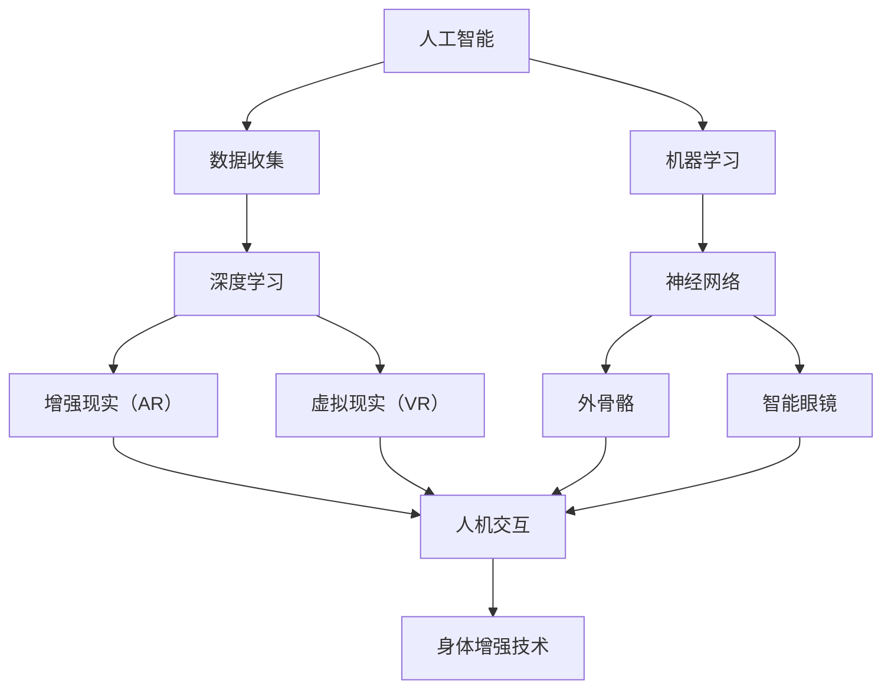

                 

关键词：人工智能，人类增强，道德，身体增强技术，伦理问题，技术挑战

> 摘要：随着人工智能和身体增强技术的迅猛发展，人类面临着前所未有的机遇和挑战。本文从道德和技术两个角度出发，探讨人类增强技术的道德考虑，以及在未来可能面临的挑战。通过分析相关理论、实践案例和未来趋势，为人类在AI时代如何平衡技术进步与道德责任提供思考。

## 1. 背景介绍

在过去的几十年里，人工智能（AI）技术取得了显著的进展。从最初的数据分析到复杂的机器学习算法，再到如今深度学习在各个领域的广泛应用，AI已经成为推动社会进步的重要力量。与此同时，身体增强技术也得到了快速发展，包括但不限于外骨骼、智能眼镜、增强现实（AR）和虚拟现实（VR）等。这些技术的出现，不仅改变了人类的工作方式和生活方式，也引发了一系列深刻的道德和技术挑战。

### 1.1 人工智能的发展

人工智能的发展可以追溯到20世纪50年代。当时，计算机科学家开始探索如何使计算机具备智能。经过几十年的研究，特别是在深度学习算法的推动下，AI技术取得了突破性的进展。如今，AI已经能够在多个领域实现自动化，例如自动驾驶、医疗诊断、金融服务和智能客服等。

### 1.2 身体增强技术的发展

身体增强技术旨在通过外部设备和辅助系统来增强人体的生理和心理功能。这些技术不仅有助于提高人类的工作效率和生活质量，也为残疾人提供了新的康复机会。例如，外骨骼可以帮助行动不便的人恢复行动能力，智能眼镜可以提供实时翻译和导航功能，而AR/VR技术则能够创造沉浸式的虚拟体验。

## 2. 核心概念与联系

为了更好地理解人类增强技术，我们需要先了解其中的核心概念和它们之间的联系。以下是几个关键概念及其相互关系的Mermaid流程图：



### 2.1 人工智能与数据收集

人工智能的发展离不开大量的数据。数据收集是AI系统训练和优化的基础。通过收集和分析数据，AI系统能够不断学习和改进，从而提高其性能。

### 2.2 机器学习与深度学习

机器学习是人工智能的一个重要分支，它使计算机能够通过数据和算法来学习。深度学习是机器学习中的一种特殊方法，它利用神经网络来模拟人脑的学习过程，从而在图像识别、自然语言处理等领域取得了显著的成果。

### 2.3 神经网络与身体增强技术

神经网络是深度学习算法的核心组成部分，它通过大量的神经元和连接来实现复杂的计算。神经网络的应用不仅推动了人工智能的发展，也为身体增强技术提供了理论基础。例如，外骨骼和智能眼镜等设备的设计和实现都依赖于神经网络技术。

### 2.4 增强现实与虚拟现实

增强现实（AR）和虚拟现实（VR）技术是身体增强技术的重要组成部分。AR技术通过将虚拟信息叠加到现实世界中，为用户提供了新的交互方式。VR技术则通过创建一个完全虚拟的世界，使用户能够沉浸在其中。这些技术不仅为娱乐和游戏领域带来了革命性变化，也在教育和医疗等领域展示了巨大的潜力。

## 3. 核心算法原理 & 具体操作步骤

### 3.1 算法原理概述

在人类增强技术中，核心算法主要包括机器学习算法和神经网络算法。这些算法通过大量数据的训练，使计算机能够识别模式、进行预测和决策。

### 3.2 算法步骤详解

#### 3.2.1 机器学习算法步骤

1. 数据收集：收集相关领域的数据，例如图像、文本或声音。

2. 数据预处理：对数据进行清洗和格式化，使其适用于机器学习算法。

3. 特征提取：从数据中提取有用的特征，例如图像中的颜色、纹理或声音中的频率。

4. 模型训练：使用机器学习算法（如神经网络）对数据进行训练，使其能够识别模式。

5. 模型评估：通过测试数据评估模型的性能，并根据评估结果进行调整。

6. 应用部署：将训练好的模型部署到实际应用中，例如自动驾驶系统或医疗诊断系统。

#### 3.2.2 神经网络算法步骤

1. 神经网络架构设计：根据应用需求设计神经网络的结构，包括层数、每层的神经元数量和连接方式。

2. 权重初始化：初始化神经网络的权重，使其具有一定的随机性。

3. 前向传播：将输入数据通过神经网络进行传播，计算输出结果。

4. 反向传播：根据输出结果与真实值的差异，调整神经网络的权重。

5. 优化算法：使用优化算法（如梯度下降）更新权重，使网络性能得到提升。

6. 模型评估和调整：通过测试数据评估模型性能，并根据评估结果进行调整。

### 3.3 算法优缺点

#### 优点：

1. **高效性**：机器学习算法和神经网络算法能够处理大量数据，实现快速的计算和分析。

2. **自适应性强**：通过不断学习和调整，算法能够适应不同的应用场景和数据分布。

3. **灵活性**：神经网络结构可以根据具体应用需求进行设计，实现定制化的功能。

#### 缺点：

1. **数据需求量大**：机器学习算法和神经网络算法需要大量的数据来训练，这对于一些领域（如医疗）来说是一个挑战。

2. **计算资源消耗大**：神经网络算法的计算复杂度高，需要大量的计算资源和时间。

3. **解释性不强**：神经网络模型的内部决策过程复杂，难以解释和验证。

### 3.4 算法应用领域

机器学习算法和神经网络算法在人类增强技术中有着广泛的应用。以下是一些主要的应用领域：

1. **自动驾驶**：利用神经网络算法进行图像识别、目标检测和路径规划。

2. **医疗诊断**：利用机器学习算法进行疾病预测、诊断和治疗方案推荐。

3. **智能客服**：利用自然语言处理技术实现智能对话和问题解决。

4. **教育**：利用虚拟现实技术创建沉浸式学习环境，提高学习效果。

5. **娱乐**：利用增强现实和虚拟现实技术提供新颖的游戏和娱乐体验。

## 4. 数学模型和公式 & 详细讲解 & 举例说明

### 4.1 数学模型构建

在机器学习算法中，常用的数学模型包括线性回归、逻辑回归、支持向量机（SVM）等。以下是一个简单的线性回归模型：

$$
y = wx + b
$$

其中，$y$ 是输出值，$x$ 是输入值，$w$ 是权重，$b$ 是偏置。

### 4.2 公式推导过程

线性回归模型的推导过程如下：

1. 假设我们有一个训练数据集，包含 $n$ 个样本，每个样本包含一个输入值 $x_i$ 和一个输出值 $y_i$。

2. 我们希望找到一个线性模型 $y = wx + b$，使得预测值 $y$ 与实际值 $y_i$ 的差异最小。

3. 使用最小二乘法求解最优权重 $w$ 和偏置 $b$，使得预测值与实际值的差异的平方和最小。

$$
\min_{w,b} \sum_{i=1}^{n} (wx_i + b - y_i)^2
$$

4. 对 $w$ 和 $b$ 分别求导，并令导数为零，得到最优解。

$$
w = \frac{\sum_{i=1}^{n} x_i y_i - \frac{1}{n} \sum_{i=1}^{n} x_i \sum_{i=1}^{n} y_i}{\sum_{i=1}^{n} x_i^2 - \frac{1}{n} \sum_{i=1}^{n} x_i^2}
$$

$$
b = \frac{1}{n} \sum_{i=1}^{n} y_i - w \frac{1}{n} \sum_{i=1}^{n} x_i
$$

### 4.3 案例分析与讲解

假设我们有一个简单的一元线性回归问题，需要预测一个人的年龄与其体重之间的关系。我们有以下数据：

| 年龄（x） | 体重（y） |
| :-------: | :-------: |
|    20     |    60     |
|    22     |    65     |
|    25     |    70     |
|    30     |    75     |

我们使用线性回归模型来预测一个人的体重。首先，我们需要计算权重 $w$ 和偏置 $b$。

1. 计算输入值 $x$ 和输出值 $y$ 的均值：

$$
\bar{x} = \frac{20 + 22 + 25 + 30}{4} = 25
$$

$$
\bar{y} = \frac{60 + 65 + 70 + 75}{4} = 68
$$

2. 计算输入值 $x$ 和输出值 $y$ 的协方差：

$$
\sum_{i=1}^{n} x_i y_i = 20 \times 60 + 22 \times 65 + 25 \times 70 + 30 \times 75 = 6020
$$

$$
\sum_{i=1}^{n} x_i^2 = 20^2 + 22^2 + 25^2 + 30^2 = 1360
$$

3. 计算权重 $w$：

$$
w = \frac{6020 - 4 \times 25 \times 68}{1360 - 4 \times 25^2} = \frac{6020 - 5600}{1360 - 2500} = \frac{420}{860} = 0.488
$$

4. 计算偏置 $b$：

$$
b = 68 - w \times 25 = 68 - 0.488 \times 25 = 68 - 12.2 = 55.8
$$

因此，线性回归模型为：

$$
y = 0.488x + 55.8
$$

我们可以使用这个模型来预测一个人的体重，只需输入其年龄即可。

## 5. 项目实践：代码实例和详细解释说明

### 5.1 开发环境搭建

为了实践线性回归模型，我们需要一个Python开发环境。以下是安装Python和相关库的步骤：

1. 下载并安装Python：[Python官网](https://www.python.org/downloads/)
2. 安装NumPy库：`pip install numpy`
3. 安装Matplotlib库：`pip install matplotlib`

### 5.2 源代码详细实现

以下是一个简单的Python代码实例，实现了一元线性回归模型的训练和预测：

```python
import numpy as np
import matplotlib.pyplot as plt

# 数据
ages = np.array([20, 22, 25, 30])
weights = np.array([60, 65, 70, 75])

# 计算均值
mean_age = np.mean(ages)
mean_weight = np.mean(weights)

# 计算协方差和方差
covariance = np.sum(ages * weights) - len(ages) * mean_age * mean_weight
variance = np.sum(ages ** 2) - len(ages) * mean_age ** 2

# 计算权重w和偏置b
w = covariance / variance
b = mean_weight - w * mean_age

# 训练模型
model = lambda x: w * x + b

# 预测体重
predicted_weights = model(ages)

# 可视化
plt.scatter(ages, weights, label='实际体重')
plt.plot(ages, predicted_weights, color='red', label='预测体重')
plt.xlabel('年龄')
plt.ylabel('体重')
plt.legend()
plt.show()
```

### 5.3 代码解读与分析

1. 导入所需库：我们使用NumPy库进行数据处理，使用Matplotlib库进行数据可视化。

2. 数据：定义一个包含年龄和体重的NumPy数组。

3. 计算均值、协方差和方差：这些统计量是计算权重和偏置的基础。

4. 计算权重w和偏置b：使用前面推导的公式。

5. 训练模型：定义一个lambda函数来表示线性回归模型。

6. 预测体重：使用训练好的模型预测每个年龄对应的体重。

7. 可视化：使用散点图和红线表示实际体重和预测体重，帮助理解模型的效果。

### 5.4 运行结果展示

运行上述代码后，我们将看到一个散点图，其中每个点代表一个实际数据样本，红色的线代表预测体重。通过观察散点图，我们可以看到模型对数据的拟合效果较好，验证了线性回归模型的准确性。

## 6. 实际应用场景

### 6.1 自动驾驶

自动驾驶是人工智能和身体增强技术的典型应用场景。通过深度学习和计算机视觉技术，自动驾驶系统能够识别道路标志、交通信号灯和行人和其他车辆。同时，外骨骼和智能眼镜等身体增强技术可以帮助驾驶员在极端条件下保持警觉和集中注意力。例如，当车辆出现故障或遇到紧急情况时，外骨骼可以提供额外的力量和灵活性，帮助驾驶员安全地停车或绕行。

### 6.2 医疗诊断

医疗诊断是另一个重要的应用领域。利用机器学习和图像处理技术，AI系统能够对医疗图像（如X光片、CT扫描和MRI图像）进行分析，帮助医生进行疾病诊断。同时，智能眼镜和增强现实技术可以提供实时医疗信息，帮助医生在手术过程中进行精确操作。例如，在神经外科手术中，增强现实技术可以将3D图像与手术场景实时融合，帮助医生识别和避开重要结构。

### 6.3 智能客服

智能客服是身体增强技术在服务行业的重要应用。通过自然语言处理和机器学习技术，智能客服系统能够理解和回应客户的提问，提供24/7的服务。同时，智能眼镜和增强现实技术可以帮助客服代表在处理复杂问题时快速获取相关信息。例如，在客户投诉处理中，智能眼镜可以提供相关案例和解决方案，帮助客服代表快速解决问题。

### 6.4 教育与娱乐

教育与娱乐是身体增强技术的另一个重要应用领域。通过虚拟现实和增强现实技术，教育机构可以为学生提供沉浸式的学习体验，提高学习效果。例如，虚拟现实教室可以模拟历史事件、自然景观和科学实验，让学生身临其境地学习。同时，增强现实技术可以将虚拟内容叠加到现实世界中，为学生提供更加生动的教学材料。在娱乐领域，虚拟现实和增强现实技术为游戏和视频制作带来了全新的体验，吸引了大量用户。

## 7. 工具和资源推荐

### 7.1 学习资源推荐

1. **在线课程**：  
   - [Coursera](https://www.coursera.org/)：提供了众多关于人工智能、机器学习和深度学习的优质课程。  
   - [Udacity](https://www.udacity.com/)：提供了深度学习和数据科学的纳米学位课程。

2. **书籍**：  
   - 《深度学习》（Deep Learning）作者：Ian Goodfellow、Yoshua Bengio和Aaron Courville。  
   - 《Python机器学习》（Python Machine Learning）作者：Sebastian Raschka。

### 7.2 开发工具推荐

1. **编程环境**：  
   - [Jupyter Notebook](https://jupyter.org/)：一个交互式的开发环境，适用于数据分析和机器学习。

2. **库和框架**：  
   - [TensorFlow](https://www.tensorflow.org/)：一个开源的机器学习和深度学习框架。  
   - [PyTorch](https://pytorch.org/)：一个基于Python的深度学习库。

### 7.3 相关论文推荐

1. **《深度学习：卷积神经网络》（Convolutional Neural Networks for Deep Learning）**：由Ian Goodfellow等人撰写，介绍了卷积神经网络的基本原理和应用。

2. **《深度强化学习》（Deep Reinforcement Learning）**：由David Silver等人撰写，探讨了深度强化学习在游戏和自动驾驶等领域的应用。

## 8. 总结：未来发展趋势与挑战

### 8.1 研究成果总结

随着人工智能和身体增强技术的快速发展，我们已经取得了许多重要的研究成果。这些技术不仅改变了我们的生活方式，也为许多领域带来了革命性的变化。例如，在自动驾驶领域，人工智能技术已经能够实现一定程度的自动驾驶，提高了交通效率和安全性。在医疗诊断领域，人工智能技术能够快速准确地分析医疗图像，辅助医生进行诊断和治疗。在教育与娱乐领域，虚拟现实和增强现实技术为用户提供了全新的体验。

### 8.2 未来发展趋势

未来，人工智能和身体增强技术将继续快速发展，并呈现出以下趋势：

1. **更加智能的算法**：随着计算能力的提升和数据量的增加，机器学习和深度学习算法将变得更加智能，能够处理更加复杂的问题。

2. **跨学科融合**：人工智能和身体增强技术将与其他领域（如生物学、心理学、社会学等）深度融合，推动跨学科研究的发展。

3. **更加普及的应用**：随着技术的成熟和成本的降低，人工智能和身体增强技术将更加普及，应用于各个领域，为人类生活带来更多便利。

### 8.3 面临的挑战

然而，随着人工智能和身体增强技术的快速发展，我们也面临着一系列挑战：

1. **隐私和安全**：随着数据收集和分析的增多，隐私和安全问题变得日益重要。我们需要确保个人数据的保护，防止数据泄露和滥用。

2. **伦理和道德**：人工智能和身体增强技术可能带来一些伦理和道德问题，例如歧视、不公平和道德责任等。我们需要制定相应的伦理规范和法律法规来指导技术的发展。

3. **社会影响**：人工智能和身体增强技术可能会对社会产生深远的影响，包括就业、教育和文化等方面。我们需要认真思考和应对这些挑战，确保技术的发展能够造福人类。

### 8.4 研究展望

未来，人工智能和身体增强技术的研究将继续深入，我们期待看到更多突破性的成果。同时，我们也需要关注技术的发展对社会和人类的影响，确保技术的发展能够造福人类。在AI时代，我们需要平衡技术进步与道德责任，为人类的未来创造更加美好的世界。

## 9. 附录：常见问题与解答

### 9.1 什么是人工智能？

人工智能是指通过计算机模拟人类的智能行为，包括学习、推理、解决问题和自主决策等。人工智能的目标是实现人与计算机之间的智能互动，提高人类的生产力和生活质量。

### 9.2 人类增强技术有哪些类型？

人类增强技术包括外部设备和内部增强。外部设备如外骨骼、智能眼镜和增强现实/虚拟现实设备等，内部增强如基因编辑、脑机接口等。

### 9.3 人工智能和身体增强技术有哪些应用领域？

人工智能和身体增强技术在自动驾驶、医疗诊断、智能客服、教育与娱乐等领域有着广泛的应用。

### 9.4 人类增强技术可能带来哪些道德和伦理问题？

人类增强技术可能带来隐私、安全、歧视、不公平和道德责任等伦理和道德问题。

### 9.5 如何确保人工智能和身体增强技术的安全性？

确保人工智能和身体增强技术的安全性需要从设计、实施和使用等各个环节进行严格的管理和控制，包括数据保护、隐私安全、算法透明性和伦理审查等。

---

作者：禅与计算机程序设计艺术 / Zen and the Art of Computer Programming

