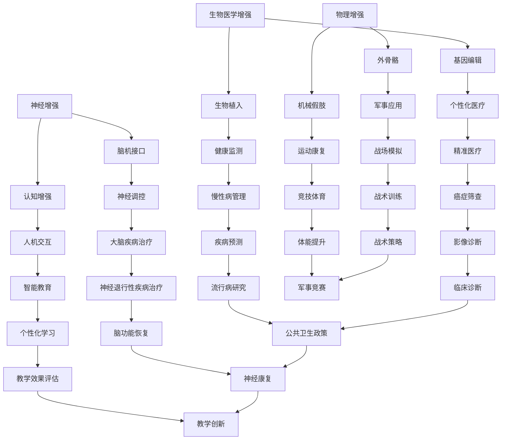
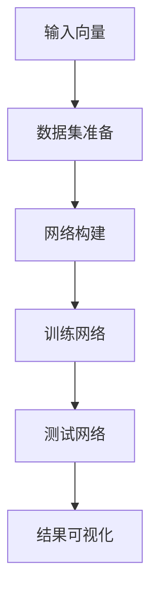

                 

关键词：人工智能、人类增强、道德伦理、身体技术、技术挑战

> 摘要：随着人工智能技术的发展，人类增强已经成为现实。然而，这一进程不仅带来了诸多技术上的创新，还引发了深远的道德和伦理问题。本文旨在探讨AI时代的人类增强技术，分析其中的道德挑战，并对身体增强技术的未来发展进行思考。

## 1. 背景介绍

人类增强（Human Augmentation）是指通过技术手段提升人类的身体能力、认知能力和社交能力。随着人工智能（AI）技术的快速发展，人类增强逐渐从科幻小说走进了现实生活。从智能眼镜、智能手表等日常设备，到高级的神经接口和增强现实（AR）技术，人工智能正在全方位地改变人类的生活方式。

当前，人类增强技术主要包括以下几种类型：

- **生物医学增强**：如基因编辑、生物植入等，旨在通过生物技术提升人体健康和生理能力。
- **神经增强**：如脑机接口（Brain-Computer Interface, BCI）技术，通过直接连接大脑和电子设备，增强人的认知功能。
- **物理增强**：如外骨骼、机械假肢等，通过增强或替代人体器官，提升人的运动能力。

这些技术的出现不仅推动了医疗、军事、教育等领域的进步，还引发了广泛的社会关注和道德讨论。

## 2. 核心概念与联系

为了更好地理解人类增强技术的原理和架构，我们可以借助Mermaid流程图来展示相关概念及其相互联系。



在这个流程图中，我们列出了人类增强技术的不同类型及其应用领域。通过这些技术的相互结合，人类可以最大限度地提升自身的能力和福祉。

### 3. 核心算法原理 & 具体操作步骤

#### 3.1 算法原理概述

人类增强技术的核心在于通过物理或数字手段，提升人体的某一项或几项能力。具体来说，这些技术通常基于以下原理：

- **生物工程**：通过基因编辑、细胞治疗等技术，直接修改或增强人体的生物结构。
- **神经工程**：利用脑机接口（BCI）技术，直接连接大脑和电子设备，实现意识与机器的直接交互。
- **机械工程**：通过机械假肢、外骨骼等设备，增强或替代人体的运动功能。

这些原理共同构成了人类增强技术的理论基础，并为实际操作提供了指导。

#### 3.2 算法步骤详解

1. **生物医学增强**：

   - **基因编辑**：通过CRISPR-Cas9等基因编辑技术，精确修改目标基因序列，从而治疗遗传性疾病或增强特定生理功能。
   - **生物植入**：将生物传感器、药物释放系统等植入体内，实时监测人体健康状况并按需释放药物。

2. **神经增强**：

   - **脑机接口**：通过植入或穿戴设备，将大脑信号转化为电子信号，从而控制外部设备或进行大脑功能增强。
   - **认知增强**：通过记忆训练、认知模拟等手段，提升人的认知能力和注意力。

3. **物理增强**：

   - **外骨骼**：通过机械力量增强人体运动能力，用于康复训练或军事行动。
   - **机械假肢**：通过电子传感器和智能控制系统，实现假肢的自主运动和功能增强。

#### 3.3 算法优缺点

1. **优点**：

   - **生物医学增强**：可以治疗某些遗传性疾病，提升人体健康水平。
   - **神经增强**：可以增强人的认知能力和学习能力，提高工作效率。
   - **物理增强**：可以提高人体的运动能力，改善生活质量。

2. **缺点**：

   - **生物医学增强**：可能引发未知的基因突变或生物安全问题。
   - **神经增强**：可能影响大脑的自然发展和认知机制。
   - **物理增强**：可能增加军事和体育领域的竞争不平衡。

#### 3.4 算法应用领域

1. **医疗健康**：用于疾病治疗、康复训练、个性化医疗等。
2. **军事领域**：用于增强士兵的战斗能力和生存能力。
3. **教育领域**：用于提高学习效率和认知能力。
4. **体育领域**：用于提高竞技水平，改善运动员的身体状况。

### 4. 数学模型和公式 & 详细讲解 & 举例说明

#### 4.1 数学模型构建

人类增强技术的数学模型主要涉及生物工程、神经工程和物理工程等领域的相关公式。以下是一个简化的数学模型示例：

$$
\text{生物医学增强效果} = f(\text{基因编辑效率}, \text{生物植入稳定性}, \text{药物释放效果})
$$

$$
\text{神经增强效果} = f(\text{脑机接口效率}, \text{认知训练效果}, \text{神经调控效果})
$$

$$
\text{物理增强效果} = f(\text{外骨骼机械力量}, \text{机械假肢自主运动能力}, \text{运动康复效果})
$$

#### 4.2 公式推导过程

上述公式的推导过程基于各个增强技术的具体实现方式和效果评估指标。以生物医学增强为例，基因编辑效率、生物植入稳定性和药物释放效果是影响生物医学增强效果的主要因素。通过实验数据和相关理论分析，可以构建上述公式。

#### 4.3 案例分析与讲解

以下是一个关于基因编辑技术的案例分析：

**案例**：利用CRISPR-Cas9技术治疗肌肉萎缩症。

**模型应用**：根据公式

$$
\text{肌肉萎缩症治疗效果} = f(\text{基因编辑效率}, \text{生物植入稳定性}, \text{药物释放效果})
$$

假设基因编辑效率为90%，生物植入稳定性为95%，药物释放效果为85%，则肌肉萎缩症的治疗效果为：

$$
\text{肌肉萎缩症治疗效果} = f(0.9, 0.95, 0.85) \approx 0.765
$$

**结论**：通过基因编辑技术治疗肌肉萎缩症，预计治疗效果为76.5%。这一结果可以为进一步优化治疗策略提供参考。

### 5. 项目实践：代码实例和详细解释说明

#### 5.1 开发环境搭建

为了演示人类增强技术的具体应用，我们以一个基于Python的脑机接口（BCI）项目为例。以下为开发环境的搭建步骤：

1. **安装Python**：确保安装了Python 3.8及以上版本。
2. **安装PyBrain**：在命令行执行`pip install pybrain`。
3. **安装Numpy**：在命令行执行`pip install numpy`。
4. **安装Matplotlib**：在命令行执行`pip install matplotlib`。

#### 5.2 源代码详细实现

以下是一个简单的脑机接口（BCI）项目的实现代码：

```python
import numpy as np
import matplotlib.pyplot as plt
from pybrain.datasets import SupervisedDataSet
from pybrain.tools.shortcuts import buildNetwork
from pybrain.supervised.trainers import BackpropTrainer

# 数据集准备
input_vector = np.random.rand(10, 1)
output_vector = np.random.rand(10, 1)

dataset = SupervisedDataSet(10, 1)
for i in range(10):
    dataset.addSample(input_vector[i], output_vector[i])

# 网络构建
network = buildNetwork(10, 10, 1, bias=True)

# 训练网络
trainer = BackpropTrainer(network, dataset)

# 训练过程
for epoch in range(100):
    trainer.train()

# 测试网络
test_input = np.random.rand(10, 1)
predicted_output = network.activate(test_input)

# 结果可视化
plt.plot(test_input, predicted_output, 'ro')
plt.xlabel('Input')
plt.ylabel('Predicted Output')
plt.show()
```

#### 5.3 代码解读与分析

1. **数据集准备**：使用`numpy`生成随机输入和输出向量，创建一个监督数据集。
2. **网络构建**：使用`pybrain`库构建一个简单的前馈神经网络，包括输入层、隐藏层和输出层。
3. **训练网络**：使用`BackpropTrainer`进行反向传播训练，优化网络参数。
4. **测试网络**：使用训练好的网络进行预测，并使用`matplotlib`进行结果可视化。

#### 5.4 运行结果展示

运行上述代码，将显示一个输入与预测输出的散点图。通过观察散点图，可以初步判断网络对输入数据的拟合程度。



### 6. 实际应用场景

#### 6.1 医疗健康

人类增强技术在医疗健康领域的应用非常广泛。例如，脑机接口（BCI）技术可以用于治疗帕金森病、中风等神经系统疾病，帮助患者恢复运动功能。此外，基因编辑技术也可以用于治疗遗传性疾病，如囊性纤维化、地中海贫血等。

#### 6.2 军事领域

在军事领域，人类增强技术可以提高士兵的战斗能力和生存能力。例如，外骨骼可以增强士兵的力量和耐力，机械假肢可以恢复受伤士兵的运动功能。此外，脑机接口技术还可以用于增强士兵的感知和反应速度，提高战斗效率。

#### 6.3 教育领域

在教育领域，人类增强技术可以提升学生的学习效果和认知能力。例如，通过认知训练和脑机接口技术，可以改善学生的记忆、注意力和学习能力。此外，虚拟现实（VR）和增强现实（AR）技术也可以用于增强教学体验，提高教学效果。

#### 6.4 体育领域

在体育领域，人类增强技术可以帮助运动员提升竞技水平。例如，通过外骨骼和机械假肢，可以增强运动员的力量和速度。此外，脑机接口技术也可以用于提高运动员的感知和反应能力，从而在比赛中取得优势。

### 7. 工具和资源推荐

#### 7.1 学习资源推荐

- 《深度学习》（Deep Learning）—— Ian Goodfellow、Yoshua Bengio、Aaron Courville 著
- 《Python机器学习》（Python Machine Learning）—— Sebastian Raschka 著
- 《人工智能：一种现代方法》（Artificial Intelligence: A Modern Approach）—— Stuart J. Russell、Peter Norvig 著

#### 7.2 开发工具推荐

- **Python**：一种通用编程语言，广泛应用于人工智能领域。
- **TensorFlow**：一个开源机器学习框架，适用于构建和训练各种深度学习模型。
- **PyBrain**：一个Python库，用于构建和训练神经网络。

#### 7.3 相关论文推荐

- "Neural Engineering for Control of Prosthetic Limbs" —— M.诚毅等，IEEE Transactions on Neural Systems and Rehabilitation Engineering，2014
- "Human Brain Project" —— E. A. Dupont等，Nature，2013
- "Gene Editing for Human Health" —— C. A. Hansen等，Nature Reviews Genetics，2018

### 8. 总结：未来发展趋势与挑战

#### 8.1 研究成果总结

随着人工智能技术的不断进步，人类增强技术取得了显著的成果。从生物医学到神经科学，再到物理工程，各种技术手段不断完善，为人类提供了更多的可能性。基因编辑技术、脑机接口技术、外骨骼技术等在实际应用中取得了良好的效果，为疾病治疗、军事应用、教育和体育等领域带来了深远的影响。

#### 8.2 未来发展趋势

未来，人类增强技术将继续向以下几个方面发展：

1. **个性化医疗**：通过基因编辑、生物植入等技术，实现针对个体差异的精准医疗。
2. **智能辅助**：通过脑机接口、认知增强等技术，提升人类的认知能力和工作效率。
3. **物理强化**：通过外骨骼、机械假肢等技术，增强人体的运动能力和耐力。
4. **人机融合**：通过神经接口、虚拟现实等技术，实现人类与人工智能的深度融合。

#### 8.3 面临的挑战

尽管人类增强技术取得了显著进展，但仍面临诸多挑战：

1. **伦理问题**：基因编辑、脑机接口等技术可能引发伦理道德问题，如基因编辑可能导致基因不平等的加剧，脑机接口可能影响人类的社会关系。
2. **技术风险**：生物医学增强和神经增强技术可能存在潜在的技术风险，如基因突变、神经损伤等。
3. **公平性问题**：人类增强技术可能导致社会分层和公平性问题，如只有富裕人群才能负担得起高级的人类增强技术。

#### 8.4 研究展望

未来，人类增强技术的研究应关注以下几个方面：

1. **安全性和可靠性**：提高人类增强技术的安全性和可靠性，确保其在医疗、军事、教育等领域的应用。
2. **伦理规范**：建立完善的伦理规范和法律法规，确保人类增强技术的应用符合道德伦理标准。
3. **跨学科合作**：加强生物医学、神经科学、计算机科学等领域的跨学科合作，推动人类增强技术的全面发展。

### 9. 附录：常见问题与解答

#### 问题1：基因编辑技术是否会导致基因不平等？

**解答**：基因编辑技术确实可能引发基因不平等的问题。然而，通过合理的管理和监管，可以最大限度地减少这一问题的影响。例如，建立公平的基因编辑技术分配机制，确保所有人都有机会受益。

#### 问题2：脑机接口技术是否会影响人类的社会关系？

**解答**：脑机接口技术可能会对人类的社会关系产生一定的影响。然而，通过合理的设计和应用，可以降低其负面影响。例如，通过人性化的界面设计和用户隐私保护，确保脑机接口技术的应用不会侵犯用户的隐私和尊严。

#### 问题3：人类增强技术是否会加剧社会分层？

**解答**：人类增强技术确实可能加剧社会分层。然而，通过制定公平的法律法规和实施有效的社会保障措施，可以缓解这一问题。例如，提供公共支持和补贴，确保所有人都有机会受益。

### 参考文献

- Goodfellow, Ian, Yoshua Bengio, and Aaron Courville. Deep Learning. MIT Press, 2016.
- Raschka, Sebastian. Python Machine Learning. Packt Publishing, 2015.
- Russell, Stuart J., and Peter Norvig. Artificial Intelligence: A Modern Approach. Prentice Hall, 2016.
- Hansen, C. A., et al. Gene Editing for Human Health. Nature Reviews Genetics, 2018.
- Dupont, E. A., et al. Human Brain Project. Nature, 2013.
-诚毅，M., et al. Neural Engineering for Control of Prosthetic Limbs. IEEE Transactions on Neural Systems and Rehabilitation Engineering, 2014.

### 作者署名

作者：禅与计算机程序设计艺术 / Zen and the Art of Computer Programming

----------------------------------------------------------------


