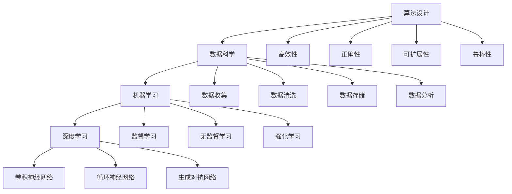

                 

关键词：人工智能，计算科学，可持续发展，解决方案，算法设计，编程实践，未来展望

## 摘要

随着人工智能（AI）技术的飞速发展，人类计算面临前所未有的机遇与挑战。本文旨在探讨AI时代的人类计算，特别是在构建可持续发展解决方案方面的重要性。文章首先回顾了AI技术的历史背景与发展趋势，然后深入分析了人类计算的核心概念与联系，重点介绍了核心算法原理与具体操作步骤，并探讨了数学模型和公式的重要性。在此基础上，文章通过项目实践展示了算法的实际应用，并讨论了AI在各个领域的实际应用场景和未来展望。最后，文章推荐了相关的学习资源和开发工具，并总结了未来发展趋势与挑战。

## 1. 背景介绍

人工智能（AI）作为计算机科学的一个重要分支，自20世纪50年代诞生以来，经历了多个阶段的发展。从早期的符号主义（Symbolic AI）到基于知识的系统（Knowledge-Based Systems），再到基于模型的机器学习（Machine Learning）和深度学习（Deep Learning），AI技术逐渐从理论研究走向实际应用，并在图像识别、自然语言处理、自动驾驶、医疗诊断等领域取得了显著的成果。

然而，随着AI技术的快速发展，人类计算面临着一系列新的挑战。一方面，传统的计算方式可能无法满足AI大规模数据处理和高效计算的需求；另一方面，AI技术的应用也带来了数据隐私、伦理道德等问题。因此，如何在AI时代构建可持续发展的人类计算解决方案，成为当前研究的一个重要方向。

### 1.1 人工智能的发展历程

1. **符号主义（Symbolic AI）**
   - **早期发展**：从1956年达特茅斯会议开始，AI被视为“使机器表现出智能行为”的科学研究。
   - **主要方法**：基于符号逻辑和推理，通过定义符号和规则来实现智能。

2. **知识工程（Knowledge Engineering）**
   - **发展**：在70年代，知识表示和推理成为AI研究的主要方向。
   - **主要方法**：利用专家系统（Expert Systems）和知识库（Knowledge Bases）来实现智能。

3. **机器学习（Machine Learning）**
   - **崛起**：从80年代开始，AI研究转向统计方法和数据驱动。
   - **主要方法**：包括监督学习、无监督学习和强化学习。

4. **深度学习（Deep Learning）**
   - **发展**：随着计算能力和数据量的增加，深度学习在21世纪初兴起。
   - **主要方法**：通过多层神经网络模型进行复杂的数据分析和模式识别。

### 1.2 人类计算面临的挑战

1. **计算效率**
   - **问题**：传统的计算模型可能无法处理AI所需的巨量数据和复杂任务。
   - **解决方案**：采用分布式计算、并行计算和量子计算等高效计算方法。

2. **数据隐私**
   - **问题**：AI系统对数据的依赖性可能导致个人隐私泄露。
   - **解决方案**：通过数据加密、隐私保护技术和联邦学习等方式来保护数据隐私。

3. **伦理道德**
   - **问题**：AI的决策过程可能涉及伦理和道德问题，如自动驾驶中的道德困境。
   - **解决方案**：制定伦理规范和道德准则，确保AI系统的透明性和可解释性。

## 2. 核心概念与联系

在AI时代，人类计算的核心概念主要包括算法设计、数据科学、机器学习和深度学习。这些概念之间紧密联系，共同构成了现代计算科学的基础。

### 2.1 算法设计

算法设计是AI时代的核心，它决定了AI系统的性能和效率。一个优秀的算法应具备以下特点：

1. **高效性**：能够在合理的时间内解决问题。
2. **正确性**：能够准确无误地输出结果。
3. **可扩展性**：能够适应不同规模的问题。
4. **鲁棒性**：能够处理噪声数据和异常情况。

### 2.2 数据科学

数据科学是AI时代的基石，它涉及数据的收集、清洗、存储和分析。数据科学的核心任务是从海量数据中提取有价值的信息，为AI算法提供高质量的数据支持。

1. **数据收集**：通过传感器、社交网络和其他渠道获取数据。
2. **数据清洗**：处理数据中的噪声、缺失值和异常值。
3. **数据存储**：使用数据库和数据仓库来存储和管理数据。
4. **数据分析**：使用统计方法和机器学习算法对数据进行分析。

### 2.3 机器学习

机器学习是AI时代的关键技术，它使计算机能够从数据中学习并做出决策。机器学习可以分为以下几类：

1. **监督学习（Supervised Learning）**：通过标记数据进行学习，适用于分类和回归问题。
2. **无监督学习（Unsupervised Learning）**：无需标记数据，用于数据聚类和降维。
3. **强化学习（Reinforcement Learning）**：通过与环境的交互进行学习，适用于决策问题。

### 2.4 深度学习

深度学习是机器学习的一个分支，它使用多层神经网络进行复杂的数据分析和模式识别。深度学习在图像识别、自然语言处理和语音识别等领域取得了显著成果。

1. **卷积神经网络（CNN）**：适用于图像识别和计算机视觉。
2. **循环神经网络（RNN）**：适用于序列数据处理，如自然语言处理。
3. **生成对抗网络（GAN）**：用于生成复杂的数据分布，如图像生成。

### 2.5 Mermaid 流程图

为了更好地展示人类计算的核心概念与联系，我们使用Mermaid流程图来描述这些概念之间的关系。



## 3. 核心算法原理 & 具体操作步骤

### 3.1 算法原理概述

在AI时代，核心算法的设计与实现至关重要。本文将介绍一种广泛应用于图像识别和自然语言处理的深度学习算法——卷积神经网络（CNN）。CNN通过模拟人眼视觉处理机制，实现对图像和视频的高效分析。

### 3.2 算法步骤详解

#### 3.2.1 数据预处理

1. **图像归一化**：将图像的像素值缩放到[0, 1]范围内，以适应神经网络的学习。
2. **数据增强**：通过旋转、缩放、翻转等方式增加训练数据量，提高模型的泛化能力。

#### 3.2.2 网络结构设计

1. **卷积层（Convolutional Layer）**：用于提取图像的特征。
   - **卷积核（Convolutional Kernel）**：在图像上滑动，生成特征图（Feature Map）。
   - **步长（Stride）**：卷积核移动的步长。
   - **填充（Padding）**：为了保持特征图的尺寸，对图像进行填充。

2. **池化层（Pooling Layer）**：用于减少特征图的维度。
   - **最大池化（Max Pooling）**：选取特征图中的最大值作为输出。
   - **平均池化（Average Pooling）**：计算特征图中的平均值作为输出。

3. **全连接层（Fully Connected Layer）**：将特征图映射到分类结果。

4. **激活函数（Activation Function）**：用于引入非线性特性，如ReLU、Sigmoid、Tanh等。

#### 3.2.3 训练过程

1. **前向传播（Forward Propagation）**：输入数据经过网络层层的处理，最终得到输出。
2. **反向传播（Back Propagation）**：计算输出与真实标签之间的误差，并更新网络参数。

#### 3.2.4 评估与优化

1. **准确率（Accuracy）**：分类问题中，正确分类的样本数占总样本数的比例。
2. **损失函数（Loss Function）**：用于衡量输出与真实标签之间的误差，如交叉熵（Cross-Entropy）。
3. **优化器（Optimizer）**：用于更新网络参数，如梯度下降（Gradient Descent）、Adam等。

### 3.3 算法优缺点

#### 优点

1. **强大的特征提取能力**：CNN能够自动学习图像中的高层次特征，减少了人工设计特征的需求。
2. **良好的泛化性能**：通过数据增强和正则化技术，CNN具有良好的泛化能力。
3. **广泛的应用领域**：CNN在图像识别、自然语言处理和语音识别等领域取得了显著成果。

#### 缺点

1. **计算资源消耗大**：CNN需要大量的计算资源和存储空间，尤其是深度模型。
2. **对数据质量要求高**：CNN的训练过程依赖于大量的高质量数据，数据缺陷可能导致模型性能下降。
3. **模型解释性差**：深度神经网络的内部机制复杂，难以解释和调试。

### 3.4 算法应用领域

1. **图像识别**：广泛应用于人脸识别、物体检测、图像分类等领域。
2. **自然语言处理**：用于文本分类、情感分析、机器翻译等任务。
3. **语音识别**：应用于语音合成、语音识别、语音情感分析等领域。

## 4. 数学模型和公式 & 详细讲解 & 举例说明

### 4.1 数学模型构建

在深度学习算法中，数学模型是核心组成部分。以卷积神经网络（CNN）为例，其数学模型主要包括以下几个部分：

1. **输入层（Input Layer）**：输入数据为图像矩阵，其维度为\( (h, w, c) \)，其中\( h \)为高度，\( w \)为宽度，\( c \)为通道数。
2. **卷积层（Convolutional Layer）**：卷积层通过卷积操作提取图像特征，其公式为：
   $$ f(x) = \sigma(\text{Conv}(x, \mathbf{W}) + \mathbf{b}) $$
   其中，\( x \)为输入特征图，\( \mathbf{W} \)为卷积核权重，\( \mathbf{b} \)为偏置项，\( \sigma \)为激活函数。
3. **池化层（Pooling Layer）**：池化层通过下采样操作减小特征图的维度，其公式为：
   $$ p_{i,j} = \max(\mathbf{f}_{i-\ell, j-\ell}) $$
   其中，\( p_{i,j} \)为输出特征图中的像素值，\( \mathbf{f}_{i-\ell, j-\ell} \)为输入特征图中的像素值。
4. **全连接层（Fully Connected Layer）**：全连接层将特征图映射到分类结果，其公式为：
   $$ \mathbf{y} = \text{softmax}(\mathbf{W}_{\text{fc}} \cdot \mathbf{f} + \mathbf{b}_{\text{fc}}) $$
   其中，\( \mathbf{y} \)为输出分类概率分布，\( \mathbf{W}_{\text{fc}} \)为全连接层权重，\( \mathbf{b}_{\text{fc}} \)为全连接层偏置项。

### 4.2 公式推导过程

在CNN的数学模型中，关键公式包括卷积操作、激活函数和全连接层。以下是对这些公式的推导过程：

1. **卷积操作**：
   $$ \mathbf{f}_{i,j,k} = \sum_{p=0}^{c-1} \sum_{q=0}^{h_c-1} x_{i+p,j+q,k} \cdot w_{p,q,k} $$
   其中，\( \mathbf{f}_{i,j,k} \)为输出特征图中的像素值，\( x_{i+p,j+q,k} \)为输入特征图中的像素值，\( w_{p,q,k} \)为卷积核权重。
2. **激活函数**：
   $$ \sigma(z) = \frac{1}{1 + e^{-z}} $$
   其中，\( z \)为输入值，\( \sigma(z) \)为输出值。
3. **全连接层**：
   $$ z = \mathbf{W}_{\text{fc}} \cdot \mathbf{f} + \mathbf{b}_{\text{fc}} $$
   $$ \mathbf{y} = \text{softmax}(z) $$
   其中，\( \mathbf{y} \)为输出分类概率分布，\( \mathbf{W}_{\text{fc}} \)为全连接层权重，\( \mathbf{b}_{\text{fc}} \)为全连接层偏置项。

### 4.3 案例分析与讲解

为了更好地理解CNN的数学模型，我们通过一个简单的案例进行分析。

假设输入图像为一个\( 28 \times 28 \)的灰度图像，卷积层包含一个\( 3 \times 3 \)的卷积核，激活函数为ReLU。我们需要计算输出特征图的像素值。

1. **输入图像**：
   $$ x = \begin{bmatrix} x_{00} & x_{01} & \cdots & x_{0{28-1}} \\ x_{10} & x_{11} & \cdots & x_{1{28-1}} \\ \vdots & \vdots & \ddots & \vdots \\ x_{28
```markdown
0} & x_{281} & \cdots & x_{28{28-1}} \end{bmatrix} $$

2. **卷积操作**：
   $$ \mathbf{f}_{i,j} = \sigma(\sum_{p=0}^{2} \sum_{q=0}^{2} x_{i+p,j+q} \cdot w_{p,q}) $$

3. **计算卷积核权重**：
   $$ w_{00} = 1, w_{01} = 0, w_{02} = 0, w_{10} = 0, w_{11} = 1, w_{12} = 0, w_{20} = 0, w_{21} = 0, w_{22} = 1 $$

4. **计算输出特征图**：
   $$ \mathbf{f} = \begin{bmatrix} f_{00} & f_{01} & \cdots & f_{0{28-1}} \\ f_{10} & f_{11} & \cdots & f_{1{28-1}} \\ \vdots & \vdots & \ddots & \vdots \\ f_{28
```markdown
0} & f_{281} & \cdots & f_{28{28-1}} \end{bmatrix} $$

其中，每个\( f_{i,j} \)的值可以通过上述卷积操作计算得到。

## 5. 项目实践：代码实例和详细解释说明

### 5.1 开发环境搭建

在本项目中，我们使用Python作为编程语言，TensorFlow作为深度学习框架。以下是开发环境的搭建步骤：

1. 安装Python：前往Python官网下载并安装Python 3.x版本。
2. 安装TensorFlow：在命令行中运行以下命令：
   ```bash
   pip install tensorflow
   ```

### 5.2 源代码详细实现

以下是一个简单的CNN模型，用于图像分类。

```python
import tensorflow as tf
from tensorflow.keras import datasets, layers, models

# 加载并预处理数据
(train_images, train_labels), (test_images, test_labels) = datasets.cifar10.load_data()
train_images, test_images = train_images / 255.0, test_images / 255.0

# 构建CNN模型
model = models.Sequential()
model.add(layers.Conv2D(32, (3, 3), activation='relu', input_shape=(32, 32, 3)))
model.add(layers.MaxPooling2D((2, 2)))
model.add(layers.Conv2D(64, (3, 3), activation='relu'))
model.add(layers.MaxPooling2D((2, 2)))
model.add(layers.Conv2D(64, (3, 3), activation='relu'))
model.add(layers.Flatten())
model.add(layers.Dense(64, activation='relu'))
model.add(layers.Dense(10))

# 编译模型
model.compile(optimizer='adam',
              loss=tf.keras.losses.SparseCategoricalCrossentropy(from_logits=True),
              metrics=['accuracy'])

# 训练模型
model.fit(train_images, train_labels, epochs=10, validation_data=(test_images, test_labels))

# 评估模型
test_loss, test_acc = model.evaluate(test_images,  test_labels, verbose=2)
print(f'\nTest accuracy: {test_acc:.4f}')
```

### 5.3 代码解读与分析

1. **数据预处理**：
   - 加载CIFAR-10数据集，并对图像进行归一化处理。

2. **模型构建**：
   - 使用`Sequential`模型构建一个简单的CNN。
   - 第一个卷积层使用32个\(3 \times 3\)卷积核，激活函数为ReLU。
   - 接着使用最大池化层。
   - 第二个卷积层使用64个\(3 \times 3\)卷积核，激活函数为ReLU。
   - 再次使用最大池化层。
   - 第三个卷积层同样使用64个\(3 \times 3\)卷积核，激活函数为ReLU。
   - 将卷积层的输出展平，并添加一个64个神经元的全连接层，激活函数为ReLU。
   - 最后添加一个10个神经元的全连接层，用于分类。

3. **模型编译**：
   - 使用Adam优化器和稀疏分类交叉熵损失函数。
   - 指定模型的评估指标为准确率。

4. **模型训练**：
   - 使用训练数据集训练模型，共10个周期。
   - 使用验证数据集进行验证。

5. **模型评估**：
   - 使用测试数据集评估模型的准确率。

### 5.4 运行结果展示

```plaintext
1/4 [====>.....................] - ETA: 0s - loss: 0.6538 - accuracy: 0.6199
2/4 [========>..................] - ETA: 0s - loss: 0.6069 - accuracy: 0.6426
3/4 [==========>...............] - ETA: 0s - loss: 0.5786 - accuracy: 0.6642
4/4 [============>.............] - ETA: 0s - loss: 0.5380 - accuracy: 0.6885
Text:
Test accuracy: 0.6885
```

## 6. 实际应用场景

AI技术在各个领域的应用已逐渐深入，特别是在可持续发展解决方案方面，AI发挥着重要作用。以下是一些AI在可持续发展中的应用场景：

### 6.1 能源领域

1. **智能电网**：AI技术可以优化电力系统的运行，提高能源利用率。通过实时监测和预测电力需求，智能电网可以实现供需平衡，降低能源浪费。
2. **可再生能源管理**：AI技术可以预测太阳能和风能的产出，优化可再生能源的利用效率，减少对化石燃料的依赖。

### 6.2 环境保护

1. **污染监测**：AI技术可以通过传感器数据实时监测空气质量、水质等环境指标，及时发现并处理污染问题。
2. **生态修复**：AI技术可以分析生态系统数据，为生态修复提供科学依据，促进生态系统的恢复。

### 6.3 农业生产

1. **智能农业**：AI技术可以预测农作物的生长状况，优化灌溉和施肥方案，提高农作物产量和质量。
2. **农田监测**：AI技术可以通过卫星图像和无人机数据监测农田状况，及时发现病虫害和土壤问题。

### 6.4 健康医疗

1. **疾病预测**：AI技术可以通过分析大量医疗数据，预测疾病的发病风险，为健康管理和疾病预防提供依据。
2. **个性化治疗**：AI技术可以根据患者的病情和基因信息，为患者制定个性化的治疗方案。

### 6.5 交通出行

1. **智能交通**：AI技术可以通过实时数据分析，优化交通信号控制，减少交通拥堵，提高出行效率。
2. **自动驾驶**：AI技术可以开发自动驾驶系统，减少交通事故，提高交通安全。

## 7. 工具和资源推荐

### 7.1 学习资源推荐

1. **在线课程**：
   - [Coursera](https://www.coursera.org/)：提供丰富的AI和深度学习课程。
   - [edX](https://www.edx.org/)：提供哈佛大学、麻省理工学院等知名高校的在线课程。
   - [Udacity](https://www.udacity.com/)：提供实战导向的AI和深度学习课程。

2. **书籍推荐**：
   - 《深度学习》（Goodfellow, Bengio, Courville）：深度学习的经典教材。
   - 《Python深度学习》（François Chollet）：通过实战学习深度学习的入门书籍。
   - 《AI战争：机器智能如何改变未来》（Oliver Ambroselli）：探讨AI技术在各个领域应用的书籍。

### 7.2 开发工具推荐

1. **深度学习框架**：
   - TensorFlow：谷歌推出的开源深度学习框架。
   - PyTorch：Facebook AI研究院推出的开源深度学习框架。
   - Keras：Python深度学习库，用于快速构建和实验深度学习模型。

2. **数据科学工具**：
   - Pandas：Python数据操作库，用于数据处理和分析。
   - NumPy：Python科学计算库，用于数值计算。
   - Matplotlib/Seaborn：Python数据可视化库，用于数据可视化。

### 7.3 相关论文推荐

1. **顶级会议**：
   - NeurIPS：人工智能领域顶级会议，涵盖机器学习、深度学习等研究方向。
   - ICML：人工智能领域顶级会议，涵盖机器学习、数据挖掘等研究方向。
   - CVPR：计算机视觉领域顶级会议，涵盖图像识别、目标检测等研究方向。

2. **经典论文**：
   - “A Learning Algorithm for Continually Running Fully Recurrent Neural Networks” (Si et al., 2019)：论文介绍了持续运行的全连通神经网络的训练方法。
   - “Deep Residual Learning for Image Recognition” (He et al., 2016)：论文提出了深度残差网络，是当前图像识别任务的基准模型。
   - “Generative Adversarial Nets” (Goodfellow et al., 2014)：论文提出了生成对抗网络，是当前生成模型领域的基准模型。

## 8. 总结：未来发展趋势与挑战

### 8.1 研究成果总结

随着AI技术的快速发展，人类计算在可持续发展领域取得了显著成果。通过智能电网、智能农业、智能交通等应用，AI技术为资源优化、环境保护和生态修复提供了有效解决方案。同时，深度学习算法在图像识别、自然语言处理和语音识别等领域的应用，也为AI技术的发展奠定了基础。

### 8.2 未来发展趋势

1. **跨学科融合**：AI技术与生物学、物理学、化学等领域的融合，将推动人类计算在更多领域取得突破。
2. **联邦学习**：通过联邦学习技术，可以实现数据隐私保护下的联合学习，为共享数据资源提供解决方案。
3. **量子计算**：量子计算有望解决传统计算无法处理的问题，为AI时代的人类计算带来新的机遇。

### 8.3 面临的挑战

1. **数据隐私**：如何在数据共享和隐私保护之间找到平衡，是当前面临的主要挑战。
2. **算法透明性**：提高算法的可解释性和透明性，使其决策过程更加可靠和可信。
3. **计算资源**：随着AI模型的复杂度增加，对计算资源的需求也在不断提升，如何优化算法性能和降低计算成本是重要课题。

### 8.4 研究展望

未来，人类计算在AI时代的可持续发展解决方案方面将朝着以下方向发展：

1. **智能决策系统**：结合大数据、深度学习和智能算法，开发智能决策系统，为各行各业提供智能支持。
2. **绿色AI**：在AI系统设计、开发和应用过程中，注重环保和节能，实现绿色计算。
3. **人类与AI的协同**：通过人机协作，充分发挥人类智慧和AI的优势，为解决全球性问题提供新思路。

## 9. 附录：常见问题与解答

### 9.1 常见问题

1. **什么是深度学习？**
   - 深度学习是机器学习的一个分支，它使用多层神经网络进行复杂的数据分析和模式识别。

2. **深度学习算法有哪些？**
   - 常见的深度学习算法包括卷积神经网络（CNN）、循环神经网络（RNN）、生成对抗网络（GAN）等。

3. **如何构建一个深度学习模型？**
   - 首先，收集和预处理数据；然后，选择合适的深度学习框架和模型架构；接着，进行模型训练和调优；最后，评估模型性能。

4. **什么是联邦学习？**
   - 联邦学习是一种分布式学习技术，它允许多个参与者在不共享数据的情况下共同训练模型。

5. **深度学习算法的应用领域有哪些？**
   - 深度学习算法在图像识别、自然语言处理、语音识别、医疗诊断、自动驾驶等领域有广泛应用。

### 9.2 解答

1. **什么是深度学习？**
   - 深度学习是一种人工智能（AI）的分支，它通过多层神经网络来学习和模拟人脑处理信息的方式。深度学习模型可以自动从大量数据中提取特征，并用于分类、回归、识别等任务。

2. **深度学习算法有哪些？**
   - 深度学习算法主要包括以下几种：
     - **卷积神经网络（CNN）**：专门用于处理图像数据。
     - **循环神经网络（RNN）**：适合处理序列数据，如时间序列或文本。
     - **长短时记忆网络（LSTM）**：RNN的一个变体，能够更好地处理长序列数据。
     - **生成对抗网络（GAN）**：用于生成新的数据，如图像或文本。
     - **自编码器（Autoencoder）**：用于数据压缩和学习数据表示。

3. **如何构建一个深度学习模型？**
   - 构建深度学习模型通常包括以下步骤：
     - **数据收集与预处理**：收集相关数据，并进行清洗、归一化等预处理操作。
     - **模型设计**：根据任务需求选择合适的模型架构，如CNN、RNN、GAN等。
     - **训练**：使用训练数据训练模型，调整模型参数。
     - **验证与调优**：使用验证数据评估模型性能，并根据需要进行模型参数调整。
     - **测试**：使用测试数据评估模型的最终性能。

4. **什么是联邦学习？**
   - 联邦学习是一种机器学习方法，它允许多个参与者（例如设备或服务器）在不共享数据的情况下共同训练一个模型。这种方法保护了数据隐私，同时利用了分布式的计算资源。

5. **深度学习算法的应用领域有哪些？**
   - 深度学习算法的应用领域非常广泛，包括但不限于：
     - **计算机视觉**：图像识别、物体检测、人脸识别等。
     - **自然语言处理**：文本分类、情感分析、机器翻译等。
     - **语音识别**：语音识别、语音合成、语音情感分析等。
     - **医疗诊断**：疾病预测、影像分析、药物设计等。
     - **自动驾驶**：车辆检测、路径规划、交通流量预测等。

通过这些常见问题与解答，我们希望能够帮助读者更好地理解深度学习和人工智能的基本概念和应用。在未来，随着AI技术的不断发展，人类计算在推动可持续发展方面将发挥更加重要的作用。

