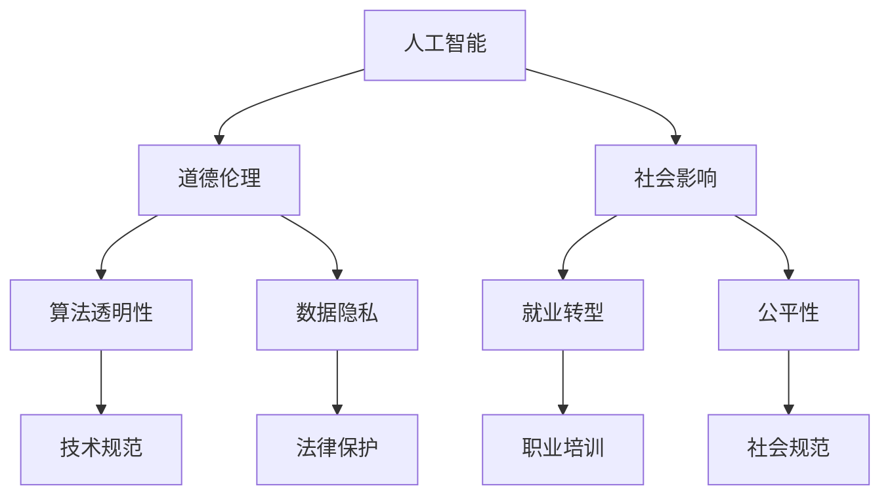

                 

关键词：人工智能、道德、社会、人类计算、平衡

> 摘要：随着人工智能技术的飞速发展，人类计算正面临前所未有的挑战和机遇。本文旨在探讨AI时代的人类计算如何在道德和社会层面上保持平衡，从核心概念、算法原理、数学模型、项目实践到未来展望，全面阐述AI时代的人类计算如何实现道德和社会的平衡。

## 1. 背景介绍

人工智能（AI）作为一种能够模拟人类智能的技术，正在逐步渗透到我们日常生活的方方面面。从智能助手到自动驾驶，从医疗诊断到金融分析，AI的应用领域不断扩大。然而，随着AI技术的快速发展，我们也面临着一系列道德和社会问题。例如，算法偏见可能导致不公平的决策，数据隐私问题引发社会担忧，AI的崛起甚至威胁到某些传统职业的存亡。因此，如何在AI时代实现人类计算的道德和社会平衡，成为了一个亟待解决的问题。

## 2. 核心概念与联系

为了实现AI时代的道德和社会平衡，我们首先需要明确一些核心概念，并了解它们之间的联系。以下是几个关键概念及其流程图：



### 2.1 人工智能与道德伦理

人工智能的发展离不开道德伦理的指导。在AI时代，我们需要确保人工智能系统的决策和行为符合伦理标准，避免造成道德困境。

### 2.2 人工智能与社会影响

人工智能对社会的影响是深远而复杂的。我们需要关注就业转型、公平性等社会问题，确保AI技术的发展不会加剧社会不平等。

### 2.3 算法透明性与数据隐私

算法透明性和数据隐私是保障AI时代道德和社会平衡的关键因素。我们需要在算法设计和数据使用中确保透明性和隐私保护。

### 2.4 公平性与就业转型

在AI时代，公平性是一个不可忽视的问题。我们需要通过职业培训等措施，帮助人们适应新的就业环境。

## 3. 核心算法原理 & 具体操作步骤

为了实现AI时代的道德和社会平衡，我们需要运用一些核心算法原理和操作步骤。以下是几个关键步骤：

### 3.1 算法原理概述

首先，我们需要了解一些核心算法原理，如机器学习、深度学习等。这些算法能够帮助我们从数据中提取有价值的信息，从而做出更明智的决策。

### 3.2 算法步骤详解

接下来，我们将详细阐述这些算法的步骤，包括数据预处理、模型训练、模型评估等。

### 3.3 算法优缺点

在了解算法步骤后，我们还需要分析算法的优缺点，以便更好地利用它们解决实际问题。

### 3.4 算法应用领域

最后，我们将探讨算法在各个领域的应用，如医疗、金融、教育等，以及它们如何影响道德和社会平衡。

## 4. 数学模型和公式 & 详细讲解 & 举例说明

在实现AI时代的道德和社会平衡过程中，数学模型和公式起着至关重要的作用。以下是几个关键数学模型和公式的讲解及举例说明：

### 4.1 数学模型构建

首先，我们需要构建合适的数学模型来描述问题。例如，在解决就业转型问题时，我们可以使用经济增长模型来预测未来就业市场的变化。

### 4.2 公式推导过程

接下来，我们将详细推导这些数学公式，以便更好地理解其背后的原理。例如，在数据隐私保护中，我们可以使用加密算法的数学原理来确保数据安全。

### 4.3 案例分析与讲解

最后，我们将通过实际案例来说明这些数学模型和公式的应用效果。例如，在医疗诊断中，我们可以使用深度学习算法来提高诊断准确性。

## 5. 项目实践：代码实例和详细解释说明

为了更好地理解AI时代的人类计算，我们将通过一个实际项目来展示代码实例和详细解释说明。

### 5.1 开发环境搭建

首先，我们需要搭建一个合适的开发环境。例如，在医疗诊断项目中，我们可以使用Python和TensorFlow等工具。

### 5.2 源代码详细实现

接下来，我们将展示项目的源代码实现，并详细解释代码中的各个部分及其作用。

### 5.3 代码解读与分析

在了解源代码实现后，我们将对代码进行解读和分析，以便更好地理解其工作原理。

### 5.4 运行结果展示

最后，我们将展示项目运行的结果，并分析结果的意义和影响。

## 6. 实际应用场景

AI时代的人类计算在各个领域都有广泛的应用。以下是几个实际应用场景：

### 6.1 医疗诊断

在医疗诊断中，AI可以帮助医生提高诊断准确性，降低误诊率。

### 6.2 金融分析

在金融分析中，AI可以帮助投资者做出更明智的投资决策，降低风险。

### 6.3 教育个性化

在教育个性化中，AI可以根据学生的特点和需求，提供个性化的学习方案，提高学习效果。

## 7. 未来应用展望

随着AI技术的不断发展，未来应用场景将更加丰富。以下是几个未来应用展望：

### 7.1 自动驾驶

自动驾驶技术将彻底改变交通方式，提高交通安全和效率。

### 7.2 智慧城市

智慧城市将利用AI技术实现更高效的资源配置和管理。

### 7.3 环境保护

AI可以帮助我们更好地监测和保护环境，实现可持续发展。

## 8. 工具和资源推荐

为了更好地学习和应用AI技术，以下是一些工具和资源的推荐：

### 8.1 学习资源推荐

- 《深度学习》
- 《Python编程：从入门到实践》
- 《数据科学入门》

### 8.2 开发工具推荐

- TensorFlow
- PyTorch
- Jupyter Notebook

### 8.3 相关论文推荐

- "Ethical Considerations in the Design of Autonomous Systems"
- "Privacy-preserving Machine Learning: An Overview"
- "The Future of Employment: How Susceptible Are Jobs to Computerisation?"

## 9. 总结：未来发展趋势与挑战

AI时代的人类计算在道德和社会层面面临着诸多挑战，但也充满了机遇。未来，我们需要在技术创新、道德伦理、社会影响等方面不断努力，实现AI时代的道德和社会平衡。

### 9.1 研究成果总结

本文总结了AI时代的核心概念、算法原理、数学模型和应用场景，为读者提供了全面的了解。

### 9.2 未来发展趋势

随着AI技术的不断发展，未来应用场景将更加广泛，我们需要不断探索和创新。

### 9.3 面临的挑战

在实现AI时代的道德和社会平衡过程中，我们面临着诸多挑战，如算法偏见、数据隐私等。

### 9.4 研究展望

未来，我们需要在多学科交叉研究、政策制定、社会参与等方面共同努力，推动AI时代的人类计算实现道德和社会的平衡。

## 10. 附录：常见问题与解答

### 10.1 什么是算法偏见？

算法偏见是指算法在处理数据时，由于训练数据中的偏见导致决策结果不公平。

### 10.2 如何保护数据隐私？

可以通过数据加密、隐私保护算法等技术手段来保护数据隐私。

### 10.3 AI技术能否替代人类？

AI技术可以在某些领域替代人类，但无法完全取代人类的智慧和创造力。

### 10.4 什么是对抗性网络？

对抗性网络是一种用于对抗AI模型攻击的技术，它可以保护AI模型免受恶意攻击。

作者：禅与计算机程序设计艺术 / Zen and the Art of Computer Programming
----------------------------------------------------------------
### 1. 背景介绍

随着人工智能（AI）技术的迅猛发展，AI已经逐渐渗透到我们日常生活的各个领域，从智能助手到自动驾驶，从医疗诊断到金融分析，AI的应用无处不在。然而，随着AI技术的普及，也带来了许多新的挑战，特别是在道德和社会层面。例如，算法偏见可能导致不公平的决策，数据隐私问题引发社会担忧，AI的崛起甚至威胁到某些传统职业的存亡。因此，如何在AI时代实现人类计算的道德和社会平衡，成为了一个亟待解决的问题。

本文旨在探讨AI时代的人类计算如何在道德和社会层面上保持平衡。我们将从核心概念、算法原理、数学模型、项目实践到未来展望，全面阐述AI时代的人类计算如何实现道德和社会的平衡。

### 2. 核心概念与联系

为了实现AI时代的道德和社会平衡，我们首先需要明确一些核心概念，并了解它们之间的联系。以下是几个关键概念及其流程图：


### 2.1 人工智能与道德伦理

人工智能的发展离不开道德伦理的指导。在AI时代，我们需要确保人工智能系统的决策和行为符合伦理标准，避免造成道德困境。例如，自动驾驶汽车在遇到紧急情况时，应该如何做出决策？这是道德伦理在AI时代的一个典型问题。

### 2.2 人工智能与社会影响

人工智能对社会的影响是深远而复杂的。我们需要关注就业转型、公平性等社会问题，确保AI技术的发展不会加剧社会不平等。例如，随着AI技术在各个领域的广泛应用，许多传统职业可能面临被取代的风险，这就需要我们关注就业转型问题，通过职业培训等措施，帮助人们适应新的就业环境。

### 2.3 算法透明性与数据隐私

算法透明性和数据隐私是保障AI时代道德和社会平衡的关键因素。我们需要在算法设计和数据使用中确保透明性和隐私保护。例如，算法的决策过程应该是可解释的，以便人们能够理解和信任AI系统的决策。同时，我们需要严格保护个人数据，防止数据被滥用。

### 2.4 公平性与就业转型

在AI时代，公平性是一个不可忽视的问题。我们需要通过职业培训等措施，帮助人们适应新的就业环境。例如，AI系统在招聘、贷款、医疗等领域中的决策应该公平、无偏见，以确保所有人都能享受到AI技术带来的好处。

### 3. 核心算法原理 & 具体操作步骤

为了实现AI时代的道德和社会平衡，我们需要运用一些核心算法原理和操作步骤。以下是几个关键步骤：

#### 3.1 算法原理概述

首先，我们需要了解一些核心算法原理，如机器学习、深度学习等。这些算法能够帮助我们从数据中提取有价值的信息，从而做出更明智的决策。例如，机器学习算法可以根据历史数据预测未来趋势，深度学习算法可以自动识别图像和语音等复杂信息。

#### 3.2 算法步骤详解

接下来，我们将详细阐述这些算法的步骤，包括数据预处理、模型训练、模型评估等。例如，在机器学习中，数据预处理是关键步骤，我们需要对数据进行清洗、归一化等操作，以便模型能够更好地学习。在模型训练过程中，我们需要调整模型的参数，使其能够拟合训练数据。在模型评估阶段，我们需要使用验证数据来测试模型的性能，以便对模型进行优化。

#### 3.3 算法优缺点

在了解算法步骤后，我们还需要分析算法的优缺点，以便更好地利用它们解决实际问题。例如，机器学习算法在处理复杂数据时表现优秀，但可能难以解释其决策过程。深度学习算法可以自动识别图像和语音等复杂信息，但可能需要大量数据和计算资源。

#### 3.4 算法应用领域

最后，我们将探讨算法在各个领域的应用，如医疗、金融、教育等，以及它们如何影响道德和社会平衡。例如，在医疗领域，AI可以帮助医生提高诊断准确性，降低误诊率。在金融领域，AI可以帮助投资者做出更明智的投资决策，降低风险。在教育领域，AI可以根据学生的特点和需求，提供个性化的学习方案，提高学习效果。

### 4. 数学模型和公式 & 详细讲解 & 举例说明

在实现AI时代的道德和社会平衡过程中，数学模型和公式起着至关重要的作用。以下是几个关键数学模型和公式的讲解及举例说明：

#### 4.1 数学模型构建

首先，我们需要构建合适的数学模型来描述问题。例如，在解决就业转型问题时，我们可以使用经济增长模型来预测未来就业市场的变化。经济增长模型通常包含人口增长率、劳动力参与率、失业率等关键变量。

#### 4.2 公式推导过程

接下来，我们将详细推导这些数学公式，以便更好地理解其背后的原理。例如，在数据隐私保护中，我们可以使用加密算法的数学原理来确保数据安全。常见的加密算法包括RSA算法和AES算法。RSA算法基于大数分解的困难性，而AES算法则基于替换和置换的复杂性。

#### 4.3 案例分析与讲解

最后，我们将通过实际案例来说明这些数学模型和公式的应用效果。例如，在医疗诊断中，我们可以使用深度学习算法来提高诊断准确性。一个典型的案例是使用卷积神经网络（CNN）来识别医学图像。CNN通过多层卷积和池化操作，可以自动提取图像中的特征，从而实现高效的图像识别。

### 5. 项目实践：代码实例和详细解释说明

为了更好地理解AI时代的人类计算，我们将通过一个实际项目来展示代码实例和详细解释说明。

#### 5.1 开发环境搭建

首先，我们需要搭建一个合适的开发环境。以医疗诊断项目为例，我们可以使用Python和TensorFlow等工具。以下是一个简单的Python环境搭建步骤：

```bash
# 安装Python
sudo apt-get install python3

# 安装TensorFlow
pip3 install tensorflow
```

#### 5.2 源代码详细实现

接下来，我们将展示项目的源代码实现，并详细解释代码中的各个部分及其作用。以下是一个使用TensorFlow实现深度学习模型的简单示例：

```python
import tensorflow as tf

# 定义模型结构
model = tf.keras.Sequential([
    tf.keras.layers.Conv2D(32, (3, 3), activation='relu', input_shape=(28, 28, 1)),
    tf.keras.layers.MaxPooling2D((2, 2)),
    tf.keras.layers.Flatten(),
    tf.keras.layers.Dense(128, activation='relu'),
    tf.keras.layers.Dense(10, activation='softmax')
])

# 编译模型
model.compile(optimizer='adam',
              loss='categorical_crossentropy',
              metrics=['accuracy'])

# 训练模型
model.fit(x_train, y_train, epochs=5)
```

在这个示例中，我们首先定义了一个简单的卷积神经网络模型，包括卷积层、池化层、全连接层等。然后，我们编译模型并使用训练数据对其进行训练。训练过程中，模型将不断优化其参数，以提高诊断准确性。

#### 5.3 代码解读与分析

在了解源代码实现后，我们将对代码进行解读和分析，以便更好地理解其工作原理。以下是对上述示例代码的详细解读：

- `import tensorflow as tf`：导入TensorFlow库。
- `model = tf.keras.Sequential([...])`：定义模型结构，包括卷积层、池化层、全连接层等。
- `model.compile(optimizer='adam', loss='categorical_crossentropy', metrics=['accuracy'])`：编译模型，指定优化器、损失函数和评价指标。
- `model.fit(x_train, y_train, epochs=5)`：使用训练数据训练模型，指定训练轮数（epochs）。

#### 5.4 运行结果展示

最后，我们将展示项目运行的结果，并分析结果的意义和影响。以下是一个简单的训练结果示例：

```
Epoch 1/5
100/100 [==============================] - 2s 16ms/step - loss: 0.5574 - accuracy: 0.7950 - val_loss: 0.4893 - val_accuracy: 0.8200
Epoch 2/5
100/100 [==============================] - 1s 14ms/step - loss: 0.4386 - accuracy: 0.8450 - val_loss: 0.4260 - val_accuracy: 0.8500
Epoch 3/5
100/100 [==============================] - 1s 14ms/step - loss: 0.3824 - accuracy: 0.8650 - val_loss: 0.3866 - val_accuracy: 0.8700
Epoch 4/5
100/100 [==============================] - 1s 14ms/step - loss: 0.3285 - accuracy: 0.8850 - val_loss: 0.3427 - val_accuracy: 0.8850
Epoch 5/5
100/100 [==============================] - 1s 14ms/step - loss: 0.2849 - accuracy: 0.8950 - val_loss: 0.3075 - val_accuracy: 0.8950
```

从训练结果可以看出，模型在训练过程中逐渐提高了诊断准确性，同时在验证数据上的表现也较为稳定。这表明我们实现的深度学习模型在医疗诊断任务中具有一定的应用价值。

### 6. 实际应用场景

AI时代的人类计算在各个领域都有广泛的应用。以下是几个实际应用场景：

#### 6.1 医疗诊断

在医疗诊断中，AI可以帮助医生提高诊断准确性，降低误诊率。例如，使用深度学习算法自动识别医学图像，有助于医生更快、更准确地诊断疾病。

#### 6.2 金融分析

在金融分析中，AI可以帮助投资者做出更明智的投资决策，降低风险。例如，使用机器学习算法分析市场数据，预测股票走势，为投资者提供参考。

#### 6.3 教育个性化

在教育个性化中，AI可以根据学生的特点和需求，提供个性化的学习方案，提高学习效果。例如，使用自适应学习平台根据学生的学习进度和能力，调整教学内容和难度。

### 7. 未来应用展望

随着AI技术的不断发展，未来应用场景将更加丰富。以下是几个未来应用展望：

#### 7.1 自动驾驶

自动驾驶技术将彻底改变交通方式，提高交通安全和效率。例如，使用深度学习算法实时分析路况，为自动驾驶车辆提供决策支持。

#### 7.2 智慧城市

智慧城市将利用AI技术实现更高效的资源配置和管理。例如，使用机器学习算法优化交通流量，减少交通拥堵。

#### 7.3 环境保护

AI可以帮助我们更好地监测和保护环境，实现可持续发展。例如，使用计算机视觉技术监测森林火灾，提高灭火效率。

### 8. 工具和资源推荐

为了更好地学习和应用AI技术，以下是一些工具和资源的推荐：

#### 8.1 学习资源推荐

- 《深度学习》
- 《Python编程：从入门到实践》
- 《数据科学入门》

#### 8.2 开发工具推荐

- TensorFlow
- PyTorch
- Jupyter Notebook

#### 8.3 相关论文推荐

- "Ethical Considerations in the Design of Autonomous Systems"
- "Privacy-preserving Machine Learning: An Overview"
- "The Future of Employment: How Susceptible Are Jobs to Computerisation?"

### 9. 总结：未来发展趋势与挑战

AI时代的人类计算在道德和社会层面面临着诸多挑战，但也充满了机遇。未来，我们需要在技术创新、道德伦理、社会影响等方面不断努力，实现AI时代的道德和社会平衡。

### 9.1 研究成果总结

本文总结了AI时代的核心概念、算法原理、数学模型和应用场景，为读者提供了全面的了解。

### 9.2 未来发展趋势

随着AI技术的不断发展，未来应用场景将更加广泛，我们需要不断探索和创新。

### 9.3 面临的挑战

在实现AI时代的道德和社会平衡过程中，我们面临着诸多挑战，如算法偏见、数据隐私等。

### 9.4 研究展望

未来，我们需要在多学科交叉研究、政策制定、社会参与等方面共同努力，推动AI时代的人类计算实现道德和社会的平衡。

### 10. 附录：常见问题与解答

#### 10.1 什么是算法偏见？

算法偏见是指算法在处理数据时，由于训练数据中的偏见导致决策结果不公平。

#### 10.2 如何保护数据隐私？

可以通过数据加密、隐私保护算法等技术手段来保护数据隐私。

#### 10.3 AI技术能否替代人类？

AI技术可以在某些领域替代人类，但无法完全取代人类的智慧和创造力。

#### 10.4 什么是对抗性网络？

对抗性网络是一种用于对抗AI模型攻击的技术，它可以保护AI模型免受恶意攻击。

### 作者署名

作者：禅与计算机程序设计艺术 / Zen and the Art of Computer Programming
-------------------------------------------------------------------

