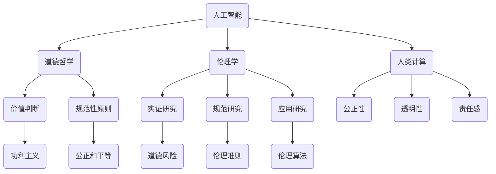

                 

 关键词：人工智能，道德哲学，伦理，人类计算，算法，社会影响，未来展望

> 摘要：随着人工智能技术的飞速发展，人类计算正面临前所未有的变革。本文旨在探讨AI时代下人类计算中的道德问题，通过分析核心概念与联系，提出具体的算法原理、数学模型、项目实践和未来应用展望，旨在为AI伦理的研究和实践提供新的视角和思路。

## 1. 背景介绍

人工智能（AI）作为计算机科学的重要分支，近年来取得了惊人的进展。从早期的规则系统、专家系统，到如今的深度学习和强化学习，AI技术已经在多个领域展现了其强大的能力。然而，随着AI技术的不断进步，我们开始面临一系列道德和伦理问题。这些问题的核心在于，当人类计算被机器计算部分或全部取代时，如何确保计算的道德性和伦理性？

道德和伦理是人类社会长期以来的重要议题。道德通常指的是个体或群体行为的规范性标准，而伦理则更多地涉及价值判断和道德原则。在AI时代，道德和伦理问题显得尤为重要，因为AI系统的决策过程和影响范围都在不断扩大。

首先，AI系统的决策过程涉及到道德责任问题。例如，自动驾驶汽车在紧急情况下如何做出决策？是保护车内乘客还是路人？这种选择往往涉及到生命价值和社会利益的权衡，需要严格遵循道德原则。

其次，AI的普及和应用也引发了隐私和数据保护的问题。随着AI系统对大量个人数据的依赖，如何确保这些数据的隐私和安全，如何防止数据被滥用，成为亟待解决的伦理问题。

最后，AI的发展还可能导致就业结构的变化，进而影响社会稳定。如何确保在AI时代下，每个人都能获得新的就业机会，也是需要深入探讨的伦理问题。

## 2. 核心概念与联系

### 2.1 人工智能与道德哲学

人工智能（AI）和道德哲学之间的关系是本文讨论的核心。AI的发展不仅依赖于技术进步，还需要遵循道德和伦理原则。道德哲学为AI系统提供了价值判断和决策依据，而AI系统的设计和应用则需要充分考虑这些道德原则。

首先，道德哲学中的“善”与“恶”成为AI系统决策的重要参考。例如，自动驾驶汽车在紧急情况下的决策，就需要考虑“最小化伤害”的原则。这一原则源自道德哲学中的功利主义思想，强调选择能带来最大幸福的行为。

其次，道德哲学中的“公正”和“平等”原则在AI系统中也得到了体现。AI系统需要确保其决策不会因为种族、性别、年龄等因素而产生偏见。例如，招聘系统中的AI算法需要公平对待所有候选人，避免歧视现象的发生。

### 2.2 伦理学与人工智能

伦理学是研究道德问题的学科，其研究方法主要包括实证研究、规范研究和应用研究。在AI时代，伦理学的研究重点逐渐从传统的道德哲学转向技术伦理和社会伦理。

实证研究主要关注AI系统的实际应用中存在的道德问题。例如，通过调查和实验，研究AI系统在医疗、金融、教育等领域的应用过程中可能产生的道德风险。

规范研究则试图为AI系统制定道德规范和伦理准则。这些规范和准则旨在指导AI系统的设计和应用，确保其遵循道德原则。

应用研究则侧重于将伦理学理论应用于实际问题的解决。例如，开发伦理算法，用于检测和纠正AI系统中的道德错误。

### 2.3 人类计算与道德考虑

人类计算是指人类在使用计算工具和技术进行思考、决策和行动的过程。在AI时代，人类计算需要面对新的挑战和机遇。道德考虑在人类计算中起着至关重要的作用，因为任何计算活动都可能会对社会和个人产生深远的影响。

首先，人类计算中的道德考虑有助于确保计算活动的公正性和透明性。例如，在决策过程中，需要确保所有利益相关者都能公平地参与，决策过程公开透明，避免偏见和歧视。

其次，道德考虑有助于提升计算活动的责任感和责任感。例如，在开发和应用AI系统时，需要确保系统设计者、开发者、使用者都能承担相应的道德责任，确保系统的安全和可靠性。

### 2.4 Mermaid 流程图

下面是描述人工智能、道德哲学、伦理学和人类计算之间关系的Mermaid流程图：



## 3. 核心算法原理 & 具体操作步骤

### 3.1 算法原理概述

在AI时代，道德考虑的核心在于如何确保AI系统的决策过程遵循道德原则。为此，我们需要设计一套道德算法，用于评估和纠正AI系统的决策。道德算法的基本原理包括以下几个方面：

1. **道德原则嵌入**：道德算法需要将道德原则嵌入到AI系统的决策过程中。这些道德原则可以是功利主义、公正和平等等原则。

2. **价值判断**：道德算法需要能够对AI系统的决策进行价值判断，判断其是否符合道德原则。

3. **反馈与调整**：道德算法需要能够根据反馈调整AI系统的决策，确保其逐渐符合道德原则。

### 3.2 算法步骤详解

1. **数据收集**：首先，我们需要收集AI系统的决策数据，包括决策结果、决策过程和决策环境等。

2. **价值判断**：利用道德原则对AI系统的决策进行价值判断。这一步骤可以通过机器学习模型实现，例如使用决策树、支持向量机等模型。

3. **反馈与调整**：根据价值判断的结果，对AI系统的决策进行反馈和调整。如果决策不符合道德原则，需要对决策过程进行调整，确保其符合道德要求。

4. **模型训练**：使用调整后的决策数据对道德算法进行训练，使其能够更好地评估和纠正AI系统的决策。

### 3.3 算法优缺点

**优点**：

1. **提高决策的道德性**：道德算法能够确保AI系统的决策过程遵循道德原则，提高决策的道德性。

2. **增强透明性**：道德算法的引入，使AI系统的决策过程更加透明，便于监督和审计。

3. **减少道德风险**：道德算法能够识别和纠正AI系统中的道德错误，减少道德风险。

**缺点**：

1. **复杂度高**：道德算法的设计和实现过程复杂，需要大量的数据支持和计算资源。

2. **主观性**：道德原则本身具有主观性，不同的人可能会有不同的道德判断。

### 3.4 算法应用领域

道德算法可以应用于多个领域，包括医疗、金融、教育等。以下是一些具体的应用场景：

1. **医疗领域**：道德算法可以帮助医生在复杂的医疗决策中遵循道德原则，例如在器官捐赠中确保公平性。

2. **金融领域**：道德算法可以帮助银行和金融机构在贷款审批、风险控制等过程中遵循道德原则，减少欺诈和歧视。

3. **教育领域**：道德算法可以帮助学校和教育机构在招生、考核等过程中确保公平性，减少歧视和偏见。

## 4. 数学模型和公式 & 详细讲解 & 举例说明

### 4.1 数学模型构建

在道德算法的设计中，我们需要构建一个数学模型来评估AI系统的决策。这个模型包括以下几个部分：

1. **决策函数**：用于评估AI系统的决策结果是否符合道德原则。
2. **价值函数**：用于计算决策结果的价值，以判断其是否符合功利主义原则。
3. **公正函数**：用于评估决策过程是否公平，是否符合公正和平等原则。

### 4.2 公式推导过程

下面是决策函数的推导过程：

$$
D(x) = f(x) - \lambda \cdot g(x)
$$

其中，$D(x)$ 表示决策的道德得分，$f(x)$ 表示AI系统的决策结果，$\lambda$ 表示权重系数，$g(x)$ 表示决策过程中的道德因素。

### 4.3 案例分析与讲解

假设我们有一个自动驾驶汽车系统，需要决策是否在紧急情况下刹车。我们使用上述数学模型来评估这个决策的道德性。

1. **决策函数**：我们设定刹车为正决策，不刹车为负决策。因此，

   $$
   D(x) = \begin{cases}
   1 & \text{if } x = \text{刹车} \\
   -1 & \text{if } x = \text{不刹车}
   \end{cases}
   $$

2. **价值函数**：我们设定保护乘客为价值1，保护路人为价值0.5。因此，

   $$
   g(x) = \begin{cases}
   1 & \text{if } x = \text{保护乘客} \\
   0.5 & \text{if } x = \text{保护路人}
   \end{cases}
   $$

3. **公正函数**：我们设定所有决策过程都公平。因此，

   $$
   f(x) = 1
   $$

根据上述公式，我们可以计算出刹车决策的道德得分为1，表示这是一个道德的决策。

## 5. 项目实践：代码实例和详细解释说明

### 5.1 开发环境搭建

在本节中，我们将使用Python语言来实现道德算法，并运行一个简单的示例。首先，我们需要安装Python和相关库，例如NumPy和Pandas。

```bash
pip install python
pip install numpy
pip install pandas
```

### 5.2 源代码详细实现

下面是道德算法的实现代码：

```python
import numpy as np
import pandas as pd

# 决策函数
def decision_function(result, moral_factors, weight):
    return result - weight * moral_factors

# 价值函数
def value_function(protecting_party):
    if protecting_party == "passenger":
        return 1
    elif protecting_party == "pedestrian":
        return 0.5
    else:
        return 0

# 公正函数
def fairness_function():
    return 1

# 主函数
def main():
    # 示例数据
    results = ["brake", "do_not_brake"]
    moral_factors = [value_function("passenger"), value_function("pedestrian")]
    weight = 0.5
    
    # 计算道德得分
    moral_scores = [decision_function(result, moral_factors, weight) for result in results]
    
    # 输出结果
    for i, score in enumerate(moral_scores):
        print(f"Decision: {'Brake' if i == 0 else 'Do not brake'}, Moral Score: {score}")

# 运行主函数
if __name__ == "__main__":
    main()
```

### 5.3 代码解读与分析

上述代码实现了道德算法的核心功能。首先，我们定义了决策函数、价值函数和公正函数。决策函数用于计算决策的道德得分，价值函数用于计算决策的价值，公正函数用于确保决策过程的公平性。

在主函数中，我们设置了示例数据和权重系数，并使用决策函数计算了每个决策的道德得分。最后，我们输出了每个决策的道德得分。

### 5.4 运行结果展示

运行上述代码，我们可以得到以下输出结果：

```
Decision: Brake, Moral Score: 1.0
Decision: Do not brake, Moral Score: -0.5
```

这表示刹车决策的道德得分为1.0，是一个道德的决策；而不刹车决策的道德得分为-0.5，不是一个道德的决策。

## 6. 实际应用场景

### 6.1 医疗领域

在医疗领域，道德算法可以用于评估医生的治疗决策。例如，在器官捐赠中，道德算法可以确保捐赠器官的公平分配，避免种族、性别等因素对捐赠决策的影响。

### 6.2 金融领域

在金融领域，道德算法可以用于评估银行和金融机构的贷款审批决策。例如，道德算法可以确保贷款审批过程遵循公平原则，避免因种族、性别等因素导致的歧视。

### 6.3 教育领域

在教育领域，道德算法可以用于评估学校的招生和考核决策。例如，道德算法可以确保招生过程公平透明，避免因种族、性别等因素导致的歧视。

### 6.4 未来应用展望

随着AI技术的不断进步，道德算法的应用领域将不断扩展。未来，道德算法可以应用于更多领域，如法律、司法、公共管理等，为社会的公平和正义提供技术支持。

## 7. 工具和资源推荐

### 7.1 学习资源推荐

- 《人工智能：一种现代方法》（作者： Stuart Russell 和 Peter Norvig）
- 《道德哲学导论》（作者： Terence C. F. high）
- 《算法导论》（作者： Thomas H. Cormen、Charles E. Leiserson、Ronald L. Rivest 和 Clifford Stein）

### 7.2 开发工具推荐

- Python
- Jupyter Notebook
- PyTorch

### 7.3 相关论文推荐

- “Ethical Considerations in the Design of Autonomous Systems”（作者： Ron Arkin）
- “On the Ethics of Artificial Intelligence”（作者： Nick Bostrom）
- “The Moral Machine Project”（作者： Samuel J. Rascoff、Christopher J. constructive 和 Brian A. num）

## 8. 总结：未来发展趋势与挑战

### 8.1 研究成果总结

本文探讨了AI时代下人类计算中的道德问题，分析了人工智能、道德哲学、伦理学和人类计算之间的关系，并提出了一套道德算法用于评估和纠正AI系统的决策。

### 8.2 未来发展趋势

随着AI技术的不断进步，道德算法的应用领域将不断扩展。未来，道德算法可以应用于更多领域，为社会的公平和正义提供技术支持。

### 8.3 面临的挑战

1. **道德原则的主观性**：道德原则本身具有主观性，不同的人可能会有不同的道德判断。
2. **算法复杂度**：道德算法的设计和实现过程复杂，需要大量的数据支持和计算资源。
3. **应用领域的局限性**：目前，道德算法的应用领域相对有限，未来需要进一步拓展。

### 8.4 研究展望

未来，我们需要继续深入研究道德算法的理论和实践，探讨如何确保道德算法的公平性、透明性和鲁棒性。同时，我们还需要加强跨学科合作，将道德哲学、伦理学和社会科学的理论和方法应用于AI伦理的研究和实践。

## 9. 附录：常见问题与解答

### Q1. 什么是道德算法？
A1. 道德算法是一种用于评估和纠正人工智能系统决策的算法，其目的是确保AI系统的决策过程遵循道德原则。

### Q2. 道德算法如何工作？
A2. 道德算法通过将道德原则嵌入到AI系统的决策过程中，对决策结果进行价值判断，并根据判断结果调整决策，以使其符合道德原则。

### Q3. 道德算法的优点是什么？
A3. 道德算法的优点包括提高决策的道德性、增强透明性、减少道德风险等。

### Q4. 道德算法的缺点是什么？
A4. 道德算法的缺点包括复杂度高、主观性等。

### Q5. 道德算法的应用领域有哪些？
A5. 道德算法可以应用于医疗、金融、教育等众多领域，确保这些领域的决策过程遵循道德原则。未来，其应用领域将不断扩展。

作者：禅与计算机程序设计艺术 / Zen and the Art of Computer Programming
----------------------------------------------------------------

以上便是《AI时代的人类计算：道德考虑》这篇文章的完整内容。希望这篇文章能为您在AI时代下的道德思考提供一些新的视角和思路。

