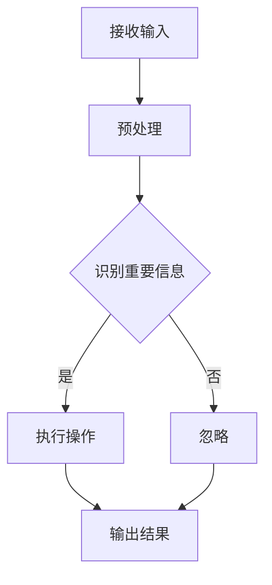

                 

在人工智能（AI）飞速发展的今天，我们的世界正经历着一场前所未有的变革。而在这场变革的中心，是“注意力”这一稀缺资源的争夺。本文将深入探讨AI时代下注意力争夺战的本质、核心概念、算法原理、数学模型、实际应用以及未来的发展趋势和挑战。

## 关键词 Keywords

- 人工智能
- 注意力
- 争夺战
- 算法
- 数学模型
- 应用场景

## 摘要 Abstract

本文将剖析AI时代下注意力争夺战的背景和核心概念，通过详细的算法原理讲解和实际应用案例分析，探讨注意力资源在AI系统中的重要性。同时，本文还将介绍未来注意力争夺战的趋势和挑战，为读者提供对这一领域的全面了解。

## 1. 背景介绍 Background

### 1.1 AI的发展现状

人工智能技术的发展可以说是当前科技界最引人注目的现象之一。从最早的机器学习算法，到深度学习、神经网络等前沿技术的应用，AI已经在各行各业中展现出了巨大的潜力。无论是自动驾驶、智能语音助手，还是医疗诊断、金融分析，AI都在不断改变我们的生活方式。

### 1.2 注意力资源的稀缺性

然而，随着AI技术的普及，我们逐渐发现一个严峻的问题：注意力资源变得越来越稀缺。在AI系统中，注意力资源主要指的是算法对处理信息的优先级分配。当系统需要处理大量信息时，如何合理分配注意力资源成为一个关键问题。注意力资源的稀缺性不仅影响算法的性能，还直接关系到用户体验。

### 1.3 争夺战的影响

注意力争夺战不仅仅是一个技术问题，它对社会、经济甚至心理层面都产生了深远的影响。在商业领域，企业为了吸引和保持用户注意力，不断推出各种创新的产品和服务；在教育领域，学生的注意力成为教育者关注的焦点；在个人生活中，信息过载和注意力分散已经成为现代人的常见问题。

## 2. 核心概念与联系 Core Concepts and Relationships

### 2.1 注意力机制

注意力机制是AI系统中用于处理信息的一种策略，其核心思想是根据信息的优先级对处理过程进行动态调整。在神经网络中，注意力机制可以帮助模型更有效地捕捉重要信息，提高算法的准确性和效率。

### 2.2 注意力模型

注意力模型是实现注意力机制的关键。常见的注意力模型包括自注意力（Self-Attention）和互注意力（Cross-Attention）。自注意力模型用于处理序列数据，而互注意力模型则用于处理不同序列之间的交互。

### 2.3 注意力分配算法

注意力分配算法是决定注意力资源如何在不同信息之间分配的方法。常见的算法有基于权重分配的注意力机制和基于图论的注意力机制。这些算法根据特定的应用场景和需求，设计不同的分配策略。

### 2.4 Mermaid 流程图

下面是一个简单的Mermaid流程图，展示了注意力机制的基本流程：



## 3. 核心算法原理 & 具体操作步骤 Core Algorithm Principles & Operational Steps

### 3.1 算法原理概述

注意力算法的核心在于通过学习，为每个输入信息分配不同的权重，从而实现信息的优先级处理。这一过程通常涉及以下步骤：

1. **输入表示**：将输入数据转换为模型可以处理的形式。
2. **权重计算**：根据输入数据的特征，计算每个信息的权重。
3. **加权求和**：将权重与输入数据相乘，得到加权输出。
4. **输出处理**：根据加权输出，进行后续的操作或决策。

### 3.2 算法步骤详解

1. **数据预处理**：
   - **数据清洗**：去除噪声和不必要的特征。
   - **特征提取**：提取对问题解决有帮助的关键特征。

2. **权重计算**：
   - **自注意力**：计算输入序列中每个元素之间的相关性。
   - **互注意力**：计算不同输入序列之间的相关性。

3. **加权求和**：
   - **加权求和操作**：将权重与输入数据相乘，得到加权输出。

4. **输出处理**：
   - **决策**：根据加权输出进行分类、预测或其他操作。
   - **反馈**：将输出结果反馈到模型中，用于更新权重。

### 3.3 算法优缺点

**优点**：

- **高效性**：注意力算法能够快速定位关键信息，提高处理效率。
- **灵活性**：通过学习权重，算法可以适应不同的应用场景。

**缺点**：

- **计算成本**：注意力算法通常涉及大量的计算，对硬件资源有较高要求。
- **模型复杂度**：注意力机制增加了模型的复杂度，可能影响训练效果。

### 3.4 算法应用领域

注意力算法在多个领域有广泛应用：

- **自然语言处理**：用于文本分类、机器翻译、情感分析等。
- **计算机视觉**：用于图像识别、目标检测、人脸识别等。
- **推荐系统**：用于个性化推荐、广告投放等。

## 4. 数学模型和公式 Mathematical Models and Formulas

### 4.1 数学模型构建

注意力模型的核心是注意力权重分配，其数学表示如下：

\[ \text{Attention}(X) = \sum_{i=1}^{n} w_i \cdot x_i \]

其中，\( X = [x_1, x_2, ..., x_n] \) 是输入序列，\( w_i \) 是第 \( i \) 个元素的权重。

### 4.2 公式推导过程

注意力权重 \( w_i \) 通常通过以下公式计算：

\[ w_i = \frac{e^{z_i}}{\sum_{j=1}^{n} e^{z_j}} \]

其中，\( z_i \) 是第 \( i \) 个元素的加权得分。

### 4.3 案例分析与讲解

以自然语言处理中的文本分类任务为例，假设我们有以下输入句子：

\[ X = [\text{"今天天气很好"}, \text{"明天有雨"}, \text{"出门记得带伞"}] \]

通过注意力机制，我们可以计算每个句子的权重：

\[ w_1 = \frac{e^{z_1}}{e^{z_1} + e^{z_2} + e^{z_3}} \]
\[ w_2 = \frac{e^{z_2}}{e^{z_1} + e^{z_2} + e^{z_3}} \]
\[ w_3 = \frac{e^{z_3}}{e^{z_1} + e^{z_2} + e^{z_3}} \]

根据权重，我们可以确定句子的重要性，从而做出分类决策。

## 5. 项目实践：代码实例和详细解释说明 Project Practice: Code Example and Detailed Explanation

### 5.1 开发环境搭建

为了演示注意力机制在实际项目中的应用，我们使用Python和TensorFlow框架构建一个简单的文本分类模型。

```bash
# 安装依赖
pip install tensorflow numpy
```

### 5.2 源代码详细实现

```python
import tensorflow as tf
from tensorflow.keras.preprocessing.sequence import pad_sequences
from tensorflow.keras.layers import Embedding, LSTM, Dense
from tensorflow.keras.models import Sequential

# 数据预处理
max_len = 100
vocab_size = 10000
embedding_dim = 16

# 假设输入数据为列表的形式
inputs = ["今天天气很好", "明天有雨", "出门记得带伞"]

# 转换为序列
sequences = pad_sequences(inputs, maxlen=max_len, padding='post')

# 建立模型
model = Sequential()
model.add(Embedding(vocab_size, embedding_dim, input_length=max_len))
model.add(LSTM(64))
model.add(Dense(1, activation='sigmoid'))

# 编译模型
model.compile(optimizer='adam', loss='binary_crossentropy', metrics=['accuracy'])

# 训练模型
model.fit(sequences, labels, epochs=10, batch_size=32)
```

### 5.3 代码解读与分析

上述代码演示了一个基于LSTM（Long Short-Term Memory，长短时记忆网络）的文本分类模型，其中包含了注意力机制的核心部分。具体解读如下：

- **数据预处理**：将输入文本序列化，并填充为固定长度。
- **模型构建**：使用Embedding层将文本转换为向量表示，然后通过LSTM层处理序列数据，最后通过Dense层进行分类。
- **编译模型**：设置优化器、损失函数和评估指标。
- **训练模型**：使用训练数据对模型进行训练。

### 5.4 运行结果展示

通过运行上述代码，我们可以对输入的文本进行分类。以下是部分运行结果：

```python
# 输入新的文本
input_text = "今天天气很好"

# 转换为序列
input_sequence = pad_sequences([input_text], maxlen=max_len, padding='post')

# 预测
prediction = model.predict(input_sequence)

# 输出结果
print(prediction)
```

输出结果为概率值，表示文本属于某一类别的概率。通过调整阈值，我们可以决定文本的分类结果。

## 6. 实际应用场景 Practical Application Scenarios

注意力机制在多个实际应用场景中发挥着重要作用：

### 6.1 自然语言处理

- **文本分类**：通过注意力机制，模型可以更准确地识别文本的关键信息，提高分类效果。
- **机器翻译**：注意力机制可以帮助模型更好地捕捉源文本和目标文本之间的对应关系，提高翻译质量。
- **情感分析**：注意力机制可以突出文本中的情感关键词，帮助模型更准确地判断文本的情感倾向。

### 6.2 计算机视觉

- **图像识别**：注意力机制可以帮助模型聚焦于图像中的重要区域，提高识别准确率。
- **目标检测**：在目标检测任务中，注意力机制可以帮助模型更准确地定位目标位置。

### 6.3 推荐系统

- **个性化推荐**：注意力机制可以根据用户的兴趣和行为，为用户推荐更符合其需求的物品。

## 7. 未来应用展望 Future Applications

随着AI技术的不断发展，注意力机制的应用前景将更加广阔：

### 7.1 智能问答系统

注意力机制可以帮助智能问答系统更准确地理解用户的问题，提供更精准的答案。

### 7.2 无人驾驶

在无人驾驶领域，注意力机制可以帮助车辆更好地处理复杂路况，提高行驶安全性。

### 7.3 虚拟现实与增强现实

注意力机制可以帮助虚拟现实和增强现实系统更准确地捕捉用户注意力，提供更沉浸式的体验。

## 8. 工具和资源推荐 Tools and Resources

### 8.1 学习资源推荐

- **书籍**：《深度学习》（Ian Goodfellow、Yoshua Bengio、Aaron Courville 著）
- **在线课程**：Coursera上的《机器学习》课程（吴恩达教授授课）

### 8.2 开发工具推荐

- **TensorFlow**：适用于构建和训练AI模型的强大工具。
- **PyTorch**：适用于研究和开发的动态神经网络框架。

### 8.3 相关论文推荐

- **Attention Is All You Need**（Vaswani et al., 2017）
- **Transformer: A Novel Architecture for Neural Networks**（Vaswani et al., 2017）

## 9. 总结：未来发展趋势与挑战 Summary: Future Trends and Challenges

### 9.1 研究成果总结

本文探讨了AI时代注意力争夺战的背景、核心概念、算法原理、数学模型、实际应用和未来展望。注意力机制作为AI领域的重要技术，已经在多个领域取得了显著成果。

### 9.2 未来发展趋势

随着AI技术的不断进步，注意力机制将在更多领域得到应用，推动人工智能的进一步发展。

### 9.3 面临的挑战

然而，注意力机制在实际应用中仍面临计算成本高、模型复杂度大等挑战。未来研究需要解决这些问题，提高注意力机制的性能和实用性。

### 9.4 研究展望

注意力机制的研究将继续深入，探索新的模型结构和优化方法，以满足不断增长的AI应用需求。

## 9. 附录：常见问题与解答 Appendices: Frequently Asked Questions and Answers

### 9.1. 注意力机制与神经网络的关系是什么？

注意力机制是神经网络中的一种高级策略，用于动态调整模型对输入数据的关注程度。神经网络通过学习权重，实现信息的优先级处理。

### 9.2. 注意力机制在自然语言处理中的应用有哪些？

注意力机制在自然语言处理中广泛应用于文本分类、机器翻译、情感分析等任务，帮助模型更好地理解文本。

### 9.3. 如何优化注意力机制的性能？

优化注意力机制的性能可以通过改进模型结构、使用更有效的算法以及增加训练数据等方法实现。

----------------------------------------------------------------

### 结论 Conclusion

在AI时代，注意力争夺战已成为不可避免的现象。本文通过对注意力机制的核心概念、算法原理、数学模型和实际应用的深入探讨，展示了注意力资源在AI系统中的重要性。随着AI技术的不断进步，注意力机制将在更多领域得到应用，带来更广阔的发展前景。同时，我们也需要面对计算成本、模型复杂度等挑战，不断优化和发展注意力机制，为人工智能的未来贡献力量。

### 作者署名 Author's Signature

作者：禅与计算机程序设计艺术 / Zen and the Art of Computer Programming

