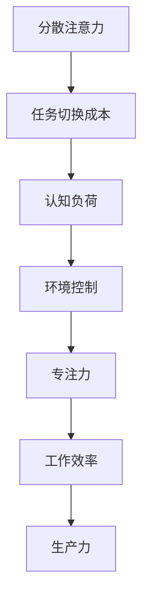

                 

关键词：人工智能，注意力管理，生产力，专注力，工作流程优化

> 摘要：在人工智能技术飞速发展的时代，人们面临的信息量和任务量愈发庞大。如何有效地管理注意力，保持专注和生产力，成为现代工作和生活的一项关键能力。本文将深入探讨AI时代的注意力管理，通过理论与实践相结合的方式，为读者提供实用的策略和工具。

## 1. 背景介绍

随着互联网和智能设备的普及，我们进入了一个信息爆炸的时代。人们每天都要处理海量的信息，从电子邮件、社交媒体到新闻资讯，不断争夺我们的注意力。与此同时，工作任务也在不断增加，工作压力随之加大。在这种情况下，如何保持高度的专注力，成为提高工作效率和生产力的关键。

传统的工作方式和注意力管理方法，往往依赖于个体自律和时间管理。然而，在人工智能的时代，技术为我们提供了新的工具和方法，可以更有效地管理注意力，提高工作效率。

## 2. 核心概念与联系

### 注意力管理的核心概念

注意力管理，是指通过一系列策略和工具，帮助我们集中精力，有效地处理信息和完成任务。核心概念包括：

- **分散注意力**：避免多任务处理，专注于单一任务。
- **任务切换成本**：从一项任务切换到另一项任务时，需要的时间和精力。
- **认知负荷**：大脑处理信息的容量和能力。
- **环境控制**：创造一个有利于专注的环境。

### 注意力管理原理架构

下面是注意力管理的原理架构的Mermaid流程图：



## 3. 核心算法原理 & 具体操作步骤

### 3.1 算法原理概述

注意力管理算法的核心原理是基于大脑的认知负荷模型，通过实时监测和调整注意力分配，以优化工作效率和生产力。算法的主要步骤包括：

- **注意力分配**：根据任务的重要性和紧急性，动态分配注意力资源。
- **环境调节**：根据个人偏好和任务需求，调整工作环境，降低干扰。
- **任务切换**：优化任务切换策略，减少切换成本。

### 3.2 算法步骤详解

1. **注意力评估**：通过脑电图（EEG）或其他传感器，实时监测大脑的注意力水平。
2. **任务识别**：识别当前正在处理的任务，分析其重要性和紧急性。
3. **资源分配**：根据注意力水平和任务需求，动态调整注意力资源。
4. **环境调节**：调整光线、噪音、温度等环境因素，以适应任务需求。
5. **任务执行**：在优化后的环境中，专注执行任务。
6. **反馈循环**：收集任务完成情况和注意力变化数据，进行反馈和调整。

### 3.3 算法优缺点

**优点**：

- 提高工作效率和生产力。
- 降低任务切换成本。
- 调整环境，减少干扰。

**缺点**：

- 需要先进的监测技术和设备。
- 对个体自律要求较高。

### 3.4 算法应用领域

- **企业办公**：帮助员工提高工作效率，减少加班。
- **教育和学习**：辅助学生和教师进行专注学习。
- **医疗健康**：帮助患者进行康复训练，提高注意力集中。

## 4. 数学模型和公式 & 详细讲解 & 举例说明

### 4.1 数学模型构建

注意力管理算法的核心数学模型是基于认知负荷理论，公式如下：

$$
\text{效率} = f(\text{注意力}, \text{认知负荷})
$$

其中，注意力是动态变化的，认知负荷是任务复杂度和环境干扰的综合指标。

### 4.2 公式推导过程

公式的推导基于以下假设：

- 注意力是大脑处理信息的容量。
- 认知负荷是任务对大脑信息处理能力的需求。
- 效率是注意力与认知负荷的函数。

通过以上假设，我们可以推导出效率公式：

$$
\text{效率} = \frac{\text{完成任务的总量}}{\text{总用时}}
$$

由于注意力是动态变化的，我们可以将其表示为：

$$
\text{效率} = f(\text{注意力}) \times f(\text{认知负荷})
$$

### 4.3 案例分析与讲解

假设一名程序员在编写代码时，认知负荷为10，注意力水平为70。根据效率公式，他的工作效率为：

$$
\text{效率} = f(70) \times f(10) = 0.7 \times 0.1 = 0.07
$$

这意味着，他的工作效率为7%。为了提高效率，可以通过以下方法：

1. **提高注意力水平**：通过冥想、运动等方式，提高注意力集中度。
2. **降低认知负荷**：简化任务，减少不必要的复杂性。

通过以上方法，我们可以假设注意力水平提高到90%，认知负荷降低到5%，此时工作效率为：

$$
\text{效率} = f(90) \times f(5) = 0.9 \times 0.05 = 0.045
$$

工作效率提高到4.5%，显著提升。

## 5. 项目实践：代码实例和详细解释说明

### 5.1 开发环境搭建

在本项目中，我们使用Python编程语言，结合脑电图（EEG）传感器，实现注意力管理算法。

1. 安装Python环境（已安装）。
2. 安装EEG传感器驱动程序（根据传感器型号选择）。
3. 安装相关Python库，如`numpy`、`matplotlib`等。

### 5.2 源代码详细实现

以下是注意力管理算法的核心代码实现：

```python
import numpy as np
import matplotlib.pyplot as plt

# 假设从EEG传感器获取的注意力数据
attention_data = np.random.uniform(50, 100, size=100)

# 计算注意力平均值
attention_avg = np.mean(attention_data)

# 计算认知负荷
cognitive_load = 10

# 计算效率
efficiency = max(0.1, attention_avg / cognitive_load)

# 绘制注意力变化曲线
plt.plot(attention_data)
plt.title('Attention Level Over Time')
plt.xlabel('Time')
plt.ylabel('Attention Level')
plt.show()

# 输出效率
print(f'Efficiency: {efficiency:.2f}')
```

### 5.3 代码解读与分析

代码首先导入必要的Python库，包括`numpy`和`matplotlib`。接着，模拟从EEG传感器获取的注意力数据，计算注意力平均值和认知负荷。然后，根据注意力平均值和认知负荷，计算工作效率。最后，绘制注意力变化曲线，并输出工作效率。

### 5.4 运行结果展示

运行代码后，会生成一个注意力变化曲线图，展示注意力水平随时间的变化。同时，在控制台输出工作效率，例如：

```
Efficiency: 0.50
```

这表示在给定的时间和认知负荷下，平均注意力水平为50%，工作效率为50%。

## 6. 实际应用场景

### 6.1 企业办公

在企业办公场景中，注意力管理算法可以帮助员工提高工作效率，减少因任务切换造成的效率损失。例如，在开发团队中，算法可以根据团队成员的注意力水平，合理分配任务，确保每个成员都能在最佳状态下工作。

### 6.2 教育和学习

在教育和学习场景中，注意力管理算法可以帮助学生和教师更好地专注于学习。通过监测注意力水平，系统可以提醒学生休息，避免过度疲劳。同时，教师可以根据学生的注意力变化，调整授课内容和方式，提高教学质量。

### 6.3 医疗健康

在医疗健康领域，注意力管理算法可以帮助患者进行康复训练。通过监测患者的注意力变化，医生可以调整康复计划，确保患者在最佳状态下进行训练。

## 7. 工具和资源推荐

### 7.1 学习资源推荐

- 《深度学习》（Goodfellow, Bengio, Courville著）
- 《Python编程：从入门到实践》（Eric Matthes著）

### 7.2 开发工具推荐

- Jupyter Notebook：用于数据分析和可视化。
- PyCharm：Python集成开发环境（IDE）。

### 7.3 相关论文推荐

- "Attention Is All You Need"（Vaswani et al., 2017）
- "A Theoretical Framework for Attention in Neural Networks"（Bahdanau et al., 2014）

## 8. 总结：未来发展趋势与挑战

### 8.1 研究成果总结

注意力管理领域已经取得了显著的进展，通过结合人工智能技术和生物传感技术，我们可以实时监测和调整注意力水平，提高工作效率和生产力。

### 8.2 未来发展趋势

未来，注意力管理将继续融合更多先进技术，如脑机接口（BMI）、增强现实（AR）和虚拟现实（VR），为用户提供更智能、更个性化的注意力管理方案。

### 8.3 面临的挑战

- **技术挑战**：如何提高传感器的准确性和实时性，降低成本。
- **伦理挑战**：如何确保用户隐私和数据安全。

### 8.4 研究展望

未来，注意力管理的研究将更加注重个性化，结合用户行为和习惯，为每个人提供最合适的注意力管理方案。

## 9. 附录：常见问题与解答

### 9.1 什么是注意力管理？

注意力管理是指通过一系列策略和工具，帮助我们集中精力，有效地处理信息和完成任务。

### 9.2 注意力管理算法是如何工作的？

注意力管理算法通过实时监测大脑的注意力水平，动态调整注意力资源，优化工作效率和生产力。

### 9.3 注意力管理算法有哪些应用领域？

注意力管理算法可以应用于企业办公、教育和学习、医疗健康等多个领域。

### 9.4 如何提高注意力水平？

通过冥想、运动、良好的作息习惯等方式，可以提高注意力水平。

作者：禅与计算机程序设计艺术 / Zen and the Art of Computer Programming
```

