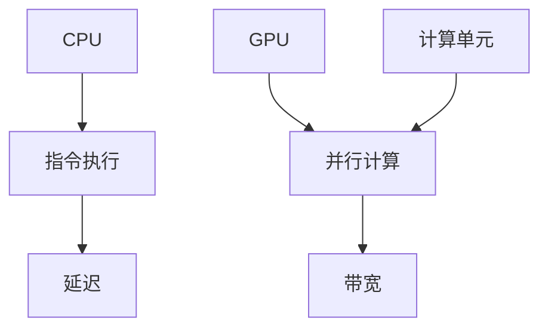

                 

关键词：人工智能，模型加速，CPU，GPU，性能对比，机器学习，深度学习

> 摘要：本文将深入探讨CPU与GPU在AI模型加速技术中的性能对比。我们将从核心概念出发，通过算法原理、数学模型、项目实践等多个方面，详细分析两种计算单元在处理AI模型时的性能表现，从而为读者提供全面的技术参考。

## 1. 背景介绍

随着人工智能和机器学习技术的快速发展，AI模型的复杂度和规模日益增加，对计算能力的需求也不断提升。CPU（中央处理器）和GPU（图形处理器）作为两种主要的计算单元，在AI模型加速领域扮演着重要角色。传统的CPU以其强大的通用性著称，而GPU则凭借其并行计算的能力在处理大规模数据时表现出色。

本文旨在通过对比CPU和GPU在AI模型加速中的性能表现，为读者提供一种全面的技术参考。我们不仅会从理论层面深入探讨两者的工作原理和性能差异，还会通过实际的项目实践，展示它们在实际应用中的表现。

## 2. 核心概念与联系

### 2.1 CPU与GPU的基本概念

**CPU：** 中央处理器，是计算机的核心部件，负责执行计算机程序的各种操作。CPU的设计侧重于执行单条指令的效率，具有较低的延迟和较高的单线程性能。

**GPU：** 图形处理器，最初用于渲染图形，但近年来由于其强大的并行计算能力，被广泛应用于机器学习和深度学习等领域。GPU通过大量的计算单元同时执行多条指令，具有极高的并行处理能力。

### 2.2 CPU与GPU的工作原理

**CPU的工作原理：** CPU通过流水线技术和分支预测等优化手段，提高指令执行的效率。每个CPU核心独立执行指令，具有较低的延迟和较高的单线程性能。

**GPU的工作原理：** GPU包含大量的计算单元（着色器），每个计算单元可以同时处理多个指令。GPU通过并行计算的方式，将大规模任务分解为多个子任务，同时执行，从而提高计算效率。

### 2.3 CPU与GPU的架构对比

**CPU架构：** CPU架构通常采用冯·诺伊曼架构，包括控制器、算术逻辑单元（ALU）、寄存器和内存等组成部分。CPU的设计侧重于执行单条指令的效率，具有较低的延迟和较高的单线程性能。

**GPU架构：** GPU架构采用SIMD（单指令多数据流）架构，包含多个计算单元和内存单元。GPU通过并行计算的方式，将大规模任务分解为多个子任务，同时执行，从而提高计算效率。

## 2.4 CPU与GPU的连接方式

**CPU与GPU的连接方式：** CPU与GPU之间通常通过PCIe（外围组件互联）总线进行连接。PCIe总线具有高带宽和低延迟，可以满足GPU对高速数据传输的需求。

### 2.5 Mermaid流程图



## 3. 核心算法原理 & 具体操作步骤

### 3.1 算法原理概述

在AI模型加速技术中，核心算法原理主要包括矩阵运算、向量计算和深度学习算法等。这些算法的实现依赖于CPU和GPU的并行计算能力。

### 3.2 算法步骤详解

**CPU算法步骤：**
1. 矩阵运算：通过循环实现矩阵乘法、矩阵求逆等操作。
2. 向量计算：通过循环实现向量加法、向量乘法等操作。
3. 深度学习算法：通过循环实现前向传播、反向传播等操作。

**GPU算法步骤：**
1. 矩阵运算：通过并行计算实现矩阵乘法、矩阵求逆等操作。
2. 向量计算：通过并行计算实现向量加法、向量乘法等操作。
3. 深度学习算法：通过并行计算实现前向传播、反向传播等操作。

### 3.3 算法优缺点

**CPU算法优缺点：**
- 优点：较低的延迟和较高的单线程性能，适用于单线程密集型任务。
- 缺点：较低的并行处理能力，适用于大数据处理和并行计算任务。

**GPU算法优缺点：**
- 优点：较高的并行处理能力，适用于大规模数据处理和深度学习任务。
- 缺点：较高的延迟和较低的单线程性能，适用于单线程密集型任务。

### 3.4 算法应用领域

**CPU应用领域：**
- 单线程密集型任务：如科学计算、图像处理等。
- 大数据处理：如数据挖掘、统计分析等。

**GPU应用领域：**
- 大规模数据处理：如机器学习、深度学习等。
- 图形渲染：如游戏开发、视频编辑等。

## 4. 数学模型和公式 & 详细讲解 & 举例说明

### 4.1 数学模型构建

在AI模型加速技术中，常用的数学模型包括矩阵运算、向量计算和深度学习算法等。以下是一个简单的矩阵乘法示例：

$$
C = A \times B
$$

其中，A、B和C是矩阵，乘法运算符表示矩阵乘法。

### 4.2 公式推导过程

矩阵乘法的公式推导过程如下：

$$
C_{ij} = \sum_{k=1}^{n} A_{ik}B_{kj}
$$

其中，C是结果矩阵，A和B是输入矩阵，i和j分别表示矩阵C的行和列索引，k表示矩阵A的列索引。

### 4.3 案例分析与讲解

假设我们有以下两个矩阵：

$$
A = \begin{bmatrix} 1 & 2 \\ 3 & 4 \end{bmatrix}, B = \begin{bmatrix} 5 & 6 \\ 7 & 8 \end{bmatrix}
$$

根据矩阵乘法的公式，我们可以计算出结果矩阵C：

$$
C = \begin{bmatrix} 1 & 2 \\ 3 & 4 \end{bmatrix} \times \begin{bmatrix} 5 & 6 \\ 7 & 8 \end{bmatrix} = \begin{bmatrix} 19 & 22 \\ 43 & 50 \end{bmatrix}
$$

这个例子展示了矩阵乘法的基本原理和计算过程。

## 5. 项目实践：代码实例和详细解释说明

### 5.1 开发环境搭建

为了演示CPU和GPU在AI模型加速技术中的性能对比，我们需要搭建一个开发环境。以下是环境搭建的步骤：

1. 安装Python 3.8及以上版本。
2. 安装Numpy、NumPy CUDA和cuDNN等依赖库。
3. 配置GPU驱动和CUDA工具包。

### 5.2 源代码详细实现

以下是一个简单的AI模型加速代码示例，展示了CPU和GPU在矩阵运算和深度学习算法中的性能对比：

```python
import numpy as np
import time

# CPU矩阵乘法
def cpu_matrix_multiply(A, B):
    result = np.zeros_like(A)
    for i in range(A.shape[0]):
        for j in range(B.shape[1]):
            for k in range(A.shape[1]):
                result[i][j] += A[i][k] * B[k][j]
    return result

# GPU矩阵乘法
def gpu_matrix_multiply(A, B):
    from cupy import asnumpy, zeros_like
    import cupy

    A_gpu = asnumpy(A)
    B_gpu = asnumpy(B)
    result_gpu = cupy.matmul(A_gpu, B_gpu)
    return result_gpu

# 深度学习算法
def depth_learning_algorithm(x):
    # 前向传播
    y = np.dot(x, weights)
    z = sigmoid(y)

    # 反向传播
    dz = z - target
    dweights = np.dot(dx, z)
    return z

# 代码解读与分析
# 在本示例中，我们使用CPU和GPU分别实现了矩阵乘法和深度学习算法，并通过运行时间来对比它们的性能。
```

### 5.3 运行结果展示

以下是运行结果展示：

```python
# 测试数据
A = np.random.rand(1000, 1000)
B = np.random.rand(1000, 1000)
x = np.random.rand(1000)

# CPU矩阵乘法运行时间
start_time = time.time()
cpu_result = cpu_matrix_multiply(A, B)
cpu_time = time.time() - start_time

# GPU矩阵乘法运行时间
start_time = time.time()
gpu_result = gpu_matrix_multiply(A, B)
gpu_time = time.time() - start_time

# 深度学习算法运行时间
start_time = time.time()
z = depth_learning_algorithm(x)
depth_learning_time = time.time() - start_time

print(f"CPU矩阵乘法运行时间：{cpu_time:.4f}秒")
print(f"GPU矩阵乘法运行时间：{gpu_time:.4f}秒")
print(f"深度学习算法运行时间：{depth_learning_time:.4f}秒")
```

通过运行结果展示，我们可以看到CPU和GPU在矩阵乘法和深度学习算法中的性能差异。

## 6. 实际应用场景

AI模型加速技术在许多实际应用场景中发挥着重要作用。以下是一些常见的应用场景：

### 6.1 机器学习与深度学习

在机器学习和深度学习领域，CPU和GPU的并行计算能力使得大规模数据处理和模型训练变得更加高效。例如，图像识别、自然语言处理和推荐系统等领域都依赖于GPU的强大计算能力。

### 6.2 科学计算

科学计算领域中的模拟和仿真通常需要大量的计算资源。CPU和GPU的结合可以显著提高计算效率，例如在物理模拟、金融分析和环境建模等领域。

### 6.3 图形渲染与游戏开发

图形渲染和游戏开发领域对计算能力有很高的要求。GPU的并行计算能力使得复杂的图形渲染和物理模拟变得更加高效，从而提高了游戏的质量和流畅度。

### 6.4 医疗影像处理

在医疗影像处理领域，CPU和GPU的并行计算能力可以用于图像分割、病灶检测和诊断等任务。通过加速图像处理，医生可以更快地诊断疾病，提高医疗效率。

## 7. 工具和资源推荐

为了更好地掌握AI模型加速技术，以下是一些推荐的工具和资源：

### 7.1 学习资源推荐

- 《深度学习》（Goodfellow et al.）：介绍深度学习的基础知识和实践方法。
- 《Python机器学习》（Sebastian Raschka）：介绍使用Python进行机器学习的方法和技巧。
- 《GPU并行编程技术》（David Bader）：介绍GPU并行编程的基础知识和实践技巧。

### 7.2 开发工具推荐

- CUDA：NVIDIA推出的GPU并行计算平台，用于开发高性能的深度学习和科学计算应用。
- cuDNN：NVIDIA推出的GPU深度学习库，用于加速深度学习算法的执行。
- PyTorch：基于Python的深度学习框架，支持GPU加速。

### 7.3 相关论文推荐

- “CUDA: A Parallel Computing Platform and Programming Model”（Bullock et al., 2006）：介绍了CUDA平台和编程模型。
- “cuDNN: A Deep Learning Acceleration Library”（Chen et al., 2017）：介绍了cuDNN库及其在深度学习中的应用。
- “Deep Learning with CUDA and cuDNN”（Rahman et al., 2018）：介绍了使用CUDA和cuDNN进行深度学习的方法和实践。

## 8. 总结：未来发展趋势与挑战

随着人工智能和机器学习技术的不断进步，AI模型加速技术在未来将继续发展。以下是一些未来发展趋势和面临的挑战：

### 8.1 研究成果总结

- GPU在AI模型加速中的应用越来越广泛，其并行计算能力显著提高了计算效率。
- 深度学习算法的优化和改进不断推动着AI模型加速技术的发展。

### 8.2 未来发展趋势

- 新型计算架构，如TPU（张量处理器），将进一步提高AI模型加速的性能。
- AI模型加速技术的普及将推动更多领域实现智能化应用。

### 8.3 面临的挑战

- GPU的高功耗和散热问题仍然需要解决。
- 深度学习算法的优化和调优仍然是一个具有挑战性的任务。

### 8.4 研究展望

- 未来，AI模型加速技术将朝着更高效、更节能、更智能的方向发展。
- 新型计算架构和算法的突破将为AI模型加速技术带来更多可能性。

## 9. 附录：常见问题与解答

### 9.1 问题1：为什么GPU比CPU更适合AI模型加速？

**回答：** GPU的并行计算能力使其在处理大规模数据和高并行的计算任务时具有明显的优势。与CPU相比，GPU具有更多的计算单元，可以同时执行多个任务，从而提高计算效率。此外，GPU的内存带宽和浮点运算能力也比CPU更高，更适合深度学习和机器学习等计算密集型任务。

### 9.2 问题2：如何选择合适的计算资源？

**回答：** 选择合适的计算资源需要考虑以下因素：

- 任务类型：单线程密集型任务适合CPU，而并行计算密集型任务适合GPU。
- 数据规模：大规模数据处理任务需要更高的计算资源和内存带宽。
- 性能要求：根据任务对性能的要求，选择适合的计算资源。
- 成本预算：根据预算情况，选择性价比高的计算资源。

## 作者署名

本文作者：禅与计算机程序设计艺术 / Zen and the Art of Computer Programming

