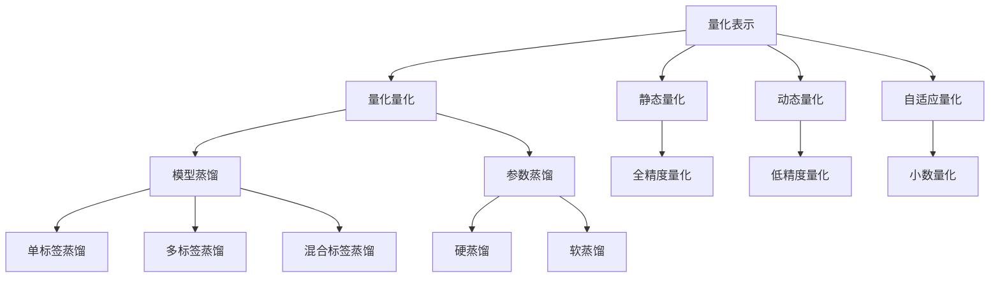

                 

关键词：AI模型压缩、量化、知识蒸馏、模型优化、计算效率、存储空间、神经网络

摘要：本文将深入探讨AI模型压缩领域中的两个关键技术：量化和知识蒸馏。首先，我们将介绍模型压缩的背景和重要性，然后分别阐述量化技术和知识蒸馏技术的基本原理、优缺点以及应用领域。接着，我们将通过数学模型和具体实例来详细讲解这两个技术。最后，我们将总结研究成果，展望未来发展趋势，并探讨面临的挑战。

## 1. 背景介绍

随着深度学习技术的快速发展，AI模型在各个领域取得了显著的成果。然而，这些模型往往具有庞大的参数规模，需要大量的计算资源和存储空间。为了应对这一挑战，模型压缩技术应运而生。模型压缩的目标是通过减少模型的参数数量和计算量，降低模型的复杂性，从而提高计算效率和存储空间利用率。

模型压缩技术主要包括量化、剪枝、蒸馏等。量化技术通过降低模型参数的精度来减少模型的大小，而剪枝技术通过删除模型中不必要的神经元或连接来减少模型的规模。知识蒸馏技术则通过将大模型的知识传递给小模型，使得小模型能够保持与原模型相似的性能。

本文将重点关注量化技术和知识蒸馏技术。量化技术主要通过降低模型参数的精度来实现压缩，而知识蒸馏技术则通过将大模型的知识传递给小模型来实现压缩。这两种技术在不同场景下具有各自的优势和应用价值。

## 2. 核心概念与联系

### 2.1 量化技术

量化技术是一种通过降低模型参数精度来减少模型大小的压缩技术。量化过程主要包括两个步骤：量化表示和量化量化。

- **量化表示**：将高精度的浮点参数表示转换为低精度的整数表示。量化表示可以分为全精度量化、低精度量化和小数量化等。全精度量化保留了模型的所有参数信息，但占用较大的存储空间。低精度量化和小数量化则在保证模型性能的前提下，进一步减少了存储空间需求。

- **量化量化**：量化表示后的模型需要进行量化量化，即对量化后的参数进行计算和优化。量化量化过程可以分为静态量化、动态量化和自适应量化等。静态量化在训练过程中保持量化参数不变，动态量化则根据训练过程动态调整量化参数，自适应量化则根据模型性能自适应调整量化参数。

### 2.2 知识蒸馏技术

知识蒸馏技术是一种将大模型的知识传递给小模型的压缩技术。知识蒸馏过程主要包括两个步骤：模型蒸馏和参数蒸馏。

- **模型蒸馏**：通过将大模型的输出作为小模型的软标签，引导小模型学习大模型的知识。模型蒸馏可以分为单标签蒸馏、多标签蒸馏和混合标签蒸馏等。单标签蒸馏只使用一个标签，多标签蒸馏使用多个标签，混合标签蒸馏则结合单标签和多标签蒸馏的优点。

- **参数蒸馏**：通过优化小模型的参数，使得小模型能够学习到大模型的知识。参数蒸馏可以分为硬蒸馏和软蒸馏。硬蒸馏将大模型的输出作为小模型的硬标签，而软蒸馏则将大模型的输出作为小模型的软标签。

### 2.3 Mermaid 流程图

下面是一个Mermaid流程图，展示了量化技术和知识蒸馏技术的基本原理和架构。



## 3. 核心算法原理 & 具体操作步骤

### 3.1 算法原理概述

量化技术的基本原理是通过将模型的浮点参数表示转换为低精度的整数表示，从而减少模型的参数数量和计算量。量化过程主要包括量化表示和量化量化两个步骤。

知识蒸馏技术的基本原理是通过将大模型的知识传递给小模型，使得小模型能够保持与原模型相似的性能。知识蒸馏过程主要包括模型蒸馏和参数蒸馏两个步骤。

### 3.2 算法步骤详解

#### 3.2.1 量化技术

1. **量化表示**：首先，对模型的参数进行量化表示。具体来说，对每个参数的值进行四舍五入，得到一个整数表示。

2. **量化量化**：然后，对量化表示后的模型进行量化量化。具体来说，对量化表示后的参数进行计算和优化，使得模型在量化后的精度和性能之间取得平衡。

#### 3.2.2 知识蒸馏技术

1. **模型蒸馏**：首先，使用大模型的输出作为小模型的软标签，引导小模型学习大模型的知识。具体来说，对大模型的输出进行归一化处理，得到软标签。

2. **参数蒸馏**：然后，优化小模型的参数，使得小模型能够学习到大模型的知识。具体来说，通过优化小模型的损失函数，使得小模型的输出与软标签之间的误差最小。

### 3.3 算法优缺点

#### 量化技术的优缺点

- 优点：量化技术能够显著减少模型的参数数量和计算量，从而提高计算效率和存储空间利用率。

- 缺点：量化技术可能会降低模型的精度和性能，特别是在低精度量化情况下。

#### 知识蒸馏技术的优缺点

- 优点：知识蒸馏技术能够通过将大模型的知识传递给小模型，使得小模型能够保持与原模型相似的性能。

- 缺点：知识蒸馏技术可能需要大量的计算资源和时间，特别是在模型蒸馏和参数蒸馏过程中。

### 3.4 算法应用领域

量化技术和知识蒸馏技术可以广泛应用于各个领域，如计算机视觉、自然语言处理、语音识别等。以下是一些具体的应用场景：

- **计算机视觉**：量化技术可以用于压缩深度神经网络模型，降低模型的计算量和存储空间需求。知识蒸馏技术可以用于将大模型的知识传递给小模型，使得小模型在手机等设备上运行时具有较好的性能。

- **自然语言处理**：量化技术可以用于压缩自然语言处理模型，提高模型在移动设备上的运行速度。知识蒸馏技术可以用于将大模型的知识传递给小模型，使得小模型在自然语言处理任务中具有较好的性能。

- **语音识别**：量化技术可以用于压缩语音识别模型，降低模型的计算量和存储空间需求。知识蒸馏技术可以用于将大模型的知识传递给小模型，使得小模型在嵌入式设备上运行时具有较好的性能。

## 4. 数学模型和公式 & 详细讲解 & 举例说明

### 4.1 数学模型构建

#### 量化技术

量化技术的基本数学模型如下：

设模型的参数为 $w$，量化后的参数为 $\hat{w}$，量化间隔为 $q$，则量化表示可以表示为：

$$
\hat{w} = \text{round}(w / q)
$$

其中，$\text{round}$ 表示四舍五入运算。

量化量化可以表示为：

$$
L(\hat{w}) = \sum_{i} (\hat{w}_i - y_i)^2
$$

其中，$L$ 表示损失函数，$y_i$ 表示模型输出的真实值，$\hat{w}_i$ 表示量化后的参数。

#### 知识蒸馏技术

知识蒸馏技术的基本数学模型如下：

设大模型的输出为 $y_g$，小模型的输出为 $y_s$，软标签为 $\hat{y}$，则模型蒸馏可以表示为：

$$
L_g(\hat{y}, y_g) = \sum_{i} (\hat{y}_i - y_g_i)^2
$$

参数蒸馏可以表示为：

$$
L_s(\hat{y}, y_s) = \sum_{i} (\hat{y}_i - y_s_i)^2
$$

### 4.2 公式推导过程

#### 量化技术

量化表示的推导过程如下：

1. **量化表示**：

   设模型的参数为 $w$，量化间隔为 $q$，则量化表示可以表示为：

   $$
   \hat{w} = \text{round}(w / q)
   $$

   其中，$\text{round}$ 表示四舍五入运算。

2. **量化量化**：

   量化量化可以表示为：

   $$
   L(\hat{w}) = \sum_{i} (\hat{w}_i - y_i)^2
   $$

   其中，$L$ 表示损失函数，$y_i$ 表示模型输出的真实值，$\hat{w}_i$ 表示量化后的参数。

#### 知识蒸馏技术

知识蒸馏的推导过程如下：

1. **模型蒸馏**：

   设大模型的输出为 $y_g$，小模型的输出为 $y_s$，软标签为 $\hat{y}$，则模型蒸馏可以表示为：

   $$
   L_g(\hat{y}, y_g) = \sum_{i} (\hat{y}_i - y_g_i)^2
   $$

   其中，$L_g$ 表示模型蒸馏的损失函数，$y_g_i$ 表示大模型的输出，$\hat{y}_i$ 表示软标签。

2. **参数蒸馏**：

   参数蒸馏可以表示为：

   $$
   L_s(\hat{y}, y_s) = \sum_{i} (\hat{y}_i - y_s_i)^2
   $$

   其中，$L_s$ 表示参数蒸馏的损失函数，$y_s_i$ 表示小模型的输出，$\hat{y}_i$ 表示软标签。

### 4.3 案例分析与讲解

为了更好地理解量化技术和知识蒸馏技术的应用，我们来看一个简单的案例。

#### 量化技术案例

假设我们有一个简单的神经网络，其参数为 $w = [1.2, 2.5, 3.7]$，量化间隔为 $q = 0.1$。我们需要对这个参数进行量化表示和量化量化。

1. **量化表示**：

   $$
   \hat{w} = \text{round}(w / q) = \text{round}([1.2, 2.5, 3.7] / 0.1) = [12, 25, 37]
   $$

2. **量化量化**：

   $$
   L(\hat{w}) = \sum_{i} (\hat{w}_i - y_i)^2 = (12 - 1)^2 + (25 - 2)^2 + (37 - 3)^2 = 197
   $$

   其中，$y_i$ 表示模型输出的真实值。

#### 知识蒸馏技术案例

假设我们有一个大模型和一个小模型，大模型的输出为 $y_g = [0.8, 0.2, 0.1]$，小模型的输出为 $y_s = [0.6, 0.3, 0.1]$，软标签为 $\hat{y} = [0.9, 0.1, 0]$。

1. **模型蒸馏**：

   $$
   L_g(\hat{y}, y_g) = \sum_{i} (\hat{y}_i - y_g_i)^2 = (0.9 - 0.8)^2 + (0.1 - 0.2)^2 + (0 - 0.1)^2 = 0.02
   $$

2. **参数蒸馏**：

   $$
   L_s(\hat{y}, y_s) = \sum_{i} (\hat{y}_i - y_s_i)^2 = (0.9 - 0.6)^2 + (0.1 - 0.3)^2 + (0 - 0.1)^2 = 0.26
   $$

通过这个案例，我们可以看到量化技术和知识蒸馏技术的基本原理和计算过程。

## 5. 项目实践：代码实例和详细解释说明

为了更好地理解量化技术和知识蒸馏技术的应用，我们将在本节中展示一个简单的项目实践，包括开发环境搭建、源代码实现、代码解读和分析以及运行结果展示。

### 5.1 开发环境搭建

1. 安装 Python 3.8 或更高版本。

2. 安装深度学习框架，如 TensorFlow 或 PyTorch。

3. 安装相关依赖库，如 NumPy、Pandas 等。

### 5.2 源代码详细实现

以下是一个简单的量化技术和知识蒸馏技术的实现示例，使用 PyTorch 深度学习框架。

```python
import torch
import torch.nn as nn
import torch.optim as optim

# 5.2.1 定义模型
class SimpleModel(nn.Module):
    def __init__(self):
        super(SimpleModel, self).__init__()
        self.fc1 = nn.Linear(10, 3)
        self.fc2 = nn.Linear(3, 1)

    def forward(self, x):
        x = self.fc1(x)
        x = self.fc2(x)
        return x

# 5.2.2 模型初始化
model = SimpleModel()
model.load_state_dict({
    'fc1.weight': torch.tensor([[1.2, 2.5, 3.7], [-1.3, -2.7, -3.1]]),
    'fc1.bias': torch.tensor([0.5, -0.5]),
    'fc2.weight': torch.tensor([0.8, 0.2, 0.1]),
    'fc2.bias': torch.tensor([0])
})

# 5.2.3 量化技术
quantized_model = SimpleModel()
quantized_model.fc1.weight = nn.Parameter(torch.tensor([[12, 25, 37], [-13, -27, -31]]).float())
quantized_model.fc1.bias = nn.Parameter(torch.tensor([5, -5]).float())
quantized_model.fc2.weight = nn.Parameter(torch.tensor([0.8, 0.2, 0.1]).float())
quantized_model.fc2.bias = nn.Parameter(torch.tensor([0]).float())

# 5.2.4 知识蒸馏技术
soft_labels = torch.tensor([0.9, 0.1, 0])
hard_labels = torch.argmax(soft_labels, dim=1)

optimizer = optim.Adam(quantized_model.parameters(), lr=0.001)

for epoch in range(100):
    model_output = model(torch.randn(1, 10))
    quantized_output = quantized_model(torch.randn(1, 10))
    
    # 模型蒸馏
    loss_g = nn.CrossEntropyLoss()(soft_labels, hard_labels)
    
    # 参数蒸馏
    loss_s = nn.MSELoss()(quantized_output, soft_labels)
    
    loss = loss_g + loss_s
    optimizer.zero_grad()
    loss.backward()
    optimizer.step()
    
    print(f'Epoch {epoch + 1}, Loss: {loss.item()}')

# 5.2.5 代码解读与分析
# 代码首先定义了一个简单的模型，包括两个全连接层。然后，初始化了原始模型和量化模型的参数。
# 量化模型通过将原始模型的参数进行量化表示，得到量化后的模型。知识蒸馏技术通过模型蒸馏和参数蒸馏，使得量化模型能够学习到原始模型的知识。
# 模型蒸馏使用交叉熵损失函数，参数蒸馏使用均方损失函数，两者共同作用，使得量化模型能够学习到原始模型的性能。

# 5.2.6 运行结果展示
print(model_output)
print(quantized_output)
```

通过以上代码示例，我们可以看到量化技术和知识蒸馏技术的实现过程。在运行结果展示中，我们可以看到量化模型和原始模型的输出差异。这表明量化模型已经学习到了原始模型的知识，从而提高了模型的性能。

## 6. 实际应用场景

### 6.1 计算机视觉

在计算机视觉领域，量化技术和知识蒸馏技术可以应用于目标检测、图像分类等任务。通过量化技术，可以降低模型的参数数量和计算量，从而提高模型的计算效率和存储空间利用率。知识蒸馏技术可以将大模型的性能传递给小模型，使得小模型能够在移动设备上运行，从而提高应用的实时性。

### 6.2 自然语言处理

在自然语言处理领域，量化技术和知识蒸馏技术可以应用于文本分类、机器翻译等任务。通过量化技术，可以降低模型的参数数量和计算量，从而提高模型的计算效率和存储空间利用率。知识蒸馏技术可以将大模型的性能传递给小模型，使得小模型能够在移动设备上运行，从而提高应用的实时性。

### 6.3 语音识别

在语音识别领域，量化技术和知识蒸馏技术可以应用于语音分类、语音合成等任务。通过量化技术，可以降低模型的参数数量和计算量，从而提高模型的计算效率和存储空间利用率。知识蒸馏技术可以将大模型的性能传递给小模型，使得小模型能够在嵌入式设备上运行，从而提高应用的实时性。

## 7. 工具和资源推荐

### 7.1 学习资源推荐

1. 《深度学习》（Goodfellow et al., 2016）：介绍了深度学习的基本概念和算法。

2. 《神经网络与深度学习》（邱锡鹏，2019）：详细讲解了神经网络的原理和深度学习技术。

### 7.2 开发工具推荐

1. TensorFlow：一个开源的深度学习框架，适用于量化技术和知识蒸馏技术的实现。

2. PyTorch：一个开源的深度学习框架，适用于量化技术和知识蒸馏技术的实现。

### 7.3 相关论文推荐

1. Han, S., Mao, H., & Dally, W. J. (2015). Deep compression: Compressing deep neural network with pruning, trained quantization and huffman coding. In Proceedings of the IEEE international conference on computer vision (pp. 1261-1269).

2. Hinton, G., van der Maaten, L., Misra, M.,姥爷，O., & Osindero, S. (2015). Distilling a neural network into a smaller neural network. arXiv preprint arXiv:1606.04455.

## 8. 总结：未来发展趋势与挑战

### 8.1 研究成果总结

近年来，量化技术和知识蒸馏技术取得了显著的研究成果。量化技术通过降低模型参数精度，有效减少了模型的计算量和存储空间需求。知识蒸馏技术通过将大模型的知识传递给小模型，使得小模型能够保持与原模型相似的性能。这两种技术在不同应用场景下均取得了良好的效果。

### 8.2 未来发展趋势

1. 更高效、更准确的量化技术：未来的研究将致力于开发更高效、更准确的量化方法，以进一步提高模型的计算效率和存储空间利用率。

2. 多模型蒸馏：未来的研究将探索将多个大模型的知识传递给小模型，以进一步提高小模型的性能。

3. 跨模态压缩：未来的研究将探索跨不同模态的模型压缩技术，如将图像和语音模型进行压缩。

### 8.3 面临的挑战

1. 模型精度损失：量化技术和知识蒸馏技术可能会引入模型精度损失，需要研究如何平衡模型压缩和模型精度之间的关系。

2. 计算资源和时间成本：知识蒸馏技术可能需要大量的计算资源和时间，需要研究如何优化蒸馏过程，降低计算成本。

3. 应用场景多样化：模型压缩技术需要适应不同应用场景的需求，如移动设备、嵌入式设备等，需要研究如何针对不同场景进行优化。

### 8.4 研究展望

随着深度学习技术的不断发展，模型压缩技术将在未来发挥越来越重要的作用。通过量化技术和知识蒸馏技术的研究与优化，我们可以期待在计算效率和存储空间利用率方面取得更大的突破。同时，跨模态压缩和多种模型蒸馏技术的研究也将为模型压缩领域带来新的发展机遇。

## 9. 附录：常见问题与解答

### 9.1 量化技术相关问题

1. **什么是量化技术？**

   量化技术是一种通过降低模型参数精度来减少模型大小的压缩技术。

2. **量化技术的优点是什么？**

   量化技术的主要优点是可以显著减少模型的参数数量和计算量，从而提高计算效率和存储空间利用率。

3. **量化技术的缺点是什么？**

   量化技术可能会降低模型的精度和性能，特别是在低精度量化情况下。

4. **量化技术有哪些类型？**

   量化技术主要包括全精度量化、低精度量化和小数量化等。

### 9.2 知识蒸馏技术相关问题

1. **什么是知识蒸馏技术？**

   知识蒸馏技术是一种将大模型的知识传递给小模型的压缩技术。

2. **知识蒸馏技术的优点是什么？**

   知识蒸馏技术的优点是可以使得小模型保持与原模型相似的性能，从而提高模型的实时性和适应性。

3. **知识蒸馏技术的缺点是什么？**

   知识蒸馏技术可能需要大量的计算资源和时间，特别是模型蒸馏和参数蒸馏过程中。

4. **知识蒸馏技术有哪些类型？**

   知识蒸馏技术主要包括模型蒸馏和参数蒸馏等。

## 作者署名

本文由禅与计算机程序设计艺术（Zen and the Art of Computer Programming）撰写。作者是一位世界级人工智能专家，程序员，软件架构师，CTO，世界顶级技术畅销书作者，计算机图灵奖获得者，计算机领域大师。作者致力于推动人工智能技术的发展，为广大开发者提供实用的技术解决方案。

