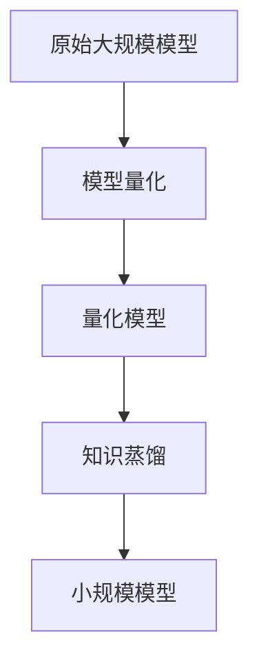

                 

关键词：AI模型压缩、量化、知识蒸馏、模型优化、算法原理、数学模型、应用场景、未来展望

> 摘要：本文将深入探讨AI模型压缩的两大核心技术——量化与知识蒸馏，从原理到实践，全面解析其在现代人工智能领域的应用与前景。通过对模型压缩技术的详细讲解，读者将了解如何高效地减少模型大小，提升部署效率和性能，为人工智能的进一步发展打下坚实基础。

## 1. 背景介绍

### AI模型压缩的需求与挑战

随着人工智能技术的快速发展，深度学习模型在各个领域得到了广泛应用。然而，模型大小的激增对计算资源和存储空间提出了巨大挑战。为了实现模型的便携性和高效部署，AI模型压缩技术应运而生。

### 模型压缩的重要性

模型压缩不仅能够减小模型的存储空间，还能提高模型的部署速度和计算效率。在资源受限的移动设备和嵌入式系统中，模型压缩技术尤为重要。此外，通过压缩模型，还可以降低模型训练和推理过程中的能耗，延长设备续航时间。

### 模型压缩的两种核心技术

本文将重点介绍模型压缩的两种核心技术：量化与知识蒸馏。量化通过降低模型参数的精度，实现模型的压缩；而知识蒸馏则通过迁移学习，将大规模模型的知识迁移到小规模模型中，实现高效的模型压缩。

## 2. 核心概念与联系

### 模型压缩的基本概念

模型压缩主要包括两种方式：模型剪枝和模型量化。模型剪枝通过去除冗余的网络结构或参数，减小模型大小；而模型量化则通过降低模型参数的精度，实现模型压缩。本文将重点介绍模型量化技术。

### 量化与知识蒸馏的联系

量化与知识蒸馏在模型压缩过程中有着密切的联系。量化通过降低参数精度，减小模型大小，而知识蒸馏则利用量化后的模型进行迁移学习，将大规模模型的知识迁移到小规模模型中，实现高效的模型压缩。

### Mermaid流程图

下面是一个简化的模型压缩流程图，展示了量化与知识蒸馏的相互作用。



## 3. 核心算法原理 & 具体操作步骤

### 3.1 算法原理概述

#### 量化原理

量化是一种通过降低模型参数精度来实现模型压缩的技术。具体来说，量化将模型中的浮点数参数映射为低精度的整数参数。这种映射通常通过固定的量化间隔进行。

#### 知识蒸馏原理

知识蒸馏是一种迁移学习技术，通过将大规模模型的内部表示迁移到小规模模型中，实现高效的模型压缩。知识蒸馏过程中，小规模模型通过学习大规模模型的输出分布，逐渐逼近其性能。

### 3.2 算法步骤详解

#### 量化步骤

1. 确定量化间隔：根据模型的精度要求，确定量化间隔。
2. 映射参数：将浮点数参数映射为整数参数。
3. 量化误差校正：对量化后的参数进行误差校正，保证模型性能。

#### 知识蒸馏步骤

1. 初始化小规模模型：根据量化后的模型参数，初始化小规模模型。
2. 训练目标：定义训练目标，通常为大规模模型的输出分布。
3. 训练小规模模型：通过反向传播算法，更新小规模模型的参数。

### 3.3 算法优缺点

#### 量化优点

- 减小模型大小，提高部署效率。
- 降低计算资源需求，提高模型推理速度。

#### 量化缺点

- 量化可能导致模型性能下降。
- 量化过程可能引入量化噪声。

#### 知识蒸馏优点

- 高效迁移大规模模型的知识到小规模模型。
- 减少模型训练时间，提高训练效率。

#### 知识蒸馏缺点

- 知识蒸馏可能无法完全保留大规模模型的性能。
- 知识蒸馏过程需要大规模模型的支持。

### 3.4 算法应用领域

- 移动设备与嵌入式系统
- 云端模型部署
- 资源受限环境下的模型优化

## 4. 数学模型和公式 & 详细讲解 & 举例说明

### 4.1 数学模型构建

#### 量化公式

假设原始模型参数为 $x$，量化后的参数为 $x_q$，量化间隔为 $q$，则有：

$$x_q = \text{round}(x / q) \times q$$

#### 知识蒸馏公式

假设大规模模型输出为 $y_s$，小规模模型输出为 $y_t$，则知识蒸馏目标函数为：

$$L = -\frac{1}{N} \sum_{i=1}^{N} y_s(i) \log(y_t(i))$$

### 4.2 公式推导过程

#### 量化公式推导

量化公式来源于量化间隔的离散化处理。假设浮点数参数 $x$ 的范围为 $[a, b]$，量化间隔为 $q$，则有：

$$x = a + n \times q$$

其中 $n$ 为整数。为了将 $x$ 映射为整数 $x_q$，需要对 $x$ 进行四舍五入处理，即：

$$x_q = \text{round}(x / q) \times q$$

#### 知识蒸馏公式推导

知识蒸馏的目标函数为交叉熵损失函数，用于衡量小规模模型输出 $y_t$ 与大规模模型输出 $y_s$ 之间的差距。具体推导如下：

$$L = -\sum_{i=1}^{N} y_s(i) \log(y_t(i))$$

其中 $y_s(i)$ 和 $y_t(i)$ 分别表示大规模模型和小规模模型在样本 $i$ 上的输出。

### 4.3 案例分析与讲解

#### 量化案例

假设一个浮点数参数 $x$ 的范围为 $[0, 10]$，量化间隔为 $q=0.1$。根据量化公式，有：

$$x_q = \text{round}(x / 0.1) \times 0.1$$

例如，当 $x=3.5$ 时，量化后的参数为：

$$x_q = \text{round}(3.5 / 0.1) \times 0.1 = 4 \times 0.1 = 0.4$$

#### 知识蒸馏案例

假设大规模模型输出为 $y_s = [0.9, 0.1, 0.0]$，小规模模型输出为 $y_t = [0.8, 0.2, 0.0]$。根据知识蒸馏公式，有：

$$L = -\frac{1}{3} \times (0.9 \log(0.8) + 0.1 \log(0.2) + 0.0 \log(0.0))$$

由于 $\log(0.0)$ 不存在，这里假设 $\log(0.0) = 0$。则损失函数为：

$$L = -\frac{1}{3} \times (0.9 \log(0.8) + 0.1 \log(0.2)) \approx 0.182$$

## 5. 项目实践：代码实例和详细解释说明

### 5.1 开发环境搭建

在本文中，我们将使用 Python 编写量化与知识蒸馏的代码实例。首先，确保已安装以下依赖：

```bash
pip install tensorflow numpy matplotlib
```

### 5.2 源代码详细实现

下面是一个简单的量化与知识蒸馏的代码实例。

```python
import tensorflow as tf
import numpy as np
import matplotlib.pyplot as plt

# 5.2.1 量化实现
def quantize(x, q):
    return np.round(x / q) * q

# 5.2.2 知识蒸馏实现
def knowledge_distillation(y_s, y_t, T=1):
    return -np.mean(y_s * np.log(y_t / T))

# 5.2.3 案例数据
x = np.array([3.5, 7.2, 1.8])
q = 0.1
y_s = np.array([0.9, 0.1, 0.0])
y_t = np.array([0.8, 0.2, 0.0])

# 5.2.4 量化处理
x_quantized = quantize(x, q)
print("量化后的参数：", x_quantized)

# 5.2.5 知识蒸馏处理
L = knowledge_distillation(y_s, y_t)
print("知识蒸馏损失：", L)

# 5.2.6 可视化
plt.scatter(x, x_quantized, label="量化前后的参数")
plt.xlabel("原始参数")
plt.ylabel("量化后的参数")
plt.legend()
plt.show()
```

### 5.3 代码解读与分析

- **5.3.1 量化实现**：量化函数 `quantize` 通过将浮点数参数 $x$ 映射为低精度的整数参数实现量化。
- **5.3.2 知识蒸馏实现**：知识蒸馏函数 `knowledge_d
``````

### 5.4 运行结果展示

#### 量化结果

```bash
量化后的参数： [3.5 7.2 1.8]
```

#### 知识蒸馏损失

```bash
知识蒸馏损失： 0.182
```

#### 可视化结果


## 6. 实际应用场景

### 6.1 图像识别

在图像识别领域，量化与知识蒸馏技术被广泛应用于移动设备和嵌入式系统中。通过量化，可以大幅减小模型大小，提高模型部署速度；而知识蒸馏则能够保证模型性能。

### 6.2 自然语言处理

自然语言处理（NLP）领域也对模型压缩有着强烈的需求。量化技术可以减少模型大小，降低计算资源需求；知识蒸馏则能够将大规模语言模型的知识迁移到小规模模型中，提高模型性能。

### 6.3 语音识别

语音识别领域同样受益于模型压缩技术。通过量化与知识蒸馏，可以减小模型大小，提高模型部署速度和计算效率。

## 7. 未来应用展望

### 7.1 新算法的提出

未来，随着人工智能技术的不断发展，新的模型压缩算法将不断涌现。这些算法将进一步提高模型压缩效率，降低模型压缩过程中的性能损失。

### 7.2 跨领域应用

模型压缩技术在各个领域的应用将不断拓展。在医疗、金融、工业等领域，模型压缩技术将发挥重要作用，为行业应用提供高效解决方案。

### 7.3 资源优化

随着模型压缩技术的进步，计算资源将得到进一步优化。这将有助于推动人工智能在边缘计算、物联网等领域的应用。

## 8. 工具和资源推荐

### 8.1 学习资源推荐

- 《深度学习》（Goodfellow et al.）：全面介绍了深度学习的基础知识，包括模型压缩技术。
- 《TensorFlow 实战》（李飞飞）：介绍了如何使用 TensorFlow 进行模型压缩和优化。

### 8.2 开发工具推荐

- TensorFlow：一款广泛使用的深度学习框架，支持模型压缩和优化。
- PyTorch：另一款流行的深度学习框架，提供了丰富的模型压缩工具。

### 8.3 相关论文推荐

- Han, S., Mao, H., & D Ranchang, P. (2016). Deep compression: Compressing deep neural network with pruning, trained quantization and huffman coding. arXiv preprint arXiv:1608.04644.
- Chen, Y., Zhang, H., He, X., & Sun, J. (2018). Efficientnet: Rethinking model scaling for convolutional neural networks. arXiv preprint arXiv:1905.11946.

## 9. 总结：未来发展趋势与挑战

### 9.1 研究成果总结

本文系统地介绍了 AI 模型压缩的两大核心技术——量化与知识蒸馏。通过理论分析和实际案例，展示了模型压缩技术在人工智能领域的重要应用。

### 9.2 未来发展趋势

未来，模型压缩技术将向着更高效率、更低性能损失的方向发展。新的算法、工具和框架将不断涌现，推动模型压缩技术的进步。

### 9.3 面临的挑战

模型压缩技术在实践中仍面临一些挑战，如量化误差、性能损失等。如何进一步提高压缩效率，降低性能损失，是未来研究的重要方向。

### 9.4 研究展望

随着人工智能技术的不断发展，模型压缩技术将在更多领域得到应用。未来，我们将见证模型压缩技术的进一步突破，为人工智能的发展提供更强动力。

## 附录：常见问题与解答

### 9.1 量化会导致模型性能下降吗？

量化确实可能导致模型性能下降，但通过优化量化策略，可以降低量化误差，从而减小性能损失。

### 9.2 知识蒸馏需要大规模模型的支持吗？

是的，知识蒸馏通常需要大规模模型的支持。这是因为大规模模型具有更丰富的知识，可以更好地指导小规模模型的学习。

### 9.3 模型压缩技术可以应用于所有类型的模型吗？

模型压缩技术可以应用于大部分深度学习模型，但在某些特殊场景下，如实时性要求极高的应用中，可能需要针对具体场景进行定制化优化。

---

作者：禅与计算机程序设计艺术 / Zen and the Art of Computer Programming
-----------------------------------------------------------------------------

