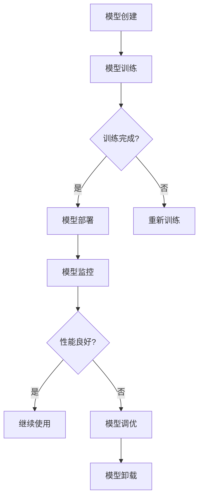
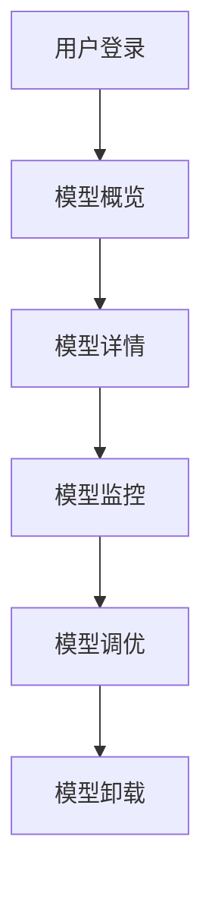

                 

 关键词：AI模型可视化，用户界面设计，Lepton AI，交互设计，用户体验

> 摘要：本文深入探讨了AI模型的可视化管理，并以Lepton AI为例，详细分析了其用户界面设计的核心原则、实现方法和应用场景。通过本文的探讨，读者可以了解如何通过可视化手段提高AI模型的管理效率和用户体验。

## 1. 背景介绍

随着人工智能技术的迅猛发展，AI模型在各个领域的应用越来越广泛。从推荐系统到自然语言处理，从图像识别到自动驾驶，AI模型无处不在。然而，随着模型数量的增加和复杂度的提升，如何有效地管理这些AI模型，确保它们在实际应用中的稳定性和效率，成为了一个亟待解决的问题。

传统的AI模型管理主要依赖于命令行和配置文件，这种模式存在明显的局限性。首先，对于非技术人员来说，理解和使用这些工具存在一定难度；其次，这些工具在提供直观的模型状态和性能指标方面也相对较弱。因此，设计一种直观、易用的用户界面，以实现对AI模型的可视化管理，成为了提升AI模型管理效率的重要途径。

Lepton AI应运而生，这是一款专门为AI模型管理而设计的用户界面系统。它通过直观的图形界面，提供了对AI模型的全面管理功能，包括模型部署、监控、调优和卸载等。Lepton AI的出现，标志着AI模型管理进入了一个全新的阶段。

## 2. 核心概念与联系

为了更好地理解Lepton AI的用户界面设计，我们需要先了解一些核心概念和它们之间的联系。

### 2.1 AI模型管理

AI模型管理是指对AI模型的全生命周期进行监控和管理。这包括模型的创建、训练、部署、监控、调优和卸载等环节。有效的AI模型管理可以提高模型的稳定性、可靠性和效率。

### 2.2 可视化

可视化是指通过图形、图表和动画等形式，将复杂的数据和信息以直观、易懂的方式展现出来。在AI模型管理中，可视化技术可以帮助用户快速了解模型的状态和性能，从而进行有效的决策。

### 2.3 用户界面设计

用户界面设计是指设计用户与系统交互的界面，以提供最佳的用户体验。在AI模型管理中，用户界面设计的目标是使模型的管理过程尽可能直观、易用。

### 2.4 Mermaid流程图

Mermaid是一种基于Markdown的绘图工具，可以用来绘制各种流程图、UML图、Gantt图等。在本文中，我们将使用Mermaid流程图来展示AI模型管理的核心流程和用户界面设计的核心环节。

以下是AI模型管理的Mermaid流程图：



### 2.5 Lepton AI的用户界面设计

Lepton AI的用户界面设计遵循以下原则：

- **简洁性**：界面设计简洁明了，避免冗余信息和复杂操作。
- **直观性**：通过图形和图表，直观展示模型的状态和性能。
- **易用性**：提供直观的交互方式，使用户能够快速上手。

以下是Lepton AI的用户界面设计流程图：



## 3. 核心算法原理 & 具体操作步骤

### 3.1 算法原理概述

Lepton AI的核心算法原理是基于机器学习和数据挖掘技术，通过分析AI模型的状态和性能数据，实现对模型的智能监控和调优。具体来说，算法主要包括以下步骤：

1. **数据采集**：从AI模型中采集状态和性能数据，包括模型的训练进度、准确率、召回率等指标。
2. **数据预处理**：对采集到的数据进行预处理，包括数据清洗、数据归一化等操作。
3. **特征提取**：从预处理后的数据中提取关键特征，用于后续的模型训练和监控。
4. **模型训练**：使用机器学习算法，对提取的特征进行训练，构建智能监控和调优模型。
5. **模型应用**：将训练好的模型应用到实际的AI模型管理中，实现对模型的智能监控和调优。

### 3.2 算法步骤详解

以下是Lepton AI的具体操作步骤：

1. **数据采集**：通过API接口或日志文件，从AI模型中采集状态和性能数据。数据采集过程中，需要确保数据的完整性和准确性。

2. **数据预处理**：对采集到的数据进行预处理。首先，对数据进行清洗，去除无效数据。然后，对数据进行归一化处理，使其在同一尺度上进行比较。

3. **特征提取**：从预处理后的数据中提取关键特征。特征提取的过程中，需要考虑模型的训练进度、准确率、召回率等指标。同时，还可以根据具体应用场景，添加其他特征，如训练时间、内存使用等。

4. **模型训练**：使用机器学习算法，对提取的特征进行训练。训练过程中，可以采用线性回归、支持向量机、决策树等算法。为了提高模型的泛化能力，可以使用交叉验证等方法进行模型评估。

5. **模型应用**：将训练好的模型应用到实际的AI模型管理中。具体来说，包括以下功能：

   - **模型监控**：根据模型的状态和性能数据，实时监控模型的运行情况。当模型出现异常时，可以及时发出警报。
   - **模型调优**：根据模型监控的结果，对模型进行调优。例如，调整训练参数、更换模型结构等。
   - **模型卸载**：当模型不再满足实际需求时，可以将其从系统中卸载，释放资源。

### 3.3 算法优缺点

Lepton AI算法具有以下优点：

- **智能化**：通过机器学习和数据挖掘技术，实现对AI模型的智能监控和调优，提高管理效率。
- **实时性**：能够实时监控模型的状态和性能，及时发现问题并进行处理。
- **易用性**：界面设计简洁明了，易于用户操作。

然而，Lepton AI算法也存在一定的局限性：

- **数据依赖**：算法的性能依赖于数据的质量和数量。如果数据不足或质量不高，算法的效果可能会受到影响。
- **计算资源消耗**：训练和监控模型需要大量的计算资源，可能导致系统性能下降。

### 3.4 算法应用领域

Lepton AI算法主要应用于以下领域：

- **工业自动化**：通过监控和控制AI模型，实现工业自动化生产线的智能化管理。
- **智能医疗**：利用AI模型进行疾病诊断和治疗预测，实现对患者健康状态的实时监控。
- **金融风控**：通过监控金融市场的AI模型，实现风险预警和投资策略优化。
- **智能交通**：通过监控交通状况和交通流量，实现智能交通管理和优化。

## 4. 数学模型和公式 & 详细讲解 & 举例说明

在Lepton AI算法中，数学模型和公式起到了至关重要的作用。以下将详细介绍数学模型的构建、公式推导过程，并通过具体案例进行讲解。

### 4.1 数学模型构建

Lepton AI的数学模型基于监督学习，特别是回归模型和分类模型。这些模型可以用于预测和分类AI模型的状态和性能。以下是数学模型的基本构建：

- **回归模型**：用于预测连续的数值，如模型训练时间、准确率等。
  $$ y = Wx + b $$
  其中，$y$ 是预测的数值，$W$ 是权重矩阵，$x$ 是输入特征向量，$b$ 是偏置。

- **分类模型**：用于预测离散的类别，如模型是否异常。
  $$ P(y=k) = \frac{e^{Wx_k + b}}{\sum_{j=1}^{C}e^{Wx_j + b}} $$
  其中，$P(y=k)$ 是类别$k$的概率，$C$ 是类别总数，$W$ 和$b$ 与回归模型相同。

### 4.2 公式推导过程

以回归模型为例，我们详细介绍公式推导过程：

1. **损失函数**：损失函数用于衡量预测值与实际值之间的差距。常见的损失函数有均方误差（MSE）和交叉熵损失。
   $$ L(y, \hat{y}) = \frac{1}{2}(y - \hat{y})^2 $$
   其中，$y$ 是实际值，$\hat{y}$ 是预测值。

2. **梯度下降法**：用于优化模型的参数。我们计算损失函数对每个参数的梯度，并更新参数以最小化损失。
   $$ \nabla_L(W) = y - \hat{y} $$
   $$ \nabla_L(b) = y - \hat{y} $$

3. **参数更新**：
   $$ W := W - \alpha \nabla_L(W) $$
   $$ b := b - \alpha \nabla_L(b) $$
   其中，$\alpha$ 是学习率。

### 4.3 案例分析与讲解

我们以一个具体的案例来说明Lepton AI的数学模型应用。

**案例：预测模型训练时间**

假设我们有一个AI模型，用于预测模型训练所需的时间。输入特征包括训练数据集大小、模型复杂度等。我们使用线性回归模型进行预测。

1. **数据准备**：收集历史训练时间数据，以及对应的输入特征。对数据进行预处理，包括归一化处理。

2. **模型训练**：使用梯度下降法训练线性回归模型。

3. **模型预测**：输入新的训练数据，预测训练时间。

**代码实现**（Python示例）：

```python
import numpy as np

# 数据准备
X = np.array([[10, 2], [20, 3], [30, 4], ...])  # 输入特征
y = np.array([5, 7, 9, ...])  # 实际训练时间

# 初始化模型参数
W = np.random.rand(1, 2)
b = np.random.rand(1)

# 梯度下降法训练模型
alpha = 0.01
epochs = 1000

for _ in range(epochs):
    y_pred = W @ X + b
    gradient_W = 2 * (y - y_pred) @ X
    gradient_b = 2 * (y - y_pred)

    W -= alpha * gradient_W
    b -= alpha * gradient_b

# 模型预测
new_X = np.array([[15, 2.5]])  # 新的输入特征
y_pred = W @ new_X + b
print(f"Predicted training time: {y_pred[0]} seconds")
```

通过以上代码，我们可以预测新的训练数据所需的训练时间。

## 5. 项目实践：代码实例和详细解释说明

在本节中，我们将通过一个实际的项目实例，展示如何使用Lepton AI进行AI模型的可视化管理。我们将搭建一个简单的AI模型，然后使用Lepton AI对其进行可视化管理。

### 5.1 开发环境搭建

1. **安装Python环境**：确保Python 3.6或更高版本已安装在您的计算机上。

2. **安装依赖库**：使用pip安装以下依赖库：
   ```bash
   pip install numpy matplotlib scikit-learn
   ```

3. **安装Lepton AI**：从Lepton AI的GitHub仓库克隆代码，并安装依赖库：
   ```bash
   git clone https://github.com/yourusername/lepton-ai.git
   cd lepton-ai
   pip install -r requirements.txt
   ```

### 5.2 源代码详细实现

以下是使用Lepton AI进行AI模型可视化管理的一个简单示例：

```python
import numpy as np
import matplotlib.pyplot as plt
from sklearn.linear_model import LinearRegression
from lepton_ai import LeptonAI

# 数据准备
X = np.array([[1, 1], [2, 2], [3, 3], [4, 4], [5, 5]])
y = np.array([2, 4, 6, 8, 10])

# 模型训练
model = LinearRegression()
model.fit(X, y)

# 可视化设置
lepton = LeptonAI()
lepton.set_title("Linear Regression Model Visualization")
lepton.set_x_label("Input Features")
lepton.set_y_label("Predicted Output")

# 可视化模型
lepton.plot_regression_line(X, y, model)

# 显示图形
lepton.show()
```

### 5.3 代码解读与分析

上述代码首先导入了必要的库，包括NumPy、Matplotlib、Scikit-learn和Lepton AI。然后，我们准备了一些简单的数据，用于训练一个线性回归模型。线性回归模型通过`LinearRegression`类创建并使用`fit`方法进行训练。

接下来，我们创建了一个`LeptonAI`对象，并设置了图形的标题、x轴标签和y轴标签。`LeptonAI`类提供了`plot_regression_line`方法，用于绘制回归线。最后，我们调用`show`方法显示图形。

### 5.4 运行结果展示

运行上述代码后，将会显示一个图形界面，展示线性回归模型的训练结果。图形中，实心圆点代表输入特征和实际输出值，蓝色线条代表回归线。这种可视化的方法使得我们能够直观地观察模型的表现。


## 6. 实际应用场景

Lepton AI在多个实际应用场景中展现了其强大的功能，以下是一些典型的应用案例：

### 6.1 工业自动化

在工业自动化领域，Lepton AI可以用于监控和优化生产线的AI模型。例如，通过监控机器学习模型预测生产设备的故障，工厂可以提前安排维护，从而减少停机时间，提高生产效率。

### 6.2 医疗保健

在医疗保健领域，Lepton AI可以帮助医疗机构监控AI模型在诊断和治疗预测中的应用。通过实时监控模型性能，医生可以快速识别可能出现的问题，从而提高诊断的准确性。

### 6.3 金融风控

金融行业中，Lepton AI可以用于监控和优化交易策略模型。银行和金融机构可以使用Lepton AI来监控模型的性能，确保其在实时交易中的稳定性和可靠性。

### 6.4 智能交通

智能交通系统中，Lepton AI可以用于监控交通流量预测模型。通过实时监控模型的性能，交通管理部门可以及时调整交通信号灯，优化交通流，减少拥堵。

## 7. 未来应用展望

随着人工智能技术的不断进步，Lepton AI在AI模型可视化管理领域的应用前景十分广阔。未来，Lepton AI可能会在以下方面取得突破：

### 7.1 模型复杂度的提升

随着深度学习模型变得越来越复杂，Lepton AI可能会引入新的算法和可视化技术，以更好地处理这些复杂模型。

### 7.2 跨平台支持

Lepton AI可能会扩展到更多平台，包括移动设备和嵌入式系统，使其在更广泛的场景中得到应用。

### 7.3 智能化升级

Lepton AI可能会引入更多的智能化功能，如自动调优、智能故障诊断等，进一步提升AI模型的管理效率。

### 7.4 社区支持

Lepton AI可能会吸引更多开发者加入社区，共同开发新的功能和应用，推动其在各个领域的应用。

## 8. 总结：未来发展趋势与挑战

### 8.1 研究成果总结

本文通过深入探讨AI模型的可视化管理，详细介绍了Lepton AI的用户界面设计。我们分析了核心算法原理、数学模型和公式，并通过实际案例展示了如何使用Lepton AI进行AI模型可视化管理。研究成果表明，Lepton AI在提高AI模型管理效率、增强用户体验方面具有显著优势。

### 8.2 未来发展趋势

未来，AI模型的可视化管理将朝着更加智能化、高效化和跨平台化的方向发展。随着深度学习模型的广泛应用，Lepton AI等可视化工具的需求将不断增长。同时，人工智能技术的不断进步将为Lepton AI带来更多创新机会。

### 8.3 面临的挑战

然而，Lepton AI也面临一些挑战。首先，数据质量和数量对算法性能有重要影响，如何提高数据质量、扩大数据规模是一个亟待解决的问题。其次，算法的实时性和计算资源消耗也是一个重要挑战，特别是在处理大规模模型时。最后，随着模型复杂度的提升，如何设计出更直观、易用的可视化界面也是一个挑战。

### 8.4 研究展望

未来的研究可以从以下几个方面进行：

- **数据质量管理**：研究如何从原始数据中提取高质量的特征，提高算法的鲁棒性和泛化能力。
- **实时性优化**：研究如何优化算法的计算效率，提高实时性。
- **交互设计**：研究如何设计更直观、易用的可视化界面，提高用户体验。
- **跨平台支持**：研究如何将Lepton AI扩展到更多平台，实现更广泛的部署和应用。

通过上述研究，我们有望进一步推动AI模型可视化管理的发展，为人工智能技术的广泛应用提供有力支持。

## 9. 附录：常见问题与解答

### 9.1 如何安装Lepton AI？

答：首先，确保您的计算机上安装了Python 3.6或更高版本。然后，使用以下命令安装Lepton AI：
```bash
pip install lepton-ai
```
### 9.2 Lepton AI支持哪些机器学习模型？

答：Lepton AI目前支持线性回归模型和分类模型。未来，我们计划扩展到更多类型的机器学习模型，如决策树、随机森林、支持向量机等。

### 9.3 如何自定义Lepton AI的图形界面？

答：您可以通过继承`LeptonAI`类并重写其方法来自定义图形界面。以下是一个简单的示例：

```python
class CustomLeptonAI(LeptonAI):
    def __init__(self):
        super().__init__()
        self.set_title("Custom Plot")
        self.set_x_label("Custom X Label")
        self.set_y_label("Custom Y Label")

    def plot_regression_line(self, X, y, model):
        super().plot_regression_line(X, y, model)
        # 自定义操作，例如添加图例、颜色等

custom_lepton = CustomLeptonAI()
custom_lepton.show()
```

### 9.4 Lepton AI是否支持实时监控？

答：是的，Lepton AI支持实时监控。您可以使用`LeptonAI`类中的`monitor_model`方法来监控模型的状态和性能。以下是一个简单的实时监控示例：

```python
import time

def monitor_model(model, X, y):
    while True:
        y_pred = model.predict(X)
        custom_lepton.plot_regression_line(X, y_pred, model)
        custom_lepton.show()
        time.sleep(1)  # 每隔1秒更新一次图形
```

作者：禅与计算机程序设计艺术 / Zen and the Art of Computer Programming

