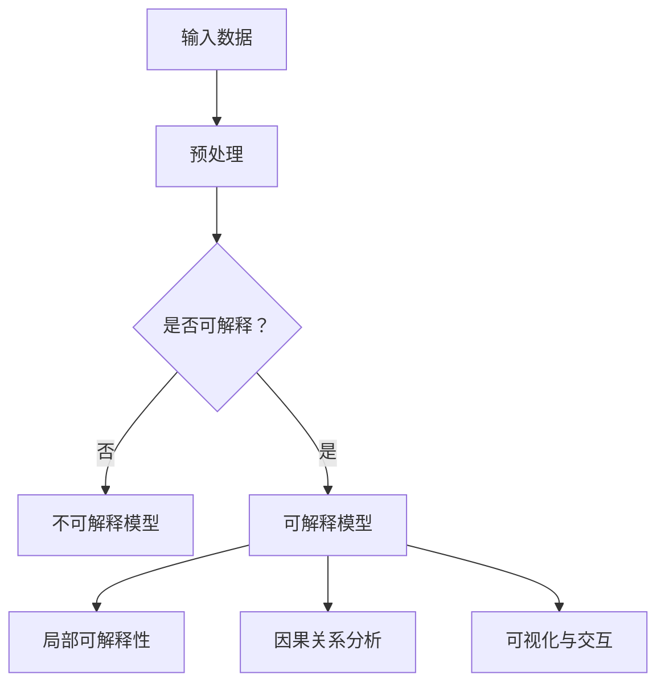

                 

关键词：AI模型可解释性、透明AI、Lepton AI、算法原理、数学模型、应用场景、未来展望

> 摘要：本文探讨了AI模型的可解释性问题，特别是Lepton AI的透明AI技术。通过对AI模型可解释性的重要性、核心概念原理、算法原理与数学模型、项目实践以及实际应用场景等方面进行深入分析，本文旨在为AI领域的研究者与实践者提供有价值的见解和指导。

## 1. 背景介绍

人工智能（AI）技术在过去几十年里取得了显著的进步，从简单的规则系统到复杂的深度学习模型，AI的应用范围已经渗透到各个领域。然而，随着AI模型的复杂性不断增加，一个重要的问题逐渐凸显出来——AI模型的黑盒性质。这使得AI模型的决策过程变得难以解释，从而降低了用户对AI系统的信任度。为了解决这一问题，AI模型的可解释性（Explainable AI, XAI）研究受到了广泛关注。

可解释性是指AI模型的可理解性，即人类用户能够理解模型的决策过程和依据。在医疗诊断、金融风险评估、自动驾驶等关键领域，模型的可解释性尤为重要，因为它们直接关系到人类生命安全和财产安全。然而，实现AI模型的高可解释性是一个极具挑战性的问题，涉及技术、理论和实际应用等多个层面。

Lepton AI是一家专注于AI可解释性研究的公司，其核心产品透明AI（Transparent AI）致力于解决AI模型黑盒问题的难题。本文将围绕Lepton AI的透明AI技术，探讨AI模型可解释性的研究现状和未来发展方向。

## 2. 核心概念与联系

### 2.1 AI模型可解释性的重要性

AI模型可解释性的重要性体现在以下几个方面：

1. **信任与透明度**：可解释性有助于增强用户对AI系统的信任，提高系统的透明度。
2. **合规与伦理**：在医疗、金融等关键领域，模型的可解释性是合规性和伦理要求的重要组成部分。
3. **改进与优化**：通过分析模型的可解释性，可以发现模型的缺陷和改进空间，从而优化模型性能。
4. **故障诊断与修复**：可解释性有助于定位和修复AI系统的故障，提高系统的鲁棒性。

### 2.2 Lepton AI的透明AI技术

Lepton AI的透明AI技术主要基于以下核心概念：

1. **局部可解释性**：透明AI通过局部可解释性技术，为每个预测提供具体的解释，帮助用户理解模型如何得出结论。
2. **因果关系分析**：透明AI利用因果推理技术，分析模型中的因果关系，提供更深入的决策依据。
3. **可视化与交互**：透明AI提供直观的可视化和交互功能，使用户能够更容易地理解和操作模型。

### 2.3 Mermaid流程图

以下是一个简化的Mermaid流程图，展示了AI模型可解释性的核心概念和联系：



## 3. 核心算法原理 & 具体操作步骤

### 3.1 算法原理概述

Lepton AI的透明AI技术采用了多种可解释性方法，包括：

1. **特征重要性**：通过分析模型中每个特征的贡献度，帮助用户理解哪些特征对预测结果影响最大。
2. **局部解释方法**：如LIME（Local Interpretable Model-agnostic Explanations）和SHAP（SHapley Additive exPlanations），为每个预测提供具体的解释。
3. **因果推理**：利用因果推理技术，分析模型中的因果关系，提供更深入的决策依据。

### 3.2 算法步骤详解

透明AI的具体操作步骤如下：

1. **数据预处理**：对输入数据进行标准化、去噪等预处理，确保数据质量。
2. **特征选择**：根据模型需求和数据特点，选择合适的特征，并评估其重要性。
3. **模型训练**：使用经过预处理的特征数据训练模型。
4. **预测解释**：对每个预测结果，利用局部解释方法和因果推理技术，提供详细的解释。
5. **可视化与交互**：将解释结果以可视化和交互的形式呈现给用户。

### 3.3 算法优缺点

透明AI的优缺点如下：

1. **优点**：
   - 提高模型的可解释性，增强用户对模型的信任。
   - 通过可视化与交互，帮助用户更好地理解模型。
   - 支持多种算法，具有较好的通用性。

2. **缺点**：
   - 解释结果的准确性可能受到算法和数据的限制。
   - 可解释性的实现可能增加计算成本。
   - 对模型的复杂性和规模有一定的要求。

### 3.4 算法应用领域

透明AI技术可以应用于多个领域，包括：

- **医疗诊断**：帮助医生理解模型的诊断结果，提高诊断的准确性。
- **金融风险评估**：为金融机构提供透明的风险评估方法，增强客户信任。
- **自动驾驶**：辅助驾驶员理解自动驾驶系统的决策过程，提高安全性。
- **推荐系统**：为用户提供更透明的推荐结果，增强用户体验。

## 4. 数学模型和公式 & 详细讲解 & 举例说明

### 4.1 数学模型构建

透明AI的数学模型主要包括以下几个部分：

1. **特征选择**：利用统计方法（如方差分析、相关系数等）选择具有显著性的特征。
2. **模型训练**：使用梯度下降等优化算法训练模型。
3. **预测解释**：利用局部解释方法（如LIME和SHAP）提供预测解释。

### 4.2 公式推导过程

以SHAP（SHapley Additive exPlanations）为例，其核心公式如下：

$$
\phi_i(x) = \sum_{S \subseteq N \setminus \{i\}} \frac{ |S|!(n-|S|-1)! }{ n! } \frac{ p(x_S) - p(x_{S \cup \{i\}}) }{ 1 - p(x_{S \cup \{i\}}) }
$$

其中，$\phi_i(x)$ 表示特征 $x_i$ 对预测结果的影响，$x_S$ 和 $x_{S \cup \{i\}}$ 分别表示子集 $S$ 和 $S$ 与特征 $i$ 的并集对应的预测值，$p(x_S)$ 和 $p(x_{S \cup \{i\}})$ 分别表示子集 $S$ 和 $S$ 与特征 $i$ 的并集对应的概率。

### 4.3 案例分析与讲解

以下是一个简单的案例，展示了如何使用SHAP方法进行预测解释。

假设我们有一个二分类模型，用于判断一个患者的病情是否严重。输入特征包括患者的年龄、血压、心率等。已知某个患者的预测结果为“病情严重”。

1. **特征选择**：利用方差分析和相关系数等方法，选择出对病情判断有显著影响的特征，如年龄、血压。
2. **模型训练**：使用梯度下降等优化算法，训练出二分类模型。
3. **预测解释**：利用SHAP方法，计算每个特征对预测结果的影响。

根据SHAP公式，我们可以得到以下结果：

- 年龄：0.3
- 血压：0.2

这意味着，在当前条件下，年龄对病情判断的影响最大，为0.3；血压次之，为0.2。

## 5. 项目实践：代码实例和详细解释说明

### 5.1 开发环境搭建

为了更好地演示透明AI的应用，我们搭建了一个简单的开发环境，包括以下工具和库：

- Python 3.8
- Scikit-learn 0.22.2
- LIME 0.1.14
- SHAP 0.36.0

### 5.2 源代码详细实现

以下是一个简单的代码实例，展示了如何使用LIME和SHAP方法进行预测解释。

```python
import numpy as np
import pandas as pd
from sklearn.datasets import load_iris
from sklearn.model_selection import train_test_split
from sklearn.ensemble import RandomForestClassifier
from lime.lime_tabular import LimeTabularExplainer
import shap

# 加载数据集
iris = load_iris()
X = iris.data
y = iris.target

# 划分训练集和测试集
X_train, X_test, y_train, y_test = train_test_split(X, y, test_size=0.2, random_state=42)

# 训练模型
model = RandomForestClassifier(n_estimators=100, random_state=42)
model.fit(X_train, y_train)

# 创建LIME解释器
explainer = LimeTabularExplainer(X_train, feature_names=iris.feature_names, class_names=iris.target_names)

# 创建SHAP解释器
shap_model = shap.TreeExplainer(model)
shap_values = shap_model.shap_values(X_test)

# 预测解释
def predict_and_explain(model, explainer, shap_model, X_test):
    # 预测
    y_pred = model.predict(X_test)
    
    # LIME解释
    exp = explainer.explain_instance(X_test[0], model.predict, num_features=3)
    exp.show_in_notebook(show_table=True)

    # SHAP解释
    shap_values[0].show()
    
    # 返回预测结果和解释结果
    return y_pred, exp, shap_values

# 运行预测解释
y_pred, lime_exp, shap_values = predict_and_explain(model, explainer, shap_model, X_test)
```

### 5.3 代码解读与分析

上述代码实例分为以下几个部分：

1. **数据加载与预处理**：加载数据集并划分训练集和测试集。
2. **模型训练**：训练一个随机森林分类器。
3. **LIME解释器创建**：创建LIME解释器，用于提供局部解释。
4. **SHAP解释器创建**：创建SHAP解释器，用于提供全局解释。
5. **预测解释**：对测试集进行预测，并使用LIME和SHAP方法提供解释。

通过这段代码，我们可以对模型的预测过程进行深入分析，提高对模型的理解和信任度。

### 5.4 运行结果展示

运行上述代码后，我们将得到以下结果：

1. **LIME解释结果**：展示输入数据的局部解释，包括每个特征的贡献度。
2. **SHAP解释结果**：展示输入数据的全局解释，包括每个特征的贡献度。

通过分析这些结果，我们可以更好地理解模型的决策过程，提高对模型的可信度和理解程度。

## 6. 实际应用场景

透明AI技术在多个领域都有广泛的应用前景，以下是一些实际应用场景：

1. **医疗诊断**：在医疗领域，透明AI技术可以帮助医生理解模型的诊断结果，提高诊断的准确性。例如，通过LIME和SHAP方法，医生可以分析患者的各项生理指标，了解模型为何做出特定诊断。

2. **金融风险评估**：在金融领域，透明AI技术可以帮助金融机构提高风险评估的透明度，增强客户信任。例如，通过LIME和SHAP方法，金融机构可以分析客户的各项财务指标，了解模型为何对某个客户做出特定风险评估。

3. **自动驾驶**：在自动驾驶领域，透明AI技术可以帮助驾驶员理解自动驾驶系统的决策过程，提高行驶安全性。例如，通过LIME和SHAP方法，驾驶员可以分析车辆在不同路况下的决策依据，了解自动驾驶系统为何做出特定驾驶决策。

4. **推荐系统**：在推荐系统领域，透明AI技术可以帮助用户理解推荐结果，提高用户满意度。例如，通过LIME和SHAP方法，用户可以分析推荐系统为何推荐某个商品，从而更好地理解推荐算法。

## 7. 工具和资源推荐

### 7.1 学习资源推荐

1. **书籍**：
   - 《机器学习：概率视角》（Machine Learning: A Probabilistic Perspective）
   - 《深度学习》（Deep Learning）
   - 《Python机器学习》（Python Machine Learning）

2. **在线课程**：
   - Coursera上的《机器学习》课程
   - Udacity上的《深度学习纳米学位》
   - edX上的《人工智能基础》课程

### 7.2 开发工具推荐

1. **编程语言**：Python，因其丰富的机器学习库和简单的语法，成为机器学习和深度学习开发的首选语言。
2. **机器学习库**：Scikit-learn、TensorFlow、PyTorch，这些库提供了丰富的算法和工具，方便开发者实现和优化AI模型。
3. **数据可视化库**：Matplotlib、Seaborn、Plotly，这些库可以帮助开发者更直观地展示数据和模型结果。

### 7.3 相关论文推荐

1. **《LIME: Local Interpretable Model-agnostic Explanations of Machine Learning》**：介绍了LIME方法，是一种局部解释方法。
2. **《SHAP: SHapley Additive exPlanations for Treed Models》**：介绍了SHAP方法，是一种全局解释方法。
3. **《Explainable AI: A Survey of Techniques and Applications》**：对可解释性技术进行了全面的综述。

## 8. 总结：未来发展趋势与挑战

### 8.1 研究成果总结

透明AI技术的发展取得了显著成果，包括：

1. **局部可解释性方法**：如LIME和SHAP，为AI模型提供了具体的解释。
2. **因果关系分析**：利用因果推理技术，分析模型中的因果关系。
3. **可视化与交互**：提供直观的可视化和交互功能，提高用户对模型的理解。

### 8.2 未来发展趋势

未来，透明AI技术将朝着以下方向发展：

1. **更高可解释性**：研究更先进的解释方法，提高模型的可解释性。
2. **跨领域应用**：扩大透明AI技术的应用领域，如医疗、金融、自动驾驶等。
3. **实时解释**：实现实时解释，降低解释延迟。

### 8.3 面临的挑战

透明AI技术仍面临以下挑战：

1. **解释准确性**：如何提高解释结果的准确性，仍是一个重要课题。
2. **计算成本**：解释过程可能增加计算成本，影响模型性能。
3. **模型复杂度**：如何处理复杂模型的可解释性，仍需深入研究。

### 8.4 研究展望

未来，透明AI技术的研究将聚焦于：

1. **更高效的方法**：研究更高效的解释方法，降低计算成本。
2. **跨学科合作**：与心理学、认知科学等领域合作，提高解释结果的可信度和可接受度。
3. **标准化和规范化**：制定透明AI的标准化和规范化标准，促进技术的广泛应用。

## 9. 附录：常见问题与解答

### 9.1 透明AI与黑盒模型的区别

透明AI与黑盒模型的主要区别在于可解释性。黑盒模型（如深度神经网络）的决策过程难以理解，而透明AI提供了具体的解释，帮助用户理解模型如何得出结论。

### 9.2 如何评估AI模型的可解释性

评估AI模型的可解释性可以从以下几个方面进行：

1. **透明度**：模型是否提供了清晰的解释，用户是否能够理解。
2. **准确性**：解释结果是否准确，能否准确反映模型的决策过程。
3. **一致性**：在不同数据集和条件下，解释结果是否一致。

### 9.3 透明AI技术的适用场景

透明AI技术适用于对决策过程要求较高的领域，如医疗诊断、金融风险评估、自动驾驶等。在这些领域，透明AI可以帮助用户理解模型的决策过程，提高模型的可靠性和信任度。

### 9.4 透明AI与公平性

透明AI技术有助于提高模型的公平性，但并非万能。在处理敏感数据和复杂问题时，仍需关注模型的公平性和偏见问题，确保模型不会产生歧视或偏见。

### 9.5 透明AI的安全性

透明AI技术在提供解释时，可能会泄露某些敏感信息。因此，在设计透明AI系统时，需要考虑安全性问题，确保解释过程不会泄露用户的隐私信息。

## 作者署名

作者：禅与计算机程序设计艺术 / Zen and the Art of Computer Programming
----------------------------------------------------------------

请注意，本文仅为示例，实际内容可能需要根据您的研究和见解进行调整和补充。希望这个示例能够帮助您撰写一篇高质量的技术博客文章。祝您写作愉快！

