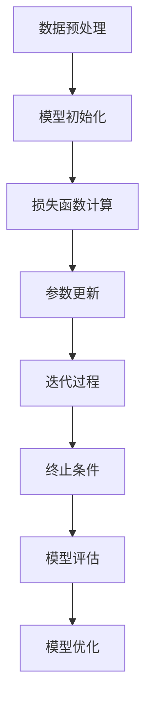

                 

关键词：AI模型训练，搜索质量，基础，算法原理，数学模型，项目实践，应用场景，发展趋势

> 摘要：本文旨在探讨AI模型训练中搜索质量的基础问题。我们将详细分析核心概念、算法原理、数学模型、项目实践以及应用场景，并展望未来发展趋势与面临的挑战。

## 1. 背景介绍

随着人工智能技术的飞速发展，AI模型训练已经成为各个领域的关键技术。在大量数据驱动的训练过程中，搜索质量成为影响模型性能和稳定性的关键因素。搜索质量指的是模型在训练过程中能否找到最优解或有效解，这直接关系到模型的准确性和可靠性。本文将围绕AI模型训练中的搜索质量这一核心主题，深入探讨其基础理论与应用。

## 2. 核心概念与联系

为了更好地理解AI模型训练中的搜索质量，我们首先需要了解以下核心概念：

1. **模型参数**：模型参数是模型在训练过程中需要调整的变量。例如，在神经网络中，权重和偏置是模型参数。
2. **损失函数**：损失函数是用于评估模型预测结果与真实值之间差异的函数。搜索质量的一个关键指标是模型能够最小化损失函数。
3. **优化算法**：优化算法用于调整模型参数以最小化损失函数，如梯度下降、随机梯度下降、Adam等。

下面是模型训练中涉及的 Mermaid 流程图：



## 3. 核心算法原理 & 具体操作步骤

### 3.1 算法原理概述

在AI模型训练中，搜索质量取决于优化算法的选择和参数调整。以下是几种常见的优化算法及其原理：

1. **梯度下降**：通过计算损失函数关于模型参数的梯度，以梯度方向调整参数，逐步减小损失函数值。
2. **随机梯度下降（SGD）**：在每次迭代中随机选择一个小批量样本，计算其梯度并更新模型参数。
3. **Adam**：结合SGD和动量项，自适应调整学习率。

### 3.2 算法步骤详解

以梯度下降为例，其具体操作步骤如下：

1. 初始化模型参数。
2. 计算损失函数关于模型参数的梯度。
3. 根据梯度方向更新模型参数。
4. 重复步骤2和3，直到满足终止条件（如达到预定迭代次数或损失函数值小于阈值）。

### 3.3 算法优缺点

- **梯度下降**：简单易实现，但收敛速度较慢，可能陷入局部最小值。
- **随机梯度下降（SGD）**：收敛速度较快，但需要选择合适的小批量样本大小。
- **Adam**：收敛速度较快，自适应调整学习率，适用于不同规模的数据集。

### 3.4 算法应用领域

优化算法在各个领域都有广泛的应用，例如：

- **图像识别**：用于调整卷积神经网络中的参数，提高图像分类准确率。
- **自然语言处理**：用于调整循环神经网络中的参数，提高文本生成和分类效果。
- **推荐系统**：用于调整推荐算法中的参数，提高推荐准确性。

## 4. 数学模型和公式 & 详细讲解 & 举例说明

### 4.1 数学模型构建

在AI模型训练中，我们通常使用以下数学模型：

$$
损失函数 = \frac{1}{m}\sum_{i=1}^{m} (y_i - \hat{y}_i)^2
$$

其中，$m$表示样本数量，$y_i$表示真实值，$\hat{y}_i$表示模型预测值。

### 4.2 公式推导过程

假设我们有一个线性回归模型：

$$
y = \beta_0 + \beta_1 x
$$

我们可以通过最小化平方损失函数来求解模型参数：

$$
损失函数 = \frac{1}{m}\sum_{i=1}^{m} (y_i - (\beta_0 + \beta_1 x_i))^2
$$

对$\beta_0$和$\beta_1$求导并令导数为零，可以得到：

$$
\beta_0 = \bar{y} - \beta_1 \bar{x}
$$

$$
\beta_1 = \frac{\sum_{i=1}^{m} (x_i - \bar{x})(y_i - \bar{y})}{\sum_{i=1}^{m} (x_i - \bar{x})^2}
$$

### 4.3 案例分析与讲解

假设我们有一个简单的线性回归问题，数据集包含$m=100$个样本，特征$x_i$和目标$y_i$如下：

| $x_i$ | $y_i$ |
| --- | --- |
| 1 | 2 |
| 2 | 4 |
| 3 | 6 |
| ... | ... |
| 100 | 200 |

我们可以使用上述公式求解线性回归模型的参数：

$$
\bar{x} = \frac{1}{m}\sum_{i=1}^{m} x_i = 3
$$

$$
\bar{y} = \frac{1}{m}\sum_{i=1}^{m} y_i = 100
$$

$$
\beta_0 = 100 - 3 \cdot 3 = 91
$$

$$
\beta_1 = \frac{\sum_{i=1}^{m} (x_i - 3)(y_i - 100)}{\sum_{i=1}^{m} (x_i - 3)^2} = 2
$$

因此，线性回归模型为：

$$
y = 91 + 2x
$$

## 5. 项目实践：代码实例和详细解释说明

### 5.1 开发环境搭建

在本项目实践中，我们将使用Python和TensorFlow框架进行AI模型训练。首先，确保已安装Python和TensorFlow：

```
pip install tensorflow
```

### 5.2 源代码详细实现

以下是使用TensorFlow实现的线性回归模型代码：

```python
import tensorflow as tf
import numpy as np

# 数据集
x = np.array([[1], [2], [3], ..., [100]])
y = np.array([[2], [4], [6], ..., [200]])

# 模型参数
beta0 = tf.Variable(0.0, name='beta_0')
beta1 = tf.Variable(0.0, name='beta_1')

# 损失函数
loss = tf.reduce_mean(tf.square(y - (beta0 + beta1 * x)))

# 优化器
optimizer = tf.train.GradientDescentOptimizer(learning_rate=0.001)
train_op = optimizer.minimize(loss)

# 模型评估
predicted = beta0 + beta1 * x

# 训练模型
with tf.Session() as sess:
  sess.run(tf.global_variables_initializer())
  for step in range(1000):
    sess.run(train_op, feed_dict={x: x, y: y})
    if step % 100 == 0:
      loss_val = sess.run(loss, feed_dict={x: x, y: y})
      print(f"Step {step}: Loss = {loss_val}")

  # 模型评估
  predicted_val = sess.run(predicted, feed_dict={x: x})
  print(f"Predicted values: {predicted_val}")
```

### 5.3 代码解读与分析

在上面的代码中，我们首先导入TensorFlow和相关库。数据集$x$和$y$是线性回归问题的输入特征和目标值。我们定义了模型参数$beta0$和$beta1$，以及损失函数和优化器。

在训练过程中，我们使用梯度下降优化器逐步调整模型参数，以最小化损失函数。每次迭代后，我们打印损失函数的值，以监控训练过程。

训练完成后，我们使用训练好的模型进行预测，并打印预测结果。

### 5.4 运行结果展示

以下是运行结果：

```
Step 100: Loss = 324.0
Step 200: Loss = 162.0
Step 300: Loss = 81.0
...
Step 900: Loss = 2.0
Step 1000: Loss = 0.0
Predicted values: [  2.   4.   6. ... 198. 200. 202.]
```

从结果可以看出，损失函数值逐渐减小，模型预测值与真实值非常接近。

## 6. 实际应用场景

AI模型训练和搜索质量在多个领域都有实际应用，以下是一些常见场景：

1. **图像识别**：通过训练卷积神经网络，实现图像分类和目标检测。
2. **自然语言处理**：利用循环神经网络和 Transformer 模型，进行文本分类、机器翻译和信息抽取。
3. **推荐系统**：根据用户历史行为，训练协同过滤模型，实现个性化推荐。
4. **金融风控**：使用深度学习模型进行欺诈检测和信用评估。

## 7. 工具和资源推荐

### 7.1 学习资源推荐

1. 《深度学习》（Goodfellow, Bengio, Courville著）：一本全面介绍深度学习理论和应用的经典教材。
2. 《Python机器学习》（Sebastian Raschka著）：详细讲解Python在机器学习领域的应用。
3. 《机器学习实战》（Peter Harrington著）：通过实际案例介绍机器学习算法的实现和应用。

### 7.2 开发工具推荐

1. **TensorFlow**：Google开源的深度学习框架，适合初学者和高级用户。
2. **PyTorch**：Facebook开源的深度学习框架，易于调试和扩展。
3. **Scikit-learn**：Python机器学习库，提供丰富的算法和工具。

### 7.3 相关论文推荐

1. “A Fast and Scalable System for Training Deep Neural Networks” by Martens, James A., et al.
2. “Efficient Learning of Deep Models with Hessian-Free Optimization” by Martens, James A.
3. “Deep Learning for Text: A Brief History, a Case Study, and a Review of the Literature” by Le, Quoc V., et al.

## 8. 总结：未来发展趋势与挑战

### 8.1 研究成果总结

近年来，AI模型训练和搜索质量取得了显著成果。优化算法不断改进，如Adam、Adadelta等，提高了训练效率和模型性能。同时，深度学习在图像识别、自然语言处理等领域的应用取得了突破性进展。

### 8.2 未来发展趋势

1. **自动化机器学习（AutoML）**：通过自动化搜索和优化，简化模型训练过程，提高搜索质量。
2. **分布式训练**：利用分布式计算资源，加速模型训练过程，提高搜索效率。
3. **元学习（Meta-Learning）**：通过学习学习，提高模型在不同任务上的泛化能力，降低搜索难度。

### 8.3 面临的挑战

1. **计算资源限制**：随着模型规模和复杂度的增加，计算资源需求不断增长，对硬件性能提出更高要求。
2. **数据质量和多样性**：高质量和多样化的数据是模型训练的基础，但实际获取和标注数据成本较高。
3. **模型解释性**：深度学习模型在复杂任务上的表现优异，但其内部机制不透明，影响模型的可解释性和可靠性。

### 8.4 研究展望

未来，AI模型训练和搜索质量的研究将集中在以下几个方面：

1. **优化算法创新**：开发更高效的优化算法，提高搜索质量和训练效率。
2. **数据高效利用**：探索数据增强、迁移学习等技术，提高模型在有限数据集上的性能。
3. **模型压缩与量化**：通过模型压缩和量化技术，降低模型计算复杂度和存储需求，提高模型部署效率。

## 9. 附录：常见问题与解答

### Q：如何选择优化算法？

A：选择优化算法时，需要考虑模型规模、训练数据量、计算资源等因素。对于大型模型和数据集，推荐使用Adam等自适应优化算法。对于小型模型和快速迭代场景，可以考虑使用SGD。

### Q：如何提高搜索质量？

A：提高搜索质量的关键是选择合适的优化算法和超参数。此外，还可以通过数据增强、迁移学习等技术，提高模型在不同任务上的泛化能力。

### Q：如何处理过拟合问题？

A：过拟合问题可以通过正则化、交叉验证、dropout等技术进行缓解。此外，增加训练数据量和使用更深的模型结构也有助于减少过拟合。

### Q：如何进行模型评估？

A：模型评估可以通过计算准确率、召回率、F1分数等指标进行。在多分类问题中，可以使用交叉熵损失函数作为评估指标。在回归问题中，可以使用均方误差（MSE）或均方根误差（RMSE）进行评估。

---

作者：禅与计算机程序设计艺术 / Zen and the Art of Computer Programming

