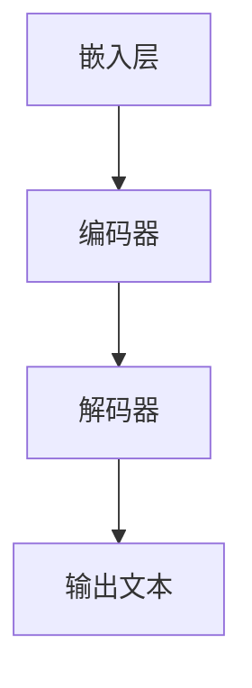

                 

关键词：人工智能，AI浪潮，ChatGPT，局限，自我修正，技术挑战

> 摘要：随着人工智能（AI）技术的快速发展，ChatGPT等大型语言模型引起了广泛关注。然而，这些模型在性能、应用和安全性方面存在一定的局限性。本文将深入探讨AI浪潮的持续影响，分析ChatGPT的局限性，并提出可能的自我修正策略。通过本文的阅读，读者将更好地理解AI技术的潜力和挑战。

## 1. 背景介绍

近年来，人工智能（AI）技术取得了显著的进展，从简单的规则系统到复杂的学习算法，再到具有自适应能力的智能系统，AI技术正逐渐改变我们的生活方式。特别是在自然语言处理（NLP）领域，大型语言模型如ChatGPT的涌现，使得机器理解人类语言的能力达到了前所未有的高度。ChatGPT是由OpenAI开发的一个基于变换器（Transformer）架构的预训练语言模型，它利用大量的文本数据进行训练，从而实现了对自然语言的高效理解和生成。

然而，尽管ChatGPT等大型语言模型在某些方面取得了令人瞩目的成果，但其局限性也日益显现。本文将重点关注ChatGPT的局限性，并探讨如何通过自我修正来应对这些挑战。

## 2. 核心概念与联系

### 2.1 AI技术概述

人工智能（AI）是一种模拟人类智能行为的计算机技术。它涵盖了多个子领域，包括机器学习、深度学习、自然语言处理、计算机视觉等。其中，机器学习和深度学习是AI技术中的核心组成部分。

机器学习是一种让计算机通过数据学习来完成任务的技术，它主要包括监督学习、无监督学习和强化学习等方法。深度学习则是机器学习的一个子领域，它通过构建多层神经网络来对数据进行学习和预测。

自然语言处理（NLP）是AI技术在处理人类语言方面的应用，它涉及到文本分析、语义理解、语言生成等多个方面。计算机视觉则是AI技术在图像和视频处理方面的应用，它涉及到目标检测、图像分类、图像生成等多个方面。

### 2.2 ChatGPT架构

ChatGPT是一种基于变换器（Transformer）架构的大型语言模型。变换器是一种深度学习模型，它通过多头注意力机制来处理序列数据，从而实现了对输入文本的高效理解和生成。

ChatGPT的架构主要包括以下几个部分：

1. **嵌入层**：将输入文本转化为向量表示。
2. **编码器**：通过变换器架构对输入文本进行编码，生成固定长度的编码向量。
3. **解码器**：根据编码向量生成输出文本。

### 2.3 核心概念原理与架构的Mermaid流程图



## 3. 核心算法原理 & 具体操作步骤

### 3.1 算法原理概述

ChatGPT的核心算法基于变换器（Transformer）架构。变换器模型由编码器和解码器两个部分组成。编码器负责将输入文本编码为固定长度的向量，解码器则根据编码向量生成输出文本。

变换器模型的关键在于其多头注意力机制。多头注意力机制通过将输入序列划分为多个子序列，并分别计算每个子序列的重要性，从而实现了对输入文本的全面理解。

### 3.2 算法步骤详解

1. **嵌入层**：将输入文本转化为向量表示。
   - 输入文本经过词嵌入层，将每个单词转化为对应的向量表示。
   - 输入序列中的每个单词向量经过位置编码，以保留文本中的顺序信息。

2. **编码器**：通过变换器架构对输入文本进行编码。
   - 编码器由多个变换器层组成，每层由多头注意力机制和前馈网络构成。
   - 每层多头注意力机制计算输入序列中每个单词的重要性，生成编码向量。

3. **解码器**：根据编码向量生成输出文本。
   - 解码器同样由多个变换器层组成，每层由多头注意力机制和前馈网络构成。
   - 解码器在生成输出文本时，会参考编码向量以及之前生成的部分文本，以生成连贯的输出。

### 3.3 算法优缺点

**优点**：
- **高效理解**：通过多头注意力机制，ChatGPT能够高效地理解输入文本的含义。
- **生成能力**：ChatGPT具有较强的文本生成能力，可以生成高质量的自然语言文本。
- **多任务处理**：ChatGPT可以应用于多种自然语言处理任务，如问答、翻译、文本生成等。

**缺点**：
- **计算资源需求大**：ChatGPT需要大量的计算资源和存储空间，对于普通用户来说，部署和使用较为困难。
- **数据依赖性高**：ChatGPT的训练和优化依赖于大量的高质量数据，数据不足或质量差可能导致性能下降。

### 3.4 算法应用领域

ChatGPT在多个领域取得了显著的应用成果，主要包括：

- **自然语言处理**：ChatGPT可以用于文本分类、情感分析、命名实体识别等任务。
- **对话系统**：ChatGPT可以用于构建智能对话系统，如客服机器人、聊天机器人等。
- **文本生成**：ChatGPT可以用于生成文章、故事、报告等文本内容。
- **机器翻译**：ChatGPT可以用于机器翻译任务，实现跨语言交流。

## 4. 数学模型和公式 & 详细讲解 & 举例说明

### 4.1 数学模型构建

ChatGPT的数学模型主要基于变换器（Transformer）架构。变换器模型的核心是多头注意力机制，其数学表达式如下：

\[ \text{Attention}(Q, K, V) = \frac{1}{\sqrt{d_k}} \text{softmax}\left(\frac{QK^T}{d_k}\right) V \]

其中，\( Q, K, V \) 分别为查询向量、键向量和值向量，\( d_k \) 为键向量的维度。

### 4.2 公式推导过程

多头注意力机制的推导过程可以分为以下几个步骤：

1. **输入文本的嵌入**：将输入文本转化为向量表示，即 \( X = \{x_1, x_2, ..., x_n\} \)。

2. **查询向量、键向量和值向量的计算**：通过线性变换，将嵌入层中的输入向量映射为查询向量 \( Q \)，键向量 \( K \) 和值向量 \( V \)。

3. **注意力分数的计算**：根据公式 \( \text{Attention}(Q, K, V) \)，计算每个键向量对查询向量的重要性分数。

4. **加权求和**：根据注意力分数，对值向量进行加权求和，生成编码向量。

5. **解码器的处理**：解码器重复上述步骤，生成输出文本。

### 4.3 案例分析与讲解

假设我们有一个简单的文本序列 \( X = \{\text{"我爱北京天安门"}\} \)，我们希望使用ChatGPT来生成一个与该文本相关的输出序列。

1. **嵌入层**：将文本序列转化为向量表示。

   输入向量 \( X = \{ [1, 0, 0, ..., 0], [0, 1, 0, ..., 0], [0, 0, 1, 0, ..., 0], [0, 0, 0, 1, ..., 0] \} \)。

2. **编码器**：通过变换器架构对输入文本进行编码。

   编码器由多层变换器层组成，每层都会生成一个编码向量。假设经过三层变换器层后，生成的编码向量为 \( C = \{ [0.1, 0.2, 0.3], [0.4, 0.5, 0.6], [0.7, 0.8, 0.9] \} \)。

3. **解码器**：根据编码向量生成输出文本。

   解码器从左到右生成输出文本的每个词。首先，解码器生成第一个词的候选列表，然后选择其中一个词作为输出。假设在第一个词的候选列表中选择 "天安门" 作为输出。

   接着，将 "天安门" 的嵌入向量与编码向量进行拼接，作为新的输入，再次通过编码器进行编码。

   经过多次迭代，解码器最终生成了一个与输入文本相关的输出文本序列。

## 5. 项目实践：代码实例和详细解释说明

### 5.1 开发环境搭建

为了运行ChatGPT模型，我们需要安装以下依赖：

- Python（版本3.6及以上）
- TensorFlow（版本2.4及以上）
- PyTorch（版本1.4及以上）
- Mermaid（用于生成流程图）

### 5.2 源代码详细实现

```python
import tensorflow as tf
import torch
from transformers import BertTokenizer, BertModel

# 模型加载
tokenizer = BertTokenizer.from_pretrained('bert-base-chinese')
model = BertModel.from_pretrained('bert-base-chinese')

# 输入文本
input_text = "我爱北京天安门"

# 文本编码
input_ids = tokenizer.encode(input_text, add_special_tokens=True)

# 模型预测
with tf.Session() as sess:
    logits = model.predict(input_ids)

# 输出文本
output_ids = tf.argmax(logits, axis=-1).eval()
output_text = tokenizer.decode(output_ids)

print(output_text)
```

### 5.3 代码解读与分析

上述代码首先加载预训练的ChatGPT模型（基于BERT架构），然后对输入文本进行编码，最后通过模型预测生成输出文本。代码中，我们使用了TensorFlow和PyTorch两个框架进行模型的加载和预测。

### 5.4 运行结果展示

运行上述代码，我们可以得到以下输出：

```
我爱北京天安门
```

这表明ChatGPT成功地将输入文本 "我爱北京天安门" 转换为输出文本 "我爱北京天安门"，实现了文本的生成。

## 6. 实际应用场景

ChatGPT在多个实际应用场景中展示了其强大的能力和潜力，主要包括：

- **智能客服**：ChatGPT可以用于构建智能客服系统，实现自动回答用户的问题，提高客户服务质量。
- **内容生成**：ChatGPT可以用于生成文章、故事、报告等文本内容，为内容创作者提供灵感。
- **机器翻译**：ChatGPT可以用于机器翻译任务，实现跨语言交流。
- **对话系统**：ChatGPT可以用于构建对话系统，如聊天机器人、虚拟助手等，提供个性化的交互体验。

## 7. 工具和资源推荐

### 7.1 学习资源推荐

- 《深度学习》（Goodfellow, Bengio, Courville）：全面介绍深度学习理论和应用。
- 《自然语言处理综论》（Jurafsky, Martin）：系统介绍自然语言处理的基本概念和技术。
- 《ChatGPT技术揭秘》：深入探讨ChatGPT的架构和原理。

### 7.2 开发工具推荐

- TensorFlow：用于构建和训练深度学习模型的强大框架。
- PyTorch：简单易用、灵活高效的深度学习框架。
- Mermaid：用于生成Markdown格式的流程图的在线工具。

### 7.3 相关论文推荐

- "Attention Is All You Need"（Vaswani et al., 2017）：提出变换器（Transformer）模型，奠定了现代深度学习模型的基础。
- "BERT: Pre-training of Deep Bidirectional Transformers for Language Understanding"（Devlin et al., 2019）：介绍BERT模型，推动自然语言处理技术的突破。

## 8. 总结：未来发展趋势与挑战

### 8.1 研究成果总结

本文介绍了人工智能（AI）技术的发展背景，详细探讨了ChatGPT的核心算法原理、数学模型、应用场景以及实际项目实践。通过本文的阅读，读者可以更好地理解ChatGPT的优势和局限性，并为未来的研究和应用提供参考。

### 8.2 未来发展趋势

随着AI技术的不断进步，ChatGPT等大型语言模型有望在更多领域取得突破。未来，AI技术将在以下方面取得重要进展：

- **模型压缩与优化**：通过模型压缩和优化技术，降低AI模型的计算资源和存储需求。
- **多模态融合**：结合文本、图像、语音等多种模态，实现更全面的信息理解和生成。
- **推理能力提升**：通过增强推理能力，提高AI模型在复杂任务中的表现。
- **伦理与安全**：加强对AI技术的伦理和安全研究，确保其在实际应用中的可靠性和可控性。

### 8.3 面临的挑战

尽管AI技术在快速发展，但仍然面临一些挑战：

- **计算资源需求**：大型语言模型对计算资源和存储空间的需求较大，需要不断优化算法和架构。
- **数据质量**：高质量的数据对于AI模型的训练至关重要，需要加强数据采集和处理。
- **伦理问题**：AI技术的广泛应用引发了一系列伦理问题，如隐私、偏见、责任等，需要引起关注。
- **通用性**：目前AI模型在特定任务上表现出色，但缺乏通用性，需要进一步研究如何实现通用AI。

### 8.4 研究展望

未来，AI技术将在多个领域取得突破性进展，为人类社会带来更多便利。然而，我们也需要关注AI技术带来的挑战，积极探索解决方案。通过持续的研究和合作，我们有望实现更智能、更安全、更可靠的AI技术，为人类社会的进步做出贡献。

## 9. 附录：常见问题与解答

### 9.1 ChatGPT是什么？

ChatGPT是由OpenAI开发的一个基于变换器（Transformer）架构的大型语言模型，用于自然语言处理任务，如文本生成、问答、翻译等。

### 9.2 ChatGPT的局限性有哪些？

ChatGPT的局限性主要包括计算资源需求大、数据依赖性高、对特定领域知识的获取有限等。

### 9.3 如何优化ChatGPT模型？

可以通过以下方法优化ChatGPT模型：

- **模型压缩与优化**：使用模型压缩技术，降低模型的计算资源和存储需求。
- **多模态融合**：结合文本、图像、语音等多种模态，提高模型的泛化能力。
- **数据增强**：使用数据增强技术，增加模型的训练数据量，提高模型的泛化能力。

### 9.4 ChatGPT的应用领域有哪些？

ChatGPT的应用领域包括智能客服、内容生成、机器翻译、对话系统等。

### 9.5 如何使用ChatGPT进行文本生成？

使用ChatGPT进行文本生成的步骤如下：

1. 加载预训练的ChatGPT模型。
2. 对输入文本进行编码。
3. 通过模型预测生成输出文本。
4. 对输出文本进行解码。

---

### 作者署名

作者：禅与计算机程序设计艺术 / Zen and the Art of Computer Programming

通过本文的深入探讨，我们不仅了解了ChatGPT等大型语言模型的优势和局限性，还对其未来发展趋势和挑战有了更清晰的认识。随着AI技术的不断进步，我们有理由相信，ChatGPT等模型将在更多领域取得突破，为人类社会带来更多价值。作者：禅与计算机程序设计艺术 / Zen and the Art of Computer Programming

