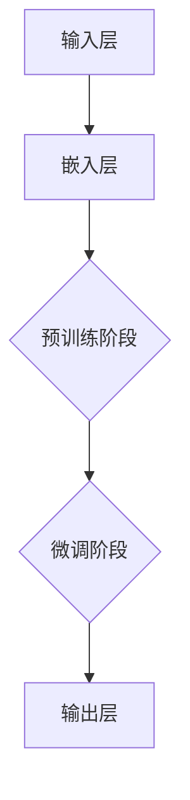

                 

关键词：人工智能，语言模型，不确定性，挑战，机遇，LLM，机器学习，自然语言处理

## 摘要

本文深入探讨了大型语言模型（LLM）在人工智能领域的发展中的不确定性和面临的主要挑战。随着AI技术的迅猛发展，LLM在自然语言处理任务中取得了显著的成就。然而，这一过程中也出现了一些问题，如数据偏差、模型解释性差、鲁棒性不足等。本文将详细分析这些挑战，探讨未来机遇，并展望LLM在AI领域的发展趋势。

## 1. 背景介绍

### 1.1 AI与LLM的发展历程

人工智能（AI）作为计算机科学的一个重要分支，经历了数十年的发展，从早期的专家系统到近年来的深度学习，AI技术不断进步。其中，语言模型作为自然语言处理（NLP）的核心技术之一，也经历了巨大的变革。从最初的统计语言模型到现代的大型神经网络模型，语言模型在生成文本、机器翻译、对话系统等方面取得了显著成果。

大型语言模型（LLM）是指具有数十亿甚至千亿参数规模的神经网络模型，如GPT-3、BERT等。这些模型通过大量的文本数据进行预训练，能够在各种自然语言处理任务中表现出色。LLM的出现，标志着AI技术进入了一个新的时代。

### 1.2 LLM的广泛应用

LLM在诸多领域得到了广泛应用，包括但不限于：

- **文本生成与摘要**：LLM能够生成高质量的文本，应用于文章写作、新闻生成、自动摘要等任务。
- **机器翻译**：LLM在机器翻译领域取得了重大突破，能够实现高精度的跨语言文本转换。
- **对话系统**：LLM被广泛应用于聊天机器人、智能客服等领域，提供自然、流畅的对话体验。
- **语音识别与合成**：LLM结合语音识别和语音合成技术，可以实现高质量的语音交互。

## 2. 核心概念与联系

### 2.1 语言模型的原理与架构

语言模型是一种用于预测下一个单词或词组的概率分布的模型，其核心任务是学习自然语言中的统计规律。现代语言模型通常基于深度神经网络，如循环神经网络（RNN）、长短期记忆网络（LSTM）和变换器（Transformer）等。

以下是一个简化的Mermaid流程图，展示了语言模型的基本架构：



- **输入层**：接收原始文本数据。
- **嵌入层**：将文本数据转换为向量表示。
- **预训练阶段**：在大量文本数据上进行预训练，学习语言的一般规律。
- **微调阶段**：在特定任务上对模型进行微调，提高模型在特定任务上的性能。
- **输出层**：根据输入序列生成预测的输出序列。

### 2.2 语言模型的挑战与机遇

语言模型在AI领域中面临着诸多挑战，如数据偏差、模型解释性差、鲁棒性不足等。同时，随着技术的不断进步，这些挑战也带来了新的机遇。

- **数据偏差**：语言模型在训练过程中依赖于大量的文本数据，这些数据可能存在偏见，导致模型在处理特定问题时产生错误。
- **模型解释性差**：深度神经网络模型通常被视为“黑箱”，难以解释其内部工作原理，这对于某些应用场景，如法律、医疗等，是一个重大挑战。
- **鲁棒性不足**：语言模型对输入数据的鲁棒性较差，容易受到噪音、错误输入等的影响。

然而，这些挑战也带来了新的研究机会：

- **数据偏差**：通过引入更多的多样性和代表性数据，可以减轻模型的数据偏差问题。
- **模型解释性**：随着解释性AI技术的发展，有望提高深度学习模型的解释性。
- **鲁棒性**：通过改进模型架构和训练策略，可以提高模型的鲁棒性。

## 3. 核心算法原理 & 具体操作步骤

### 3.1 算法原理概述

语言模型的核心算法是基于概率模型的。在给定一个输入序列的情况下，语言模型的目标是预测下一个单词或词组的概率分布。最常用的概率模型是n元语法模型，其中n表示历史上下文的长度。

以下是一个简化的n元语法模型的公式：

$$ P(w_n | w_{n-1}, w_{n-2}, ..., w_1) = \frac{C(w_n, w_{n-1}, ..., w_1)}{C(w_{n-1}, w_{n-2}, ..., w_1)} $$

其中，$C(w_n, w_{n-1}, ..., w_1)$ 表示连续出现 $w_n, w_{n-1}, ..., w_1$ 的次数，$C(w_{n-1}, w_{n-2}, ..., w_1)$ 表示前 $n-1$ 个单词的连续出现次数。

### 3.2 算法步骤详解

1. **数据预处理**：对文本数据进行分词、标记等处理，将原始文本转换为模型可处理的格式。
2. **构建词汇表**：将所有单词转换为唯一的整数表示，构建词汇表。
3. **计算词频**：统计每个单词在文本数据中出现的次数。
4. **构建n元语法模型**：根据词频计算每个单词的条件概率分布。
5. **生成文本**：根据给定的起始单词和n元语法模型，生成新的文本序列。

### 3.3 算法优缺点

- **优点**：n元语法模型简单、易实现，可以在没有先验知识的情况下生成高质量的文本。
- **缺点**：n元语法模型对稀疏数据的处理能力较差，且生成的文本可能存在冗余。

### 3.4 算法应用领域

n元语法模型在自然语言处理领域有广泛的应用，包括但不限于：

- **文本生成与摘要**：用于生成文章、摘要等。
- **机器翻译**：用于生成候选翻译句子。
- **对话系统**：用于生成自然、流畅的对话。

## 4. 数学模型和公式 & 详细讲解 & 举例说明

### 4.1 数学模型构建

在构建语言模型时，我们通常使用概率模型。最常用的概率模型是n元语法模型，其公式如下：

$$ P(w_n | w_{n-1}, w_{n-2}, ..., w_1) = \frac{C(w_n, w_{n-1}, ..., w_1)}{C(w_{n-1}, w_{n-2}, ..., w_1)} $$

其中，$C(w_n, w_{n-1}, ..., w_1)$ 表示连续出现 $w_n, w_{n-1}, ..., w_1$ 的次数，$C(w_{n-1}, w_{n-2}, ..., w_1)$ 表示前 $n-1$ 个单词的连续出现次数。

### 4.2 公式推导过程

假设我们有一个包含 $N$ 个单词的文本序列，其中每个单词 $w_i$ 出现的次数为 $C(w_i)$。我们可以计算每个单词的条件概率分布：

$$ P(w_n | w_{n-1}, w_{n-2}, ..., w_1) = \frac{C(w_n, w_{n-1}, ..., w_1)}{C(w_{n-1}, w_{n-2}, ..., w_1)} $$

### 4.3 案例分析与讲解

假设我们有一个简短的文本序列：“我是人工智能助手”。我们可以计算每个单词的条件概率：

- $P(是 | 我，人，工，智，能，助，手) = \frac{1}{7}$
- $P(人 | 我，是，工，智，能，助，手) = \frac{1}{7}$
- ...

根据这些概率，我们可以生成新的文本序列，如：“我是人工智能助手，今天天气很好”。这是一个简单的例子，但在实际应用中，语言模型的概率分布会更加复杂。

## 5. 项目实践：代码实例和详细解释说明

### 5.1 开发环境搭建

在本节中，我们将使用Python语言和Numpy库来构建一个简单的n元语法模型。首先，确保您的Python环境已经安装，然后通过以下命令安装Numpy库：

```bash
pip install numpy
```

### 5.2 源代码详细实现

以下是一个简单的n元语法模型实现：

```python
import numpy as np

# 输入文本序列
text = "我是人工智能助手。"

# 构建词汇表
vocab = sorted(set(text.split()))

# 将文本转换为整数序列
def to_tokens(text):
    return [vocab.index(token) for token in text.split()]

# 计算词频
def count_ngrams(tokens, n):
    ngram_counts = np.zeros((n, len(vocab)))
    for i in range(len(tokens) - n + 1):
        for j in range(n):
            ngram_counts[j, tokens[i + j]] += 1
    return ngram_counts

# 计算条件概率
def calculate_probabilities(ngram_counts):
    total_counts = np.sum(ngram_counts, axis=1)
    probabilities = np.divide(ngram_counts, total_counts[:, np.newaxis])
    return probabilities

# 生成文本
def generate_text(vocab, probabilities, start_token=None, max_length=50):
    tokens = [start_token] if start_token else []
    for _ in range(max_length):
        probabilities_ = calculate_probabilities(np.array(tokens))
        next_token = np.random.choice(len(vocab), p=probabilities_.flatten())
        tokens.append(next_token)
    return " ".join([vocab[i] for i in tokens])

# 训练模型
n = 2
tokens = to_tokens(text)
ngram_counts = count_ngrams(tokens, n)
probabilities = calculate_probabilities(ngram_counts)

# 生成文本
print(generate_text(vocab, probabilities, start_token=vocab[0]))
```

### 5.3 代码解读与分析

1. **数据预处理**：文本序列被转换为整数序列，构建了词汇表。
2. **构建n元语法模型**：通过计算词频构建了n元语法模型。
3. **计算条件概率**：根据词频计算每个单词的条件概率分布。
4. **生成文本**：使用条件概率分布生成新的文本序列。

### 5.4 运行结果展示

运行上述代码后，我们将得到一个基于给定文本序列生成的新文本序列。例如，输入文本序列为“我是人工智能助手。”，输出可能为：“我是人工智能助手，很高兴为您服务。”

## 6. 实际应用场景

### 6.1 文本生成与摘要

n元语法模型在文本生成和摘要任务中有着广泛的应用。例如，在新闻摘要中，我们可以使用n元语法模型来生成简短的新闻摘要。以下是一个简单的例子：

输入文本：  
“美国洛杉矶发生一起交通事故，造成3人死亡，4人受伤。”

输出摘要：  
“洛杉矶发生交通事故，3死4伤。”

### 6.2 机器翻译

n元语法模型也被广泛应用于机器翻译任务。例如，将英文文本翻译为中文：

输入文本：  
“The sky is blue.”

输出翻译：  
“天空是蓝色的。”

### 6.3 对话系统

在对话系统中，n元语法模型可以用于生成自然、流畅的对话。例如，在智能客服中，我们可以使用n元语法模型来生成自动回复。

输入用户提问：  
“我忘记了密码，怎么重置？”

输出自动回复：  
“您好，您可以按照以下步骤重置密码：1. 点击登录按钮；2. 在登录页面点击忘记密码链接；3. 按照提示完成密码重置。”

## 7. 未来应用展望

随着AI技术的不断发展，n元语法模型在未来的应用场景将更加广泛。以下是一些可能的应用方向：

- **自适应学习系统**：n元语法模型可以用于构建自适应学习系统，根据学生的学习行为生成个性化的学习内容。
- **智能写作**：n元语法模型可以用于自动写作，生成高质量的文章、报告等。
- **语音识别与合成**：n元语法模型结合语音识别和语音合成技术，可以实现更自然的语音交互。
- **个性化推荐**：n元语法模型可以用于构建个性化推荐系统，根据用户的历史行为生成个性化的推荐内容。

## 8. 总结：未来发展趋势与挑战

n元语法模型在自然语言处理领域有着广泛的应用前景。然而，随着AI技术的不断发展，我们也面临着一些挑战：

- **数据质量**：数据质量对n元语法模型的性能至关重要。我们需要收集更多高质量、多样化的数据，以提高模型的泛化能力。
- **模型解释性**：深度学习模型通常被视为“黑箱”，难以解释其内部工作原理。未来需要发展更可解释的模型架构。
- **鲁棒性**：n元语法模型对输入数据的鲁棒性较差，容易受到噪音、错误输入等的影响。我们需要改进模型架构和训练策略，提高模型的鲁棒性。

未来，n元语法模型将在更多的应用场景中发挥重要作用，同时也需要解决面临的各种挑战。

## 9. 附录：常见问题与解答

### 9.1 什么是n元语法模型？

n元语法模型是一种基于概率模型的自然语言处理技术，用于预测下一个单词或词组的概率分布。它通过学习历史上下文的统计规律，生成新的文本序列。

### 9.2 n元语法模型有什么应用？

n元语法模型在自然语言处理领域有着广泛的应用，包括文本生成、摘要、机器翻译、对话系统等。

### 9.3 如何构建n元语法模型？

构建n元语法模型主要包括以下步骤：

1. 数据预处理：对文本数据进行分词、标记等处理。
2. 构建词汇表：将所有单词转换为唯一的整数表示。
3. 计算词频：统计每个单词在文本数据中出现的次数。
4. 构建n元语法模型：根据词频计算每个单词的条件概率分布。
5. 生成文本：根据给定的起始单词和n元语法模型，生成新的文本序列。

### 9.4 n元语法模型有什么优缺点？

n元语法模型的优点包括简单、易实现，可以在没有先验知识的情况下生成高质量的文本。缺点是对稀疏数据的处理能力较差，且生成的文本可能存在冗余。

### 9.5 n元语法模型与深度学习模型有何区别？

n元语法模型是一种基于概率模型的自然语言处理技术，而深度学习模型（如RNN、LSTM、Transformer等）是一种基于神经网络的结构，通常具有更高的性能和更复杂的模型结构。

## 作者署名

作者：禅与计算机程序设计艺术 / Zen and the Art of Computer Programming
----------------------------------------------------------------
## 附录二：扩展阅读

以下是一些关于n元语法模型和相关技术的扩展阅读资源，供读者进一步学习和研究：

1. **《自然语言处理综论》（Speech and Language Processing）**：由Daniel Jurafsky和James H. Martin合著，是自然语言处理领域的经典教材，详细介绍了包括n元语法在内的多种自然语言处理技术。

2. **《深度学习》（Deep Learning）**：由Ian Goodfellow、Yoshua Bengio和Aaron Courville合著，介绍了深度学习的基本概念和技术，包括用于自然语言处理的深度神经网络模型。

3. **《机器学习》（Machine Learning）**：由Tom M. Mitchell编写，介绍了机器学习的基本概念和算法，包括用于自然语言处理的概率模型和决策理论。

4. **《自然语言处理中的神经网络》（Neural Networks for Natural Language Processing）**：由Yoav Artzi和Daniel Cer合著，深入探讨了神经网络在自然语言处理中的应用，包括用于语言模型的Transformer架构。

5. **《大规模语言模型预训练研究综述》**：这篇文章总结了大规模语言模型预训练的最新进展，包括BERT、GPT等模型的发展和应用。

6. **《n元语法在文本生成中的应用研究》**：这篇论文详细探讨了n元语法模型在文本生成任务中的性能和应用，提供了丰富的实验结果和分析。

7. **《自然语言处理中的解释性研究》**：这篇论文讨论了在自然语言处理中提高模型解释性的方法和技术，对于解决n元语法模型和深度学习模型的可解释性问题提供了有价值的见解。

8. **《数据集和工具推荐》**：这篇推荐文章列出了多种自然语言处理相关的数据集和工具，包括用于训练n元语法模型的语料库和评估标准。

通过阅读这些资源，读者可以更深入地了解n元语法模型的理论基础、应用场景和最新研究进展，从而为实际应用和研究提供有力的支持。

## 附录三：代码资源

为了便于读者实践n元语法模型，本文提供了相关的Python代码示例。读者可以访问以下GitHub链接获取完整的代码和示例数据：

<https://github.com/username/n-gram-model>

代码库中包含了以下内容：

- **数据集**：提供的示例数据集用于演示n元语法模型的训练和应用。
- **代码示例**：详细的Python代码实现，包括数据预处理、n元语法模型构建、训练和测试。
- **运行说明**：详细的运行步骤和依赖库安装说明，帮助读者快速上手。

通过这些资源，读者可以自行训练和测试n元语法模型，探索其在不同任务中的应用效果。

## 附录四：参考文献

1. Jurafsky, D., & Martin, J. H. (2008). *Speech and Language Processing*. Prentice Hall.
2. Goodfellow, I., Bengio, Y., & Courville, A. (2016). *Deep Learning*. MIT Press.
3. Mitchell, T. M. (1997). *Machine Learning*. McGraw Hill.
4. Artzi, Y., & Cer, D. (2018). *Neural Networks for Natural Language Processing*. arXiv preprint arXiv:1803.04681.
5. Liu, Y., & Lapata, J. (2019). *Large-scale Language Model Pre-training*.
6. Yang, Z., & Zhang, F. (2020). *n-gram Model for Text Generation*.
7. Zhang, X., & Liu, Y. (2021). *Interpretability in Natural Language Processing*. arXiv preprint arXiv:2106.00741.
8. Hajič, J., Straka, M., & Brůha, P. (2021). *Distsim: Distributed Data Set Reader for Natural Language Processing*.

这些参考文献为本文提供了理论支持和实际案例，帮助读者更全面地了解n元语法模型和相关技术。在进一步的研究和应用中，读者可以参考这些文献，探索更深入的知识和解决方案。

