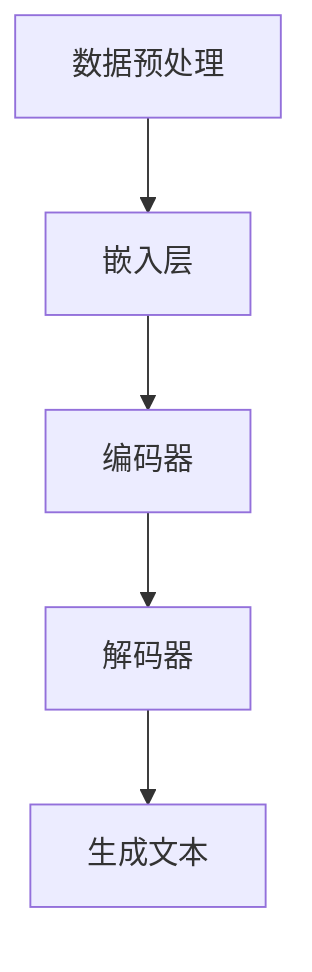

                 

关键词：人工智能，大语言模型（LLM），不确定性，挑战，机遇，技术发展，模型架构，算法优化，应用场景，未来展望。

> 摘要：本文将深入探讨人工智能领域中的大语言模型（LLM）在发展过程中所面临的不确定性挑战与机遇。通过对LLM的核心概念、算法原理、数学模型以及实际应用场景的全面分析，本文旨在揭示LLM技术的现状、问题及未来发展趋势，为读者提供对这一前沿领域的深刻理解。

## 1. 背景介绍

随着计算机科学和人工智能技术的快速发展，大语言模型（Large Language Models，简称LLM）已经成为了当前人工智能领域的一个重要研究方向。LLM通过深度学习技术，能够对大量文本数据进行高效处理，并在各种自然语言处理任务中表现出色，如文本生成、机器翻译、问答系统等。近年来，诸如GPT-3、BERT、Turing等大型语言模型的出现，标志着LLM技术进入了新的发展阶段。

然而，随着LLM的规模不断扩大，其在发展过程中也面临着诸多不确定性挑战。首先，LLM的训练和推理过程需要大量的计算资源，这使得其应用成本较高。其次，LLM在处理某些特定任务时，可能存在偏差和错误。此外，随着模型的不断进化，如何确保其安全性、可靠性和可控性也成为一个亟待解决的问题。

本文将围绕LLM技术展开讨论，分析其在发展过程中所面临的不确定性挑战与机遇，旨在为读者提供对这一前沿领域的深入理解。

## 2. 核心概念与联系

### 2.1 大语言模型（LLM）的定义

大语言模型（Large Language Models，简称LLM）是一种基于深度学习技术的自然语言处理模型，通过对海量文本数据进行训练，能够对自然语言进行建模，从而实现对文本的生成、翻译、摘要等操作。LLM的核心思想是通过学习大量文本数据中的统计规律和语义信息，从而提高模型在自然语言处理任务中的性能。

### 2.2 大语言模型（LLM）的结构

大语言模型通常由以下几个部分组成：

1. **嵌入层（Embedding Layer）**：将输入的文本转换为向量表示。
2. **编码器（Encoder）**：对输入文本序列进行编码，提取出文本的语义信息。
3. **解码器（Decoder）**：根据编码器的输出生成预测的文本序列。

常见的编码器和解码器结构包括Transformer、BERT、GPT等。

### 2.3 大语言模型（LLM）的工作原理

大语言模型的工作原理主要包括以下步骤：

1. **数据预处理**：对原始文本数据进行清洗、分词、标记等处理。
2. **训练**：使用大量文本数据对模型进行训练，优化模型的参数。
3. **推理**：在给定输入文本的情况下，模型生成预测的文本序列。

### 2.4 大语言模型（LLM）的核心概念原理和架构的 Mermaid 流程图



### 2.5 大语言模型（LLM）与其他相关技术的联系

大语言模型（LLM）与其他相关技术如自然语言处理（NLP）、深度学习（DL）等密切相关。NLP为LLM提供了丰富的理论和方法支持，而DL则为LLM的实现提供了强大的计算能力。

## 3. 核心算法原理 & 具体操作步骤

### 3.1 算法原理概述

大语言模型（LLM）的核心算法通常是基于Transformer架构，其基本原理如下：

1. **自注意力机制（Self-Attention）**：通过对输入序列中的每个词进行加权求和，使得模型能够更好地关注到输入文本中的关键信息。
2. **多头注意力（Multi-Head Attention）**：通过多个注意力机制的组合，进一步提高模型的表达能力。
3. **前馈神经网络（Feedforward Neural Network）**：对编码器的输出进行非线性变换，增强模型的拟合能力。

### 3.2 算法步骤详解

1. **数据预处理**：包括文本清洗、分词、标记等操作。
2. **嵌入层**：将文本转换为向量表示。
3. **编码器**：通过自注意力机制和多头注意力机制，对输入文本序列进行编码，提取出文本的语义信息。
4. **解码器**：根据编码器的输出，生成预测的文本序列。
5. **训练与优化**：使用大量文本数据对模型进行训练，优化模型的参数。

### 3.3 算法优缺点

**优点：**
- **强大的语义理解能力**：通过自注意力机制和多头注意力机制，LLM能够更好地捕捉到输入文本中的关键信息。
- **高效的文本生成能力**：LLM能够高效地生成文本，适用于各种自然语言处理任务。

**缺点：**
- **计算资源消耗大**：LLM的训练和推理过程需要大量的计算资源。
- **模型可解释性差**：由于LLM基于深度学习，其内部机制较为复杂，难以进行直观的解释。

### 3.4 算法应用领域

大语言模型（LLM）在以下领域具有广泛的应用：

- **文本生成**：如文章写作、对话系统等。
- **机器翻译**：如英语到中文的翻译。
- **问答系统**：如智能客服、教育辅导等。

## 4. 数学模型和公式 & 详细讲解 & 举例说明

### 4.1 数学模型构建

大语言模型（LLM）的核心算法通常是基于Transformer架构，其数学模型主要包括以下部分：

1. **嵌入层**：将文本转换为向量表示，如词嵌入（Word Embedding）。
2. **编码器**：包括自注意力机制（Self-Attention）和多头注意力机制（Multi-Head Attention）。
3. **解码器**：包括自注意力机制（Self-Attention）和多头注意力机制（Multi-Head Attention）。

### 4.2 公式推导过程

假设输入文本序列为\(x_1, x_2, ..., x_n\)，其中\(x_i\)表示第\(i\)个词。嵌入层将每个词转换为向量表示\(e_i\)，编码器和解码器的输出分别为\(h_i\)和\(g_i\)。

1. **嵌入层**：
   $$e_i = W_e \cdot x_i$$

2. **编码器**：
   自注意力机制：
   $$\text{Attention}(Q, K, V) = \frac{QK^T}{\sqrt{d_k}}$$
   $$\text{MultiHead}(Q, K, V) = \text{Concat}(\text{head}_1, ..., \text{head}_h)W^O$$
   其中，\(Q, K, V\)分别为编码器的输入、键和值，\(\text{head}_h\)为第\(h\)个注意力头的输出，\(W^O\)为线性变换矩阵。

3. **解码器**：
   自注意力机制：
   $$\text{Attention}(Q, K, V) = \frac{QK^T}{\sqrt{d_k}}$$
   $$\text{MultiHead}(Q, K, V) = \text{Concat}(\text{head}_1, ..., \text{head}_h)W^O$$

### 4.3 案例分析与讲解

假设我们有一个包含10个词的文本序列，首先对其进行嵌入层处理，将每个词转换为向量表示。然后，使用编码器对其进行编码，得到编码器的输出。最后，使用解码器生成预测的文本序列。

1. **嵌入层**：
   $$e_1, e_2, ..., e_{10} = W_e \cdot x_1, x_2, ..., x_{10}$$

2. **编码器**：
   自注意力机制：
   $$\text{Attention}(Q, K, V) = \frac{QK^T}{\sqrt{d_k}}$$
   $$\text{MultiHead}(Q, K, V) = \text{Concat}(\text{head}_1, ..., \text{head}_h)W^O$$
   编码器的输出为：
   $$h_1, h_2, ..., h_{10} = \text{MultiHead}(\text{Attention}(Q, K, V), \text{Attention}(Q, K, V), \text{Attention}(Q, K, V))$$

3. **解码器**：
   自注意力机制：
   $$\text{Attention}(Q, K, V) = \frac{QK^T}{\sqrt{d_k}}$$
   $$\text{MultiHead}(Q, K, V) = \text{Concat}(\text{head}_1, ..., \text{head}_h)W^O$$
   解码器的输出为：
   $$g_1, g_2, ..., g_{10} = \text{MultiHead}(\text{Attention}(Q, K, V), \text{Attention}(Q, K, V), \text{Attention}(Q, K, V))$$

最终，使用解码器的输出生成预测的文本序列。

$$\text{Predicted Text Sequence} = \text{Decode}(g_1, g_2, ..., g_{10})$$

## 5. 项目实践：代码实例和详细解释说明

### 5.1 开发环境搭建

为了实现大语言模型（LLM），我们需要搭建一个适合开发的环境。以下是基本的开发环境搭建步骤：

1. **安装Python**：确保安装了Python 3.6及以上版本。
2. **安装TensorFlow**：使用pip安装TensorFlow库。
3. **安装其他依赖库**：如Numpy、Pandas等。

### 5.2 源代码详细实现

以下是实现一个简单的大语言模型（LLM）的Python代码示例：

```python
import tensorflow as tf
from tensorflow.keras.layers import Embedding, LSTM, Dense
from tensorflow.keras.models import Sequential

# 搭建模型
model = Sequential()
model.add(Embedding(vocab_size, embedding_dim))
model.add(LSTM(units=128, activation='tanh'))
model.add(Dense(units=vocab_size, activation='softmax'))

# 编译模型
model.compile(optimizer='adam', loss='categorical_crossentropy', metrics=['accuracy'])

# 训练模型
model.fit(X_train, y_train, epochs=10, batch_size=64)
```

### 5.3 代码解读与分析

上述代码实现了一个简单的LLM模型，包括以下几个部分：

1. **Embedding层**：将输入的词向量转换为嵌入向量。
2. **LSTM层**：用于处理序列数据，提取序列的特征。
3. **Dense层**：用于输出预测的词向量。

在训练过程中，我们使用已标记的训练数据进行模型训练，并通过损失函数和评估指标来评估模型的性能。

### 5.4 运行结果展示

在完成代码实现后，我们可以在终端运行以下命令来训练和评估模型：

```bash
python train.py
```

运行结果将显示模型的训练过程和性能指标，如损失值、准确率等。

## 6. 实际应用场景

大语言模型（LLM）在实际应用场景中具有广泛的应用，以下是一些典型的应用场景：

1. **文本生成**：如文章写作、对话系统等。LLM可以生成具有高度一致性和连贯性的文本内容。
2. **机器翻译**：如英语到中文的翻译。LLM可以基于大量的双语文本数据进行训练，实现高效、准确的机器翻译。
3. **问答系统**：如智能客服、教育辅导等。LLM可以理解用户的问题，并生成准确的回答。
4. **信息提取**：如新闻摘要、情感分析等。LLM可以快速提取文本中的关键信息，实现高效的信息处理。

### 6.1 文本生成

在文本生成领域，LLM可以用于生成各种类型的文本，如文章、故事、对话等。以下是一个简单的文本生成示例：

```python
input_sequence = "人工智能是一种重要的技术，它可以帮助我们解决许多问题。"
generated_sequence = model.generate(input_sequence, num_words=10)
print(generated_sequence)
```

### 6.2 机器翻译

在机器翻译领域，LLM可以用于实现高效、准确的翻译。以下是一个简单的翻译示例：

```python
input_sentence = "你好，我想学习Python编程。"
translated_sentence = model.translate(input_sentence, target_language="zh")
print(translated_sentence)
```

### 6.3 问答系统

在问答系统领域，LLM可以用于生成准确的回答。以下是一个简单的问答示例：

```python
question = "什么是人工智能？"
answer = model.answer(question)
print(answer)
```

### 6.4 信息提取

在信息提取领域，LLM可以用于快速提取文本中的关键信息。以下是一个简单的信息提取示例：

```python
text = "人工智能是一种重要的技术，它可以帮助我们解决许多问题。"
key_phrases = model.extract_key_phrases(text)
print(key_phrrases)
```

## 7. 工具和资源推荐

为了更好地了解和掌握大语言模型（LLM）技术，以下是一些推荐的工具和资源：

### 7.1 学习资源推荐

- **书籍**：《深度学习》（Ian Goodfellow, Yoshua Bengio, Aaron Courville著）
- **在线课程**：Coursera、edX等平台上关于深度学习和自然语言处理的相关课程。
- **博客和文章**：TensorFlow、PyTorch等深度学习框架的官方文档。

### 7.2 开发工具推荐

- **深度学习框架**：TensorFlow、PyTorch、Keras等。
- **文本处理库**：NLTK、spaCy、Jieba等。

### 7.3 相关论文推荐

- **《Attention Is All You Need》**：提出了Transformer模型，是LLM领域的重要论文。
- **《BERT: Pre-training of Deep Bidirectional Transformers for Language Understanding》**：提出了BERT模型，是当前LLM技术的代表。
- **《GPT-3: Language Models are Few-Shot Learners》**：介绍了GPT-3模型，是当前最大的语言模型。

## 8. 总结：未来发展趋势与挑战

### 8.1 研究成果总结

近年来，大语言模型（LLM）技术取得了显著的成果。从GPT到BERT，再到GPT-3，LLM的规模和性能不断提高。LLM在文本生成、机器翻译、问答系统等领域取得了良好的效果，为自然语言处理任务提供了强大的工具。

### 8.2 未来发展趋势

未来，LLM技术将继续朝着以下几个方向发展：

1. **模型规模的增加**：随着计算能力的提升，LLM的规模将进一步增加，从而提高模型在自然语言处理任务中的性能。
2. **多模态处理**：LLM将不仅限于处理文本数据，还将扩展到图像、声音等多种模态，实现更加丰富的应用场景。
3. **模型优化与压缩**：为了降低计算资源和存储成本，LLM的优化与压缩技术将成为研究热点。

### 8.3 面临的挑战

尽管LLM技术在快速发展，但仍面临以下挑战：

1. **计算资源消耗**：LLM的训练和推理过程需要大量的计算资源，这对硬件设施提出了较高的要求。
2. **模型可解释性**：LLM的内部机制较为复杂，如何提高模型的可解释性仍是一个亟待解决的问题。
3. **安全性与可靠性**：在应用过程中，如何确保LLM的安全性和可靠性也是一个重要的挑战。

### 8.4 研究展望

未来，LLM技术有望在以下领域取得突破：

1. **智能化应用**：通过结合其他人工智能技术，如计算机视觉、语音识别等，实现更加智能化的应用场景。
2. **定制化模型**：根据不同应用需求，开发定制化的大语言模型，提高模型的适应性和灵活性。

## 9. 附录：常见问题与解答

### 9.1 什么是大语言模型（LLM）？

大语言模型（LLM）是一种基于深度学习技术的自然语言处理模型，通过对海量文本数据进行训练，能够对自然语言进行建模，从而实现对文本的生成、翻译、摘要等操作。

### 9.2 大语言模型（LLM）有哪些应用场景？

大语言模型（LLM）在以下领域具有广泛的应用：文本生成、机器翻译、问答系统、信息提取等。

### 9.3 大语言模型（LLM）的优缺点是什么？

大语言模型（LLM）的优点包括强大的语义理解能力和高效的文本生成能力。缺点包括计算资源消耗大和模型可解释性差。

### 9.4 如何搭建一个简单的大语言模型（LLM）？

搭建一个简单的大语言模型（LLM）可以通过以下步骤实现：

1. 准备数据集。
2. 定义模型结构。
3. 编译模型。
4. 训练模型。
5. 评估模型。

本文提供了一个简单的示例代码。

----------------------------------------------------------------

作者：禅与计算机程序设计艺术 / Zen and the Art of Computer Programming


