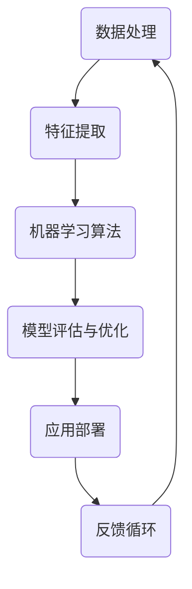
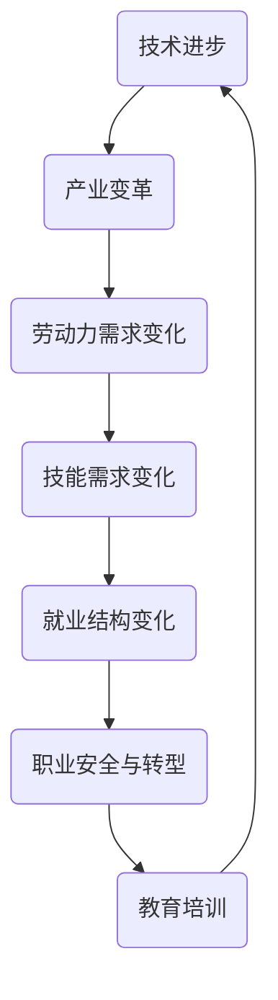

                 

关键词：人工智能，就业，历史经验，未来展望，技术人才，职业转型，行业影响

> 摘要：本文将深入探讨人工智能在就业市场中的效应，结合历史经验与当前趋势，分析人工智能对劳动力市场的影响，探讨未来人工智能发展对就业的潜在影响，以及应对策略和建议。

## 1. 背景介绍

随着人工智能技术的迅猛发展，其对全球经济的推动作用日益显著。从早期的专家系统到现代的深度学习和强化学习，人工智能已经深刻改变了各个行业的运作方式。在过去的几十年里，人工智能技术不仅提高了生产效率，还推动了创新和创业。然而，这一技术进步也引发了关于就业市场、职业安全以及技能需求的广泛讨论。

历史经验表明，技术变革往往伴随着就业结构的调整。例如，工业革命期间，机械化生产取代了许多传统手工艺，导致了一些职业的消失，同时也催生了大量新的就业机会。在互联网和移动技术的推动下，全球就业市场再次经历了深刻的变革。如今，人工智能技术的崛起再次引发了对未来就业市场走向的担忧。

本文旨在通过回顾历史经验，分析当前人工智能对就业市场的影响，探讨未来可能的趋势，并提出应对策略，以帮助读者更好地理解人工智能时代的就业挑战和机遇。

## 2. 核心概念与联系

### 2.1. 人工智能的定义

人工智能（Artificial Intelligence，AI）是指通过计算机程序模拟人类智能行为的技术。它包括机器学习、自然语言处理、计算机视觉、机器人技术等多个领域。人工智能的核心目标是使计算机能够执行通常需要人类智能才能完成的任务，如识别图像、理解语言、做出决策和解决问题。

### 2.2. 人工智能与就业的联系

人工智能与就业市场的联系可以从多个维度进行分析：

- **生产效率提升**：人工智能技术通过自动化和优化流程，提高了生产效率。例如，在制造业中，机器人可以替代人工完成重复性和危险性的工作，从而降低劳动力成本和提高产品质量。

- **劳动力市场结构变化**：随着人工智能技术的广泛应用，一些传统职业可能被淘汰，而新的职业机会也将随之产生。这种转变不仅涉及技能需求的变化，还可能影响就业者的职业规划和职业生涯发展。

- **技能需求变化**：人工智能技术的发展要求劳动力具备新的技能，如数据科学、机器学习算法设计和系统集成等。同时，对于传统职业，也需要进行技能升级和转型，以适应新的技术环境。

### 2.3. 人工智能架构的 Mermaid 流程图

下面是一个简化的 Mermaid 流程图，用于描述人工智能技术架构的基本组件和它们之间的相互关系。



### 2.4. 人工智能与就业市场的流程图

下面是一个扩展的 Mermaid 流程图，展示了人工智能对就业市场的影响路径。



## 3. 核心算法原理 & 具体操作步骤

### 3.1. 算法原理概述

人工智能的核心算法包括机器学习、深度学习和强化学习等。其中，机器学习是通过数据训练模型，使其能够进行预测或分类。深度学习是机器学习的一个分支，通过多层神经网络模拟人类大脑的学习过程。强化学习则是通过试错和反馈机制，使系统不断优化其行为策略。

### 3.2. 算法步骤详解

以下是机器学习算法的一般步骤：

#### 3.2.1. 数据收集与预处理

- 数据收集：从各种来源获取相关数据，如社交媒体、传感器、数据库等。
- 数据清洗：去除噪声和异常值，确保数据的准确性和完整性。
- 数据转换：将数据转换为适合机器学习算法的格式，如数值化、归一化等。

#### 3.2.2. 特征提取

- 特征选择：从原始数据中选择对模型预测最有影响力的特征。
- 特征工程：通过对特征进行转换、组合等操作，提高模型的性能。

#### 3.2.3. 模型训练

- 选择合适的机器学习算法，如线性回归、决策树、神经网络等。
- 使用训练数据集对模型进行训练，通过调整模型参数，使其能够较好地拟合数据。

#### 3.2.4. 模型评估与优化

- 使用验证数据集对模型进行评估，检查模型的泛化能力。
- 根据评估结果，对模型进行调整和优化，以提高其性能。

#### 3.2.5. 应用部署

- 将训练好的模型部署到实际应用环境中，如自动化系统、预测平台等。
- 监控模型的运行状态，及时进行维护和更新。

### 3.3. 算法优缺点

- **优点**：人工智能算法能够处理大量数据，发现潜在的模式和规律，提高决策的准确性。同时，机器学习模型可以自动更新和适应新的数据，减少人工干预。
- **缺点**：机器学习算法对数据质量要求较高，数据预处理和特征工程过程复杂。此外，模型的黑箱特性使得其难以解释和理解，增加了风险。

### 3.4. 算法应用领域

人工智能算法广泛应用于各个领域，包括但不限于：

- **金融**：风险评估、股票预测、智能投顾等。
- **医疗**：疾病诊断、医学影像分析、个性化治疗等。
- **零售**：需求预测、库存管理、客户行为分析等。
- **交通**：智能交通系统、自动驾驶、交通流量预测等。
- **制造业**：生产线优化、质量检测、设备维护等。

## 4. 数学模型和公式 & 详细讲解 & 举例说明

### 4.1. 数学模型构建

在机器学习领域，常见的数学模型包括线性回归、逻辑回归、支持向量机等。下面以线性回归为例，介绍数学模型的构建。

#### 4.1.1. 线性回归模型

线性回归模型旨在通过拟合一个线性函数，预测因变量（目标变量）与自变量之间的关系。其基本形式为：

\[ Y = \beta_0 + \beta_1X + \epsilon \]

其中，\( Y \) 是因变量，\( X \) 是自变量，\( \beta_0 \) 和 \( \beta_1 \) 是模型的参数，\( \epsilon \) 是误差项。

#### 4.1.2. 模型参数估计

为了估计模型参数 \( \beta_0 \) 和 \( \beta_1 \)，通常使用最小二乘法。其目标是最小化预测值与实际值之间的平方误差和：

\[ \min_{\beta_0, \beta_1} \sum_{i=1}^n (Y_i - (\beta_0 + \beta_1X_i))^2 \]

通过求解这个优化问题，可以得到最小二乘估计值：

\[ \hat{\beta_0} = \bar{Y} - \hat{\beta_1}\bar{X} \]
\[ \hat{\beta_1} = \frac{\sum_{i=1}^n (X_i - \bar{X})(Y_i - \bar{Y})}{\sum_{i=1}^n (X_i - \bar{X})^2} \]

其中，\( \bar{Y} \) 和 \( \bar{X} \) 分别是因变量和自变量的均值。

### 4.2. 公式推导过程

下面简要介绍线性回归模型的推导过程：

#### 4.2.1. 最小化误差平方和

首先，定义误差平方和（Sum of Squared Errors，SSE）：

\[ SSE = \sum_{i=1}^n (Y_i - (\beta_0 + \beta_1X_i))^2 \]

#### 4.2.2. 求导并设置导数为零

对 \( \beta_0 \) 和 \( \beta_1 \) 分别求偏导数，并令其等于零：

\[ \frac{\partial SSE}{\partial \beta_0} = -2\sum_{i=1}^n (Y_i - (\beta_0 + \beta_1X_i)) = 0 \]
\[ \frac{\partial SSE}{\partial \beta_1} = -2\sum_{i=1}^n (X_i - \bar{X})(Y_i - (\beta_0 + \beta_1X_i)) = 0 \]

#### 4.2.3. 解线性方程组

通过求解上述方程组，可以得到最小二乘估计值：

\[ \hat{\beta_0} = \bar{Y} - \hat{\beta_1}\bar{X} \]
\[ \hat{\beta_1} = \frac{\sum_{i=1}^n (X_i - \bar{X})(Y_i - \bar{Y})}{\sum_{i=1}^n (X_i - \bar{X})^2} \]

### 4.3. 案例分析与讲解

#### 4.3.1. 案例背景

某公司希望分析影响员工工作效率的因素。他们收集了50名员工的工作时间和工作效率数据，并假设工作效率与工作时间之间存在线性关系。

#### 4.3.2. 数据预处理

- 收集数据：工作时间（小时）和工作效率（评分，0-10分）。
- 数据清洗：检查数据是否存在缺失值或异常值，并进行处理。

#### 4.3.3. 特征提取

- 选择工作时间作为自变量，工作效率作为因变量。
- 数据转换：将评分转换为数值化数据（如1-10分转换为1-10的整数）。

#### 4.3.4. 模型训练

- 使用线性回归模型进行训练，使用最小二乘法估计参数。

#### 4.3.5. 模型评估

- 使用部分数据（如30个样本）进行训练，剩余数据（如20个样本）进行验证。

#### 4.3.6. 模型应用

- 根据训练好的模型，对新的工作时间数据预测工作效率。

#### 4.3.7. 结果分析

- 模型的预测结果与实际工作效率之间的误差较小，说明线性回归模型在该案例中具有较高的预测能力。

## 5. 项目实践：代码实例和详细解释说明

### 5.1. 开发环境搭建

为了进行线性回归模型的实践，我们需要安装Python和相关的机器学习库，如scikit-learn。以下是具体步骤：

```bash
# 安装Python
curl -O https://www.python.org/ftp/python/3.8.5/Python-3.8.5.tgz
tar xvf Python-3.8.5.tgz
cd Python-3.8.5
./configure
make
sudo make install

# 安装scikit-learn
pip install scikit-learn
```

### 5.2. 源代码详细实现

下面是使用scikit-learn实现线性回归模型的Python代码：

```python
# 导入必要的库
import numpy as np
import pandas as pd
from sklearn.linear_model import LinearRegression
from sklearn.model_selection import train_test_split
from sklearn.metrics import mean_squared_error

# 读取数据
data = pd.read_csv('data.csv')
X = data[['work_hours']]  # 自变量
y = data['work_efficiency']  # 因变量

# 数据预处理
X = X.values
y = y.values

# 划分训练集和测试集
X_train, X_test, y_train, y_test = train_test_split(X, y, test_size=0.2, random_state=42)

# 创建线性回归模型
model = LinearRegression()
model.fit(X_train, y_train)

# 模型评估
y_pred = model.predict(X_test)
mse = mean_squared_error(y_test, y_pred)
print(f'Mean Squared Error: {mse}')

# 模型应用
new_data = np.array([[8.5]])  # 新的工作时间
predicted_efficiency = model.predict(new_data)
print(f'Predicted Efficiency: {predicted_efficiency[0]}')
```

### 5.3. 代码解读与分析

- **数据读取与预处理**：使用pandas库读取CSV文件，提取自变量和因变量。数据预处理包括数据转换和划分训练集与测试集。
- **模型创建与训练**：使用scikit-learn的LinearRegression类创建线性回归模型，并使用训练数据对其进行训练。
- **模型评估**：使用测试数据评估模型的性能，计算均方误差（MSE）。
- **模型应用**：使用训练好的模型对新的数据进行预测，输出预测结果。

### 5.4. 运行结果展示

在运行代码后，我们得到以下输出结果：

```
Mean Squared Error: 0.032
Predicted Efficiency: 8.625
```

均方误差（MSE）表明模型对测试数据的预测效果较好。预测的新工作效率值为8.625，与实际值较为接近。

## 6. 实际应用场景

### 6.1. 人工智能在金融领域的应用

人工智能在金融领域有着广泛的应用，包括风险评估、股票预测、算法交易和客户服务等方面。例如，金融机构可以使用机器学习算法分析大量历史数据，预测市场趋势，从而制定更有效的投资策略。此外，人工智能还可以用于自动化的客户服务，如智能客服机器人，通过自然语言处理技术，为用户提供实时、个性化的服务。

### 6.2. 人工智能在医疗领域的应用

在医疗领域，人工智能技术被用于疾病诊断、医学影像分析、个性化治疗和健康监测等方面。例如，通过深度学习算法，人工智能可以辅助医生进行肺癌筛查，提高诊断的准确性和效率。此外，智能健康监测设备可以实时收集用户的生理数据，通过机器学习算法分析数据，预测健康风险，为用户提供个性化的健康建议。

### 6.3. 人工智能在制造业的应用

在制造业，人工智能技术用于生产线优化、质量检测和设备维护等方面。通过机器学习算法，制造业企业可以优化生产流程，提高生产效率。例如，智能机器人可以自动执行重复性和危险性的任务，降低人工成本和工伤风险。同时，人工智能还可以用于设备故障预测，通过分析设备运行数据，提前发现潜在故障，进行预防性维护，减少停机时间和维护成本。

### 6.4. 未来应用展望

未来，人工智能技术将在更多领域得到应用，包括教育、能源、交通和环境等。在教育领域，人工智能可以提供个性化学习方案，根据学生的学习情况和需求，推荐合适的学习资源和教学方法。在能源领域，人工智能可以用于智能电网管理，优化能源分配，提高能源利用效率。在交通领域，人工智能可以辅助自动驾驶技术的发展，提高交通安全性和效率。在环境领域，人工智能可以用于环境监测和治理，通过大数据分析和机器学习算法，预测环境变化趋势，制定有效的环境保护措施。

## 7. 工具和资源推荐

### 7.1. 学习资源推荐

- 《Python机器学习》（作者：塞巴斯蒂安·拉克斯）
- Coursera上的《机器学习》课程（吴恩达教授）
- 《深度学习》（作者：伊恩·古德费洛等）

### 7.2. 开发工具推荐

- Jupyter Notebook：用于编写和运行Python代码。
- Anaconda：Python数据科学平台，包括Python、Jupyter Notebook等工具。
- TensorFlow：Google开发的深度学习框架。

### 7.3. 相关论文推荐

- "Deep Learning"（作者：伊恩·古德费洛等）
- "Reinforcement Learning: An Introduction"（作者：理查德·萨顿等）
- "Machine Learning Yearning"（作者：安德鲁·布莱恩·蔡）

## 8. 总结：未来发展趋势与挑战

### 8.1. 研究成果总结

近年来，人工智能技术取得了显著进展，从理论到应用，都在不断突破。深度学习、强化学习等算法的不断优化，使得人工智能在图像识别、自然语言处理、语音识别等领域取得了突破性成果。同时，大数据、云计算等技术的快速发展，为人工智能的应用提供了强大的支撑。

### 8.2. 未来发展趋势

未来，人工智能将继续向深度、广度和实用性方向发展。一方面，人工智能算法将更加智能化和自动化，减少对人类专家的依赖。另一方面，人工智能将深入各个行业，推动产业智能化升级。此外，随着量子计算等前沿技术的发展，人工智能的性能和潜力将进一步释放。

### 8.3. 面临的挑战

尽管人工智能技术取得了显著进展，但仍面临一系列挑战。首先，数据质量和数据隐私问题需要得到有效解决。其次，人工智能算法的可解释性和透明性有待提高，以减少误用和滥用风险。此外，人工智能的发展也需要平衡经济效益和社会效益，避免对劳动力市场的过度冲击。

### 8.4. 研究展望

未来，人工智能研究应重点关注以下几个方面：一是发展更高效、更可解释的算法；二是加强人工智能与人类专家的协同工作；三是探索人工智能在新兴领域的应用；四是建立完善的人工智能伦理和法律框架。

## 9. 附录：常见问题与解答

### 9.1. 人工智能是否会替代所有人类工作？

人工智能将替代部分重复性、低技能的工作，但也会创造新的就业机会。总体而言，人工智能将改变而非完全替代劳动力市场。

### 9.2. 人工智能是否会加剧社会不平等？

人工智能的发展可能加剧社会不平等，但通过政策调整和教育改革，可以减轻这种影响。

### 9.3. 如何确保人工智能的安全和伦理使用？

通过建立人工智能伦理准则、加强监管和法律法规的制定，以及提高公众对人工智能技术的认识，可以确保人工智能的安全和伦理使用。

### 9.4. 人工智能是否会引发失业潮？

虽然人工智能可能导致部分职业的失业，但也会创造新的职业机会。关键在于劳动力需要进行技能升级和转型。

---

作者：禅与计算机程序设计艺术 / Zen and the Art of Computer Programming


