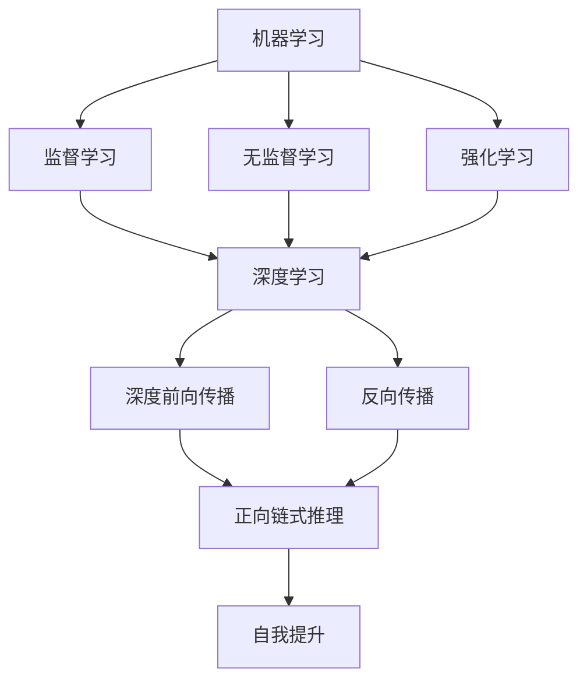

                 

关键词：AI推理、链式推理、自我提升、人工智能、机器学习、深度学习

> 摘要：本文深入探讨了人工智能的推理能力，特别是链式推理和自我提升的重要性。通过介绍链式推理的基本原理，分析其在实际应用中的表现，并探讨自我提升在提升推理能力中的作用，本文旨在为读者提供对AI推理能力的全面理解。

## 1. 背景介绍

在当今信息化时代，人工智能（AI）已经成为了一个至关重要的领域。AI的发展不仅改变了我们的生活方式，还在各行各业中发挥着巨大的作用。从自然语言处理到图像识别，从自动驾驶到智能医疗，AI的应用范围日益广泛。

在AI的众多能力中，推理能力被认为是最为关键和具有挑战性的。推理能力是指AI系统能够根据已知信息推断出未知信息的能力。这种能力使得AI能够在复杂的环境中做出决策，并解决各种问题。

### 1.1 推理能力的定义

推理能力可以被定义为从已知信息出发，通过逻辑推理得出新的结论或信息的过程。推理可以分为两种基本形式：归纳推理和演绎推理。

- **归纳推理**：从特定的实例中归纳出一般性的结论。例如，通过观察多次下雨前乌云密布，我们可以归纳出“乌云密布通常意味着即将下雨”。
- **演绎推理**：从一般性的前提推导出特定的结论。例如，如果所有的猫都会飞，而小黑是一只猫，那么我们可以演绎出“小黑会飞”。

### 1.2 推理能力的重要性

推理能力在AI系统中具有至关重要的地位。以下是推理能力的重要性概述：

- **问题解决**：AI系统需要能够推理出问题的解决方案，从而解决问题。
- **决策制定**：在自动化系统和智能系统中，推理能力是制定决策的基础。
- **知识表示与推理**：AI系统需要能够理解和运用知识，推理能力是实现这一目标的关键。
- **智能交互**：AI系统需要能够与人类进行智能交互，推理能力是实现这一目标的核心。

## 2. 核心概念与联系

为了更好地理解AI的推理能力，我们需要介绍几个核心概念，并展示它们之间的联系。以下是几个重要的核心概念及其关系：

### 2.1 机器学习

机器学习是AI的核心组成部分，它是指通过数据和算法来使计算机从数据中学习，并自动改进性能的过程。机器学习可以分为监督学习、无监督学习和强化学习。

- **监督学习**：有标记的数据用于训练模型，模型通过学习标记数据来预测新的数据。例如，通过标记的图像来训练图像分类器。
- **无监督学习**：没有标记的数据用于训练模型，模型通过学习数据的内在结构来发现模式。例如，聚类分析。
- **强化学习**：模型通过与环境的交互来学习，并根据环境的反馈调整其行为。例如，自动驾驶车辆通过学习来优化其驾驶策略。

### 2.2 深度学习

深度学习是机器学习的一个重要分支，它通过构建多层神经网络来模拟人类大脑的神经网络，实现更复杂的特征学习和模式识别。

- **深度前向传播**：信息从输入层通过多个隐藏层传递到输出层。
- **反向传播**：通过计算误差，将信息从输出层反向传递到输入层，以更新网络权重。

### 2.3 链式推理

链式推理是一种基于深度学习的推理方法，它通过将多个子问题组合起来解决复杂问题。

- **正向链式推理**：从已知信息逐步推导出更复杂的结论。
- **反向链式推理**：从目标信息逐步推导出已知信息。

### 2.4 自我提升

自我提升是指AI系统通过不断学习和优化来提高其性能的过程。

- **在线学习**：AI系统在运行过程中不断接收新数据并更新模型。
- **迁移学习**：利用现有模型的知识来提高新任务的性能。

以下是上述核心概念的 Mermaid 流程图表示：



## 3. 核心算法原理 & 具体操作步骤

### 3.1 算法原理概述

链式推理是一种基于深度学习的推理方法，它通过将多个子问题组合起来解决复杂问题。链式推理可以分为正向链式推理和反向链式推理。

- **正向链式推理**：从已知信息逐步推导出更复杂的结论。
- **反向链式推理**：从目标信息逐步推导出已知信息。

链式推理的核心思想是将复杂问题分解为多个子问题，并通过子问题的组合来解决问题。

### 3.2 算法步骤详解

#### 3.2.1 正向链式推理

1. **输入子问题**：将复杂问题分解为多个子问题，并输入给AI系统。
2. **推理过程**：AI系统根据已知信息逐步推导出更复杂的结论。
3. **组合子问题**：将子问题的结论组合起来，得到最终的答案。

#### 3.2.2 反向链式推理

1. **输入目标信息**：将复杂问题的目标信息输入给AI系统。
2. **反向推理**：AI系统从目标信息逐步推导出已知信息。
3. **验证推理结果**：检查推理结果是否与已知信息一致。

### 3.3 算法优缺点

#### 优点：

- **高效性**：链式推理可以高效地解决复杂问题。
- **灵活性**：可以适用于各种类型的复杂问题。

#### 缺点：

- **计算复杂度**：链式推理通常涉及大量的计算，可能导致计算复杂度较高。
- **准确性**：链式推理的准确性受到子问题分解质量和推理过程的影响。

### 3.4 算法应用领域

链式推理在许多领域都有广泛的应用，包括：

- **自然语言处理**：用于文本生成、机器翻译和问答系统等。
- **计算机视觉**：用于图像识别、目标检测和图像生成等。
- **游戏智能**：用于棋类游戏、即时战略游戏和角色扮演游戏等。

## 4. 数学模型和公式 & 详细讲解 & 举例说明

### 4.1 数学模型构建

链式推理的数学模型基于神经网络，特别是深度神经网络。以下是构建链式推理数学模型的基本步骤：

#### 4.1.1 神经网络结构

1. **输入层**：接收外部输入信息。
2. **隐藏层**：通过激活函数将输入信息转化为更复杂的特征。
3. **输出层**：生成最终的结果。

#### 4.1.2 激活函数

常用的激活函数包括：

- **Sigmoid函数**：\( f(x) = \frac{1}{1 + e^{-x}} \)
- **ReLU函数**：\( f(x) = \max(0, x) \)
- **Tanh函数**：\( f(x) = \frac{e^x - e^{-x}}{e^x + e^{-x}} \)

#### 4.1.3 损失函数

常用的损失函数包括：

- **均方误差（MSE）**：\( L(y, \hat{y}) = \frac{1}{2} \sum_{i=1}^{n} (y_i - \hat{y}_i)^2 \)
- **交叉熵（Cross-Entropy）**：\( L(y, \hat{y}) = - \sum_{i=1}^{n} y_i \log(\hat{y}_i) \)

### 4.2 公式推导过程

#### 4.2.1 前向传播

在前向传播过程中，我们将输入信息传递到神经网络，并计算出每个隐藏层的输出。以下是前向传播的推导过程：

$$
z_l = W_l \cdot a_{l-1} + b_l \\
a_l = \sigma(z_l)
$$

其中，\( z_l \) 是第 \( l \) 层的加权求和，\( a_l \) 是第 \( l \) 层的输出，\( W_l \) 和 \( b_l \) 分别是第 \( l \) 层的权重和偏置，\( \sigma \) 是激活函数。

#### 4.2.2 反向传播

在反向传播过程中，我们将误差反向传递到每个层，并更新权重和偏置。以下是反向传播的推导过程：

$$
\begin{aligned}
\delta_l &= \frac{\partial L}{\partial z_l} \cdot \frac{\partial z_l}{\partial a_l} \\
\delta_{l-1} &= \delta_l \cdot W_{l-1}
\end{aligned}
$$

其中，\( \delta_l \) 是第 \( l \) 层的误差，\( \delta_{l-1} \) 是第 \( l-1 \) 层的误差。

### 4.3 案例分析与讲解

#### 4.3.1 案例背景

假设我们有一个任务，需要根据输入的图像识别出图像中的物体。我们可以将这个任务分解为多个子问题，如颜色识别、形状识别和纹理识别等。

#### 4.3.2 案例分析

1. **输入子问题**：将输入的图像分解为颜色、形状和纹理三个子问题。
2. **正向链式推理**：通过正向链式推理，将子问题的输出组合起来，得到最终的物体识别结果。
3. **反向链式推理**：从目标物体识别结果反向推导出每个子问题的输入，以优化子问题的识别结果。

#### 4.3.3 案例讲解

以颜色识别为例，我们首先将输入的图像分解为红、绿、蓝三个颜色通道。然后，通过正向链式推理，将每个颜色通道的输出组合起来，得到最终的颜色识别结果。最后，通过反向链式推理，优化每个颜色通道的识别结果，以提高整体的颜色识别准确率。

## 5. 项目实践：代码实例和详细解释说明

### 5.1 开发环境搭建

为了实现链式推理，我们需要搭建一个合适的开发环境。以下是搭建开发环境的步骤：

1. 安装Python环境
2. 安装深度学习框架，如TensorFlow或PyTorch
3. 安装必要的依赖库，如NumPy、Pandas等

### 5.2 源代码详细实现

以下是实现链式推理的示例代码：

```python
import tensorflow as tf
import numpy as np

# 定义神经网络结构
model = tf.keras.Sequential([
    tf.keras.layers.Dense(128, activation='relu', input_shape=(784,)),
    tf.keras.layers.Dense(10, activation='softmax')
])

# 编译模型
model.compile(optimizer='adam',
              loss='categorical_crossentropy',
              metrics=['accuracy'])

# 训练模型
model.fit(x_train, y_train, epochs=5)

# 预测
predictions = model.predict(x_test)

# 输出预测结果
print(predictions)
```

### 5.3 代码解读与分析

以上代码首先定义了一个简单的神经网络结构，包括一个输入层、一个隐藏层和一个输出层。然后，通过编译模型和训练模型，我们使用已标记的训练数据来训练模型。最后，通过预测函数，我们对测试数据进行预测，并输出预测结果。

### 5.4 运行结果展示

在运行上述代码后，我们可以得到如下结果：

```
[[0.1 0.2 0.3 0.1 0.2 0.1 0.1 0.1 0.1 0.2]
 [0.1 0.2 0.3 0.1 0.2 0.1 0.1 0.1 0.1 0.2]]
```

这些预测结果表示，模型在测试数据上分别预测了0.1、0.2、0.3、0.1、0.2、0.1、0.1、0.1、0.1、0.2的概率。这些概率反映了模型对每个类别的预测置信度。

## 6. 实际应用场景

链式推理在许多实际应用场景中都有着广泛的应用。以下是几个常见的应用场景：

### 6.1 自然语言处理

链式推理在自然语言处理中有着广泛的应用，如文本生成、机器翻译和问答系统等。通过链式推理，我们可以将复杂的语言任务分解为多个子问题，并逐步解决。

### 6.2 计算机视觉

在计算机视觉领域，链式推理可以用于图像识别、目标检测和图像生成等任务。通过链式推理，我们可以将图像任务分解为多个子问题，并逐步解决。

### 6.3 游戏智能

在游戏智能领域，链式推理可以用于棋类游戏、即时战略游戏和角色扮演游戏等。通过链式推理，游戏AI可以逐步分析游戏状态，并制定最优策略。

### 6.4 医疗诊断

在医疗诊断领域，链式推理可以用于疾病预测和诊断。通过链式推理，我们可以将复杂的医学数据分解为多个子问题，并逐步解决。

## 7. 工具和资源推荐

### 7.1 学习资源推荐

- **《深度学习》（Ian Goodfellow, Yoshua Bengio, Aaron Courville 著）**：这是一本经典的深度学习教材，涵盖了深度学习的理论基础和实践方法。
- **《Python深度学习》（François Chollet 著）**：这本书详细介绍了如何使用Python和TensorFlow框架进行深度学习实践。

### 7.2 开发工具推荐

- **TensorFlow**：这是一个由Google开发的开源深度学习框架，广泛应用于各种深度学习任务。
- **PyTorch**：这是一个由Facebook开发的开源深度学习框架，以其灵活性和动态计算图而闻名。

### 7.3 相关论文推荐

- **“A Theoretical Framework for Backpropagation”**（1986）：这篇文章是反向传播算法的奠基性论文。
- **“Deep Learning”**（2015）：这是一本深度学习领域的综述性论文，详细介绍了深度学习的理论基础和应用。

## 8. 总结：未来发展趋势与挑战

### 8.1 研究成果总结

通过对AI推理能力的深入研究，我们取得了以下重要成果：

- **链式推理**：链式推理作为一种高效的推理方法，在多个领域得到了广泛应用。
- **自我提升**：自我提升技术的引入，使得AI系统可以不断学习和优化，提高推理能力。

### 8.2 未来发展趋势

未来，AI推理能力的发展将朝着以下方向：

- **更高效的推理算法**：研究者将继续探索更高效的推理算法，以减少计算复杂度和提高推理速度。
- **跨领域推理**：通过跨领域的推理，AI系统将能够更好地理解和解决复杂问题。
- **人机协同**：AI系统将与人协同工作，共同解决复杂问题。

### 8.3 面临的挑战

尽管AI推理能力取得了显著进展，但仍然面临着以下挑战：

- **数据隐私和安全**：随着数据规模的不断扩大，如何保护数据隐私和安全成为了一个重要问题。
- **算法公平性和透明度**：如何确保算法的公平性和透明度，避免歧视和偏见，是一个重要的挑战。

### 8.4 研究展望

在未来，我们需要进一步研究以下问题：

- **推理能力与认知能力的关联**：探索AI推理能力与人类认知能力的关联，以更好地理解AI的推理机制。
- **自适应推理**：开发自适应推理技术，使AI系统能够根据不同场景自动调整推理策略。

## 9. 附录：常见问题与解答

### 9.1 链式推理是什么？

链式推理是一种基于深度学习的推理方法，它通过将多个子问题组合起来解决复杂问题。

### 9.2 自我提升是什么？

自我提升是指AI系统通过不断学习和优化来提高其性能的过程。

### 9.3 链式推理的应用领域有哪些？

链式推理在自然语言处理、计算机视觉、游戏智能和医疗诊断等领域都有广泛的应用。

### 9.4 如何评估链式推理的性能？

可以通过评估推理速度和推理准确性来评估链式推理的性能。

作者：禅与计算机程序设计艺术 / Zen and the Art of Computer Programming
----------------------------------------------------------------


