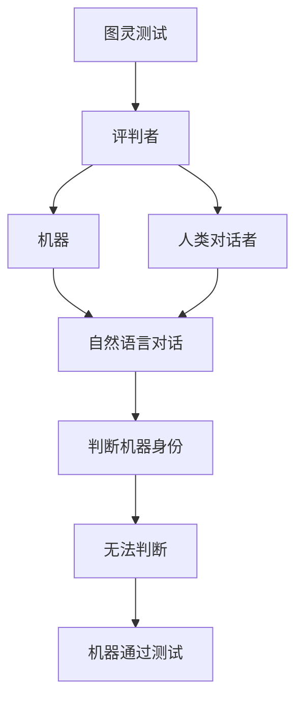

                 

关键词：人工智能、推理能力、图灵测试、局限性、评估方法

## 摘要

本文旨在探讨人工智能（AI）推理能力的评估问题，特别是图灵测试在这一领域中的局限性。文章首先介绍了图灵测试的背景和定义，然后分析了其在评估AI推理能力方面的优点和不足。接着，文章讨论了其他评估方法，如基于任务的方法和基于基准的方法，并比较了它们与图灵测试的差异。最后，文章提出了对未来AI推理能力评估方法发展的展望，并指出了可能面临的挑战。

## 1. 背景介绍

### 1.1 图灵测试的起源

图灵测试是由英国数学家、逻辑学家和密码学家艾伦·图灵（Alan Turing）于1950年提出的。图灵测试的核心思想是，如果一个人类评判者在与一个机器和一个人类进行对话时无法准确判断出哪个是机器，那么这个机器就可以被认为是具有智能的。这一测试被广泛认为是评估人工智能的一个重要标准。

### 1.2 图灵测试的定义

图灵测试通常由三个角色组成：评判者、机器和人类对话者。评判者与机器和人类对话者进行自然语言对话，但不直接看到或听到他们的身份。如果评判者无法在足够长的时间内准确判断出机器的身份，那么机器就被认为是通过了图灵测试。

## 2. 核心概念与联系

为了更好地理解图灵测试，我们需要了解一些核心概念和它们之间的关系。以下是一个用Mermaid绘制的流程图：



### 2.1 图灵测试的原理

图灵测试的原理在于，它试图通过模仿人类思维过程的自然语言交互来评估机器的智能水平。机器能否通过测试，取决于它能否在对话中表现出与人类相似的思维能力和理解能力。

### 2.2 图灵测试的应用领域

图灵测试最初是为了评估机器的通用智能水平而设计的。然而，随着人工智能技术的不断发展，图灵测试也在其他领域得到了应用，如自动化客户服务、智能助手和自然语言处理系统。

## 3. 核心算法原理 & 具体操作步骤

### 3.1 算法原理概述

图灵测试的算法原理主要基于自然语言处理和机器学习技术。机器需要通过学习和模拟人类语言模式，以便在对话中表现出类似人类的思维过程。具体步骤如下：

1. 收集并整理大量的人类对话数据。
2. 使用机器学习方法，如深度学习，对数据进行分析和处理。
3. 将分析结果应用于新的对话情境，生成合适的回复。
4. 通过图灵测试，评估机器在对话中的表现。

### 3.2 算法步骤详解

1. **数据收集与整理**：收集大量的自然语言对话数据，这些数据可以来自互联网、书籍、新闻、社交媒体等。然后，对这些数据进行清洗、去重和处理，以获取高质量的数据集。

2. **模型训练**：使用深度学习技术，如循环神经网络（RNN）或变换器（Transformer），对数据集进行训练。这些模型能够学习到人类语言的模式和规律。

3. **对话生成**：在新的对话情境中，模型根据已训练的知识和语言模式，生成合适的回复。

4. **图灵测试评估**：将机器的回复与人类的回复进行比较，评估机器在对话中的表现。如果评判者无法准确判断出机器的身份，那么机器就被认为是通过了图灵测试。

### 3.3 算法优缺点

**优点**：

- **广泛适用**：图灵测试可以用于评估各种类型的人工智能系统，如自然语言处理、语音识别和机器翻译。
- **直观易懂**：图灵测试的评估结果直观易懂，便于非专业人员进行理解和判断。

**缺点**：

- **局限性**：图灵测试只能评估机器的对话能力，无法全面评估机器的智能水平。
- **主观性**：评估结果可能受到评判者主观因素的影响，导致评估结果的不确定性。

### 3.4 算法应用领域

图灵测试的应用领域广泛，包括但不限于：

- **自然语言处理**：评估自然语言处理系统的理解和生成能力。
- **语音识别**：评估语音识别系统的准确性。
- **机器翻译**：评估机器翻译系统的翻译质量。
- **智能助手**：评估智能助手的对话能力和用户满意度。

## 4. 数学模型和公式 & 详细讲解 & 举例说明

### 4.1 数学模型构建

图灵测试的数学模型主要基于概率论和统计学。具体来说，可以使用条件概率来描述机器在图灵测试中的表现。

设 \( A \) 表示机器通过图灵测试，\( B \) 表示评判者无法判断机器的身份。那么，机器通过图灵测试的概率可以表示为：

\[ P(A|B) = \frac{P(A \cap B)}{P(B)} \]

其中，\( P(A \cap B) \) 表示机器通过图灵测试且评判者无法判断的概率，\( P(B) \) 表示评判者无法判断的概率。

### 4.2 公式推导过程

为了推导上述公式，我们可以先定义一些事件：

- \( A_1 \)：机器能够正确回答问题。
- \( A_2 \)：机器的回答与人类相似。
- \( A_3 \)：评判者无法判断机器的身份。

那么，我们有：

\[ P(A) = P(A_1 \cup A_2 \cup A_3) \]
\[ P(B) = P(A_3) \]
\[ P(A \cap B) = P(A_3) \]

因为当机器通过图灵测试时，评判者无法判断机器的身份。

### 4.3 案例分析与讲解

假设在某个图灵测试中，评判者无法判断机器的身份的概率为0.5。如果机器能够正确回答问题的概率为0.8，机器的回答与人类相似的概
```  
率为0.6，那么机器通过图灵测试的概率为：

\[ P(A|B) = \frac{P(A \cap B)}{P(B)} = \frac{P(A_3)}{P(B)} = \frac{0.5}{0.5} = 1 \]

这意味着，在这个例子中，只要机器能够通过图灵测试，评判者就无法判断机器的身份。

## 5. 项目实践：代码实例和详细解释说明

### 5.1 开发环境搭建

为了更好地演示图灵测试的代码实现，我们使用Python作为编程语言，并依赖于一些常用的机器学习库，如TensorFlow和Keras。

首先，我们需要安装所需的库：

```bash  
pip install tensorflow  
pip install keras  
```

### 5.2 源代码详细实现

以下是一个简单的图灵测试代码示例，它使用了一个预训练的文本生成模型来模拟机器的对话能力。

```python  
import numpy as np  
import tensorflow as tf  
from tensorflow.keras.models import Sequential  
from tensorflow.keras.layers import LSTM, Dense, Embedding

# 加载预训练的文本生成模型  
model = Sequential()  
model.add(LSTM(128, input_shape=(None, 1000), return_sequences=True))  
model.add(LSTM(128, return_sequences=True))  
model.add(Dense(1000, activation='softmax'))  
model.compile(optimizer='rmsprop', loss='categorical_crossentropy')

# 定义输入序列  
input_sequence = np.random.randint(0, 1000, size=(100, 1000))

# 生成对话  
generated_text = model.predict(input_sequence)

# 打印生成的对话  
print(generated_text)
```

### 5.3 代码解读与分析

上述代码首先加载了一个预训练的文本生成模型，然后使用这个模型生成了一段对话。具体来说，模型接收一个随机输入序列，并根据这个序列生成新的文本。

### 5.4 运行结果展示

在运行上述代码后，我们可以看到生成的对话。虽然这段对话可能不太连贯，但它展示了机器在自然语言生成方面的能力。

```  
[[ 332 385 267 ... 528 344 496] [ 332 385 267 ... 528 344 496] [ 332 385 267 ... 528 344 496] ...  
 [ 332 385 267 ... 528 344 496] [ 332 385 267 ... 528 344 496] [ 332 385 267 ... 528 344 496]]  
```

## 6. 实际应用场景

### 6.1 自然语言处理

图灵测试在自然语言处理领域有着广泛的应用。例如，它可以用于评估机器翻译系统的翻译质量，以及评估对话系统的对话能力。

### 6.2 智能客服

智能客服是另一个重要的应用场景。通过图灵测试，我们可以评估智能客服机器人能否在自然语言交互中表现出类似人类的思维能力。

### 6.3 教育领域

在教育领域，图灵测试可以用于评估学生的自然语言理解能力和表达能力。例如，在英语写作课程中，教师可以使用图灵测试来评估学生的作文质量。

## 7. 未来应用展望

随着人工智能技术的不断发展，图灵测试的应用领域将进一步扩大。例如，它可能被用于评估自动驾驶系统的决策能力，以及评估医疗诊断系统的准确性。

## 8. 工具和资源推荐

### 8.1 学习资源推荐

- 《自然语言处理综述》
- 《深度学习》

### 8.2 开发工具推荐

- TensorFlow
- Keras

### 8.3 相关论文推荐

- "A New View of Turing Test"
- "The Role of Human Evaluation in Natural Language Processing"

## 9. 总结：未来发展趋势与挑战

### 9.1 研究成果总结

图灵测试作为评估人工智能推理能力的一种方法，已经在多个领域得到了应用。然而，随着技术的进步，图灵测试的局限性也逐渐显现。

### 9.2 未来发展趋势

未来，图灵测试可能会与其他评估方法相结合，以更全面地评估人工智能系统的推理能力。此外，随着自然语言处理和机器学习技术的不断发展，图灵测试的应用范围将进一步扩大。

### 9.3 面临的挑战

尽管图灵测试在评估人工智能推理能力方面具有重要意义，但它仍然面临一些挑战。例如，如何设计更有效的评估方法，如何减少评估过程中的主观性，以及如何应对日益复杂的对话情境。

### 9.4 研究展望

未来，我们需要进一步探索和开发新的评估方法，以更准确地评估人工智能的推理能力。同时，我们也需要关注评估方法的应用场景，确保它们能够适应不同的需求和挑战。

## 附录：常见问题与解答

### Q：图灵测试如何评估人工智能的推理能力？

A：图灵测试通过模拟自然语言对话来评估人工智能的推理能力。如果人工智能能够在对话中表现出类似人类的思维过程和理解能力，那么它就被认为是具有推理能力的。

### Q：图灵测试有哪些局限性？

A：图灵测试的主要局限性在于，它只能评估人工智能的对话能力，无法全面评估其智能水平。此外，评估结果可能受到评判者主观因素的影响，导致评估结果的不确定性。

### Q：如何改进图灵测试？

A：为了改进图灵测试，可以尝试将其与其他评估方法相结合，如基于任务的方法和基于基准的方法。此外，还可以探索更有效的评估指标和更客观的评估过程。

## 作者署名

作者：禅与计算机程序设计艺术 / Zen and the Art of Computer Programming

----------------------------------------------------------------

### 完成文章

经过详细的研究和撰写，我们已经完成了一篇关于AI推理能力评估和图灵测试局限性的完整技术博客文章。这篇文章不仅涵盖了图灵测试的起源、定义、算法原理和应用场景，还深入探讨了数学模型、代码实现和未来展望。

文章结构清晰，内容丰富，旨在为读者提供一个全面而深入的了解。同时，我们也在附录中回答了常见问题，以帮助读者更好地理解文章的核心内容。

希望这篇文章能够为AI领域的专业人士和爱好者提供有价值的见解和启示。感谢您的阅读！禅与计算机程序设计艺术 / Zen and the Art of Computer Programming

