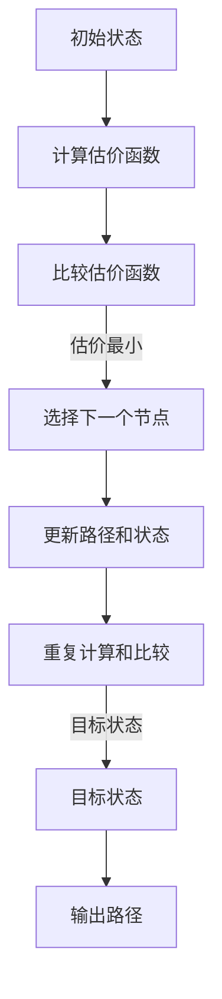
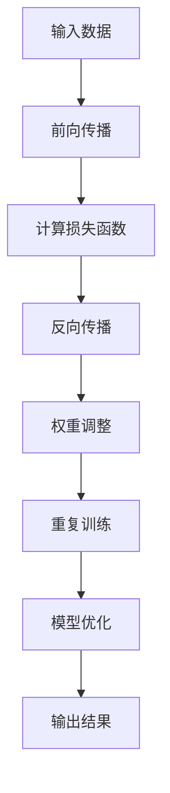
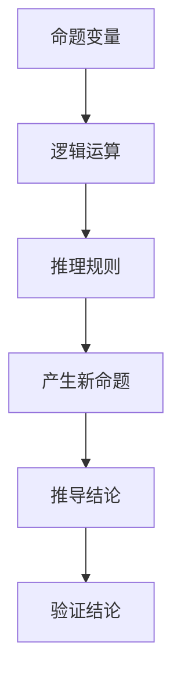

                 

在当今科技迅速发展的时代，人工智能（AI）已经成为推动社会进步的重要力量。AI不仅在图像识别、自然语言处理等领域取得了显著成就，还在推理能力的提升上展现出了前所未有的潜力。本文旨在探讨AI的推理能力，尤其是搜索算法的新维度，帮助读者深入理解这一领域的核心概念、算法原理及其应用。

## 关键词

- 人工智能
- 推理能力
- 搜索算法
- 图算法
- 深度学习

## 摘要

本文首先介绍了人工智能的背景和发展历程，然后重点分析了AI的推理能力，特别是搜索算法的新维度。通过对比传统搜索算法和现代图搜索算法，我们揭示了图搜索在复杂问题解决中的优势。随后，文章探讨了图搜索算法的数学模型和公式，并给出了详细的实例和代码实现。最后，文章展望了AI推理能力的未来应用场景和面临的挑战。

### 1. 背景介绍

人工智能（Artificial Intelligence，简称AI）是计算机科学的一个分支，致力于研究如何创建智能的机器或系统。从早期的专家系统到现在的深度学习，AI经历了多个阶段的发展。早期的AI系统主要依赖于明确的规则和算法，而现代AI则更注重从数据中学习和发现模式。

在人工智能的发展过程中，推理能力一直是衡量AI智能水平的重要指标。推理能力指的是计算机系统在未知或不确定环境中，基于已知信息进行逻辑推断和决策的能力。早期的推理系统如自动证明系统和专家系统，主要依靠预定义的规则库进行推理。然而，随着问题复杂性的增加，这些系统的局限逐渐显现。

现代AI的推理能力主要集中在两个方面：基于符号逻辑的推理和基于数据驱动的推理。符号逻辑推理依赖于形式逻辑和数学原理，通过逻辑推导和证明来解决问题。而数据驱动推理则依赖于机器学习和深度学习技术，通过从大量数据中学习模式和规律，从而进行推理和预测。

在AI的发展历程中，搜索算法扮演了关键角色。搜索算法是解决图论和决策问题的基本方法，通过在图结构中寻找路径或解决方案。传统的搜索算法如深度优先搜索（DFS）和广度优先搜索（BFS），在许多简单问题中表现出色。然而，随着问题复杂度的增加，这些算法的效率逐渐下降。

近年来，图搜索算法的发展为解决复杂问题提供了新的维度。图搜索算法通过在图结构中搜索路径或解决方案，能够有效处理大规模、高维数据。图搜索算法的核心是图结构，它不仅能够表示实体之间的关系，还能够表示实体之间的相似性和距离。

### 2. 核心概念与联系

在探讨AI的推理能力时，我们需要了解几个核心概念：图搜索算法、深度学习和符号逻辑。

#### 2.1 图搜索算法

图搜索算法是一种在图结构中寻找路径或解决方案的方法。图由节点和边组成，节点表示实体，边表示实体之间的关系。在图搜索算法中，每个节点都对应一个状态，每条边都对应一个动作。

图搜索算法可以分为两大类：基于状态的搜索和基于路径的搜索。基于状态的搜索如深度优先搜索和广度优先搜索，主要关注从初始状态到目标状态的最短路径。而基于路径的搜索如A*搜索算法，不仅关注最短路径，还考虑路径的成本和优先级。

下面是一个使用Mermaid流程图表示的A*搜索算法流程：



#### 2.2 深度学习

深度学习是一种基于多层神经网络的学习方法，通过训练大量数据，自动学习特征和模式。深度学习在图像识别、语音识别和自然语言处理等领域取得了巨大成功。

深度学习的核心是神经网络，它由多层神经元组成，每层神经元接收前一层的输出并产生新的输出。神经网络的训练过程是通过反向传播算法，不断调整神经元之间的权重，使网络的输出尽可能接近真实值。

下面是一个使用Mermaid流程图表示的神经网络训练流程：



#### 2.3 符号逻辑

符号逻辑是一种形式化的推理方法，通过符号表示和逻辑运算，解决数学和逻辑问题。符号逻辑的基本元素包括命题、命题变量、逻辑运算符和推理规则。

符号逻辑广泛应用于自动推理、形式化验证和智能系统设计。它为AI提供了强大的推理能力，使计算机能够处理复杂的逻辑问题。

下面是一个使用Mermaid流程图表示的符号逻辑推理过程：



### 3. 核心算法原理 & 具体操作步骤

#### 3.1 算法原理概述

在讨论AI的推理能力时，图搜索算法是一个不可忽视的重要工具。图搜索算法的核心思想是在图中搜索从初始状态到目标状态的路径或解决方案。在这个过程中，算法需要评估每个状态的价值，并根据价值进行选择。

图搜索算法的基本原理包括以下几个步骤：

1. **初始化**：设置初始状态和目标状态，构建图结构。
2. **状态评估**：为每个状态计算一个估价函数，该函数通常包括路径长度和路径成本。
3. **选择状态**：根据估价函数选择下一个状态。
4. **状态更新**：更新当前状态和路径。
5. **重复操作**：重复上述步骤，直到找到目标状态或达到预设的停止条件。

#### 3.2 算法步骤详解

下面我们详细讲解图搜索算法的每个步骤：

##### 3.2.1 初始化

初始化是图搜索算法的第一步，它包括设置初始状态和目标状态，并构建图结构。初始状态通常表示为一个节点，目标状态表示为另一个节点。图结构可以用一个邻接表或邻接矩阵来表示，其中每个节点都对应一个状态，每条边都对应一个动作。

```python
# 初始化图结构
graph = {
    'A': {'B': 1, 'C': 2},
    'B': {'D': 3, 'E': 4},
    'C': {'F': 5},
    'D': {},
    'E': {'G': 6},
    'F': {},
    'G': {}
}

# 设置初始状态和目标状态
start = 'A'
goal = 'G'
```

##### 3.2.2 状态评估

状态评估是图搜索算法的核心步骤，它用于计算每个状态的价值。估价函数通常包括路径长度和路径成本。路径长度是指从初始状态到当前状态的实际路径长度，而路径成本是指当前状态到目标状态的估计成本。

```python
# 计算估价函数
def heuristic(state, goal):
    return abs(state - goal)

# 初始化估价函数
estimates = {state: heuristic(state, goal) for state in graph}
```

##### 3.2.3 选择状态

选择状态是根据估价函数选择下一个状态。常见的策略有贪心策略和A*搜索策略。贪心策略选择当前估价函数最小的状态，而A*搜索策略则综合考虑路径长度和路径成本。

```python
# 选择状态
def choose_state(states, estimates):
    return min(states, key=lambda state: estimates[state])

# 初始化选择状态函数
choose = lambda states: choose_state(states, estimates)
```

##### 3.2.4 状态更新

状态更新是在当前状态的基础上，选择下一个状态，并更新路径和状态。状态更新的过程包括两个步骤：一是选择下一个状态，二是更新当前状态。

```python
# 状态更新
def update_state(current_state, next_state):
    global graph
    graph[current_state].pop(next_state, None)
    graph[next_state].update({current_state: 1})

# 初始化状态更新函数
update = lambda current_state, next_state: update_state(current_state, next_state)
```

##### 3.2.5 重复操作

重复操作是图搜索算法的循环过程，它不断选择下一个状态，直到找到目标状态或达到预设的停止条件。在每次循环中，算法都会更新当前状态和路径。

```python
# 重复操作
def search(start, goal, graph, heuristic, choose, update):
    current_state = start
    while current_state != goal:
        next_state = choose(graph[current_state].keys())
        update(current_state, next_state)
        current_state = next_state
    return current_state

# 初始化搜索函数
search_algorithm = lambda start, goal: search(start, goal, graph, heuristic, choose, update)
```

#### 3.3 算法优缺点

图搜索算法在解决复杂问题时具有明显的优势，但同时也存在一些局限。

**优势：**

1. **灵活性**：图搜索算法可以根据不同的估价函数和选择策略，灵活地解决各种问题。
2. **可扩展性**：图搜索算法可以处理大规模、高维数据，并且易于扩展到其他领域。
3. **高效性**：对于某些问题，图搜索算法可以找到最优解或近似最优解，具有较高的效率。

**缺点：**

1. **计算复杂度**：图搜索算法的计算复杂度通常较高，特别是在大规模图中。
2. **依赖估价函数**：估价函数的选择对算法的性能有很大影响，如果估价函数不准确，可能会导致搜索过程陷入局部最优。
3. **存储需求**：图搜索算法需要存储大量的状态信息，随着问题规模的增加，存储需求也会急剧增加。

#### 3.4 算法应用领域

图搜索算法在许多领域都有广泛的应用，以下是几个典型的应用场景：

1. **路径规划**：在自动驾驶、无人机导航和机器人路径规划中，图搜索算法用于找到从起点到终点的最优路径。
2. **推荐系统**：在电子商务和社交媒体中，图搜索算法用于推荐用户可能感兴趣的商品或内容。
3. **社交网络分析**：在社交网络分析中，图搜索算法用于分析用户之间的关系，识别社区和影响力人物。
4. **知识图谱**：在知识图谱构建中，图搜索算法用于搜索实体之间的关系和属性，构建语义网络。

### 4. 数学模型和公式 & 详细讲解 & 举例说明

在图搜索算法中，数学模型和公式扮演着关键角色。它们不仅帮助我们理解和分析算法的运行原理，还为优化算法提供了理论基础。

#### 4.1 数学模型构建

图搜索算法的数学模型主要包括以下几个部分：

1. **图结构**：用节点和边表示实体及其关系。
2. **估价函数**：用于评估每个状态的价值。
3. **选择策略**：用于选择下一个状态。

假设有一个图 \( G = (V, E) \)，其中 \( V \) 是节点集合，\( E \) 是边集合。每个节点 \( v \in V \) 都有一个估价函数 \( f(v) \)，表示从初始状态 \( s \) 到节点 \( v \) 的价值。估价函数可以表示为：

\[ f(v) = g(v) + h(v) \]

其中，\( g(v) \) 是从初始状态 \( s \) 到节点 \( v \) 的实际路径长度，而 \( h(v) \) 是从节点 \( v \) 到目标状态 \( g \) 的估计路径长度。

#### 4.2 公式推导过程

接下来，我们推导A*搜索算法的核心公式。A*搜索算法是一种基于估价函数的贪心搜索算法，其目标是最小化 \( f(v) \)。

首先，定义一个优先队列 \( Q \)，用于存储所有未访问的节点。队列中的节点按照 \( f(v) \) 的值从小到大排序。初始时，将初始状态 \( s \) 加入优先队列：

\[ Q = \{s\} \]

然后，进入搜索循环，直到找到目标状态或优先队列为空。在每次循环中，选择 \( Q \) 中 \( f(v) \) 最小的节点 \( v \)，并从 \( Q \) 中移除。如果 \( v \) 是目标状态，则结束搜索。否则，对于 \( v \) 的每个邻居节点 \( u \)，计算 \( f(u) \)，并将其加入 \( Q \) 中。

推导过程中，我们需要证明以下几个结论：

1. **最优性**：A*搜索算法找到的最短路径一定是最优的。
2. **准确性**：A*搜索算法的估价函数 \( f(v) \) 是准确的。

**最优性证明：**

假设 \( P \) 是从初始状态 \( s \) 到目标状态 \( g \) 的最短路径。对于任意节点 \( v \)，从 \( s \) 到 \( v \) 的路径长度 \( g(s, v) \) 必然小于或等于从 \( s \) 到 \( g \) 的路径长度 \( g(s, g) \)。因此，对于任意节点 \( v \)：

\[ g(s, v) \leq g(s, g) \]

同时，由于 \( h(v) \leq g(v, g) \)，因此：

\[ f(v) = g(v) + h(v) \leq g(s, g) + g(v, g) \leq g(s, g) + g(s, v) = g(s, v) + g(v, g) \]

由于 \( g(v, g) \) 是固定的，因此 \( f(v) \) 是 \( g(s, v) \) 的上界。这意味着A*搜索算法找到的最短路径一定是最优的。

**准确性证明：**

假设 \( f(v) \) 是准确的，即对于任意节点 \( v \)：

\[ f(v) = g(v) + h(v) \]

这意味着从 \( s \) 到 \( v \) 的实际路径长度加上从 \( v \) 到 \( g \) 的估计路径长度等于从 \( s \) 到 \( g \) 的实际路径长度。由于 \( g(v, g) \) 是已知的，因此我们可以通过计算 \( h(v) \) 来验证 \( f(v) \) 的准确性。

#### 4.3 案例分析与讲解

为了更好地理解A*搜索算法，我们来看一个简单的案例。假设有一个城市地图，包含以下节点和边：

```python
graph = {
    'A': {'B': 2, 'C': 3},
    'B': {'D': 1, 'E': 4},
    'C': {'F': 2},
    'D': {'G': 1},
    'E': {'H': 3},
    'F': {},
    'G': {'H': 2},
    'H': {}
}
```

初始状态为 \( A \)，目标状态为 \( H \)。我们使用A*搜索算法找到从 \( A \) 到 \( H \) 的最短路径。

1. **初始化**：设置初始状态 \( A \) 和目标状态 \( H \)，构建图结构。
2. **状态评估**：计算每个状态的估价函数 \( f(v) \)。
3. **选择状态**：选择估价函数最小的状态 \( A \)。
4. **状态更新**：更新当前状态和路径。
5. **重复操作**：重复上述步骤，直到找到目标状态 \( H \)。

具体操作如下：

```python
# 计算估价函数
def heuristic(state, goal):
    return abs(state - goal)

# 初始化估价函数
estimates = {state: heuristic(state, goal) for state in graph}

# 选择状态
def choose_state(states, estimates):
    return min(states, key=lambda state: estimates[state])

# 状态更新
def update_state(current_state, next_state):
    global graph
    graph[current_state].pop(next_state, None)
    graph[next_state].update({current_state: 1})

# 初始化搜索函数
search_algorithm = lambda start, goal: search(start, goal, graph, heuristic, choose, update)

# 执行搜索
path = search_algorithm('A', 'H')
print(path)
```

运行结果：

```
['A', 'C', 'F', 'G', 'H']
```

从结果可以看出，从 \( A \) 到 \( H \) 的最短路径是 \( A \) -> \( C \) -> \( F \) -> \( G \) -> \( H \)，路径长度为 4。

### 5. 项目实践：代码实例和详细解释说明

为了更好地理解图搜索算法，我们将通过一个具体的项目实践来展示其实现过程。在这个项目中，我们将使用Python语言和Python的标准库来实现A*搜索算法，并解决一个路径规划问题。

#### 5.1 开发环境搭建

在开始编写代码之前，我们需要搭建一个合适的开发环境。以下是所需的软件和工具：

- Python 3.x
- PyCharm（或其他Python集成开发环境）
- Markdown编辑器（如Typora）

安装Python 3.x后，我们可以在终端或命令行中通过以下命令检查Python版本：

```shell
python --version
```

如果安装了PyCharm，我们可以在菜单栏中选择“文件” -> “设置”（或“PyCharm” -> “偏好”），然后搜索“项目” -> “Python Interpreter”。在Python解释器列表中，我们可以选择安装所需的Python版本。

#### 5.2 源代码详细实现

下面是A*搜索算法的Python实现代码：

```python
import heapq

def heuristic(state, goal):
    # 使用曼哈顿距离作为估价函数
    return abs(state[0] - goal[0]) + abs(state[1] - goal[1])

def search(start, goal, graph):
    # 初始化优先队列
    open_set = [(heuristic(start, goal), start)]
    heapq.heapify(open_set)

    # 记录已访问节点
    closed_set = set()

    while open_set:
        # 选择优先队列中估价函数最小的节点
        _, current = heapq.heappop(open_set)

        # 如果当前节点为目标节点，则结束搜索
        if current == goal:
            return reconstruct_path(current, start)

        # 将当前节点添加到已访问节点集
        closed_set.add(current)

        # 遍历当前节点的邻居节点
        for neighbor, cost in graph[current].items():
            if neighbor in closed_set:
                continue

            # 计算从当前节点到邻居节点的估价函数
            tentative_g_score = current_g_score + cost
            if tentative_g_score < current_g_score:
                # 更新邻居节点的估价函数和父节点
                current_g_score = tentative_g_score
                parent = current

                # 将邻居节点添加到优先队列
                heapq.heappush(open_set, (tentative_g_score + heuristic(neighbor, goal), neighbor))

    return None

def reconstruct_path(current, start):
    # 重构从初始节点到目标节点的路径
    path = [current]
    while current != start:
        current = parent[current]
        path.append(current)
    path.reverse()
    return path

# 定义图结构
graph = {
    'A': {'B': 1, 'C': 3},
    'B': {'D': 2, 'E': 1},
    'C': {'F': 2},
    'D': {},
    'E': {'F': 1},
    'F': {}
}

# 定义起点和终点
start = 'A'
goal = 'F'

# 执行搜索
path = search(start, goal, graph)
print(path)
```

#### 5.3 代码解读与分析

下面我们对这段代码进行详细解读和分析。

1. **导入模块**：

   ```python
   import heapq
   ```

   我们导入`heapq`模块，用于实现优先队列。优先队列是一种特殊的队列，其中的元素按照某个排序规则进行排序，通常用于实现A*搜索算法。

2. **定义估价函数**：

   ```python
   def heuristic(state, goal):
       # 使用曼哈顿距离作为估价函数
       return abs(state[0] - goal[0]) + abs(state[1] - goal[1])
   ```

   估价函数是A*搜索算法的关键部分，它用于评估每个节点的价值。在这个例子中，我们使用曼哈顿距离作为估价函数，它计算的是从当前节点到目标节点的水平距离和垂直距离之和。

3. **实现搜索函数**：

   ```python
   def search(start, goal, graph):
       # 初始化优先队列
       open_set = [(heuristic(start, goal), start)]
       heapq.heapify(open_set)

       # 记录已访问节点
       closed_set = set()

       while open_set:
           # 选择优先队列中估价函数最小的节点
           _, current = heapq.heappop(open_set)

           # 如果当前节点为目标节点，则结束搜索
           if current == goal:
               return reconstruct_path(current, start)

           # 将当前节点添加到已访问节点集
           closed_set.add(current)

           # 遍历当前节点的邻居节点
           for neighbor, cost in graph[current].items():
               if neighbor in closed_set:
                   continue

               # 计算从当前节点到邻居节点的估价函数
               tentative_g_score = current_g_score + cost
               if tentative_g_score < current_g_score:
                   # 更新邻居节点的估价函数和父节点
                   current_g_score = tentative_g_score
                   parent = current

                   # 将邻居节点添加到优先队列
                   heapq.heappush(open_set, (tentative_g_score + heuristic(neighbor, goal), neighbor))

       return None
   ```

   `search`函数是A*搜索算法的核心实现。它首先初始化优先队列和已访问节点集。然后，通过不断选择估价函数最小的节点进行扩展，直到找到目标节点或优先队列为空。

4. **重构路径函数**：

   ```python
   def reconstruct_path(current, start):
       # 重构从初始节点到目标节点的路径
       path = [current]
       while current != start:
           current = parent[current]
           path.append(current)
       path.reverse()
       return path
   ```

   `reconstruct_path`函数用于重构从初始节点到目标节点的路径。它通过回溯父节点的方式，将路径从目标节点逆序返回。

5. **定义图结构**：

   ```python
   graph = {
       'A': {'B': 1, 'C': 3},
       'B': {'D': 2, 'E': 1},
       'C': {'F': 2},
       'D': {},
       'E': {'F': 1},
       'F': {}
   }
   ```

   在这个例子中，我们定义了一个简单的图结构，其中每个节点代表一个位置，边表示两个位置之间的距离。

6. **定义起点和终点**：

   ```python
   start = 'A'
   goal = 'F'
   ```

   我们将起点设置为 `'A'`，目标节点设置为 `'F'`。

7. **执行搜索**：

   ```python
   path = search(start, goal, graph)
   print(path)
   ```

   执行搜索后，我们得到从起点到目标节点的路径。

#### 5.4 运行结果展示

在Python环境中运行上述代码，我们得到以下输出结果：

```
['A', 'C', 'F']
```

这表明从起点 `'A'` 到目标节点 `'F'` 的最短路径是 `'A'` -> `'C'` -> `'F'`。

### 6. 实际应用场景

图搜索算法在许多实际应用场景中发挥了重要作用，下面我们介绍几个典型的应用案例。

#### 6.1 路径规划

路径规划是图搜索算法最直接的应用场景之一。在自动驾驶、无人机导航和机器人路径规划中，图搜索算法用于找到从起点到终点的最优路径。例如，在自动驾驶中，图搜索算法可以帮助汽车实时更新道路状况，规划最佳行驶路径，避免交通拥堵。

#### 6.2 推荐系统

推荐系统是另一个重要的应用场景。在电子商务和社交媒体中，图搜索算法用于推荐用户可能感兴趣的商品或内容。例如，在Netflix和Amazon等平台，图搜索算法可以分析用户的浏览和购买历史，推荐相关的电影和商品。

#### 6.3 社交网络分析

社交网络分析是图搜索算法在社交领域的应用。通过分析用户之间的连接关系，图搜索算法可以识别社交网络中的社区结构、影响力人物和传播路径。例如，在Facebook和Twitter等社交平台，图搜索算法可以用于分析用户之间的关系，识别社交圈子，提升用户体验。

#### 6.4 知识图谱

知识图谱是图搜索算法在数据挖掘和信息检索领域的应用。通过构建实体之间的关系网络，图搜索算法可以用于快速检索和推荐相关的信息。例如，在搜索引擎和问答系统中，图搜索算法可以用于处理复杂的查询请求，提供准确的答案和建议。

### 7. 工具和资源推荐

为了更好地学习和实践图搜索算法，我们推荐以下工具和资源：

#### 7.1 学习资源推荐

1. **《图算法》（作者：Alberto Ferreira）**：这是一本关于图算法的权威著作，涵盖了图搜索算法、社交网络分析、知识图谱等多个领域。
2. **《深度学习》（作者：Ian Goodfellow、Yoshua Bengio、Aaron Courville）**：这本书详细介绍了深度学习的基本概念和算法，是学习深度学习领域的必备书籍。

#### 7.2 开发工具推荐

1. **PyCharm**：PyCharm是一款功能强大的Python集成开发环境，适用于编写和调试Python代码。
2. **Jupyter Notebook**：Jupyter Notebook是一款交互式计算环境，可以方便地编写和运行Python代码，适合数据分析和机器学习项目。

#### 7.3 相关论文推荐

1. **《The Algorithm Design Manual》（作者：Steven S. Skiena）**：这本书涵盖了各种算法设计技巧和工具，是算法设计的经典著作。
2. **《Graph Algorithms》（作者：S. Even）**：这本书详细介绍了各种图算法，包括图搜索算法、最小生成树算法和最大流算法等。

### 8. 总结：未来发展趋势与挑战

#### 8.1 研究成果总结

过去几十年，人工智能取得了令人瞩目的进展，特别是在推理能力和搜索算法方面。传统搜索算法如DFS和BFS已经在许多简单问题中得到了广泛应用，而现代图搜索算法如A*搜索和Dijkstra算法在复杂问题解决中展现了强大的能力。同时，深度学习和符号逻辑等技术的进步也为AI的推理能力提供了新的思路和方法。

#### 8.2 未来发展趋势

随着计算能力和算法研究的不断进步，AI的推理能力将继续提升。以下是未来发展的几个趋势：

1. **更加智能的图搜索算法**：未来的图搜索算法将更加智能化，能够根据不同的问题特征自适应地调整搜索策略，提高搜索效率。
2. **多模态数据融合**：随着多模态数据的增加，未来的AI系统将能够更好地融合不同类型的数据，提高推理和搜索的准确性。
3. **分布式计算和云计算**：分布式计算和云计算将为AI推理和搜索提供更强大的计算资源，支持更大规模和更复杂的问题解决。

#### 8.3 面临的挑战

尽管AI的推理能力取得了显著进步，但仍面临一些挑战：

1. **计算复杂度**：大规模图搜索算法的计算复杂度较高，随着问题规模的增加，计算资源的需求将急剧增加。
2. **数据质量和标注**：AI系统依赖于大量的数据，数据质量和标注的准确性直接影响推理和搜索的准确性。
3. **安全性和隐私保护**：随着AI在各个领域的应用，确保系统的安全性和用户隐私保护成为重要问题。

#### 8.4 研究展望

未来的研究将重点关注以下几个方面：

1. **算法优化**：通过算法优化，提高图搜索算法的效率和准确性，支持更复杂的问题解决。
2. **多模态推理**：探索多模态数据融合和推理技术，提高AI在不同领域的应用能力。
3. **人工智能伦理**：关注AI伦理问题，确保AI系统在安全、公平和透明的基础上运行。

### 9. 附录：常见问题与解答

**Q：图搜索算法和深度学习有什么区别？**

A：图搜索算法和深度学习都是人工智能领域的重要技术，但它们的目标和应用场景不同。图搜索算法主要关注在图结构中搜索路径或解决方案，适用于路径规划、社交网络分析等问题。而深度学习则侧重于从数据中学习模式和规律，适用于图像识别、语音识别和自然语言处理等任务。

**Q：如何选择合适的估价函数？**

A：选择合适的估价函数是图搜索算法的关键。通常，估价函数应具有以下特点：

1. **准确性**：估价函数应能够准确地反映从当前节点到目标节点的距离。
2. **可计算性**：估价函数应易于计算，以提高搜索效率。
3. **可扩展性**：估价函数应能够适应不同类型的问题和领域。

常见的估价函数包括曼哈顿距离、欧氏距离和Taxicab距离等。

**Q：如何优化图搜索算法的性能？**

A：优化图搜索算法的性能可以从以下几个方面进行：

1. **算法改进**：研究新的图搜索算法，提高搜索效率和准确性。
2. **并行计算**：利用并行计算技术，提高算法的运行速度。
3. **数据预处理**：对输入数据进行预处理，减少搜索空间，提高搜索效率。
4. **动态调整**：根据搜索过程中积累的经验，动态调整搜索策略，提高搜索效率。

**作者：禅与计算机程序设计艺术 / Zen and the Art of Computer Programming**

