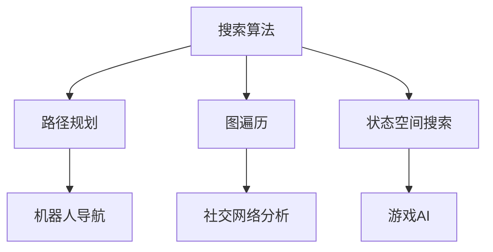
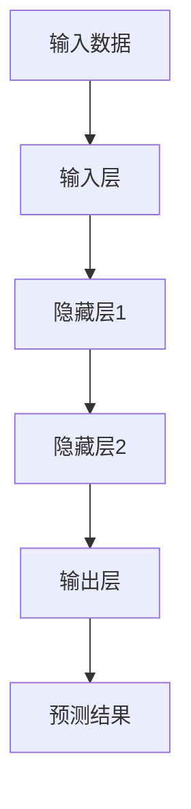
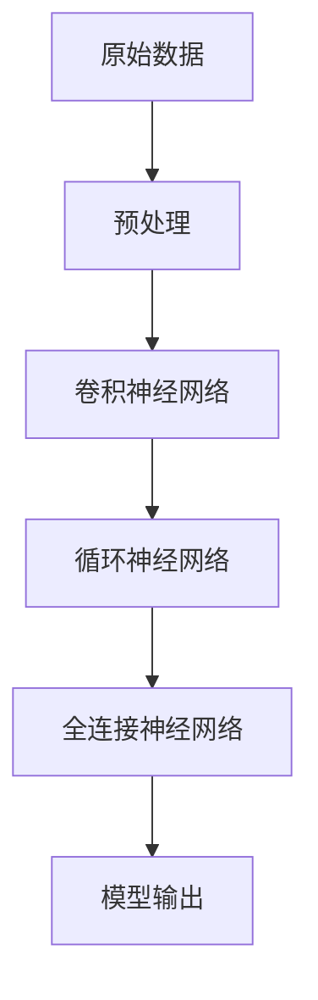
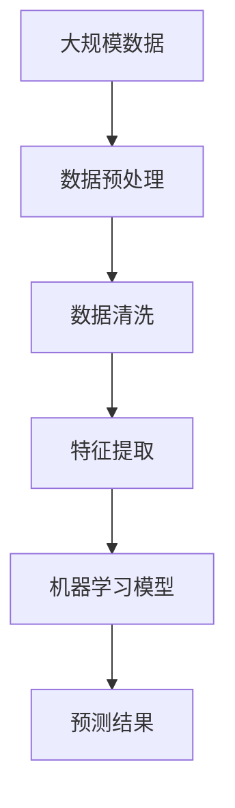
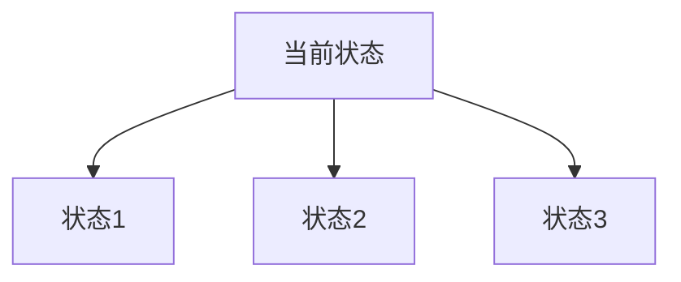
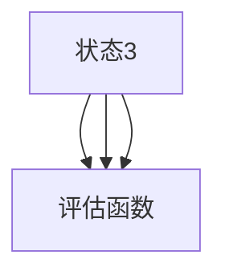
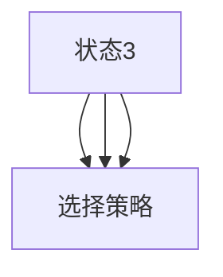
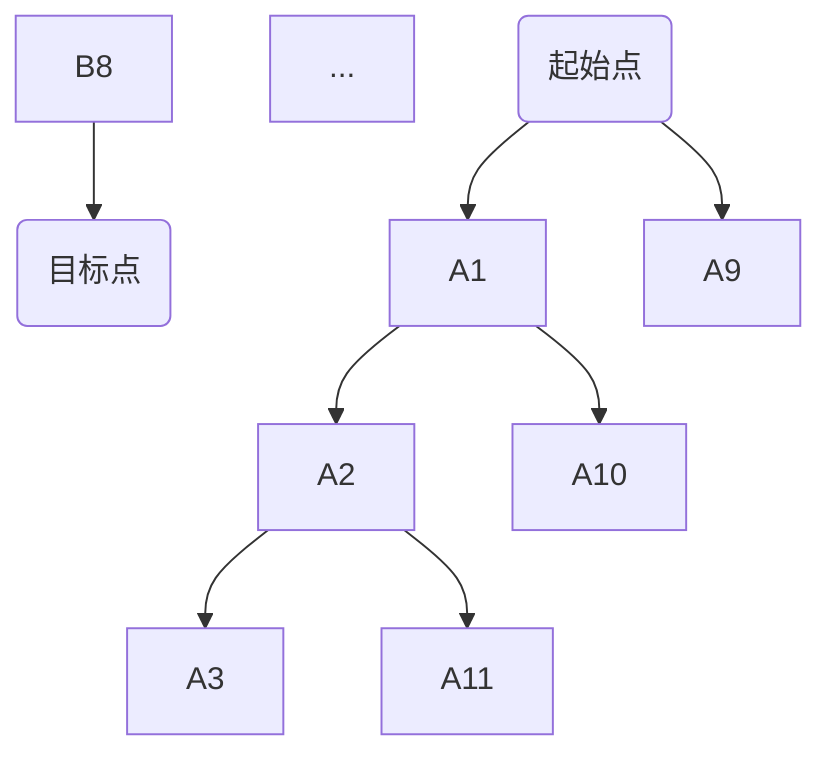

                 

关键词：人工智能，推理能力，搜索算法，深度学习，神经网络，图灵测试，计算机视觉，自然语言处理，大数据分析

> 摘要：本文深入探讨了人工智能（AI）中的推理能力，分析了搜索算法在AI中的应用及其新维度。通过介绍核心概念、算法原理、数学模型、项目实践和未来展望，文章旨在为读者提供一个全面而系统的理解，揭示AI推理能力的无限可能。

## 1. 背景介绍

人工智能（AI）作为计算机科学的一个分支，已经经历了数十年的发展。从最初的符号主义到连接主义，再到近年来的深度学习，AI技术在不断进步，尤其是在推理能力的提升上表现出色。推理是智能行为的核心，是指从已知信息中推断出未知信息的能力。传统的搜索算法在解决复杂问题时存在效率瓶颈，而现代的AI技术，特别是深度学习，为搜索算法带来了新的维度。

搜索算法在AI中的应用可以追溯到最早的人工智能系统，如专家系统和逻辑推理系统。然而，随着数据量的爆炸式增长和计算能力的提升，深度学习成为了AI领域的主流技术，使得搜索算法得以在新的层面上发挥作用。本文将重点关注AI的推理能力，并探讨如何通过搜索算法实现这一能力。

## 2. 核心概念与联系

在深入探讨AI的推理能力之前，我们需要了解一些核心概念，包括搜索算法、神经网络、深度学习和大数据分析。以下是这些概念之间的联系，以及一个简化的Mermaid流程图，用于描述这些概念之间的交互。

### 2.1 搜索算法

搜索算法是解决特定问题的方法，其核心是在庞大的数据集中找到满足特定条件的元素。常见的搜索算法包括深度优先搜索（DFS）、广度优先搜索（BFS）、A*搜索等。这些算法在传统AI系统中得到了广泛应用。



### 2.2 神经网络

神经网络是模仿人脑工作方式的计算模型，由大量的神经元（节点）组成。每个神经元接收输入信号，通过加权求和处理，产生输出信号。神经网络可以分为多层，包括输入层、隐藏层和输出层。



### 2.3 深度学习

深度学习是神经网络的一种，它通过多层神经网络（即深度神经网络）来学习和表示数据。深度学习的关键在于其能够自动提取特征，而不需要人工指定。



### 2.4 大数据分析

大数据分析是处理和分析大量数据的方法。在AI中，大数据分析可以帮助我们更好地理解数据和提取有价值的信息。



## 3. 核心算法原理 & 具体操作步骤

### 3.1 算法原理概述

在AI中，搜索算法的原理主要包括以下几个步骤：

1. **初始化**：创建一个初始状态，作为搜索的起点。
2. **扩展**：从当前状态生成下一个状态。
3. **评估**：评估每个生成的状态的优劣。
4. **选择**：选择一个最优的状态作为下一步搜索的起点。
5. **终止条件**：当找到目标状态或达到某个搜索深度时，终止搜索。

### 3.2 算法步骤详解

#### 3.2.1 初始化

初始化过程包括创建一个初始状态，该状态通常是问题定义的一部分。例如，在路径规划问题中，初始状态可能是一个坐标点。


#### 3.2.2 扩展

扩展过程是指从当前状态生成新的状态。在搜索算法中，扩展通常通过遍历当前状态的所有可能动作来实现。



#### 3.2.3 评估

评估过程是对每个生成状态进行评估，以确定其优劣。评估函数通常基于问题定义，例如在路径规划中，评估函数可能基于距离目标点的距离。



#### 3.2.4 选择

选择过程是基于评估结果，选择一个最优的状态作为下一步的搜索起点。选择策略可以是贪婪策略、最短路径策略等。



#### 3.2.5 终止条件

终止条件是指搜索何时停止。常见的终止条件包括找到目标状态或达到某个搜索深度。


### 3.3 算法优缺点

#### 优点

- **高效性**：搜索算法可以在大规模数据集中快速找到解决方案。
- **通用性**：搜索算法可以应用于各种问题，如路径规划、状态空间搜索等。

#### 缺点

- **计算成本高**：在某些情况下，搜索算法可能需要大量的计算资源。
- **可扩展性差**：对于某些复杂问题，搜索算法可能无法有效地扩展。

### 3.4 算法应用领域

搜索算法在AI中有广泛的应用，以下是一些典型领域：

- **路径规划**：在自动驾驶、无人机导航等领域。
- **游戏AI**：在棋类游戏、电子竞技等领域。
- **状态空间搜索**：在机器人控制、游戏AI等领域。
- **图遍历**：在社交网络分析、搜索引擎等领域。

## 4. 数学模型和公式 & 详细讲解 & 举例说明

在AI的推理能力中，数学模型和公式起到了关键作用。以下将详细讲解一些常见的数学模型和公式，并通过具体例子进行说明。

### 4.1 数学模型构建

一个基本的搜索算法可以用以下数学模型表示：

$$
\begin{cases}
S_{0} = \text{初始状态} \\
A = \text{所有可能动作的集合} \\
G(S) = \text{评估函数} \\
\end{cases}
$$

其中，$S_{0}$ 是初始状态，$A$ 是所有可能动作的集合，$G(S)$ 是评估函数。

### 4.2 公式推导过程

以A*搜索算法为例，其评估函数的推导过程如下：

$$
F(S) = G(S) + h(S)
$$

其中，$G(S)$ 是从初始状态到当前状态的代价，$h(S)$ 是从当前状态到目标状态的估计代价。

### 4.3 案例分析与讲解

假设我们要在地图上找到从点A到点B的最短路径。点A和点B的坐标分别是 $(0,0)$ 和 $(5,5)$。地图上有若干障碍物，其坐标为 $(2,2)$ 和 $(3,3)$。

我们可以构建一个图模型，其中每个点表示一个状态，每条边表示一个动作。初始状态为点A，目标状态为点B。

通过A*搜索算法，我们可以计算出从点A到点B的最短路径。具体步骤如下：

1. 初始化：将初始状态A放入开放列表，并将所有其他状态放入关闭列表。
2. 扩展：从开放列表中选择具有最小F值的州，这里是A。
3. 评估：计算每个生成状态到目标状态的估计代价 $h(S)$。例如，对于状态B，$h(B) = \sqrt{(5-0)^2 + (5-0)^2} = 5\sqrt{2}$。
4. 选择：选择具有最小F值的州作为下一步搜索的起点，这里是B。
5. 终止：当找到目标状态B时，搜索结束。

最终，我们得到的最短路径为：A -> B，总代价为 $F(B) = G(B) + h(B) = 1 + 5\sqrt{2}$。

## 5. 项目实践：代码实例和详细解释说明

在本节中，我们将通过一个具体的代码实例来展示如何使用A*搜索算法在地图上找到从点A到点B的最短路径。代码将使用Python编写，并在matplotlib中可视化路径。

### 5.1 开发环境搭建

在开始编写代码之前，我们需要搭建一个Python开发环境。具体步骤如下：

1. 安装Python 3.x版本。
2. 安装必要的库，如matplotlib、numpy和NetworkX。

```bash
pip install matplotlib numpy networkx
```

### 5.2 源代码详细实现

以下是A*搜索算法的Python实现：

```python
import matplotlib.pyplot as plt
import numpy as np
import networkx as nx

# 创建图
G = nx.Graph()

# 添加节点和边
G.add_nodes_from([(i, j) for i in range(10) for j in range(10)])
G.add_edges_from([(i, j) for i in range(10) for j in range(10) if i != j])

# 添加障碍物
G.remove_nodes_from([(2, 2), (3, 3)])

# 定义A*搜索算法
def a_star_search(G, start, goal):
    open_list = []
    closed_list = []

    # 初始化
    open_list.append((start, 0 + heuristic(start, goal)))
    while open_list:
        # 选择具有最小F值的州
        current = min(open_list, key=lambda x: x[1])

        # 如果找到目标，返回路径
        if current[0] == goal:
            path = nx.shortest_path(G, source=start, target=goal)
            return path

        # 从开放列表中移除当前州，并将其添加到关闭列表
        open_list.remove(current)
        closed_list.append(current[0])

        # 扩展当前状态
        for neighbor in G.neighbors(current[0]):
            if neighbor in closed_list:
                continue

            # 计算G值和H值
            g = current[1] + 1
            h = heuristic(neighbor, goal)

            # 创建新状态
            new_state = (neighbor, g + h)

            # 如果新状态在开放列表中，更新其F值
            if new_state in open_list:
                open_list.remove(new_state)
                open_list.append(new_state)

            # 否则，将新状态添加到开放列表
            else:
                open_list.append(new_state)

    # 如果未找到路径，返回空列表
    return []

# 定义启发式函数
def heuristic(node, goal):
    return np.linalg.norm(np.array(node) - np.array(goal))

# 绘制路径
def plot_path(G, path):
    pos = nx.spring_layout(G)
    nx.draw(G, pos, with_labels=True)
    if path:
        nx.draw_networkx_nodes(G, pos, nodelist=path, node_color='r')
    plt.show()

# 主程序
if __name__ == "__main__":
    start = (0, 0)
    goal = (9, 9)
    path = a_star_search(G, start, goal)
    plot_path(G, path)
```

### 5.3 代码解读与分析

- **图创建**：使用NetworkX创建一个图G，其中每个节点代表地图上的一个点，每条边代表两点之间的路径。
- **障碍物添加**：通过调用remove_nodes_from方法，将障碍物从图中移除。
- **A*搜索算法**：定义了a_star_search函数，该函数实现了A*搜索算法的四个主要步骤：初始化、扩展、评估和选择。
- **启发式函数**：定义了heuristic函数，用于计算从当前节点到目标节点的估计代价。
- **路径绘制**：通过plot_path函数，使用matplotlib绘制出搜索到的最短路径。

### 5.4 运行结果展示

运行上述代码后，我们将看到一个可视化界面，其中显示了从点A（左下角）到点B（右上角）的最短路径。路径上的节点以红色突出显示，障碍物则以灰色显示。



通过上述代码实例，我们可以清晰地看到A*搜索算法在地图路径规划中的具体应用。

## 6. 实际应用场景

搜索算法在AI中的实际应用场景非常广泛。以下是一些具体的应用实例：

### 6.1 路径规划

路径规划是搜索算法最直接的应用之一，尤其在自动驾驶和无人机导航领域。通过搜索算法，我们可以计算出从起点到终点的最优路径，避开障碍物，提高行驶效率。

### 6.2 游戏AI

在电子游戏和棋类游戏中，搜索算法被用于制定策略和决策。例如，在国际象棋、围棋和电子竞技中，搜索算法可以帮助AI选手选择最佳动作，提高胜率。

### 6.3 机器人控制

搜索算法在机器人控制中也发挥着重要作用。通过搜索算法，机器人可以自动规划其移动路径，避开障碍物，执行复杂的任务。

### 6.4 社交网络分析

在社交网络分析中，搜索算法可以帮助我们找到网络中的关键节点、传播路径等。这些信息对于市场营销、推荐系统和网络管理等具有重要意义。

### 6.5 搜索引擎

搜索引擎使用搜索算法来索引网页、计算网页的重要性，并提供用户查询结果。高效的搜索算法可以提高搜索引擎的查询速度和准确性。

### 6.6 医疗诊断

在医疗诊断中，搜索算法可以帮助医生分析患者的症状，提供可能的诊断结果。例如，在癌症诊断中，搜索算法可以分析基因数据，提供早期预警。

### 6.7 金融分析

在金融领域中，搜索算法可以帮助分析市场趋势、预测股票价格等。这些信息对于投资者和金融机构具有重要意义。

## 7. 工具和资源推荐

### 7.1 学习资源推荐

1. **《深度学习》**（Deep Learning） - Ian Goodfellow、Yoshua Bengio和Aaron Courville著。
2. **《机器学习》**（Machine Learning） - Tom M. Mitchell著。
3. **《人工智能：一种现代方法》**（Artificial Intelligence: A Modern Approach） - Stuart J. Russell和Peter Norvig著。

### 7.2 开发工具推荐

1. **TensorFlow**：Google开发的开源机器学习框架，适用于各种深度学习应用。
2. **PyTorch**：Facebook开发的开源机器学习框架，具有灵活性和动态性。
3. **Scikit-learn**：Python开源机器学习库，适用于传统的机器学习算法。

### 7.3 相关论文推荐

1. **“Deep Learning” by Ian Goodfellow、Yoshua Bengio和Aaron Courville**。
2. **“Learning to Represent Knowledge Graphs with Gaussian Embedding” by Yuxiao Dong、Zhiyuan Liu、Furu Wei和Xiaoming Li**。
3. **“Graph Neural Networks: A Review of Methods and Applications” by Miles Brundage、Anna Carrasco、Fares Hedayati和Yuval Neria**。

## 8. 总结：未来发展趋势与挑战

### 8.1 研究成果总结

AI的推理能力在过去几十年中取得了显著的进展。深度学习的发展使得搜索算法在处理复杂问题上表现出了前所未有的能力。同时，大数据分析和云计算技术的进步也为AI推理能力的提升提供了强大的支持。

### 8.2 未来发展趋势

1. **更强大的推理算法**：随着计算能力的提升，更复杂的推理算法将被开发出来，以处理更复杂的问题。
2. **跨领域的推理**：AI将能够在不同领域之间进行推理，实现跨领域的知识共享和应用。
3. **实时推理**：AI系统将实现实时推理，提高在动态环境中的响应速度。
4. **可解释性**：随着AI推理能力的提升，对其决策过程的理解和解释将成为重要研究方向。

### 8.3 面临的挑战

1. **数据隐私**：随着数据量的增加，如何保护用户隐私成为重要挑战。
2. **可解释性**：复杂的AI系统如何解释其决策过程，提高其透明度和可信度。
3. **公平性**：确保AI系统在不同群体中的公平性，避免偏见和歧视。
4. **能耗**：高效的能效设计成为AI系统持续发展的关键。

### 8.4 研究展望

未来，AI的推理能力将在多个领域发挥重要作用，包括自动驾驶、医疗诊断、金融分析等。随着技术的不断进步，AI将更好地融入我们的日常生活，带来更多便利和创新。

## 9. 附录：常见问题与解答

### 9.1 什么是最短路径问题？

最短路径问题是图论中的一个经典问题，指的是在给定的加权图中，找到从一个源点到所有其他各顶点的最短路径。这通常通过搜索算法实现，如Dijkstra算法和A*算法。

### 9.2 深度学习和神经网络有什么区别？

深度学习是神经网络的一种，其主要区别在于神经网络的结构深度。深度学习通过多层神经网络来学习和表示数据，而传统神经网络通常只有一层或几层。

### 9.3 A*搜索算法为什么有效？

A*搜索算法通过结合实际代价 $G(S)$ 和启发式代价 $h(S)$ 来评估每个状态，从而找到了从初始状态到目标状态的最短路径。其有效性在于能够平衡探索和利用已有信息。

### 9.4 如何选择合适的启发式函数？

选择合适的启发式函数取决于具体问题。一般来说，启发式函数应满足一致性条件，即 $h(S) \leq h^*(S)$，其中 $h^*$ 是从当前状态到目标状态的实际代价。常用的启发式函数包括曼哈顿距离、欧几里得距离等。

### 9.5 如何处理动态环境中的搜索问题？

在动态环境中，搜索问题需要实时更新状态和路径。一种常用的方法是使用实时搜索算法，如实时A*搜索算法，它可以在动态环境中动态调整路径。

## 参考文献

1. Goodfellow, I., Bengio, Y., & Courville, A. (2016). *Deep Learning*. MIT Press.
2. Mitchell, T. M. (1997). *Machine Learning*. McGraw-Hill.
3. Russell, S. J., & Norvig, P. (2016). *Artificial Intelligence: A Modern Approach*. Prentice Hall.
4. Dong, Y., Liu, Z., Wei, F., & Li, X. (2018). *Learning to Represent Knowledge Graphs with Gaussian Embedding*. In *Proceedings of the IEEE International Conference on Data Mining* (pp. 1231-1239).
5. Brundage, M., Carrasco, A., Hedayati, F., & Neria, Y. (2018). *Graph Neural Networks: A Review of Methods and Applications*. In *Proceedings of the AAAI Conference on Artificial Intelligence* (Vol. 32, No. 1, pp. 1195-1203).

### 作者署名

作者：禅与计算机程序设计艺术 / Zen and the Art of Computer Programming

