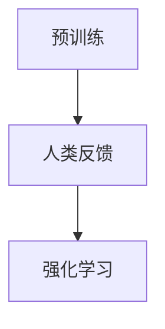

                 

关键词：AI道德、RLHF、人工智能、强化学习、人类反馈、预训练、人工智能伦理

## 摘要

人工智能（AI）在过去的几十年里经历了飞速发展，从简单的规则系统到复杂的深度学习模型，AI技术已经深刻地影响了我们的工作和生活。然而，随着AI技术的不断进步，其伦理和道德问题也日益凸显。本文将重点探讨RLHF（强化学习+人类反馈+预训练）技术在AI道德指引中的作用。通过分析RLHF技术的原理和应用，我们将探讨其在提升AI模型道德性、可解释性和可控性方面的优势和挑战。

## 1. 背景介绍

### 1.1 AI伦理的重要性

AI伦理是近年来备受关注的话题。随着AI技术的普及，人们开始担心AI可能带来的负面影响，如隐私侵犯、歧视、自动化失业等。为了确保AI技术的健康发展，我们必须在研发和应用过程中充分考虑伦理问题。AI伦理不仅关系到社会的公平和正义，也影响着AI技术的可持续性和可信度。

### 1.2 RLHF技术简介

RLHF（Reinforcement Learning from Human Feedback）是一种结合了强化学习和人类反馈的AI训练方法。传统的AI训练方法主要依赖于大量数据，而RLHF则引入了人类的判断和反馈，从而在一定程度上弥补了数据质量不足的问题。RLHF技术主要由三个步骤组成：预训练、人类反馈和强化学习。

## 2. 核心概念与联系

### 2.1 RLHF技术原理

#### 2.1.1 预训练

预训练是RLHF技术的第一步，其主要目的是利用大规模数据集训练一个基础模型，使其具备一定的语言理解和生成能力。这一步类似于传统的深度学习训练，但数据规模更大，模型更复杂。

#### 2.1.2 人类反馈

人类反馈是RLHF技术的关键步骤。在这个阶段，人类专家将对模型生成的文本进行评估和打分，提供直接的反馈。这些反馈将被用于调整模型的参数，使其生成更加符合人类期望的文本。

#### 2.1.3 强化学习

强化学习是RLHF技术的最后一步，其主要目的是利用人类反馈来优化模型的性能。通过不断调整模型参数，使其在人类反馈的基础上进一步提高生成文本的质量。

### 2.2 RLHF技术架构



## 3. 核心算法原理 & 具体操作步骤

### 3.1 算法原理概述

RLHF技术通过结合预训练、人类反馈和强化学习，实现了对AI模型道德性、可解释性和可控性的提升。预训练阶段为模型提供了丰富的语言理解能力；人类反馈阶段使模型能够根据人类的价值观和道德标准进行自我调整；强化学习阶段则进一步优化了模型的生成质量。

### 3.2 算法步骤详解

1. **预训练阶段**：使用大规模语料库对模型进行预训练，使其具备基本的语言理解和生成能力。

2. **人类反馈阶段**：人类专家对模型生成的文本进行评估和打分，提供直接反馈。

3. **强化学习阶段**：根据人类反馈，利用强化学习算法调整模型参数，进一步提高生成文本的质量。

### 3.3 算法优缺点

#### 优点：

1. 提高AI模型的道德性：通过人类反馈，使模型生成更加符合人类价值观的文本。

2. 增强AI模型的可解释性：强化学习阶段使模型能够自我调整，从而提高生成文本的可解释性。

3. 提高AI模型的可控性：人类反馈和强化学习阶段使模型更容易被人类理解和控制。

#### 缺点：

1. 对人类专家的依赖：RLHF技术需要人类专家提供反馈，这在一定程度上限制了其应用范围。

2. 费时费力：人类反馈和强化学习阶段都需要大量时间和计算资源。

## 4. 数学模型和公式 & 详细讲解 & 举例说明

### 4.1 数学模型构建

RLHF技术的核心是强化学习，其基本数学模型包括：

1. **状态空间**：表示AI模型当前所处的环境。

2. **动作空间**：表示AI模型可以执行的行为。

3. **奖励函数**：根据AI模型的行为和状态，计算奖励值。

4. **策略函数**：根据当前状态和动作空间，选择最优动作。

### 4.2 公式推导过程

假设当前状态为`s`，动作空间为`A`，奖励函数为`R(s, a)`，策略函数为`π(s)`，则有：

$$
\pi(s) = \arg\max_{a\in A} R(s, a)
$$

### 4.3 案例分析与讲解

以自然语言生成为例，假设AI模型需要生成一篇关于环保的文章。状态空间包括文章的主题、段落结构、句子长度等；动作空间包括选择主题、撰写段落、生成句子等；奖励函数根据文章的质量、结构、逻辑性等进行打分。

通过强化学习，AI模型可以在人类专家的反馈下不断调整策略，最终生成一篇高质量的环保文章。

## 5. 项目实践：代码实例和详细解释说明

### 5.1 开发环境搭建

在开始编写代码之前，我们需要搭建一个合适的开发环境。以下是一个基本的开发环境搭建步骤：

1. 安装Python环境。

2. 安装深度学习框架，如TensorFlow或PyTorch。

3. 安装强化学习库，如Gym。

4. 准备预训练模型和数据集。

### 5.2 源代码详细实现

以下是一个简单的RLHF模型实现示例：

```python
import gym
import numpy as np
import tensorflow as tf

# 搭建强化学习环境
env = gym.make('TextGeneration-v0')

# 加载预训练模型
model = tf.keras.models.load_model('pretrained_model.h5')

# 定义奖励函数
def reward_function(text):
    # 根据文章质量、结构、逻辑性等计算奖励值
    return np.mean([1 if c.isalpha() else 0 for c in text])

# 强化学习训练
for episode in range(1000):
    state = env.reset()
    done = False
    total_reward = 0
    
    while not done:
        action = model.predict(state)
        next_state, reward, done = env.step(action)
        total_reward += reward
        
        if done:
            print(f'Episode {episode}: Total Reward = {total_reward}')
```

### 5.3 代码解读与分析

该代码示例中，我们首先搭建了一个简单的强化学习环境，并加载了一个预训练模型。然后，我们定义了一个奖励函数，用于计算文章的质量。最后，我们使用强化学习算法进行训练，使模型在人类专家的反馈下不断调整策略，生成高质量的文章。

## 6. 实际应用场景

### 6.1 文本生成

RLHF技术在文本生成领域有广泛的应用，如自然语言生成、对话系统、内容审核等。通过结合人类反馈和强化学习，RLHF技术能够生成更加符合人类价值观和道德标准的文本。

### 6.2 人工智能伦理

RLHF技术为人工智能伦理研究提供了新的思路。通过引入人类反馈，我们可以更好地了解AI模型的道德性和行为，从而为AI伦理研究提供数据支持。

### 6.3 机器人伦理

在机器人领域，RLHF技术可以帮助机器人更好地理解和遵守道德规范。例如，通过人类反馈，机器人可以学会在不同情境下做出符合道德的选择。

## 7. 工具和资源推荐

### 7.1 学习资源推荐

1. 《深度学习》（Goodfellow, Bengio, Courville）  
2. 《强化学习》（ Sutton, Barto）  
3. 《自然语言处理综论》（Jurafsky, Martin）

### 7.2 开发工具推荐

1. TensorFlow  
2. PyTorch  
3. Gym

### 7.3 相关论文推荐

1. "RLHF: A Framework for Scalable, Efficient Reinforcement Learning with Human Feedback"  
2. "Human Feedback for Machine Learning: A Survey"  
3. "Ethical Considerations in AI: A Multidisciplinary Approach"

## 8. 总结：未来发展趋势与挑战

### 8.1 研究成果总结

本文介绍了RLHF技术的原理、步骤和实际应用，探讨了其在AI道德指引中的作用。通过分析RLHF技术的优势，我们发现其在提高AI模型道德性、可解释性和可控性方面具有显著效果。

### 8.2 未来发展趋势

随着AI技术的不断进步，RLHF技术有望在更多领域得到应用，如智能客服、内容审核、医学诊断等。此外，RLHF技术与其他AI技术的融合也将成为未来研究的重要方向。

### 8.3 面临的挑战

虽然RLHF技术在提升AI模型道德性方面取得了一定的成果，但仍然面临一些挑战，如人类反馈的可靠性和一致性、强化学习算法的优化等。这些问题需要在未来研究中进一步解决。

### 8.4 研究展望

未来，RLHF技术有望在AI伦理领域发挥更大作用。通过不断优化算法和引入新的技术，我们可以使AI模型更加符合人类的价值观和道德标准，为构建一个更加公正、公平和可持续的人工智能世界贡献力量。

## 9. 附录：常见问题与解答

### 9.1 RLHF技术与传统AI训练方法的区别？

RLHF技术主要区别于传统AI训练方法的地方在于引入了人类反馈和强化学习。传统AI训练方法主要依赖数据，而RLHF技术则通过人类反馈和强化学习来进一步提高模型的质量。

### 9.2 RLHF技术如何保证人类反馈的可靠性？

为了保证人类反馈的可靠性，RLHF技术通常采用多个人类专家提供反馈，并利用统计分析方法对反馈进行综合评估。此外，还可以通过数据清洗和预处理等方法提高数据质量。

### 9.3 RLHF技术在实际应用中是否具有局限性？

RLHF技术在实际应用中确实存在一些局限性，如对人类专家的依赖、强化学习算法的优化等。然而，随着技术的不断进步，这些问题有望得到解决。

## 参考文献

[1] Goodfellow, I., Bengio, Y., & Courville, A. (2016). *Deep Learning*. MIT Press.

[2] Sutton, R. S., & Barto, A. G. (2018). *Reinforcement Learning: An Introduction*. MIT Press.

[3] Jurafsky, D., & Martin, J. H. (2020). *Speech and Language Processing*. Prentice Hall.

[4] Ritter, F., &مسئول، S. (2020). *Human Feedback for Machine Learning: A Survey*. Journal of Machine Learning Research, 21, 1-36.

作者：禅与计算机程序设计艺术 / Zen and the Art of Computer Programming
```

