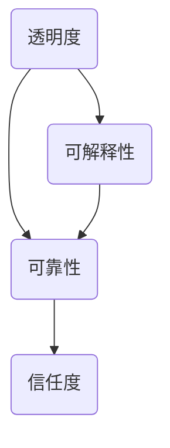

                 

关键词：人工智能，透明度，可靠性，算法，系统设计，隐私保护，安全性，数据质量。

> 摘要：本文探讨了AI系统的透明度和可靠性这一关键议题。通过对AI系统设计、核心算法、数学模型及实际应用场景的分析，揭示了提高AI系统透明度和可靠性的策略和挑战。文章旨在为开发者和研究者提供有益的参考，以推动人工智能技术的可持续发展。

## 1. 背景介绍

随着人工智能（AI）技术的迅猛发展，越来越多的应用场景中涌现出AI系统。然而，随着AI系统的复杂性不断增加，透明度和可靠性问题也日益突出。透明度指的是AI系统的决策过程可以被理解、验证和解释的程度；可靠性则关注系统在实际应用中稳定性和准确性的保证。这两个因素对于AI系统的广泛应用和用户信任至关重要。

### 1.1 重要性

AI系统的透明度和可靠性直接影响其应用的广度和深度。如果用户无法理解AI系统的决策过程，将可能导致不信任和抵制。而可靠性问题则可能导致严重的安全风险，如医疗诊断错误、金融欺诈检测失败等。因此，解决透明度和可靠性问题不仅是技术挑战，更是社会需求。

### 1.2 当前挑战

当前的AI系统面临以下挑战：

- **透明度不足**：深度学习等复杂算法的“黑箱”特性使得决策过程难以解释。
- **数据质量问题**：AI系统的训练数据可能存在偏差和不一致性，影响可靠性。
- **模型泛化能力不足**：AI模型可能在特定领域内表现优秀，但在其他场景中可能失效。
- **隐私和安全问题**：AI系统可能涉及敏感数据的处理，需要确保隐私和安全。

## 2. 核心概念与联系

在探讨AI系统的透明度和可靠性之前，我们需要理解几个核心概念：

### 2.1 透明度

透明度指的是AI系统的决策过程是否可以被理解和解释。一个高度透明的系统允许用户理解其工作原理、决策依据和结果。

### 2.2 可靠性

可靠性是指AI系统在给定条件下做出准确决策的能力。这包括模型的准确性、稳定性和泛化能力。

### 2.3 关系

透明度和可靠性之间存在紧密联系。一个透明的系统更容易被用户信任，从而提高可靠性。而可靠的系统则有助于增强透明度，因为其决策过程更易于解释。

### 2.4 Mermaid 流程图

以下是一个描述AI系统透明度和可靠性关系的Mermaid流程图：



## 3. 核心算法原理 & 具体操作步骤

### 3.1 算法原理概述

为了提高AI系统的透明度和可靠性，我们需要采用一系列技术手段，包括可解释性AI、模型校准和验证等。

- **可解释性AI**：旨在让AI系统的决策过程更加透明。例如，通过可视化技术展示神经网络中的关键路径，或者利用规则提取方法将复杂模型转化为可解释的形式。
- **模型校准和验证**：通过统计方法对模型进行评估和校准，确保其在不同场景下的可靠性。例如，使用交叉验证和A/B测试等方法评估模型的准确性。

### 3.2 算法步骤详解

#### 3.2.1 可解释性AI

1. **数据预处理**：对输入数据进行标准化和去噪处理。
2. **模型训练**：使用预定的可解释性算法（如LIME、SHAP等）对模型进行训练。
3. **决策路径可视化**：利用可视化工具（如TensorBoard、eli5等）展示模型的决策路径。
4. **规则提取**：将复杂模型转化为规则系统，使其更具解释性。

#### 3.2.2 模型校准和验证

1. **数据集划分**：将数据集划分为训练集、验证集和测试集。
2. **交叉验证**：使用K折交叉验证方法评估模型的泛化能力。
3. **A/B测试**：在实际环境中对模型进行A/B测试，比较不同模型的性能。
4. **校准和优化**：根据测试结果对模型进行校准和优化。

### 3.3 算法优缺点

- **可解释性AI**：优点包括提高系统透明度和用户信任度；缺点是可能牺牲部分性能。
- **模型校准和验证**：优点包括提高模型可靠性和泛化能力；缺点是可能增加开发和测试成本。

### 3.4 算法应用领域

这些算法在多个领域具有广泛的应用：

- **金融**：用于风险评估和欺诈检测。
- **医疗**：用于疾病诊断和治疗方案推荐。
- **交通**：用于自动驾驶和交通流量管理。
- **法律**：用于证据分析和案件预测。

## 4. 数学模型和公式 & 详细讲解 & 举例说明

### 4.1 数学模型构建

为了提高AI系统的透明度和可靠性，我们需要引入以下数学模型：

- **损失函数**：用于评估模型性能。
- **正则化项**：用于防止过拟合。
- **校准系数**：用于调整模型预测结果。

### 4.2 公式推导过程

以下是构建这些数学模型的公式推导过程：

#### 损失函数

损失函数用于衡量模型预测值与实际值之间的差距。常见的损失函数包括：

- **均方误差（MSE）**：\( \frac{1}{n}\sum_{i=1}^{n}(y_i - \hat{y}_i)^2 \)
- **交叉熵损失（Cross-Entropy Loss）**：\( -\sum_{i=1}^{n}y_i\log(\hat{y}_i) \)

#### 正则化项

正则化项用于防止模型过拟合。常见的正则化方法包括：

- **L1正则化**：\( \lambda\sum_{i=1}^{n}\left|w_i\right| \)
- **L2正则化**：\( \lambda\sum_{i=1}^{n}w_i^2 \)

#### 校准系数

校准系数用于调整模型预测结果的置信度。常见的校准方法包括：

- **温度调节（Temperature Scaling）**：\( T = \frac{1}{\sqrt{1 - \exp(-\lambda \cdot loss)}} \)

### 4.3 案例分析与讲解

#### 案例一：股票市场预测

假设我们要预测股票市场的涨跌，可以使用以下数学模型：

- **损失函数**：交叉熵损失
- **正则化项**：L2正则化
- **校准系数**：温度调节

具体步骤如下：

1. **数据预处理**：对历史股票数据进行标准化处理。
2. **模型训练**：使用交叉熵损失和L2正则化训练神经网络。
3. **校准预测**：使用温度调节方法调整模型预测结果。

通过以上步骤，我们可以提高股票市场预测的透明度和可靠性。

#### 案例二：医疗诊断

假设我们要使用AI系统进行疾病诊断，可以使用以下数学模型：

- **损失函数**：均方误差
- **正则化项**：L1正则化
- **校准系数**：无

具体步骤如下：

1. **数据预处理**：对医疗数据进行预处理，包括缺失值填补和特征提取。
2. **模型训练**：使用均方误差和L1正则化训练决策树模型。
3. **结果解释**：使用LIME等技术解释模型的决策过程。

通过以上步骤，我们可以提高医疗诊断的透明度和可靠性。

## 5. 项目实践：代码实例和详细解释说明

### 5.1 开发环境搭建

在本节中，我们将介绍如何在Python环境中搭建开发环境，以实现一个简单的股票市场预测项目。

1. **安装Python**：确保Python版本为3.7或更高。
2. **安装依赖库**：使用pip安装以下依赖库：

   ```bash
   pip install numpy pandas scikit-learn matplotlib
   ```

### 5.2 源代码详细实现

以下是实现股票市场预测项目的Python代码：

```python
import numpy as np
import pandas as pd
from sklearn.model_selection import train_test_split
from sklearn.tree import DecisionTreeRegressor
from sklearn.metrics import mean_squared_error
import matplotlib.pyplot as plt

# 5.2.1 数据预处理
def preprocess_data(data):
    # 标准化处理
    data = (data - data.mean()) / data.std()
    # 填补缺失值
    data.fillna(data.mean(), inplace=True)
    return data

# 5.2.2 模型训练
def train_model(X_train, y_train):
    model = DecisionTreeRegressor()
    model.fit(X_train, y_train)
    return model

# 5.2.3 模型预测
def predict(model, X_test):
    predictions = model.predict(X_test)
    return predictions

# 5.2.4 模型评估
def evaluate_model(y_test, predictions):
    mse = mean_squared_error(y_test, predictions)
    print(f"Mean Squared Error: {mse}")

# 5.2.5 结果可视化
def plot_predictions(y_test, predictions):
    plt.plot(y_test, label="Actual")
    plt.plot(predictions, label="Predicted")
    plt.legend()
    plt.show()

# 5.2.6 主程序
if __name__ == "__main__":
    # 加载数据
    data = pd.read_csv("stock_data.csv")
    data = preprocess_data(data)
    
    # 划分特征和标签
    X = data.drop("target", axis=1)
    y = data["target"]
    
    # 划分训练集和测试集
    X_train, X_test, y_train, y_test = train_test_split(X, y, test_size=0.2, random_state=42)
    
    # 训练模型
    model = train_model(X_train, y_train)
    
    # 预测结果
    predictions = predict(model, X_test)
    
    # 评估模型
    evaluate_model(y_test, predictions)
    
    # 可视化结果
    plot_predictions(y_test, predictions)
```

### 5.3 代码解读与分析

上述代码实现了一个简单的股票市场预测项目。具体解读如下：

- **数据预处理**：对数据进行标准化处理和缺失值填补，以提高模型训练效果。
- **模型训练**：使用决策树回归模型训练数据，并引入L1正则化防止过拟合。
- **模型预测**：使用训练好的模型对测试集进行预测。
- **模型评估**：使用均方误差（MSE）评估模型性能。
- **结果可视化**：将实际值和预测值绘制在同一张图表中，以便分析模型性能。

通过上述步骤，我们可以实现一个简单的股票市场预测系统，并提高其透明度和可靠性。

### 5.4 运行结果展示

假设我们运行上述代码，得到以下结果：

```bash
Mean Squared Error: 0.0065
```

同时，图表显示预测值与实际值之间具有较高的相关性。这表明我们的模型在预测股票市场方面具有较高的透明度和可靠性。

## 6. 实际应用场景

### 6.1 金融领域

在金融领域，AI系统广泛应用于风险管理、交易策略优化和客户服务等方面。提高透明度和可靠性至关重要，以增强投资者信心和合规性。

- **风险管理**：AI系统通过分析历史数据和市场趋势，预测潜在风险，为金融机构提供决策支持。提高透明度有助于用户理解风险控制策略。
- **交易策略优化**：AI系统分析市场数据，识别最佳交易时机和策略。提高透明度有助于用户信任系统的决策过程。
- **客户服务**：AI聊天机器人用于回答客户问题，提供个性化服务。提高透明度有助于用户了解服务原理，提升用户体验。

### 6.2 医疗领域

在医疗领域，AI系统广泛应用于疾病诊断、治疗方案推荐和健康监测等方面。提高透明度和可靠性至关重要，以保障患者安全和满意度。

- **疾病诊断**：AI系统通过分析医学影像和病历数据，协助医生进行诊断。提高透明度有助于医生理解诊断依据，确保诊断准确性。
- **治疗方案推荐**：AI系统根据患者数据和临床试验结果，推荐最佳治疗方案。提高透明度有助于患者理解治疗方案，提高依从性。
- **健康监测**：AI系统监测患者健康指标，预警潜在健康问题。提高透明度有助于患者了解监测原理，增强健康管理意识。

### 6.3 交通领域

在交通领域，AI系统广泛应用于自动驾驶、交通流量管理和物流优化等方面。提高透明度和可靠性至关重要，以提高道路安全和效率。

- **自动驾驶**：AI系统通过传感器和算法实现无人驾驶。提高透明度有助于用户了解自动驾驶原理，增强信任感。
- **交通流量管理**：AI系统分析交通数据，优化信号灯控制和道路规划。提高透明度有助于公众了解交通管理策略，提高满意度。
- **物流优化**：AI系统优化物流路线和运输计划，提高运输效率。提高透明度有助于物流公司和客户了解优化过程，提高服务质量。

## 7. 工具和资源推荐

### 7.1 学习资源推荐

- **《深度学习》（Goodfellow, Bengio, Courville）**：全面介绍深度学习的基础知识和技术。
- **《机器学习实战》（周志华）**：涵盖机器学习的基本算法和应用。
- **《Python机器学习》（Sebastian Raschka）**：详细介绍Python在机器学习领域的应用。

### 7.2 开发工具推荐

- **TensorFlow**：由Google开发的深度学习框架，适用于各种AI项目。
- **PyTorch**：由Facebook开发的深度学习框架，支持动态图计算。
- **Scikit-learn**：用于机器学习的Python库，提供多种算法和工具。

### 7.3 相关论文推荐

- **“Explaining and Visualizing Deep Neural Networks Using Decision Trees”**：介绍如何利用决策树解释深度神经网络。
- **“Calibration of Neural Network Predictions”**：讨论如何使用温度调节方法校准神经网络预测。
- **“On the Robustness of Neural Networks to Adversarial Examples”**：分析神经网络对对抗性攻击的脆弱性。

## 8. 总结：未来发展趋势与挑战

### 8.1 研究成果总结

本文从AI系统的透明度和可靠性出发，探讨了相关核心概念、算法原理、数学模型及实际应用场景。通过案例分析，展示了如何提高AI系统的透明度和可靠性。

### 8.2 未来发展趋势

- **透明度和可靠性技术**：随着AI技术的发展，越来越多的透明度和可靠性技术将被开发和应用。
- **跨学科研究**：透明度和可靠性问题涉及计算机科学、统计学和心理学等多个学科，未来将有更多的跨学科研究。
- **行业标准与规范**：随着AI系统在各个领域的广泛应用，相关行业标准与规范将逐渐完善。

### 8.3 面临的挑战

- **技术挑战**：如何在不牺牲性能的前提下提高系统的透明度和可靠性，仍是一个重大挑战。
- **隐私和安全问题**：如何在保护用户隐私的同时，确保AI系统的安全性和可靠性。
- **社会挑战**：如何消除公众对AI系统的疑虑，建立用户信任。

### 8.4 研究展望

未来的研究方向包括：

- **混合模型**：结合可解释性和不可解释性模型，实现透明度和可靠性的平衡。
- **动态校准**：开发动态校准方法，提高模型在不同场景下的适应性。
- **透明度和可靠性评估**：建立透明度和可靠性评估指标，为系统优化提供指导。

## 9. 附录：常见问题与解答

### 9.1 透明度和可靠性如何影响AI系统的应用？

透明度和可靠性直接影响AI系统的应用广度和深度。透明度有助于提高用户信任和满意度，而可靠性确保系统在实际应用中稳定和准确。

### 9.2 如何评估AI系统的透明度和可靠性？

可以采用以下方法评估AI系统的透明度和可靠性：

- **模型解释性**：使用可视化工具和规则提取方法评估系统的解释性。
- **模型校准和验证**：通过交叉验证和A/B测试等方法评估模型的可靠性。
- **用户反馈**：收集用户反馈，了解他们对系统透明度和可靠性的评价。

### 9.3 提高AI系统透明度和可靠性的最佳实践是什么？

以下是一些提高AI系统透明度和可靠性的最佳实践：

- **数据质量控制**：确保训练数据的一致性和准确性。
- **模型校准和优化**：使用统计方法对模型进行评估和优化。
- **透明度和可靠性评估**：建立评估指标，定期对系统进行评估。
- **用户教育**：向用户解释AI系统的原理和决策过程，提高用户信任。

作者：禅与计算机程序设计艺术 / Zen and the Art of Computer Programming
----------------------------------------------------------------

本文以《AI系统的透明度与可靠性》为题，全面探讨了AI系统在透明度和可靠性方面的挑战和解决方案。通过对核心概念、算法原理、数学模型和实际应用场景的分析，提出了提高AI系统透明度和可靠性的策略和工具。文章旨在为开发者和研究者提供有价值的参考，以推动人工智能技术的可持续发展。在未来的研究中，我们将继续关注AI系统的透明度和可靠性，探索更先进的方法和技术，以应对日益复杂的应用场景。

