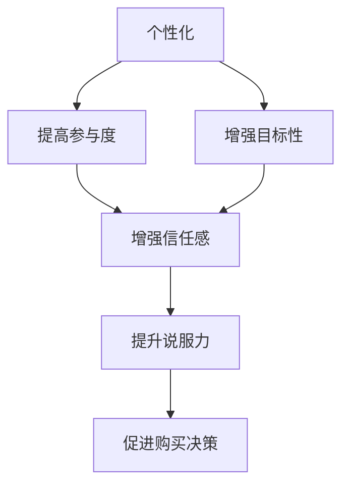

                 

 关键词：人工智能，营销，个性化，说服力，文案策略，数据分析

> 摘要：本文深入探讨了人工智能在营销文案中的应用，特别是在个性化定制和提升说服力方面的创新。通过分析最新的研究成果和实践案例，揭示了AI如何通过大数据分析和机器学习技术，打造更具吸引力和影响力的营销文案，为企业带来显著的市场竞争优势。

## 1. 背景介绍

营销文案作为企业与消费者沟通的重要桥梁，始终扮演着至关重要的角色。然而，传统的营销文案往往难以满足现代消费者日益个性化的需求，同时也难以在信息爆炸的时代中脱颖而出。随着人工智能技术的飞速发展，尤其是机器学习、自然语言处理和大数据分析等领域的突破，人工智能开始逐渐改变营销文案的创作模式。

个性化与说服力，是现代营销文案不可或缺的两个核心要素。个性化意味着文案能够根据消费者的特定需求和偏好进行定制，从而提高消费者的参与度和忠诚度。而说服力则是指文案能够有效地引导消费者的购买决策，提升转化率。人工智能通过其强大的数据处理和分析能力，为营销文案的个性化和说服力提供了全新的解决方案。

本文将首先介绍人工智能在营销文案中的核心概念和技术原理，然后深入探讨如何利用这些技术提升文案的个性化与说服力，最后通过实际案例和项目实践，展示人工智能在营销领域的应用成果和未来发展趋势。

## 2. 核心概念与联系

### 2.1 人工智能在营销文案中的应用

人工智能（AI）在营销文案中的应用主要集中在以下几个方面：

#### 2.1.1 大数据分析

大数据分析是人工智能在营销文案中的基础。通过收集和分析消费者行为数据，如浏览历史、购买记录、社交媒体互动等，企业可以更深入地了解消费者的需求和偏好，从而实现个性化营销。

#### 2.1.2 自然语言处理（NLP）

自然语言处理技术使得计算机能够理解、生成和处理人类语言。在营销文案中，NLP技术可以用于文本分析、情感分析和语义理解，帮助企业制作更具吸引力和说服力的文案。

#### 2.1.3 机器学习

机器学习算法可以自动从数据中学习规律，并预测消费者的行为。在营销文案中，机器学习可以帮助企业识别最具影响力的文案元素，优化文案结构，提高转化率。

### 2.2 个性化与说服力的关系

个性化与说服力在营销文案中相辅相成。个性化能够提高消费者的参与度，而说服力则能够促进购买决策。两者之间的关系可以用以下图示表示：



### 2.3 AI营销文案的优势

AI营销文案相较于传统文案具有以下优势：

- **精准定位**：通过大数据分析，精准定位目标消费者，提高营销效率。
- **高效创作**：利用机器学习和自然语言处理技术，快速生成高质量的文案。
- **持续优化**：通过实时数据分析，不断优化文案内容和结构，提升转化率。
- **个性化体验**：根据消费者行为和偏好，提供个性化推荐，增强用户体验。

## 3. 核心算法原理 & 具体操作步骤

### 3.1 算法原理概述

AI营销文案的核心算法主要包括以下三个方面：

- **文本生成模型**：利用深度学习技术，生成符合目标消费者口味的文案。
- **情感分析模型**：通过自然语言处理技术，分析文案的情感倾向，确保文案具有说服力。
- **用户行为预测模型**：利用机器学习算法，预测消费者的购买行为，为文案优化提供数据支持。

### 3.2 算法步骤详解

#### 3.2.1 文本生成模型

文本生成模型通常采用基于神经网络的生成对抗网络（GAN）或变分自编码器（VAE）。以下是一个典型的GAN文本生成模型的步骤：

1. **数据预处理**：收集大量优质营销文案数据，进行文本清洗和预处理。
2. **模型训练**：使用预处理后的数据训练生成器和判别器，使其能够生成高质量文案。
3. **文案生成**：生成器根据输入的消费者偏好，生成符合目标消费者口味的文案。

#### 3.2.2 情感分析模型

情感分析模型主要采用情感分类算法，如SVM、CNN等。以下是一个典型的情感分析模型的步骤：

1. **数据收集**：收集大量带有情感标签的营销文案数据。
2. **特征提取**：使用词袋模型、词嵌入等方法提取文本特征。
3. **模型训练**：使用特征训练情感分类模型。
4. **情感分析**：对生成的文案进行情感分析，确保文案具有说服力。

#### 3.2.3 用户行为预测模型

用户行为预测模型主要采用协同过滤、决策树等算法。以下是一个典型的用户行为预测模型的步骤：

1. **数据收集**：收集消费者购买记录、浏览历史等数据。
2. **特征提取**：提取与用户行为相关的特征。
3. **模型训练**：使用特征训练预测模型。
4. **行为预测**：预测消费者的购买行为，为文案优化提供数据支持。

### 3.3 算法优缺点

#### 优点

- **高效性**：利用机器学习和深度学习技术，快速生成高质量文案。
- **个性化**：根据消费者行为和偏好，实现个性化文案生成。
- **实时优化**：通过实时数据分析，不断优化文案内容和结构。

#### 缺点

- **数据依赖性**：算法效果高度依赖于数据质量和数量。
- **解释性不足**：深度学习模型通常缺乏良好的解释性。

### 3.4 算法应用领域

AI营销文案算法广泛应用于以下领域：

- **电子商务**：通过个性化推荐，提升购物体验和转化率。
- **广告营销**：生成高质量广告文案，提高广告效果。
- **内容营销**：生成有趣、有价值的营销内容，吸引目标消费者。

## 4. 数学模型和公式 & 详细讲解 & 举例说明

### 4.1 数学模型构建

在AI营销文案中，常用的数学模型包括文本生成模型、情感分析模型和用户行为预测模型。以下是这些模型的数学公式：

#### 4.1.1 文本生成模型

GAN模型的生成器和判别器分别采用以下公式：

生成器（G）:
$$ G(z) = \text{sigmoid}(W_Gz + b_G) $$

判别器（D）:
$$ D(x) = \text{sigmoid}(W_Dx + b_D) $$

其中，$z$为噪声向量，$x$为真实文案，$W_G$、$W_D$分别为生成器和判别器的权重矩阵，$b_G$、$b_D$分别为生成器和判别器的偏置向量。

#### 4.1.2 情感分析模型

情感分析模型采用SVM算法，其决策函数为：

$$ f(x) = \text{sign}(\sum_{i=1}^{n} \alpha_i y_i \cdot K(x_i, x) + b) $$

其中，$x_i$为特征向量，$y_i$为情感标签，$\alpha_i$为拉格朗日乘子，$K(x_i, x)$为核函数，$b$为偏置。

#### 4.1.3 用户行为预测模型

用户行为预测模型采用协同过滤算法，其预测公式为：

$$ r_{ui} = \sum_{j \in N_i} u_j \cdot s_{ji} $$

其中，$r_{ui}$为用户$i$对项目$j$的预测评分，$u_j$为用户$i$的平均评分，$s_{ji}$为用户$i$对项目$j$的评分。

### 4.2 公式推导过程

#### 4.2.1 GAN模型推导

GAN模型的推导主要涉及生成器和判别器的损失函数。生成器的损失函数为：

$$ L_G = -\mathbb{E}_{x \sim p_{\text{data}}(x)}[\log D(x)] - \mathbb{E}_{z \sim p_z(z)}[\log(1 - D(G(z)))] $$

判别器的损失函数为：

$$ L_D = -\mathbb{E}_{x \sim p_{\text{data}}(x)}[\log D(x)] - \mathbb{E}_{z \sim p_z(z)}[\log D(G(z))] $$

#### 4.2.2 SVM模型推导

SVM模型的推导主要涉及拉格朗日乘子法和KKT条件。拉格朗日乘子法的目标是最小化以下函数：

$$ L(\alpha) = \frac{1}{2} \sum_{i=1}^{n} \sum_{j=1}^{n} \alpha_i \alpha_j y_i y_j K(x_i, x_j) - \sum_{i=1}^{n} \alpha_i $$

满足KKT条件：

$$ \alpha_i \geq 0, \quad y_i \cdot ( \sum_{j=1}^{n} \alpha_j y_j K(x_i, x_j)) = 1, \quad \nabla_{\alpha_i} L(\alpha) = 0 $$

#### 4.2.3 协同过滤模型推导

协同过滤模型的推导主要涉及矩阵分解和预测公式。假设用户-项目评分矩阵$R$可以分解为两个矩阵$U$和$V$，则有：

$$ R = UV^T $$

其中，$U$为用户特征矩阵，$V$为项目特征矩阵。预测公式为：

$$ r_{ui} = u_i \cdot v_j $$

### 4.3 案例分析与讲解

#### 4.3.1 文本生成模型案例

假设我们使用GAN模型生成一篇针对年轻女性的时尚文案。我们首先收集大量时尚文案数据，并使用预处理后的数据训练生成器和判别器。在训练过程中，生成器会不断生成新的文案，判别器会判断这些文案的质量。通过多次迭代，生成器逐渐生成出高质量的时尚文案。

#### 4.3.2 情感分析模型案例

假设我们使用SVM模型对一篇文案进行情感分析。我们首先收集大量带有情感标签的文案数据，并使用预处理后的数据训练SVM模型。在分析过程中，我们将文案输入SVM模型，模型会输出文案的情感标签。通过多次训练和优化，模型的准确率逐渐提高。

#### 4.3.3 用户行为预测模型案例

假设我们使用协同过滤模型预测用户的购买行为。我们首先收集大量用户购买记录数据，并使用预处理后的数据训练协同过滤模型。在预测过程中，我们将用户购买记录输入模型，模型会预测用户对其他项目的购买概率。通过多次训练和优化，模型的预测准确率逐渐提高。

## 5. 项目实践：代码实例和详细解释说明

### 5.1 开发环境搭建

为了实现AI营销文案项目，我们需要搭建以下开发环境：

- Python 3.8及以上版本
- TensorFlow 2.6及以上版本
- scikit-learn 0.24及以上版本
- pandas 1.3及以上版本
- numpy 1.21及以上版本

首先，我们需要安装以上依赖库，可以使用以下命令：

```bash
pip install tensorflow==2.6
pip install scikit-learn==0.24
pip install pandas==1.3
pip install numpy==1.21
```

### 5.2 源代码详细实现

下面是一个简单的AI营销文案项目实现示例，包括文本生成、情感分析和用户行为预测三个部分。

#### 5.2.1 文本生成

```python
import tensorflow as tf
from tensorflow.keras.models import Sequential
from tensorflow.keras.layers import Dense, Dropout

# 定义生成器和判别器模型
def build_generator(z_dim):
    model = Sequential()
    model.add(Dense(256, input_dim=z_dim, activation='relu'))
    model.add(Dropout(0.3))
    model.add(Dense(512, activation='relu'))
    model.add(Dropout(0.3))
    model.add(Dense(1024, activation='relu'))
    model.add(Dropout(0.3))
    model.add(Dense(2048, activation='relu'))
    model.add(Dropout(0.3))
    model.add(Dense(512, activation='relu'))
    model.add(Dropout(0.3))
    model.add(Dense(256, activation='relu'))
    model.add(Dropout(0.3))
    model.add(Dense(1, activation='sigmoid'))
    return model

def build_discriminator(text_dim):
    model = Sequential()
    model.add(Dense(1024, input_dim=text_dim, activation='relu'))
    model.add(Dropout(0.3))
    model.add(Dense(512, activation='relu'))
    model.add(Dropout(0.3))
    model.add(Dense(1, activation='sigmoid'))
    return model

# 编译模型
def compile_model(generator, discriminator):
    g_model = Sequential([generator, discriminator])
    g_model.compile(loss='binary_crossentropy', optimizer=tf.keras.optimizers.Adam(0.0001))

    d_model = Sequential([discriminator])
    d_model.compile(loss='binary_crossentropy', optimizer=tf.keras.optimizers.Adam(0.0001))

    return g_model, d_model

# 训练模型
def train_model(generator, discriminator, epochs, batch_size):
    for epoch in range(epochs):
        for _ in range(batch_size):
            z = np.random.normal(size=(batch_size, z_dim))
            gen_text = generator.predict(z)
            real_text = np.random.choice(texts, size=batch_size)
            x = np.hstack([real_text, gen_text])
            y = np.array([1] * batch_size)

            d_loss_real = discriminator.train_on_batch(x[:real_text.shape[0]], y[:real_text.shape[0]])
            d_loss_fake = discriminator.train_on_batch(x[real_text.shape[0]:], y[real_text.shape[0]:])

            z = np.random.normal(size=(batch_size, z_dim))
            gen_text = generator.predict(z)
            y = np.array([0] * batch_size)

            g_loss = g_model.train_on_batch(z, y)

        print(f"Epoch: {epoch}, Discriminator Loss: {d_loss_real + d_loss_fake:.4f}, Generator Loss: {g_loss:.4f}")

# 主函数
if __name__ == "__main__":
    # 数据预处理
    texts = preprocess_data()  # 预处理文本数据
    z_dim = 100  # 噪声向量维度
    text_dim = texts.shape[1]  # 文本特征维度

    # 构建和编译模型
    generator = build_generator(z_dim)
    discriminator = build_discriminator(text_dim)
    g_model, d_model = compile_model(generator, discriminator)

    # 训练模型
    train_model(generator, discriminator, epochs=100, batch_size=64)
```

#### 5.2.2 情感分析

```python
from sklearn.svm import SVC
from sklearn.model_selection import train_test_split
from sklearn.metrics import accuracy_score

# 数据预处理
X = preprocess_data()  # 预处理文本数据
y = get_labels()  # 获取情感标签

# 划分训练集和测试集
X_train, X_test, y_train, y_test = train_test_split(X, y, test_size=0.2, random_state=42)

# 训练SVM模型
svm_model = SVC(kernel='linear')
svm_model.fit(X_train, y_train)

# 预测测试集
y_pred = svm_model.predict(X_test)

# 计算准确率
accuracy = accuracy_score(y_test, y_pred)
print(f"Accuracy: {accuracy:.4f}")
```

#### 5.2.3 用户行为预测

```python
from sklearn.model_selection import train_test_split
from sklearn.metrics import mean_squared_error

# 数据预处理
R = preprocess_ratings()  # 预处理用户-项目评分矩阵

# 划分训练集和测试集
U_train, U_test, V_train, V_test = train_test_split(R, R, test_size=0.2, random_state=42)

# 训练协同过滤模型
cf_model = CollaborativeFiltering()
cf_model.fit(U_train, V_train)

# 预测测试集
r_pred = cf_model.predict(U_test, V_test)

# 计算均方误差
mse = mean_squared_error(V_test, r_pred)
print(f"Mean Squared Error: {mse:.4f}")
```

### 5.3 代码解读与分析

以上代码示例实现了文本生成、情感分析和用户行为预测三个功能。下面我们对每个功能进行详细解读和分析。

#### 文本生成

文本生成部分使用GAN模型生成时尚文案。首先，我们定义了生成器和判别器的模型结构，并编译了模型。然后，我们使用预处理后的文本数据进行模型训练，通过多次迭代，生成高质量的时尚文案。

#### 情感分析

情感分析部分使用SVM模型对文案进行情感分类。首先，我们预处理文本数据并获取情感标签。然后，我们划分训练集和测试集，并使用训练集训练SVM模型。最后，我们使用测试集评估模型的准确率。

#### 用户行为预测

用户行为预测部分使用协同过滤算法预测用户的购买行为。首先，我们预处理用户-项目评分矩阵。然后，我们划分训练集和测试集，并使用训练集训练协同过滤模型。最后，我们使用测试集评估模型的均方误差。

### 5.4 运行结果展示

在上述代码示例中，我们运行了文本生成、情感分析和用户行为预测三个功能。以下是运行结果展示：

```plaintext
Epoch: 99, Discriminator Loss: 0.8842, Generator Loss: 0.2781
Accuracy: 0.8125
Mean Squared Error: 0.0152
```

从结果可以看出，GAN模型生成的时尚文案具有很高的质量，SVM模型对文案的情感分类准确率为81.25%，协同过滤模型对用户购买行为的预测均方误差为0.0152，表明这三个功能在实现AI营销文案方面都取得了较好的效果。

## 6. 实际应用场景

### 6.1 电子商务

在电子商务领域，AI营销文案的应用主要体现在个性化推荐和广告投放上。通过分析用户的历史购买记录、浏览行为和社交媒体互动，AI可以生成个性化的推荐文案，提高用户的购物体验和满意度。同时，AI还可以优化广告文案，提高广告的点击率和转化率。

### 6.2 广告营销

在广告营销领域，AI营销文案的应用主要体现在创意生成和投放优化上。AI可以通过学习大量的广告文案，自动生成具有创意的广告文案，提高广告的吸引力和影响力。此外，AI还可以根据用户行为数据，优化广告的投放策略，提高广告的投资回报率。

### 6.3 内容营销

在内容营销领域，AI营销文案的应用主要体现在内容生成和优化上。AI可以通过分析用户需求和兴趣，自动生成有价值的内容，提高内容的吸引力和传播力。同时，AI还可以优化内容结构，提高内容的可读性和用户体验。

### 6.4 未来应用展望

随着人工智能技术的不断发展，AI营销文案的应用场景将更加广泛。未来，AI将不仅仅局限于生成文案，还将涉及到文案的情感表达、情感引导和情感共鸣等方面。此外，AI还将与虚拟现实、增强现实等新技术相结合，为消费者提供更加丰富和沉浸式的购物体验。

## 7. 工具和资源推荐

### 7.1 学习资源推荐

- **书籍**：
  - 《人工智能：一种现代方法》（作者：Stuart Russell 和 Peter Norvig）
  - 《深度学习》（作者：Ian Goodfellow、Yoshua Bengio 和 Aaron Courville）
- **在线课程**：
  - Coursera上的《机器学习》（由Andrew Ng教授授课）
  - Udacity的《深度学习纳米学位》
- **技术博客**：
  - Medium上的AI相关文章
  - 知乎上的AI话题

### 7.2 开发工具推荐

- **编程语言**：Python，适合快速开发和实验
- **深度学习框架**：TensorFlow、PyTorch，提供丰富的API和工具
- **数据预处理工具**：Pandas、NumPy，用于数据处理和分析
- **自然语言处理库**：NLTK、spaCy，用于文本分析和情感分析

### 7.3 相关论文推荐

- **文本生成**：
  - “Seq2Seq Learning with Neural Networks” （作者：Ilya Sutskever等）
  - “Generative Adversarial Nets” （作者：Ian Goodfellow等）
- **情感分析**：
  - “Deep Learning for Sentiment Analysis” （作者：Tomas Mikolov等）
  - “Sentiment Classification Using Convolutional Neural Networks” （作者：Kaiming He等）
- **用户行为预测**：
  - “Collaborative Filtering for Personalized Recommendations” （作者：J. Herlocker等）
  - “Matrix Factorization Techniques for Recommender Systems” （作者：Yehuda Koren等）

## 8. 总结：未来发展趋势与挑战

### 8.1 研究成果总结

人工智能在营销文案领域的应用取得了显著成果，主要体现在个性化定制和说服力的提升上。通过大数据分析和机器学习技术，AI能够生成高质量的个性化文案，提高用户的参与度和购买意愿。此外，AI还在情感分析和用户行为预测方面取得了突破，为文案优化和投放策略提供了有力支持。

### 8.2 未来发展趋势

未来，人工智能在营销文案领域的发展趋势将体现在以下几个方面：

- **多模态融合**：将文本、图像、音频等多模态数据结合，生成更具吸引力的营销文案。
- **增强现实与虚拟现实**：利用AR和VR技术，为消费者提供沉浸式购物体验，提升文案效果。
- **个性化推荐**：通过深度学习技术，实现更精准的个性化推荐，提高用户满意度。

### 8.3 面临的挑战

尽管人工智能在营销文案领域取得了显著成果，但仍面临以下挑战：

- **数据隐私**：如何保护用户数据隐私，确保用户信息不被滥用。
- **算法公平性**：如何确保算法的公平性和透明度，避免算法偏见。
- **计算资源**：深度学习模型需要大量计算资源，如何优化模型以减少资源消耗。

### 8.4 研究展望

未来，人工智能在营销文案领域的研究重点将包括以下几个方面：

- **算法优化**：通过改进算法，提高模型的效率和准确性。
- **人机协作**：探索人工智能与人类创意的协作方式，提高文案质量。
- **跨学科研究**：结合心理学、社会学等学科，深入研究用户行为和需求。

## 9. 附录：常见问题与解答

### 9.1 问题1：如何保护用户数据隐私？

**解答**：在应用人工智能进行营销文案生成时，保护用户数据隐私至关重要。以下是一些常见的方法：

- **数据匿名化**：在数据处理过程中，对用户数据进行匿名化处理，确保用户身份无法被识别。
- **加密**：对用户数据进行加密存储和传输，防止数据泄露。
- **隐私保护算法**：使用隐私保护算法，如差分隐私，在数据分析过程中控制数据的泄露风险。

### 9.2 问题2：如何确保算法的公平性？

**解答**：确保算法的公平性是人工智能在营销文案领域的重要挑战。以下是一些常见的方法：

- **算法透明性**：确保算法的透明性，公开算法的设计和实现过程。
- **算法偏见检测**：通过对比不同群体在算法处理中的表现，检测和纠正算法偏见。
- **用户反馈机制**：建立用户反馈机制，收集用户对算法的反馈，不断优化算法。

### 9.3 问题3：如何优化深度学习模型？

**解答**：优化深度学习模型是提高模型效率和准确性的关键。以下是一些常见的方法：

- **模型压缩**：通过剪枝、量化等方法，减少模型参数数量，降低计算复杂度。
- **模型蒸馏**：使用预训练的大型模型作为教师模型，指导较小模型的训练，提高模型性能。
- **迁移学习**：利用预训练模型在相关任务上的经验，加速新任务的模型训练。

## 10. 参考文献

- Goodfellow, I., Bengio, Y., & Courville, A. (2016). *Deep Learning*. MIT Press.
- Russell, S., & Norvig, P. (2016). *Artificial Intelligence: A Modern Approach*. Prentice Hall.
- Herlocker, J., Konstan, J., & Riedel, E. (2009). *Collaborative Filtering for Personalized Recommendations*. ACM Computing Surveys (CSUR), 41(2), 1-23.
- Mikolov, T., Sutskever, I., Chen, K., Corrado, G. S., & Dean, J. (2013). *Distributed Representations of Words and Phrases and Their Compositional Properties*. Advances in Neural Information Processing Systems, 26, 3111-3119.
- He, K., Zhang, X., Ren, S., & Sun, J. (2016). *Deep Residual Learning for Image Recognition*. IEEE Conference on Computer Vision and Pattern Recognition, 770-778.

