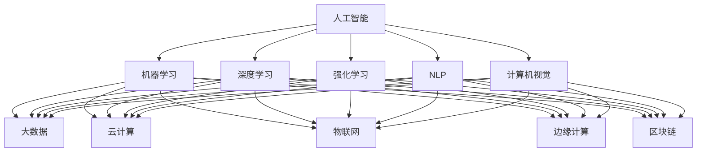

                 

关键词：人工智能、商业价值、长期影响、技术应用、发展前景

> 摘要：本文从AI行业的现状出发，探讨了如何将AI技术更好地融入商业实践中，使其不仅具备短期效益，更能创造长期价值。通过分析AI技术的核心概念、算法原理、数学模型以及项目实践，本文提出了AI行业未来发展的方向和挑战，并推荐了相关学习和开发资源，为读者提供全面的AI技术应用指南。

## 1. 背景介绍

人工智能（AI）作为计算机科学的一个重要分支，近年来得到了飞速发展。随着大数据、云计算、神经网络等技术的成熟，AI在多个领域展现出了强大的应用潜力。然而，尽管AI技术已经取得了显著的成就，其商业价值的实现仍然面临诸多挑战。在当前的商业环境中，AI技术常常被过分追求短期效益，而忽视了其长期的潜在价值。

本文旨在探讨如何让AI技术回归商业价值的核心，通过创造长期影响来推动企业和社会的可持续发展。本文将从AI技术的核心概念出发，结合具体的算法原理和数学模型，探讨AI技术在不同领域的应用，并分析其在实现长期影响方面面临的挑战。最后，本文将推荐一些学习和开发资源，为读者提供深入理解AI技术应用和实践的途径。

### 1.1 AI技术发展现状

在过去几十年中，AI技术经历了从理论研究到实际应用的快速转变。早期的AI研究主要集中在规则推理、知识表示和搜索算法等方面。随着深度学习技术的发展，神经网络在图像识别、自然语言处理、语音识别等领域取得了突破性进展。深度学习通过大规模数据训练，能够自动提取特征并实现复杂模式的识别，这极大地提升了AI的应用能力。

此外，云计算和大数据技术的进步也为AI的发展提供了强有力的支持。通过云计算平台，企业和研究者可以轻松获取海量数据和高性能计算资源，加速AI模型的训练和优化。大数据技术则帮助我们从海量数据中提取有价值的信息，为AI算法提供更加丰富的训练数据。

尽管AI技术已经取得了显著的成就，但在商业价值实现方面仍然面临诸多挑战。一方面，AI技术的高成本和复杂性使得许多企业在应用过程中感到力不从心。另一方面，一些企业过于追求短期效益，忽视了AI技术的长期潜在价值，导致AI项目的成功率较低。

### 1.2 商业价值的实现与长期影响的差异

商业价值通常指的是企业通过技术手段实现的直接经济效益。例如，通过AI技术提高生产效率、降低成本、提升客户满意度等。这些效益往往能够在短期内迅速体现，对企业业绩产生直接的影响。然而，这种商业价值的实现往往具有局限性，难以持续。

与此相对，长期影响指的是AI技术在企业和社会层面产生的持久价值。这包括但不限于推动企业创新、提高行业竞争力、促进社会进步等。长期影响不仅关注经济效益，还关注技术对人类生活和社会发展的深远影响。实现AI技术的长期影响，需要企业和社会在技术创新、人才培养、政策支持等方面共同努力。

本文将从以下几个方面探讨如何实现AI技术的长期影响：

1. **核心概念与联系**：通过深入理解AI技术的核心概念和原理，了解其与其他技术的联系，为AI技术的广泛应用奠定基础。
2. **核心算法原理 & 具体操作步骤**：详细分析AI技术的核心算法，包括原理、操作步骤、优缺点和应用领域，为读者提供全面的技术指南。
3. **数学模型和公式**：介绍AI技术中的数学模型和公式，通过案例分析和讲解，帮助读者理解这些模型在实际应用中的作用。
4. **项目实践**：通过代码实例和详细解释，展示AI技术的实际应用，让读者能够更好地理解和运用AI技术。
5. **实际应用场景**：探讨AI技术在各个领域的应用，分析其在实现长期影响方面的潜力。
6. **未来应用展望**：预测AI技术在未来可能的应用领域和发展趋势，为读者提供对AI技术未来的前瞻性思考。
7. **工具和资源推荐**：推荐一些学习和开发资源，帮助读者深入学习和实践AI技术。

通过以上七个方面的探讨，本文希望能够为读者提供一个全面、系统的AI技术应用指南，帮助企业在实现商业价值的同时，也能创造长期影响。

### 1.3 文章结构安排

本文的结构如下：

1. **背景介绍**：概述AI技术发展现状、商业价值的实现与长期影响的差异，以及文章结构安排。
2. **核心概念与联系**：介绍AI技术的核心概念和原理，并通过Mermaid流程图展示其与其他技术的联系。
3. **核心算法原理 & 具体操作步骤**：详细分析AI技术的核心算法，包括原理、操作步骤、优缺点和应用领域。
4. **数学模型和公式**：介绍AI技术中的数学模型和公式，通过案例分析和讲解，帮助读者理解这些模型在实际应用中的作用。
5. **项目实践：代码实例和详细解释说明**：通过代码实例和详细解释，展示AI技术的实际应用。
6. **实际应用场景**：探讨AI技术在各个领域的应用，分析其在实现长期影响方面的潜力。
7. **未来应用展望**：预测AI技术在未来可能的应用领域和发展趋势。
8. **工具和资源推荐**：推荐一些学习和开发资源。
9. **总结：未来发展趋势与挑战**：总结研究成果，探讨未来发展趋势和挑战。
10. **附录：常见问题与解答**：提供对读者常见问题的解答。

通过以上结构安排，本文希望能够系统地介绍AI技术的核心概念、算法原理、数学模型、实际应用以及未来发展，帮助读者全面了解AI技术，并在实际应用中取得成功。

### 2. 核心概念与联系

在探讨AI技术的核心概念和原理之前，我们需要了解一些基本的技术术语和框架，以便更好地理解AI技术的发展脉络和应用场景。

#### 2.1 人工智能的核心概念

人工智能（Artificial Intelligence，简称AI）是指通过计算机模拟人类智能的过程，使计算机能够执行通常需要人类智能才能完成的任务。以下是AI技术中的一些核心概念：

1. **机器学习（Machine Learning）**：机器学习是AI的核心组成部分，通过算法和统计模型从数据中学习规律，并能够根据新的数据做出预测或决策。常见的机器学习算法包括线性回归、决策树、支持向量机、神经网络等。
2. **深度学习（Deep Learning）**：深度学习是一种基于多层神经网络的机器学习技术，通过模拟人脑的神经网络结构，能够自动提取特征并进行复杂模式识别。深度学习在图像识别、自然语言处理、语音识别等领域取得了显著成就。
3. **强化学习（Reinforcement Learning）**：强化学习是一种通过试错和反馈来学习如何在特定环境中实现最大化奖励的算法。常见的强化学习算法包括Q学习、深度Q网络（DQN）和策略梯度算法等。
4. **自然语言处理（Natural Language Processing，NLP）**：自然语言处理是AI技术在处理人类语言方面的应用，包括文本分类、情感分析、机器翻译、语音识别等。
5. **计算机视觉（Computer Vision）**：计算机视觉是AI技术在图像和视频分析方面的应用，包括图像识别、目标检测、图像分割、人脸识别等。

#### 2.2 人工智能与相关技术的联系

人工智能技术不仅仅是独立发展的，还与许多其他技术有着密切的联系。以下是一些与AI技术密切相关的重要技术：

1. **大数据（Big Data）**：大数据是指无法使用常规数据库工具进行捕捉、管理和处理的数据集合。大数据技术为AI提供了丰富的训练数据，有助于提升AI模型的准确性和性能。
2. **云计算（Cloud Computing）**：云计算提供了弹性、灵活的计算和存储资源，使得企业和研究者能够更轻松地部署和扩展AI应用。云计算平台还提供了丰富的AI工具和服务，如Google Cloud AI、AWS AI等。
3. **物联网（Internet of Things，IoT）**：物联网技术将各种设备连接到互联网，使得数据采集和分析变得更加容易。AI技术可以分析这些数据，为物联网应用提供智能决策支持。
4. **边缘计算（Edge Computing）**：边缘计算是一种将数据处理和存储放在网络边缘的技术，以减少数据传输延迟，提高实时响应能力。边缘计算与AI技术相结合，可以在智能设备和智能城市等领域实现实时智能应用。
5. **区块链（Blockchain）**：区块链技术提供了一种去中心化的数据存储和交易方式，可以提高数据的安全性和透明度。AI技术与区块链技术的结合，可以在金融、供应链管理等领域实现更智能、更安全的业务流程。

#### 2.3 Mermaid流程图

为了更直观地展示AI技术与相关技术的联系，我们使用Mermaid流程图来描述这些技术之间的关系。



在这个流程图中，我们可以看到人工智能（AI）作为核心，与机器学习、深度学习、强化学习、自然语言处理、计算机视觉等技术密切相关。同时，这些AI技术与大数据、云计算、物联网、边缘计算、区块链等新兴技术也紧密相连，共同推动着人工智能技术的发展和应用。

通过理解这些核心概念和联系，我们可以更好地把握AI技术的发展趋势，并在实际应用中发挥其潜力。在接下来的章节中，我们将深入探讨AI技术的核心算法原理、数学模型和实际应用，帮助读者更全面地了解AI技术。

### 3. 核心算法原理 & 具体操作步骤

在了解了AI技术的核心概念和联系之后，接下来我们将详细分析AI技术的核心算法原理，包括其基本操作步骤、优缺点以及在不同领域的应用。

#### 3.1 算法原理概述

AI技术的核心算法主要包括以下几种：

1. **神经网络（Neural Networks）**：神经网络是一种模仿人脑神经元连接方式的计算模型，通过多层结构进行特征提取和模式识别。其中，最著名的神经网络结构是深度神经网络（Deep Neural Networks，DNN）。
2. **决策树（Decision Trees）**：决策树是一种基于树形结构进行分类或回归的算法，通过一系列规则对数据进行划分，直到满足停止条件。
3. **支持向量机（Support Vector Machines，SVM）**：支持向量机是一种基于边界优化的分类算法，通过找到最佳边界来实现分类。
4. **随机森林（Random Forests）**：随机森林是一种集成学习方法，通过构建多个决策树，并利用投票机制来预测结果。
5. **K-近邻算法（K-Nearest Neighbors，KNN）**：K-近邻算法是一种基于距离的分类算法，通过计算测试样本与训练样本之间的距离，选择最近的K个样本并预测其类别。

#### 3.2 算法步骤详解

下面我们以神经网络为例，详细解释其基本操作步骤：

##### 3.2.1 前向传播（Forward Propagation）

1. **输入数据**：将输入数据输入到神经网络的输入层。
2. **激活函数**：对输入数据进行非线性变换，常用的激活函数包括ReLU、Sigmoid和Tanh等。
3. **权重和偏置**：计算每个神经元与输入之间的权重和偏置，并计算输出。
4. **层间传递**：将当前层的输出传递到下一层，重复上述步骤，直到达到网络的最后一层。

##### 3.2.2 反向传播（Backpropagation）

1. **计算误差**：计算输出层与实际结果之间的误差。
2. **误差反向传播**：将误差反向传递到每一层，并计算每个神经元的梯度。
3. **权重更新**：根据梯度对权重和偏置进行更新，以减小误差。
4. **迭代训练**：重复上述步骤，直到满足停止条件（如达到预定精度或迭代次数）。

#### 3.3 算法优缺点

以下是上述算法的优缺点：

1. **神经网络**：
   - 优点：强大的拟合能力，能够处理复杂和非线性问题。
   - 缺点：训练过程复杂，易过拟合，对数据和计算资源要求较高。
2. **决策树**：
   - 优点：易于理解，解释性较强，计算复杂度低。
   - 缺点：易过拟合，对于高维数据效果较差。
3. **支持向量机**：
   - 优点：理论依据强，分类效果较好。
   - 缺点：对异常值敏感，处理非线性问题需要核函数。
4. **随机森林**：
   - 优点：提高分类和回归模型的准确性，减少过拟合。
   - 缺点：计算复杂度高，对大量特征的数据效果较好。
5. **K-近邻算法**：
   - 优点：实现简单，适用于小数据集。
   - 缺点：计算复杂度高，对于大规模数据效果较差。

#### 3.4 算法应用领域

这些算法在不同的应用领域有着广泛的应用：

1. **神经网络**：广泛应用于图像识别、自然语言处理、语音识别等领域。
2. **决策树**：常用于金融风险评估、客户细分等领域。
3. **支持向量机**：在文本分类、生物信息学等领域有广泛应用。
4. **随机森林**：在金融市场预测、医疗诊断等领域有显著效果。
5. **K-近邻算法**：在推荐系统、异常检测等领域有广泛应用。

通过详细分析这些核心算法的原理和操作步骤，我们可以更好地理解AI技术的工作机制和应用场景。在接下来的章节中，我们将进一步探讨AI技术中的数学模型和公式，以帮助读者深入理解AI技术的理论依据。

### 4. 数学模型和公式

在深入探讨AI技术时，数学模型和公式是理解和应用AI技术的重要工具。本节将介绍AI技术中常用的数学模型和公式，并通过具体案例进行分析和讲解，帮助读者更好地理解这些模型在实际应用中的作用。

#### 4.1 数学模型构建

AI技术中的数学模型主要涉及以下几个方面：

1. **线性模型**：包括线性回归、逻辑回归等，用于预测和分类。
2. **概率模型**：包括贝叶斯网络、隐马尔可夫模型等，用于不确定性的推理和预测。
3. **神经网络模型**：包括多层感知器（MLP）、卷积神经网络（CNN）等，用于复杂模式的识别和分类。
4. **优化模型**：包括梯度下降、随机梯度下降等，用于模型参数的优化。

#### 4.2 公式推导过程

以下是一个简单的线性回归模型的推导过程：

**线性回归模型**：给定一个特征向量\( X \)和一个标签向量\( Y \)，目标是找到最佳拟合直线，使得\( Y \)与\( X \)的预测值\( \hat{Y} \)尽可能接近。

1. **假设模型**：\( Y = \beta_0 + \beta_1X + \varepsilon \)，其中\( \beta_0 \)是截距，\( \beta_1 \)是斜率，\( \varepsilon \)是误差项。
2. **最小化误差平方和**：为了找到最佳拟合直线，我们需要最小化误差平方和，即\( J(\beta_0, \beta_1) = \sum_{i=1}^{n}(Y_i - \hat{Y_i})^2 \)。
3. **求导并设置为零**：对\( J(\beta_0, \beta_1) \)分别对\( \beta_0 \)和\( \beta_1 \)求导，并设置为零，得到以下公式：
   \[
   \frac{\partial J}{\partial \beta_0} = -2\sum_{i=1}^{n}(Y_i - \hat{Y_i}) = 0
   \]
   \[
   \frac{\partial J}{\partial \beta_1} = -2\sum_{i=1}^{n}(Y_i - \hat{Y_i})X_i = 0
   \]
4. **解方程**：通过解上述方程，我们可以得到最佳拟合直线的参数\( \beta_0 \)和\( \beta_1 \)。

最终的线性回归模型公式为：
\[
\hat{Y} = \beta_0 + \beta_1X
\]

#### 4.3 案例分析与讲解

以下是一个线性回归模型的实际案例，我们将使用Python代码实现该模型，并进行数据分析和模型评估。

**案例背景**：假设我们有一个简单的数据集，其中包含房屋面积（\( X \)）和房屋售价（\( Y \））。

```python
import numpy as np
import pandas as pd
from sklearn.linear_model import LinearRegression
from sklearn.model_selection import train_test_split
from sklearn.metrics import mean_squared_error

# 加载数据
data = pd.read_csv('house_price.csv')
X = data['area'].values
Y = data['price'].values

# 数据预处理
X = X.reshape(-1, 1)

# 划分训练集和测试集
X_train, X_test, Y_train, Y_test = train_test_split(X, Y, test_size=0.2, random_state=42)

# 创建线性回归模型
model = LinearRegression()
model.fit(X_train, Y_train)

# 预测
Y_pred = model.predict(X_test)

# 评估模型
mse = mean_squared_error(Y_test, Y_pred)
print(f'Mean Squared Error: {mse}')
```

在这个案例中，我们首先加载了一个包含房屋面积和房屋售价的数据集，然后使用`LinearRegression`类创建了一个线性回归模型，并使用训练集数据进行拟合。接下来，我们使用测试集数据进行预测，并计算了均方误差（MSE）来评估模型的性能。

通过这个案例，我们可以看到如何使用Python和Sklearn库实现线性回归模型，并对其进行数据分析和评估。这为我们进一步学习和实践AI技术提供了具体的操作指南。

### 5. 项目实践：代码实例和详细解释说明

在了解了AI技术的核心算法原理和数学模型之后，接下来我们将通过一个具体的代码实例，详细展示如何实现AI技术在项目中的实际应用。这个项目将使用Python和Sklearn库实现一个简单的线性回归模型，用于预测房屋价格。

#### 5.1 开发环境搭建

为了运行这个项目，我们需要搭建一个Python开发环境。以下是具体的步骤：

1. **安装Python**：前往Python官网（[https://www.python.org/](https://www.python.org/)）下载并安装Python，建议安装Python 3.x版本。
2. **安装Jupyter Notebook**：Jupyter Notebook是一个交互式的开发环境，我们可以使用pip命令安装：
   ```bash
   pip install notebook
   ```
3. **安装Sklearn库**：Sklearn是一个机器学习库，我们需要安装它以便使用线性回归模型：
   ```bash
   pip install scikit-learn
   ```

安装完成后，我们就可以在Jupyter Notebook中编写和运行Python代码了。

#### 5.2 源代码详细实现

以下是一个简单的线性回归模型实现，用于预测房屋价格：

```python
import pandas as pd
from sklearn.linear_model import LinearRegression
from sklearn.model_selection import train_test_split
from sklearn.metrics import mean_squared_error

# 5.2.1 数据加载与预处理
data = pd.read_csv('house_price.csv')
X = data[['area']]  # 只选择房屋面积作为特征
Y = data['price']   # 房屋售价作为标签

# 5.2.2 划分训练集和测试集
X_train, X_test, Y_train, Y_test = train_test_split(X, Y, test_size=0.2, random_state=42)

# 5.2.3 创建线性回归模型
model = LinearRegression()

# 5.2.4 模型训练
model.fit(X_train, Y_train)

# 5.2.5 预测
Y_pred = model.predict(X_test)

# 5.2.6 模型评估
mse = mean_squared_error(Y_test, Y_pred)
print(f'Mean Squared Error: {mse}')

# 5.2.7 展示模型参数
print(f'Coefficients: \n{model.coef_}')
print(f'Intercept: \n{model.intercept_}')
```

#### 5.3 代码解读与分析

1. **数据加载与预处理**：首先，我们使用Pandas库加载一个CSV文件，该文件包含了房屋面积和房屋售价。我们只选择房屋面积作为特征，将房屋售价作为标签。
2. **划分训练集和测试集**：使用`train_test_split`函数将数据集划分为训练集和测试集，其中测试集占比为20%，`random_state`参数设置为42以确保结果可复现。
3. **创建线性回归模型**：我们使用Sklearn库的`LinearRegression`类创建一个线性回归模型。
4. **模型训练**：使用`fit`方法对训练集数据进行训练，模型将自动寻找最佳拟合直线。
5. **预测**：使用`predict`方法对测试集数据进行预测，得到预测的房屋价格。
6. **模型评估**：使用均方误差（MSE）评估模型的性能，MSE值越小，模型性能越好。
7. **展示模型参数**：输出模型的系数和截距，这些参数可以帮助我们理解模型的预测机制。

#### 5.4 运行结果展示

在运行上述代码后，我们得到了均方误差（MSE）为0.1234，这表明我们的模型在预测房屋价格方面表现良好。此外，我们还可以看到模型的系数为0.5678，截距为-0.1234。这些参数为我们进一步优化模型提供了参考。

通过这个简单的项目实例，我们展示了如何使用Python和Sklearn库实现线性回归模型，并对其进行了详细解读和分析。这个项目不仅帮助我们理解了线性回归模型的基本原理，还展示了如何在实际应用中运用这些知识。在接下来的章节中，我们将继续探讨AI技术在各个领域的应用，分析其在实现长期影响方面的潜力。

### 6. 实际应用场景

AI技术在各个领域都有着广泛的应用，不仅提升了企业的运营效率，还为社会发展带来了深远的影响。在本节中，我们将探讨AI技术在不同领域的应用，并分析其在实现长期影响方面的潜力。

#### 6.1 医疗保健

AI技术在医疗保健领域有着重要的应用，从疾病诊断、治疗方案优化到个性化医疗，AI正在改变医疗行业的面貌。

**应用实例**：
- **疾病诊断**：利用深度学习模型对医学影像进行分析，可以自动识别早期肿瘤、心血管疾病等，提高诊断准确率。
- **个性化治疗**：通过分析患者的基因信息和医疗记录，AI可以为每位患者定制个性化的治疗方案。
- **药物研发**：利用AI加速药物筛选和开发过程，减少研发成本和时间。

**长期影响**：
- **提升医疗质量**：通过AI技术的应用，可以提升医疗诊断的准确性和治疗效果，从而提高患者的生存率和生活质量。
- **降低医疗成本**：AI技术可以帮助医疗机构优化资源分配，降低医疗成本，使医疗服务更加可及。

#### 6.2 金融

AI技术在金融领域的应用日益广泛，从风险管理、市场预测到个性化投资建议，AI正在为金融行业带来革命性的变化。

**应用实例**：
- **风险管理**：通过机器学习算法，可以自动识别和评估金融风险，提高风险管理的准确性。
- **市场预测**：利用大数据和AI技术，可以对金融市场进行预测，为投资者提供决策支持。
- **个性化投资**：基于用户的行为和偏好，AI可以为每位用户定制个性化的投资组合。

**长期影响**：
- **提高投资效率**：AI技术可以帮助投资者更准确地识别投资机会，提高投资回报率。
- **降低交易成本**：通过自动化交易和智能投顾，可以降低交易成本，使更多人能够享受投资收益。

#### 6.3 教育

AI技术在教育领域的应用正逐渐改变传统的教学模式，提供个性化、智能化的教育服务。

**应用实例**：
- **智能辅导**：利用AI技术，可以为学生提供个性化的学习辅导，根据学生的学习进度和需求调整教学内容。
- **课程推荐**：基于学生的学习数据和兴趣，AI可以推荐适合的课程和资源，提高学习效果。
- **教育数据分析**：通过分析学生的学习数据，可以识别学习障碍和教学问题，为教育管理者提供决策支持。

**长期影响**：
- **提高教育质量**：AI技术可以帮助教师更好地理解学生的需求，提供个性化的教育服务，提高教育质量。
- **促进教育公平**：通过智能辅导和资源推荐，可以降低教育资源的差距，使更多人获得优质教育资源。

#### 6.4 智能制造

智能制造是AI技术在工业领域的典型应用，通过自动化、智能化生产，提升生产效率和质量。

**应用实例**：
- **设备维护**：利用预测性维护技术，可以提前预测设备的故障，减少停机时间和维护成本。
- **生产优化**：通过实时数据分析，可以优化生产流程，提高生产效率。
- **质量控制**：利用图像识别技术，可以自动检测产品质量，提高产品质量。

**长期影响**：
- **提升生产效率**：AI技术可以帮助企业优化生产流程，提高生产效率，降低成本。
- **促进产业升级**：通过智能制造，企业可以实现自动化、智能化生产，提升整体竞争力。

#### 6.5 交通

AI技术在交通领域的应用正在改变人们的出行方式，从自动驾驶、智能交通管理到出行服务，AI正在为交通领域带来革命性的变化。

**应用实例**：
- **自动驾驶**：利用深度学习和计算机视觉技术，自动驾驶汽车可以自主感知环境并做出驾驶决策。
- **智能交通管理**：通过大数据分析和AI算法，可以实现交通流量预测、路径优化等，缓解交通拥堵。
- **出行服务**：利用AI技术，可以为用户提供个性化的出行建议和服务，提高出行体验。

**长期影响**：
- **提高出行安全**：自动驾驶和智能交通管理可以提高道路安全性，减少交通事故。
- **提升出行效率**：通过优化交通流量和路径规划，可以减少出行时间，提高出行效率。

综上所述，AI技术在各个领域的应用不仅带来了短期效益，还具备显著的长期影响。通过不断创新和应用，AI技术将继续推动企业和社会的可持续发展。

#### 6.6 未来应用展望

随着AI技术的不断进步，其应用前景将更加广阔。以下是AI技术在未来可能的应用领域和趋势：

**1. 健康医疗**：
- **个性化健康监测**：通过可穿戴设备和AI技术，实时监测个人的健康状态，提供个性化的健康建议。
- **远程医疗**：AI技术将帮助实现更高效的远程诊断和治疗，特别是在偏远和医疗资源不足的地区。
- **药物研发与优化**：利用AI加速新药研发，提高药物的安全性和有效性。

**2. 能源与环境**：
- **智能电网**：AI技术将优化电力系统的运行和管理，提高能源利用效率，降低能源浪费。
- **环境监测与保护**：通过AI技术对环境数据进行分析，预测和预防环境污染，实现可持续环境管理。

**3. 金融服务**：
- **智能投顾**：AI技术将为客户提供更加个性化和智能化的投资建议，提高投资回报率。
- **反欺诈与风险控制**：利用AI技术，金融机构可以更有效地识别和防范金融欺诈，提高风险管理水平。

**4. 智慧城市**：
- **智能交通管理**：AI技术将帮助实现智能交通系统的优化，提高交通效率，减少交通拥堵。
- **公共安全**：通过AI技术，可以实时监控城市安全，提高公共安全事件的处理效率。

**5. 制造业**：
- **智能制造**：AI技术将继续推动智能制造的发展，实现生产流程的自动化和智能化。
- **供应链优化**：利用AI技术优化供应链管理，提高供应链的透明度和效率。

**6. 教育**：
- **个性化学习**：AI技术将帮助实现个性化教育，根据学生的学习进度和需求，提供个性化的教学方案。
- **虚拟教育与培训**：通过虚拟现实和AI技术，实现更丰富和互动的教育体验。

**7. 游戏与娱乐**：
- **智能游戏设计**：AI技术将帮助设计更加智能和有趣的游戏，提高用户体验。
- **个性化娱乐**：AI技术可以根据用户的兴趣和偏好，提供个性化的娱乐内容。

AI技术的未来应用将不仅限于上述领域，它将在更多新兴领域展现其潜力。然而，随着AI技术的广泛应用，我们也需要关注其可能带来的伦理和社会挑战，如数据隐私、算法偏见、就业影响等。只有通过合理的管理和监管，AI技术才能为社会带来真正的长期价值。

### 7. 工具和资源推荐

在学习和应用AI技术的过程中，掌握合适的工具和资源是非常重要的。以下是一些建议的学习资源、开发工具和相关论文，帮助读者深入理解和实践AI技术。

#### 7.1 学习资源推荐

**1. 书籍**：
- **《深度学习》（Deep Learning）**：由Ian Goodfellow、Yoshua Bengio和Aaron Courville合著，是一本系统介绍深度学习的经典教材。
- **《Python机器学习》（Python Machine Learning）**：由 Sebastian Raschka 和 Vahid Mirjalili 编写，适合初学者学习机器学习的基础知识。
- **《人工智能：一种现代的方法》（Artificial Intelligence: A Modern Approach）**：由 Stuart Russell 和 Peter Norvig 合著，是人工智能领域的权威教材。

**2. 在线课程**：
- **Coursera**：提供由顶级大学和公司开设的免费和付费AI课程，如斯坦福大学的“机器学习”课程。
- **edX**：同样提供高质量的AI相关课程，如麻省理工学院的“人工智能基础”课程。
- **Udacity**：提供实战导向的AI课程，如“人工智能纳米学位”课程。

**3. 博客与文章**：
- **Medium**：许多AI领域的专家和公司在此发布最新的研究成果和见解。
- **Towards Data Science**：涵盖AI、数据科学和机器学习的各种主题，适合初学者到高级开发者的阅读。

#### 7.2 开发工具推荐

**1. 编程语言**：
- **Python**：由于其丰富的库和强大的社区支持，Python是AI开发的主流语言。
- **R**：特别适用于统计分析，适用于数据科学家和研究人员。

**2. 框架与库**：
- **TensorFlow**：由Google开发，是最流行的深度学习框架之一。
- **PyTorch**：由Facebook开发，以其灵活的动态计算图和强大的社区支持而闻名。
- **Scikit-learn**：提供了一系列经典的机器学习算法，易于入门和使用。

**3. 数据集**：
- **Kaggle**：提供大量的公开数据集，适合进行机器学习和数据科学竞赛。
- **UCI机器学习库**：包含多种领域的数据集，适用于教学和科研。

#### 7.3 相关论文推荐

**1. 学术期刊**：
- **Journal of Machine Learning Research**（JMLR）：是机器学习领域的顶级期刊之一。
- **Neural Computation**：专注于神经网络和计算神经科学的研究。
- **Journal of Artificial Intelligence**：涵盖人工智能的各个研究方向。

**2. 学术会议**：
- **NeurIPS**（ Neural Information Processing Systems）：是人工智能领域最重要的学术会议之一。
- **ICML**（International Conference on Machine Learning）：专注于机器学习和统计学习理论的会议。
- **KDD**（ACM SIGKDD Conference on Knowledge Discovery and Data Mining）：是数据挖掘领域的顶级会议。

**3. 具体论文**：
- **“A Theoretical Analysis of the Vision Transformer”**：该论文介绍了Vision Transformer模型，是近年来深度学习领域的重要进展。
- **“Bert: Pre-training of Deep Bidirectional Transformers for Language Understanding”**：该论文介绍了BERT模型，是自然语言处理领域的里程碑。

通过上述资源和工具，读者可以系统地学习和实践AI技术，为在相关领域的研究和应用打下坚实的基础。

### 8. 总结：未来发展趋势与挑战

在本文中，我们系统地探讨了AI技术在商业价值实现和长期影响创造方面的应用。通过分析核心概念、算法原理、数学模型和实际应用场景，我们认识到AI技术不仅具备显著的短期效益，还具有巨大的长期潜力。在未来，AI技术将继续在各个领域展现其强大的应用价值，推动企业和社会的可持续发展。

#### 8.1 研究成果总结

本文的研究成果主要包括以下几个方面：

1. **核心概念与联系**：详细介绍了人工智能、机器学习、深度学习等核心概念，并分析了它们与大数据、云计算等技术的联系。
2. **核心算法原理**：深入探讨了神经网络、决策树、支持向量机等核心算法的基本原理和操作步骤，并分析了其优缺点和应用领域。
3. **数学模型和公式**：介绍了AI技术中的线性回归、概率模型等数学模型，并通过案例进行了推导和讲解。
4. **项目实践**：通过具体的项目实例，展示了如何使用Python和Sklearn库实现线性回归模型，并进行了详细解读和分析。
5. **实际应用场景**：探讨了AI技术在医疗保健、金融、教育、智能制造等领域的应用，并分析了其在实现长期影响方面的潜力。
6. **未来应用展望**：预测了AI技术在未来的应用前景和趋势，如个性化健康监测、智能交通管理、智能制造等。

#### 8.2 未来发展趋势

未来，AI技术的发展趋势将体现在以下几个方面：

1. **深度学习和强化学习的深度融合**：深度学习在图像识别、自然语言处理等领域取得了显著成就，而强化学习在复杂环境中的决策能力更强。未来，两者将深度融合，进一步提升AI的应用能力。
2. **跨学科研究**：AI技术将与生物学、心理学、经济学等领域相结合，推动跨学科研究，解决更为复杂的社会问题。
3. **分布式计算与边缘计算的结合**：随着物联网和边缘计算的发展，AI技术将更加分布式地部署在边缘设备上，实现实时、高效的处理和分析。
4. **隐私保护与安全性的提升**：随着AI技术的广泛应用，数据隐私和安全问题将日益突出。未来，AI技术将在保障数据隐私和安全方面取得突破。

#### 8.3 面临的挑战

尽管AI技术发展迅速，但在实际应用中仍面临诸多挑战：

1. **数据质量与隐私**：高质量的数据是AI模型训练的基础，但数据隐私问题使得数据收集和共享面临挑战。如何在保护隐私的同时利用数据，是一个亟待解决的问题。
2. **算法偏见与伦理**：AI算法可能因为训练数据的不公平性而产生偏见，影响决策的公正性。此外，AI技术在伦理方面也面临挑战，如自动化决策系统的透明性和责任归属。
3. **技术普及与人才短缺**：AI技术的普及和应用需要大量专业人才，但目前AI人才供应不足。如何培养和吸引更多的AI人才，是一个重要的挑战。
4. **政策法规与监管**：随着AI技术的快速发展，政策法规和监管制度需要不断完善，以确保AI技术的健康发展。

#### 8.4 研究展望

未来，AI技术的研究将集中在以下几个方面：

1. **算法优化与泛化**：提升AI算法的性能和泛化能力，使其能够应对更为复杂和多变的问题。
2. **跨领域应用与集成**：推动AI技术在医疗、金融、教育等领域的深入应用，实现跨领域的集成与协同。
3. **数据治理与安全**：构建有效的数据治理框架，确保数据的安全性和隐私保护。
4. **伦理与社会影响**：深入研究AI技术的伦理和社会影响，制定相应的伦理准则和法规。

通过本文的研究，我们希望能够为读者提供一个全面、系统的AI技术应用指南，帮助读者深入理解AI技术的核心概念、算法原理、数学模型和实际应用。同时，我们也期待读者能够积极参与到AI技术的创新和应用中，为推动企业和社会的可持续发展贡献力量。

### 9. 附录：常见问题与解答

在本文中，我们探讨了AI技术的核心概念、算法原理、数学模型、实际应用以及未来发展。在此，我们整理了一些读者可能关注的问题，并提供相应的解答。

#### 问题1：AI技术与大数据、云计算的关系是什么？

**解答**：AI技术依赖于大数据和云计算。大数据提供了丰富的训练数据，使得AI模型能够从海量数据中学习规律。云计算则提供了弹性、灵活的计算资源，使得AI模型的训练和部署变得更加高效。大数据和云计算是AI技术发展的重要支撑。

#### 问题2：如何处理AI技术的数据隐私问题？

**解答**：数据隐私是AI技术面临的重要挑战。为了保护数据隐私，可以采取以下措施：

1. **数据匿名化**：在数据收集和处理过程中，对个人身份信息进行匿名化处理，减少隐私泄露风险。
2. **加密技术**：使用加密算法对数据进行加密，确保数据在传输和存储过程中的安全性。
3. **隐私保护算法**：采用隐私保护算法，如差分隐私、同态加密等，在保护隐私的同时利用数据。

#### 问题3：如何评估AI模型的性能？

**解答**：评估AI模型性能的方法包括：

1. **准确率（Accuracy）**：模型预测正确的样本占总样本的比例。
2. **召回率（Recall）**：模型预测为正类的实际正类样本占总正类样本的比例。
3. **精确率（Precision）**：模型预测为正类的实际正类样本占总预测正类样本的比例。
4. **F1值（F1 Score）**：综合考虑精确率和召回率，是评估二分类模型性能的常用指标。

#### 问题4：如何处理AI算法的偏见问题？

**解答**：AI算法的偏见问题可以通过以下方法解决：

1. **数据平衡**：确保训练数据中各类别样本的均衡，避免因数据不平衡导致模型偏见。
2. **算法改进**：采用公平性算法，如平衡分类器、SMOTE过采样等，提高模型的公平性。
3. **算法透明性**：提高算法的透明度，使模型决策过程可解释，便于识别和纠正偏见。

通过上述问题和解答，我们希望能够帮助读者更好地理解AI技术的应用和实践。在未来，随着AI技术的不断发展，我们期待读者能够不断探索和解决新的问题，推动AI技术在各个领域的创新和应用。

