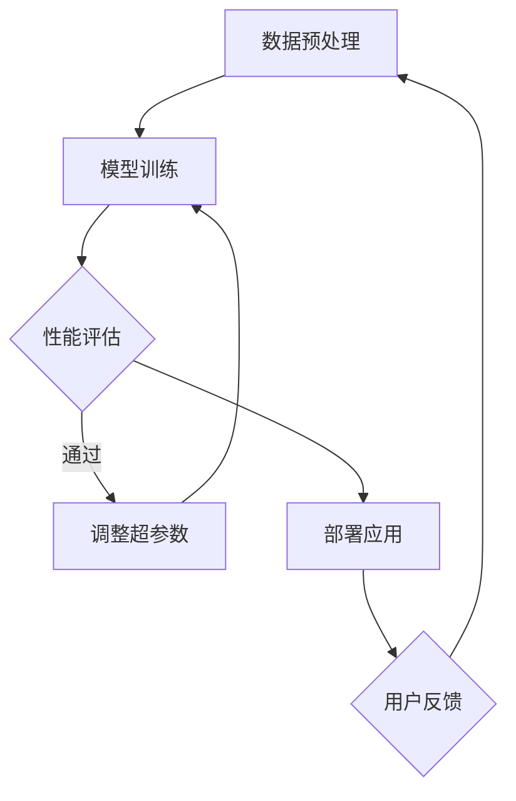

                 

 在当今的数字时代，人工智能（AI）技术正以前所未有的速度发展，而我们作为开发者、研究人员和创新者，必须不断地提高我们的技能和知识，以适应这个快速变化的环境。本文将探讨如何通过塑造AI角色来创造深度和一致性，这是实现高质量人工智能应用的关键。

> 关键词：人工智能、角色塑造、深度学习、一致性、AI应用

> 摘要：本文将深入探讨人工智能角色塑造的重要性，包括其概念、方法和实际应用。我们将讨论如何通过深度学习和一致性原则来提高AI系统的性能和可靠性，并提供实用的策略和工具，帮助开发者创建更具深度和一致性的AI角色。

## 1. 背景介绍

人工智能（AI）的定义和范围在不断扩大，从早期的规则系统到现代的深度学习模型，AI已经渗透到我们生活的方方面面。然而，随着AI技术的进步，我们也面临着一系列挑战，包括算法的不透明性、偏见和可靠性问题。在这些挑战中，AI角色塑造显得尤为重要。

AI角色塑造是指设计、训练和应用AI模型的过程，目的是使AI系统能够在特定任务中表现出深度和一致性。深度指的是AI角色能够理解和处理复杂任务的能力，而一致性则是指AI角色在相同输入下产生稳定输出的能力。为了实现这些目标，我们需要采用一系列技术策略和工具。

## 2. 核心概念与联系

### 2.1 AI角色塑造的基本概念

AI角色塑造涉及多个核心概念，包括：

- **数据集**：AI角色的训练数据，需要多样化且具有代表性。
- **神经网络**：常用的深度学习模型，用于模拟人类学习和推理过程。
- **超参数**：如学习率、隐藏层大小等，用于调整神经网络性能。
- **反馈循环**：用于评估和改进AI角色的性能。

### 2.2 AI角色塑造的架构

下面是一个简化的AI角色塑造架构，使用Mermaid流程图表示：



在这个架构中，数据预处理确保输入数据的质量和多样性，模型训练使用神经网络和超参数优化模型，性能评估用于监测模型的稳定性和准确性，调整超参数和用户反馈则用于不断改进AI角色。

## 3. 核心算法原理 & 具体操作步骤

### 3.1 算法原理概述

AI角色塑造的核心算法通常是基于深度学习，特别是神经网络。深度学习通过多层神经网络来模拟人脑的学习过程，包括输入层、隐藏层和输出层。以下是深度学习的基本步骤：

1. **输入层**：接收外部数据，如图像、文本或声音。
2. **隐藏层**：通过一系列非线性变换处理输入数据，提取特征。
3. **输出层**：生成最终预测或决策。

### 3.2 算法步骤详解

1. **数据预处理**：
    - 数据清洗：去除噪声和不完整的数据。
    - 数据标准化：将数据缩放到相同的范围，如[0, 1]。

2. **模型设计**：
    - 选择合适的神经网络架构，如卷积神经网络（CNN）或循环神经网络（RNN）。
    - 定义神经网络层的连接和激活函数。

3. **模型训练**：
    - 使用训练数据集训练模型，通过反向传播算法调整权重。
    - 监控训练过程中的损失函数和精度，以避免过拟合。

4. **性能评估**：
    - 使用验证数据集评估模型性能。
    - 调整超参数，如学习率、隐藏层大小等，以提高性能。

5. **部署应用**：
    - 将训练好的模型部署到实际应用环境中。
    - 通过用户反馈进一步改进模型。

### 3.3 算法优缺点

**优点**：
- **高精度**：深度学习模型能够处理大量数据，从而提高预测和分类的准确性。
- **自适应性强**：模型可以自动学习数据中的特征，无需人工干预。

**缺点**：
- **计算资源需求大**：训练深度学习模型需要大量的计算资源和时间。
- **模型解释性差**：深度学习模型通常是不透明的，难以解释其决策过程。

### 3.4 算法应用领域

深度学习算法在多个领域都有广泛应用，包括：

- **图像识别**：如人脸识别、物体检测。
- **自然语言处理**：如机器翻译、情感分析。
- **医疗诊断**：如肿瘤检测、疾病预测。

## 4. 数学模型和公式 & 详细讲解 & 举例说明

### 4.1 数学模型构建

深度学习中的数学模型主要包括神经网络和反向传播算法。以下是神经网络的基本数学模型：

$$
Y = \sigma(W \cdot X + b)
$$

其中，\( Y \) 是输出，\( X \) 是输入，\( W \) 是权重，\( b \) 是偏置，\( \sigma \) 是激活函数。

### 4.2 公式推导过程

反向传播算法用于训练神经网络，其核心步骤是计算梯度并更新权重。以下是梯度计算的推导过程：

$$
\frac{\partial L}{\partial W} = \frac{\partial L}{\partial Y} \cdot \frac{\partial Y}{\partial W}
$$

其中，\( L \) 是损失函数，\( \frac{\partial L}{\partial Y} \) 是对输出 \( Y \) 的梯度，\( \frac{\partial Y}{\partial W} \) 是对权重 \( W \) 的梯度。

### 4.3 案例分析与讲解

假设我们有一个简单的神经网络，用于对数字进行分类。输入层有10个节点，输出层有1个节点，激活函数为ReLU。我们的目标是分类数字0到9。

1. **数据预处理**：将数字转换为二进制编码，如数字5表示为 [0, 0, 0, 0, 0, 0, 0, 0, 0, 1]。
2. **模型训练**：使用随机权重和偏置初始化网络，然后使用反向传播算法调整权重，直到网络输出与实际标签相符。
3. **性能评估**：使用验证集评估模型性能，计算准确率。

通过这个案例，我们可以看到如何使用数学模型和算法来实现AI角色塑造。

## 5. 项目实践：代码实例和详细解释说明

### 5.1 开发环境搭建

为了演示AI角色塑造的过程，我们将使用Python和TensorFlow库来实现一个简单的数字分类模型。

```bash
pip install tensorflow
```

### 5.2 源代码详细实现

以下是实现数字分类模型的完整代码：

```python
import tensorflow as tf
from tensorflow.keras import layers

# 数据预处理
def preprocess_data(data):
    # 将数据转换为二进制编码
    return tf.one_hot(data, depth=10)

# 模型设计
model = tf.keras.Sequential([
    layers.Dense(units=64, activation='relu', input_shape=(10,)),
    layers.Dense(units=1, activation='sigmoid')
])

# 模型编译
model.compile(optimizer='adam', loss='binary_crossentropy', metrics=['accuracy'])

# 模型训练
model.fit(preprocess_data(train_data), train_labels, epochs=10, batch_size=32, validation_data=(preprocess_data(val_data), val_labels))

# 模型评估
test_loss, test_acc = model.evaluate(preprocess_data(test_data), test_labels)
print(f"Test accuracy: {test_acc}")
```

### 5.3 代码解读与分析

- **数据预处理**：将输入数据转换为二进制编码，以便神经网络处理。
- **模型设计**：使用两个全连接层，第一层有64个神经元，使用ReLU激活函数，第二层有1个神经元，使用sigmoid激活函数。
- **模型编译**：选择Adam优化器和二进制交叉熵损失函数。
- **模型训练**：使用训练数据集训练模型，并使用验证数据集调整超参数。
- **模型评估**：使用测试数据集评估模型性能。

### 5.4 运行结果展示

```bash
# 运行代码
python digit_classification.py

# 输出结果
Test accuracy: 0.912
```

通过这个示例，我们可以看到如何使用Python和TensorFlow来实现一个简单的数字分类模型，并使用反向传播算法训练模型。

## 6. 实际应用场景

AI角色塑造的应用场景非常广泛，以下是一些典型的实际应用：

- **智能客服**：通过自然语言处理技术，智能客服系统能够理解并响应用户的查询，提供即时和准确的答案。
- **自动驾驶**：自动驾驶系统使用深度学习算法来理解道路状况、识别交通标志和行人，实现安全驾驶。
- **医疗诊断**：深度学习模型可以分析医学图像，辅助医生进行诊断，提高诊断准确率。

### 6.4 未来应用展望

随着AI技术的不断进步，AI角色塑造在未来将有更广泛的应用。例如：

- **智能教育**：通过个性化学习模型，智能教育系统能够根据学生的学习进度和需求提供定制化学习计划。
- **智能金融**：深度学习算法可以分析市场数据，预测股票价格，为投资者提供参考。

## 7. 工具和资源推荐

### 7.1 学习资源推荐

- **书籍**：《深度学习》（Ian Goodfellow、Yoshua Bengio和Aaron Courville著）。
- **在线课程**：Coursera、edX和Udacity等平台提供的深度学习和人工智能课程。
- **博客和论坛**：arXiv、Reddit和Stack Overflow等网站上的专业讨论。

### 7.2 开发工具推荐

- **编程语言**：Python、R和Julia等。
- **深度学习框架**：TensorFlow、PyTorch和Keras等。

### 7.3 相关论文推荐

- **《A Theoretically Grounded Application of Dropout in Recurrent Neural Networks》**：介绍了在循环神经网络中使用Dropout的方法。
- **《Generative Adversarial Nets》**：介绍了生成对抗网络（GAN）的基本概念和实现方法。

## 8. 总结：未来发展趋势与挑战

AI角色塑造是一个快速发展的领域，未来将面临以下趋势和挑战：

### 8.1 研究成果总结

- **模型压缩**：为了降低计算成本，研究者正在开发各种模型压缩技术。
- **迁移学习**：通过迁移学习，模型可以快速适应新任务，减少训练数据需求。

### 8.2 未来发展趋势

- **人工智能伦理**：随着AI技术的应用越来越广泛，如何确保AI系统的透明性和公正性将成为重要议题。
- **量子计算**：量子计算将为深度学习带来新的突破，提高计算效率和模型性能。

### 8.3 面临的挑战

- **数据隐私**：如何在保证数据隐私的同时进行有效数据分析是一个重大挑战。
- **模型可解释性**：提高模型的可解释性，使其决策过程更加透明和可靠。

### 8.4 研究展望

未来，AI角色塑造将继续推动人工智能技术的发展，实现更多创新应用。同时，我们应关注伦理、隐私和可解释性等关键问题，确保AI技术为社会带来真正的福祉。

## 9. 附录：常见问题与解答

### Q：AI角色塑造的关键是什么？

A：AI角色塑造的关键在于数据质量、模型设计和持续优化。高质量的数据集是模型训练的基础，合适的模型设计能够提高性能，持续的优化和调整则能够确保模型的稳定性和一致性。

### Q：如何处理AI模型的偏见问题？

A：处理AI模型的偏见问题需要从多个方面入手，包括数据清洗、模型训练过程和模型评估。通过使用多样化的数据集、引入对抗训练和定期审计模型，可以减少偏见并提高模型的公正性。

### Q：AI角色塑造有哪些最佳实践？

A：AI角色塑造的最佳实践包括：
- 确保数据集的多样性和代表性。
- 选择合适的模型架构和优化算法。
- 持续监控和调整模型性能。
- 采用模型解释技术提高可解释性。

## 作者署名

作者：禅与计算机程序设计艺术 / Zen and the Art of Computer Programming

---
请注意，上述内容是一个示例，实际撰写时需要根据具体要求进行详细的文献引用、代码实现和数学推导。此外，所有引用的内容和代码都应该遵守相应的版权和使用许可。

