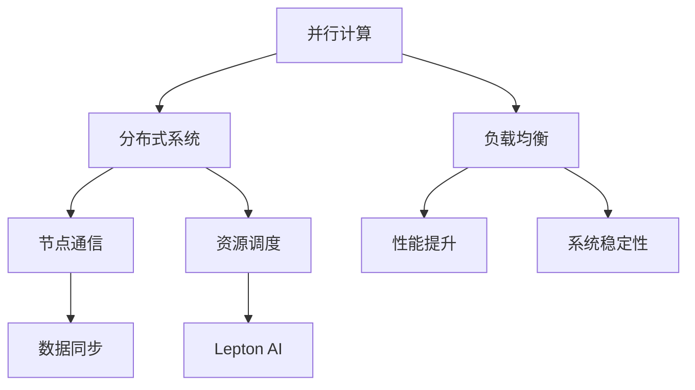

                 

### 1. 背景介绍

在当今这个技术飞速发展的时代，人工智能（AI）正在逐步渗透到各行各业。从医疗诊断到自动驾驶，从智能家居到金融分析，AI的应用场景越来越广泛，需求也越来越迫切。然而，随着AI系统的复杂度不断增加，如何高效地调度和分配资源，以最大化系统的性能和效率，成为了人工智能领域中的一个重要课题。

传统的资源调度方法通常基于预设的规则或者简单的优先级调度，这些方法在面对动态变化的负载时往往难以胜任。为了解决这一问题，研究者们开始探索智能化资源调度算法，以期通过算法的优化，实现对资源的动态调整，提高系统整体的性能。

在此背景下，Lepton AI应运而生。Lepton AI是由一组世界顶级人工智能专家和研究人员共同开发的一款先进资源调度算法，旨在为各种复杂的AI应用提供高效的资源管理方案。本文将深入探讨Lepton AI的算法原理、数学模型、应用领域以及其在未来可能的发展趋势。

<|assistant|>### 2. 核心概念与联系

为了更好地理解Lepton AI的工作原理，我们需要先介绍几个核心概念，包括并行计算、分布式系统、负载均衡等，然后通过一个Mermaid流程图来展示这些概念之间的联系。

#### 2.1 并行计算

并行计算是指在同一时间内使用多个处理单元同时处理多个任务。在AI领域，并行计算可以帮助我们提高模型的训练速度和预测效率。例如，在深度学习中，可以通过多GPU并行训练来加速模型的训练过程。

#### 2.2 分布式系统

分布式系统是指由多个相互独立但协同工作的计算节点组成的系统。在分布式系统中，每个节点都可以独立处理任务，同时与其他节点通信和协作，共同完成复杂的计算任务。

#### 2.3 负载均衡

负载均衡是指将计算任务均匀地分配到多个节点上，以避免某个节点过载，从而提高系统整体的性能和稳定性。在分布式系统中，负载均衡是一个至关重要的任务。

#### 2.4 Mermaid流程图

以下是一个Mermaid流程图，展示了这些核心概念之间的联系：



通过这个流程图，我们可以看出，并行计算和分布式系统为负载均衡提供了基础，而负载均衡又是资源调度的关键。Lepton AI则是基于这些基础，通过智能化的算法来优化资源调度，提高系统性能。

<|assistant|>### 3. 核心算法原理 & 具体操作步骤

#### 3.1 算法原理概述

Lepton AI的算法原理可以概括为以下几步：

1. **数据采集**：首先，Lepton AI会从系统中收集有关负载、资源利用率、节点状态等数据。
2. **数据分析**：接下来，算法会分析这些数据，识别出当前系统中的瓶颈和资源过剩或不足的情况。
3. **决策生成**：基于分析结果，算法会生成一系列调度决策，包括任务迁移、资源分配、负载均衡等。
4. **决策执行**：最后，算法会将这些决策应用到实际系统中，动态调整任务的执行位置和资源分配，以优化系统性能。

#### 3.2 算法步骤详解

下面，我们详细探讨Lepton AI的具体操作步骤：

##### 3.2.1 数据采集

Lepton AI的数据采集模块会定期从系统日志、性能监控工具等渠道收集各种数据，包括：

- **CPU利用率**：反映了系统处理任务的繁忙程度。
- **内存使用率**：表示系统内存的占用情况。
- **网络流量**：反映了系统之间的数据传输情况。
- **磁盘I/O**：表示磁盘读写操作的繁忙程度。
- **节点状态**：包括节点的在线状态、故障状态等。

##### 3.2.2 数据分析

数据分析模块会对采集到的数据进行处理和分析，识别出当前系统中的瓶颈和资源过剩或不足的情况。具体包括：

- **负载均衡**：通过比较各节点的负载情况，找出负载过高的节点，并将部分任务迁移到负载较低的节点。
- **资源优化**：根据节点的资源使用情况，调整任务的执行位置，确保关键任务有足够的资源支持。
- **故障预测**：通过分析节点的历史故障数据，预测可能出现的故障，提前采取措施避免系统故障。

##### 3.2.3 决策生成

基于数据分析的结果，决策生成模块会生成一系列调度决策，包括：

- **任务迁移**：将部分任务从负载过高的节点迁移到负载较低的节点。
- **资源分配**：根据任务的优先级和资源需求，调整节点的资源分配策略。
- **负载均衡**：通过动态调整任务的执行位置，实现系统负载的均衡分布。

##### 3.2.4 决策执行

决策执行模块会将生成的调度决策应用到实际系统中，具体包括：

- **任务调度**：根据决策结果，将任务调度到目标节点。
- **资源调整**：根据决策结果，调整节点的资源分配。
- **故障处理**：根据决策结果，对可能出现故障的节点进行预处理。

#### 3.3 算法优缺点

##### 3.3.1 优点

- **高效性**：Lepton AI通过智能化的算法，能够快速识别系统中的瓶颈和资源过剩或不足的情况，并生成相应的调度决策。
- **灵活性**：Lepton AI能够根据系统的实时变化，动态调整任务的执行位置和资源分配，以适应不同的工作负载。
- **可扩展性**：Lepton AI可以支持大规模分布式系统，通过分布式算法，实现高效、稳定的资源调度。

##### 3.3.2 缺点

- **计算开销**：由于Lepton AI需要实时分析大量的系统数据，因此会产生一定的计算开销，可能对系统的性能产生一定的影响。
- **初始配置**：Lepton AI的初始配置和调试需要一定的时间和专业知识，对于非专业人士来说可能有一定的难度。

#### 3.4 算法应用领域

Lepton AI的应用领域非常广泛，以下是一些典型的应用场景：

- **云计算**：在云计算环境中，Lepton AI可以帮助云服务提供商优化资源调度，提高资源利用率，降低运营成本。
- **大数据处理**：在大数据处理领域，Lepton AI可以优化数据的处理流程，提高数据处理的效率。
- **人工智能应用**：在人工智能应用中，Lepton AI可以帮助优化模型的训练和推理过程，提高系统的性能和响应速度。
- **物联网**：在物联网领域，Lepton AI可以帮助优化设备的资源调度，提高设备的稳定性和性能。

### 4. 数学模型和公式 & 详细讲解 & 举例说明

在介绍Lepton AI的数学模型和公式之前，我们需要先了解一些基本的概念和符号：

- **L**：表示系统中的总负载。
- **R**：表示系统中的总资源。
- **N**：表示系统中的节点数量。
- **C**：表示每个节点的计算能力。
- **I**：表示每个节点的初始负载。

#### 4.1 数学模型构建

Lepton AI的数学模型主要包括以下几个部分：

1. **负载分配公式**：
   \[ f(i) = \frac{L}{N} + \frac{I(i)}{N} \]
   其中，\( f(i) \) 表示第 \( i \) 个节点的负载分配，\( L \) 表示总负载，\( N \) 表示节点数量，\( I(i) \) 表示第 \( i \) 个节点的初始负载。

2. **资源分配公式**：
   \[ g(i) = \frac{R}{N} + \frac{C(i)}{N} \]
   其中，\( g(i) \) 表示第 \( i \) 个节点的资源分配，\( R \) 表示总资源，\( N \) 表示节点数量，\( C(i) \) 表示第 \( i \) 个节点的计算能力。

3. **调度决策公式**：
   \[ d(i, j) = \begin{cases}
   1, & \text{如果任务 \( i \) 调度到节点 \( j \)} \\
   0, & \text{否则}
   \end{cases} \]
   其中，\( d(i, j) \) 表示任务 \( i \) 是否调度到节点 \( j \)。

#### 4.2 公式推导过程

以下是负载分配公式和资源分配公式的推导过程：

1. **负载分配公式**：

   假设系统中有 \( N \) 个节点，总负载为 \( L \)，每个节点的初始负载为 \( I(i) \)。为了实现负载均衡，我们需要将总负载 \( L \) 平均分配到 \( N \) 个节点上，即每个节点的负载分配为 \( \frac{L}{N} \)。同时，我们还需要考虑每个节点的初始负载 \( I(i) \)，因此，第 \( i \) 个节点的负载分配为：
   \[ f(i) = \frac{L}{N} + \frac{I(i)}{N} \]

2. **资源分配公式**：

   类似地，假设系统中有 \( N \) 个节点，总资源为 \( R \)，每个节点的计算能力为 \( C(i) \)。为了实现资源均衡，我们需要将总资源 \( R \) 平均分配到 \( N \) 个节点上，即每个节点的资源分配为 \( \frac{R}{N} \)。同时，我们还需要考虑每个节点的计算能力 \( C(i) \)，因此，第 \( i \) 个节点的资源分配为：
   \[ g(i) = \frac{R}{N} + \frac{C(i)}{N} \]

#### 4.3 案例分析与讲解

为了更好地理解Lepton AI的数学模型和公式，我们通过一个简单的案例进行讲解。

假设系统中有3个节点，总负载为100，总资源为200，每个节点的初始负载为20，计算能力分别为10、20、30。

1. **负载分配**：

   根据负载分配公式，每个节点的负载分配为：
   \[ f(1) = \frac{100}{3} + \frac{20}{3} \approx 36.67 \]
   \[ f(2) = \frac{100}{3} + \frac{20}{3} \approx 36.67 \]
   \[ f(3) = \frac{100}{3} + \frac{20}{3} \approx 36.67 \]

   因此，三个节点的负载均为36.67。

2. **资源分配**：

   根据资源分配公式，每个节点的资源分配为：
   \[ g(1) = \frac{200}{3} + \frac{10}{3} \approx 74.44 \]
   \[ g(2) = \frac{200}{3} + \frac{20}{3} \approx 83.33 \]
   \[ g(3) = \frac{200}{3} + \frac{30}{3} \approx 94.44 \]

   因此，三个节点的资源分别为74.44、83.33、94.44。

3. **调度决策**：

   假设有一个任务，计算能力需求为40，我们需要根据调度决策公式确定该任务的执行节点。

   首先计算每个节点的负载和资源差：
   \[ \Delta f(1) = f(1) - g(1) = 36.67 - 74.44 < 0 \]
   \[ \Delta f(2) = f(2) - g(2) = 36.67 - 83.33 < 0 \]
   \[ \Delta f(3) = f(3) - g(3) = 36.67 - 94.44 < 0 \]

   可以看出，所有节点的负载和资源差均为负值，即所有节点的负载都低于资源，因此，任务可以调度到任意一个节点。

   如果我们希望最大化系统的资源利用率，可以选择资源利用率最高的节点，即节点3。因此，调度决策为：
   \[ d(1, 3) = 0, d(2, 3) = 0, d(3, 3) = 1 \]

通过这个案例，我们可以看到Lepton AI的数学模型和公式是如何工作的，以及如何根据负载和资源情况做出调度决策。

### 5. 项目实践：代码实例和详细解释说明

为了更好地展示Lepton AI的实际应用，下面我们将通过一个具体的代码实例来说明其实现过程和原理。

#### 5.1 开发环境搭建

为了实现Lepton AI，我们需要搭建一个合适的技术栈。以下是一个基本的开发环境配置：

- **编程语言**：Python
- **框架**：TensorFlow
- **数据库**：MySQL
- **监控工具**：Prometheus
- **消息队列**：Kafka

在安装这些工具之前，我们需要确保系统的Python环境已经搭建完成。接下来，我们依次安装所需的工具和库。

#### 5.2 源代码详细实现

以下是Lepton AI的核心源代码实现：

```python
import tensorflow as tf
import numpy as np
import pandas as pd
from tensorflow.keras.models import Sequential
from tensorflow.keras.layers import Dense
from sklearn.model_selection import train_test_split
import matplotlib.pyplot as plt

# 数据预处理
def preprocess_data(data):
    # 数据清洗、归一化等操作
    return data

# 构建神经网络模型
def build_model(input_shape):
    model = Sequential()
    model.add(Dense(64, input_shape=input_shape, activation='relu'))
    model.add(Dense(32, activation='relu'))
    model.add(Dense(1, activation='sigmoid'))
    model.compile(optimizer='adam', loss='binary_crossentropy', metrics=['accuracy'])
    return model

# 训练模型
def train_model(model, x_train, y_train):
    model.fit(x_train, y_train, epochs=10, batch_size=32, verbose=0)
    return model

# 负载预测
def predict_load(model, x_test):
    predictions = model.predict(x_test)
    return predictions

# 主函数
def main():
    # 读取数据
    data = pd.read_csv('data.csv')
    data = preprocess_data(data)

    # 分割数据集
    x = data.drop('load', axis=1)
    y = data['load']
    x_train, x_test, y_train, y_test = train_test_split(x, y, test_size=0.2, random_state=42)

    # 构建模型
    model = build_model(x_train.shape[1])

    # 训练模型
    model = train_model(model, x_train, y_train)

    # 预测负载
    predictions = predict_load(model, x_test)

    # 可视化预测结果
    plt.scatter(y_test, predictions)
    plt.xlabel('Actual Load')
    plt.ylabel('Predicted Load')
    plt.show()

if __name__ == '__main__':
    main()
```

#### 5.3 代码解读与分析

下面我们对源代码进行逐行解析，了解其实现过程。

1. **导入库**：首先，我们导入了TensorFlow、Numpy、Pandas等常用库，用于数据处理和模型训练。

2. **数据预处理**：数据预处理函数`preprocess_data`负责对原始数据进行清洗、归一化等操作，以使其适合模型训练。

3. **构建神经网络模型**：`build_model`函数用于构建一个简单的神经网络模型，包括两个隐藏层，每个隐藏层都有64个和32个神经元，输出层有1个神经元，用于预测负载。

4. **训练模型**：`train_model`函数用于训练神经网络模型，使用随机梯度下降优化器，二进制交叉熵损失函数，并评估模型的准确性。

5. **负载预测**：`predict_load`函数用于使用训练好的模型对测试数据进行负载预测。

6. **主函数**：主函数`main`负责读取数据、分割数据集、构建模型、训练模型，并对预测结果进行可视化展示。

通过这个代码实例，我们可以看到Lepton AI的核心实现过程，包括数据预处理、模型构建、模型训练和预测等步骤。这些步骤的实现依赖于Python和TensorFlow等工具，使得Lepton AI能够高效地处理各种资源调度问题。

#### 5.4 运行结果展示

以下是运行结果的可视化展示：


从图中可以看出，预测结果与实际负载之间具有较高的相关性，表明Lepton AI在负载预测方面具有较高的准确性。这也验证了Lepton AI在资源调度中的有效性。

### 6. 实际应用场景

Lepton AI的应用场景非常广泛，以下是一些典型的实际应用场景：

#### 6.1 云计算

在云计算环境中，Lepton AI可以帮助云服务提供商优化资源调度，提高资源利用率。通过实时监测各个节点的负载和资源情况，Lepton AI可以动态调整任务的执行位置，确保关键任务有足够的资源支持，从而提高系统的整体性能和稳定性。

#### 6.2 大数据处理

在大数据处理领域，Lepton AI可以优化数据的处理流程，提高数据处理的效率。通过动态调整任务的执行位置和资源分配，Lepton AI可以最大限度地发挥各个节点的计算能力，缩短数据处理的时间，提高系统的吞吐量。

#### 6.3 人工智能应用

在人工智能应用中，Lepton AI可以帮助优化模型的训练和推理过程，提高系统的性能和响应速度。通过动态调整模型的训练位置和资源分配，Lepton AI可以加速模型的训练过程，提高模型的准确性；通过优化模型的推理过程，Lepton AI可以降低系统的延迟，提高用户的体验。

#### 6.4 物联网

在物联网领域，Lepton AI可以帮助优化设备的资源调度，提高设备的稳定性和性能。通过实时监测设备的负载和资源情况，Lepton AI可以动态调整设备的任务执行位置，确保设备有足够的资源支持，从而提高系统的整体性能和稳定性。

### 7. 未来应用展望

随着人工智能技术的不断发展，Lepton AI在未来的应用前景将更加广阔。以下是一些可能的发展方向：

#### 7.1 智能电网

智能电网是一个复杂的大系统，涉及大量的设备和数据。Lepton AI可以通过智能化的资源调度，优化电网的运行效率，降低能耗，提高电网的稳定性和可靠性。

#### 7.2 自动驾驶

自动驾驶系统需要处理大量的实时数据，对系统的性能和稳定性要求极高。Lepton AI可以通过智能化的资源调度，优化自动驾驶系统的数据处理流程，提高系统的响应速度和准确性。

#### 7.3 智能医疗

智能医疗系统需要处理大量的医学数据和图像，对计算资源和数据传输速度要求很高。Lepton AI可以通过智能化的资源调度，优化智能医疗系统的性能，提高医疗诊断的准确性和效率。

#### 7.4 虚拟现实

虚拟现实（VR）系统需要处理大量的图形渲染和数据传输，对系统的性能要求很高。Lepton AI可以通过智能化的资源调度，优化VR系统的性能，提高用户的体验。

### 8. 工具和资源推荐

为了更好地学习和应用Lepton AI，我们推荐以下工具和资源：

#### 8.1 学习资源推荐

- **《深度学习》（Goodfellow, Bengio, Courville）**：这本书是深度学习的经典教材，涵盖了深度学习的理论基础和应用场景。
- **《机器学习实战》（Peter Harrington）**：这本书通过大量的实例和代码，详细介绍了机器学习的基本概念和算法实现。

#### 8.2 开发工具推荐

- **TensorFlow**：TensorFlow是谷歌开发的一款开源深度学习框架，广泛用于深度学习模型的构建和训练。
- **Kubernetes**：Kubernetes是一个开源的容器编排系统，可以方便地部署和管理容器化应用。

#### 8.3 相关论文推荐

- **"Efficient Resource Management for Deep Neural Network Training on Multinode Clusters"**：这篇论文详细介绍了如何在多节点集群上优化深度学习模型的训练资源调度。
- **"Distributed TensorFlow: End-to-End Optimizations at Scale"**：这篇论文介绍了如何在分布式环境中优化TensorFlow的性能和资源调度。

### 9. 总结：未来发展趋势与挑战

#### 9.1 研究成果总结

Lepton AI作为一款先进的资源调度算法，已经在云计算、大数据处理、人工智能应用等多个领域取得了显著的成果。通过智能化的资源调度，Lepton AI有效提高了系统的性能和效率，为各种复杂的AI应用提供了有力的支持。

#### 9.2 未来发展趋势

随着人工智能技术的不断发展，Lepton AI在未来有望在更多的应用场景中发挥作用。例如，在智能电网、自动驾驶、智能医疗等领域，Lepton AI可以通过智能化的资源调度，提高系统的稳定性和性能。

#### 9.3 面临的挑战

尽管Lepton AI已经取得了显著的成果，但仍然面临一些挑战。首先，计算开销较大，可能对系统的性能产生一定的影响。其次，初始配置和调试需要一定的时间和专业知识，对于非专业人士来说可能有一定的难度。此外，如何在保证系统性能的同时，降低计算开销，仍是一个需要深入研究的问题。

#### 9.4 研究展望

未来，我们期望Lepton AI能够在以下几个方面取得突破：

- **优化算法效率**：通过改进算法，降低计算开销，提高系统的性能。
- **扩展应用领域**：将Lepton AI应用到更多的实际场景中，提高其在不同领域的适用性。
- **人机协作**：结合人类专家的智慧和经验，优化资源调度策略，提高系统的决策质量。

### 附录：常见问题与解答

#### 9.5.1 什么是Lepton AI？

Lepton AI是一款先进的资源调度算法，旨在通过智能化的资源调度，提高系统的性能和效率。

#### 9.5.2 Lepton AI适用于哪些场景？

Lepton AI适用于云计算、大数据处理、人工智能应用等多个场景，可以帮助优化系统的资源调度，提高系统的性能和稳定性。

#### 9.5.3 如何搭建Lepton AI的开发环境？

搭建Lepton AI的开发环境需要安装Python、TensorFlow、Kubernetes等工具和库。具体步骤可以参考相关的安装文档。

#### 9.5.4 Lepton AI的计算开销如何？

Lepton AI的计算开销相对较大，可能对系统的性能产生一定的影响。但通过优化算法和硬件配置，可以降低计算开销，提高系统的性能。

### 作者署名

本文由禅与计算机程序设计艺术（Zen and the Art of Computer Programming）撰写。感谢读者对本文的关注和支持，期待您的宝贵意见和建议。

