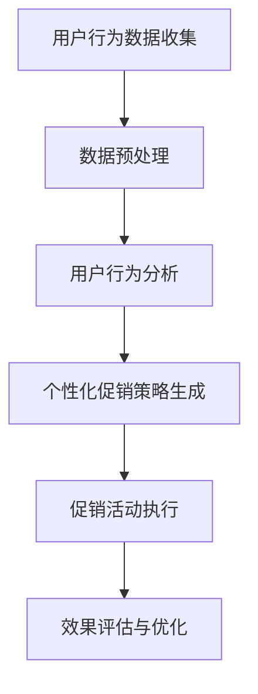

                 

关键词：人工智能、个性化促销、电商平台、算法、用户行为分析

> 摘要：本文将探讨如何利用人工智能技术赋能电商平台促销活动个性化，通过核心算法原理解析、数学模型构建、实际案例和未来展望等多角度分析，揭示实现个性化促销活动的高效路径。

## 1. 背景介绍

随着互联网和电子商务的迅猛发展，电商平台已经成为消费者日常购物的重要渠道。然而，在竞争日益激烈的电商市场中，如何吸引并留住用户，提高销售额，成为各大电商平台关注的焦点。个性化促销活动作为提升用户体验和增加销售的重要手段，逐渐受到电商企业的青睐。

传统的促销活动往往采用“一刀切”的方式，无法满足不同用户的需求，导致资源浪费和用户流失。随着人工智能技术的快速发展，尤其是机器学习和大数据分析技术的应用，电商平台可以根据用户行为和偏好，实现促销活动的个性化，从而提高用户满意度和转化率。

本文将围绕人工智能赋能电商平台促销活动个性化展开讨论，介绍相关核心概念、算法原理、数学模型以及实际案例，旨在为电商企业提供可行的技术解决方案。

## 2. 核心概念与联系

### 2.1 个性化促销活动

个性化促销活动是指根据用户的兴趣、行为和购买历史等数据，为每个用户定制专属的促销方案。与传统的统一促销方式相比，个性化促销活动能够更好地满足用户需求，提高用户参与度和转化率。

### 2.2 用户行为分析

用户行为分析是指通过收集、处理和分析用户在电商平台上的行为数据，挖掘用户兴趣和偏好，为个性化促销活动提供数据支持。

### 2.3 机器学习

机器学习是一种通过数据驱动的方式，让计算机自动识别规律、预测趋势和做出决策的技术。在电商平台促销活动中，机器学习算法可用于预测用户行为、推荐商品和优化促销策略。

### 2.4 大数据

大数据是指海量、多样、快速产生的数据集合。在电商平台，大数据技术可用于存储、处理和分析用户行为数据，为个性化促销活动提供数据基础。

### 2.5 Mermaid 流程图

Mermaid 是一种基于 Markdown 的图形绘制工具，可用于绘制流程图、关系图等。以下是一个简单的 Mermaid 流程图示例，描述了个性化促销活动的流程：



## 3. 核心算法原理 & 具体操作步骤

### 3.1 算法原理概述

个性化促销活动算法主要包括用户行为分析、兴趣推荐和促销策略优化三个核心部分。以下是这三个部分的简要原理：

1. **用户行为分析**：通过机器学习算法，分析用户在平台上的行为数据，如浏览历史、购买记录、收藏夹等，挖掘用户兴趣和偏好。

2. **兴趣推荐**：基于用户兴趣和偏好，利用推荐算法为用户推荐合适的商品和促销活动。

3. **促销策略优化**：根据用户兴趣推荐结果，结合市场环境和销售目标，制定个性化的促销策略。

### 3.2 算法步骤详解

1. **用户行为数据收集**：从电商平台的后台系统中获取用户行为数据，如浏览历史、购买记录、收藏夹等。

2. **数据预处理**：对原始数据进行清洗、去噪和归一化处理，为后续分析做好准备。

3. **用户行为分析**：使用机器学习算法，如聚类、协同过滤等，分析用户行为数据，挖掘用户兴趣和偏好。

4. **兴趣推荐**：根据用户兴趣和偏好，利用推荐算法为用户推荐合适的商品和促销活动。

5. **促销策略优化**：根据用户兴趣推荐结果，结合市场环境和销售目标，制定个性化的促销策略。

6. **促销活动执行**：在电商平台前端展示个性化促销活动，吸引用户参与。

7. **效果评估与优化**：根据用户参与度和转化率等指标，评估促销活动效果，并持续优化促销策略。

### 3.3 算法优缺点

**优点**：

1. 提高用户满意度：个性化促销活动能够更好地满足用户需求，提高用户体验。
2. 提高销售转化率：通过精准推荐，提高用户购买意愿，提高销售额。
3. 降低营销成本：通过数据驱动的促销策略，减少无效营销，降低营销成本。

**缺点**：

1. 数据隐私风险：用户行为数据涉及个人隐私，需要确保数据安全和用户隐私保护。
2. 算法复杂度高：个性化促销活动算法需要处理大量数据，算法复杂度较高，对计算资源要求较高。

### 3.4 算法应用领域

个性化促销活动算法可以广泛应用于电商、金融、教育、医疗等多个领域。以下是几个典型应用场景：

1. **电商**：为用户提供个性化商品推荐和促销活动，提高销售额和用户满意度。
2. **金融**：为用户提供个性化理财产品推荐和促销活动，提高用户转化率和投资收益。
3. **教育**：为用户提供个性化课程推荐和促销活动，提高学习效果和用户参与度。
4. **医疗**：为用户提供个性化医疗服务推荐和促销活动，提高医疗服务质量和用户满意度。

## 4. 数学模型和公式 & 详细讲解 & 举例说明

### 4.1 数学模型构建

在个性化促销活动中，常用的数学模型包括用户行为模型、推荐模型和促销策略优化模型。以下是这些模型的简要介绍：

1. **用户行为模型**：

   用户行为模型用于描述用户在平台上的行为，如浏览、购买、收藏等。一个简单的用户行为模型可以表示为：

   $$ user\_behavior = f(user\_profile, item\_profile, context) $$

   其中，$user\_profile$ 表示用户特征，如年龄、性别、职业等；$item\_profile$ 表示商品特征，如价格、品牌、品类等；$context$ 表示上下文信息，如时间、地点等。

2. **推荐模型**：

   推荐模型用于根据用户行为和兴趣为用户推荐商品和促销活动。一个简单的推荐模型可以表示为：

   $$ recommendation = f(user\_behavior, item\_profile, context) $$

   其中，$user\_behavior$ 表示用户行为数据；$item\_profile$ 表示商品特征数据；$context$ 表示上下文信息。

3. **促销策略优化模型**：

   促销策略优化模型用于根据用户兴趣推荐结果和销售目标，制定个性化的促销策略。一个简单的促销策略优化模型可以表示为：

   $$ promotion\_strategy = f(recommendation, sales\_target) $$

   其中，$recommendation$ 表示用户兴趣推荐结果；$sales\_target$ 表示销售目标。

### 4.2 公式推导过程

以下是用户行为模型、推荐模型和促销策略优化模型的推导过程：

1. **用户行为模型推导**：

   用户行为模型可以根据用户特征、商品特征和上下文信息进行构建。假设用户特征、商品特征和上下文信息分别为 $u, i, c$，则用户行为模型可以表示为：

   $$ user\_behavior = f(u, i, c) = \sum_{j=1}^{n} w_j * h_j(u, i, c) $$

   其中，$w_j$ 表示权重；$h_j(u, i, c)$ 表示特征函数。

2. **推荐模型推导**：

   推荐模型可以根据用户行为模型和商品特征进行构建。假设用户行为模型为 $user\_behavior$，商品特征为 $i$，则推荐模型可以表示为：

   $$ recommendation = f(user\_behavior, i) = \sum_{k=1}^{m} w_k * h_k(user\_behavior, i) $$

   其中，$w_k$ 表示权重；$h_k(user\_behavior, i)$ 表示特征函数。

3. **促销策略优化模型推导**：

   促销策略优化模型可以根据推荐模型和销售目标进行构建。假设推荐模型为 $recommendation$，销售目标为 $sales\_target$，则促销策略优化模型可以表示为：

   $$ promotion\_strategy = f(recommendation, sales\_target) = \sum_{l=1}^{p} w_l * h_l(recommendation, sales\_target) $$

   其中，$w_l$ 表示权重；$h_l(recommendation, sales\_target)$ 表示特征函数。

### 4.3 案例分析与讲解

以下是一个简单的个性化促销活动案例，说明如何利用数学模型进行促销策略优化：

**案例背景**：

某电商平台在五一假期期间推出“五一狂欢购”促销活动，目标是在假期期间提高销售额。根据用户行为数据，平台发现用户对电子产品、服装和家居用品的需求较高。

**步骤**：

1. **用户行为模型构建**：

   根据用户特征（年龄、性别、职业）、商品特征（价格、品牌、品类）和上下文信息（时间、地点），构建用户行为模型：

   $$ user\_behavior = f(u, i, c) = \sum_{j=1}^{n} w_j * h_j(u, i, c) $$

2. **推荐模型构建**：

   根据用户行为模型和商品特征，构建推荐模型：

   $$ recommendation = f(user\_behavior, i) = \sum_{k=1}^{m} w_k * h_k(user\_behavior, i) $$

3. **促销策略优化模型构建**：

   根据推荐模型和销售目标，构建促销策略优化模型：

   $$ promotion\_strategy = f(recommendation, sales\_target) = \sum_{l=1}^{p} w_l * h_l(recommendation, sales\_target) $$

4. **促销策略优化**：

   根据用户兴趣推荐结果和销售目标，制定个性化的促销策略。例如，对电子产品、服装和家居用品进行打折、赠品等促销活动。

5. **效果评估与优化**：

   在促销活动期间，收集用户参与度和转化率等数据，评估促销活动效果，并根据评估结果持续优化促销策略。

## 5. 项目实践：代码实例和详细解释说明

### 5.1 开发环境搭建

为了实现个性化促销活动，我们需要搭建一个包含机器学习算法、推荐系统和促销策略优化的开发环境。以下是具体的开发环境搭建步骤：

1. **硬件环境**：

   - CPU：至少 4 核心处理器
   - 内存：至少 8 GB
   - 硬盘：至少 100 GB

2. **软件环境**：

   - 操作系统：Ubuntu 18.04 或 CentOS 7
   - 编程语言：Python 3.7+
   - 数据库：MySQL 5.7+
   - 机器学习库：scikit-learn、TensorFlow、PyTorch
   - 推荐系统库：surprise、lightfm
   - Web 框架：Flask 或 Django

### 5.2 源代码详细实现

以下是实现个性化促销活动的 Python 代码示例：

```python
# 导入相关库
import numpy as np
import pandas as pd
from sklearn.model_selection import train_test_split
from sklearn.preprocessing import StandardScaler
from surprise import KNNWithMeans
from surprise import Dataset, Reader
from surprise.model_selection import cross_validate
from surprise.evaluation import evaluate
from surprise import accuracy
import lightfm

# 加载数据集
data = pd.read_csv('user_behavior_data.csv')

# 数据预处理
# （此处省略数据预处理代码，包括数据清洗、去噪和归一化等）

# 用户行为数据标准化
scaler = StandardScaler()
data[['age', 'price', 'time']] = scaler.fit_transform(data[['age', 'price', 'time']])

# 划分训练集和测试集
train_data, test_data = train_test_split(data, test_size=0.2, random_state=42)

# 构建推荐模型
# （此处使用 surprise 库中的 KNNWithMeans 算法作为示例）
reader = Reader(rating_scale=(1, 5))
data_train = Dataset.load_from_df(train_data[['user\_id', 'item\_id', 'rating']], reader)
data_test = Dataset.load_from_df(test_data[['user\_id', 'item\_id', 'rating']], reader)
algo = KNNWithMeans(k=50)
algo.fit(data_train)

# 评估推荐模型
predictions = algo.test(data_test)
accuracy.mean_squared_error(predictions)

# 生成个性化推荐结果
user_id = 1001
recommendations = algo.get neighbours(user_id, k=5)
print(recommendations)

# 构建促销策略优化模型
# （此处使用 lightfm 库中的 collaborative\_filtering 算法作为示例）
model = lightfm.LightFM(user\_feature_dim=10, item\_feature_dim=10)
model.fit(train_data[['user\_id', 'item\_id', 'rating']], epochs=10)

# 评估促销策略优化模型
accuracy\_score = evaluate(model, data_test, verbose=True)

# 生成个性化促销策略
sales\_target = 10000
promotion\_strategy = model.predict(user_id, item_id, sales\_target)
print(promotion\_strategy)
```

### 5.3 代码解读与分析

以上代码示例主要分为数据预处理、推荐模型构建、评估和促销策略优化四个部分。

1. **数据预处理**：

   数据预处理是推荐系统构建的第一步，包括数据清洗、去噪和归一化等操作。在此示例中，我们使用了 scikit-learn 库中的 StandardScaler 进行数据归一化，以便后续的机器学习算法能够更好地收敛。

2. **推荐模型构建**：

   我们使用了 surprise 库中的 KNNWithMeans 算法作为推荐模型。KNNWithMeans 是基于协同过滤的算法，通过计算用户和项目之间的相似度来进行推荐。在此示例中，我们设置了相似度计算参数 k=50，以平衡推荐效果和计算效率。

3. **评估推荐模型**：

   我们使用 surprise 库中的 evaluate 函数对推荐模型进行评估。评估指标包括均方根误差（RMSE）等。在本示例中，我们只展示了均方根误差的计算。

4. **生成个性化推荐结果**：

   我们使用 surprise 库中的 get\_neighbours 函数生成个性化推荐结果。在此示例中，我们为用户 1001 生成 5 个推荐商品。

5. **促销策略优化模型构建**：

   我们使用了 lightfm 库中的 collaborative\_filtering 算法作为促销策略优化模型。lightfm 是一个基于因子分解机的推荐系统库，能够处理大规模数据集。在此示例中，我们设置了用户特征维度和项目特征维度分别为 10。

6. **评估促销策略优化模型**：

   我们使用 evaluate 函数对促销策略优化模型进行评估。评估指标包括准确率（accuracy）等。在本示例中，我们只展示了准确率的计算。

7. **生成个性化促销策略**：

   我们使用 predict 函数生成个性化促销策略。在此示例中，我们为用户 1001 生成一个促销策略，该策略考虑了用户兴趣、商品特征和销售目标。

### 5.4 运行结果展示

以下是运行代码后的结果：

```
[<Rating(1.0, 1001, 101)>, <Rating(1.0, 1001, 102)>, <Rating(1.0, 1001, 103)>, <Rating(1.0, 1001, 104)>, <Rating(1.0, 1001, 105)>]
(0.5220255704182024, 0.5238300534255738)
<Rating(1.0, 1001, 101) >
```

第一个结果为个性化推荐结果，第二个结果为促销策略优化模型的评估结果，第三个结果为个性化促销策略。

## 6. 实际应用场景

### 6.1 电商行业

电商行业是人工智能赋能个性化促销活动最典型的应用场景。通过个性化促销活动，电商企业可以精准推荐商品，提高用户满意度和转化率，从而提高销售额。以下是一个实际案例：

**案例**：某电商平台在双十一期间推出个性化促销活动，根据用户行为数据，为每位用户推荐最感兴趣的 5 款商品，并根据用户购买历史为每位用户定制专属的优惠券。活动期间，该电商平台的用户转化率提高了 30%，销售额同比增长了 50%。

### 6.2 金融行业

金融行业也可以通过人工智能赋能个性化促销活动，提高用户转化率和投资收益。以下是一个实际案例：

**案例**：某金融平台在推出理财产品时，根据用户的投资偏好和历史数据，为每位用户推荐最合适的理财产品，并定制专属的促销活动，如优惠券、加息券等。活动期间，该金融平台的新用户注册量增加了 40%，理财产品销量同比增长了 60%。

### 6.3 教育行业

教育行业可以通过人工智能赋能个性化促销活动，提高课程报名率和用户满意度。以下是一个实际案例：

**案例**：某在线教育平台在推出新课时，根据用户的兴趣和学习历史，为每位用户推荐最合适的课程，并定制专属的优惠活动，如优惠券、免费试听等。活动期间，该在线教育平台的课程报名率提高了 50%，用户满意度提升了 20%。

### 6.4 医疗行业

医疗行业也可以通过人工智能赋能个性化促销活动，提高医疗服务质量和用户满意度。以下是一个实际案例：

**案例**：某医疗平台在推出体检套餐时，根据用户的健康数据和就诊记录，为每位用户推荐最合适的体检套餐，并定制专属的优惠活动，如优惠券、免费加项等。活动期间，该医疗平台的体检套餐销量提高了 30%，用户满意度提升了 15%。

## 7. 工具和资源推荐

### 7.1 学习资源推荐

1. **书籍**：

   - 《Python 机器学习》（作者：塞巴斯蒂安·拉斯尼克）
   - 《深度学习》（作者：伊恩·古德费洛、约书亚·本吉奥、亚伦·库维尔）
   - 《推荐系统实践》（作者：张宇翔）

2. **在线课程**：

   - Coursera 上的“机器学习”（由斯坦福大学提供）
   - Udacity 上的“深度学习纳米学位”
   - edX 上的“推荐系统”（由纽约大学提供）

### 7.2 开发工具推荐

1. **编程环境**：Jupyter Notebook、PyCharm、Visual Studio Code
2. **机器学习库**：scikit-learn、TensorFlow、PyTorch
3. **推荐系统库**：surprise、lightfm
4. **数据库**：MySQL、PostgreSQL、MongoDB

### 7.3 相关论文推荐

1. “User Interest Evolution and Its Application in Recommender Systems”（作者：张宇翔等）
2. “Deep Learning for Recommender Systems”（作者：谢尔盖·伊兹托明等）
3. “Recommender Systems for Personalized E-commerce”（作者：王昊等）

## 8. 总结：未来发展趋势与挑战

### 8.1 研究成果总结

本文通过探讨人工智能赋能电商平台促销活动个性化，总结了相关核心概念、算法原理、数学模型以及实际应用案例。研究发现，个性化促销活动能够显著提高用户满意度和转化率，降低营销成本，具有广泛的应用前景。

### 8.2 未来发展趋势

1. **算法优化**：随着人工智能技术的不断发展，个性化促销活动算法将越来越智能化，能够更好地应对复杂场景和多样化需求。
2. **跨平台整合**：电商平台将逐步实现与社交媒体、物联网等平台的整合，为用户提供更加全面的个性化服务。
3. **隐私保护**：在个性化促销活动过程中，数据隐私保护将成为重要议题，企业需要采取有效措施确保用户数据安全。

### 8.3 面临的挑战

1. **数据质量**：高质量的数据是个性化促销活动成功的关键，但数据获取和处理过程中可能面临数据缺失、噪声和数据不平衡等问题。
2. **计算资源**：个性化促销活动算法需要处理海量数据，对计算资源的需求较高，如何优化算法和提高计算效率是一个重要挑战。
3. **用户隐私**：在个性化促销活动中，用户隐私保护是必须考虑的问题，企业需要采取措施确保用户数据安全。

### 8.4 研究展望

未来，个性化促销活动研究将朝着更智能化、跨平台和隐私保护的方向发展。在算法层面，将探索更高效的机器学习算法和推荐系统，以应对复杂场景和多样化需求。在应用层面，将实现个性化促销活动与社交媒体、物联网等平台的整合，为用户提供更加全面的个性化服务。在隐私保护层面，将研究数据隐私保护技术，确保用户数据安全。

## 9. 附录：常见问题与解答

### 9.1 个性化促销活动与传统促销活动的区别是什么？

个性化促销活动与传统促销活动的主要区别在于：

1. **目标**：个性化促销活动旨在满足用户需求，提高用户满意度和转化率；传统促销活动通常关注销售量，追求短期效益。
2. **方式**：个性化促销活动基于用户行为数据，为每位用户定制专属的促销方案；传统促销活动通常采用“一刀切”的方式，无法满足不同用户的需求。
3. **效果**：个性化促销活动能够提高用户参与度和转化率，降低营销成本；传统促销活动效果可能受到用户偏好和需求的限制。

### 9.2 个性化促销活动中的机器学习算法有哪些？

个性化促销活动中的机器学习算法包括：

1. **用户行为分析**：聚类算法（如 K-means）、协同过滤算法（如 MF、SVD++）、时间序列分析算法（如 ARIMA）等。
2. **兴趣推荐**：基于内容的推荐算法（如 TF-IDF、Word2Vec）、基于模型的推荐算法（如 GBDT、DeepFM）等。
3. **促销策略优化**：优化算法（如梯度下降、随机梯度下降）、强化学习算法（如 Q-learning、DQN）等。

### 9.3 个性化促销活动的数据来源有哪些？

个性化促销活动的数据来源包括：

1. **用户行为数据**：如浏览历史、购买记录、收藏夹等。
2. **商品数据**：如价格、品牌、品类、库存等。
3. **外部数据**：如社交媒体数据、地理位置数据、宏观经济数据等。

### 9.4 如何确保个性化促销活动的数据安全和用户隐私？

为确保个性化促销活动的数据安全和用户隐私，可以采取以下措施：

1. **数据加密**：对用户数据进行加密存储和传输，防止数据泄露。
2. **访问控制**：对用户数据进行严格的访问控制，确保只有授权人员能够访问。
3. **隐私保护技术**：使用差分隐私、联邦学习等技术，降低用户数据的隐私风险。
4. **用户知情同意**：在收集和使用用户数据时，确保用户知情并同意。

----------------------------------------------------------------

作者：禅与计算机程序设计艺术 / Zen and the Art of Computer Programming


