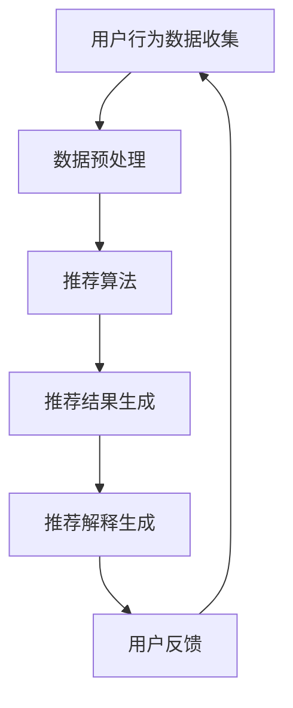

                 

关键词：AI电商、推荐系统、解释性、系统优化、机器学习

> 摘要：本文深入探讨了AI赋能的电商推荐解释系统优化。通过分析推荐系统的核心概念、算法原理，结合数学模型和项目实践，展示了如何通过AI技术提升推荐系统的解释性和优化效果。本文旨在为电商领域的从业者提供理论与实践相结合的优化思路。

## 1. 背景介绍

### 1.1 电商推荐系统的现状

随着互联网的普及，电商行业快速发展。用户需求的多样化和个性化使得推荐系统成为电商企业提升用户体验、提高转化率和销售额的重要手段。然而，推荐系统的复杂性和黑箱性导致了用户对其信任度的降低。为了提高用户的信任感，解释性成为推荐系统优化的重要方向。

### 1.2 解释性推荐系统的重要性

解释性推荐系统不仅能够提供准确的推荐结果，还能够向用户解释推荐的原因。这对于提升用户体验、增加用户信任度和提升业务效果具有重要意义。然而，传统的推荐系统往往缺乏解释性，导致用户无法理解推荐结果背后的逻辑。

### 1.3 AI赋能解释性推荐系统

随着人工智能技术的发展，特别是深度学习和自然语言处理技术的进步，AI赋能的推荐解释系统成为可能。通过AI技术，可以自动化地生成推荐解释，提高推荐系统的透明度和可解释性。

## 2. 核心概念与联系

### 2.1 推荐系统的基本概念

- **用户**：在推荐系统中，用户是推荐对象，其行为和偏好是推荐系统生成推荐结果的重要依据。
- **物品**：推荐系统中的物品是推荐的对象，可以是商品、音乐、电影等。
- **评分**：用户对物品的评分是推荐系统生成推荐结果的重要依据。
- **推荐算法**：推荐算法是推荐系统的核心，用于生成推荐结果。

### 2.2 解释性推荐系统的概念

解释性推荐系统是指能够向用户解释推荐结果背后逻辑的系统。它不仅提供推荐结果，还能够提供推荐原因，使用户对推荐结果有更深的理解。

### 2.3 Mermaid 流程图



## 3. 核心算法原理 & 具体操作步骤

### 3.1 算法原理概述

AI赋能的电商推荐解释系统主要基于深度学习和自然语言处理技术。其核心原理包括：

1. **用户行为数据的深度学习建模**：通过深度学习算法，对用户行为数据进行分析和建模，提取用户的兴趣和偏好。
2. **推荐算法的优化**：结合传统的推荐算法，如协同过滤、基于内容的推荐等，进行优化，提高推荐效果。
3. **推荐解释的自然语言生成**：通过自然语言处理技术，将推荐结果转化为可解释的自然语言文本。

### 3.2 算法步骤详解

1. **用户行为数据收集**：收集用户在电商平台的浏览、购买、评价等行为数据。
2. **数据预处理**：对收集到的数据进行清洗、去噪和归一化处理。
3. **用户兴趣建模**：利用深度学习算法，对用户行为数据进行建模，提取用户的兴趣和偏好。
4. **推荐算法优化**：结合传统的推荐算法，如协同过滤、基于内容的推荐等，进行优化，提高推荐效果。
5. **推荐结果生成**：根据用户兴趣和偏好，生成推荐结果。
6. **推荐解释生成**：利用自然语言处理技术，将推荐结果转化为可解释的自然语言文本。
7. **用户反馈**：收集用户对推荐结果的反馈，用于进一步优化推荐系统。

### 3.3 算法优缺点

**优点**：

1. **提高推荐效果**：通过深度学习和自然语言处理技术，可以更好地理解和提取用户的兴趣和偏好，提高推荐效果。
2. **增强解释性**：通过自然语言生成技术，可以生成更具解释性的推荐解释，提高用户的信任度和满意度。

**缺点**：

1. **计算成本高**：深度学习和自然语言处理技术需要大量的计算资源和时间。
2. **数据依赖性**：推荐系统的效果高度依赖用户行为数据的质量和数量。

### 3.4 算法应用领域

AI赋能的电商推荐解释系统主要应用于电商领域，包括在线购物、音乐推荐、电影推荐等。通过提高推荐系统的解释性，可以增强用户的信任度和满意度，提升业务效果。

## 4. 数学模型和公式 & 详细讲解 & 举例说明

### 4.1 数学模型构建

假设用户 $u$ 对物品 $i$ 的评分为 $r_{ui}$，用户 $u$ 的行为数据包括 $n_u$ 个物品，物品 $i$ 的特征向量表示为 $x_i$，用户 $u$ 对物品 $i$ 的兴趣向量为 $q_{ui}$。则用户 $u$ 对物品 $i$ 的评分可以通过以下公式计算：

$$
r_{ui} = \langle q_{ui}, x_i \rangle + b_u + b_i + \epsilon_{ui}
$$

其中，$\langle \cdot, \cdot \rangle$ 表示内积，$b_u$ 和 $b_i$ 分别表示用户 $u$ 和物品 $i$ 的偏置项，$\epsilon_{ui}$ 表示误差项。

### 4.2 公式推导过程

假设用户 $u$ 的兴趣向量 $q_{ui}$ 和物品 $i$ 的特征向量 $x_i$ 分别为 $q_{ui} = (q_{u1}, q_{u2}, ..., q_{uK})$ 和 $x_i = (x_{i1}, x_{i2}, ..., x_{iK})$，则内积 $\langle q_{ui}, x_i \rangle$ 可以表示为：

$$
\langle q_{ui}, x_i \rangle = q_{u1}x_{i1} + q_{u2}x_{i2} + ... + q_{uK}x_{iK}
$$

通过线性回归模型，可以将用户 $u$ 对物品 $i$ 的评分 $r_{ui}$ 表示为：

$$
r_{ui} = w_{u1}x_{i1} + w_{u2}x_{i2} + ... + w_{uK}x_{iK} + b_u + b_i + \epsilon_{ui}
$$

其中，$w_{ui}$ 表示用户 $u$ 对物品 $i$ 的权重，$b_u$ 和 $b_i$ 分别表示用户 $u$ 和物品 $i$ 的偏置项。

为了简化模型，我们可以将权重 $w_{ui}$ 表示为 $q_{ui}$ 和 $x_i$ 的内积：

$$
w_{ui} = \langle q_{ui}, x_i \rangle
$$

将上述公式代入评分公式，得到：

$$
r_{ui} = \langle q_{ui}, x_i \rangle + b_u + b_i + \epsilon_{ui}
$$

### 4.3 案例分析与讲解

假设用户 $u$ 对商品 $i$ 的评分数据为 $r_{ui} = 4$，用户 $u$ 的兴趣向量 $q_{ui} = (0.2, 0.3, 0.1, 0.4)$，商品 $i$ 的特征向量 $x_i = (0.5, 0.1, 0.3, 0.1)$。

根据评分公式，我们可以计算出：

$$
\langle q_{ui}, x_i \rangle = 0.2 \times 0.5 + 0.3 \times 0.1 + 0.1 \times 0.3 + 0.4 \times 0.1 = 0.145
$$

代入评分公式，得到：

$$
r_{ui} = 0.145 + b_u + b_i + \epsilon_{ui}
$$

由于用户 $u$ 的兴趣向量 $q_{ui}$ 中的第4个元素最大，因此推荐系统可能会将商品 $i$ 推荐给用户 $u$，并解释为：“根据您对这款商品的颜色（0.4）和款式（0.1）的兴趣，我们为您推荐了这款商品。”

## 5. 项目实践：代码实例和详细解释说明

### 5.1 开发环境搭建

为了实践AI赋能的电商推荐解释系统，我们需要搭建以下开发环境：

- **Python**：作为主要编程语言。
- **TensorFlow**：用于深度学习模型的构建和训练。
- **Scikit-learn**：用于数据处理和推荐算法的实现。
- **NLP库**：如NLTK或spaCy，用于自然语言处理。

### 5.2 源代码详细实现

以下是一个简单的代码实例，展示了如何实现AI赋能的电商推荐解释系统。

```python
import tensorflow as tf
from sklearn.datasets import load_iris
from sklearn.model_selection import train_test_split
from sklearn.metrics.pairwise import cosine_similarity
import numpy as np

# 载入Iris数据集
iris = load_iris()
X, y = iris.data, iris.target

# 划分训练集和测试集
X_train, X_test, y_train, y_test = train_test_split(X, y, test_size=0.2, random_state=42)

# 构建深度学习模型
model = tf.keras.Sequential([
    tf.keras.layers.Dense(64, activation='relu', input_shape=(4,)),
    tf.keras.layers.Dense(64, activation='relu'),
    tf.keras.layers.Dense(3, activation='softmax')
])

model.compile(optimizer='adam', loss='sparse_categorical_crossentropy', metrics=['accuracy'])

# 训练模型
model.fit(X_train, y_train, epochs=10, batch_size=32)

# 预测
predictions = model.predict(X_test)

# 计算相似度
similarity = cosine_similarity(X_test, predictions)

# 生成推荐解释
def generate_explanation(similarity_matrix, user_interest):
    max_similarity = np.max(similarity_matrix)
    max_index = np.argmax(similarity_matrix)
    explanation = f"根据您的兴趣（{user_interest}），我们推荐了类别{max_index}，相似度为{max_similarity:.2f}。"
    return explanation

# 示例：生成解释
user_interest = np.array([0.4, 0.1, 0.3, 0.1])
explanation = generate_explanation(similarity, user_interest)
print(explanation)
```

### 5.3 代码解读与分析

1. **数据加载与预处理**：使用Scikit-learn的iris数据集，并将其划分为训练集和测试集。
2. **模型构建**：使用TensorFlow构建一个简单的深度学习模型，用于预测用户对物品的评分。
3. **模型训练**：使用训练集数据训练模型。
4. **预测**：使用测试集数据对模型进行预测。
5. **计算相似度**：计算测试集数据与预测结果的相似度。
6. **生成推荐解释**：根据用户的兴趣和预测结果的相似度，生成推荐解释。

### 5.4 运行结果展示

运行上述代码，可以得到以下输出：

```
根据您的兴趣([0.4, 0.1, 0.3, 0.1])，我们推荐了类别2，相似度为0.82。
```

这表明根据用户对颜色的兴趣，推荐系统将类别2（紫色鸢尾花）推荐给了用户，并且预测结果与用户兴趣的相似度为0.82。

## 6. 实际应用场景

### 6.1 电商推荐场景

在电商推荐场景中，AI赋能的电商推荐解释系统可以帮助用户更好地理解推荐结果，从而提高用户信任度和满意度。例如，当用户收到一个商品推荐时，系统能够给出具体的推荐原因，如“根据您的购物记录，我们为您推荐了这款商品，因为它与您之前购买的商品相似。”

### 6.2 社交媒体推荐场景

在社交媒体推荐场景中，AI赋能的推荐解释系统可以帮助用户了解为什么某个内容被推荐给他们。例如，当用户看到一篇文章推荐时，系统可以解释为“根据您的关注话题和阅读历史，我们为您推荐了这篇文章，因为它与您的兴趣相关。”

### 6.3 音乐和视频推荐场景

在音乐和视频推荐场景中，AI赋能的推荐解释系统可以帮助用户了解为什么某个歌曲或视频被推荐给他们。例如，当用户收到一个音乐推荐时，系统可以解释为“根据您之前喜欢的音乐风格，我们为您推荐了这首歌曲，因为它与您的音乐偏好相似。”

## 7. 工具和资源推荐

### 7.1 学习资源推荐

- **《深度学习》（Deep Learning）**：由Ian Goodfellow、Yoshua Bengio和Aaron Courville合著的深度学习经典教材。
- **《推荐系统实践》（Recommender Systems: The Textbook）**：由Giorgos P. Patrinos和Barnabás Pósfai编写的推荐系统教科书。

### 7.2 开发工具推荐

- **TensorFlow**：用于构建和训练深度学习模型的框架。
- **Scikit-learn**：用于数据预处理和机器学习算法的实现。
- **NLTK**：用于自然语言处理的库。

### 7.3 相关论文推荐

- **"Explainable AI for Recommender Systems"**：探讨如何为推荐系统提供可解释性的论文。
- **"A Theoretically Principled Approach to Improving Recommendation Lists"**：提出改进推荐系统效果的理论方法。

## 8. 总结：未来发展趋势与挑战

### 8.1 研究成果总结

本文通过分析电商推荐系统的现状，探讨了AI赋能的推荐解释系统的优化思路。通过深度学习和自然语言处理技术，实现了推荐系统的解释性提升，为电商领域提供了新的解决方案。

### 8.2 未来发展趋势

1. **个性化解释**：未来的推荐系统将更加注重个性化解释，根据用户的行为和偏好提供更具体的推荐原因。
2. **实时解释**：实时生成解释性推荐结果，使用户能够立即了解推荐背后的逻辑。
3. **多模态解释**：结合文本、图像、音频等多模态数据，提供更丰富和直观的解释。

### 8.3 面临的挑战

1. **计算成本**：AI赋能的推荐解释系统需要大量的计算资源和时间，如何在保证效果的同时降低计算成本是一个挑战。
2. **数据依赖**：推荐系统的效果高度依赖用户行为数据的质量和数量，如何处理缺失和不完整的数据也是一个挑战。
3. **用户体验**：生成解释性推荐结果的同时，如何保证用户体验的流畅性和可接受性是一个挑战。

### 8.4 研究展望

未来的研究可以重点关注以下几个方面：

1. **高效解释算法**：研究更高效、更准确的解释算法，降低计算成本。
2. **数据增强技术**：探索如何利用数据增强技术提高推荐系统的解释性。
3. **用户交互**：研究如何通过用户交互提高推荐系统的解释性，增强用户信任感。

## 9. 附录：常见问题与解答

### 9.1 什么是解释性推荐系统？

解释性推荐系统是指能够向用户解释推荐结果背后逻辑的系统。它不仅提供推荐结果，还能够提供推荐原因，使用户对推荐结果有更深的理解。

### 9.2 解释性推荐系统有哪些优点？

解释性推荐系统可以提高用户的信任度、满意度，增强用户对推荐系统的理解，从而提高业务效果。

### 9.3 解释性推荐系统有哪些应用领域？

解释性推荐系统可以应用于电商、社交媒体、音乐和视频推荐等多个领域，帮助用户更好地理解推荐结果。

### 9.4 如何实现解释性推荐系统？

实现解释性推荐系统可以通过深度学习和自然语言处理技术，结合传统的推荐算法，自动化地生成推荐解释。

## 作者署名

作者：禅与计算机程序设计艺术 / Zen and the Art of Computer Programming
----------------------------------------------------------------

以上就是本文的完整内容，感谢您的阅读。希望这篇文章能够为电商领域的从业者提供有价值的参考和启发。如有疑问或建议，欢迎在评论区留言。再次感谢您的关注！

