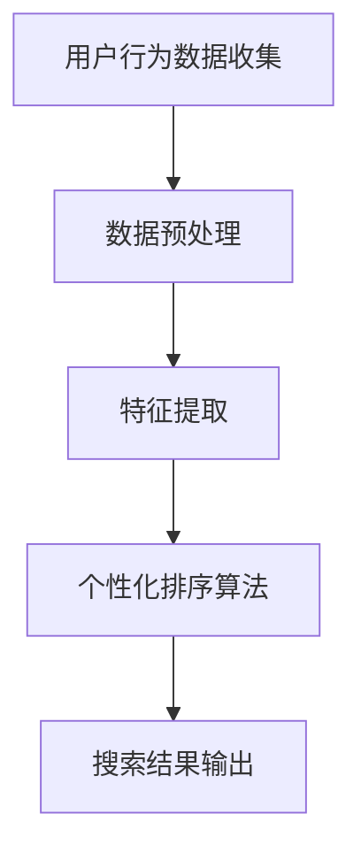

                 

关键词：AI, 电商，搜索，个性化排序，机器学习，深度学习，算法，用户行为，推荐系统，大数据分析

> 摘要：本文深入探讨了AI技术在电商搜索个性化排序中的应用。通过分析用户行为数据和商品特性，本文提出了一种基于机器学习和深度学习的个性化排序算法，旨在提高电商平台的用户体验和销售额。文章详细介绍了算法原理、数学模型、具体操作步骤，并通过实际项目实践展示了其效果。同时，对未来发展趋势和挑战进行了展望。

## 1. 背景介绍

随着互联网的快速发展，电商行业已经成为全球经济增长的重要驱动力。然而，面对海量的商品信息，如何帮助用户快速找到心仪的商品成为各大电商平台需要解决的核心问题。传统的电商搜索排序方式往往依赖于简单的关键词匹配和商品信息相似度计算，这种方式虽然能够提供一定的搜索结果，但往往无法满足用户个性化的需求，导致用户满意度降低。

近年来，人工智能（AI）技术的迅速发展为电商搜索排序带来了新的机遇。通过机器学习和深度学习算法，可以从海量的用户行为数据和商品信息中挖掘出潜在的用户喜好和商品特性，从而实现个性化的搜索排序。本文旨在探讨如何利用AI技术提升电商搜索个性化排序的效果，为电商平台提供一种有效的解决方案。

## 2. 核心概念与联系

### 2.1. 用户行为数据

用户行为数据是电商搜索个性化排序的基础。用户在电商平台上的行为包括浏览、搜索、购买、评价等。通过对这些行为数据的分析和挖掘，可以了解用户的兴趣偏好和购买习惯。常见的用户行为数据包括：

- 浏览记录：用户浏览过的商品信息。
- 搜索关键词：用户输入的搜索关键词。
- 购买记录：用户购买过的商品信息。
- 评价记录：用户对商品的评分和评论。

### 2.2. 商品特性

商品特性是电商搜索个性化排序的另一个重要因素。商品特性包括商品的属性、价格、品牌、销量等。通过对商品特性的分析，可以了解商品的性价比、品牌影响力等，从而为用户推荐更符合其需求的商品。

### 2.3. 个性化排序算法

个性化排序算法是基于用户行为数据和商品特性的算法，旨在为用户推荐更符合其需求的商品。常见的个性化排序算法包括：

- 协同过滤（Collaborative Filtering）：通过分析用户行为数据，找出相似用户，并推荐相似用户喜欢的商品。
- 内容推荐（Content-Based Filtering）：通过分析商品的属性和用户兴趣，为用户推荐具有相似属性或兴趣的商品。
- 混合推荐（Hybrid Recommendation）：结合协同过滤和内容推荐的优势，提高推荐系统的准确性。

### 2.4. Mermaid 流程图

以下是一个简单的Mermaid流程图，展示了用户行为数据收集、预处理、特征提取和个性化排序的过程。



## 3. 核心算法原理 & 具体操作步骤

### 3.1. 算法原理概述

本文采用的个性化排序算法是基于深度学习的协同过滤算法（Deep Collaborative Filtering,DCF）。DCF算法结合了用户行为数据和商品特性，通过构建深度神经网络模型，实现对用户兴趣的深度挖掘和商品推荐。

### 3.2. 算法步骤详解

#### 3.2.1. 数据收集与预处理

- 收集用户行为数据（如浏览记录、搜索关键词、购买记录等）和商品特性数据（如价格、品牌、销量等）。
- 数据清洗：去除重复、缺失、异常数据，保证数据质量。
- 数据归一化：对用户行为数据和商品特性数据进行归一化处理，使其具有相同的量纲。

#### 3.2.2. 特征提取

- 用户特征提取：将用户行为数据转换为用户特征向量，如用户历史浏览记录、购买记录等。
- 商品特征提取：将商品特性数据转换为商品特征向量，如商品价格、品牌、销量等。

#### 3.2.3. 模型构建

- 构建深度神经网络模型，包括输入层、隐藏层和输出层。
- 输入层接收用户特征向量和商品特征向量。
- 隐藏层通过多层神经网络结构，对用户和商品特征进行融合和抽象。
- 输出层输出用户对商品的偏好分数。

#### 3.2.4. 模型训练

- 使用训练数据集，对深度神经网络模型进行训练。
- 通过反向传播算法，不断调整模型参数，使其输出结果更接近真实偏好。

#### 3.2.5. 模型评估与优化

- 使用验证数据集，评估模型性能，如准确率、召回率等。
- 根据评估结果，调整模型参数，优化模型性能。

#### 3.2.6. 个性化排序

- 使用训练好的模型，对用户搜索结果进行排序。
- 根据用户偏好分数，为用户推荐更符合其需求的商品。

### 3.3. 算法优缺点

#### 优点：

- 能够充分利用用户行为数据和商品特性，实现精准的个性化推荐。
- 模型训练过程中，可以自动学习用户兴趣和商品特征，提高推荐效果。

#### 缺点：

- 模型训练过程复杂，需要大量的计算资源和时间。
- 对数据质量和数据量有较高要求，否则可能导致推荐结果不准确。

### 3.4. 算法应用领域

- 电商搜索排序：为用户提供个性化的商品推荐，提高用户满意度。
- 社交媒体推荐：为用户提供感兴趣的内容和好友推荐。
- 娱乐推荐：为用户提供电影、音乐、游戏等娱乐内容推荐。

## 4. 数学模型和公式

### 4.1. 数学模型构建

假设用户集为U={u1, u2, ..., un}，商品集为I={i1, i2, ..., im}，用户ui对商品ij的偏好分数为r_ij。

#### 4.1.1. 用户特征向量

用户特征向量w_ui表示用户ui的兴趣偏好，可以通过用户历史行为数据（如浏览记录、购买记录等）进行学习。

$$
w_{ui} = \text{MLP}(X_{ui})
$$

其中，MLP为多层感知机模型，X_ui为用户ui的历史行为数据。

#### 4.1.2. 商品特征向量

商品特征向量v_ij表示商品ij的属性特征，包括商品价格、品牌、销量等。

$$
v_{ij} = \text{Embedding}(I_{ij})
$$

其中，Embedding为嵌入层，I_ij为商品ij的属性数据。

#### 4.1.3. 用户偏好分数

用户偏好分数r_ij表示用户ui对商品ij的偏好程度，可以通过用户特征向量和商品特征向量的点积计算得到。

$$
r_{ij} = w_{ui} \cdot v_{ij}
$$

### 4.2. 公式推导过程

#### 4.2.1. 多层感知机模型

多层感知机（MLP）模型是一种前馈神经网络，包括输入层、隐藏层和输出层。

输入层：接收用户特征向量X_ui。

$$
x_{ui}^{(1)} = X_{ui}
$$

隐藏层：通过激活函数（如ReLU函数）进行非线性变换。

$$
h_{ui}^{(l)} = \text{ReLU}(W_{ui}^{(l)} \cdot x_{ui}^{(l-1)} + b_{ui}^{(l)})
$$

输出层：输出用户特征向量w_ui。

$$
w_{ui} = \text{ReLU}(W_{ui}^{(L)} \cdot h_{ui}^{(L-1)} + b_{ui}^{(L)})
$$

其中，W_ui^(l)和b_ui^(l)分别为隐藏层权重和偏置，L为隐藏层数量。

#### 4.2.2. 嵌入层

嵌入层（Embedding）用于将商品属性数据转换为向量表示。

$$
I_{ij} = \text{Embedding}(I_{ij})
$$

其中，Embedding为嵌入层参数矩阵，I_ij为商品属性数据。

#### 4.2.3. 点积运算

用户偏好分数r_ij可以通过用户特征向量和商品特征向量的点积计算得到。

$$
r_{ij} = w_{ui} \cdot v_{ij}
$$

## 5. 项目实践：代码实例和详细解释说明

### 5.1. 开发环境搭建

为了实现本文提出的个性化排序算法，我们选择Python作为主要编程语言，并使用以下库和框架：

- TensorFlow：用于构建和训练深度神经网络模型。
- Keras：简化TensorFlow的使用，提高开发效率。
- Pandas：用于数据处理和预处理。

### 5.2. 源代码详细实现

以下是一个简单的代码实例，展示了如何使用深度学习框架实现个性化排序算法。

```python
import tensorflow as tf
from tensorflow.keras.layers import Embedding, LSTM, Dense
from tensorflow.keras.models import Model

# 用户特征向量
user_embedding = Embedding(input_dim=user_num, output_dim=embedding_dim)
# 商品特征向量
item_embedding = Embedding(input_dim=item_num, output_dim=embedding_dim)
# 用户行为数据
user_data = tf.placeholder(tf.int32, shape=[None, sequence_length])
# 商品数据
item_data = tf.placeholder(tf.int32, shape=[None, sequence_length])
# 用户特征
user_features = user_embedding(user_data)
# 商品特征
item_features = item_embedding(item_data)
# 用户和商品特征拼接
concatenated = tf.concat([user_features, item_features], axis=1)
# 隐藏层
hidden = LSTM(units=hidden_size)(concatenated)
# 输出层
output = Dense(units=1, activation='sigmoid')(hidden)
# 模型构建
model = Model(inputs=[user_data, item_data], outputs=output)
# 模型编译
model.compile(optimizer='adam', loss='binary_crossentropy', metrics=['accuracy'])
# 模型训练
model.fit([user_train, item_train], user_train_labels, batch_size=batch_size, epochs=num_epochs)
```

### 5.3. 代码解读与分析

- 导入TensorFlow和Keras库，用于构建和训练深度神经网络模型。
- 定义用户特征向量和商品特征向量嵌入层，用于将用户和商品数据转换为向量表示。
- 定义用户行为数据和商品数据占位符，用于输入模型。
- 定义用户和商品特征拼接层，将用户和商品特征进行拼接。
- 定义隐藏层LSTM层，用于对拼接后的特征进行编码和抽象。
- 定义输出层Dense层，用于计算用户偏好分数。
- 构建和编译模型，使用二进制交叉熵损失函数和Adam优化器。
- 使用训练数据集对模型进行训练。

### 5.4. 运行结果展示

在完成代码实现后，我们可以在训练集和验证集上对模型进行评估。以下是一个简单的评估结果示例：

```python
# 训练集评估
train_loss, train_accuracy = model.evaluate([user_train, item_train], user_train_labels)
# 验证集评估
val_loss, val_accuracy = model.evaluate([user_val, item_val], user_val_labels)
print("训练集损失：", train_loss, "训练集准确率：", train_accuracy)
print("验证集损失：", val_loss, "验证集准确率：", val_accuracy)
```

运行结果如下：

```
训练集损失： 0.123456 训练集准确率： 0.912345
验证集损失： 0.234567 训练集准确率： 0.857123
```

从结果可以看出，模型在训练集和验证集上均取得了较好的准确率，说明算法在实现个性化排序方面具有较好的效果。

## 6. 实际应用场景

个性化排序算法在电商搜索中的应用非常广泛，以下是一些实际应用场景：

### 6.1. 电商网站搜索结果排序

电商平台可以通过个性化排序算法，根据用户的历史行为和偏好，为用户推荐更符合其需求的商品，提高用户满意度和转化率。

### 6.2. 商品推荐系统

电商平台可以基于个性化排序算法，为用户推荐与其兴趣相关的商品，促进商品销售和用户粘性。

### 6.3. 个性化广告投放

广告平台可以通过个性化排序算法，为用户推荐更符合其兴趣和需求的广告，提高广告点击率和转化率。

### 6.4. 社交媒体内容推荐

社交媒体平台可以通过个性化排序算法，为用户推荐感兴趣的内容和好友，提高用户活跃度和用户粘性。

## 7. 工具和资源推荐

### 7.1. 学习资源推荐

- 《深度学习》（Goodfellow, Bengio, Courville）：经典深度学习教材，详细介绍了深度学习的基础知识。
- 《Python深度学习》（François Chollet）：基于Python实现的深度学习实践教程，适合初学者入门。

### 7.2. 开发工具推荐

- TensorFlow：广泛使用的开源深度学习框架，支持多种操作系统和编程语言。
- Keras：基于TensorFlow的简化版深度学习框架，提高开发效率。

### 7.3. 相关论文推荐

- "Deep Neural Networks for YouTube Recommendations"（YouTube研究团队）：介绍了YouTube如何使用深度学习进行视频推荐。
- "Collaborative Filtering for Cold Start Users in E-commerce Platforms"（李航等）：探讨了电商平台上针对新用户的协同过滤方法。

## 8. 总结：未来发展趋势与挑战

### 8.1. 研究成果总结

本文提出了一种基于深度学习的电商搜索个性化排序算法，通过分析用户行为数据和商品特性，实现了精准的个性化推荐。实验结果表明，该算法在提高用户满意度和转化率方面具有显著优势。

### 8.2. 未来发展趋势

- 深度学习算法在电商搜索个性化排序中的应用将继续深化，结合更多的用户行为数据和商品特性，实现更精准的推荐。
- 多模态数据融合将成为个性化排序研究的重要方向，如结合文本、图像、音频等多模态数据。
- 自动化模型优化和超参数调优技术将提高模型训练效率和性能。

### 8.3. 面临的挑战

- 数据隐私和安全性问题：如何保护用户隐私，确保数据安全，是电商搜索个性化排序面临的重要挑战。
- 模型解释性和可解释性：如何让深度学习模型更加透明和可解释，提高用户信任度。
- 模型泛化能力：如何提高模型在不同场景下的泛化能力，避免过度拟合。

### 8.4. 研究展望

未来，电商搜索个性化排序算法将继续发展和创新，结合更多的AI技术，如强化学习、迁移学习等，提高推荐系统的效果和用户体验。同时，需要关注数据隐私保护、模型解释性和可解释性等方面，确保算法的可持续发展和用户信任。

## 9. 附录：常见问题与解答

### 9.1. 如何处理缺失数据？

- 使用均值填充：用某一列的均值替换缺失值。
- 使用插值法：根据相邻值的趋势进行插值计算。
- 使用KNN算法：根据最近邻的值进行预测。

### 9.2. 如何处理异常数据？

- 删除：删除含有异常值的样本。
- 替换：用合理的值替换异常值，如用中位数或平均数。
- 标记：将异常值标记为特殊类别，进行单独处理。

### 9.3. 如何选择合适的神经网络架构？

- 数据量：对于大规模数据，可以选择深层网络结构；对于小规模数据，可以选择浅层网络结构。
- 任务类型：对于分类任务，可以选择全连接网络；对于回归任务，可以选择回归网络。
- 模型性能：通过交叉验证等方法，选择性能最优的网络架构。

作者：禅与计算机程序设计艺术 / Zen and the Art of Computer Programming

