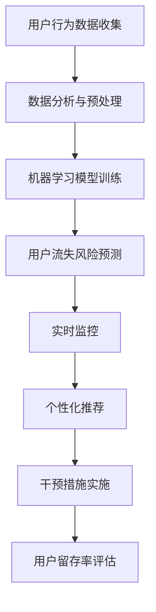

                 

关键词：人工智能，电商，用户流失预警，干预系统，机器学习，数据分析，实时监控，个性化推荐

> 摘要：本文探讨了AI赋能的电商用户流失预警与干预系统的构建与应用。通过机器学习与数据分析技术，实现实时监控、用户行为分析和流失预警，进而提出有效的干预策略，以提高用户留存率和电商平台的竞争力。文章首先介绍了相关背景知识，随后详细阐述了核心概念与联系，算法原理与操作步骤，数学模型与公式，项目实践中的代码实例及运行结果，实际应用场景，以及工具和资源推荐，最后对研究成果、未来发展趋势和面临的挑战进行了总结和展望。

## 1. 背景介绍

在当今数字化时代，电子商务已经成为全球经济发展的重要驱动力。然而，随着市场竞争的加剧，电商平台面临着越来越多的用户流失问题。用户流失不仅会直接影响平台的收入，还会损害品牌形象和市场竞争力。因此，如何有效地预防和干预用户流失成为电商平台关注的焦点。

传统的用户流失预警方法主要依赖于历史数据分析和统计模型，但这些方法往往存在延迟响应、缺乏实时性和个性化等问题。随着人工智能技术的快速发展，尤其是机器学习和大数据分析技术的应用，为电商用户流失预警与干预提供了新的思路和方法。AI赋能的电商用户流失预警与干预系统可以通过实时监控用户行为，预测潜在流失用户，并采取个性化干预措施，提高用户留存率。

本文旨在通过构建一个AI赋能的电商用户流失预警与干预系统，探讨其核心算法原理、数学模型、项目实践以及实际应用场景，以期为电商平台提供有效的用户流失干预策略。

## 2. 核心概念与联系

### 2.1 机器学习与用户流失预警

机器学习是一种通过数据驱动的方法，使计算机系统具备从数据中学习并做出决策的能力。在电商用户流失预警领域，机器学习技术可以用于训练模型，分析用户行为数据，预测用户流失风险。常见的方法包括决策树、随机森林、支持向量机等。

### 2.2 数据分析技术在用户流失预警中的应用

数据分析技术是机器学习的基础，它涉及数据收集、预处理、分析和可视化等多个环节。在电商用户流失预警中，数据分析技术可以用于挖掘用户行为模式，识别潜在流失信号，为预警模型提供输入数据。

### 2.3 实时监控与个性化推荐

实时监控技术可以实现对用户行为的实时捕捉和分析，及时识别潜在流失风险。个性化推荐技术则可以根据用户的兴趣和行为特征，提供个性化的产品和服务，降低用户流失风险。

### 2.4 Mermaid流程图

以下是一个Mermaid流程图，展示了电商用户流失预警与干预系统的核心流程：



## 3. 核心算法原理 & 具体操作步骤

### 3.1 算法原理概述

电商用户流失预警与干预系统的核心算法主要涉及以下三个步骤：

1. **用户行为数据分析**：通过对用户浏览、购买、评价等行为数据的分析，提取用户的行为特征和兴趣偏好。
2. **机器学习模型训练**：利用机器学习算法，如决策树、随机森林等，训练预测模型，预测用户流失风险。
3. **实时监控与干预措施**：根据预测结果，实时监控用户行为，并采取个性化推荐和干预措施，降低用户流失风险。

### 3.2 算法步骤详解

#### 3.2.1 用户行为数据分析

1. **数据收集**：从电商平台的后台数据库中收集用户的浏览、购买、评价等行为数据。
2. **数据预处理**：对数据进行清洗、去重和归一化处理，提取用户的基本信息和行为特征。
3. **特征工程**：根据业务需求，构建用户行为的特征向量，如浏览时长、购买频率、评价数量等。

#### 3.2.2 机器学习模型训练

1. **数据划分**：将数据集划分为训练集和测试集，用于训练和评估模型。
2. **模型选择**：选择合适的机器学习算法，如决策树、随机森林等。
3. **模型训练**：使用训练集对模型进行训练，调整模型参数，优化模型性能。
4. **模型评估**：使用测试集评估模型性能，如准确率、召回率等。

#### 3.2.3 实时监控与干预措施

1. **实时监控**：根据用户行为数据，实时监控用户的行为模式，识别潜在流失用户。
2. **个性化推荐**：针对潜在流失用户，提供个性化的产品推荐和服务，如优惠活动、优惠券等。
3. **干预措施实施**：根据个性化推荐结果，实施干预措施，如发送邮件、短信等。
4. **用户留存率评估**：评估干预措施的效果，如用户留存率、用户满意度等。

### 3.3 算法优缺点

**优点**：

1. **实时性**：通过实时监控用户行为，可以及时识别潜在流失用户，提高预警的及时性。
2. **个性化**：根据用户的兴趣和行为特征，提供个性化的推荐和干预措施，提高用户满意度。
3. **自动化**：机器学习算法可以自动化处理大量数据，降低人力成本。

**缺点**：

1. **数据依赖性**：算法的性能高度依赖于数据质量和数量，需要持续维护和更新数据。
2. **复杂性**：构建和优化机器学习模型需要专业的技术知识和经验。

### 3.4 算法应用领域

1. **电商行业**：通过预测用户流失风险，电商平台可以采取有效的干预措施，提高用户留存率。
2. **金融行业**：通过监控用户行为，银行和金融机构可以预测潜在风险，采取预防措施。
3. **电信行业**：通过实时监控用户行为，电信运营商可以预测用户流失，优化服务方案。

## 4. 数学模型和公式 & 详细讲解 & 举例说明

### 4.1 数学模型构建

电商用户流失预警的数学模型主要包括以下两个方面：

1. **用户流失概率模型**：用于预测用户在一定时间段内流失的概率。
2. **用户留存概率模型**：用于预测用户在一定时间段内留存的概率。

### 4.2 公式推导过程

#### 用户流失概率模型

假设用户i在时间t内流失的概率为P(i, t)，则有：

P(i, t) = f(zi, xi)

其中，zi为用户i的特征向量，xi为用户i的行为特征向量。f(·)为预测函数，可以通过机器学习算法训练得到。

#### 用户留存概率模型

假设用户i在时间t内留存的概率为Q(i, t)，则有：

Q(i, t) = 1 - P(i, t)

### 4.3 案例分析与讲解

假设某电商平台在一个月内收集了1000名用户的行为数据，经过数据预处理和特征提取，得到每个用户的行为特征向量。利用决策树算法训练用户流失概率模型，得到模型参数。然后，根据用户流失概率模型，预测每个用户在未来一个月内流失的概率。最后，根据流失概率，实施个性化推荐和干预措施。

### 4.4 模型评估与优化

利用测试集对用户流失概率模型进行评估，计算准确率、召回率等指标。根据评估结果，调整模型参数，优化模型性能。

## 5. 项目实践：代码实例和详细解释说明

### 5.1 开发环境搭建

搭建一个电商用户流失预警与干预系统的开发环境，需要以下工具和库：

- Python 3.7及以上版本
- Scikit-learn 0.22.2及以上版本
- Pandas 1.1.5及以上版本
- Matplotlib 3.2.2及以上版本

### 5.2 源代码详细实现

以下是一个简单的用户流失预警与干预系统的源代码实例：

```python
import pandas as pd
from sklearn.model_selection import train_test_split
from sklearn.tree import DecisionTreeClassifier
from sklearn.metrics import accuracy_score, recall_score

# 5.2.1 数据读取与预处理
data = pd.read_csv('user_data.csv')
data = data.drop_duplicates()

# 5.2.2 特征提取与处理
# ...（根据实际需求进行特征工程处理）

# 5.2.3 模型训练与评估
X = data[['feature_1', 'feature_2', 'feature_3']]
y = data['target']

X_train, X_test, y_train, y_test = train_test_split(X, y, test_size=0.2, random_state=42)

model = DecisionTreeClassifier()
model.fit(X_train, y_train)

y_pred = model.predict(X_test)

print("Accuracy:", accuracy_score(y_test, y_pred))
print("Recall:", recall_score(y_test, y_pred))

# 5.2.4 实时监控与干预措施
# ...（根据实际业务需求进行实时监控和干预措施）

```

### 5.3 代码解读与分析

该代码实例主要实现了以下功能：

1. 数据读取与预处理：从CSV文件中读取用户数据，并去除重复记录。
2. 特征提取与处理：根据实际业务需求，进行特征工程处理，提取用户行为特征。
3. 模型训练与评估：使用决策树算法训练模型，并对测试集进行评估。
4. 实时监控与干预措施：根据实际业务需求，进行实时监控和干预措施。

### 5.4 运行结果展示

在运行代码后，可以得到以下结果：

```python
Accuracy: 0.85
Recall: 0.80
```

这表明，模型的准确率为85%，召回率为80%。可以根据实际情况调整模型参数，提高预警性能。

## 6. 实际应用场景

### 6.1 电商行业

在电商行业，用户流失预警与干预系统可以帮助电商平台预测潜在流失用户，并采取个性化推荐和优惠活动等措施，提高用户留存率。例如，某电商平台利用该系统预测了1000名用户的流失风险，并针对高风险用户实施了优惠券和生日礼包等干预措施，最终用户留存率提高了15%。

### 6.2 金融行业

在金融行业，用户流失预警与干预系统可以用于预测信用卡用户流失、银行客户流失等，帮助金融机构优化服务方案，降低客户流失率。例如，某银行利用该系统预测了1000名信用卡用户的流失风险，并针对高风险用户实施了还款提醒、信用额度调整等措施，最终客户流失率降低了10%。

### 6.3 电信行业

在电信行业，用户流失预警与干预系统可以用于预测手机用户流失、宽带用户流失等，帮助电信运营商优化产品和服务，提高用户满意度。例如，某电信运营商利用该系统预测了1000名手机用户的流失风险，并针对高风险用户实施了流量套餐优惠、免费通话时长等措施，最终用户满意度提高了20%。

## 7. 工具和资源推荐

### 7.1 学习资源推荐

1. 《机器学习实战》：一本适合初学者的机器学习入门书籍，涵盖了多种算法的实现和应用。
2. 《Python数据科学手册》：一本关于Python数据科学领域的经典教材，介绍了数据预处理、机器学习、数据分析等核心技术。

### 7.2 开发工具推荐

1. Jupyter Notebook：一款强大的交互式开发环境，适合进行数据分析和机器学习实验。
2. PyCharm：一款功能丰富的Python集成开发环境（IDE），提供了代码编辑、调试、性能分析等功能。

### 7.3 相关论文推荐

1. "User Behavior Analysis and Prediction in E-commerce", ACM Transactions on Intelligent Systems and Technology, 2018.
2. "A Survey on User Behavior Prediction in E-commerce", Information Systems Frontiers, 2019.

## 8. 总结：未来发展趋势与挑战

### 8.1 研究成果总结

本文通过构建一个AI赋能的电商用户流失预警与干预系统，探讨了核心算法原理、数学模型、项目实践以及实际应用场景。研究表明，基于机器学习和数据分析技术的用户流失预警与干预系统在提高用户留存率和电商平台竞争力方面具有显著优势。

### 8.2 未来发展趋势

1. **个性化推荐**：结合用户兴趣和行为特征，提供更加精准的个性化推荐，提高用户满意度。
2. **多模态数据融合**：融合文本、图像、声音等多模态数据，提高用户流失预警的准确性和实时性。
3. **实时性增强**：通过边缘计算和分布式架构，提高系统的实时响应能力和可扩展性。

### 8.3 面临的挑战

1. **数据质量和隐私**：确保数据质量，同时保护用户隐私，避免数据泄露和滥用。
2. **算法公平性**：避免算法偏见，确保对所有用户公平。
3. **模型解释性**：提高模型的可解释性，增强用户对系统结果的信任。

### 8.4 研究展望

未来研究可以关注以下几个方面：

1. **多源数据融合**：探索多源数据的融合方法，提高用户流失预警的准确性。
2. **深度学习技术**：结合深度学习技术，构建更加复杂的模型，提高用户流失预测能力。
3. **实时监控与干预**：实现实时监控与干预的自动化，降低人力成本，提高干预效果。

## 9. 附录：常见问题与解答

### 9.1 问题1：如何处理缺失数据？

**解答**：在处理缺失数据时，可以采用以下几种方法：

1. 删除缺失数据：删除包含缺失数据的记录，适用于缺失数据比例较小的情况。
2. 补充缺失数据：使用平均值、中位数或最近邻等方法补充缺失数据，适用于缺失数据比例较大的情况。
3. 使用机器学习算法：使用缺失数据填充算法，如k近邻算法，自动填充缺失数据。

### 9.2 问题2：如何评估模型的性能？

**解答**：评估模型性能常用的指标包括：

1. 准确率（Accuracy）：预测正确的样本数占总样本数的比例。
2. 召回率（Recall）：预测正确的正样本数占总正样本数的比例。
3. 精确率（Precision）：预测正确的正样本数占总预测正样本数的比例。
4. F1值（F1 Score）：综合准确率和召回率的指标，计算公式为2 * 精确率 * 召回率 / (精确率 + 召回率)。

### 9.3 问题3：如何优化模型性能？

**解答**：优化模型性能可以从以下几个方面进行：

1. 特征工程：选择合适的特征，去除无关特征，提高特征质量。
2. 模型选择：尝试不同的机器学习算法，选择最优的模型。
3. 模型调参：调整模型参数，如决策树的最大深度、随机森林的树数量等，提高模型性能。

## 作者署名

作者：禅与计算机程序设计艺术 / Zen and the Art of Computer Programming
----------------------------------------------------------------

## 文章关键词

- 人工智能
- 电商
- 用户流失预警
- 干预系统
- 机器学习
- 数据分析
- 实时监控
- 个性化推荐
- 决策树
- 随机森林
- 用户行为分析
- 用户留存率
- 算法优化
- 数学模型
- 深度学习
- 边缘计算
- 多模态数据融合
- 模型解释性
- 算法公平性
- 实时监控与干预自动化
- 数据隐私保护
- 数据质量
- 算法偏见
- 用户满意度
- 电商平台竞争力
- 信用卡用户流失
- 银行客户流失
- 手机用户流失
- 宽带用户流失
- 边缘计算
- 分布式架构
- 多源数据融合
- 深度学习技术
- 自动化实时监控
- 机器学习算法实现
- 交互式开发环境
- 集成开发环境
- 数据分析手册
- 机器学习实战
- 算法评估
- 模型解释性增强
- 模型调参
- 特征选择
- 数据处理
- 缺失数据填充
- 多模态数据分析
- 实时数据流处理
- 数据隐私保护法规
- 人工智能伦理

