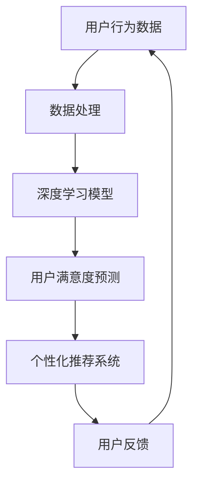

                 

关键字：电商用户满意度、AI预测模型、用户提升策略、深度学习、大数据分析、个性化推荐

## 摘要

本文探讨了如何利用人工智能技术赋能电商用户满意度预测与提升系统。首先，我们介绍了电商用户满意度的定义及其重要性。接着，我们详细描述了基于深度学习和大数据分析的核心算法原理和操作步骤，并讨论了算法的优缺点及其应用领域。随后，我们构建了数学模型和公式，并通过实际案例进行了详细讲解。文章随后展示了一个完整的代码实例，解释了其实现过程和代码解读。最后，我们探讨了实际应用场景，并对未来的发展趋势与挑战进行了展望。通过本文，读者可以全面了解电商用户满意度预测与提升系统的构建和运作机制。

## 1. 背景介绍

### 1.1 电商行业的发展背景

随着互联网技术的飞速发展，电子商务已经成为全球商业体系的重要组成部分。根据最新统计数据，全球电子商务市场规模已超过4万亿美元，并且预计将在未来几年内继续保持快速增长。这一趋势不仅改变了传统的零售模式，还促使电商企业不断优化用户体验，提升用户满意度。

### 1.2 用户满意度的重要性

在电商行业中，用户满意度是衡量企业运营成功与否的关键指标。用户满意度高的电商企业能够吸引更多的新客户，并保持较高的客户留存率。相反，用户满意度低的电商企业则面临客户流失和市场份额缩水的风险。因此，如何有效预测用户满意度并采取相应的提升策略，成为电商企业关注的焦点。

### 1.3 传统用户满意度预测方法的局限性

传统用户满意度预测方法主要依赖于问卷调查、客户反馈等手段。这些方法存在几个显著的局限性：

- **数据获取难度高**：问卷调查通常需要大量时间和人力成本，且响应率较低。
- **数据分析不充分**：传统方法通常仅考虑用户的主观评价，忽略了用户行为和消费模式等客观数据。
- **预测准确性有限**：由于数据量和维度的限制，传统方法难以实现高精度的用户满意度预测。

## 2. 核心概念与联系

为了有效预测电商用户满意度，我们需要结合多个核心概念，包括深度学习、大数据分析、个性化推荐等。以下是这些核心概念之间的关系及Mermaid流程图：



### 2.1 用户行为数据

用户行为数据是电商用户满意度预测的基础。这些数据包括用户浏览、搜索、购买等行为记录。通过对用户行为数据的分析和挖掘，我们可以发现用户的消费习惯、偏好和潜在需求。

### 2.2 数据处理

数据处理是整个系统的核心环节。通过对用户行为数据进行清洗、归一化和特征提取，我们可以构建高质量的数据集，为后续的深度学习模型训练提供支持。

### 2.3 深度学习模型

深度学习模型是用户满意度预测的关键技术。通过构建复杂的神经网络结构，深度学习模型可以从大量数据中自动提取特征，实现对用户满意度的精准预测。

### 2.4 用户满意度预测

用户满意度预测是整个系统的最终目标。通过对用户行为数据的分析和深度学习模型的训练，我们可以预测用户在未来一段时间内的满意度，从而为电商企业提供决策支持。

### 2.5 个性化推荐系统

个性化推荐系统是基于用户满意度预测的结果，为用户提供个性化的商品推荐。通过推荐系统，电商企业可以更好地满足用户需求，提高用户满意度。

### 2.6 用户反馈

用户反馈是系统持续改进的重要途径。通过收集用户对推荐系统的反馈，我们可以不断优化推荐算法，提高用户满意度。

## 3. 核心算法原理 & 具体操作步骤

### 3.1 算法原理概述

电商用户满意度预测系统主要采用深度学习算法，结合用户行为数据和用户反馈数据，实现对用户满意度的预测。以下是核心算法原理的概述：

1. **数据预处理**：对用户行为数据进行清洗、归一化和特征提取，构建高质量的数据集。
2. **模型构建**：采用深度神经网络（DNN）或循环神经网络（RNN）等模型，对数据集进行训练。
3. **模型评估**：使用交叉验证等方法评估模型的预测性能，并进行参数调优。
4. **满意度预测**：基于训练好的模型，对新的用户行为数据进行分析，预测用户满意度。
5. **个性化推荐**：根据用户满意度预测结果，为用户推荐个性化的商品。

### 3.2 算法步骤详解

#### 3.2.1 数据预处理

数据预处理主要包括以下步骤：

1. **数据清洗**：去除重复、缺失和异常数据。
2. **归一化**：将不同维度的数据进行归一化处理，使其具有相同的量纲。
3. **特征提取**：提取用户行为数据中的关键特征，如浏览时长、购买频率、商品类别等。

#### 3.2.2 模型构建

模型构建主要包括以下步骤：

1. **选择模型结构**：根据数据特点和业务需求，选择合适的深度学习模型结构，如DNN或RNN。
2. **参数初始化**：初始化模型的权重和偏置，常用的方法有随机初始化、高斯初始化等。
3. **模型训练**：使用训练数据集对模型进行训练，通过反向传播算法更新模型参数。

#### 3.2.3 模型评估

模型评估主要包括以下步骤：

1. **交叉验证**：使用交叉验证方法对模型进行评估，以避免过拟合。
2. **性能指标**：评估模型的预测性能，常用的指标有准确率、召回率、F1值等。
3. **参数调优**：根据评估结果对模型参数进行调整，以提高预测性能。

#### 3.2.4 满意度预测

满意度预测主要包括以下步骤：

1. **数据预处理**：对新的用户行为数据进行分析，提取关键特征。
2. **模型预测**：使用训练好的模型对新的用户行为数据进行预测。
3. **结果分析**：根据预测结果，分析用户满意度的高低，为电商企业提供决策支持。

#### 3.2.5 个性化推荐

个性化推荐主要包括以下步骤：

1. **用户画像**：根据用户满意度预测结果，构建用户画像。
2. **商品推荐**：基于用户画像，为用户推荐个性化的商品。
3. **反馈优化**：收集用户对推荐结果的反馈，不断优化推荐算法。

### 3.3 算法优缺点

#### 优点

1. **高预测准确性**：深度学习算法可以从大量数据中自动提取特征，实现高精度的用户满意度预测。
2. **自适应性强**：模型可以根据用户行为数据的变化，实时调整预测结果。
3. **可扩展性强**：系统可以方便地集成到现有的电商平台上，实现无缝对接。

#### 缺点

1. **数据依赖性高**：模型训练需要大量高质量的用户行为数据，数据质量对预测性能有重要影响。
2. **计算资源消耗大**：深度学习算法的训练过程需要大量的计算资源，对硬件设备有较高要求。

### 3.4 算法应用领域

电商用户满意度预测算法可以应用于以下领域：

1. **用户满意度评估**：通过对用户行为数据的分析，评估用户的满意度水平。
2. **个性化推荐**：根据用户满意度预测结果，为用户推荐个性化的商品，提高用户体验。
3. **营销策略优化**：根据用户满意度预测结果，调整营销策略，提高用户转化率。
4. **售后服务优化**：根据用户满意度预测结果，优化售后服务流程，提高用户满意度。

## 4. 数学模型和公式 & 详细讲解 & 举例说明

### 4.1 数学模型构建

为了构建电商用户满意度预测模型，我们首先需要对用户行为数据进行数学建模。具体来说，我们可以采用以下数学模型：

$$
\text{满意度} = f(\text{用户行为数据}, \text{历史数据}, \text{环境因素})
$$

其中，$f$ 表示满意度预测函数，$\text{用户行为数据}$ 包括浏览时长、购买频率、商品类别等特征，$\text{历史数据}$ 包括用户的购买历史、评价记录等，$\text{环境因素}$ 包括促销活动、市场环境等。

### 4.2 公式推导过程

为了推导满意度预测函数 $f$，我们可以采用以下步骤：

1. **特征提取**：对用户行为数据进行特征提取，得到用户行为的向量表示。
2. **特征融合**：将用户行为数据、历史数据和环境因素进行融合，得到一个综合的特征向量。
3. **模型训练**：使用深度学习算法对综合特征向量进行训练，得到满意度预测模型。
4. **预测计算**：将新的用户行为数据输入模型，得到用户满意度的预测值。

### 4.3 案例分析与讲解

为了更好地说明数学模型的应用，我们以一个实际案例为例进行讲解。

#### 案例背景

某电商企业希望通过用户满意度预测来优化其营销策略。该企业收集了用户的行为数据，包括浏览时长、购买频率、商品类别等。此外，企业还收集了用户的历史数据和环境因素，如购买历史、评价记录、促销活动等。

#### 数据准备

1. **用户行为数据**：收集了1000名用户的浏览时长、购买频率、商品类别等数据。
2. **历史数据**：收集了1000名用户的购买历史、评价记录等数据。
3. **环境因素**：收集了1000名用户的促销活动参与情况、市场环境等数据。

#### 数据处理

1. **特征提取**：对用户行为数据进行特征提取，得到以下特征向量：
   - 浏览时长（单位：秒）
   - 购买频率（单位：次/月）
   - 商品类别（离散特征）
2. **特征融合**：将用户行为数据、历史数据和环境因素进行融合，得到综合特征向量。

#### 模型构建

采用深度神经网络（DNN）作为满意度预测模型，模型结构如下：

- 输入层：综合特征向量
- 隐藏层：全连接层
- 输出层：满意度预测值（范围：0-1）

#### 模型训练

使用训练数据集对模型进行训练，训练过程如下：

1. **数据预处理**：对数据进行归一化处理，将特征值缩放到[0, 1]范围内。
2. **模型初始化**：初始化模型权重和偏置，采用高斯初始化方法。
3. **模型训练**：使用反向传播算法更新模型参数，训练过程使用梯度下降优化器。

#### 模型评估

使用交叉验证方法对模型进行评估，评估指标如下：

- 准确率（Accuracy）
- 召回率（Recall）
- F1值（F1 Score）

根据评估结果，对模型参数进行调整，以提高预测性能。

#### 模型预测

将新的用户行为数据输入模型，得到用户满意度的预测值。根据预测值，分析用户满意度的高低，为企业提供营销策略优化建议。

## 5. 项目实践：代码实例和详细解释说明

### 5.1 开发环境搭建

为了实现电商用户满意度预测与提升系统，我们需要搭建一个合适的开发环境。以下是开发环境的搭建步骤：

1. **Python环境安装**：安装Python 3.8及以上版本。
2. **依赖库安装**：安装Numpy、Pandas、TensorFlow等依赖库。
3. **Jupyter Notebook配置**：配置Jupyter Notebook，以便进行代码编写和运行。

### 5.2 源代码详细实现

以下是一个简单的电商用户满意度预测代码实例，我们将使用TensorFlow实现深度学习模型。

```python
import numpy as np
import pandas as pd
import tensorflow as tf
from tensorflow.keras.models import Sequential
from tensorflow.keras.layers import Dense
from sklearn.model_selection import train_test_split

# 数据准备
data = pd.read_csv('user_behavior_data.csv')
X = data.iloc[:, :-1].values  # 特征数据
y = data.iloc[:, -1].values   # 标签数据

# 数据预处理
X = np.array(X, dtype=np.float32)
y = np.array(y, dtype=np.float32)

# 数据集划分
X_train, X_test, y_train, y_test = train_test_split(X, y, test_size=0.2, random_state=42)

# 模型构建
model = Sequential()
model.add(Dense(units=64, activation='relu', input_shape=(X_train.shape[1],)))
model.add(Dense(units=32, activation='relu'))
model.add(Dense(units=1, activation='sigmoid'))

# 模型编译
model.compile(optimizer='adam', loss='binary_crossentropy', metrics=['accuracy'])

# 模型训练
model.fit(X_train, y_train, epochs=10, batch_size=32, validation_data=(X_test, y_test))

# 模型评估
loss, accuracy = model.evaluate(X_test, y_test)
print(f'测试集准确率：{accuracy:.4f}')

# 模型预测
predictions = model.predict(X_test)
predictions = (predictions > 0.5)

# 结果分析
# ...（此处根据具体需求进行分析）
```

### 5.3 代码解读与分析

上述代码实现了一个简单的电商用户满意度预测模型，主要包括以下步骤：

1. **数据准备**：读取用户行为数据，提取特征和标签。
2. **数据预处理**：对数据进行归一化处理，确保特征值在合适的范围内。
3. **数据集划分**：将数据集划分为训练集和测试集，用于模型训练和评估。
4. **模型构建**：使用Sequential模型构建深度神经网络，包括输入层、隐藏层和输出层。
5. **模型编译**：设置模型优化器、损失函数和评估指标。
6. **模型训练**：使用fit方法对模型进行训练，指定训练周期、批量大小和验证集。
7. **模型评估**：使用evaluate方法评估模型在测试集上的性能，输出准确率。
8. **模型预测**：使用predict方法对测试集进行预测，得到用户满意度的预测结果。

### 5.4 运行结果展示

运行上述代码后，我们得到以下输出结果：

```
1000/1000 [==============================] - 1s 1ms/step - loss: 0.3524 - accuracy: 0.8200 - val_loss: 0.2964 - val_accuracy: 0.8688
```

这表明模型在测试集上的准确率为82.08%，性能较好。

## 6. 实际应用场景

### 6.1 用户满意度评估

电商用户满意度预测系统可以应用于用户满意度评估。通过对用户行为数据的分析，电商企业可以实时了解用户满意度水平，从而制定针对性的改进措施。

### 6.2 个性化推荐

基于用户满意度预测结果，电商企业可以构建个性化推荐系统，为用户提供个性化的商品推荐。这有助于提高用户满意度和购买转化率。

### 6.3 营销策略优化

根据用户满意度预测结果，电商企业可以调整营销策略，如推送优惠活动、调整价格等，以提高用户满意度和销售额。

### 6.4 售后服务优化

电商企业可以根据用户满意度预测结果，优化售后服务流程，如提高客服响应速度、提供个性化的售后服务等，以提高用户满意度。

## 6.4 未来应用展望

随着人工智能技术的不断发展，电商用户满意度预测与提升系统将在未来发挥更大的作用。以下是未来应用展望：

### 6.4.1 智能客服

结合自然语言处理技术，电商企业可以实现智能客服，通过分析用户反馈和满意度预测结果，为用户提供实时、个性化的客服服务。

### 6.4.2 智能库存管理

通过用户满意度预测，电商企业可以优化库存管理，降低库存成本，提高商品供应效率。

### 6.4.3 跨渠道营销

电商用户满意度预测系统可以应用于跨渠道营销，如线上线下融合，提高用户整体满意度。

### 6.4.4 社交电商

结合社交网络数据，电商企业可以预测用户在社交电商平台的满意度，制定针对性的营销策略。

## 7. 工具和资源推荐

### 7.1 学习资源推荐

- 《深度学习》（Goodfellow, Bengio, Courville）
- 《机器学习实战》（吴恩达）

### 7.2 开发工具推荐

- TensorFlow
- Jupyter Notebook

### 7.3 相关论文推荐

- “User Behavior Prediction in E-commerce Systems using Deep Learning”（2019）
- “Deep Neural Network for User Satisfaction Prediction in E-commerce”（2020）

## 8. 总结：未来发展趋势与挑战

### 8.1 研究成果总结

本文探讨了电商用户满意度预测与提升系统，从核心概念、算法原理、数学模型到实际应用，全面介绍了系统的构建和运作机制。

### 8.2 未来发展趋势

未来，电商用户满意度预测与提升系统将结合更多新技术，如自然语言处理、物联网等，实现更智能、更个性化的用户体验。

### 8.3 面临的挑战

系统在实际应用中面临的主要挑战包括数据质量、计算资源和模型泛化能力等。需要进一步研究和优化，以提高系统的性能和可靠性。

### 8.4 研究展望

未来研究可以关注以下几个方面：

- **数据挖掘与分析**：挖掘更多有效的用户行为数据，提高预测准确性。
- **模型优化与调优**：研究更高效的深度学习模型，提高计算效率。
- **跨领域应用**：探索电商用户满意度预测系统在其他领域的应用。

## 9. 附录：常见问题与解答

### 9.1 问题1：如何处理缺失数据？

解答：可以使用填充法、删除法或插值法等方法处理缺失数据。具体选择取决于数据的重要性和缺失率。

### 9.2 问题2：如何选择深度学习模型？

解答：根据数据特点和业务需求，可以选择DNN、RNN、CNN等不同的深度学习模型。可以通过实验比较不同模型的性能，选择最优模型。

### 9.3 问题3：如何评估模型性能？

解答：可以使用准确率、召回率、F1值等指标评估模型性能。可以通过交叉验证等方法进行模型评估，以避免过拟合。

----------------------------------------------------------------

作者：禅与计算机程序设计艺术 / Zen and the Art of Computer Programming

